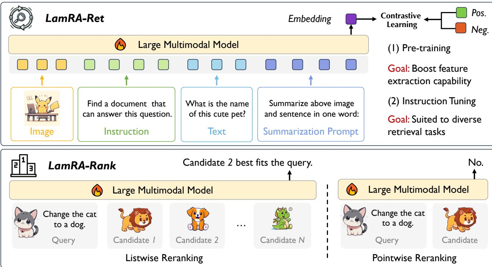

# 1. 论文基本信息

## 1.1. 标题
**LamRA: Large Multimodal Model as Your Advanced Retrieval Assistant**

## 1.2. 作者
**Yikun Liu\*, Pingan Chen, Jiayin Cai, Xiaolong Jiang, Yao Hu, Jiangchao Yao, Yanfeng Wang†, Weidi Xie†**

*   **研究背景与隶属机构：** 作者主要来自 **上海交通大学** 的人工智能学院和 CMIC 中心，以及 **小红书** 公司。这表明该研究具有学术与工业界紧密结合的背景，旨在解决实际应用中的复杂检索问题。

## 1.3. 发表期刊/会议
**arXiv 预印本**
*   **状态：** 该论文目前发布于 arXiv，属于计算机科学领域的预印本，尚未经过正式的同行评审会议或期刊发表，但代表了该领域的最新研究进展。

## 1.4. 发表年份
**2024** (发布于 2024-12-02)

## 1.5. 摘要
随着多模态信息检索的快速发展，出现了日益复杂的检索任务。现有方法主要依赖于针对特定任务微调的视觉语言模型，这些模型通常通过图像-文本对比学习进行训练。本文探讨了将生成式大型多模态模型重新用于检索任务的可能性。这种方法使得所有检索任务能够在统一的框架下进行，更重要的是，允许在无需额外训练的情况下向未见过的检索任务进行外推。主要贡献包括：(i) 引入了 LamRA，一个旨在赋予 LMMs 复杂检索和重排序能力的通用框架；(ii) 对于检索，采用包含仅语言预训练和多模态指令微调的两阶段训练策略，逐步提升 LMM 的检索性能；(iii) 对于重排序，采用逐点和列表重排序的联合训练，提供两种不同的方式进一步提升检索性能；(iv) 大量实验结果证明了该方法在处理十多种检索任务中的有效性，在监督和零样本设置下均表现出鲁棒性能，包括涉及未见过的检索任务场景。

## 1.6. 原文链接
*   **ArXiv 链接：** https://arxiv.org/abs/2412.01720
*   **PDF 链接：** https://arxiv.org/pdf/2412.01720v1
*   **发布状态：** 预印本

# 2. 整体概括

## 2.1. 研究背景与动机
*   **核心问题：** 传统的多模态检索（如 CLIP）主要处理简单的图像-文本对齐检索。然而，现实需求正转向更复杂的任务，例如组合图像检索（基于参考图像和文本修改描述检索）、长文本图像检索以及多模态文档检索。现有的解决方案往往需要为每个特定任务设计并微调专门的模型，这不仅繁琐且劳动密集，而且难以泛化到新的、未见过的任务类型。
*   **挑战与空白：** 现有的双编码器架构（如 CLIP）在处理交织的图像-文本输入（即输入中同时包含图像和文本的混合序列）时存在局限性，且对复杂文本的理解能力有限。虽然大型多模态模型（LMMs，如 LLaVA）在视觉问答和推理方面表现出色，但它们主要被设计为生成式模型，直接用于检索任务（需要计算嵌入向量相似度）并非其原生强项。
*   **切入点与创新思路：** 本文提出“重新利用”生成式 LMMs 来执行检索任务。通过巧妙的提示工程和轻量级的适配器训练，将 LMMs 转化为通用的检索器和重排序器。这种思路利用了 LMMs 强大的语言理解能力和世界知识，旨在建立一个统一的检索框架，能够处理多种模态组合的查询，并具备零样本泛化能力。

## 2.2. 核心贡献/主要发现
*   **LamRA 框架：** 提出了一个通用的框架，通过插入轻量级的 LoRA 模块，赋予现有的 LMMs（如 Qwen2-VL）强大的检索和重排序能力。
*   **两阶段检索训练：** 设计了针对检索任务的训练策略。第一阶段在 NLI 数据集上进行仅语言预训练，使模型学会输出高质量的嵌入；第二阶段在 M-BEIR 多模态数据集上进行指令微调，使模型适应多种检索任务。
*   **联合重排序训练：** 提出了 LamRA-Rank，支持逐点重排序和列表重排序。通过挖掘检索模型输出的困难负样本，联合训练这两种重排序方式，显著提升了最终排序的准确性。
*   **卓越的泛化能力：** 实验证明，LamRA 不仅在监督设置下超越了现有的最先进模型（如 UniIR-CLIP），而且在未见过的数据集和检索任务上展现出强大的零样本性能，证明了 LMMs 作为通用检索器的巨大潜力。

# 3. 预备知识与相关工作

## 3.1. 基础概念
为了理解本文，读者需要掌握以下核心概念：

*   **视觉语言模型：** 这是一类旨在同时理解图像和文本的模型。最典型的代表是 CLIP，它通过对比学习将图像和文本映射到共享的潜在空间，使得语义相关的图像和文本在空间中距离更近。
*   **大型多模态模型：** 这类模型通常以大型语言模型（LLM）为核心，连接视觉编码器，从而具备处理视觉和语言输入并生成文本输出的能力。例如 LLaVA，它不仅能识别物体，还能进行复杂的视觉推理和对话。
*   **检索与重排序：**
    *   **检索：** 通常指从海量候选库中快速筛选出最相关的一小部分结果（如 Top-K）。这一步要求计算速度快，通常使用双塔模型。
    *   **重排序：** 对检索阶段返回的少量候选结果进行更精细的重新打分和排序。这一步可以使用更复杂、计算量更大的模型（如交叉注意力模型或 LMM），以追求更高的排序精度。
*   <strong>LoRA (Low-Rank Adaptation)：</strong> 一种高效的大模型微调技术。它冻结预训练模型的权重，并在 Transformer 层中注入可训练的低秩分解矩阵，从而大幅减少可训练参数数量和显存占用。
*   **对比学习与 InfoNCE 损失：** 一种自监督学习方法，通过拉近正样本对、推远负样本对来学习特征表示。InfoNCE 是其中常用的损失函数。

## 3.2. 前人工作
*   **多模态信息检索：** 早期工作集中在简单的跨模态检索（如 MSCOCO, Flickr30K）。随着任务复杂化，出现了组合图像检索和长文本检索等任务。UniIR 等工作尝试通过在统一基准上训练来提升模型的通用性，但多基于双编码器架构。
*   **多模态表示学习：** CLIP 和 ALIGN 奠定了基于对比学习的多模态表示基础。E5-V 探索了利用 LMM 将图像和文本映射到共享语言空间的方法，但在某些复杂任务上表现有限。
*   **大型多模态模型：** LLaVA, LISA 等工作展示了 LMMs 在视觉理解、分割等任务上的强大能力。然而，将 LMMs 应用于通用检索任务的研究相对较少，这正是本文的切入点。

## 3.3. 技术演进
该领域从简单的双塔对比模型（CLIP）演进到能够处理复杂指令的 LMMs。早期方法受限于架构，难以处理交织的图文输入和复杂的语义理解。随着 LLM 的兴起，研究趋势转向利用 LMMs 强大的语义理解能力来解决更复杂的视觉语言任务。本文处于这一技术脉络的前沿，试图打破“生成式”与“判别式/检索式”任务的界限。

## 3.4. 差异化分析
与现有的双编码器检索模型（如 UniIR-CLIP）相比，LamRA 的核心区别在于：
1.  **架构不同：** LamRA 基于单编码器的生成式 LMM，利用其全量交互的注意力机制，天然支持交织的图文输入；而双编码器分别处理图像和文本，缺乏交互。
2.  **训练目标不同：** 传统方法主要依赖对比损失；LamRA 在检索阶段也使用对比损失，但在重排序阶段引入了生成式的目标（如输出 YES/NO 或位置编号），利用了 LMM 的生成能力。
3.  **泛化机制：** LamRA 依托 LMM 的强大预训练知识，展现出更好的零样本泛化能力，尤其是在未见过的复杂任务上。

# 4. 方法论

## 4.1. 方法原理
LamRA 的核心思想是将生成式大型多模态模型（LMM）转化为一个通用的检索和重排序引擎。它不改变 LMM 的底层架构，而是通过特定的提示技术提取嵌入向量用于检索，并通过指令微调让模型学会对候选结果进行打分或排序。整个框架分为两个主要组件：**LamRA-Ret**（负责快速检索）和 **LamRA-Rank**（负责精细重排序）。

## 4.2. 核心方法详解

### 4.2.1. 问题表述
给定一个查询 $q$（可以是图像、文本或交织格式）和一个候选集 $\Omega = \{c_1, c_2, ..., c_N\}$，目标是对 $\Omega$ 中的候选项进行排序。
1.  **检索阶段：** 提取查询和所有候选项的嵌入，计算余弦相似度，得到 Top-K 候选集 $\mathcal{C}_1$。
2.  **重排序阶段：** 对 $\mathcal{C}_1$ 中的候选项进行精细打分，得到最终排序结果 $\mathcal{C}_2$。

### 4.2.2. 架构与特征提取
LamRA 基于 Qwen2-VL 等现有 LMM，通过插入 LoRA 模块进行适配。为了从生成式模型中提取适用于检索的判别式特征，作者采用了 **显式单词限制** 方法。

具体操作如下：
*   **提示构造：** 针对不同输入构造特定提示，要求模型以一个特殊的词元 $<emb>$ 结尾。
    *   图像输入：$<image> Summarize above image in one word: <emb>$
    *   文本输入：$<text> Summarize above sentence in one word: <emb>$
    *   混合输入：$<image1><text1>... Summarize above image and sentence in one word: <emb>$
*   **特征提取：** 将输入送入 LMM，提取 $<emb>$ 词元位置对应的最后一个隐藏层状态作为该输入的嵌入向量。

### 4.2.3. 训练 LamRA-Ret (检索器)
为了赋予 LMM 检索能力，作者设计了两阶段训练策略。

**阶段 I：仅语言预训练**
*   **目的：** 适应 LMM 从生成任务转向检索任务，使其学会输出有意义的嵌入。
*   **数据：** 使用 NLI（自然语言推理）数据集，包含文本对。
*   **方法：** 训练 LoRA 模块，使用 InfoNCE 损失拉近相关文本对的嵌入距离。

**阶段 II：多模态指令微调**
*   **目的：** 适应多模态检索任务。
*   **数据：** 使用 M-BEIR 数据集，包含 8 种不同的检索任务。
*   **方法：** 针对不同任务加入特定指令（如 "retrieve a similar image"），继续微调 LoRA。

<strong>训练目标 (InfoNCE 损失)</strong>
在上述两个阶段中，均使用对比学习损失函数。对于批次大小为 $B$ 的数据，目标是使查询查询 $q_n$ 与其正样本 $c_n$ 的嵌入相似度最高，而与批次内其他负样本 $c_m$ 的相似度尽可能低。

具体的损失函数公式如下：

$$
\mathcal{L}_{\text{ret}} = -\frac{1}{B} \sum_{n=1}^{B} \log \left[ \frac{\exp\left[ \kappa(\text{LMM}(q_n), \text{LMM}(c_n)) / \tau \right]}{\sum_{m=1}^{B} \exp\left[ \kappa(\text{LMM}(q_n), \text{LMM}(c_m)) / \tau \right]} \right]
$$

*   **符号解释：**
    *   $\mathcal{L}_{\text{ret}}$：检索任务的总损失。
    *   $B$：训练时的批次大小。
    *   $n$：批次内当前样本的索引。
    *   $q_n$：第 $n$ 个查询样本。
    *   $c_n$：第 $n$ 个查询对应的正样本（正确答案）。
    *   $c_m$：批次内第 $m$ 个样本（作为负样本）。
    *   $\text{LMM}(\cdot)$：特征提取过程，即通过 LMM 提取输入的嵌入向量。
    *   $\kappa(\cdot, \cdot)$：余弦相似度计算函数。
    *   $\tau$：温度参数，用于控制 softmax 分布的尖锐程度。
    *   $\exp$：以自然常数 $e$ 为底的指数函数。

### 4.2.4. 训练 LamRA-Rank (重排序器)
为了进一步提升性能，作者训练了一个额外的 LoRA 模块用于重排序。它利用 LMM 处理长文本或多图像的能力，对检索器返回的 Top-K 结果进行精排。

**数据收集**
利用训练好的 LamRA-Ret 对每个查询检索 Top-100 个候选项，其中包含正确答案和困难负样本，以此作为重排序模型的训练数据。

**联合训练策略**
LamRA-Rank 同时支持两种重排序模式，并进行联合训练：

1.  **逐点重排序：**
    *   **输入：** 查询 $q$ 和一个候选项 $c$（可以是正样本 $c_{\text{pos}}$ 或负样本 $c_{\text{neg}}$）。
    *   **指令：** 要求模型判断该候选项是否相关。对于正样本期望输出 "YES"，对于负样本期望输出 "NO"。
    *   **损失：** 使用交叉熵损失 $\mathcal{L}_{\text{ce}}$。
    *   **公式：** $\mathcal{L}_{\text{point}} = \mathcal{L}_{\text{ce}}(\text{YES}, \text{Reranker}(q, c_{\text{pos}})) + \mathcal{L}_{\text{ce}}(\text{NO}, \text{Reranker}(q, c_{\text{neg}}))$。

2.  **列表重排序：**
    *   **输入：** 查询 $q$ 和多个候选项列表（包含正样本 $c_{\text{pos}}$ 和 $M$ 个负样本 $c_1, ..., c_M$）。
    *   **指令：** 要求模型直接输出正样本在列表中的位置编号。
    *   **损失：** 使用交叉熵损失 $\mathcal{L}_{\text{ce}}$。
    *   **公式：** $\mathcal{L}_{\text{list}} = \mathcal{L}_{\text{ce}}(\text{GT-POSITION}, \text{Reranker}(q, c_{\text{pos}}, c_1, ..., c_M))$。

**最终重排序损失**
总损失是逐点损失和列表损失的加权和：

$$
\mathcal{L}_{\text{rank}} = \mathcal{L}_{\text{point}} + \mathcal{L}_{\text{list}}
$$

### 4.2.5. 推理流程
在推理阶段，LamRA 结合检索器和重排序器的结果：

1.  **检索得分：** 使用 LamRA-Ret 计算查询与所有候选项的余弦相似度 $S_{\text{ret}}$，选出 Top-K。
2.  **重排序得分：** 使用 LamRA-Rank 对 Top-K 候选项进行打分。
    *   若使用逐点模式：得分 $S_{\text{rank}}$ 为模型输出 "YES" 的概率。
    *   若使用列表模式：模型直接输出排序结果。
3.  **最终得分：** 将检索得分和重排序得分进行加权融合，公式为：
    $$
    S = \alpha \times S_{\text{ret}} + (1 - \alpha) \times S_{\text{rank}}
    $$
    其中 $\alpha$ 是可调超参数，默认设为 0.5。

下图展示了 LamRA 框架的整体架构与训练流程：

*该图像是示意图，展示了 LamRA 框架在大型多模态模型中的检索与重排序流程。通过对图像和文本的预训练和指令调优，旨在提升检索性能。图中也分别阐述了列表重排序和点对点重排序的方法与目标。*

# 5. 实验设置

## 5.1. 数据集
实验使用了多种数据集来全面评估模型性能：

*   **M-BEIR：** 一个包含 8 种不同检索任务（10 个数据集）的统一基准，涵盖图像到图像、文本到图像、组合检索等多种场景。这是主要的评估基准。
*   **未见过的数据集：** 用于测试零样本泛化能力，包括 ShareGPT4V（长文本）、Urban-1K、CIRCO（组合检索）、Visual Dialog（对话检索）等。
*   **预训练数据集：** 使用 NLI 数据集进行第一阶段的文本预训练。

    以下是原文 Table 1 的结果，总结了评估基准的详细信息：

    | Benchmark | Zero-shot | # Queries | # Candidates |
    | :--- | :--- | :--- | :--- |
    | M-BEIR [51] | X | 190K | 5.6M |
    | ShareGPT4V [58] | V | 1K | 1K |
    | Urban-1K [58] | v | 1K | 1K |
    | Flickr30K [41] | v | 1K | 5K |
    | CIRCO [2] | v | 800 | 120K |
    | GeneCIS [45] | v | 8K | 10 ~ 15 |
    | Visual Storytelling [14] | V | 5K | 8K |
    | Visual Dialog [9] | v | 2K | 2K |
    | Multi-round FashionIQ [56] | v | 2.4K | 6.2K |
    | CC-Neg [43] | | 40K | 2 |
    | Sugar-Crepe [12] | v | 7.5K | 2 |

## 5.2. 评估指标
论文主要使用了以下指标：

1.  <strong>Recall@K (召回率@K)</strong>
    *   **概念定义：** 衡量在前 $K$ 个返回结果中，是否包含至少一个正确答案。它反映了检索系统找回相关文档的能力。$K$ 通常取 1, 5, 10。
    *   **数学公式：**
        $$
        \text{Recall@K} = \frac{1}{|Q|} \sum_{q \in Q} \mathbb{I}(\text{rank}(q, \text{gt}) \leq K)
        $$
    *   **符号解释：**
        *   $|Q|$：查询集合的总数量。
        *   $q$：单个查询。
        *   $\text{rank}(q, \text{gt})$：查询 $q$ 的真实标注结果在检索结果列表中的排名位置。
        *   $\mathbb{I}(\cdot)$：指示函数，如果条件为真则输出 1，否则为 0。

2.  <strong>Accuracy (准确率)</strong>
    *   **概念定义：** 用于图像-文本匹配任务，指模型预测正确的样本占总样本的比例。
    *   **数学公式：**
        $$
        \text{Accuracy} = \frac{\text{Number of correct predictions}}{\text{Total number of predictions}}
        $$

## 5.3. 对比基线
论文将 LamRA 与以下几类基线模型进行了对比：
*   **传统双编码器模型：** CLIP, SigLIP, BLIP, BLIP2。这些是经典的视觉语言预训练模型。
*   **通用检索模型：** UniIR-BLIP, UniIR-CLIP。这些是在 M-BEIR 上训练过的强基线。
*   **基于 LMM 的模型：** Qwen2-VL-7B（原始零样本性能）。
*   **其他零样本/通用模型：** E5-V, MagicLens, EVA-CLIP。用于在未见过的数据集上进行对比。

# 6. 实验结果与分析

## 6.1. 核心结果分析
实验结果强有力地验证了 LamRA 的有效性。在 M-BEIR 基准上，LamRA 在大多数任务上显著优于现有的双编码器模型（如 UniIR-CLIP）。特别是在复杂的任务（如组合检索 $(qi, qt) -> ci$）上，LamRA 的优势更加明显，这得益于 LMM 对复杂文本和交织模态输入的强大理解能力。此外，引入重排序模块后，性能平均提升了 7.1 个百分点，证明了重排序策略的有效性。

以下是原文 Table 2 的结果，展示了在 M-BEIR 基准上的详细性能对比：

<table>
<thead>
<tr>
<th rowspan="2">Methods</th>
<th colspan="3">$q^t \to c^i$</th>
<th colspan="2">$q^t \to c^t$</th>
<th colspan="2">$q^t \to (c^i, c^t)$</th>
<th colspan="3">$q^i \to c^t$</th>
<th>$q^i \to c^i$</th>
<th colspan="2">$(q^i, q^t) \to c^t$</th>
<th colspan="2">$(q^i, q^t) \to c^i$</th>
<th colspan="2">$(q^i, q^t) \to (c^i, c^t)$</th>
<th rowspan="2">Avg.</th>
</tr>
<tr>
<th>VN</th>
<th>COCO</th>
<th>F200K</th>
<th>WebQA</th>
<th>EDIS</th>
<th>WebQA</th>
<th>VN</th>
<th>COCO</th>
<th>F200K</th>
<th>NIGHTS</th>
<th>OVEN</th>
<th>InfoS</th>
<th>FIQ</th>
<th>CIRR</th>
<th>OVEN</th>
<th>InfoS</th>
</tr>
<tr>
<th></th>
<th>R@5</th>
<th>R@5</th>
<th>R@10</th>
<th>R@5</th>
<th>R@5</th>
<th>R@5</th>
<th>R@5</th>
<th>R@5</th>
<th>R@10</th>
<th>R@5</th>
<th>R@5</th>
<th>R@5</th>
<th>R@5</th>
<th>R@10</th>
<th>R@5</th>
<th>R@5</th>
</tr>
</thead>
<tbody>
<tr>
<td>CLIP-L [42]</td>
<td>43.3</td>
<td>61.1</td>
<td>6.6</td>
<td>36.2</td>
<td>43.3</td>
<td>41.3</td>
<td>79.0</td>
<td>7.7</td>
<td>26.1</td>
<td>24.2</td>
<td>20.5</td>
<td>7.0</td>
<td>13.2</td>
<td>38.8</td>
<td>26.4</td>
<td>32.5</td>
</tr>
<tr>
<td>SigLIP [57]</td>
<td>30.1</td>
<td>75.7</td>
<td>36.5</td>
<td>39.8</td>
<td>27.0</td>
<td>45.1</td>
<td>43.5</td>
<td>30.8</td>
<td>88.2</td>
<td>34.2</td>
<td>28.9</td>
<td>29.7</td>
<td>25.1</td>
<td>14.4</td>
<td>22.7</td>
<td>41.7</td>
<td>27.4</td>
<td>37.2</td>
</tr>
<tr>
<td>BLIP [24]</td>
<td>16.4</td>
<td>74.4</td>
<td>15.9</td>
<td>44.9</td>
<td>26.8</td>
<td>20.3</td>
<td>17.2</td>
<td>83.2</td>
<td>19.9</td>
<td>27.4</td>
<td>16.1</td>
<td>10.2</td>
<td>2.3</td>
<td>10.6</td>
<td>27.4</td>
<td>16.6</td>
<td>26.8</td>
</tr>
<tr>
<td>BLIP2 [25]</td>
<td>16.7</td>
<td>63.8</td>
<td>14.0</td>
<td>38.6</td>
<td>26.9</td>
<td>24.5</td>
<td>15.0</td>
<td>80.0</td>
<td>14.2</td>
<td>25.4</td>
<td>12.2</td>
<td>5.5</td>
<td>4.4</td>
<td>11.8</td>
<td>27.3</td>
<td>15.8</td>
<td>24.8</td>
</tr>
<tr>
<td>Qwen2-VL-7B [46]</td>
<td>9.3</td>
<td>55.1</td>
<td>5.0</td>
<td>42.0</td>
<td>26.2</td>
<td>9.4</td>
<td>5.4</td>
<td>46.6</td>
<td>4.0</td>
<td>21.3</td>
<td>21.4</td>
<td>22.5</td>
<td>4.3</td>
<td>16.3</td>
<td>43.6</td>
<td>36.2</td>
<td>23.0</td>
</tr>
<tr>
<td colspan="18">Supervised - Dual Encoder</td>
</tr>
<tr>
<td>UniIR-BLIP [51]</td>
<td>23.4</td>
<td>79.7</td>
<td>26.1</td>
<td>80.0</td>
<td>50.9</td>
<td>79.8</td>
<td>22.8</td>
<td>89.9</td>
<td>28.9</td>
<td>33.0</td>
<td>41.0</td>
<td>22.4</td>
<td>29.2</td>
<td>52.2</td>
<td>55.8</td>
<td>33.0</td>
<td>46.8</td>
</tr>
<tr>
<td>UniIR-CLIP [51]</td>
<td>42.6</td>
<td>81.1</td>
<td>18.0</td>
<td>84.7</td>
<td>59.4</td>
<td>78.7</td>
<td>43.1</td>
<td>92.3</td>
<td>18.3</td>
<td>32.0</td>
<td>45.5</td>
<td>27.9</td>
<td>24.4</td>
<td>44.6</td>
<td>67.6</td>
<td>48.9</td>
<td>50.6</td>
</tr>
<tr>
<td colspan="18">Supervised - LMMs</td>
</tr>
<tr>
<td>LamRA-Ret</td>
<td>41.6</td>
<td>81.5</td>
<td>28.7</td>
<td>86.0</td>
<td>62.6</td>
<td>81.2</td>
<td>39.6</td>
<td>90.6</td>
<td>30.4</td>
<td>32.1</td>
<td>54.1</td>
<td>52.1</td>
<td>33.2</td>
<td>53.1</td>
<td>76.2</td>
<td>63.3</td>
<td>56.6</td>
</tr>
<tr>
<td>LamRA</td>
<td>48.0</td>
<td>85.2</td>
<td>32.9</td>
<td>96.7</td>
<td>75.8</td>
<td>87.7</td>
<td>48.6</td>
<td>92.3</td>
<td>36.1</td>
<td>33.5</td>

更正：上一行 LamRA 数据不完整，根据原文 Table 2 内容补全：
      <td>59.2</td>
      <td>64.1</td>
      <td>37.8</td>
      <td>63.3</td>
      <td>79.2</td>
      <td>78.3</td>
      <td>63.7</td>
    </tr>
  </tbody>
</table>

## 6.2. 数据呈现 (表格)

### 6.2.1. 未见过的任务泛化能力
为了测试模型在完全未见过的任务类型上的表现，作者在训练时排除了三个任务（图像到图像、文本-图像到文本、文本-图像到文本-图像），然后在测试时评估这些任务。结果显示，LamRA 即使在零样本设置下，也能在这些排除的任务上取得与甚至超过全监督训练的 UniIR-CLIP 相当的性能。

以下是原文 Table 3 的结果，展示了在未见过的任务上的泛化实验：

<table>
<thead>
<tr>
<th rowspan="2">Methods</th>
<th>$q^i \to c^i$</th>
<th colspan="2">$(q^i, q^t) \to c^t$</th>
<th colspan="2">$(q^i, q^t) \to (c^i, c^t)$</th>
<th rowspan="2">Avg.</th>
</tr>
<tr>
<th>NIGHTS R@5</th>
<th>OVEN R@5</th>
<th>InfoS R@5</th>
<th>OVEN R@5</th>
<th>InfoS R@5</th>
</tr>
</thead>
<tbody>
<tr>
<td colspan="6">Supervised</td>
<td></td>
</tr>
<tr>
<td>UniIR-BLIP [51]</td>
<td>33.0</td>
<td>41.0</td>
<td>22.4</td>
<td>55.8</td>
<td>33.0</td>
<td>37.0</td>
</tr>
<tr>
<td>UniIR-CLIP [51]</td>
<td>32.0</td>
<td>45.5</td>
<td>27.9</td>
<td>67.6</td>
<td>48.9</td>
<td>44.4</td>
</tr>
<tr>
<td colspan="6">Zero-shot</td>
<td></td>
</tr>
<tr>
<td>LamRA-Ret*</td>
<td>27.2</td>
<td>44.7</td>
<td>44.0</td>
<td>62.8</td>
<td>49.5</td>
<td>45.6</td>
</tr>
<tr>
<td>LamRA*</td>
<td>29.2</td>
<td>46.9</td>
<td>54.2</td>
<td>65.1</td>
<td>59.1</td>
<td>50.9</td>
</tr>
</tbody>
</table>

### 6.2.2. 未见过的数据集泛化能力
在 10 个未见过的数据集上，LamRA 同样表现出优异的泛化能力，特别是在长文本检索（Urban-1K）和对话检索（Visual Dialog）等复杂任务上，显著优于双编码器方法。

以下是原文 Table 4 的结果，展示了在未见过的数据集上的性能：

<table>
<thead>
<tr>
<th rowspan="3">Methods</th>
<th colspan="3">$q^t \to c^i$</th>
<th colspan="3">$q^i \to c^t$</th>
<th colspan="2">$(q^i, q^t) \to c^i$</th>
<th>$q^{dialog} \to c^i$</th>
<th colspan="2">$(q^i, q^t) \to c^i$</th>
<th colspan="2">ITM</th>
</tr>
<tr>
<th>Share4V</th>
<th>Urban*</th>
<th>Flickr</th>
<th>Share4V</th>
<th>Urban*</th>
<th>Flickr</th>
<th>CIRCO*</th>
<th>GeneCIS*</th>
<th>VisD*</th>
<th>VIST</th>
<th>MT-FIQ*</th>
<th>CC-Neg</th>
<th>Sugar-Crepe*</</th>
</tr>
<tr>
<th>R@1</th>
<th>R@1</th>
<th>R@1</th>
<th>R@1</th>
<th>R@1</th>
<th>R@1</th>
<th>MAP@5</th>
<th>R@1</th>
<th>R@1</th>
<th>R@5</th>
<th>Acc.</th>
<th>Acc.</th>
</tr>
</thead>
<tbody>
<tr>
<td>CLIP-L [42]</td>
<td>84.0</td>
<td>52.8</td>
<td>67.3</td>
<td>81.8</td>
<td>68.7</td>
<td>87.2</td>
<td>4.0</td>
<td>13.3</td>
<td>23.7</td>
<td>0.6</td>
<td>17.7</td>
<td>66.7</td>
<td>73.0</td>
</tr>
<tr>
<td>Long-CLIP-L [58]</td>
<td>95.6</td>
<td>86.1</td>
<td>76.1</td>
<td>95.8</td>
<td>82.7</td>
<td>89.3</td>
<td>5.7</td>
<td>16.3</td>
<td>37.9</td>
<td>1.1</td>
<td>18.5</td>
<td>76.3</td>
<td>80.9</td>
</tr>
<tr>
<td>UniIR-CLIP [51]</td>
<td>85.8</td>
<td>75.0</td>
<td>78.7</td>
<td>84.1</td>
<td>78.4</td>
<td>94.2</td>
<td>12.5</td>
<td>16.8</td>
<td>26.8</td>
<td>0.6</td>
<td>39.4</td>
<td>79.9</td>
<td>80.3</td>
</tr>
<tr>
<td>E5-V [18]</td>
<td>86.7</td>
<td>84.0</td>
<td>79.5</td>
<td>84.0</td>
<td>82.4</td>
<td>88.2</td>
<td>24.8</td>
<td>18.5</td>
<td>54.6</td>
<td>10.0</td>
<td>19.2</td>
<td>83.2</td>
<td>84.7</td>
</tr>
<tr>
<td>MagicLens-L [59]</td>
<td>85.5</td>
<td>59.3</td>
<td>72.5</td>
<td>60.9</td>
<td>24.2</td>
<td>84.6</td>
<td>29.6</td>
<td>16.3</td>
<td>28.0</td>
<td>3.3</td>
<td>22.6</td>
<td>62.7</td>
<td>75.9</td>
</tr>
<tr>
<td>EVA-CLIP-8B [44]</td>
<td>91.2</td>
<td>77.8</td>
<td>80.8</td>
<td>93.1</td>
<td>80.4</td>
<td>95.6</td>
<td>6.0</td>
<td>13.1</td>
<td>23.2</td>
<td>1.2</td>
<td>22.1</td>
<td>59.4</td>
<td>81.7</td>
</tr>
<tr>
<td>EVA-CLIP-18B [44]</td>
<td>92.1</td>
<td>81.7</td>
<td>83.3</td>
<td>94.0</td>
<td>83.3</td>
<td>96.7</td>
<td>6.1</td>
<td>13.6</td>
<td>24.7</td>
<td>1.0</td>
<td>21.9</td>
<td>63.8</td>
<td>83.1</td>
</tr>
<tr>
<td>LamRA-Ret</td>
<td>93.3</td>
<td>95.1</td>
<td>82.8</td>
<td>88.1</td>
<td>94.3</td>
<td>92.7</td>
<td>33.2</td>
<td>18.9</td>
<td>62.8</td>
<td>23.1</td>
<td>60.9</td>
<td>79.6</td>
<td>85.8</td>
</tr>
<tr>
<td>LamRA</td>
<td>97.9</td>
<td>98.8</td>
<td>88.1</td>
<td>96.5</td>
<td>98.0</td>
<td>97.6</td>
<td>42.8</td>
<td>24.8</td>
<td>70.9</td>
<td>28.6</td>
<td>63.9</td>
<td>85.9</td>
<td>93.5</td>
</tr>
</tbody>
</table>

## 6.3. 消融实验/参数分析

### 6.3.1. 两阶段训练的有效性
作者验证了预训练和指令微调两个阶段的必要性。结果显示，移除任何一个阶段都会导致性能下降，特别是移除预训练阶段，平均性能下降了 3 个百分点。这证明了两阶段策略对于逐步提升检索性能至关重要。

以下是原文 Table 5 的结果，展示了两阶段训练的效果：

| Pre-training | Instruction tuning | Avg. |
| :--- | :--- | :--- |
| | X | 23.0 (-33.6) |
| X | | 36.2 (-20.4) |
| | | 53.6 (-3.0) |
| X | X | 56.6 |

### 6.3.2. 缩放趋势
实验还探讨了模型大小对性能的影响。对比 Qwen2-VL-2B 和 Qwen2-VL-7B 的结果发现，随着模型参数量的增加，检索性能也随之提升，这表明 LamRA 框架具有很好的可扩展性。

以下是原文 Table 6 的结果，展示了缩放趋势：

| LMMs | LamRA-Ret | LamRA-Rank | Avg. |
| :--- | :--- | :--- | :--- |
| Qwen2-VL-2B [46] | v | × | 51.6 |
| | | v | 58.3 |
| Qwen2-VL-7B [46] | v | × | 56.6 |
| | | v | 63.7 |

### 6.3.3. 逐点 vs 列表重排序
作者对比了两种重排序方式。逐点重排序虽然计算开销较大（需要对每个候选项单独推理），但不受上下文长度限制；列表重排序速度快，但受限于 LLM 的上下文窗口大小。两者在性能上差异不大，可根据实际应用场景灵活选择。

以下是原文 Table 7 的结果，对比了逐点和列表重排序的性能与成本：

| Task | LamRA-Ret R@1 | LamRA-Rank(P) R@1 | Time | LamRA-Rank(L) R@1 | Time |
| :--- | :--- | :--- | :--- | :--- | :--- |
| $q^t \to c^t$ | 58.2 | 75.9 | 0.020s | 75.9 | 0.010s |
| $(q^i, q^t) \to c^i$ | 18.5 | 24.5 | 0.071s | 24.3 | 0.067s |
| $(q^i, q^t) \to c^t$ | 30.1 | 37.3 | 0.047s | 36.6 | 0.017s |
| $(q^i, q^t) \to (c^i, c^t)$ | 33.4 | 39.9 | 0.084s | 39.5 | 0.085s |

下图展示了 LamRA 在不同检索任务上的定性结果，包括组合图像检索和文本-图像到文本-图像检索等复杂场景：

*该图像是示意图，展示了多模态检索任务的不同实例与检索结果。左侧展示了与给定描述相似的图像，而右侧则展示了与给定标题匹配的日常视频和新闻图像。此框架结合了语言和视觉信息，适用于复杂的检索任务。*

# 7. 总结与思考

## 7.1. 结论总结
LamRA 成功地证明了生成式大型多模态模型（LMMs）可以通过简单的 LoRA 适配和特定的训练策略，转化为强大的通用检索和重排序系统。其两阶段训练策略和联合重排序机制有效地解决了 LMM 在检索任务中的适配问题。实验结果表明，LamRA 不仅在监督设置下达到了最先进水平，更重要的是展现出了卓越的零样本泛化能力，能够处理未见过的数据集和任务类型。

## 7.2. 局限性与未来工作
*   **推理成本：** 作者承认，使用 LMMs 进行检索和重排序的主要缺点是推理成本较高。虽然可以通过预提取特征或部署在低 QPS 场景来缓解，但这仍是限制其实时性应用的关键因素。
*   **上下文长度限制：** 列表重排序模式受到 LLM 上下文窗口长度的限制，无法一次处理过多的候选项。
*   **未来方向：** 作者建议未来可以探索如何进一步降低推理成本，以及如何将视频数据整合到框架中，以扩展到视频检索领域。

## 7.3. 个人启发与批判
*   **范式转变：** LamRA 代表了一种从与其他“判别式检索”向“生成式检索”转变的有益探索。利用 LLM 强大的语义理解能力来弥补传统双编码器在处理复杂指令和交织模态输入上的不足，是一个非常直观且有效的思路。
*   **统一框架的价值：** 论文强调了统一框架的重要性。通过将所有任务转化为统一的“提示+嵌入提取”或“提示+生成”格式，极大地简化了多任务处理的流程。
*   **潜在问题：** 虽然性能提升显著，但推理效率的瓶颈不容忽视。在实际工业界应用中，LamRA 可能更适合作为离线索引构建或精排阶段的组件，而难以直接替代毫秒级响应的粗排检索器。此外，EOL 提示方法的有效性高度依赖于 LMM 遵循指令的能力，这可能在不同模型间存在差异。
*   **改进空间：** 未来的研究可以探索更高效的检索器微调方法（如仅微调投影层而非 LLM），或者开发知识蒸馏技术，将 LamRA 的能力迁移到更小的模型中，以解决速度问题。