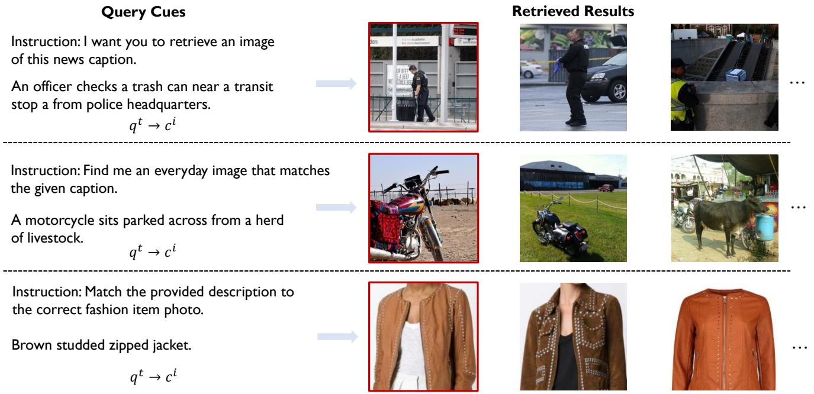
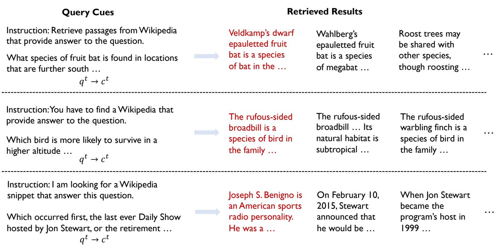
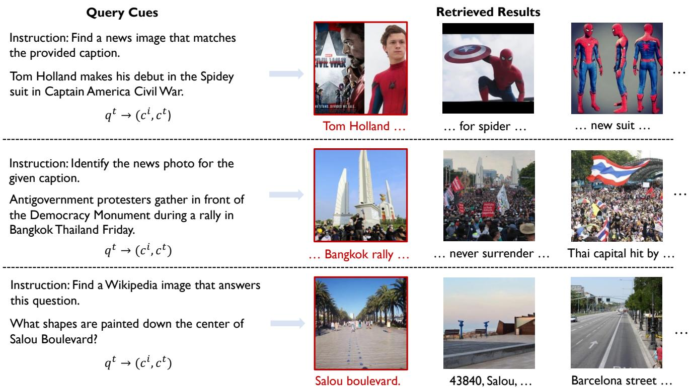
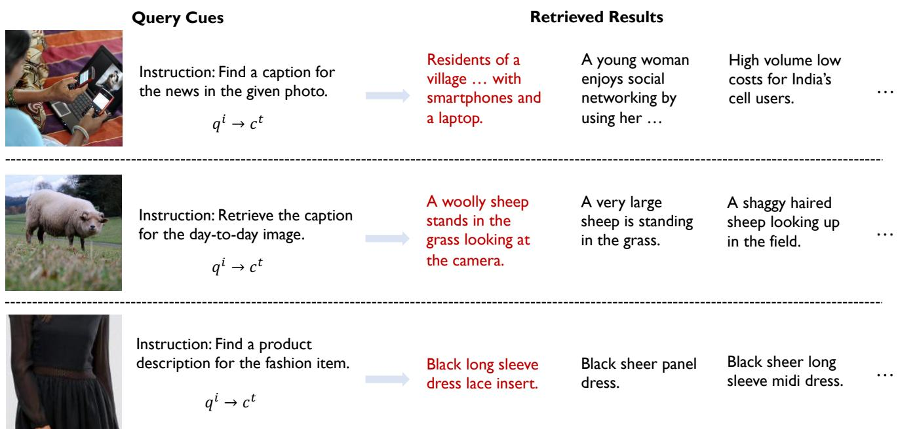
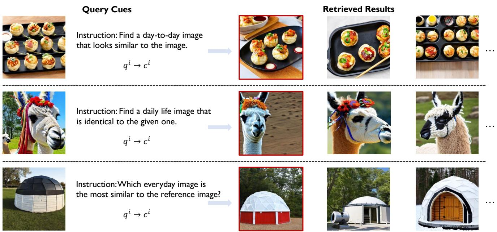
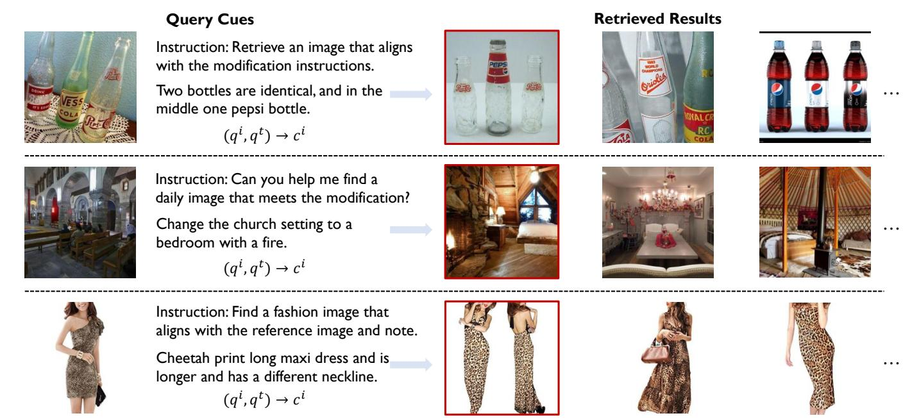
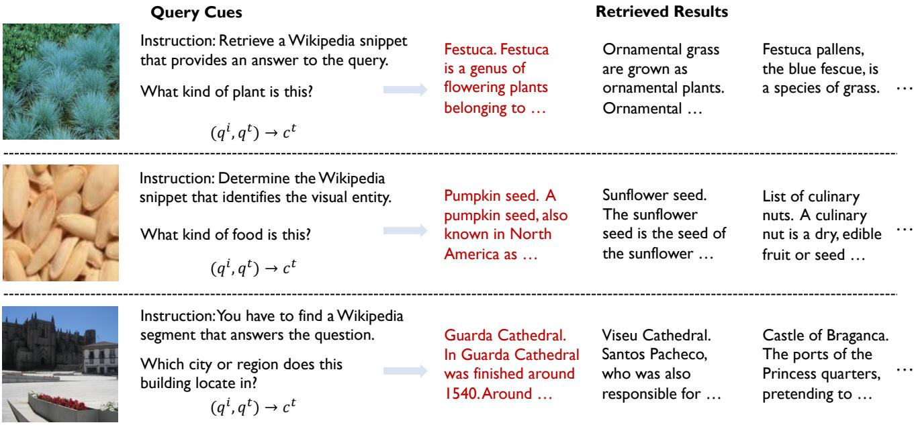
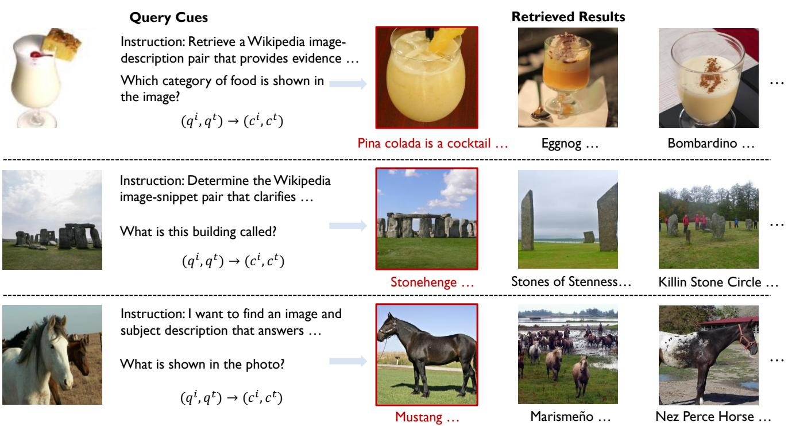
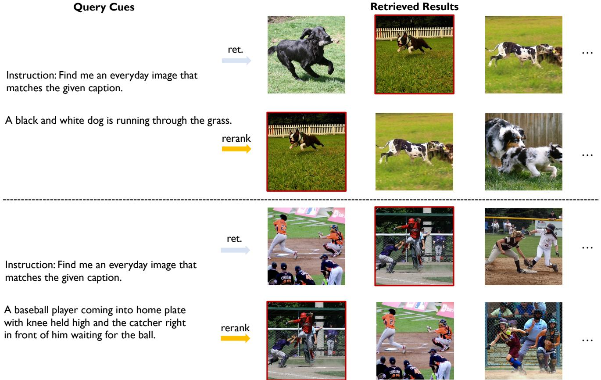
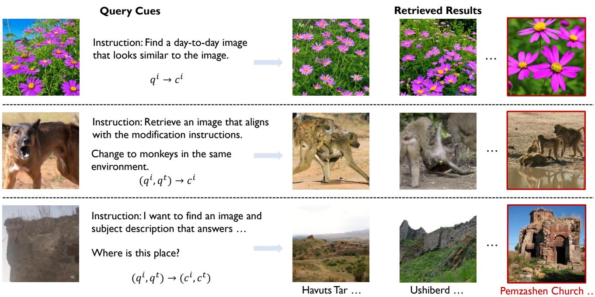

# LamRA：大型多模态模型作为您的高级检索助手

刘懿琨1,2\*，陈平安3，蔡佳尹3，姜晓龙3，姚 $\mathrm { H u ^ { 3 } }$ ，姚江超 $\mathrm { Y a o ^ { 2 } }$ ，王艳锋1†，谢维迪1† 1中国上海交通大学人工智能学院 2中国上海交通大学CMIC 3中国小红书公司

  
Fu set shows LamRA's superior performance across a wide range of retrieval tasks. For instance, $q ^ { t } \to c ^ { i }$ represents text-to-image retrieval.

# 摘要

随着多模态信息检索的快速发展，越来越复杂的检索任务层出不穷。现有方法主要依赖于针对特定任务的视觉-语言模型微调，通常是那些经过图像-文本对比学习训练的模型。本文探讨了将生成性大规模多模态模型（LMMs）用于检索的可能性。这种方法使所有检索任务统一在相同的框架下，且更重要的是，它允许在不增加额外训练的情况下推断未见过的检索任务。我们的贡献可以总结为以下几个方面：（i）我们引入了LamRA，这是一个设计用来赋予LMMs复杂检索和重排序能力的多功能框架。（ii）在检索方面，我们采用了包括仅语言预训练和多模态指令调优在内的两阶段训练策略，以逐步提升LMM的检索性能。（iii）在重排序方面，我们采用了点对点和列表重排序的联合训练，提供了两种不同方式以进一步提升检索性能。（iv）广泛的实验结果强调了我们的方法在处理十多项检索任务中的有效性，展示了在监督学习和零样本设置下，包括涉及先前未见检索任务的场景下，表现出的强大性能。项目页面：https://code-kunkun.github.io/LamRA/.

# 1. 引言

最近，多模态信息检索领域因视觉-语言模型（VLMs）的卓越成功而取得了显著进展。例如，CLIP [42] 和 ALIGN [15] 通过对大规模图像-文本对进行对比学习 [38] 进行训练，表现出在跨模态检索上出人意料的广泛适用性。然而，随着信息检索的发展，出现了更多具有挑战性的任务，包括组合图像检索 [34, 52]、长文本图像检索 [58] 以及图像/问题到多模态文档的检索 [8, 36]。现有方法 [33, 54, 55] 采用任务特定的微调来将 VLMs 适应这些专业任务，这仍然是繁琐且费力的。

与此同时，近期大型多模态模型（LMMs）[22, 23, 46]的进展推动了利用LMMs解决多样化视语言任务的趋势。例如，LISA [21] 将LMMs应用于分割任务，而LLaVA [32] 则将其应用于一般视觉问答（VQA）。LMMs在这些领域成功的原因可归结为两个关键因素：(i) 使用语言作为机器与人类之间的接口，自然促进了跨多个任务的互动；(ii) 大型语言模型（LLMs）在庞大的文本语料库上进行训练，显著提升了它们对自然语言的理解，并且重要的是，丰富了它们对现实世界知识的理解。本文旨在通过解决LMMs范围内广泛的检索和重新排序挑战来扩展这一成功。这种方法使所有检索任务能够统一在同一个框架下进行表述，并且能够在没有额外训练的情况下外推到未见过的检索任务。我们引入了一个框架，通过简单地将轻量级LoRA模块插入LMMs，增强了其通用的检索和重新排序能力，称为LamRA。为了快速检索，我们采用了两阶段训练策略，逐步提高模型的检索性能。具体而言，第一阶段包括仅文本的预训练，使LMM能够根据总结提示输出嵌入。第二阶段涉及指导微调，我们在多样化的数据集上对模型进行微调，涵盖各种检索任务。对于重新排序，我们在LMM上训练了一个额外的LoRA模块，以处理多张图片或冗长文本。通过从快速检索模型中进行困难样本挖掘，我们对点对点和列表重排进行联合训练，实现对单一或多个候选输入的灵活支持，进一步显著提升整体性能。为了验证我们方法的有效性，我们在超过10种不同的检索场景中进行了广泛的实验，包括文本到图片、文本-图片到图片和文本-图片到文本-图片检索等。强大的性能表明我们的方法能够有效处理简单和复杂的检索任务。此外，我们还通过在一组检索任务上训练，并评估先前未见过的任务，检查模型的任务级泛化性。值得注意的是，我们的方法表现出强大的泛化能力，能够在未曾接触过的任务上有效执行，突显了其对未见检索挑战的迁移能力。总结来说，本文做出了以下贡献：(i) 我们引入了LamRA，一个旨在赋能LMMs以实现复杂检索和重排能力的多功能框架。(ii) 为了实现高效检索，我们提出了LamRA-Ret，采用包含仅语言的预训练和多模态指导微调的两阶段训练策略，逐步提升模型的检索能力。(iii) 在重新排序方面，我们提出了LamRA-Rank，支持点对点和列表重排，以进一步提高检索性能。(iv) 通过广泛的实验，我们在监督和零-shot设置下证明了我们方法的有效性，即使在以前未见过的检索任务上也取得了强大的表现。因此，我们的方法在超过十种检索任务上与现有的最先进（SOTA）模型表现持平或显著超越。

# 2. 相关工作

多模态信息检索。传统的多模态信息检索通常局限于跨模态检索设置，评估基准通常仅限于像 MSCOCO [29] 和 Flickr30K [41] 这样的数据集。随着该领域的发展，出现了更为复杂的检索任务，包括复合图像检索 [2, 34, 45, 52]、长文本到图像的检索 [58] 及图像/问题到多模态文档的检索 [8, 13] 等。如 [8, 36, 58] 所讨论的，这些任务对视觉语言模型（VLMs）提出了巨大的挑战。目前的方法 [1, 3, 37, 54] 通常通过微调模型以应对单个任务，但开发能够同时处理这些不同任务的通用多模态嵌入仍然是一项重大挑战。多模态表示学习。开发稳健的多模态表示的挑战仍然是多模态学习的一个基础性问题。开创性模型如 CLIP [42] 和 ALIGN [15] 通过采用双编码器架构，利用对比学习 [38] 在大规模图像-文本对上学习有效表示。然而，由于像 CLIP 这样的双编码器网络旨在增强图像与文本之间的对齐，当处理交错的图像-文本输入时，它们也面临挑战。此外，以这种方式学习的文本编码器对复杂文本的理解能力有限 [12]，这表明传统的双编码器模型可能需要进一步精炼。许多研究致力于进一步探讨以实现更通用的多模态表示。例如，UnilR [51] 引入了一个包含八个不同检索任务的基准，展示了当 CLIP 在此基准上训练时，可在各种检索任务中实现更好的通用性和适应性。E5-V [18] 利用大型多模态模型（LMMs），使用精心设计的提示将图像和文本映射到共享的语言隐藏空间。通过在文本对上进行微调 [11]，E5-V 显示出显著的零-shot 检索能力。然而，这些方法在某些复杂检索任务上的有效性有限。在本文中，我们探讨 LMM 作为通用检索器和重新排序器的潜力，以应对这些挑战。

  
OvehLamRAokRA eLRARe mRA-an

大型多模态模型。随着大型语言模型（LLMs）[4, 10, 16]的最新进展，近期研究集中在大型多模态模型（LMMs）上，通过视觉指令调优对齐视觉和文本模态。特别是，使用LMMs来解决各种视觉-语言任务的趋势日益增长。例如，LISA [21] 将LMMs应用于分割任务，DetGPT [40] 利用LMMs进行目标检测，而VisionLLM [47] 则使用LMMs处理各种以视觉为中心的任务。尽管如此，相对较少的研究探讨了LMMs在通用检索任务中的潜力，这是本文的研究重点，我们提出了一个框架LamRA，该框架通过轻量级的LoRAs对LMMs进行适配，以实现高级检索和重新排序，显著提升了它们在各种检索任务中的性能。我们注意到有少数几项并行研究 [19, 28] 也探索了LMMs在通用检索中的应用，我们希望未来的研究能继续推动这一领域的发展。

# 3. 方法

本节首先在 3.1 节中对我们所考虑的问题进行公式化；然后在 3.2 节中详细阐述架构和特征提取过程；在 3.3 节中描述为 LMM 赋予检索能力的训练细节；接着在 3.4 节中介绍赋予 LMM 通用重排序能力的方法，旨在进一步提升检索性能；最后，在 3.5 节中详细说明我们方法的推理管道。

# 3.1. 问题表述

我们针对通用检索和重排序的挑战采用生成模型。具体而言，对于一个特定的查询 $( q )$，可以是图像、文本或交错的图像-文本格式，以及一个包含 $N$ 个候选项的检索集 $\Omega = \{ c _ { 1 } , c _ { 2 } , \cdot \cdot \cdot , c _ { N } \}$，其中每个 $c _ { i }$ 包含图像、文本或交错格式，我们首先使用语言模型（LMMs）提取查询和所有候选项的嵌入，并根据相关性对 $\Omega$ 中的所有候选项进行排名，即计算查询和候选项嵌入之间的余弦相似度。这个初始检索过程会产生前 $K$ 个候选项，表示为 $\mathcal { C } _ { 1 } = \Phi _ { \mathrm { r e t } } ( q , \Omega )$。随后，我们通过重排序过程对该子集进行优化，以生成最终的排名输出，表示为 $\mathcal C _ { 2 } = \Phi _ { \mathrm { r e r a n k } } ( q , \mathcal C _ { 1 } )$。这里，$\mathcal { C } _ { 2 }$ 表示最终重新排序的候选集。接下来的部分中，我们将提供关于如何提取任意格式查询和候选项特征的详细信息。

# 3.2. 建构与特征提取

一般来说，大型多模态模型（LMM）的架构通常由三个主要组件组成：视觉编码器、视觉投影器和语言模型。为了使用生成模型计算嵌入，我们采用类似于[17, 18]的方法，使用显式单词限制（EOL）。具体而言，我们使用以下提示：(i) 对于仅图像输入，我们使用：<image> 用一个词总结以上图像：<emb>；(ii) 对于仅文本输入，我们使用：<text> 用一个词总结以上句子：<emb>；(iii) 对于混合图像-文本输入，我们利用：<image1><text1>...<imagei><textj> 用一个词总结以上图像和句子：<emb>。其中，<image>和<text>分别表示输入图像和句子的占位符。对于任何组合的图像和文本输入，LMM使用视觉编码器和视觉投影器将图像映射到语言空间，这些图像随后与文本一起由大型语言模型处理。我们使用在<emb>标记之前的最后一个隐藏状态作为输入的表示。

# 3.3. 检索训练

在本节中，我们描述了一个两阶段的训练方案，以提升LMM的检索能力。第一阶段涉及仅语言的预训练，这将有助于生成模型输出改进的嵌入。第二阶段，指令调优，进一步使LMM适应广泛的检索任务。阶段一：为检索任务调整LMM。LMM是针对生成任务进行训练的，例如下一个词预测，这限制了它们在检索方面的能力，正如表2中的性能指标所示，直接使用Qwen2-VL-7B进行检索任务会导致性能较差。为了解决这个问题，我们首先通过在自然语言推理（NLI）数据集上训练LoRA模块来调整LMM，以适应文本到文本的检索，NLI数据集中包含成对的文本样本，适合增强LMM的检索能力。关于预训练数据集选择的进一步讨论，请参见附录A。阶段二：通用检索的指令调优。为了进一步提升LMM在各种多模态检索任务中的能力，我们在M-BEIR上进行训练，该数据集包含8个不同的检索任务和10个不同的数据集，由[51]策划，包括图像到图像的检索、组合图像检索和图像/问题到多模态文档的检索等。针对不同的检索任务，我们为每种检索类型纳入特定的任务指令。例如，完成图像到图像的检索任务时，指令可以是“检索相似图像。”有关指令和M-BEIR数据集的更多详细信息，请参见附录C。训练目标。我们在语言仅预训练和指令调优阶段都采用对比学习，使用InfoNCE损失[38]。具体而言，给定批大小为$B$，第$n$个查询$q _ { n }$的嵌入应与其正目标$c _ { n }$的嵌入靠近，并与其他负实例的距离较远，公式如下：

$$
\mathcal { L } _ { \mathrm { r e t } } = - \frac { 1 } { B } \sum _ { n = 1 } ^ { B } \log \left[ \frac { \exp \left[ \kappa \left( \mathrm { L M M } ( q _ { n } ) , \mathrm { L M M } ( c _ { n } ) \right) / \tau \right] } { \sum _ { m = 1 } ^ { B } \exp \left[ \kappa \left( \mathrm { L M M } ( q _ { n } ) , \mathrm { L M M } ( c _ { m } ) \right) / \tau \right] } \right]
$$

其中 $\tau$ 表示温度参数，$\kappa ( \cdot , \cdot )$ 表示余弦相似度。此外，$\mathtt { L M M ( \cdot ) }$ 表示特征提取过程，采用 LMM，如第 3.2 节中所述。经过预训练和指令微调后的模型称为 LamRA-Ret。

# 3.4. 重排序训练

在这里，我们利用大语言模型的灵活性来处理多张图像或长文本，并训练一个轻量级的LoRA模块，以便对其进行重排序。因此，我们提出了LamRA-Rank，它支持来自LamRA-Ret输出的单个或多个候选项的输入，以进一步提高检索性能。收集重排序训练数据。在这里，我们使用第3.3节中训练的LamRA-Ret模型作为初始检索器，并在其前100个检索到的候选项上训练重排序模型，将其作为困难负样本。这种方法使得LamRA-Rank能够获得更细致的理解并提高其排序性能。针对逐点和逐列表重排序的联合训练。考虑到大语言模型可以接受灵活的输入，我们探索了针对逐点和逐列表重排序的联合训练。

在点对点重排序的情况下，对于任何查询 $( q )$ ，我们从前100个候选项中随机选择一个负样本 $( c _ { \mathrm { n e g } } )$ ，并指示 LamRA-Rank 输出真实标注 $( c _ { \mathrm { p o s } } )$ 的 YES 和负样本的 NO。交叉熵损失作为损失函数，表示为 ${ \mathcal L } _ { \mathrm { p o i n t } } ~ = ~ { \mathcal L } _ { \mathrm { c e } } ( \mathrm { { Y E S , R e r a n k e r } } ( q , c _ { \mathrm { p o s } } ) ) ~ + ~$ $\mathcal { L } _ { \mathrm { c e } } \left( \mathrm { N O , R e r a n k e r } ( q , c _ { \mathrm { n e g } } ) \right)$ ，其中 Reranker $( \cdot , \cdot )$ 表示 LamRA-Rank 的自回归输出过程。相较之下，对于列表重排序，我们从前100个候选项中随机选择 $M$ 个负样本 $( c _ { 1 } , c _ { 2 } , \cdots , c _ { M } )$ ，其中 $M$ 是在2到5之间随机确定的整数。然后我们随机将真实标注 $\left( c _ { \mathrm { p o s } } \right)$ 插入到任意位置，并提示 LamRA-Rank 直接输出真实标注的位置编号。这个过程可以被表述为 $\mathcal { L } _ { \mathrm { l i s t } } ~ =$ $\mathcal { L } _ { \mathrm { c e } }$ (GT-POSITION,Reranker $( q , c _ { \mathrm { p o s } } , c _ { 1 } , c _ { 2 } , \cdots , c _ { M } )$。最终损失是加权和：$\mathcal { L } _ { \mathrm { r a n k } } = \mathcal { L } _ { \mathrm { p o i n t } } + \mathcal { L } _ { \mathrm { l i s t } }$ 。

# 3.5. 推理流程

在推理阶段，我们采用 LamRA-Ret 进行初始检索阶段 $( \Phi _ { \mathrm { { r e t } } } )$，并使用 LamRA-Rank 进行后续重排序 $( \Phi _ { \mathrm { r a n k } } )$。给定一个查询 $( q )$ 和一个候选集 $( \Omega )$，首先使用 LamRA-Ret 计算每个候选的嵌入相似度分数 $( S _ { \mathrm { r e t } } )$，基于余弦相似度。随后，对候选进行排序以获得前 $K$ 个候选集 $( \mathcal { C } _ { 1 } )$。对于重排序过程，我们提供两种选择：逐点重排序和列表重排序。在逐点重排序的情况下，查询和每个前 $K$ 个候选将依次输入到 LMM 中，执行 $K$ 次推理操作，并为每个候选分配重排序分数 $( S _ { \mathrm { r a n k } } )$。该重排序分数来自于 LMM 输出 YES 的概率。相反，对于列表重排序，查询和前 $K$ 个候选同时输入到 LamRA-Rank 中，后者直接输出最相关候选的序号。关于这两种方法的更多讨论可以在第 4.3 节找到。在最后一步，将 LamRA-Ret 的嵌入相似度分数和 LamRA-Rank 的重排序分数整合为加权和以获得最终分数：$S = \alpha \times S _ { \mathrm { { r e t } } } + ( 1 - \alpha ) \times S _ { \mathrm { { r a n k } } }$，其中 $\alpha$ 是一个权重超参数。最终分数用于生成重新排序的候选集 $( \mathcal { C } _ { 2 } )$。我们将 LamRA-Ret 和 LamRA-Rank 的组合框架称为 LamRA。

# 4. 实验

# 4.1. 实验设置

数据集和评测指标。我们利用NLI数据集进行预训练，并使用M-BEIR数据集进行指令调优。M-BEIR数据集涵盖了10个不同检索数据集中的八个独立检索任务，共计1.1M训练样本。如表1所示，为了评估LamRA在各类检索任务中的多样性，我们在M-BEIR测试集上进行评估。此外，我们还调查了LamRA在其他未见过的数据集上的泛化能力，包括ShareGPT4V、Urban-1K、CIRCO和Visual Dialog等。我们遵循各个数据集设定的标准评估指标。对于检索任务，我们主要使用召回率 $@ \mathrm { K }$ 作为评估指标，而对于图像-文本匹配任务，我们采用准确率作为评估指标。

实验设置与基线。我们建立了三种不同的实验设置：(i) 为了验证我们方法在多个检索任务中的通用性，我们在 M-BEIR 基准的所有 8 个任务上进行训练，并评估其在测试集上的表现。在该设置下的基线中，我们遵循 UnilR [51]，与多个强大的视觉语言模型（VLM）进行比较，如 CLIP、SigLIP 和 BLIP2，以评估它们的零-shot 性能。在监督设置中，我们将我们的方法与完全微调的 UniIR-BLIP 和 UniIR-CLIP 版本进行比较。(ii) 为了评估在之前未见过的检索数据集上的泛化能力，我们在 10 个未在训练中遇到的数据集上进行零-shot 实验。在这种情况下，基线包括一系列通用检索器，如 E5-V、MagicLens 和 EVA-CLIP-18B。(iii) 为了探讨在未见过的检索任务上的泛化能力，我们故意排除了来自三个检索任务的数据：图像到图像检索、文本到图像到文本检索及文本到图像到文本图像检索。然后在剩余的五个任务上进行训练，并评估这些被排除的任务。

Table 1. Summary of the evaluation benchmarks. # Queries represents the number of test queries, and # Candidates denotes the number of test candidates per query.   

<table><tr><td>Benchmark</td><td>Zero-shot</td><td># Queries</td><td># Candidates</td></tr><tr><td>M-BEIR [51]</td><td>X</td><td>190K</td><td>5.6M</td></tr><tr><td>ShareGPT4V [58]</td><td>v</td><td>1K</td><td>1K</td></tr><tr><td>Urban-1K [58]</td><td>v</td><td>1K</td><td>1K</td></tr><tr><td>Flickr30K [41]</td><td>v</td><td>1K</td><td>5K</td></tr><tr><td>CIRCO [2]</td><td>v</td><td>800</td><td>120K</td></tr><tr><td>GeneCIS [45]</td><td>v</td><td>8K</td><td>10 ∼ 15</td></tr><tr><td>Visual Storytelling [14]</td><td>V</td><td>5K</td><td>8K</td></tr><tr><td>Visual Dialog [9]</td><td>v</td><td>2K</td><td>2K</td></tr><tr><td>Multi-round FashionIQ [56]</td><td>v</td><td>2.4K</td><td>6.2K</td></tr><tr><td>CC-Neg [43]</td><td></td><td>40K</td><td>2</td></tr><tr><td>Sugar-Crepe [12]</td><td>v</td><td>7.5K</td><td>2</td></tr></table>

实现细节。我们的框架基于Pytorch实现，默认使用Qwen2-VL-7B [46]。在检索的预训练阶段，我们在8个A100 GPU上进行实验，批量大小为576，学习率为$4 \times 10^{-5}$，训练两个epoch。在指令调优阶段，我们在16个A100 GPU上训练，批量大小为960，学习率为$1 \times 10^{-4}$，训练一个epoch。在重排序训练阶段，我们在16个A100 GPU上训练一个epoch，使用批量大小64和学习率$4 \times 10^{-5}$。在所有实验中，视觉侧的参数保持固定，而大型语言模型通过LoRA进行微调。LamRA-Rank默认采用逐点重排序。在M-BEIR评估期间，实验在本地池中进行，LamRA-Rank对前50个结果进行重排序。对于在未见数据集上的实验，对前10个结果应用重排序。权重超参数$\alpha$的默认值设为0.5。

# 4.2. 实验结果

在各种检索任务中的多功能性。如表2所示，我们的模型能够处理各种输入格式的检索任务。我们可以得出以下观察结果：（i）在多模态和纯文本检索任务中，我们的方法显著优于双编码器范式的方法UniIR-CLIP。例如，在InfoSeek数据集上进行文本-图像-文本检索时，我们的方法LamRA-Ret在Recall $\textcircled { a } 5$ 上比UniIR-CLIP提高了24.2个点。同样，在CIRR数据集上的组合图像检索中，我们的方法在Recall $\textcircled { a } 5$ 上超越UniIR-CLIP 8.5个点。（ii）在较简单的检索任务中，例如跨模态检索，LamRA-Ret的性能与UniIR-CLIP相当，或略高于其性能。（iii）此外，LamRA（带重排名）在所有检索任务中实现了额外的性能提升，在16个M-BEIR检索任务中平均提高了7.1个点。（iv）值得注意的是，Qwen2-VL-7B在M-BEIR基准测试中的平均零-shot分数仅为23.0，应用我们的框架后提高至63.7。这突显了我们提出的LMMs框架在增强一般检索和重排名性能方面的有效性。$q ^ { t }$表示文本查询，$q ^ { i }$表示图像查询，$c ^ { t }$表示文本候选项，$c ^ { i }$表示图像候选项。使用的缩写包括VN表示VisualNews，F200K Recall $@ 1 0$，而所有其他评估均采用Recall $\textcircled { \omega } 5$。最佳（第二最佳）数字用红色（蓝色）表示。

<table><tr><td rowspan="3">Methods</td><td colspan="3">$q f rxc}$</td><td colspan="2">$q fx{}$</td><td colspan="2">qt → (c, ct)</td><td colspan="2">qi → ct</td><td>$q { c}$</td><td colspan="2">(qi, qt) → ct</td><td colspan="2">(q , qt) → ci</td><td colspan="2">(q , qt) ) → (ci, ct)</td></tr><tr><td colspan="3">VN COCO F200K WebQA EDIS WebQA</td><td colspan="2"></td><td colspan="2"></td><td colspan="2">VN COCO F200K NIGHTS OVEN InfoS</td><td colspan="2"></td><td colspan="2">FIQ</td><td colspan="2">CIRR OVEN</td><td rowspan="2">InfoS Avg.</td></tr><tr><td>R@5 R@5 R@10</td><td></td><td></td><td>R@5</td><td>R@5</td><td>R@5</td><td>R@5 R@5 R@10</td><td></td><td>R@5</td><td>R@5</td><td>R@5</td><td>R@10 R@5</td><td>R@5</td><td>R@5</td></tr><tr><td colspan="10"></td><td colspan="7"></td></tr><tr><td>CLIP-L [42]</td><td>43.3</td><td>61.1</td><td>6.6</td><td>36.2</td><td>43.3</td><td>41.3</td><td>79.0</td><td>7.7</td><td>26.1</td><td>24.2</td><td>20.5</td><td>7.0</td><td>13.2</td><td>38.8</td><td>26.4</td><td>32.5</td></tr><tr><td>SigLIP [57]</td><td>30.1</td><td>75.7</td><td>36.5</td><td>39.8</td><td>27.0</td><td>45.1 43.5</td><td>30.8 88.2</td><td>34.2</td><td>28.9</td><td>29.7</td><td>25.1</td><td>14.4</td><td>22.7</td><td>41.7</td><td>27.4</td><td>37.2</td></tr><tr><td>BLIP [24]</td><td>16.4</td><td>74.4</td><td>15.9</td><td>44.9</td><td>26.8</td><td>20.3</td><td>17.2 83.2</td><td>19.9</td><td>27.4</td><td>16.1</td><td>10.2</td><td>2.3</td><td>10.6</td><td>27.4</td><td>16.6</td><td>26.8</td></tr><tr><td>BLIP2 [25]</td><td>16.7</td><td>63.8</td><td>14.0</td><td>38.6</td><td>26.9</td><td>24.5</td><td>15.0 80.0</td><td>14.2</td><td>25.4</td><td>12.2</td><td>5.5</td><td>4.4</td><td>11.8</td><td>27.3</td><td>15.8</td><td>24.8</td></tr><tr><td>Qwen2-VL-7B [46]</td><td>9.3</td><td>55.1</td><td>5.0</td><td>42.0</td><td>26.2</td><td>9.4</td><td>5.4 46.6</td><td>4.0</td><td>21.3</td><td>21.4</td><td>22.5</td><td>4.3</td><td>16.3</td><td>43.6</td><td>36.2</td><td>23.0</td></tr><tr><td colspan="10">Supervised - Dual Encoder</td><td colspan="7"></td></tr><tr><td>UnilR-BLIPFF [51]</td><td>23.4 79.7</td><td></td><td>26.1</td><td>80.0</td><td>50.9</td><td>79.8</td><td>22.8 89.9</td><td>28.9</td><td>33.0</td><td>41.0</td><td>22.4</td><td>29.2</td><td>52.2</td><td>55.8</td><td>33.0</td><td>46.8</td></tr><tr><td>UniIR-CLIPsF [51]</td><td>42.6 81.1</td><td></td><td>18.0</td><td>84.7</td><td>59.4</td><td>78.7</td><td>43.1 92.3</td><td>18.3</td><td>32.0</td><td>45.5</td><td>27.9</td><td>24.4</td><td>44.6</td><td>67.6</td><td>48.9</td><td>50.6</td></tr><tr><td colspan="10">Supervised - LMMs</td><td colspan="7"></td></tr><tr><td>LamRA-Ret</td><td>41.6 81.5</td><td></td><td>28.7</td><td>86.0</td><td>62.6</td><td>81.2</td><td>39.6 90.6</td><td>30.4</td><td>32.1</td><td>54.1</td><td>52.1</td><td>33.2</td><td>53.1</td><td>76.2</td><td>63.3</td><td>56.6</td></tr><tr><td>LamRA</td><td>48.0 85.2</td><td></td><td>32.9</td><td>96.7</td><td>75.8</td><td>87.7</td><td>48.6 92.3</td><td>36.1</td><td>33.5</td><td>59.2</td><td>64.1</td><td>37.8</td><td>63.3</td><td>79.2</td><td>78.3</td><td>63.7</td></tr></table>

# 对未见数据集的高级泛化能力

为了验证我们方法的强泛化能力，我们在 $1 0 \ \mathrm { u n } \cdot$ 已知数据集上进行了大量实验。正如表4所示，我们可以得出以下观察结论：（i）我们的方法在各种未知数据集上表现出色，性能显著超越或可与其他强基线方法相当。（ii）值得注意的是，我们的方法在双编码器方法表现不佳的场景中表现尤为出色。例如，在Urban-1K数据集的图像到长文本检索任务中，我们的LamRA-Ret相比其他方法实现了超过10个百分点的提升。同样，在对话到图像检索和多轮组合图像检索等任务中，我们的方法也取得了显著的性能提升。（iii）在图像-文本匹配任务中，基于LMM的方法表现优于使用双编码器范式的方法。我们将这种提升主要归因于LMM对复杂文本的理解能力。

Table 3. Held-out task generalization experiments on M-BEIR. \* means that the training is carrid out on the remaining five tasks, with no exposure to these three held-out tasks.   

<table><tr><td rowspan="2">Methods</td><td>qi → ci</td><td colspan="2">(qi, qt) → ct</td><td colspan="2">(qi, qt) → (ci, ct)</td><td rowspan="2">Avg.</td></tr><tr><td>NIGHTS R@5</td><td>OVEN R@5</td><td>InfoS R@5</td><td>OVEN R@5</td><td>InfoS R@5</td></tr><tr><td>Supervised</td><td></td><td></td><td></td><td></td><td></td><td></td></tr><tr><td>UniIR-BLIPFF [51]</td><td>33.0</td><td>41.0</td><td>22.4</td><td>55.8</td><td>33.0</td><td>37.0</td></tr><tr><td>UniIR-CLIPsF [51]</td><td>32.0</td><td>45.5</td><td>27.9</td><td>67.6</td><td>48.9</td><td>44.4</td></tr><tr><td>Zero-shot</td><td></td><td></td><td></td><td></td><td></td><td></td></tr><tr><td>LamRA-Ret*</td><td>27.2</td><td>44.7</td><td>44.0</td><td>62.8</td><td>49.5</td><td>45.6</td></tr><tr><td>LamRA*</td><td>29.2</td><td>46.9</td><td>54.2</td><td>65.1</td><td>59.1</td><td>50.9</td></tr></table>

在未见检索任务上的卓越泛化。如第4.1节所述，我们在五个任务上训练模型，并在排除的任务上进行评估，以评估其在这些之前未见任务上的泛化能力。如表3所示，我们的方法在未见检索任务上表现出色。值得注意的是，与监督方法如UniIR-CLIP相比，我们的方法在更复杂的任务中，如InfoSeek基准上的文本-图像-文本检索任务，达到了竞争力甚至优越的零-shot结果，在Recall $\textcircled { a } 5$ 上超越了UniIR-CLIP 26.3分。这一卓越的泛化能力表明，我们的方法能够在不进行额外训练的情况下推断未见检索任务，并且在更广泛的场景中具有重要的实用适用性。

<table><tr><td rowspan="3">Methods</td><td colspan="3">qt → ci</td><td colspan="3">qi → ct</td><td colspan="2">(qi, qt) → ci</td><td>qdialog → ci</td><td colspan="2">(qi  qt) → ci</td><td colspan="2">ITM</td></tr><tr><td>Share4V</td><td>Urban*</td><td>Flickr</td><td>Share4V</td><td>Urban*</td><td>Flickr</td><td>CIRCO*</td><td>GeneCIS*</td><td>VisD*</td><td>VIST</td><td>MT-FIQ*</td><td>CC-Neg</td><td>Sugar-Crepe*</td></tr><tr><td>R@1</td><td>R@1</td><td>R@1</td><td>R@1</td><td>R@1</td><td>R@1</td><td>MAP@5</td><td>R@1</td><td>R@1</td><td>R@1</td><td>R@5</td><td>Acc.</td><td>Acc.</td></tr><tr><td>CLIP-L [42]</td><td>84.0</td><td>52.8</td><td>67.3</td><td>81.8</td><td>68.7</td><td>87.2</td><td>4.0</td><td>13.3</td><td>23.7</td><td>0.6</td><td>17.7</td><td>66.7</td><td>73.0</td></tr><tr><td>Long-CLIP-L [58]</td><td>95.6</td><td>86.1</td><td>76.1</td><td>95.8</td><td>82.7</td><td>89.3</td><td>5.7</td><td>16.3</td><td>37.9</td><td>1.1</td><td>18.5</td><td>76.3</td><td>80.9</td></tr><tr><td>UniIR-CLIP [51]</td><td>85.8</td><td>75.0</td><td>78.7</td><td>84.1</td><td>78.4</td><td>94.2</td><td>12.5</td><td>16.8</td><td>26.8</td><td>0.6</td><td>39.4</td><td>79.9</td><td>80.3</td></tr><tr><td>E5-V [18]</td><td>86.7</td><td>84.0</td><td>79.5</td><td>84.0</td><td>82.4</td><td>88.2</td><td>24.8</td><td>18.5</td><td>54.6</td><td>10.0</td><td>19.2</td><td>83.2</td><td>84.7</td></tr><tr><td>MagicLens-L [59]</td><td>85.5</td><td>59.3</td><td>72.5</td><td>60.9</td><td>24.2</td><td>84.6</td><td>29.6</td><td>16.3</td><td>28.0</td><td>3.3</td><td>22.6</td><td>62.7</td><td>75.9</td></tr><tr><td>EVA-CLIP-8B [44]</td><td>91.2</td><td>77.8</td><td>80.8</td><td>93.1</td><td>80.4</td><td>95.6</td><td>6.0</td><td>13.1</td><td>23.2</td><td>1.2</td><td>22.1</td><td>59.4</td><td>81.7</td></tr><tr><td>EVA-CLIP-18B [44]</td><td>92.1</td><td>81.7</td><td>83.3</td><td>94.0</td><td>83.3</td><td>96.7</td><td>6.1</td><td>13.6</td><td>24.7</td><td>1.0</td><td>21.9</td><td>63.8</td><td>83.1</td></tr><tr><td>LamRA-Ret</td><td>93.3</td><td>95.1</td><td>82.8</td><td>88.1</td><td>94.3</td><td>92.7</td><td>33.2</td><td>18.9</td><td>62.8</td><td>23.1</td><td>60.9</td><td>79.6</td><td>85.8</td></tr><tr><td>LamRA</td><td>97.9</td><td>98.8</td><td>88.1</td><td>96.5</td><td>98.0</td><td>97.6</td><td>42.8</td><td>24.8</td><td>70.9</td><td>28.6</td><td>63.9</td><td>85.9</td><td>93.5</td></tr></table>

T - 文本查询用 $q ^ { t }$，图像查询用 $q ^ { i }$，对话查询用 $q ^ { \mathrm { d i a l o g } }$，$( q ^ { i } \oplus q ^ { t } )$ 表示 fvx q，文本候选用 $c ^ { t }$，图像候选用 $c ^ { i }$，VIST 表示视觉故事讲述，VisD 表示视觉对话，MT-FIQ 表示多轮 FashionIQ。$^ *$ 表示这些数据集中的图像（分别为蓝色）。有关这些数据集的更多详细信息，请参阅附录 D。

# 4.3. 消融研究与分析

在本节中，我们进行实验以进一步调查我们提案的效果，例如 LamRA-Ret 的两阶段训练、LamRA 的规模趋势等。两阶段训练的有效性。根据表 5 中呈现的结果，预训练和指令调整阶段对检索性能有显著影响。具体而言，省略预训练阶段会导致 M-BEIR 基准的平均性能下降三分。同样，缺少指令调整阶段会产生次优结果，因为模型在某些复杂的多模态检索任务上表现不佳。总体而言，这些阶段共同促进了 LMMs 检索性能的逐步提升。

Table 5. Effect of the two-stage training. Avg. refers to the average recall performance across the M-BEIR test set.   

<table><tr><td>Pre-training</td><td>Instruction tuning</td><td>Avg.</td></tr><tr><td></td><td>X</td><td>23.0 (-33.6)</td></tr><tr><td></td><td>×</td><td>36.2 (-20.4)</td></tr><tr><td></td><td></td><td>53.6 (-3.0)</td></tr><tr><td>2</td><td>:</td><td>56.6</td></tr></table>

LamRA 的扩展趋势。如表 6 所示，针对 LamRA 的扩展效应，我们对不同规模的语言多模态模型（LMMs）进行了实验，具体为 Qwen2-VL-2B 和 Qwen2-VL-7B。结果表明，随着模型规模的扩大，性能也相应提高。目前，由于计算上的限制，我们仅能对 2B 和 7B 模型进行实验；然而，我们的发现表明，规模更大、能力更强的 LMMs 在我们的框架内可能会产生更优秀的结果，从而为该领域的进一步探索奠定基础。

Table 6. Scaling Trends of LamRA. Experimental results on the M-BEIR test set across various model sizes.   

<table><tr><td>LMMs</td><td>LamRA-Ret</td><td>LamRA-Rank</td><td>Avg.</td></tr><tr><td>Qwen2-VL-2B [46]</td><td>v</td><td>×</td><td>51.6</td></tr><tr><td></td><td></td><td>V</td><td>58.3</td></tr><tr><td>Qwen2-VL-7B [46]</td><td>:</td><td>×</td><td>56.6</td></tr><tr><td></td><td></td><td></td><td>63.7</td></tr></table>

Table 7. Comparison of Recall@1 performance and inference costs between pointwise (LamRA-Rank(P)) and listwise (LamRA-Rank(L)) reranking on M-BEIR. Reranking is applied to the top-5 results. Time denotes the per-query inference time cost measured on eight A100 GPUs with a batch size of 32.   

<table><tr><td rowspan="2">Task</td><td colspan="5">LamRA-Ret LamRA-Rank(P) LamRA-Rank(L)</td></tr><tr><td>R@1</td><td>R@1</td><td>Time</td><td>R@1</td><td>Time</td></tr><tr><td>qt → ct</td><td>58.2</td><td>75.9</td><td>0.020s</td><td>75.9</td><td>0.010s</td></tr><tr><td>(qi, qt) → ci</td><td>18.5</td><td>24.5</td><td>0.071s</td><td>24.3</td><td>0.067s</td></tr><tr><td>(qi, qt) → ct</td><td>30.1</td><td>37.3</td><td>0.047s</td><td>36.6</td><td>0.017s</td></tr><tr><td>(qi, qt) → (ci, ct)</td><td>33.4</td><td>39.9</td><td>0.084s</td><td>39.5</td><td>0.085s</td></tr></table>

关于点式和列表式重排名方法的讨论。如第3.4节所述，LamRA-Rank旨在同时执行点式和列表式重排名。我们在M-BEIR测试集上研究这两种不同的重排名方法，结果如表7所示。这两种方法均显著提高了检索性能。尽管点式重排名通常比列表式重排名具有更高的计算开销，但后者受到大语言模型（LLM）上下文长度的限制，从而限制了其可以处理的候选数量。因此，每种重排名方法各有独特优势，可以根据具体应用需求灵活应用于不同场景。

  
F by a red box and red text. Here, $q ^ { t }$ for text queries, $q ^ { i }$ for image queries, $c ^ { t }$ for text candidates, $c ^ { i }$ for image candidates, and $c ^ { v }$ for video candidates. For more qualitative examples, please refer to Appendix H.

扩展到视频检索。如表8所示，我们在零样本设置下针对文本到视频检索任务对MSR-VTT [53]和MSVD [5]数据集评估了我们的方法。结果表明，我们的方法展现了具有竞争力的性能。例如，在MSR-VTT数据集上，我们的方法在Recall $@ 1$上超过了InternVideo [48] 4.7个百分点。同样，在MSVD数据集上，我们在Recall $@ 1$上比UMT-L [26]提高了2.5个百分点。值得注意的是，在微调阶段，我们的方法没有接触到任何视频数据，表明它保持了Qwen2-VL固有的视频理解能力。尽管我们的方法目前尚未达到最先进的Intern-Video2 [50]所实现的性能，但我们计划通过在未来的研究中探索视频数据的整合来弥补这一差距。

Table 8. Zero-shot text-to-video retrieval performance.   

<table><tr><td>Method</td><td colspan="3">MSR-VTT</td><td colspan="3">MSVD</td></tr><tr><td></td><td>R@1</td><td>R@5</td><td>R@10</td><td>R@1</td><td>R@5</td><td>R@10</td></tr><tr><td>InternVideo [48]</td><td>40.0</td><td>65.3</td><td>74.1</td><td>43.4</td><td>69.9</td><td>79.1</td></tr><tr><td>ViCLIP [49]</td><td>42.4</td><td>-</td><td>-</td><td>49.1</td><td>-</td><td>-</td></tr><tr><td>UMT-L [26]</td><td>42.6</td><td>64.4</td><td>73.1</td><td>49.9</td><td>77.7</td><td>85.3</td></tr><tr><td>InternVideo2s2-6B [50]</td><td>55.9</td><td>78.3</td><td>85.1</td><td>59.3</td><td>84.4</td><td>89.6</td></tr><tr><td>LamRA</td><td>44.7</td><td>68.6</td><td>78.6</td><td>52.4</td><td>79.8</td><td>87.0</td></tr></table>

关于推理成本的讨论。将大语言模型应用于检索和重排名任务的一个潜在缺点是推理成本较高。然而，可以在实际应用中采用多种策略来缓解这一问题。例如，提前为候选池提取特征或将我们的方法部署在查询每秒要求较低的场景中，可以显著降低推理成本。此外，最近的几项研究 [20] 专注于提高大语言模型的推理速度。我们相信，将大语言模型用于检索和重排名具有未来应用的良好潜力。

# 4.4. 定性结果。

在图3中，我们展示了我们方法在六个检索任务上的定性结果。在左上角面板中，我们展示了我们方法在处理组合图像检索任务中的有效性，在该任务中，查询要求检索与参考图像中显示的同一品种的狗及其奔跑的小狗的图像。我们的方法有效捕捉到了这一复杂意图，成功检索到目标图像。在第一列的第三行中，我们展示了我们的方法在文本-图像到文本-图像检索任务上的表现，在该任务中，它不仅为查询检索到相关的维基百科片段，还识别出与查询图像相似的图像。有关更多定性示例，请参见附录H。

# 5. 结论

在本文中，我们探索了一种将轻量级LoRA模块应用于广泛检索任务的新范式。我们提出的通用框架LamRA，使得LMM具备强大的检索和重排能力。具体来说，为了提高检索效率，我们引入了LamRA-Ret，采用两阶段训练策略逐步增强检索性能。对于重排，我们提出了LamRA-Rank，支持点对点和列表重排，以进一步优化结果。对超过十个多样化检索任务的全面定量和定性比较强调了我们方法的多功能性和有效性。我们预期，框架将为多模态信息检索领域提供宝贵见解，并激发该领域进一步研究。

# References

[1] Alberto Baldrati, Marco Bertini, Tiberio Uricchio, and Alberto Del Bimbo. Conditioned and composed image retrieval combining and partially fine-tuning clip-based features. In Proceedings of the IEEE Conference on Computer Vision and Pattern Recognition, 2022. 2   
[2] Alberto Baldrati, Lorenzo Agnolucci, Marco Bertini, and Alberto Del Bimbo. Zero-shot composed image retrieval with textual inversion. In Proceedings of the International Conference on Computer Vision, 2023. 2, 5   
[3] Andrew Brown, Weidi Xie, Vicky Kalogeiton, and Andrew Zisserman. Smooth-ap: Smoothing the path towards largescale image retrieval. In Proceedings of the European Conference on Computer Vision, 2020. 2   
[4] Tom Brown, Benjamin Mann, Nick Ryder, Melanie Subbiah, Jared D Kaplan, Prafulla Dhariwal, Arvind Neelakantan, Pranav Shyam, Girish Sastry, Amanda Askell, Sandhini Agarwal, Ariel Herbert-Voss, Gretchen Krueger, Tom Henighan, Rewon Child, Aditya Ramesh, Daniel Ziegler, Jeffrey Wu, Clemens Winter, Chris Hesse, Mark Chen, Eric Sigler, Mateusz Litwin, Scott Gray, Benjamin Chess, Jack Clark, Christopher Berner, Sam McCandlish, Alec Radford, Ilya Sutskever, and Dario Amodei. Language models are few-shot learners. In Advances in Neural Information Processing Systems, 2020. 3   
[5] David Chen and William B Dolan. Collecting highly parallel data for paraphrase evaluation. In Association for Computational Linguistics, 2011. 8   
[6] Jieneng Chen, Luoxin Ye, Ju He, Zhao-Yang Wang, Daniel Khashabi, and Alan Yuille. Efficient large multi-modal models via visual context compression. In Advances in Neural Information Processing Systems, 2024. 15   
[7] Lin Chen, Jinsong Li, Xiaoyi Dong, Pan Zhang, Conghui He, Jiaqi Wang, Feng Zhao, and Dahua Lin. Sharegpt4v: Improving large multi-modal models with better captions. In Proceedings of the European Conference on Computer Vision, 2024. 12   
[8] Yang Chen, Hexiang Hu, Yi Luan, Haitian Sun, Soravit Changpinyo, Alan Ritter, and Ming-Wei Chang. Can pre-trained vision and language models answer visual information-seeking questions? In Proceedings of the Conference on Empirical Methods in Natural Language Processinng, 2023. 2, 16   
[9] Abhishek Das, Satwik Kottur, Khushi Gupta, Avi Singh, Deshraj Yadav, José MF Moura, Devi Parikh, and Dhruv Batra. Visual dialog. In Proceedings of the IEEE Conference on Computer Vision and Pattern Recognition, 2017. 5   
10] Abhimanyu Dubey, Abhinav Jauhri, Abhinav Pandey, Abhishek Kadian, Ahmad Al-Dahle, Aiesha Letman, Akhil Mathur, Alan Schelten, Amy Yang, Angela Fan, et al. The llama 3 herd of models. arXiv preprint arXiv:2407.21783, 2024. 3 ple contrastive learning of sentence embeddings. In Proceedings of the Conference on Empirical Methods in Natural Language Processinng, 2021. 3, 4, 5, 12   
[12] Cheng-Yu Hsieh, Jieyu Zhang, Zixian Ma, Aniruddha Kembhavi, and Ranjay Krishna. Sugarcrepe: Fixing hackable benchmarks for vision-language compositionality. Advances in Neural Information Processing Systems, 2023. 2, 5   
[13] Hexiang Hu, Yi Luan, Yang Chen, Urvashi Khandelwal, Mandar Joshi, Kenton Lee, Kristina Toutanova, and Ming-Wei Chang. Open-domain visual entity recognition: Towards recognizing millions of wikipedia entities. In Proceedings of the International Conference on Computer Vision, 2023. 2   
[14] Ting-Hao Huang, Francis Ferraro, Nasrin Mostafazadeh, Ishan Misra, Aishwarya Agrawal, Jacob Devlin, Ross Girshick, Xiaodong He, Pushmeet Kohli, Dhruv Batra, et al. Visual storytelling. In Proceedings of the Conference of the North American Chapter of the Association for Computational Linguistics, 2016. 5   
[15] Chao Jia, Yinfei Yang, Ye Xia, Yi-Ting Chen, Zarana Parekh, Hieu Pham, Quoc Le, Yun-Hsuan Sung, Zhen Li, and Tom Duerig. Scaling up visual and vision-language representation learning with noisy text supervision. In Proceedings of the International Conference on Machine Learning, 2021. 2   
[16] Albert Q Jiang, Alexandre Sablayrolles, Arthur Mensch, Chris Bamford, Devendra Singh Chaplot, Diego de las Casas, Florian Bressand, Gianna Lengyel, Guillaume Lample, Lucile Saulnier, et al. Mistral 7b. arXiv preprint arXiv:2310.06825, 2023. 3   
[17] Ting Jiang, Shaohan Huang, Zhongzhi Luan, Deqing Wang, and Fuzhen Zhuang. Scaling sentence embeddings with large language models. arXiv preprint arXiv:2307.16645, 2023. 4   
[18] Ting Jiang, Minghui Song, Zihan Zhang, Haizhen Huang, Weiwei Deng, Feng Sun, Qi Zhang, Deqing Wang, and Fuzhen Zhuang. E5-v: Universal embeddings with multimodal large language models. arXiv preprint arXiv:2407.12580, 2024. 3, 4, 7   
[19] Ziyan Jiang, Rui Meng, Xinyi Yang, Semih Yavuz, Yingbo Zhou, and Wenhu Chen. Vlm2vec: Training vision-language models for massive multimodal embedding tasks. arXiv preprint arXiv:2410.05160, 2024. 3   
[20] Woosuk Kwon, Zhuohan Li, Siyuan Zhuang, Ying Sheng, Lianmin Zheng, Cody Hao Yu, Joseph E. Gonzalez, Hao Zhang, and Ion Stoica. Efficient memory management for large language model serving with pagedattention. In Proceedings of the ACM SIGOPS Symposium on Operating Systems Principles, 2023. 8   
[21] Xin Lai, Zhuotao Tian, Yukang Chen, Yanwei Li, Yuhui Yuan, Shu Liu, and Jiaya Jia. Lisa: Reasoning segmentation via large language model. In Proceedings of the IEEE Conference on Computer Vision and Pattern Recognition, 2024. 2, 3   
[22] Bo Li, Yuanhan Zhang, Dong Guo, Renrui Zhang, Feng Li, Hao Zhang, Kaichen Zhang, Yanwei Li, Ziwei Liu, and Chunyuan Li. Llava-onevision: Easy visual task transfer. arXiv preprint arXiv:2408.03326, 2024. 2   
[23] Feng Li, Renrui Zhang, Hao Zhang, Yuanhan Zhang, Bo Li, Wei Li, Zejun Ma, and Chunyuan Li. Llava-next-interleave: Tackling multi-image, video, and 3d in large multimodal models. arXiv preprint arXiv:2407.07895, 2024. 2   
[24] Junnan Li, Dongxu Li, Caiming Xiong, and Steven Hoi. Blip: Bootstrapping language-image pre-training for unified vision-language understanding and generation. In Proceedings of the International Conference on Machine Learning, 2022.6   
[25] Junnan Li, Dongxu Li, Silvio Savarese, and Steven Hoi. Blip-2: Bootstrapping language-image pre-training with frozen image encoders and large language models. In Proceedings of the International Conference on Machine Learning, 2023.6   
[26] Kunchang Li, Yali Wang, Yizhuo Li, Yi Wang, Yinan He, Limin Wang, and Yu Qiao. Unmasked teacher: Towards training-efficient video foundation models. In Proceedings of the International Conference on Computer Vision, 2023. 8   
[27] Wentong Li, Yuqian Yuan, Jian Liu, Dongqi Tang, Song Wang, Jie Qin, Jianke Zhu, and Lei Zhang. Tokenpacker: Efficient visual projector for multimodal llm. arXiv preprint arXiv:2407.02392, 2024. 15   
[28] Sheng-Chieh Lin, Chankyu Lee, Mohammad Shoeybi, Jimmy Lin, Bryan Catanzaro, and Wei Ping. Mm-embed: Universal multimodal retrieval with multimodal llms. arXiv preprint arXiv:2411.02571, 2024. 3   
[29] Tsung-Yi Lin, Michael Maire, Serge Belongie, James Hays, Pietro Perona, Deva Ramanan, Piotr Dollár, and C Lawrence Zitnick. Microsoft coco: Common objects in context. In Proceedings of the European Conference on Computer Vision, 2014. 2   
[30] Weizhe Lin, Jinghong Chen, Jingbiao Mei, Alexandru Coca, and Bill Byrne. Fine-grained late-interaction multi-modal retrieval for retrieval augmented visual question answering. In Advances in Neural Information Processing Systems, 2023. 16   
[31] Weizhe Lin, Jingbiao Mei, Jinghong Chen, and Bill Byrne. PreFLMR: Scaling up fine-grained late-interaction multimodal retrievers. In Association for Computational Linguistics, 2024. 16   
[32] Haotian Liu, Chunyuan Li, Qingyang Wu, and Yong Jae Lee. Visual instruction tuning. In Advances in Neural Information Processing Systems, 2023. 2   
[33] Yikun Liu, Jiangchao Yao, Ya Zhang, Yanfeng Wang, and Weidi Xie. Zero-shot composed text-image retrieval. In Proceedings of the British Machine Vision Conference, 2023. 2   
[34] Zheyuan Liu, Cristian Rodriguez-Opazo, Damien Teney, and Stephen Gould. Image retrieval on real-life images with pretrained vision-and-language models. In Proceedings of the International Conference on Computer Vision, 2021. 2   
[35] Kenneth Marino, Mohammad Rastegari, Ali Farhadi, and Roozbeh Mottaghi. Ok-vqa: A visual question answering benchmark requiring external knowledge. In Proceedings of the IEEE Conference on Computer Vision and Pattern Recognition, 2019. 16   
[36] Thomas Mensink, Jasper Uijlings, Lluis Castrejon, Arushi Goel, Felipe Cadar, Howard Zhou, Fei Sha, André Araujo, and Vittorio Ferrari. Encyclopedic vqa: Visual questions about detailed properties of fine-grained categories. In Proceedings of the International Conference on Computer Vision, 2023. 2, 16   
[37] Antoine Miech, Jean-Baptiste Alayrac, Ivan Laptev, Josef Sivic, and Andrew Zisserman. Thinking fast and slow: Efficient text-to-visual retrieval with transformers. In Proceedings of the IEEE Conference on Computer Vision and Pattern Recognition, 2021. 2   
[38] Aaron van den Oord, Yazhe Li, and Oriol Vinyals. Representation learning with contrastive predictive coding. arXiv preprint arXiv:1807.03748, 2018. 2, 4   
[39] OpenAI. Gpt-4v(ision) system card, 2023. 13   
[40] Renjie Pi, Jiahui Gao, Shizhe Diao, Rui Pan, Hanze Dong, Jipeng Zhang, Lewei Yao, Jianhua Han, Hang Xu, Lingpeng Kog, et al. Det: Detct what you need via reasoning. arXiv preprint arXiv:2305.14167, 2023. 3   
[41] Bryan A Plummer, Liwei Wang, Chris M Cervantes, Juan C Caicedo, Julia Hockenmaier, and Svetlana Lazebnik. Flickr30k entities: Collecting region-to-phrase correspondences for richer image-to-sentence models. In Proceedings of the International Conference on Computer Vision, 2015. 2,5   
[42] Alec Radford, Jong Wook Kim, Chris Hallacy, Aditya Ramesh, Gabriel Goh, Sandhini Agarwal, Girish Sastry, Amanda Askell, Pamela Mishkin, Jack Clark, et al. Learning transferable visual models from natural language supervision. In Proceedings of the International Conference on Machine Learning, 2021. 1, 2, 6, 7   
[43] Jaisidh Singh, Ishaan Shrivastava, Mayank Vatsa, Richa Singh, and Aparna Bharati. Learn" no" to say" yes" better: Improving vision-language models via negations. In Winter Conference on Applications of Computer Vision, 2025. 5   
[44] Quan Sun, Jinsheng Wang, Qiying Yu, Yufeng Cui, Fan Zhang, Xiaosong Zhang, and Xinlong Wang. Eva-clip-18: Scaling clip to 18 billion parameters. arXiv preprint arXiv:2402.04252, 2024. 7   
[45] Sagar Vaze, Nicolas Carion, and Ishan Misra. Genecis: A benchmark for general conditional image similarity. In Proceedings of the IEEE Conference on Computer Vision and Pattern Recognition, 2023. 2, 5   
[46] Peng Wang, Shuai Bai, Sinan Tan, Shijie Wang, Zhihao Fan, Jinze Bai, Keqin Chen, Xuejing Liu, Jialin Wang, Wenbin Ge, et al. Qwen2-vl: Enhancing vision-language model's perception of the world at any resolution. arXiv preprint arXiv:2409.12191, 2024. 2, 4, 5, 6, 7   
[47] Wenhai Wang, Zhe Chen, Xiaokang Chen, Jiannan Wu, Xizhou Zhu, Gang Zeng, Ping Luo, Tong Lu, Jie Zhou, Yu Qao, et al. Visionllm: Large language model is also an openended decoder for vision-centric tasks. In Advances in Neural Information Processing Systems, 2023. 3   
[48] Yi Wang, Kunchang Li, Yizhuo Li, Yinan He, Bingkun Huang, Zhiyu Zhao, Hongjie Zhang, Jilan Xu, Yi Liu, Zun Wang, et al. Internvideo: General video foundation models via generative and discriminative learning. arXiv preprint arXiv:2212.03191, 2022. 8   
[49] Yi Wang, Yinan He, Yizhuo Li, Kunchang Li, Jiashuo Yu, Xin Ma, Xinhao Li, Guo Chen, Xinyuan Chen, Yaohui Wang, et al. Internvid: A large-scale video-text dataset for multimodal understanding and generation. In Proceedings of the International Conference on Learning Representations, 2024.8   
[50] Yi Wang, Kunchang Li, Xinhao Li, Jiashuo Yu, Yinan He, Guo Chen, Baoqi Pei, Rongkun Zheng, Jilan Xu, Zun Wang, et al. Internvideo2: Scaling video foundation models for multimodal video understanding. In Proceedings of the European Conference on Computer Vision, 2024. 8   
[51] Cong Wei, Yang Chen, Haonan Chen, Hexiang Hu, Ge Zhang, Jie Fu, Alan Ritter, and Wenhu Chen. Uniir: Training and benchmarking universal multimodal information retrievers. In Proceedings of the European Conference on Computer Vision, 2024. 2, 4, 5, 6, 7, 13, 15   
[52] Hui Wu, Yupeng Gao, Xiaoxiao Guo, Ziad Al-Halah, Steven Rennie, Kristen Grauman, and Rogerio Feris. Fashion iq: A new dataset towards retrieving images by natural language feedback. In Proceedings of the IEEE Conference on Computer Vision and Pattern Recognition, 2021. 2   
[53] Jun Xu, Tao Mei, Ting Yao, and Yong Rui. Msr-vtt: A large video description dataset for bridging video and language. In Proceedings of the IEEE Conference on Computer Vision and Pattern Recognition, 2016. 8   
[54] Xinxing Xu, Yong Liu, Salman Khan, Fahad Khan, Wangmeng Zuo, Rick Siow Mong Goh, Chun-Mei Feng, et al. Sentence-level prompts benefit composed image retrieval. In Proceedings of the International Conference on Learning Representations, 2024. 2   
[55] Yibin Yan and Weidi Xie. EchoSight: Advancing visuallanguage models with Wiki knowledge. In Findings of the Association for Computational Linguistics: EMNLP, 2024. 2   
[56] Yifei Yuan and Wai Lam. Conversational fashion image retrieval via multiturn natural language feedback. In Proceedings of the International ACM SIGIR Conference on Research and Development in Information Retrieval, 2021. 5   
[57] Xiaohua Zhai, Basil Mustafa, Alexander Kolesnikov, and Lucas Beyer. Sigmoid loss for language image pre-training. In Proceedings of the International Conference on Computer Vision, 2023. 6   
[58] Beichen Zhang, Pan Zhang, Xiaoyi Dong, Yuhang Zang, and Jiaqi Wang. Long-clip: Unlocking the long-text capability of clip. In European Conference on Computer Vision, 2024. 2, 5, 7   
[59] Kai Zhang, Yi Luan, Hexiang Hu, Kenton Lee, Siyuan Qiao, Wenhu Chen, Yu Su, and Ming-Wei Chang. Magiclens: Selfsupervised image retrieval with open-ended instructions. In Proceedings of the International Conference on Machine Learning, 2024. 7, 12   
[60] Haozhe Zhao, Xiaojian Ma, Liang Chen, Shuzheng Si, Rujie Wu, Kaikai An, Peiyu Yu, Minjia Zhang, Qing Li, and Baobao Chang. Ultraedit: Instruction-based fine-grained image editing at scale. In Advances in Neural Information Processing Systems, 2024. 12

# LamRA: Large Multimodal Model as Your Advanced Retrieval Assistant

Supplementary Material

# A. Analysis of Pre-training Dataset Selection

ce  uextataex asz and Flickr30K as our evaluation benchmark for the pre-training stage.

Im  a enhancements serves as the positive sample, and the edited image is used as the hard negative sample.

L aa    h e , xiv positive text while treating other samples within the same batch as negative samples.

ImText ir atast.W us e hareataset [ hic cpri paiemae and ng tex initial size of 100K samples. After excluding the COCO images, the final dataset size is reduced to 52K samples.

x

RualyTeu abvol y approach.

Table 9. Performance across various Pre-training Dataset.   

<table><tr><td rowspan="3">Dataset Type</td><td colspan="6">Image Retrieval</td><td colspan="6">Text Retrieval</td></tr><tr><td colspan="3">Flickr30K</td><td colspan="3">COCO</td><td colspan="3">Flickr30K</td><td colspan="3">COCO</td></tr><tr><td>R@1</td><td>R@5</td><td>R@10</td><td>R@1</td><td>R@5</td><td>R@10</td><td>R@1</td><td>R@5</td><td>R@10</td><td>R@1</td><td>R@5</td><td>R@10</td></tr><tr><td>No Training</td><td>52.4</td><td>78.9</td><td>86.0</td><td>26.4</td><td>50.9</td><td>62.9</td><td>54.7</td><td>80.8</td><td>88.3</td><td>32.3</td><td>55.3</td><td>66.6</td></tr><tr><td>Image-only</td><td>71.3</td><td>92.0</td><td>95.2</td><td>38.9</td><td>66.2</td><td>76.6</td><td>79.3</td><td>94.0</td><td>97.3</td><td>58.0</td><td>80.0</td><td>88.0</td></tr><tr><td>Language-only</td><td>80.8</td><td>95.3</td><td>97.2</td><td>53.3</td><td>77.0</td><td>84.8</td><td>91.2</td><td>99.0</td><td>99.5</td><td>67.5</td><td>87.1</td><td>92.6</td></tr><tr><td>Image-Text Pairs</td><td>72.5</td><td>90.7</td><td>94.4</td><td>46.0</td><td>71.1</td><td>79.9</td><td>88.4</td><td>97.5</td><td>99.0</td><td>65.3</td><td>85.4</td><td>91.3</td></tr><tr><td>Combined</td><td>74.1</td><td>92.5</td><td>95.8</td><td>47.2</td><td>71.8</td><td>80.4</td><td>83.9</td><td>96.0</td><td>98.4</td><td>55.1</td><td>78.9</td><td>86.3</td></tr></table>

# B. More Implementation Details

Supplemet  Fatu xctn.i c.h paper,  ke since the embedding we useis derived from the hidden state corresponding to the position preceding this token.

Supplement  Listwise Reranking Method.s disussed nSct the man paper,he pointwis eaki t probability of the LMM outputting a specific serial number.

Sup aeMesW asoeay MagicLens [59] has not yet been open-sourced, therefore, we use its CLIP version for our experiments.

# C. Details about M-BEIR Dataset

Wn It iMcaih vay .e .

Table 10. Summary of the M-BEIR benchmarks.   

<table><tr><td>Task</td><td>Dataset</td><td>Domain</td><td># Train</td><td># Dev</td><td># Test</td><td># Pool</td></tr><tr><td rowspan="3">qt → ci</td><td>VisualNews</td><td>News</td><td>99K</td><td>20K</td><td>20K</td><td>542K</td></tr><tr><td>MSCOCO</td><td>Misc.</td><td>100K</td><td>24.8K</td><td>24.8K</td><td>5K</td></tr><tr><td>Fashion200K</td><td>Fashion</td><td>15K</td><td>1.7K</td><td>1.7K</td><td>201K</td></tr><tr><td>$q { c}$</td><td>WebQA</td><td>Wiki</td><td>16K</td><td>1.7K</td><td>2.4K</td><td>544K</td></tr><tr><td rowspan="2">qt → (ci, ct)</td><td>EDIS</td><td>News</td><td>26K</td><td>3.2K</td><td>3.2K</td><td>1M</td></tr><tr><td>WebQA</td><td>Wiki</td><td>17K</td><td>1.7K</td><td>2.5K</td><td>403K</td></tr><tr><td rowspan="3">qi → ct</td><td>VisualNews</td><td>News</td><td>100K</td><td>20K</td><td>20K</td><td>537K</td></tr><tr><td>MSCOCO</td><td>Misc.</td><td>113K</td><td>5K</td><td>5K</td><td>25K</td></tr><tr><td>Fashion200K</td><td>Fashion</td><td>15K</td><td>4.8K</td><td>4.8K</td><td>61K</td></tr><tr><td>$qi → ci</td><td>NIGHTS</td><td>Misc.</td><td>16K</td><td>2K</td><td>2K</td><td>40K</td></tr><tr><td rowspan="2">(qi, qt) → ct</td><td>OVEN</td><td>Wiki</td><td>150K</td><td>50K</td><td>50K</td><td>676K</td></tr><tr><td>InfoSeek</td><td>Wiki</td><td>141K</td><td>11K</td><td>11K</td><td>611K</td></tr><tr><td rowspan="2">(qi , qt) → ci</td><td>FashionIQ</td><td>Fashion</td><td>16K</td><td>2K</td><td>6K</td><td>74K</td></tr><tr><td>CIRR</td><td>Misc.</td><td>26K</td><td>2K</td><td>4K</td><td>21K</td></tr><tr><td rowspan="2">(qi, qt) → (ci, ct)</td><td>OVEN</td><td>Wiki</td><td>157K</td><td>14.7K</td><td>14.7K</td><td>335K</td></tr><tr><td>InfoSeek</td><td>Wiki</td><td>143K</td><td>17.6K</td><td>17.6K</td><td>481K</td></tr><tr><td>8 tasks</td><td>10 datasets</td><td>4 domains</td><td>1.1M</td><td>182K</td><td>190K</td><td>5.6M</td></tr></table>

# D. Details about Unseen Dataset

Hee  reent h deail   nse Datase i TabMan  he ctally ap fom t disparity compared to the original COCO dataset.

Table 11. Summary of the Unseen Dataset.   

<table><tr><td>Dataset</td><td>Image Source</td><td>Task</td><td>Query Format</td><td>Candidate Format</td></tr><tr><td>ShareGPT4V</td><td>SA-1B</td><td>qt → ci qi → ct</td><td>&lt;long text&gt; &lt;image&gt;</td><td>&lt;image&gt; &lt;long text&gt;</td></tr><tr><td>Urban-1K</td><td>MSCOCO</td><td>qt → ci qi → ct</td><td>&lt;long text&gt; &lt;image&gt;</td><td>&lt;image&gt; &lt;long text&gt;</td></tr><tr><td>Flickr30K</td><td>Flickr</td><td>qt → ci qi → ct</td><td>&lt;short text&gt; &lt;image&gt;</td><td>&lt;image&gt; &lt;short text&gt;</td></tr><tr><td>CIRCO</td><td>MSCOCO unlabeled set</td><td>(qi, qt) → ci</td><td>&lt;image&gt;&lt;relative caption&gt;</td><td>&lt;image&gt;</td></tr><tr><td>GeneCIS</td><td>MSCOCO</td><td>(qi, qt) → ci</td><td>&lt;image&gt;&lt;relative caption&gt;</td><td>&lt;image&gt;</td></tr><tr><td>Visual Dialog</td><td>MSCOCO</td><td>qdialog → ci</td><td>&lt;Q1&gt;&lt;A1&gt;.…&lt;Qj&gt;&lt;Aj&gt;</td><td>&lt;image&gt;</td></tr><tr><td>Visual Storytelling</td><td>Flickr</td><td>(qi  qt) → ci</td><td>&lt;text1&gt;&lt;image1&gt;...&lt;textj&gt;</td><td>&lt;image&gt;</td></tr><tr><td>MT-FIQ</td><td>FashionIQ</td><td>(qi  qt) → ci</td><td>&lt;image1&gt;&lt;relative caption1&gt;... &lt;imagej&gt;&lt;relative captionj&gt;</td><td>&lt;image&gt;</td></tr><tr><td>CC-Neg</td><td>CC3M</td><td>ITM</td><td>&lt;image&gt;</td><td>&lt;text&gt;</td></tr><tr><td>Sugar-Crepe</td><td>MSCOCO</td><td>ITM</td><td>&lt;image&gt;</td><td>&lt;text&gt;</td></tr></table>

Table 12. Summary of the M-BEIR instructions.   

<table><tr><td>Task</td><td>Dataset</td><td>Instruction</td></tr><tr><td rowspan="5">qt → ci</td><td>VisualNews</td><td>Identify the news-related image in line with the described event. Display an image that best captures the following caption from the news. Based on the caption, provide the most fitting image for the news story.</td></tr><tr><td>MSCOCO</td><td>I want you to retrieve an image of this news caption. Find me an everyday image that matches the given caption. Identify the image showcasing the described everyday scene. I want to retrieve an image of this daily life description.</td></tr><tr><td>Fashion200K</td><td>Show me an image that best captures the following common scene description. Based on the following fashion description, retrieve the best matching image. Match the provided description to the correct fashion item photo. Identify the fashion image that aligns with the described product.</td></tr><tr><td>WebQA</td><td>You need to identify the image that corresponds to the fashion product description provided. Retrieve passages from Wikipedia that provide answers to the following question.</td></tr><tr><td>qt → ct</td><td>You have to find a Wikipedia paragraph that provides the answer to the question. I want to find an answer to the question. Can you find some snippets that provide evidence from Wikipedia? I&#x27;m looking for a Wikipedia snippet that answers this question. Find a news image that matches the provided caption. Identify the news photo for the given caption.</td></tr><tr><td>qt → (ci, ct)</td><td>EDIS</td><td>Can you pair this news caption with the right image? I&#x27;m looking for an image that aligns with this news caption. Find a Wikipedia image that answers this question.</td></tr><tr><td rowspan="5">qi → ct</td><td>WebQA</td><td>Provide with me an image from Wikipedia to answer this question. I want to know the answer to this question. Please find the related Wikipedia image for me. You e v  en Wpedh . Find a caption for the news in the given photo.</td></tr><tr><td>VisualNews</td><td>Based on the shown image, retrieve an appropriate news caption. Provide a news-related caption for the displayed image. I want to know the caption for this news image. Find an image caption describing the following everyday image. Retrieve the caption for the displayed day-to-day image. Can you find a caption talking about this daily life image?</td></tr><tr><td>MSCOCO</td><td></td></tr><tr><td>Fashion200K</td><td>I want to locate the caption that best describes this everyday scene image. Find a product description for the fashion item in the image. Based on the displayed image, retrieve the corresponding fashion description. Can you retrieve the description for the fashion item in the image?</td></tr><tr><td>NIGHTS</td><td>I want to find a matching description for the fashion item in this image. Find a day-to-day image that looks similar to the provided image. Which everyday image is the most similar to the reference image? Find a daily life image that is identical to the given one. You need to identify the common scene image that aligns most with this reference image.</td></tr><tr><td>qi → ci</td><td>OVEN</td><td>Retrieve a Wikipedia paragraph that provides an answer to the given query about the image. Determine the Wikipedia snippet that identifies the visual entity in the image.</td></tr><tr><td rowspan="2">(qi, qt) → ct</td><td></td><td>I want to find a paragraph from Wikipedia that answers my question about this image. You have to find a Wikipedia segment that identifies this image&#x27;s subject. Retrieve a Wikipedia paragraph that provides an answer to the given query about the image.</td></tr><tr><td>InfoSeek</td><td>Determine the Wikipedia snippet that matches the question of this image. I want to find a paragraph from Wikipedia that answers my question about this image. You have to find a Wikipedia segment that answers the question about the displayed image. Find a fashion image that aligns with the reference image and style note.</td></tr><tr><td rowspan="3">(qi, qt) → ci (qi, qt) → (ci, ct)</td><td>FashionIQ</td><td>With the reference image and modification instructions, find the described fashion look. Given the reference image and design hint, identify the matching fashion image. I&#x27;m looking for a similar fashion product image with the described style changes.</td></tr><tr><td>CIRR</td><td>Retrieve a day-to-day image that aligns with the modification instructions of the provided image. Pull up a common scene image like this one, but with the modifications I asked for. Can you help me find a daily image that meets the modification from the given image? I&#x27;m looking for a similar everyday image with the described changes.</td></tr><tr><td>OVEN</td><td>Retrieve a Wikipedia image-description pair that provides evidence for the question of this image. Determine the Wikipedia image-snippet pair that clarifies the entity in this picture. I want to nd an mage and subje decipton from Wikipedia that answers y question about this age. I want to know the subject in the photo. Can you provide the relevant Wikipedia section and image? Retrieve a Wikipedia image-description pair that provides evidence for the question of this image. Determine the Wikipedia image-snippet pair that matches my question about this image.</td></tr></table>

# E. Additional Experimental Results

# E.1. Experimental Results on the M-BEIR in Global Pool Setting

T  ol T setting. This section provides supplementary evaluation results based on the global pool setting.

The experimenal resul e presente n Table.Our method also demonstrate exceptional peormance undhe global pool setting, achieving an average of 12.5 points higher than UniIR-CLIP.   

<table><tr><td rowspan="3">Methods</td><td colspan="3">qt → ci</td><td colspan="2">qt → ct</td><td colspan="2">qt → (ci, ct)</td><td colspan="2">qi → ct</td><td colspan="2">q → ci</td><td colspan="2">(qi, qt) → ct (q , qt) → ci</td><td colspan="2">(qi, qt) → (ci, ct)</td><td rowspan="3">Avg.</td></tr><tr><td></td><td colspan="2">VN COCO F200K WebQA</td><td colspan="2"></td><td colspan="2">AEDIS WebQA</td><td colspan="2">VN COCO F200K NIGHTS OVEN</td><td colspan="2">InfoS</td><td colspan="2">FIQ CIRR</td><td>OVEN</td><td>InfoS</td></tr><tr><td>R@5 R@5 R@10</td><td></td><td></td><td>R@5</td><td>R@5</td><td>R@5</td><td>R@5 R@5 R@10</td><td></td><td>R@5</td><td>R@5</td><td>R@5</td><td>R@10 R@5</td><td>R@5</td><td>R@5</td></tr><tr><td></td><td colspan="10"></td><td colspan="7"></td></tr><tr><td>UnilR-BLIPFF [51]</td><td>23.0 75.6</td><td></td><td>25.4</td><td>79.5</td><td>50.3</td><td>79.7</td><td>Supervised - Dual Encoder 21.1 88.8</td><td>27.6</td><td>33.0</td><td></td><td>38.7</td><td>19.7</td><td>28.5</td><td>51.4</td><td>57.8</td><td>45.5</td></tr><tr><td>UnilR-CLIPsF [51]</td><td>42.6 77.9</td><td></td><td>17.8</td><td>84.7</td><td>59.4</td><td>78.8</td><td>42.8 92.3</td><td>17.9</td><td>32.0</td><td>39.2</td><td>24.0</td><td>24.3</td><td>43.9</td><td>60.2</td><td>27.7 44.6</td><td>48.9</td></tr><tr><td></td><td colspan="10"></td><td colspan="7"></td></tr><tr><td>LamRA-Ret</td><td>41.3 75.4</td><td></td><td>28.7</td><td>85.8</td><td>62.5</td><td>81.0</td><td>Supervised - LMMs 39.3 90.4</td><td>30.4</td><td>32.1</td><td></td><td>48.7</td><td></td><td></td><td>50.5</td><td></td><td>54.9</td></tr><tr><td>LamRA</td><td>46.9 78.0</td><td></td><td>32.5</td><td>96.5</td><td>74.4</td><td>87.1</td><td>47.6 92.4</td><td>36.6</td><td>34.2</td><td>48.4 54.0</td><td>58.7</td><td>33.1 37.4</td><td>59.7</td><td>70.0 72.6</td><td>60.0 74.0</td><td>61.4</td></tr></table>

T task type: $q ^ { t }$ for text queries, $q ^ { i }$ for image queries, $c ^ { t }$ for text candidates, and $c ^ { i }$ for image candidates. Abbreviations used include VN and Fashion200K using Recall $@ 1 0$ , while all other evaluations employ Recall $\ @ 5$ .

# E.2. Detailed Experimental Results on the Pointwise and Listwise Reranking

As owTab pre hens aro LamRARn tstwnk sko v pHow the niate c hiiepanc beu cnt e equndre r te eqiWnpat  s s c volvi   sor anki il be increasingly prevalent approach.

Table 14. Detailed Comparison of Recall $@ 1$ performance and inference costs between pointwise (LamRA-Rank $\left( \mathbf { P } \right) )$ and listwise RRnk(LBRu time cost measured on eight A100 GPUs with a batch size of 32.   

<table><tr><td rowspan="2" colspan="2">Task</td><td>LamRA-Ret</td><td colspan="2">LamRA-Rank(P)</td><td colspan="2">LamRA-Rank(L)</td></tr><tr><td>R@1</td><td>R@1</td><td>Time</td><td>R@1</td><td>Time</td></tr><tr><td>qt → ci</td><td></td><td>29.7</td><td>33.2</td><td>0.041s</td><td>33.1</td><td>0.057s</td></tr><tr><td>98</td><td>→ ct</td><td>58.2</td><td>75.9</td><td>0.020s</td><td>75.9</td><td>0.010s</td></tr><tr><td>92</td><td>, ct)</td><td>41.7</td><td>50.9</td><td>0.044s</td><td>50.5</td><td>0.099s</td></tr><tr><td>q</td><td></td><td>34.0</td><td>38.5</td><td>0.043s</td><td>37.9</td><td>0.012s</td></tr><tr><td>q 2</td><td>q</td><td>18.5</td><td>24.5</td><td>0.071s</td><td>24.3</td><td>0.067s</td></tr><tr><td></td><td>2</td><td>8.4</td><td>10.0</td><td>0.046s</td><td>8.5</td><td>0.048s</td></tr><tr><td>(qi, qt)</td><td>→ ct</td><td>30.1</td><td>37.3</td><td>0.047s</td><td>36.6</td><td>0.017s</td></tr><tr><td>(qi, qt) → (ci, ct)</td><td></td><td>33.4</td><td>39.9</td><td>0.084s</td><td>39.5</td><td>0.085s</td></tr></table>

# F. Exploration of RAG Applications

A

We have conducted experiments on three Knowledge-based Visual Question Answering (KVQA) tasks. KVQA requires wai he etval an VA task tanuy s LoRAdu he ai ocesTheepeetalu, Fb SOTAMM which we consider a promising direction for future work.

Table 15. Comparison with state-of-the-art (SOTA) Methods on KVQA tasks.   

<table><tr><td>Method</td><td>OKVQA [35]</td><td>Infoseek [8]</td><td>E-VQA [36]</td></tr><tr><td colspan="4">Retrieval (PR@5)</td></tr><tr><td>PreFLMR [31]</td><td>70.9</td><td>62.1</td><td>73.7</td></tr><tr><td>Ours</td><td>89.0</td><td>73.4</td><td>75.0</td></tr><tr><td colspan="4">VQA (ACC.)</td></tr><tr><td>RA-VQAv2 w/ PreFLMR [30]</td><td>61.9</td><td>30.7</td><td>54.5</td></tr><tr><td>Ours</td><td>64.3</td><td>28.8</td><td>56.2</td></tr></table>

# G. Limitations & Future Work

vima e tistnkeho LamRARancuy ot uInvegata rerice  n paraersurtherexploration sormultal oration trival hol potential for improvement.

# H. More Qualitative Results

# H.1. Successful Cases

c al  a effectively handles a diverse range of retrieval tasks.

# H.2. Failure Cases

others stemfrom inherently challenging queries that lead to retrieval failures, as exemplified in the last row.

  
Figure 4. Qualitative examples on text-to-image retrieval task, where the red box marks the ground truth.

  
Figure 5. Qualitative examples on text-to-text retrieval task, where the red text marks the ground truth.

  
Figure 7. Qualitative examples on image-to-text retrieval task, where the red text marks the ground truth.

  
Figure 8. Qualitative examples on image-to-image retrieval task, where the red box marks the ground truth.

  
Fur  Qualitativeexample n text-age-o-image rerival task where heed box marks the round truth.

  
Figur 10. Qualitativeexamples on text-image-to-text retrieval task, where the re text marks the groun tuth.

  
.

  
Figure 13. Some failure cases.