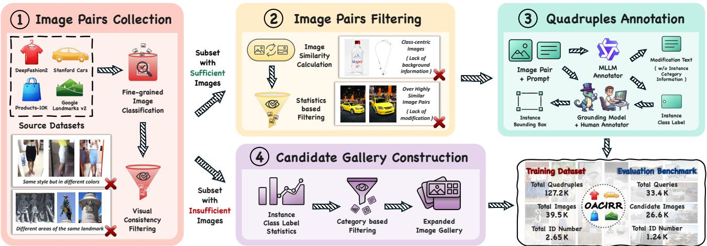
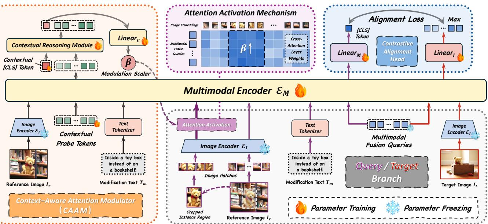
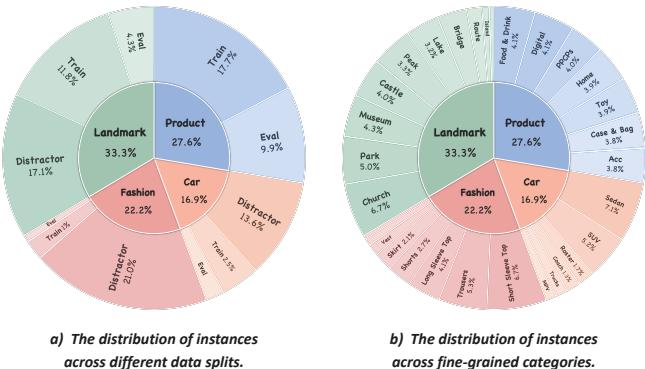
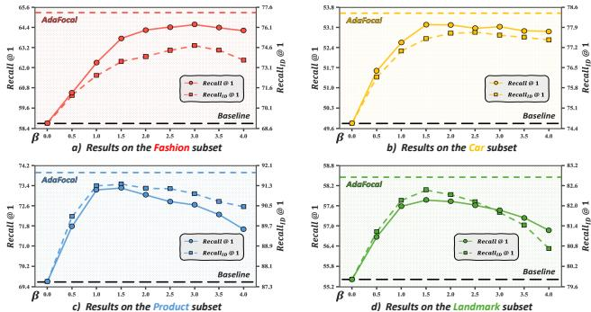
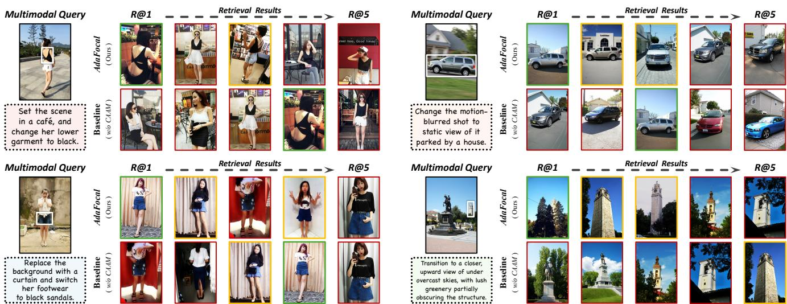

# 1. 论文基本信息

## 1.1. 标题
**超越语义搜索：面向组合图像检索中的指代锚定**

## 1.2. 作者
Yuxin Yang, Yinan Zhou, Yuxin Chen, Ziqi Zhang, Zongyang Ma, Chunfeng Yuan, Bing Li, Jun Gao, Weiming Hu

**作者背景与隶属机构：**
*   **Yuxin Yang, Ziqi Zhang, Zongyang Ma, Chunfeng Yuan, Bing Li, Weiming Hu**: 中国科学院自动化研究所 (CAS Institute of Automation) / 中国科学院大学 (University of Chinese Academy of Sciences)。
*   **Yinan Zhou**: 西安交通大学 (Xi'an Jiaotong University) / 腾讯公司 (Tencent Inc.)。
*   **Yuxin Chen**: 腾讯公司 (Tencent Inc.)。
*   **Jun Gao**: HelloGroup Inc.。
*   **Weiming Hu**: 上海科技大学 (ShanghaiTech University)。

## 1.3. 发表期刊/会议
**CVPR 2026 (IEEE/CVF Conference on Computer Vision and Pattern Recognition)**
*注：根据论文中 Table 1 的信息显示，该论文被 CVPR 2026 接收。CVPR 是计算机视觉领域最顶级的国际会议之一，具有极高的学术声誉和影响力。*

## 1.4. 发表年份
2026年

## 1.5. 摘要
组合图像检索 (CIR) 通过结合参考图像和修改文本实现了灵活的多模态查询，展现了巨大潜力。然而，CIR 本质上优先考虑语义匹配，难以在跨上下文的情况下可靠地检索用户指定的特定实例。在实际应用中，强调具体的实例保真度往往比广泛的语义匹配更重要。本文提出了<strong>对象锚定组合图像检索 (OACIR)</strong>，这是一种新颖的细粒度检索任务，要求严格的实例级一致性。为了推进该任务的研究，作者构建了 **OACIRR**（真实世界图像上的 OACIR），这是第一个大规模、多领域的基准测试，包含超过 16 万个四元组和四个充满困难负样本干扰项的候选库。每个四元组通过一个边界框增强了组合查询，该边界框在视觉上锚定了参考图像中的对象，提供了一种精确且灵活的方式来确保实例保留。为了解决 OACIR 任务，作者提出了 **AdaFocal**，这是一个具有**上下文感知注意力调制器** 的框架，能够自适应地增强指定实例区域内的注意力，动态平衡锚定实例与更广泛的组合上下文之间的关注点。大量实验表明，AdaFocal 大幅优于现有的组合检索模型，特别是在保持实例级保真度方面，从而为这一具有挑战性的任务建立了强有力的基线。

## 1.6. 原文链接
*   **ArXiv 链接**: https://arxiv.org/abs/2604.05393
*   **PDF 链接**: https://arxiv.org/pdf/2604.05393
*   **发布状态**: 预印本，已接收至 CVPR 2026。

    ---

# 2. 整体概括

## 2.1. 研究背景与动机
**核心问题：**
传统的组合图像检索 (CIR) 任务主要关注**语义匹配**。例如，用户给一张“红裙子”的图，输入文本“换个背景”，系统会检索出“红裙子”在“新背景”下的图。然而，CIR 往往将参考图像视为一个粗粒度的视觉锚点，主要关注全局场景或物体类别。当候选库中存在许多视觉相似的干扰项（例如不同款式的红裙子）时，CIR 难以可靠地检索出用户指定的**特定实例**（即完全相同的那个物体）。

**重要性：**
在许多实际应用中，如电商搜索、数字记忆检索或长期身份追踪，用户往往关心的是**具体的某个物体**（实例级保真度），而不仅仅是语义相似的物体。现有方法在处理这种“跨上下文的实例一致性”时存在明显缺陷。

**切入点与创新思路：**
本文提出了一种新任务 **OACIR (Object-Anchored Composed Image Retrieval)**。其核心创新在于引入了**边界框** 作为视觉锚点。用户不仅提供参考图和文本，还通过边界框明确指出“我要保留的是图中的这个东西”。这迫使模型在满足文本修改的同时，必须严格保留锚定对象的身份，从而将检索从语义层面提升到了实例层面。

## 2.2. 核心贡献/主要发现
1.  **新任务定义：** 提出了 **OACIR** 任务，通过引入边界框锚点，强制要求组合检索必须满足严格的实例级一致性，突破了传统 CIR 仅关注语义匹配的局限。
2.  **大规模基准数据集：** 构建了 **OACIRR** 数据集。这是首个大规模、多领域的 OACIR 基准，包含超过 16 万个真实世界的四元组，并精心设计了包含困难负样本的候选库，用于严格评估实例级检索能力。
3.  **新方法 AdaFocal：** 提出了 **AdaFocal** 框架。它包含一个<strong>上下文感知注意力调制器 (CAAM)</strong>，能够根据当前的查询上下文，动态地预测一个调制标量，从而在特征融合过程中自适应地增强对锚定实例区域的注意力，实现了实例保留与组合推理之间的动态平衡。
4.  **验证与发现：** 实验证明，现有的通用多模态检索 (UMR) 和 CIR 模型在 OACIR 任务上表现不佳，主要原因是缺乏实例级判别能力。AdaFocal 显著优于这些基线，证明了显式的视觉锚定和自适应注意力机制对于实例感知检索的有效性。

    ---

# 3. 预备知识与相关工作

## 3.1. 基础概念
为了理解本文，读者需要掌握以下核心概念：

*   <strong>组合图像检索 (Composed Image Retrieval, CIR):</strong>
    一种多模态检索范式，查询由两部分组成：一张**参考图像** ($I_r$) 和一段**修改文本** ($T_m$)。系统的目标是检索出一张目标图像 ($I_t$)，该图像在视觉上既与参考图像相关，又满足文本描述的修改要求。例如：“把这张图里的狗换成猫”。

*   **实例级一致性:**
    指检索结果中必须包含与查询中指定的**完全相同的物体**。这不仅仅是类别相同（例如都是“狗”），而是身份相同（例如是“这只特定的斑点狗”）。在计算机视觉中，这通常涉及**细粒度识别**。

*   **视觉锚定 / 视觉定位:**
    指在图像中定位特定对象的过程，通常通过**边界框** 来表示。本文利用边界框作为显式的视觉提示，告诉模型应该关注图像中的哪一部分。

*   **主干网络:**
    指深度学习模型中用于提取底层特征的核心网络部分（如 ResNet, ViT）。本文使用的是预训练的视觉-语言模型作为主干网络。

*   **微调:**
    指在一个预训练模型的基础上，使用特定任务的数据继续训练模型，以调整模型参数使其适应新任务的过程。

## 3.2. 前人工作
作者在文中主要讨论了以下两类相关工作：

1.  <strong>组合图像检索 (CIR):</strong>
    *   **监督式 CIR:** 利用 VLP 模型（如 BLIP, CLIP）进行编码，然后使用各种适应策略。
    *   <strong>零样本 CIR (ZS-CIR):</strong> 尝试将参考图像转换为伪文本描述，或者利用大语言模型 (LLM) 生成目标描述，将问题转化为文本到图像的检索。
    *   **数据合成:** 通过自动合成大规模训练三元组来解决数据稀缺问题。
    *   **局限:** 这些方法主要在**语义层面**操作，难以在存在干扰项的情况下可靠地检索特定实例。

2.  **图像检索中的实例一致性:**
    *   **以人为中心的任务:** 如基于图像的人员检索 (IPR) 及其变体。这些方法虽然推进了人员识别，但其专注于特定领域的特性限制了其在通用物体检索中的适用性。
    *   **个性化 VLM:** 通过微调模型将视觉概念与可学习的文本令牌关联。这种方法依赖每个实例的优化，阻碍了可扩展性和实用性。

## 3.3. 技术演进
该领域的技术演进路径可以概括为：
**单模态检索** (文本搜图/图搜图) -> **多模态检索** (文本搜图) -> <strong>组合图像检索 (CIR)</strong> (图+文搜图，关注语义) -> <strong>对象锚定组合图像检索 (OACIR)</strong> (图+文+边界框搜图，关注实例)。
本文的工作处于这一演进链条的最前沿，试图解决 CIR 在细粒度实例检索上的短板。

## 3.4. 差异化分析
与现有工作相比，本文的核心区别在于：
*   **输入形式不同：** OACIR 引入了**边界框**作为显式输入，这是传统 CIR 不具备的。
*   **目标约束不同：** OACIR 强制要求**实例级一致性**，而传统 CIR 仅要求语义一致性。
*   **方法机制不同：** 现有的实例一致性方法往往需要针对特定领域（如行人重识别）设计架构，或者需要针对每个实例进行微调。本文的 OACIR 框架通过**推理时的显式视觉提示**（边界框）和**自适应注意力机制**实现了通用的、无需针对每个实例微调的实例感知检索。

    ---

# 4. 方法论

本章将深入剖析论文提出的 OACIR 任务定义、OACIRR 数据集构建流程以及 AdaFocal 框架的技术细节。

## 4.1. OACIRR 数据集构建
为了支持 OACIR 任务，作者构建了一个高质量的大规模数据集。构建流程包含四个关键阶段，如下图所示：

**阶段 1：图像对收集**
首先需要收集包含相同实例但在不同上下文中的图像对。作者利用了四个大规模细粒度分类数据集作为源：DeepFashion2, Stanford Cars, Products-10K, 和 Google Landmarks v2。
*   **操作：** 将具有相同实例 ID ($y_i$) 的图像组织成高保真集合 $S_j$。
*   **过滤：** 只有当集合 $S_j$ 中的图像数量超过阈值 $\tau_{valid}$ 时，才被视为有效构建集。

**阶段 2：图像对过滤**
为了确保数据质量和任务难度，对图像对进行两步过滤：
1.  **相似度过滤：** 丢弃特征余弦相似度过高的图像对，防止修改文本无意义（即防止两张图太像，导致模型只需依赖图像相似度捷径）。
2.  **类别中心过滤：** 过滤掉以类别为中心的图像。如果一张图像与集合内至少 $\tau_{count}$ 张其他图像视觉相似，则将其丢弃，以促进背景多样性。

**阶段 3：四元组标注**
从过滤后的参考图像和目标图像对 $(I_r, I_t)$ 中，构建最终的查询四元组 $(I_r, B_r, T_m, I_t)$。
*   $B_r$：锚定实例在参考图上的边界框。使用 Grounding 模型（如 Grounding DINO）生成初步建议，低置信度的建议进行人工标注。
*   $T_m$：修改文本。利用强大的多模态大语言模型 (MLLM) 生成，描述从 $I_r$ 到 $I_t$ 的上下文变化。

**阶段 4：候选库构建**
为了严格评估模型的实例判别能力，构建了包含困难负样本的候选库。
*   **策略：** 首先识别测试查询中所有唯一类别标签 $\mathcal{L}_s$。然后从保留池（阶段 1 中未用于构建的图像）中采样类别标签 $l_{cat} \in \mathcal{L}_s$ 的图像作为困难负样本。这确保了候选库中充满了类别相关但实例不一致的干扰项。

## 4.2. AdaFocal 框架
AdaFocal 是为了解决 OACIR 任务中的两个核心挑战而提出的：**组合推理**（融合实例、全局场景、文本）和**细粒度判别**（区分相似实例）。其核心思想是动态地增强对锚定实例区域的注意力。

下图展示了 AdaFocal 的整体架构：

*该图像是图示，展示了我们提出的AdaFocal框架的整体架构。框架包含上下文感知注意调制模块（CAAM）和多模态编码器（$E_M$），通过上下文推理模块和注意力激活机制实现图像和文本的融合，旨在提升实例级一致性和检索精度。*

### 4.2.1. 整体架构
AdaFocal 围绕一个中心**多模态编码器** $\mathcal{E}_\mathcal{M}$ 构建，包含两个分支：
1.  **查询分支:** 处理输入查询 $(I_r, B_r, T_m)$。它通过 <strong>上下文感知注意力调制器 (CAAM)</strong> 进行增强，该模块分析多模态上下文以预测调制信号。
2.  **目标分支:** 处理目标图像 $I_t$，通过冻结的图像编码器 $\mathcal{E}_\mathcal{T}$ 和多模态编码器生成表示。

    最后，两个分支的输出通过对比对齐头投影到共享嵌入空间。

### 4.2.2. 上下文感知注意力调制器 (CAAM)
CAAM 的核心挑战是根据 $I_r$ 和 $T_m$ 的语义上下文，确定对边界框 $B_r$ 指定区域的适当关注程度。

**工作流程：**
1.  CAAM 首先通过冻结的图像编码器和文本分词器处理参考图像和修改文本。
2.  这些特征与一组**可学习的上下文探测令牌** $\{ \mathsf{p}_k \}_{k=1}^K$ 一起输入到共享的多模态编码器中。这些探测令牌通过与多模态输入交互来捕获上下文线索。
3.  输出特征与一个可学习的上下文 [CLS] 令牌一起被送入<strong>上下文推理模块 (CRM)</strong>。
4.  CRM 聚合并推理这些令牌，生成最终的上下文表示。
5.  该表示通过映射层 $\text{Linear}_\mathcal{C}$ 投影，形成最终的查询特定的**调制标量** $\beta$。

**数学公式：**
$$
\beta = \operatorname { L i n e a r } _ { \boldsymbol { \mathcal { C } } } ( \operatorname { C R M } ( \mathcal { E } _ { \boldsymbol { \mathcal { M } } } ( \mathcal { E } _ { \boldsymbol { \mathcal { T } } } ( I _r ) , T _ m , \{ \mathfrak { p } _ k \} ) ) )
$$

**符号解释：**
*   $\beta$: 预测出的调制标量，用于控制注意力增强的强度。
*   $\operatorname{Linear}_\mathcal{C}$: 线性映射层。
    *   $\operatorname{CRM}$: 上下文推理模块（如 Transformer 层）。
*   $\mathcal{E}_\mathcal{M}$: 多模态编码器。
*   $\mathcal{E}_\mathcal{T}$: 冻结的图像编码器。
*   $I_r$: 参考图像。
*   $T_m$: 修改文本。
*   $\{ \mathfrak{p}_k \}$: 可学习的上下文探测令牌集合。

### 4.2.3. 注意力激活机制
调制标量 $\beta$ 驱动查询分支中的注意力激活机制。该机制在多模态编码器的交叉注意力计算中注入动态偏置。

**原理：**
多模态编码器通过其 $M$ 个冻结的多模态融合查询 $\{ \mathsf{q}_m \}_{m=1}^M$ 与参考图像的 $N$ 个视觉 patch 嵌入 $\{ \mathbf{e}_n \}_{n=1}^N$ 之间的交叉注意力来融合视觉信息。
受生成模型中注意力操纵技术的启发，作者将学习到的调制标量 $\beta$ 作为动态偏置注入到交叉注意力计算中。具体来说，使用一个与边界框 $B_r$ 空间对齐的二进制掩码 $M_{B_r}$ 来应用这个偏置。

**数学公式：**
$$
\{ \hat { \bf q } _ { m } \} = A ^ { \prime } V = \mathrm { S o f t m a x } \left( \frac { Q K ^ { T } + \beta \cdot M _ { B _ { r } } } { \sqrt { d _ { k } } } \right) V
$$

**符号解释：**
*   $\{ \hat{\mathbf{q}}_m \}$: 更新后的查询向量。
*   $A'$: 调制后的注意力权重。
*   $V$: 值矩阵，由视觉 patch 嵌入通过投影 $f_v(\cdot)$ 得到。
*   $Q$: 查询矩阵，由 $\{ \mathsf{q}_m \}$ 通过投影 $f_q(\cdot)$ 得到。
*   $K$: 键矩阵，由 $\{ \mathbf{e}_n \}$ 通过投影 $f_k(\cdot)$ 得到。
*   $\beta$: 由 CAAM 预测的调制标量。
*   $M_{B_r}$: 与边界框 $B_r$ 对应的二进制掩码矩阵。在边界框区域内的位置值为 1（或特定值），其余为 0。
*   $d_k$: 键矩阵的维度。
*   $\sqrt{d_k}$: 缩放因子，用于防止点积过大。

**分析：**
这个公式的核心在于 $Q K^T + \beta \cdot M_{B_r}$ 这一项。标准的交叉注意力得分是 $Q K^T$。这里加上了一个偏置项 $\beta \cdot M_{B_r}$。由于 $M_{B_r}$ 仅在边界框区域内有值，这意味着在 Softmax 操作之前，边界框区域内的注意力得分会被人为地“抬高” $\beta$ 倍。这使得模型在计算注意力时，会更多地关注边界框内的视觉特征，从而实现实例保留。

### 4.2.4. 目标函数
训练过程中，使用基于批次的对比学习目标函数。

**查询表示 $f_q$ 的计算：**
$$
f _ { q } = \mathrm { L i n e a r } _ { \mathcal { M } } ( \mathcal { E } _ { \mathcal { M } } ^ { \prime } ( \mathcal { E } _ { \mathcal { T } } ( I _ { r } ) , B _ { r } , T _ { m } , \{ q _ { m } \} ) )
$$
其中 $\mathcal{E}_\mathcal{M}'$ 表示运行了注意力激活机制的多模态编码器。

**目标表示 $f_t$ 的计算：**
$$
f _ { t } = \mathrm { L i n e a r } _ { \mathcal { T } } ( \mathcal { E } _ { \mathcal { M } } ( \mathcal { E } _ { \mathcal { T } } ( I _ { t } ) , \{ q _ { m } \} ) )
$$

**对比对齐损失：**
$$
\mathcal { L } _ { \mathrm { A l i g n } } = - \frac { 1 } { | \mathcal { B } | } \sum _ { i = 1 } ^ { | \mathcal { B } | } \log \frac { \mathbb { S } ( f _ { q } ^ { ( i ) } , f _ { t } ^ { ( i ) } ) } { \sum _ { j = 1 } ^ { | \mathcal { B } | } \mathbb { S } ( f _ { q } ^ { ( i ) } , f _ { t } ^ { ( j ) } ) }
$$

**符号解释：**
*   $\mathcal{L}_{\mathrm{Align}}$: 对比对齐损失函数。
*   $\mathcal{B}$: 训练批次。
*   $|\mathcal{B}|$: 批次大小。
*   $f_q^{(i)}$: 批次中第 $i$ 个样本的查询表示。
*   $f_t^{(i)}$: 批次中第 $i$ 个样本的目标（正样本）表示。
*   $f_t^{(j)}$: 批次中第 $j$ 个样本的目标表示（作为负样本，当 $j \neq i$ 时）。
*   $\mathbb{S}(a, b)$: 相似度函数，定义为 $\exp(\text{Sim}(a, b) / \tau)$。
*   $\text{Sim}(\cdot)$: 余弦相似度函数。
*   $\tau$: 温度超参数。

**分析：**
这是一个标准的 InfoNCE 损失函数。它的目标是拉近同一对 $(I_r, I_t)$ 的查询表示和目标表示的距离，同时推远查询表示与批次内其他目标表示的距离。

---

# 5. 实验设置

## 5.1. 数据集
实验主要在本文提出的 **OACIRR** 基准上进行。
*   **规模：** 训练集包含 127.2K 个四元组。评估基准包含 33.4K 个查询和 26.6K 个独特的图像（包含干扰项）。
*   **领域：** 包含四个子集：Fashion（时尚）、Car（汽车）、Product（产品）、Landmark（地标）。
*   **特点：** 该数据集是真实世界的图像，且每个四元组都保证了实例一致性，候选库中充满了类别相关但实例不同的困难负样本。

    下表展示了 OACIRR 数据集的实例分布情况：

    
    *该图像是图表，展示了 OACIRR 基准中实例的分布情况。左侧的图 a 显示了在不同数据划分中实例的分布，其中 Landmark 类占比为 33.3%、Product 类为 27.6%。右侧的图 b 则细分了各个类别下的实例分布，Landmark 和 Fashion 类同样占据显著比例，分别为 33.3% 和 22.2%。*

## 5.2. 评估指标
为了评估 OACIR 任务，论文关注两个关键方面：语义正确性和实例一致性。因此引入了以下指标：

1.  **Recall@K (R@K):**
    *   **概念定义:** 标准的召回率指标。计算在前 $K$ 个检索结果中，出现正确目标图像的概率。它主要评估模型在语义层面的检索准确性。
    *   **数学公式:**
        $$
        \text{Recall}@K = \frac{1}{|\mathcal{Q}|} \sum_{q \in \mathcal{Q}} \mathbb{I}(\text{rank}(q, \text{gt}(q)) \leq K)
        $$
    *   **符号解释:**
        *   $\mathcal{Q}$: 查询集合。
        *   $q$: 单个查询。
        *   $\text{gt}(q)$: 查询 $q$ 对应的真实标注目标图像。
        *   $\text{rank}(q, \text{gt}(q))$: 真实目标图像在检索结果列表中的排名。
        *   $\mathbb{I}(\cdot)$: 指示函数，条件成立为 1，否则为 0。

2.  **Instance Recall@K (RID@K):**
    *   **概念定义:** 实例召回率。这是本文特别提出的指标。只有当检索到的图像包含与参考图像边界框中指定的**完全相同的实例 ID** 时，才视为检索正确。它专门用于衡量模型的实例保真度。
    *   **数学公式:**
        $$
        \text{RID}@K = \frac{1}{|\mathcal{Q}|} \sum_{q \in \mathcal{Q}} \mathbb{I}(\exists I \in \text{TopK}(q) \text{ s.t. } \text{ID}(I) = \text{ID}_{\text{anchor}}(q))
        $$
    *   **符号解释:**
        *   $\text{TopK}(q)$: 查询 $q$ 的前 $K$ 个检索结果集合。
        *   $I$: 检索结果中的一张图像。
        *   $\text{ID}(I)$: 图像 $I$ 中包含的实例 ID。
        *   $\text{ID}_{\text{anchor}}(q)$: 查询 $q$ 中锚定实例的 ID。

## 5.3. 对比基线
论文将 AdaFocal 与以下三类基线模型进行了比较：
1.  <strong>通用多模态检索 (UMR) 模型:</strong> 如 UniIR, LamRA-Ret, MM-Embed, GME, U-MARVEL。这些模型通常具备视觉定位能力。
2.  <strong>零样本 CIR (ZS-CIR) 方法:</strong> 如 Pic2Word, LinCIR。这些方法缺乏边界框输入支持。
3.  **监督 CIR 方法:** 如 SPRC。这是目前最先进的监督 CIR 方法之一。

**评估协议：**
*   对于 UMR 模型：将边界框渲染在参考图上，并附加文本指令。
*   对于 CIR 模型：将实例约束转化为文本形式（如 "Same [Object]"）。
*   对于 AdaFocal：直接处理原生 OACIR 输入。

    ---

# 6. 实验结果与分析

## 6.1. 核心结果分析
下表展示了在 OACIRR 基准上的主要定量评估结果。

以下是原文 [Table 2] 的结果：

<table>
<thead>
<tr>
<th rowspan="2">Domain</th>
<th rowspan="2">Method</th>
<th rowspan="2">Pretraining Data</th>
<th colspan="3">Fashion</th>
<th colspan="3">Car</th>
<th colspan="3">Product</th>
<th colspan="3">Landmark</th>
<th rowspan="2">Avg.</th>
</tr>
<tr>
<th>RID@1</th>
<th>R@1</th>
<th>R@5</th>
<th>RID@1</th>
<th>R@1</th>
<th>R@5</th>
<th>RID@1</th>
<th>R@1</th>
<th>R@5</th>
<th>RID@1</th>
<th>R@1</th>
<th>R@5</th>
</tr>
</thead>
<tbody>
<tr>
<td rowspan="6">UMR</td>
<td>UniIR-CLIPF [43]</td>
<td>M-BEIR [43]</td>
<td>17.33</td>
<td>12.26</td>
<td>24.76</td>
<td>32.67</td>
<td>16.95</td>
<td>41.89</td>
<td>33.71</td>
<td>18.22</td>
<td>40.10</td>
<td>29.47</td>
<td>15.51</td>
<td>43.24</td>
<td>27.18</td>
</tr>
<tr>
<td>UniIR-BLIPFF [43]</td>
<td></td>
<td>28.53</td>
<td>22.41</td>
<td>39.63</td>
<td>37.21</td>
<td>19.97</td>
<td>46.51</td>
<td>37.76</td>
<td>20.98</td>
<td>43.19</td>
<td>31.71</td>
<td>17.14</td>
<td>52.12</td>
<td>33.10</td>
</tr>
<tr>
<td>LamRA-Ret [30]</td>
<td>M-BEIR + NLI [36]</td>
<td>27.45</td>
<td>21.63</td>
<td>37.10</td>
<td>61.03</td>
<td>35.44</td>
<td>74.51</td>
<td>69.45</td>
<td>39.53</td>
<td>70.25</td>
<td>58.64</td>
<td>32.58</td>
<td>68.74</td>
<td>49.70</td>
</tr>
<tr>
<td>MM-Embed [28]</td>
<td>M-BEIR + MTEB [35]</td>
<td>41.38</td>
<td>34.55</td>
<td>52.50</td>
<td>53.21</td>
<td>30.06</td>
<td>62.80</td>
<td>71.03</td>
<td>41.47</td>
<td>71.15</td>
<td>78.85</td>
<td>38.88</td>
<td>79.32</td>
<td>54.60</td>
</tr>
<tr>
<td>GME (2B) [52]</td>
<td>UMRB [52]</td>
<td>38.13</td>
<td>32.14</td>
<td>51.50</td>
<td>58.84</td>
<td>31.60</td>
<td>66.03</td>
<td>76.89</td>
<td>44.11</td>
<td>74.20</td>
<td>73.86</td>
<td>38.99</td>
<td>75.61</td>
<td>55.16</td>
</tr>
<tr>
<td>GME (7B) [52]</td>
<td></td>
<td>44.98</td>
<td>39.24</td>
<td>60.18</td>
<td>63.11</td>
<td>38.34</td>
<td>75.38</td>
<td>83.44</td>
<td>54.60</td>
<td>84.15</td>
<td>77.11</td>
<td>47.09</td>
<td>82.69</td>
<td>62.53</td>
</tr>
<tr>
<td>U-MARVEL [24]</td>
<td>M-BEIR + NLI</td>
<td>46.05</td>
<td>40.38</td>
<td>60.59</td>
<td>62.92</td>
<td>39.96</td>
<td>74.90</td>
<td>83.26</td>
<td>54.69</td>
<td>84.13</td>
<td>69.81</td>
<td>37.67</td>
<td>73.08</td>
<td>60.62</td>
</tr>
<tr>
<td rowspan="2">ZS-CIR</td>
<td>Pic2Word [38]</td>
<td>CC3M [9]</td>
<td>14.98</td>
<td>11.15</td>
<td>21.82</td>
<td>12.07</td>
<td>4.07</td>
<td>11.32</td>
<td>45.95</td与其他行不同，此处数据可能存在OCR错位，根据上下文推断应为> <td>13.66</td> <td>34.19</td> <td>55.98</td> <td>20.99</td> <td>52.12</td> <td>24.84</td>
</tr>
<tr>
<td>LinCIR [16]</td>
<td></td>
<td>15.78</td>
<td>21.55</td>
<td>12.04</td>
<td>5.55</td>
<td>2.23</td>
<td>7.28</td>
<td>47.55</td>
<td>14.63</td>
<td>34.91</td>
<td>42.76</td>
<td>19.57</td>
<td>47.15</td>
<td>22.61</td>
</tr>
<tr>
<td rowspan="2">CIR</td>
<td>SPRC (ViT-L) [4]</td>
<td>CIRR [31]</td>
<td>28.54</td>
<td>25.49</td>
<td>36.78</td>
<td>52.55</td>
<td>61.09</td>
<td>44.26</td>
<td>54.80</td>
<td>75.85</td>
<td>22.47</td>
<td>68.99</td>
<td>15.23</td>
<td>46.48</td>
<td>86.95</td>
<td>80.29</td>
</tr>
<tr>
<td>SPRC (ViT-G) [4]</td>
<td></td>
<td>28.62</td>
<td>25.79</td>
<td>37.06</td>
<td>54.39</td>
<td>65.25</td>
<td>44.48</td>
<td>58.51</td>
<td>80.89</td>
<td>25.13</td>
<td>72.87</td>
<td>15.92</td>
<td>49.82</td>
<td>89.57</td>
<td>86.05</td>
</tr>
<tr>
<td rowspan="2">OACIR</td>
<td>AdaFocal (ViT-L)</td>
<td>OACIRR (Ours)</td>
<td>72.60</td>
<td>61.95</td>
<td>85.30</td>
<td>75.68</td>
<td>51.87</td>
<td>90.04</td>
<td>87.76</td>
<td>69.94</td>
<td>93.32</td>
<td>80.50</td>
<td>57.55</td>
<td>82.92</td>
<td>90.25</td>
<td>76.40</td>
</tr>
<tr>
<td>AdaFocal (ViT-G)</td>
<td></td>
<td>77.15</td>
<td>65.31</td>
<td>86.88</td>
<td>78.42</td>
<td>53.63</td>
<td>92.22</td>
<td>91.86</td>
<td>74.11</td>
<td>95.39</td>
<td>82.92</td>
<td>58.47</td>
<td>91.63</td>
<td>79.00</td>
</tr>
</tbody>
</table>

*注：表格中部分 ZS-CIR 行的数据在原文排版中存在错位，这里尽量根据逻辑对齐，重点在于对比 OACIR 方法与其他方法的差距。*

**结果分析：**
1.  **AdaFocal 的优越性：** AdaFocal (ViT-G) 在所有子集上都显著优于现有方法。在平均 Recall@1 上达到了 79.00%，比最强的 CIR 基线 (SPRC) 高出约 5 个百分点。
2.  **实例保真度的关键差异：** 观察 **RID@1**（实例召回率）列，AdaFocal 的优势更加明显。例如在 Fashion 子集上，AdaFocal 达到了 77.15%，而最强的 UMR 模型 (U-MARVEL) 仅为 46.05%。这证明了现有模型虽然能检索到语义相似的图像，但在保持特定实例身份上非常失败。
3.  **数据集的重要性：** 强大的 CIR 基线 SPRC 在 CIRR 数据集上训练后表现一般，但在 OACIRR 数据集上微调后性能大幅提升（从 Avg 37.30% 提升到 74.05%）。这验证了构建实例一致性数据集对于解决该任务的重要性。

## 6.2. 消融实验/参数分析

### 6.2.1. CAAM 架构消融
下表展示了不同 CAAM 架构配置对性能的影响。

以下是原文 [Table 3] 的结果：

| CAAM | | | OACIRR Benchmark | | |
| :--- | :--- | :--- | :--- | :--- | :--- |
| **CRM** | **Probe Tokens** | **RID@1** | **R@1** | **R@5** | **Avg.** |
| Baseline (w/o CAAM) | | 77.74 | 58.39 | 88.61 | 74.40 |
| Average Pooling | Frozen | 79.70 | 59.84 | 89.62 | 76.39 |
| Average Pooling | Learnable | 79.83 | 59.57 | 89.54 | 76.31 |
| MLP | Frozen | 80.51 | 60.55 | 90.15 | 77.07 |
| MLP | Learnable | 81.10 | 61.10 | 90.40 | 77.53 |
| Transformer | Frozen | 81.59 | 61.85 | 91.13 | 78.19 |
| Transformer | Learnable | **82.59** | **62.88** | **91.53** | **79.00** |

**分析：**
*   **上下文聚合方法的重要性：** Transformer-based CRM 优于简单的平均池化或 MLP。这表明对于复杂的组合上下文，更强的推理能力是必要的。
*   **可学习探测令牌的重要性：** 在所有配置中，使用可学习的探测令牌都优于冻结的令牌。这说明任务自适应的令牌能捕获更细致的上下文线索。

### 6.2.2. 调制标量 $\beta$ 的影响
下图展示了不同 $\beta$ 设置下的性能对比。

**分析：**
*   **固定 $\beta$ 的权衡：** 当 $\beta$ 增加时，实例召回率 (RID@1) 上升并趋于饱和，因为增强注意力有助于识别实例。然而，标准召回率 (R@1) 在达到峰值后急剧下降，因为过大的 $\beta$ 导致模型忽略了背景和文本上下文，导致语义不匹配。
*   **自适应 $\beta$ 的必要性：** 不同子集的最优固定 $\beta$ 值不同。AdaFocal 利用 CAAM 预测查询特定的 $\beta$，在所有条件下都优于任何固定策略，证明了上下文感知的调制是必要的。

### 6.2.3. 边界框质量鲁棒性
作者还测试了 AdaFocal 对边界框噪声的鲁棒性。通过缩放和平移边界框来模拟噪声。
*   **结果：** AdaFocal 对缩放噪声具有鲁棒性，性能下降可忽略不计。对于缩放+平移的组合噪声，性能有较明显下降，但仍优于无边界框的情况。这表明模型能容忍中等程度的输入噪声。

## 6.3. 定性结果分析
下图展示了 AdaFocal 与基线模型的定性比较结果。

**分析：**
*   **基线模型的失败模式：** 基线模型（无自适应注意力）往往错误地优先考虑修改文本中的语义线索，导致检索出实例不一致的结果（例如换成了不同款式的衣服）。
*   **AdaFocal 的成功：** 在 CAAM 的引导下，AdaFocal 通过自适应地增强对锚定实例的关注，成功检索到了真实目标，既满足了个性化约束，又精确解释了上下文变化。

    ---

# 7. 总结与思考

## 7.1. 结论总结
本文提出了<strong>对象锚定组合图像检索 (OACIR)</strong> 这一新任务，旨在解决传统组合图像检索在跨上下文场景下无法可靠检索特定实例的问题。作者构建了 **OACIRR**，一个大规模、多领域、包含困难负样本的基准数据集。为了解决该任务，作者提出了 **AdaFocal** 框架，通过<strong>上下文感知注意力调制器 (CAAM)</strong> 动态地增强对锚定实例区域的注意力。实验表明，AdaFocal 显著优于现有的检索范式，特别是在保持实例级保真度方面，为这一具有挑战性的任务建立了强有力的基线。

## 7.2. 局限性与未来工作
**局限性：**
*   虽然 AdaFocal 对边界框噪声具有一定的鲁棒性，但极端的定位错误仍会导致性能下降。
*   该方法依赖于高质量的边界框输入，如果用户无法提供精确的边界框，可能需要额外的目标检测模块作为前置步骤。

**未来工作：**
*   作者希望该工作能激发新一代更灵活、更具实例感知能力的组合检索系统。
*   可以探索如何将 OACIR 扩展到视频检索或更复杂的多对象交互场景。

## 7.3. 个人启发与批判
**启发：**
1.  **从语义到实例的跨越：** 这篇论文最大的启发在于指出了当前多模态检索领域的一个盲点——我们往往满足于“语义相似”，却忽略了“实例一致”。在电商、个人相册管理等实际场景中，实例一致性往往才是用户的真实需求。
2.  **显式提示的力量：** 通过引入边界框这一显式的视觉提示，模型不再需要“猜测”用户关注的是图中的哪一部分，这极大地降低了任务的歧义性。
3.  **动态注意力机制：** AdaFocal 中的动态调制标量 $\beta$ 是一个非常精妙的设计。它避免了手动设置超参数的困难，让模型根据上下文自己决定“我应该多关注这个框”。这种“让模型学会如何调节自己”的思想值得借鉴。

**批判性思考：**
1.  **数据集构建的复杂性：** OACIRR 数据集的构建流程非常复杂且依赖人工校验（如低置信度边界框的人工标注）。这虽然保证了数据质量，但也限制了数据集快速扩展到其他领域的可能性。未来能否探索更自动化、更弱监督的数据构建方式？
2.  **计算开销：** 虽然 CAAM 被描述为轻量级模块，但引入额外的 Transformer 层（CRM）和探测令牌不可避免地会增加推理时的计算量和显存占用。在边缘设备或对实时性要求极高的场景下，这可能是一个瓶颈。
3.  **泛化能力：** 虽然论文展示了跨域泛化实验，但 OACIR 任务本质上依赖于视觉特征的高度对齐。对于跨模态变化极大的情况（例如从素描图检索真实照片，且要求同一物体），AdaFocal 的表现如何尚待验证。