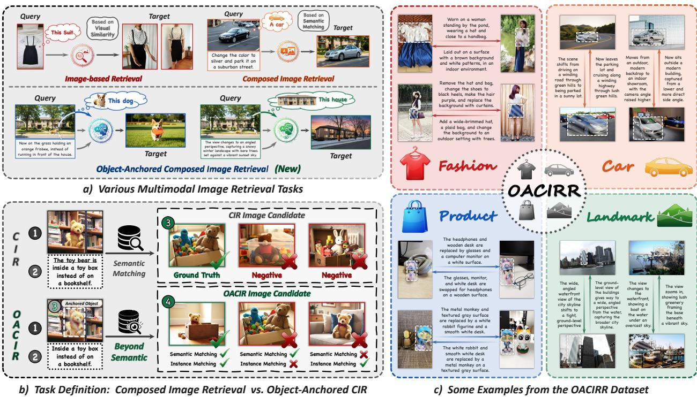
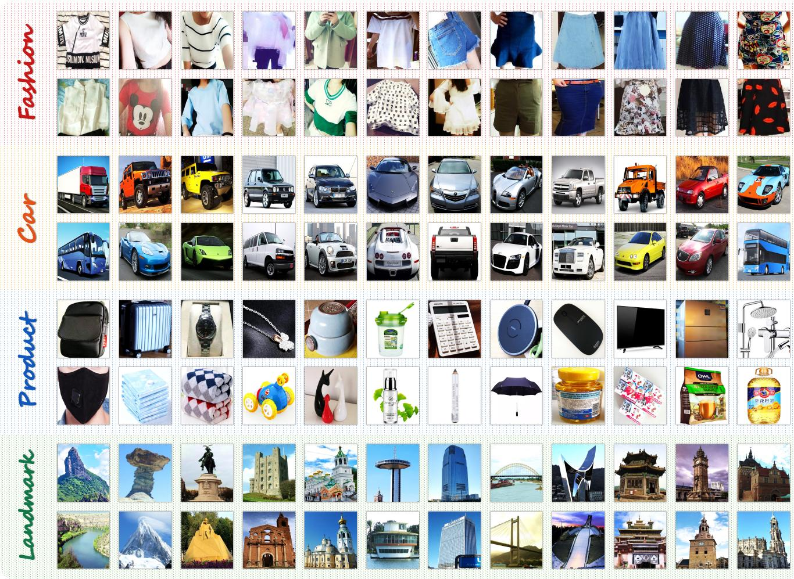
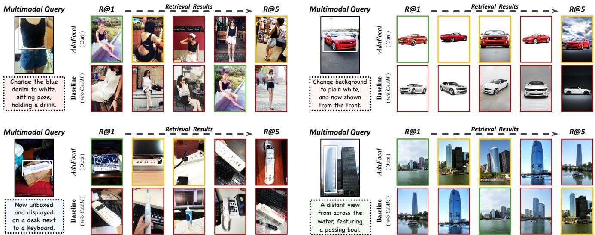

# 超越语义搜索：面向组合图像检索中的参考锚定

杨宇昕1,2 周译南3,4 陈毓欣4 张子齐1 马宗扬1 袁春峰1,2, \* 李兵1,2,5 高俊6 胡伟明1,2,7 1中国科学院自动化研究所 2中国科学院大学 3西安交通大学 4腾讯公司 5PeopleAI公司 6HelloGroup公司 7上海科技大学 {yangyuxin2023, mazongyang2020}@ia.ac.cn, {ziqi.zhang, cfyuan, bli, wmhu}@nlpr.ia.ac.cn, zyn13572297710@stu.xjtu.edu.cn, uasonchen@tencent.com, gaojun55@gmail.com

  
Figure 1. Overview of the Object-Anchored Composed Image Retrieval (OACIR) task and our OACIRR dataset.

# 摘要

组合图像检索（CIR）凭借结合参考图像和修改文本的灵活多模态查询，展现出了显著的潜力。然而，CIR固有地优先考虑语义匹配，在不同背景下难以可靠地检索用户指定的实例。在实际应用中，强调具体实例 ${ \mathit { f } } i { \mathit { \cdot } }$ 的保持而非广泛语义，通常更为重要。在本研究中，我们提出了基于对象锚点的组合图像检索（OACIR），这是一项新颖的细粒度检索任务，要求严格的实例级一致性。为了推动该任务的研究，我们构建了OACIRR（基于真实世界图像的OACIR），这是第一个大规模多领域基准，包含超过16万对四元组，以及四个具有挑战性的候选图像库，配备了困难的负实例干扰项。每个四元组通过一个边界框增强了组合查询，直观地将对象锚定在参考图像中，从而提供了一种精确而灵活的方式以确保实例保持。为了解决OACIR任务，我们提出了AdaFocal，一个框架，具备上下文感知注意力调节器，能够自适应地增强指定实例区域内的注意力，动态平衡锚定实例与更广泛组合上下文之间的关注。大量实验证明，AdaFocal在保持实例级保真度方面显著优于现有的组合检索模型，从而为这一具有挑战性的任务建立了一个稳健的基线，并为更灵活、实例感知的检索系统开辟了新方向。

# 1. 引言

图像检索的范式逐步演变为更加灵活和以用户为导向的交互形式。尽管传统的单模态方法往往难以表达复杂的用户意图，但组合图像检索（CIR）作为一种强大的范式，已应运而生，以应对这一局限。通过将参考图像与修改文本结合，CIR利用视觉和文本模态之间的协同作用，以检索语义对齐的目标图像。这一能力显著拓宽了其在多种领域的适用性，包括电子商务和互动搜索系统。尽管其灵活性较强，CIR的基本设计仍优先考虑语义匹配而非实例级保真度。如图1(a)所示，传统CIR查询中的参考图像通常充当粗粒度的视觉锚点，定义全球视觉场景或对象类别。因此，CIR模型的主要任务是进行广泛的语义整合，使得在视觉相似的干扰物存在时，特定实例的检索变得不可靠。在许多实际应用中，包括数字记忆检索和长期身份追踪，强调具体实例的保真度通常比实现广泛的语义对齐更为关键。在本研究中，我们提出对象锚定组合图像检索（OACIR），这是一项新颖的细粒度图像检索任务，要求严格的实例级一致性。如图1(b)所示，OACIR通过结合一个锚定实例扩展了传统的组合查询。我们的目标是检索一个目标图像，该图像在语义上满足文本修改的同时严格保留相同的锚定实例。实现这一目标显著推动了组合检索系统的发展，使得用户交互变得更加灵活和富有表现力，同时提高了在真实场景中的可靠性。尽管提供了这些优势，这一强大的构想还带来了两大核心挑战：（1）组合推理：需要将锚定实例、全球视觉场景和文本修改三种不同信息来源综合为一个统一的表示；（2）细粒度区分：需要从一个充满视觉和语义相似干扰物的图库中精确区分出锚定实例。为推动这一新兴任务的研究，我们构建了OACIRR（基于真实世界图像的OACIR），这是第一个针对OACIR的大规模多领域基准。正如图1(c)所示，OACIRR包括一个覆盖2,647个实例的127K四元组统一训练集，以及一个包含来自四个不同领域（时尚、汽车、产品和地标）1,238个实例的33.4K查询的大型评估基准。该基准还包含超过26.6K精心挑选的干扰实例，以构成富有挑战性的图库。综合来看，OACIRR提供了高质量的基础数据集和严格全面的OACIR任务基准。为了应对OACIR的独特挑战，我们提出了AdaFocal，一种简单但有效的框架，集成了轻量级的上下文敏感注意力调节器（CAAM）。该模块分析多模态查询上下文，以预测调节标量，然后在特征融合过程中自适应地强化对锚定实例的视觉注意力。该机制在实例保留和组合推理之间实现动态平衡。我们的大规模实验验证了AdaFocal在适应OACIR任务的现有检索范式中表现显著优越，在维持实例级保真度方面展现出显著优势。这些结果不仅确立了AdaFocal作为一个稳健基准的重要性，也强调了我们的基准在揭示当前语义级检索模型局限性方面的意义。总之，主要贡献如下：• 我们提出了新颖的对象锚定组合图像检索（OACIR）任务，通过要求严格的实例级一致性，推动了组合检索超越语义匹配。• 我们构建了OACIRR，一个包含超过160K真实世界四元组和3.9K独特实例的大规模多领域基准，并为严格的实例级评估制定了具有挑战性的评估协议。我们提出了AdaFocal，这一高效框架动态加强对锚定实例区域的注意力，为OACIR任务提供了稳健的基准。

# 2. 相关工作

组合图像检索。当前主流的监督组合图像检索（CIR）方法通常利用视觉-语言预训练（VLP）模型进行基础编码，然后采用各种适应策略针对检索任务进行调整。为了减轻对带注释三元组的依赖，零样本CIR（ZS-CIR）方法探索将参考图像转换为伪文本表示或使用LLM生成的目标描述，将问题重构为文本到图像的检索。另一条研究方向通过自动合成大规模训练三元组来解决数据稀缺问题。尽管这些方法存在差异，但它们在语义层面上操作，因此在不同上下文中可靠检索用户指定实例的能力不足。相比之下，我们的OACIR任务对实例保真度施加了严格的约束，从而实现更精确和可靠的检索。

  
Figure 2. The multi-stage construction pipeline for the OACIRR dataset.

图像检索中的实例一致性。实例级别一致性长期以来一直是图像检索的核心目标，在以人为中心的任务中得到了广泛研究，例如基于图像的人检索（IPR）[34, 42, 47, 55]、其换装变体（CC-IPR）[17]，以及最近的组合人检索（CPR）[29]。尽管这些方法在不同条件下促进了人脸识别的发展，但其专门化的关注点本质上限制了它们在通用检索中对更广泛物体类别的适用性。一种独特的范例通过微调模型来结合视觉概念与可学习的文本词元，从而实现实例感知[1, 11, 49]。然而，这种对每个实例优化的依赖制约了可扩展性和实际效用。相比之下，我们的OACIR框架通过在推理时使用明确的视觉提示来实现稳健的实例保真度，提供了一种更灵活和通用的方法，避免了对领域特定架构或每个实例微调的需求。

# 3. OACIRR 基准测试

推进 OACIR 需要一个基准，不仅仅停留在语义层面的匹配，而是要强制进行严格的实例级一致性。为此，我们提出了一种全面的管道，用于从现实世界的图像构建 OACIR 数据，详细内容见第 3.1 节。借助该管道，我们构建了 OACIRR（基于对象锚点的现实世界图像组合检索），这是这一新兴任务的开创性大规模多领域基准。在第 3.2 节中，对其质量、多样性及所带来的挑战进行了全面分析。

# 3.1. 数据集构建

如图2所示，我们的OACIRR数据集构建流程包含四个连续的关键阶段：(i) 图像对收集，(ii) 图像对过滤，(iii) 四元组标注，以及 $(i \nu)$ 候选库构建。我们将在下面详细说明每个阶段：

阶段一：图像对收集。OACIR 的基础在于收集在不同上下文中包含相同实例的图像对。我们利用四个大规模、细粒度的视觉分类数据集作为主要来源：DeepFashion2、Stanford Cars、Products-10K 和 Google Landmarks v2。给定源数据集 $\mathcal { D } = \{ ( I _ { i } , y _ { i } ) \} _ { i = 1 } ^ { N }$，其中 $I _ { i }$ 代表一张图像，$y _ { i }$ 表示其实例级别 ID，我们首先通过应用细粒度分类和视觉一致性过滤，将具有相同 ID 的图像组织成高保真集合 $S _ { j } = \{ I _ { i } | y _ { i } = y _ { j } \}$。随后，如果集合 $S _ { j }$ 包含至少 $\tau _ { v a l i d }$ 张图像，则视为有效集合进行构建。所有构建有效的图像集合将进入后续的四元组构建阶段，而其余集合则保留用于填充候选库。阶段二：图像对过滤。为了确保四元组的质量和任务难度，我们对从每个集合 $S _ { j }$ 中抽样的图像对进行严格的两步过滤过程。首先，为了确保修改文本的意义并防止模型依赖琐碎的图像相似性捷径，我们通过阈值设定其特征余弦相似度来舍弃过于相似的图像对。其次，为了促进背景多样性，我们过滤出以类别为中心的图像。具体而言，如果某图像在同一集合中与至少 $\tau _ { c o u n t }$ 张其他图像视觉相似，则该图像将被舍弃。

阶段 3：四元组标注。从每对过滤后的参考图像和目标图像 $( I _ { r } , I _ { t } )$ 出发，我们进行半自动标注过程以构建最终的四元组 $\left( I _ { r } , B _ { r } , T _ { m } , I _ { t } \right)$，其中 $B _ { r }$ 表示在 $I _ { r }$ 上锚定实例的边界框，而 $T _ { m }$ 是修改文本。我们首先利用一个强大的多语言大型模型 [2] 来生成修改文本 $T _ { m }$ 和实例的类别标签 $l _ { i n s }$。对于边界框的标注，我们采用一个定位模型 [54] 来生成初步提议。对置信度低于预定义阈值的提议进行手动标注，以确保真实标注的准确性。最后，将完整的标注四元组语料库按 8:2 的比例划分为训练集和评估集。

Table 1. Comparative analysis of existing Multimodal Image Retrieval datasets.   

<table><tr><td>Dataset</td><td>Publication</td><td># Samples</td><td>Splits</td><td>Data Type</td><td>Avg Length of Modification Text</td><td>Instance Consistency</td><td>Instance Distractors</td><td>Visual Grounding</td><td>Contextual Modification Text Domain</td><td>Multi-</td></tr><tr><td>CIRR [31]</td><td>ICCV 2021</td><td>36.6K</td><td>train, eval</td><td>real-world</td><td>11.3</td><td>X</td><td>X</td><td>X</td><td>X</td><td>√</td></tr><tr><td>FashionIQ [45]</td><td>CVPR 2021</td><td>30.1K</td><td>train, eval</td><td>real-world</td><td>5.3</td><td></td><td>*</td><td>X</td><td>X</td><td>X</td></tr><tr><td>CIRCO [6]</td><td>ICCV 2023</td><td>1.0K</td><td>eval</td><td>real-world</td><td>8.2</td><td></td><td></td><td></td><td></td><td>&gt;</td></tr><tr><td>InstructPix2Pix [8]</td><td>CVPR 2023</td><td>454K</td><td>train, eval</td><td>synthetic</td><td>9.4</td><td></td><td></td><td>×</td><td>×</td><td></td></tr><tr><td>LaSCo [21]</td><td>AAAI 2024</td><td>389K</td><td>train</td><td>synthetic</td><td>5.9</td><td></td><td></td><td>X</td><td>X</td><td></td></tr><tr><td>CIRHS [22]</td><td>ACM MM 2025</td><td>535K</td><td>train</td><td>synthetic</td><td>10.2</td><td></td><td></td><td>X</td><td>✓</td><td>✓</td></tr><tr><td>SynCPR [29]</td><td>NIPS 2025</td><td>1.1M</td><td>train</td><td>synthetic</td><td>13.3</td><td>xxx××&gt;&gt;</td><td></td><td>X</td><td></td><td>X</td></tr><tr><td>ITCPR [29]</td><td>NIPS 2025</td><td>2.2K</td><td>eval</td><td>real-world</td><td>9.5</td><td></td><td></td><td>X</td><td>×</td><td>×</td></tr><tr><td>OACIRR (Ours)</td><td>CVPR 2026</td><td>161K</td><td>train, eval</td><td>real-world</td><td>20.1</td><td></td><td></td><td></td><td></td><td></td></tr></table>

  
Figure 3. Instance distribution of the OACIRR benchmark.

阶段四：候选库构建。为了严格评估模型的实例区分能力，我们为评估基准中的四个子集 $s$ 构建一个专用的候选库 $\mathcal { G } _ { s }$。每个库包含来自子集 $s$ 的测试四元组中的完整真实目标图像集 $\left\{ { { I } _ { t } } \right\}$，并补充了一组经过筛选的干扰图像。为了最大化实例级别的模糊性，干扰图像通过有针对性的困难负样本挖掘策略获取：我们首先识别子集 $s$ 的测试查询中存在的所有唯一类别标签集合 $\mathcal { L } _ { s }$。然后通过从保留池（来自阶段一）中采样类别标签 $l _ { c a t } \in \mathcal { L } _ { s }$ 的图像来填充库中的困难负样本。此策略确保每个库中充满了在类别上相关但在实例上不一致的干扰样本。

# 3.2. 数据集分析

我们从三个方面对 OACIRR 基准进行了全面分析：$( i )$ 质量与贡献，$( i i )$ 多样性与统计，$( iii )$ 核心挑战。

质量与贡献。正如表1所总结的，OACIRR通过几个关键特性建立了身份保留组合检索的新标准。(1) 真实世界的真实性：完全源自现实世界的图像，树立了真实场景的新基准，直接反映实际应用场景。(2) 实例级保真度：该基准建立在实例一致性的原则上，确保每个四元组保持锚定实例的精确身份。这个原则通过丰富的目标实例干扰项候选库得到加强，为细粒度区分创造了富有挑战性的测试环境。(3) 增强的可用性：OACIRR开创性地通过边界框集成视觉定位，提供了明确的非语言提示，增强了查询的准确性和用户的便利性。(4) 模态协同：描述上下文变化的丰富修改文本，促进了视觉和文本模态之间强有力的协同互动，迫使模型进行真正的组合推理。多样性与统计数据。OACIRR为模型开发提供了完整的生态系统，拥有来自2,647个独特实例的超过127K四元组的大规模训练集，以及覆盖1,238个独特实例的33.4K四元组的多领域评估基准。如图3所示，这些实例分布在四个不同的领域，这是旨在评估检索深度和广度的精心设计。时尚、汽车和地标子集评估检索深度，每个子集大约包含5K个候选项，从超过1,000个干扰器ID中抽取，挑战模型区分高度相似实例的能力。相反，产品子集测试检索广度，拥有近12K个候选项和800个独特ID，评估模型在大规模下的效率和准确性。核心挑战。成功应对OACIRR基准要求检索模型具备一系列复杂的能力。具体而言，模型必须展示：(1) 高级组合推理：能够感知微妙的视觉细节，理解复杂的修改文本，并将其融合成统一的表示。(2) 细粒度实例区分：能够从语义和视觉上相似的干扰项中区分特定的视觉实例。(3) 自适应视觉注意：能够将边界框解读为视觉提示，并在保留组合上下文的同时动态强化该区域的注意力。这些挑战共同确立了OACIRR作为推进身份保留组合检索前沿的严格基准。

  
Figure 4. Overall architecture of our proposed AdaFocal framework.

# 4. 方法

为了解决OACIR任务的核心挑战，我们提出了AdaFocal，这是一种有效的框架，能够动态调整视觉注意力，实现精确的实例级检索。我们的方法在多模态融合主干网络中增加了一个专门模块，该模块学习自适应地关注用户指定的实例区域，从而在实例保真度和组合推理之间实现微妙的平衡。

# 4.1. 整体架构

如图4所示，AdaFocal建立在一个中心的多模态编码器$\mathcal { E } _ { \mathcal { M } }$上，该编码器作为查询和目标特征提取的主干网络。

该框架的设计反映了一个两阶段的推理过程：（1）上下文感知：它首先通过上下文感知注意力调节器（CAAM）感知并推理查询的组合上下文。（2）自适应聚焦：随后，它动态聚焦于锚定实例，以生成用于检索的最终组合表征。该框架通过两个并行分支操作：查询分支处理输入查询 $\begin{array} { r l } { { ( I _ { r } , B _ { r } , T _ { m } ) . } } \end{array}$，其独特之处在于通过CAAM进行增强，CAAM分析多模态上下文以预测调制信号。该信号驱动注意力激活机制，在多模态编码器 $\mathcal { E } _ { \mathcal { M } }$ 内部特征融合过程中，放大对指定实例区域的关注。•目标分支通过相同的固定图像编码器 $\mathcal { E } _ { \mathcal { T } }$ 和多模态编码器 $\mathcal { E } _ { \mathcal { M } }$ 处理目标图像 $I _ { t }$，以产生其表示。最终，来自两个分支的输出表示通过对比对齐头投影到共享嵌入空间，以进行相似度计算。

# 4.2. 语境感知注意力调制器

OACIR 的核心挑战在于确定对 $B_{r}$ 所指定实例的适当关注程度，这应根据 $I_{r}$ 和 $T_{m}$ 的语义上下文而变化。CAAM 的设计旨在通过使注意力调制过程具上下文感知和可学习性来解决这一问题。如图 4 左侧所示，CAAM 首先通过冻结的图像编码器和文本分词器处理参考图像和修改文本。这些特征随后与一组 $K$ 个可学习的上下文探测词元（记作 $\{ \mathsf { p } _ { k } \} _ { k = 1 } ^ { K }$）一起输入共享的多模态编码器，后者通过与多模态输入的交互来传递上下文线索。得到的输出特征与一个可学习的上下文 [CLS] 词元一起被处理，通过上下文推理模块（CRM）。CRM 聚合并推理这些词元，以生成最终的上下文表示，随后通过映射层 Linear $c ( \cdot )$ 投影，形成最终的查询特定调制标量 $\beta$，用于自适应注意力调制：

$$
\beta = \operatorname { L i n e a r } _ { \boldsymbol { \mathcal { C } } } ( \operatorname { C R M } ( \mathcal { E } _ { \boldsymbol { \mathcal { M } } } ( \mathcal { E } _ { \boldsymbol { \mathcal { T } } } ( I _ { r } ) , T _ { m } , \{ \mathfrak { p } _ { k } \} ) ) ) .
$$

# 4.3. 注意力激活机制

CAAM生成的调制标量驱动查询分支中的注意力激活机制。多模态编码器通过其$M$个冻结的多模态融合查询（记作$\{ \mathsf { q } _ { m } \} _ { m = 1 } ^ { M }$）与来自参考图像的$N$个视觉补丁嵌入$\{ \mathbf { e } _ { n } \} _ { n = 1 } ^ { N }$之间的交叉注意力融合视觉信息。受到为生成模型开发的注意力操控技术[53]的启发，我们通过将学习到的调制标量注入交叉注意力计算作为动态偏置，调整这一原则以适应检索任务。一个与对应于边界框$B _ { r }$的补丁嵌入空间对齐的二进制掩码$M _ { B _ { r } }$用于施加该偏置。调制后的交叉注意力输出生成更新后的查询$\{ \hat { \bf q } _ { m } \}$，其公式为：

<table><tr><td rowspan="2">Domain</td><td rowspan="2">Method</td><td rowspan="2">Pretraining Data</td><td colspan="3">Fashion</td><td colspan="3">Car</td><td colspan="3">Product</td><td colspan="3">Landmark</td><td rowspan="2">Avg.</td></tr><tr><td>|R1D@1</td><td>R@1</td><td>R@5</td><td>R@1</td><td>R@1</td><td>R@5</td><td>RID@1</td><td>R@1</td><td>R@5</td><td>|RID@1 R@1</td><td>R@5</td><td></td></tr><tr><td rowspan="7">UMR</td><td>UniIR-CLIPF [43]</td><td>M-BEIR [43]</td><td>17.33</td><td>12.26</td><td>24.76</td><td>32.67</td><td>16.95</td><td>41.89</td><td>33.71</td><td>18.22</td><td>40.10</td><td>29.47</td><td>15.51</td><td>43.24</td><td>27.18</td></tr><tr><td>UniIR-BLIPFF [43]</td><td></td><td>28.53</td><td>22.41</td><td>39.63</td><td>37.21</td><td>19.97</td><td>46.51</td><td>37.76</td><td>20.98</td><td>43.19</td><td>31.71</td><td>17.14</td><td>52.12</td><td>33.10</td></tr><tr><td>LamRA-Ret [30]</td><td>M-BEIR + NLI [36]</td><td>27.45</td><td>21.63</td><td>37.10</td><td>61.03</td><td>35.44</td><td>74.51</td><td>69.45</td><td>39.53</td><td>70.25</td><td>58.64</td><td>32.58</td><td>68.74</td><td>49.70</td></tr><tr><td>MM-Embed [28]</td><td>M-BEIR + MTEB [35]</td><td>41.38</td><td>34.55</td><td>52.50</td><td>53.21</td><td>30.06</td><td>62.80</td><td>71.03</td><td>41.47</td><td>71.15</td><td>78.85</td><td>38.88</td><td>79.32</td><td>54.60</td></tr><tr><td>GME (2B ) [52]</td><td>UMRB [52]</td><td>38.13</td><td>32.14</td><td>51.50</td><td>58.84</td><td>31.60</td><td>66.03</td><td>76.89</td><td>44.11</td><td>74.20</td><td>73.86</td><td>38.99</td><td>75.61</td><td>55.16</td></tr><tr><td>GME (7B ) [52]</td><td></td><td>44.98</td><td>39.24</td><td>60.18</td><td>63.11</td><td>38.34</td><td>75.38</td><td>83.44</td><td>54.60</td><td>84.15</td><td>77.11</td><td>47.09</td><td>82.69</td><td>62.53</td></tr><tr><td>U-MARVEL [24]</td><td>M-BEIR + NLI</td><td>46.05</td><td>40.38</td><td>60.59</td><td>62.92</td><td>39.96</td><td>74.90</td><td>83.26</td><td>54.69</td><td>84.13</td><td>69.81</td><td>37.67</td><td>73.08</td><td>60.62</td></tr><tr><td>ZS-CIR</td><td>Pic2Word [38] LinCIR [16]</td><td>CC3M [9]</td><td>14.98 15.78</td><td>11.15 21.55 12.04</td><td>21.82</td><td>12.07 5.55</td><td>4.07 2.23</td><td>11.32 7.28</td><td>45.95 47.55</td><td>13.66 14.63</td><td>34.19 34.91</td><td>55.98 42.76</td><td>20.99 19.57</td><td>52.12 47.15</td><td>24.84 22.61</td></tr><tr><td rowspan="4">CIR</td><td></td><td>CIRR [31]</td><td>28.54</td><td>25.49</td><td></td><td></td><td></td><td>36.78</td><td>52.55</td><td></td><td>61.47</td><td></td><td></td><td>49.99</td><td></td></tr><tr><td>SPRC (ViT-L) [4]</td><td>OACIRR (Ours)</td><td>61.09</td><td>44.26 54.80 75.85</td><td></td><td>22.47 68.99</td><td>15.23 46.48</td><td>86.95</td><td>80.29</td><td>33.35 67.14</td><td>90.41</td><td>37.31 72.62</td><td>24.20 54.27</td><td>86.11</td><td>35.97 70.42</td></tr><tr><td></td><td>CIRR [31]</td><td></td><td></td><td></td><td></td><td></td><td></td><td></td><td></td><td></td><td></td><td></td><td></td><td></td></tr><tr><td>SPRC (ViT-G) [4]</td><td>OACIRR (Ours)</td><td>28.62 65.25</td><td>25.79 44.48 58.51 80.89</td><td></td><td>25.13 72.87</td><td>15.92 49.82</td><td>37.06 89.57</td><td>54.39 86.05</td><td>34.85 70.61</td><td>62.31 93.68</td><td>40.41 76.32</td><td>26.29 56.04</td><td>52.39 89.00</td><td>37.30 74.05</td></tr><tr><td>OACIR</td><td>AdaFocal (ViT-L) AdaFocal (ViT-G)</td><td>OACIRR (Ours)</td><td>72.60 77.15</td><td>61.95</td><td>85.30</td><td>75.68</td><td>51.87</td><td>90.04</td><td>87.76</td><td>69.94</td><td>93.32</td><td>80.50</td><td>57.55 82.92</td><td>90.25 58.47 91.63</td><td>76.40 79.00</td></tr></table>

$$
\{ \hat { \bf q } _ { m } \} = A ^ { \prime } V = \mathrm { S o f t m a x } \left( \frac { Q K ^ { T } + \beta \cdot M _ { B _ { r } } } { \sqrt { d _ { k } } } \right) V ,
$$

其中 $A ^ { \prime }$ 表示调制注意力权重，$Q = f _ { q } ( \{ \mathsf { q } _ { m } \} )$ ，$K = f _ { k } ( \{ \mathbf { e } _ { n } \} )$ ，$V = f _ { v } ( \{ \mathbf { e } _ { n } \} )$ 表示通过投影 $f _ { ( \cdot ) }$ 获得的变换查询、键和值矩阵，$d _ { k }$ 表示矩阵 $K$ 的维度。这个由上下文感知调制标量 $\beta$ 驱动的自适应机制，通过重新加权值矩阵 $V$，增强了模型对用户指定实例的关注。

# 4.4. 目标函数

在训练过程中，最终的查询表示 $f _ { q }$ 通过将查询分支中的 [CLS] 标记通过多模态映射层 Linear $\mathcal { M } ^ { ( \cdot ) }$ 进行投影获得：

$$
\begin{array} { r } { f _ { q } = \mathrm { L i n e a r } _ { \mathcal { M } } ( \mathcal { E } _ { \mathcal { M } } ^ { \prime } ( \mathcal { E } _ { \mathcal { T } } ( I _ { r } ) , B _ { r } , T _ { m } , \{ q _ { m } \} ) ) , } \end{array}
$$

其中 $\mathcal { E } _ { \mathcal { M } } ^ { \prime }$ 表示采用注意力激活机制的多模态编码器。类似地，目标表示 $f _ { t }$ 通过将目标分支中的图像词元投影到图像映射层 Linear $\dot { z } ^ { ( \cdot ) }$ 中获得：

$$
\begin{array} { r } { f _ { t } = \mathrm { L i n e a r } _ { \mathcal { T } } ( \mathcal { E } _ { \mathcal { M } } ( \mathcal { E } _ { \mathcal { T } } ( I _ { t } ) , \{ q _ { m } \} ) ) . } \end{array}
$$

整个框架采用基于批次的对比学习目标进行端到端训练。我们使用对比对齐损失，其公式为：

$$
\mathcal { L } _ { \mathrm { A l i g n } } = - \frac { 1 } { | \mathcal { B } | } \sum _ { i = 1 } ^ { | \mathcal { B } | } \log \frac { \mathbb { S } ( f _ { q } ^ { ( i ) } , f _ { t } ^ { ( i ) } ) } { \sum _ { j = 1 } ^ { | \mathcal { B } | } \mathbb { S } ( f _ { q } ^ { ( i ) } , f _ { t } ^ { ( j ) } ) } ,
$$

其中 $\mathbb { S } ( a , b ) : = \exp ( S i m ( ( a , b ) / \tau )$，$S i m ( \cdot )$ 表示特征之间的余弦相似度，$\tau$ 是一个温度超参数。$\boldsymbol { B }$ 表示训练批次，$\dot { f _ { q } } ^ { ( i ) }$ 和 $\mathbf { \Delta } f _ { t } ^ { \mathbf { \Gamma } \left( i \right) }$ 表示第 $i$ 个查询和区域 $\boldsymbol { B }$。在推理过程中，CAAM 动态预测每个唯一查询的调节标量 $\beta$，得到的查询表示 $f _ { q }$ 用于根据余弦相似度对所有候选项进行排序。

# 5. 实验

# 5.1. 实验设置

基准细节。实验主要在新提出的 OACIRR 基准上进行。该评估基准包含四个不同的子集（时尚、汽车、产品和地标），每个子集都有专用的查询和候选图库，总计 33.4K 查询和 $26.6 \mathrm{K}$ 唯一图像。训练集是由来自所有四个子集的 127.2K 四元组组成的统一集合，用于对模型进行微调。

实现细节。所有实验在四台配备32GB内存的Tesla V100 GPU上进行。在OACIRR构建过程中，修改文本使用Qwen-VL-Max生成，而边界框则使用MM-Grounding-DINO-Large注释。对OACIRR上的AdaFocal进行微调时，设置训练轮数为20，批量大小为128。我们采用AdamW优化器，beta值设置为(0.9, 0.98)，权重衰减为0.05。多模态编码器基于BLIP-2 Q-Former。为确保稳定训练和平衡参数更新，采用差异学习率策略。轻量级CAAM的学习率设置为1e-4，而多模态编码器的参数则以更小的学习率1e-5进行微调。温度超参数$\tau$设置为0.07。

Table 3. Ablation study on the architecture of the CAAM.   

<table><tr><td colspan="2">CAAM</td><td colspan="4">OACIRR Benchmark</td></tr><tr><td>CRM</td><td>Probe Tokens</td><td>R1D@1</td><td>R@1</td><td>R@5</td><td>Avg.</td></tr><tr><td colspan="2">Baseline (w/o CAAM)</td><td>77.74</td><td>58.39</td><td>88.61</td><td>74.91</td></tr><tr><td rowspan="2">Average Pooling</td><td>Frozen</td><td>79.70</td><td>59.84</td><td>89.62</td><td>76.39</td></tr><tr><td>Learnable</td><td>79.83</td><td>59.57</td><td>89.54</td><td>76.31</td></tr><tr><td rowspan="2">MLP</td><td>Frozen</td><td>80.51</td><td>60.55</td><td>90.15</td><td>77.07</td></tr><tr><td>Learnable</td><td>81.10</td><td>61.10</td><td>90.40</td><td>77.53</td></tr><tr><td rowspan="2">Transformer</td><td>Frozen</td><td>81.59</td><td>61.85</td><td>91.13</td><td>78.19</td></tr><tr><td>Learnable</td><td>82.59</td><td>62.88</td><td>91.53</td><td>79.00</td></tr></table>

评估指标。OACIR 的评估主要集中在两个关键方面：(1) 最终检索图像的语义正确性，以及 (2) 锚定实例的一致性。为此，我们引入 top-K 实例召回 $( \mathrm { R } _ { \mathrm { I D } } @ \mathrm { K } )$，并与标准的 top-K 召回 $( \mathbb { R } ^ { @ \mathbb { K } } )$ 相结合。只有当检索到的图像包含参考图像边界框内指定的完全相同的实例时，才认为在 $\mathtt { R } _ { \mathrm { I D } }$ 下检索是正确的。我们报告 Recall $@ 1$ 和 Recall $\textcircled { \alpha } 5$ 来评估整体检索性能，同时报告 $\mathrm { R } _ { \mathrm { I D } } @ 1$ 以特别测量模型的实例保真度。

# 5.2. 定量评估

我们对OACIRR基准进行了全面的定量评估，以分析现有检索范式的能力，并展示我们提出的AdaFocal框架的有效性。如表2所示，我们评估了三个不同的组别：通用多模态检索（UMR）模型、组合图像检索（CIR）方法，以及我们提出的方法。评估设置。为了确保公正比较，评估协议针对每个模型类别进行了调整：(1) 对于能够进行视觉定位的UMR模型，参考图像使用边界框进行渲染，并附带一个文本提示，明确指示模型保留锚定实例。(2) 对于缺乏边界框输入本地支持的零样本和监督CIR方法，OACIR任务被转换为标准CIR格式，通过将实例的唯一ID标签嵌入修改文本中。(3) 我们的AdaFocal框架是专为处理原生OACIR任务输入而设计的。现有范式的分析。零样本评估下的结果揭示了OACIR对现有模型构成的深刻挑战。即便在明确的视觉和文本提示下，强大的UMR模型在实例级保真度上表现有限。它们的预训练优先考虑跨多样化多模态数据的广泛语义对应，因此并未赋予它们应对该任务所需的强大实例级区分能力，这一缺陷在多对象场景（如时尚子集）中特别明显。仅依赖语义级文本提示的ZS-CIR方法表现更差，因为它们缺乏解决基准中同类干扰物产生的实例级模糊所需的细粒度视觉输入。

  
Figure 5. Ablation study on the Modulation Scalar $\beta$ .

实例感知训练的重要性。为了隔离我们数据集的贡献，我们对一个强大的监督CIR基线SPRC [4]进行了微调。当在CIRR数据集上训练时，SPRC的平均召回率达到了$37.30\%$，这表明语义级组合训练对于OACIR是不够的。然而，当同一模型在我们的OACIRR数据集上进行微调时，其平均召回率飙升至$74.05\%$。这一显著提升验证了我们数据集中实例一致性构建在成功解决OACIR任务中的关键作用。

AdaFocal 的有效性。在我们训练数据的坚实基础上，AdaFocal 在所有子集上展现出显著的性能提升。使用相同的 ViT-G 主干网络，它在许多方面都大幅超越了经过 OACIRR 训练的 SPRC，实现了 $\mathbf{ + 4 . 1 4 }$ 的 $\mathbb{R}@1$ 和 $\mathbf{ + 7 . 4 7 }$ 的 $\mathrm{R}_{\mathrm{I D}}@1$ 的平均提升。这一增益证实了我们直接且自适应的视觉定位机制比依赖模糊的文本提示进行实例保留更为有效。值得注意的是，所有基线间 $\mathbb{R}@1$ 和 $\mathrm{R}_{\mathrm{I D}}@1$ 之间的狭窄差距表明它们的主要失败模式是实例识别错误。相比之下，AdaFocal 通过实现更高的实例召回率来扩大这一差距，显示出更强的能力来精确识别目标实例。

# 5.3. 消融研究

我们现在剖析我们AdaFocal框架的核心机制，分析CAAM的架构设计及注意力激活机制的影响。CAAM的组件分析。为验证CAAM的架构设计，我们评估了几个变体，结果见表3。分析揭示了两个关键见解。首先，情境聚合的方法至关重要。基于Transformer的CRM优于更简单的聚合方法，强调了其推理能力在解释复杂组合上下文和预测有意义的调制标量方面的必要性。其次，使用可学习的情境探针词元是至关重要的。在所有配置中，可学习的探针词元始终超越其冻结的对应物，尤其是在与Transformer CRM结合时性能提升最为明显。这突显了一种协同效应，高级推理在充分利用任务适应的探针词元捕捉的细微线索中是必不可少的。

  
FFA

自适应注意力的有效性。为证明我们的自适应聚焦策略的有效性，我们将 AdaFocal 与不进行注意力调制的基线（$\beta = 0$）进行比较，同时也与多种固定的、手动设定的 $\beta$ 值变体进行对比。如图 5 所示，结果得出了三个关键发现。首先，应用任何正的注意力偏置（$\beta > 0$）的性能始终优于基线，证实了明确聚焦于锚定实例对于 OACIR 任务至关重要。其次，随着 $\beta$ 的增加，实例 $\mathscr{f}$ 与组合推理之间出现了明显的权衡。$\mathrm{R}_{\mathrm{ID}}@1$ 显著上升然后趋于饱和，表明增强的聚焦极大地提升了实例识别能力。然而，在达到峰值后，$\mathbf{R}@1$ 的下降速度更快，因为过大的 $\beta$ 导致模型忽视图像背景和修改文本中的重要上下文，从而导致语义不匹配。最后，最佳的固定 $\beta$ 在不同子集之间有所不同，确认了理想平衡高度依赖于上下文。我们的 AdaFocal 框架利用 CAAM 预测特定查询的 $\beta$，始终优于任何固定的注意力激活策略，并在所有条件下接近性能上限。这为我们基于上下文的自适应调制方法的必要性提供了直接证据。

# 5.4. 定性结果

形状 6 中的定性结果直观地证明了 AdaFocal 在平衡实例保真度和组成推理方面的优越能力。基准模型缺乏自适应视觉注意调节机制，错误地优先考虑来自修改文本的语义线索，因此检索出与实例不一致的结果。相较之下，在 CAAM 的指导下，AdaFocal 通过自适应地增强对锚定实例的关注，成功检索出真实目标，满足个性化约束的同时，准确解释上下文变化。值得注意的是，其他实例一致结果的高排名进一步凸显了我们在实例级别区分能力上的强大。

# 6. 结论

在本研究中，我们提出了基于对象的组合图像检索（OACIR），这是一项新颖的任务，推动组合检索超越语义匹配，以实现严格的实例保真度。为了推动这一新兴领域的研究，我们构建了OACIRR，这是第一个大型、多领域基准，提供了超过160K个真实世界的四联组和经过精心挑选的实例干扰项丰富的候选图库。此外，我们提出了AdaFocal，一个新颖的框架，它动态地增强了对由边界框指定的锚定实例的注意力，从而平衡了实例保留与组合推理之间的关系。广泛的实验验证了这个任务对于现有模型的挑战，同时确立了AdaFocal作为一个有效的基准。我们希望我们的研究能激励新一代更具灵活性和实例感知可靠性的组合检索系统的出现。

# 致谢

本研究得到了多个资金来源的支持，包括北京市自然科学基金（资助编号 L243015、L223003 和 JQ24022），中国国家自然科学基金（资助编号 62192782、62532015 和 62302501），以及北京市重大科技项目（合同编号 Z251100008425008）。

# References

[1] Yuval Alaluf, Elad Richardson, Sergey Tulyakov, Kfir Aberman, and Daniel Cohen-Or. Myvlm: Personalizing vlms for user-specific queries. In European Conference on Computer Vision, pages 7391. Springer, 2024. 3   
[2] Shuai Bai, Keqin Chen, Xuejing Liu, Jialin Wang, Wenbin Ge, Sibo Song, Kai Dang, Peng Wang, Shijie Wang, Jun Tang, et al. Qwen2.5-vl technical report. arXiv preprint arXiv:2502.13923, 2025. 3, 6, 1   
[3] Yalong Bai, Yuxiang Chen, Wei Yu, Linfang Wang, and Wei Zhang. Products-10k: A large-scale product recognition dataset. arXiv preprint arXiv:2008.10545, 2020. 3, 1   
[4] Yang Bai, Xinxing Xu, Yong Liu, Salman Khan, Fahad Khan, Wangmeng Zuo, Rick Siow Mong Goh, and Chun-Mei Feng. Sentence-level prompts benefit composed image retrieval. In The Twelfth International Conference on Learning Representations, 2024. 2, 6, 7   
[5] Alberto Baldrati, Marco Bertini, Tiberio Uricchio, and Alberto Del Bimbo. Effective conditioned and composed image retrieval combining clip-based features. In Proceedings of the IEEE/CVF Conference on Computer Vision and Pattern Recognition, pages 2146621474, 2022. 2   
[6] Alberto Baldrati, Lorenzo Agnolucci, Marco Bertini, and Alberto Del Bimbo. Zero-shot composed image retrieval with textual inversion. In Proceedings of the IEEE/CVF International Conference on Computer Vision, pages 1533815347, 2023. 2, 4, 7 [7] Alberto Baldrati, Marco Bertini, Tiberio Uricchio, and Alberto Del Bimbo. Composed image retrieval using contrastive learning and task-oriented clip-based features. ACM Transactions on Multimedia Computing, Communications and Applications, 20(3):124, 2023. 2   
[8] Tim Brooks, Aleksander Holynski, and Alexei A Efros. Instructpix2pix: Learning to follow image editing instructions. In Proceedings of the IEEE/CVF Conference on Computer Vision and Pattern Recognition, pages 1839218402, 2023. 2,4   
[9] Soravit Changpinyo, Piyush Sharma, Nan Ding, and Radu Soricut. Conceptual $1 2 \mathrm { m }$ Pushing web-scale image-text pretraining to recognize long-tail visual concepts. In Proceedings of the IEEE/CVF Conference on Computer Vision and Pattern Recognition, pages 35583568, 2021. 6   
[10] Yanbei Chen, Shaogang Gong, and Loris Bazzani. Image search with text feedback by visiolinguistic attention learning. In Proceedings of the IEEE/CVF Conference on Computer Vision and Pattern Recognition, pages 30013011, 2020.2   
[11] Niv Cohen, Rinon Gal, Eli A Meirom, Gal Chechik, and uff frozen vision-language representations. In European Conference on Computer Vision, pages 558577. Springer, 2022. 2, 3   
[12] Ginger Delmas, Rafael S Rezende, Gabriela Csurka, and Diane Larlus. Artemis: Attention-based retrieval with textexplicit matching and implicit similarity. In The Tenth International Conference on Learning Representations, 2022. 2   
[13] Yuying Ge, Ruimao Zhang, Xiaogang Wang, Xiaoou Tang, and Ping Luo. Deepfashion2: A versatile benchmark for detection, pose estimation, segmentation and re-identification of clothing images. In Proceedings of the IEEE/CVF Conference on Computer Vision and Pattern Recognition, pages 53375345, 2019. 3, 1   
[14] Albert Gordo, Jon Almazán, Jerome Revaud, and Diane Larlus. Deep image retrieval: Learning global representations for image search. In European Conference on Computer Vision, pages 241257. Springer, 2016. 2   
[15] Geonmo Gu, Sanghyuk Chun, Wonjae Kim, HeeJae Jun, Yoohoon Kang, and Sangdoo Yun. Compodiff: Versatile composed image retrieval with latent diffusion. Transactions on Machine Learning Research, 2024. Expert Certification. 2,7   
[16] Geonmo Gu, Sanghyuk Chun, Wonjae Kim, Yoohoon Kang, and Sangdoo Yun. Language-only training of zero-shot composed image retrieval. In Proceedings of the IEEE/CVF Conference on Computer Vision and Pattern Recognition, pages 1322513234, 2024. 6   
[17] Yan Huang, Qiang Wu, Jingsong Xu, and Yi Zhong. Celebrities-reid:A benchmark for clothes variation in longterm person re-identification. In 2019 International Joint Conference on Neural Networks (IJCNN), pages 18. IEEE, 2019. 3   
[18] Xintong Jiang, Yaxiong Wang, Mengjian Li, Yujiao Wu, Bingwen Hu, and Xueming Qian. Cala: Complementary association learning for augmenting comoposed image retrieval. In Proceedings of the 47th International ACM SI-GIR Conference on Research and Development in Information Retrieval, pages 21772187, 2024. 2   
[19] Shyamgopal Karthik, Karsten Roth, Massimiliano Mancini, and Zeynep Akata. Vision-by-language for training-free compositional image retrieval. In The Twelfth International Conference on Learning Representations, 2024. 2   
[20] Jonathan Krause, Michael Stark, Jia Deng, and Li Fei-Fei. 3d object representations for fine-grained categorization. In 2013 IEEE International Conference on Computer Vision Workshops, pages 554561, 2013. 3, 1   
[21] Matan Levy, Rami Ben-Ari, Nir Darshan, and Dani Lischinski. Data roaming and quality assessment for composed image retrieval. In Proceedings of the AAAI Conference on Artificial Intelligence, pages 29912999, 2024. 2, 4, 7   
[22] Haiwen Li, Delong Liu, Zhaohui Hou, Zhicheng Zhao, and Fei Su. Automatic synthesis of high-quality triplet data for composed image retrieval. arXiv preprint arXiv:2507.05970, 2025. 4, 7 [23] Junnan Li, Dongxu Li, Silvio Savarese, and Steven Hoi. Blip-2: Bootstrapping language-image pre-training with frozen image encoders and large language models. In International Conference on Machine Learning, pages 19730   
19742. PMLR, 2023. 7 [24] Xiaojie Li, Chu Li, Shi-Zhe Chen, and Xi Chen. Umarvel: Unveiling key factors for universal multimodal retrieval via embedding learning with mllms. arXiv preprint arXiv:2507.14902, 2025. 6 [25] Zongzhao Li, Jiacheng Cen, Bing Su, Tingyang Xu, Yu Rong, Deli Zhao, and Wenbing Huang. Large languagegeometry model: When llm meets equivariance. In Proceedings of the 42nd International Conference on Machine Learning, 2025. 2 [26] Zongzhao Li, Xiangzhe Kong, Jiahui Su, Zongyang Ma, Mingze Li, Songyou Li, Yuelin Zhang, Yu Rong, Tingyang Xu, Deli Zhao, et al. From macro to micro: Benchmarking microscopic spatial intelligence on molecules via visionlanguage models. arXiv preprint arXiv:2512.10867, 2025. [27] Zongzhao Li, Zongyang Ma, Mingze Li, Songyou Li, Yu Rong, Tingyang Xu, Ziqi Zhang, Deli Zhao, and Wenbing Huang. Star-r1: Spatial transformation reasoning by reinforcing multimodal llms. arXiv preprint arXiv:2505.15804,   
2025.2 [28] Sheng-Chieh Lin, Chankyu Lee, Mohammad Shoeybi, Jimmy Lin, Bryan Catanzaro, and Wei Ping. Mm-embed: Universal multimodal retrieval with multimodal llms. In The Thirteenth International Conference on Learning Representations, 2025. 6 [29] Delong Liu, Haiwen Li, Zhaohui Hou, Zhicheng Zhao, Fei Su, and Yuan Dong. Automatic synthetic data and finegrained adaptive feature alignment for composed person retrieval. In The Thirty-ninth Annual Conference on Neural Information Processing Systems, 2025. 3, 4 [30] Yikun Liu, Yajie Zhang, Jiayin Cai, Xiaolong Jiang, Yao Hu, Jiangchao Yao, Yanfeng Wang, and Weidi Xie. Lamra: Large multimodal model as your advanced retrieval assistant. In Proceedings of the IEEE/CVF Conference on Computer Vision and Pattern Recognition, pages 40154025, 2025. 6 [31] Zheyuan Liu, Cristian Rodriguez-Opazo, Damien Teney, and Stephen Gould. Image retrieval on real-life images with pretrained vision-and-language models. In Proceedings of the IEEE/CVF International Conference on Computer Vision, pages 21252134, 2021. 4, 6, 7 [32] Zheyuan Liu, Weixuan Sun, Damien Teney, and Stephen Gould. Candidate set re-ranking for composed image retrieval with dual multi-modal encoder. Transactions on Machine Learning Research, 2024. 2 [33] I Loshchilov. Decoupled weight decay regularization. arXiv preprint arXiv:1711.05101, 2017. 6 [34] Hao Luo, Youzhi Gu, Xingyu Liao, Shenqi Lai, and Wei Jiang. Bag of tricks and a strong baseline for deep person re-identification. In Proceedings of the IEEE/CVF Conference on Computer Vision and Pattern Recognition Workshops, 2019. 3 [35] Niklas Muennighoff, Nouamane Tazi, Loïc Magne, and Nils Reimers. Mteb: Massive text embeding benchmark. In Proceedings of the 17th Conference of the European Chapter of the Association for Computational Linguistics, pages 20142037, 2023. 6   
[36] Yixin Nie, Adina Williams, Emily Dinan, Mohit Bansal, Jason Weston, and Douwe Kiela. Adversarial nli: A new benchmark for natural language understanding. In Proceedings of the 58th Annual Meeting of the Association for Computational Linguistics, pages 48854901, 2020. 6   
[37] Hyeonwoo Noh, Andre Araujo, Jack Sim, Tobias Weyand, and Bohyung Han. Large-scale image retrieval with attentive deep local features. In Proceedings of the IEEE International Conference on Computer Vision, pages 34563465, 2017. 2   
[38] Kuniaki Saito, Kihyuk Sohn, Xiang Zhang, Chun-Liang Li, Chen-Yu Lee, Kate Saenko, and Tomas Pfister. Pic2word: Mapping pictures to words for zero-shot composed image retrieval. In Proceedings of the IEEE/CVF Conference on Computer Vision and Pattern Recognition, pages 19305 19314, 2023. 2, 6   
[39] Lucas Ventura, Antoine Yang, Cordelia Schmid, and Gül Varol. Covr: Learning composed video retrieval from web video captions. In Proceedings of the AAAI Conference on Artificial Intelligence, pages 52705279, 2024. 2, 7   
[40] Nam Vo, Lu Jiang, Chen Sun, Kevin Murphy, Li-Jia Li, Li Fei-Fei, and James Hays. Composing text and image for image retrieval-an empirical odyssey. In Proceedings of the IEEE/CVF Conference on Computer Vision and Pattern Recognition, pages 64396448, 2019. 2   
[41] Zihao Wang, Xihui Liu, Hongsheng Li, Lu Sheng, Junjie Yan, Xiaogang Wang, and Jing Shao. Camp: Crossmodal adaptive message passing for text-image retrieval. In Proceedings of the IEEE/CVF International Conference on Computer Vision, pages 57645773, 2019. 2   
[42] Zhixiang Wang, Zheng Wang, Yinqiang Zheng, Yung-Yu Chuang, and Shin'ichi Satoh. Learning to reduce dual-level discrepancy for infrared-visible person re-identification. In Proceedings of the IEEE/CVF Conference on Computer Vision and Pattern Recognition, pages 618626, 2019. 3   
[43] Cong Wei, Yang Chen, Haonan Chen, Hexiang Hu, Ge Zhang, Jie Fu, Alan Ritter, and Wenhu Chen. Uniir: Training and benchmarking universal multimodal information retrievers. In European Conference on Computer Vision, pages 387404. Springer, 2024. 6   
[44] Tobias Weyand, Andre Araujo, Bingyi Cao, and Jack Sim. Google landmarks dataset v2: A large-scale benchmark for instance-level recognition and retrieval. In Proceedings of the IEEE/CVF Conference on Computer Vision and Pattern Recognition, pages 25752584, 2020. 3, 1   
[45] Hui Wu, Yupeng Gao, Xiaoxiao Guo, Ziad Al-Halah, Steven Rennie, Kristen Grauman, and Rogerio Feris. Fashion iq: A new dataset towards retrieving images by natural language feedback. In Proceedings of the IEEE/CVF Conference on Computer Vision and Pattern Recognition, pages 11307 11317, 2021. 4, 7   
[46] Yuxin Yang, Yinan Zhou, Yuxin Chen, Ziqi Zhang, Zongyang Ma, Chunfeng Yuan, Bing Li, Lin Song, Jun Gao, Peng Li, and Weiming Hu. Detailfusion: A dual-branch framework with detail enhancement for composed image retrieval. arXiv preprint arXiv:2505.17796, 2025. 2   
[47] Zhengwei Yang, Meng Lin, Xian Zhong, Yu Wu, and Zheng Wang. Good is bad: Causality inspired cloth-debiasing for cloth-changing person re-identification. In Proceedings of the IEEE/CVF Conference on Computer Vision and Pattern Recognition, pages 14721481, 2023. 3   
[48] Zhenyu Yang, Dizhan Xue, Shengsheng Qian, Weiming Dong, and Changsheng Xu. Ldre: Llm-based divergent reasoning and ensemble for zero-shot composed image retrieval. In Proceedings of the 47th International ACM SI-GIR Conference on Research and Development in Information Retrieval, pages 8090, 2024. 2   
[49] Chun-Hsiao Yeh, Bryan Russell, Josef Sivic, Fabian Caba Heilbron, and Simon Jenni. Meta-personalizing visionlanguage models to find named instances in video. In Proceedings of the IEEE/CVF Conference on Computer Vision and Pattern Recognition, pages 1912319132, 2023. 3   
[50] Kai Zhang, Yi Luan, Hexiang Hu, Kenton Lee, Siyuan Qiao, Wenhu Chen, Yu Su, and Ming-Wei Chang. MagicLens: Self-supervised image retrieval with open-ended instructions. In Proceedings of the 41st International Conference on Machine Learning, pages 5940359420. PMLR, 2024. 2   
[51] Qi Zhang, Zhen Lei, Zhaoxiang Zhang, and Stan Z Li. Context-aware attention network for image-text retrieval. In Proceedings of the IEEE/CVF Conference on Computer Vision and Pattern Recognition, pages 35363545, 2020. 2   
[52] Xin Zhang, Yanzhao Zhang, Wen Xie, Mingxin Li, Ziqi Dai, Dingkun Long, Pengjun Xie, Meishan Zhang, Wenjie Li, and Min Zhang. Gme: Improving universal multimodal retrieval by multimodal llms. arXiv preprint arXiv:2412.16855, 2024. 6   
[53] Yuechen Zhang, Shengju Qian, Bohao Peng, Shu Liu, and Jiaya Jia. Prompt highlighter: Interactive control for multimodal llms. In Proceedings of the IEEE/CVF Conference on Computer Vision and Pattern Recognition, pages 13215 13224, 2024. 5   
[54] Xiangyu Zhao, Yicheng Chen, Shilin Xu, Xiangtai Li, Xinjiang Wang, Yining Li, and Haian Huang. An open and comprehensive pipeline for unified object grounding and detection. arXiv preprint arXiv:2401.02361, 2024. 3, 6, 1   
[55] Kecheng Zheng, Wu Liu, Lingxiao He, Tao Mei, Jiebo Luo, and Zheng-Jun Zha. Group-aware label transfer for domain adaptive person re-identification. In Proceedings of the IEEE/CVF Conference on Computer Vision and Pattern Recognition, pages 53105319, 2021. 3

# Beyond Semantic Search: Towards Referential Anchoring in Composed Image Retrieval

Supplementary Material

# 7. More Details on the OACIRR Benchmark

In this section, we provide a comprehensive overview of the construction pipeline and detailed statistics of the OACIRR benchmark. We describe the subset-specific protocols in Section 7.1, the prompts used for MLLM-based annotation in Section 7.2, the detailed dataset statistics in Section 7.3, and the instance diversity visualization in Section 7.4.

# 7.1. Subset-Specific Construction Pipeline

We construct the four OACIRR subsets — Fashion, Car, Product, and Landmark — using four large-scale, finegrained visual classification datasets: DeepFashion2 [13], Stanford Cars [20], Products-10K [3], and Google Landmarks v2 [44]. Given that these sources differ substantially in structure and granularity, we design tailored protocols and apply subset-specific filtering thresholds throughout the construction pipeline. We detail each stage below:

Stage 1: Image Pair Collection. The objective of this stage is to establish high-fidelity, instance-level image sets, with procedures tailored to each data source:

• For Products-10K, the images are already organized at the stock-keeping-unit (SKU) level, which naturally aligns with our instance-level fidelity requirement. For DeepFashion2 and Stanford Cars, the initial groupings (based on item styles or car models) often contain multiple color variants. To obtain color-consistent instance sets, we further subdivide each group using a pretrained fine-grained classifier (CLIP-ConvNeXt-Base). • For Google Landmarks v2, image sets vary between visually coherent views of a landmark and knowledge-based collections that mix disparate appearances. To enforce strict visual consistency, we prompt an MLLM [2] to identify and retain only visually coherent subsets.

Stage 2: Image Pair Filtering. As summarized in Table 4, we apply subset-specific thresholds to ensure high-quality image pairs and appropriate task difficulty. A set $S _ { j }$ is retained only if its size exceeds the construction-valid threshold $\tau _ { v a l i d }$ . Image pairs with feature cosine similarity above $\tau _ { h i g h }$ are removed to ensure meaningful modifications. To promote background diversity, an image is filtered out if its feature similarity exceeds $\tau _ { c e n t r i c }$ with at least $\tau _ { c o u n t }$ other images in the same set.

• To balance the query volume across domains, we adopt smaller $\tau _ { v a l i d }$ values for subsets with fewer initial IDs (Fashion, Car) and larger values for subsets with abundant initial IDs (Product, Landmark).

Table 4. Filtering Thresholds for each OACIRR subset.   

<table><tr><td rowspan="2">Subset</td><td colspan="4">Filtering Threshold</td></tr><tr><td>Tvalid</td><td>Thigh</td><td>Tcentric</td><td>Tcount</td></tr><tr><td>Fashion</td><td>8</td><td>0.92</td><td>0.88</td><td>3</td></tr><tr><td>Car</td><td>10</td><td>0.88</td><td>0.85</td><td>2</td></tr><tr><td>Product</td><td>20</td><td>0.88</td><td>0.85</td><td>2</td></tr><tr><td>Landmark</td><td>15</td><td>0.90</td><td>0.88</td><td>3</td></tr></table>

To calibrate task difficulty across domains, we adopt more relaxed thresholds $\tau _ { h i g h }$ , Tcentric, Tcount) for subsets involving complex multi-object scenes (Fashion, Landmark), and more rigorous thresholds for subsets centered around a single salient object (Car, Product).

Stage 3: Quadruple Annotation. This stage involves a semi-automatic process. We assign class labels $l _ { i n s }$ to each high-fidelity instance set using a tailored prompt. To reinforce the synergy between the visual and textual modalities, we instruct the MLLM to generate modification texts describing only contextual changes, explicitly excluding any mention of the preserved instance. For bounding boxes, we directly use the ground-truth annotations in DeepFashion2. For the remaining three subsets, bounding box proposals with confidence scores below 0.3 from our grounding model [54] are manually re-annotated to ensure precision.

Stage 4: Candidate Gallery Construction. To construct challenging yet efficient candidate galleries, we compute the instance class distribution for each test subset. Each gallery is populated by sampling hard negatives from the reserved image pool (from Stage 1) to match the class distribution of the query set. This strategy maximizes instancelevel ambiguity while maintaining a compact and computationally efficient gallery for the benchmark.

# 7.2. MLLM Annotation Prompts

We employed Qwen-VL-Max [2] for all MLLM-based annotation tasks, which comprise two key sub-tasks: (1) generating class labels for each high-fidelity instance set, and (2) producing contextual modification text conditioned on an image pair and its associated instance class label.

Instance Class Label Generation. This step was applied selectively depending on the characteristics of each subset. For the Fashion subset, we directly adopted the coarsegrained apparel categories defined in DeepFashion2. For the Car subset, all instances were uniformly assigned the label "car". Consequently, MLLM-based labeling was required only for the Product and Landmark subsets, which exhibit greater category diversity.

For the Product subset, which involves only class label annotation, the following prompt template was used:

# Class Label Generation for Product subset

Analyze the provided images to identify the single, identical commercial product present in all of them. Your task is to output a concise, generic tag for this common object.

# Important Context:

1. There is exactly one object that is the same product across all images. 2 This object may appear in different states, environments, or from different viewing angles in each image.

# Requirements:

1. Output only the tag for the common object and nothing else.   
2. The tag must be a short, descriptive noun phrase in English. It should be specific enough to be unambiguous but not overly detailed.   
3. DO NOT include any brand names.   
4. DO NOT describe the object's state, its background, the viewing angle, or any similarities or differences between the images.   
5. DO NOT include any introductory phrases like "The common object is:".

For the Landmark subset, we designed a prompt that concurrently performs visual consistency filtering and class label annotation. The prompt template is as follows:

# Visual Consistency Filter & Class Label Generation for Landmark subset

Your task is to analyze a set of images from a single landmark ID and determine if they represent a "Visual-type" or a "Knowledge-type" landmark, based ONLY on the visual evidence provided.

When in doubt, classify as "Knowledge-type". Your goal is to approve "Visual-type" only when the images unambiguously represent a single, consistent landmark, with verification purely from visual cues.

# Landmark Types Explained:

1. Visual-type: The images depict a single, visually consistent, and dominant landmark. The landmark is the same physical entity across all images, even when viewed from different angles or under varying conditions (e.g., day/night, summer/winter).

2. Knowledge-type: The images are related by a shared theme or geographic context but do not contain one visually consistent landmark. Their connection is conceptual or requires external knowledge to identify. (e.g., different buildings within a university campus; interior and exterior views of a large museum.)

# Response Format:

Your response MUST be a JSON object and nothing else. Follow this exact format:   
"type visual" or "knowledge",   
"label": " Specific Name of the Landmark" or null, reasoning" A brief explanation for your decision. }

# Important Rules:

1. If you classify as "knowledge", set "label" to null. 2. If you classify as "visual", provide the class label of the landmark for the "label".   
3. Do not include any introductory text before or after the JSON object.

Contextual Modification Text Generation. To ensure that the generated modification text is accurate, diverse, and effectively complements the visual information, we designed domain-specific prompt templates for all four subsets. A shared instruction across these prompts was to restrict the MLLM to describe only contextual changes, thereby maximizing its synergy with the visual anchor. The corresponding prompt templates are provided below.

# Modification Text Generation for Fashion subset

Based on the two provided images, generate a modification text to transform the first image into the second.

# Requirements:

1. The modification text must be written in fluent and natural English, NOT exceeding 30 words.   
2. Focus exclusively on the most significant and definite changes. DO NOT describe any identical parts between the two images.   
3. A specific " Object to Ignore" is provided below. DO NOT mention this object or any of its attributes in the modification text.   
4. Avoid any explicit references to the images themselves. For example, DO NOT use phrases like " in the first image" or " in the second picture".   
5. Employ diverse expressions. Avoid using repetitive sentence structures or fixed grammatical patterns.

# Examples:

1. The woman is now wearing a large pink bow and holding a light-up wand.   
2. The person is wearing a denim skirt, and the background changes to a store with shelves and products. 3. The girl changed from wearing patterned pants to white cut-off shorts, and moved from an indoor yoga room to an outdoor pathway.

Object to Ignore: [Object]

# Modification Text Generation for Car subset

Based on the two provided images, generate a modification text that describes the changes from the first image to the second.

# Important Context:

The car (model and color) is the same in both images.

# Requirements:

1. The modification text must be written in fluent and natural English, NOT exceeding 25 words. 2. Focus exclusively on the most significant and definite changes (e.g., Background / Environment, Viewing Angle, Car's State). DO NOT describe the car's model or color, as they are unchanged. 3. Avoid any explicit references to the images themselves. For example, DO NOT use phrases like in the first image" or " in the second picture". 4. Employ diverse expressions. Avoid using repetitive sentence structures or fixed grammatical patterns.

# Examples:

1. Now shown from a low-angle perspective. 2. The scene changes to a desert at sunset. The car is now viewed from a front angle on a snowy mountain road with its headlights turned on. 4. Instead of being parked in a garage, the vehicle is now on a bridge with its driver-side door open.

# Modification Text Generation for Product subset

Based on the two provided images, generate a modification text that describes the changes from the first image to the second.

# Important Context:

The product object: [Ob ject] is the same in both images. You are strictly forbidden from mentioning

this product in your response. Your task is to describe how its presentation has changed.

# Requirements:

1. The modification text must be written in fluent and natural English, NOT exceeding 30 words. 2. Focus exclusively on the most significant and definite changes (e.g., Background / Environment, Viewing Angle, State, Packaging, Interaction). 3. A specific " Object to Ignore" is provided below. DO NOT mention this product object or any of its attributes (e.g., color, brand, type) in your response. 4. Avoid any explicit references to the images themselves. For example, DO NOT use phrases like "in the first image" or " in the second picture". 5. Employ diverse expressions. Avoid using repetitive sentence structures or fixed grammatical patterns.

# Examples:

1. Now shown from a top-down perspective.   
2. Now shown out of its original packaging.   
3. The laptop is open and displayed on a wooden desk.   
4. The sneakers are now being worn by a person on a   
basketball court.

Object to Ignore: [Object]

# Modification Text Generation for Landmark subset

Based on the two provided images, generate a modification text to transform the first image into the second.

# Important Context:

Both images are about the landmark: [Object]. You are strictly forbidden from mentioning this landmark in your response. Your task is to describe how its context, framing, and atmosphere has changed.

# Requirements:

1. The modification text must be written in fluent and natural English, NOT exceeding 30 words. 2. Focus exclusively on the most significant and definite changes (e.g., Viewing Angle, Change in Scope or Focus, Atmospheric Conditions, Surrounding Environment). 3. A specific " Object to Ignore" is provided below. DO NOT mention this landmark, its name, its architectural style, or its location in your response. 4. Avoid any explicit references to the images themselves. For example, DO NOT use phrases like " in the first image" or "in the second picture".

5. Employ diverse expressions. Avoid using repetitive sentence structures or fixed grammatical patterns.

# Examples:

1. Now seen from an aerial perspective on a clear day. The scene shifts to a clear night, with the structure illuminated. 3. Now viewed from across the river on a foggy morning, with autumn foliage visible.

Object to Ignore: [Object]   
Table 5. Statistics of OACIRR Training Dataset.   

<table><tr><td>Statistic</td><td>Number</td><td>Percentage</td></tr><tr><td>Total Annotated Quadruples</td><td>127,166</td><td></td></tr><tr><td>-Fashion</td><td>12,874</td><td>10.1%</td></tr><tr><td>-Car</td><td>12,728</td><td>10.0%</td></tr><tr><td>- Product</td><td>75,616</td><td>59.5%</td></tr><tr><td>- Landmark</td><td>25,948</td><td>20.4%</td></tr><tr><td>Total Unique Images</td><td>39,495</td><td></td></tr><tr><td>- Fashion</td><td>1,034</td><td>2.6%</td></tr><tr><td>-Car</td><td>3,111</td><td>7.9%</td></tr><tr><td>-Product</td><td>27,531</td><td>69.7%</td></tr><tr><td>- Landmark</td><td>7,819</td><td>19.8%</td></tr><tr><td>Total Unique Instances</td><td>2,647</td><td></td></tr><tr><td>-Fashion</td><td>80</td><td>3.0%</td></tr><tr><td>-Car</td><td>199</td><td>7.5%</td></tr><tr><td>- Product</td><td>1,419</td><td>53.6%</td></tr><tr><td>- Landmark</td><td>949</td><td>35.9%</td></tr><tr><td>Maximum Modification Text Length</td><td>30.0</td><td></td></tr><tr><td>Average Modification Text Length</td><td>20.2</td><td>-</td></tr></table>

Table 6. Statistics of OACIRR Evaluation Benchmark.   

<table><tr><td>Statistic</td><td>Number</td><td>Percentage</td></tr><tr><td>Total Annotated Quadruples</td><td>33,449</td><td></td></tr><tr><td>- Fashion</td><td>3,606</td><td>10.8%</td></tr><tr><td>-Car</td><td>3,586</td><td>10.7%</td></tr><tr><td>- Product</td><td>21,046</td><td>62.9%</td></tr><tr><td>- Landmark</td><td>5,211</td><td>15.6%</td></tr><tr><td>Total Unique Images</td><td>26,595</td><td></td></tr><tr><td>Quadruple Images</td><td>15,467</td><td>58.1%</td></tr><tr><td>Distractor Images</td><td>11,134</td><td>41.9%</td></tr><tr><td>-Fashion</td><td>5,077</td><td>19.1%</td></tr><tr><td>-Car</td><td>4,717</td><td>17.7%</td></tr><tr><td>- Product</td><td>11,801</td><td>44.4%</td></tr><tr><td>- Landmark</td><td>5,000</td><td>18.8%</td></tr><tr><td>Total Unique Instances</td><td>4,945</td><td></td></tr><tr><td>Quadruple Instances</td><td>1,238</td><td>25.0%</td></tr><tr><td>Distractor Instances</td><td>3,707</td><td>75.0%</td></tr><tr><td>- Fashion</td><td>1,683</td><td>34.0%</td></tr><tr><td>-Car</td><td>1,089</td><td>22.0%</td></tr><tr><td>- Product</td><td>799</td><td>16.2%</td></tr><tr><td>- Landmark</td><td>1,374</td><td>27.8%</td></tr><tr><td>Maximum Modification Text Length</td><td>30.0</td><td></td></tr><tr><td>Average Modification Text Length</td><td>19.4</td><td></td></tr></table>

# 7.3. Detailed Dataset Statistics

As shown in Tables 5 and 6, we provide a detailed statistical breakdown of the OACIRR benchmark, highlighting the scale and diversity of both the training data and the evaluation benchmark. The partitioning and design of OACIRR were guided by two principles to ensure rigor and utility:

• Strict data partitioning for fair evaluation. We enforce a strict separation between the training and evaluation splits by ensuring that no images or instances overlap between them. We further reduce fine-grained category overlap to prevent data leakage and ensure that evaluation faithfully reflects generalization to unseen instances.

• Asymmetric design for comprehensive evaluation. The asymmetric composition of the four subsets is a deliberate design choice that leverages domain-specific characteristics to assess complementary retrieval capabilities. The Fashion, Car, and Landmark subsets emphasize retrieval depth, requiring discrimination among visually similar instances within a coherent domain. In contrast, the Product subset targets retrieval breadth, evaluating robustness under substantially larger and more diverse candidate spaces. Collectively, these complementary settings provide a holistic assessment of both fine-grained discrimination and large-scale retrieval performance.

# 7.4. Instance Diversity Visualization

Figure 7 presents a curated collage of representative, cropped instances from the four primary domains, offering a compact visual summary of the benchmark's scope. OACIRR covers a broad spectrum of categories, ranging from everyday apparel and common vehicles to diverse consumer goods and iconic global sites, exposing models to a wide variety of visual concepts and real-world contexts.

Complementing this breadth, OACIRR also exhibits substantial fine-grained depth. Individual sub-categories are densely populated with numerous distinct instances, encompassing a wide range of appearance variations. Such granularity enables evaluation to extend beyond coarse category recognition toward precise, instance-level discrimination. Collectively, this diversity and depth establish OACIRR as a comprehensive and challenging benchmark for instance-aware compositional retrieval.

# 8. Additional Evaluation Protocols and Results

To supplement the quantitative results in the main text, this section provides the detailed evaluation protocols used to adapt existing retrieval paradigms to the OACIR task and presents additional results under alternative configurations. Section 8.1 details the two adaptation settings that convert the anchored-instance constraint into formats compatible with different model architectures, and Section 8.2 reports supplementary quantitative results under these settings.

# 8.1. Details on Evaluation Protocols

Setting 1: Instance-as-Textual Adaptation. The anchored object is specified through a textual cue. A short template containing the instance's class label is appended to the original modification text, converting the OACIR task into an instance-aware CIR formulation while preserving richer contextual information. This setting assesses the model's capacity to ground fine-grained textual constraints within a visually complex query. Prompt templates are given below:

# Prompt Templates for Setting 1

1. Same [Object]   
2.With the same [Object] 3. Fixed [Object] 4. Identical [Object] 5. Invariant [Object] 6. Keep the [Object]   
7. Preserving the [Object] 8. [Object] unchanged

Setting 2: Instance-as-Visual Adaptation. The anchored object is provided as an explicit visual cue by rendering its bounding box onto the reference image and pairing it with a brief instruction. This setting assesses the model's capacity to interpret direct visual grounding signals for instance preservation. The instruction is given below:

# Instruction for Setting 2

[Prompt Template for Setting 1] in the [Color] bounding box.

Model-Specific Application. Universal Multimodal Retrieval (UMR) models rely heavily on visual grounding and instructional prompts. Therefore, we adopt Setting 2 as the default protocol for these models, using domain—specific instructions tailored to each OACIRR subset. The complete domain-specific instruction templates are provided below.

# UMR Instruction Templates for Fashion subset

1.Find a fashion image that aligns with   
the reference image and style note.   
2. Retrieve a fashion scene image that reflects the   
described transformation from the provided image.   
3. Can you find an outfit image that meets the   
adjustments described in the text?   
4. I'm looking for a similar fashion image with the   
described changes to the model and scene.

# UMR Instruction Templates for Car subset

1.Retrieve a car image that aligns with   
the reference image and the scene modifications.   
2.Find a vehicle image like this one,   
but with the adjustments from the text.   
3. Can you pull up a car image that   
incorporates the requested changes?   
4. I'm looking for a similar car image with the   
described changes to the setting and angle.

# UMR Instruction Templates for Product subset

1.Find a product image that aligns with   
the provided image and the modification instructions.   
2. Given the reference image and display notes,   
find the matching product image.   
3. Can you find a product image that meets the   
requested changes to the background and view?   
4. I'm looking for a similar product image matches   
the new display style from the text.

# UMR Instruction Templates for Landmark subset

1. Retrieve a landmark image that aligns with the reference image and the described conditions. 2. Pull up a photo of a landmark that matches the reference image and the requested transformation. 3.Given the reference image and description, identify the corresponding landmark view. 4. I'm looking for a similar landmark image with the specified changes in atmosphere and perspective.

In contrast, Zero-shot and Supervised CIR methods do not support bounding-box inputs. Therefore, we adopt Setting 1 as their default protocol, translating the instance constraint into a textual form compatible with their workflow.

# 8.2. Ablation on Evaluation Protocols

To validate these choices, we additionally evaluate UMR models under Setting $^ { l }$ and CIR models under Setting 2. As shown in Table 7, each model class performs best under its default protocol, indicating that UMR models rely on explicit visual grounding while CIR models favor semantically integrated textual cues. In contrast, our AdaFocal provides a robust encoding mechanism that adapts reliably to the OACIR task and its anchored-instance constraint.

TabivACIRR tACI-pe.   

<table><tr><td rowspan="2">Domain</td><td rowspan="2">Method</td><td rowspan="2">Pretraining Data</td><td colspan="3">Fashion</td><td colspan="3">Car</td><td colspan="3">Product</td><td colspan="3">Landmark</td><td rowspan="2">Avg.</td></tr><tr><td>|RI@1</td><td>R@1</td><td>R@5</td><td>RID@1</td><td>R@1</td><td>R@5</td><td>R1d@1</td><td>R@1</td><td>R@5</td><td>R1@1</td><td>R@1</td><td>R@5</td></tr><tr><td></td><td>Setting 1: Instance-as-Textual Adaptation</td><td></td><td></td><td></td><td></td><td></td><td></td><td></td><td></td><td></td><td></td><td></td><td></td><td></td><td></td></tr><tr><td rowspan="5">UMR</td><td>LamRA-Ret [30]</td><td>M-BEIR + NLI</td><td>25.93</td><td></td><td>20.54 36.26</td><td>58.13</td><td>33.87</td><td>72.10</td><td>67.27</td><td>36.64</td><td>67.51</td><td>57.05</td><td>32.06</td><td>67.99</td><td>47.95</td></tr><tr><td>MM-Embed [28]</td><td>M-BEIR + MTEB</td><td>38.05</td><td>32.70</td><td>50.69</td><td>51.37</td><td></td><td>29.62 61.74</td><td>66.68</td><td>36.73</td><td>65.49</td><td>75.95</td><td>37.75</td><td>78.53</td><td>52.11</td></tr><tr><td>GME (2B ) [52]</td><td>UMRB</td><td>37.10</td><td>31.45</td><td>51.33</td><td>55.91</td><td>30.37</td><td>63.94</td><td>75.91</td><td>40.90</td><td>72.39</td><td>72.65</td><td>38.76</td><td>74.46</td><td>53.76</td></tr><tr><td>GME (7B ) [52]</td><td></td><td>44.54</td><td>38.33</td><td>59.51</td><td>58.73</td><td>35.05</td><td>70.91</td><td>81.87</td><td>53.42</td><td>82.97</td><td>76.20</td><td>46.82</td><td>82.27</td><td>60.89</td></tr><tr><td>U-MARVEL [24]</td><td>M-BEIR + NLI</td><td>44.32</td><td>39.14</td><td>59.64</td><td>59.63</td><td>38.17</td><td>72.16</td><td>80.78</td><td>51.40</td><td>81.01</td><td>68.00</td><td>37.08</td><td>72.23</td><td>58.63</td></tr><tr><td rowspan="2">ZS-CIR</td><td>Pic2Word [38] LinCIR [16]</td><td>CC3M</td><td>14.98 15.78</td><td>11.15</td><td>21.55</td><td>12.07</td><td>4.07</td><td>11.32</td><td>45.95</td><td>13.66</td><td>34.19</td><td>55.98</td><td>20.99</td><td>52.12</td><td>24.84</td></tr><tr><td></td><td>CIRR</td><td></td><td>12.04</td><td>21.82</td><td>5.55</td><td>2.23</td><td>7.28</td><td>47.55</td><td>14.63</td><td>34.91</td><td>42.76</td><td>19.57</td><td>47.15</td><td>22.61</td></tr><tr><td rowspan="2">CIR</td><td rowspan="2">SPRC (ViT-G) [4]</td><td rowspan="2">OACIRR (Ours)</td><td>28.62</td><td>25.79</td><td>44.48</td><td>25.13</td><td>15.92</td><td>37.06</td><td>54.39</td><td>34.85</td><td>62.31</td><td>40.41</td><td>26.29</td><td>52.39</td><td>37.30</td></tr><tr><td>65.25</td><td>58.51</td><td>80.89</td><td>72.87</td><td>49.82</td><td>89.57</td><td>86.05</td><td>70.61</td><td>93.68</td><td>76.32</td><td>56.04</td><td>89.00</td><td>74.05</td></tr><tr><td colspan="10">Setting 2: Instance-as-Visual Adaptation</td><td></td><td></td><td></td><td></td><td></td><td></td><td></td></tr><tr><td rowspan="5">UMR</td><td>LamRA-Ret [30]</td><td>M-BEIR + NLI M-BEIR + MTEB</td><td>27.45</td><td>21.63</td><td>37.10</td><td>61.03</td><td>35.44</td><td>74.51</td><td>69.45</td><td>39.53</td><td>70.25</td><td>58.64</td><td>32.58 68.74</td><td></td><td>49.70</td></tr><tr><td>MM-Embed [28]</td><td></td><td>41.38</td><td>34.55</td><td>52.50</td><td>53.21</td><td>30.06</td><td>62.80</td><td>71.03</td><td>41.47</td><td>71.15</td><td>78.85</td><td>38.88</td><td>79.32</td><td>54.60</td></tr><tr><td>GME (2B ) [52]</td><td>UMRB</td><td>38.13</td><td>32.14</td><td>51.50</td><td>58.84</td><td>31.60</td><td>66.03</td><td>76.89</td><td>44.11</td><td>74.20</td><td>73.86</td><td>38.99</td><td>75.61</td><td>55.16</td></tr><tr><td>GME (7B ) [52] U-MARVEL [24]</td><td>M-BEIR + NLI</td><td>44.98</td><td>39.24</td><td>60.18</td><td>63.11</td><td>38.34</td><td>75.38</td><td>83.44</td><td>54.60</td><td>84.15</td><td>77.11</td><td>47.09</td><td>82.69</td><td>62.53</td></tr><tr><td></td><td></td><td>46.05</td><td>40.38</td><td>60.59</td><td>62.92</td><td>39.96</td><td>74.90</td><td>83.26</td><td>54.69</td><td>84.13</td><td>69.81</td><td>37.67</td><td>73.08</td><td>60.62</td></tr><tr><td>ZS-CIR</td><td>Pic2Word [38] LinCIR [16]</td><td>CC3M</td><td>14.96 15.76</td><td>11.00 11.99</td><td>21.16 21.48</td><td>12.04 5.54</td><td>3.95 2.17</td><td>11.07 7.25</td><td>39.39 46.57</td><td>11.50 13.85</td><td>27.13 33.96</td><td>46.60 42.16</td><td>18.39 19.09</td><td>46.49 47.11</td><td>21.97 22.24</td></tr><tr><td>CIR</td><td>SPRC (ViT-G) [4]</td><td>CIRR</td><td>28.59</td><td>25.68</td><td>43.68</td><td>24.23</td><td>15.48</td><td>36.25</td><td>46.62</td><td>29.33</td><td>49.44</td><td>33.64</td><td></td><td>23.03 46.73</td><td>33.56</td></tr><tr><td></td><td></td><td>OACIRR (Ours)</td><td>64.14</td><td>57.71</td><td>79.65</td><td>72.70</td><td>48.29</td><td>89.18</td><td>84.27</td><td>66.86</td><td>91.13</td><td>75.24</td><td>54.65</td><td>88.93</td><td>72.73</td></tr><tr><td colspan="16">OACIR Task-Specific Architecture</td></tr><tr><td rowspan="4">OACIR</td><td>Baseline (ViT-G) Baseline† (ViT-G)</td><td></td><td>69.07</td><td></td><td>58.76 81.44</td><td>74.59</td><td></td><td>49.78 89.46</td><td>87.48</td><td>69.53</td><td>93.66</td><td>79.80</td><td>55.49</td><td>89.87</td><td>74.91</td></tr><tr><td></td><td>OACIRR (Ours)</td><td>72.66</td><td>63.31</td><td>83.97</td><td>76.85</td><td>50.24</td><td>89.87</td><td>88.68</td><td>72.13</td><td>94.09</td><td>80.05</td><td>55.69</td><td>90.14</td><td>76.47</td></tr><tr><td>SPRC† (ViIT-G)</td><td></td><td>69.94</td><td>60.98</td><td>82.72</td><td>74.08</td><td>51.62</td><td>89.79</td><td>86.42</td><td>70.90</td><td>93.74</td><td>77.41</td><td>55.90</td><td>89.02</td><td>75.21</td></tr><tr><td>AdaFocal (ViT-G)</td><td></td><td>77.15</td><td>65.31</td><td>86.88</td><td>78.42</td><td>53.63</td><td>92.22</td><td>91.86</td><td>74.11</td><td>95.39</td><td>82.92</td><td>58.47</td><td>91.63</td><td>79.00</td></tr></table>

# 9. Additional Ablation Studies

This section provides additional ablation studies to further validate the effectiveness of our method and the value of the OACIRR benchmark. Section 9.1 compares AdaFocal against stronger region-aware baselines, including explicit ROI cropping and a plug-and-play integration into SPRC [4], further verifying the effectiveness of our adaptive attention design. Section 9.2 and Section 9.3 evaluate the generalization ability of models trained on OACIRR across tasks and domains, respectively. Section 9.4 analyzes the robustness of AdaFocal to imperfect bounding box inputs. Finally, Section 9.5 examines key design choices within the Context-Aware Attention Modulator (CAAM), including the modulation output form, the number of self-attention layers, and the configuration of contextual probe tokens.

# 9.1. Region-Aware Baselines

To rigorously evaluate the necessity and effectiveness of our adaptive attention mechanism, we compare AdaFocal against three region-aware baseline models, each reflecting a distinct way of handling the anchored instance constraint:

•Standard CIR Baseline. This model removes the CAAM module $\beta = 0$ ) and encodes the full reference image and modification text using the Multimodal Encoder. While it preserves global visual context, it lacks any mechanism to preferentially attend to the anchored instance region.

• ROI-Cropped Baseline (Baseline†). To introduce explicit region awareness without additional learning, we crop the reference image using the bounding box $B _ { r }$ and feed only the cropped region into the encoder. This forces attention onto the instance but eliminates surrounding context essential for interpreting the modification text.

• Plug-and-Play CIR Baseline (SPRC†). To enable a fairer independent evaluation, we integrate the CAAM into the strong CIR model SPRC [4] by applying its dynamic attention activation during the first image-text fusion stage of the query encoder. This isolates CAAM as a plug-and-play module for instance-focused attention modulation within an existing CIR architecture.

As shown in Table 7, using the cropped instance (Baseline†) improves Instance Recall over the Standard Baseline, indicating that explicit isolation strengthens identity preservation. However, its gains in standard Recall remain limited, suggesting that removing background context hinders the interpretation of contextual modifications. Integrating CAAM into SPRC (SPRC†) still improves over vanilla SPRC, verifying that our module is effective as a plug-and-play instance-aware attention mechanism. However, its gains remain limited, indicating that complex postinteraction layers prior to query encoding in existing CIR methods can dilute this direct instance-focused attention. In contrast, AdaFocal achieves the strongest overall balance between instance fidelity and compositional reasoning.

Table 8. Zero-shot cross-task generalization on standard CIR benchmarks.   

<table><tr><td rowspan="2">Method</td><td rowspan="2">Pretraining Data</td><td rowspan="2">Pretraining Scale</td><td colspan="2">FashionIQ</td><td colspan="4">CIRR</td><td colspan="3">CIRCO</td></tr><tr><td>Avg@10</td><td>Avg@50</td><td>R@1</td><td>R@5</td><td>Rg@1</td><td>Avg.</td><td>mAP@5</td><td>mAP@10</td><td>mAP@25</td></tr><tr><td>CASE [21]</td><td>LaSCo + CoCo</td><td>389 K</td><td></td><td></td><td>35.40</td><td>65.78</td><td>64.29</td><td>65.04</td><td></td><td></td><td></td></tr><tr><td>CoVR-BLIP [39]</td><td>WebVid-CoVR</td><td>1,644 K</td><td>27.70</td><td>44.63</td><td>38.48</td><td>66.70</td><td>69.28</td><td>67.99</td><td>21.43</td><td>22.33</td><td>24.47</td></tr><tr><td>CompoDiff [15]</td><td>ST18M + LAION-2B</td><td>18,000 K</td><td>39.02</td><td>51.71</td><td>26.71</td><td>55.14</td><td>64.54</td><td>59.84</td><td>15.33</td><td>17.71</td><td>19.45</td></tr><tr><td>CoAlign (ViT-G) [22]</td><td>CIRHS</td><td>535 K</td><td>39.22</td><td>60.08</td><td>41.08</td><td>71.11</td><td>70.80</td><td>70.96</td><td>21.60</td><td>23.38</td><td>25.98</td></tr><tr><td>Baseline (ViT-L)</td><td>OACIRR (Ours)</td><td>127 K</td><td>37.82</td><td>59.57</td><td>41.59</td><td>72.36</td><td>72.06</td><td>72.21</td><td>21.51</td><td>23.14</td><td>25.47</td></tr><tr><td>Baseline (ViT-G)</td><td></td><td></td><td>39.80</td><td>61.81</td><td>42.96</td><td>73.62</td><td>72.95</td><td>73.28</td><td>23.96</td><td>24.69</td><td>26.58</td></tr></table>

<table><tr><td rowspan="2">Setting</td><td rowspan="2">Method</td><td colspan="3">Fashion</td><td colspan="3">Car</td><td colspan="3">Product</td><td colspan="3">Landmark</td><td rowspan="2">Avg.</td></tr><tr><td>R1@1</td><td>R@1</td><td>R@5</td><td>R1@1</td><td>R@1</td><td>R@5</td><td>RI@1</td><td>R@1</td><td>R@5</td><td>R1@1</td><td>R@1 R@5</td><td></td></tr><tr><td rowspan="2">Cross-Domain</td><td>SPRC [4]</td><td>48.73</td><td>40.51</td><td>62.84</td><td>66.86</td><td>41.49</td><td>78.98</td><td>62.79</td><td>42.68</td><td>71.72</td><td>59.49</td><td>38.55</td><td>71.23</td><td>57.16</td></tr><tr><td>AdaFocal</td><td>61.15</td><td>50.25</td><td>71.54</td><td>74.26</td><td>45.65</td><td>85.81</td><td>67.84</td><td>45.53</td><td>74.68</td><td>61.58</td><td>40.66</td><td>71.94</td><td>62.57</td></tr><tr><td rowspan="2">Full Finetuning</td><td>SPRC [4]</td><td>65.25</td><td>58.51</td><td>80.89</td><td>72.87</td><td>49.82</td><td>89.57</td><td>86.05</td><td>70.61</td><td>93.68</td><td>76.32</td><td>56.04</td><td>89.00</td><td>74.05</td></tr><tr><td>AdaFocal</td><td>77.15</td><td>65.31</td><td>86.88</td><td>78.42</td><td>53.63</td><td>92.22</td><td>91.86</td><td>74.11</td><td>95.39</td><td>82.92</td><td>58.47</td><td>91.63</td><td>79.00</td></tr></table>

Table 9. Cross-domain generalization on the OACIRR benchmark.

# 9.2. Cross-Task Generalization of OACIRR

We evaluate whether the instance-consistent supervision provided by OACIRR transfers effectively to standard CIR settings. To this end, we train a Standard CIR Baseline exclusively on the OACIRR training set and directly evaluate the resulting model in a zero-shot manner on three established CIR benchmarks: FashionIQ [45], CIRR [31], and CIRCO [6]. We compare its performance with representative CIR models trained on large-scale or synthetic triplet datasets, including CASE [21], CoVR-BLIP [39], CompoDiff [15], and CoAlign [22].

As shown in Table 8, the model pretrained on OACIRR achieves strong zero-shot transfer performance across all three benchmarks, consistently outperforming methods trained on substantially larger datasets. These findings support two key conclusions: (1) Importance of Instance-Consistent Supervision: Enforcing precise instance-level alignment provides a more reliable training signal than synthetic or loosely paired semantic triplets, fostering robust compositional reasoning. (2) Data Efficiency through

High Quality: The real-world fidelity and careful curation of OACIRR lead to highly competitive transfer performance while requiring substantially fewer training samples than existing large-scale datasets. Overall, these cross-task results demonstrate that OACIRR serves not only as a rigorous benchmark for instance-aware retrieval, but also as an effective pretraining resource for the standard CIR task.

# 9.3. Cross-Domain Generalization on OACIRR

To evaluate whether models trained on OACIRR can generalize beyond domain-specific semantics, we conduct a leave-one-domain-out evaluation across the four subsets. For each target subset, the model is trained on the remaining three subsets and tested on the held-out one. We compare this Cross-Domain setting with the standard Full Finetuning setting, where all four subsets are used for training.

As shown in Table 9, AdaFocal consistently outperforms SPRC on all unseen domains under the Cross-Domain setting, demonstrating stronger instance-centric reasoning beyond domain-specific semantics. At the same time, the clear performance gap between Cross-Domain and Full Finetuning confirms that the four subsets are strongly complementary rather than redundant, highlighting both the diversity and the intrinsic challenge of the OACIRR benchmark.

# 9.4. Robustness to Bounding Box Quality

To evaluate the robustness of AdaFocal to imperfect user inputs, we simulate noisy bounding boxes through Scale and Shift perturbations. Specifically, Scale enlarges or shrinks the bounding box while preserving its center, and Shift additionally offsets the center to mimic localization errors.

As shown in Table 10, AdaFocal is robust to Scale perturbation, with only negligible performance drops across all subsets. In contrast, the combined perturbation of Scale $^ +$ Shift causes a clearer degradation, and removing the bounding box leads to the largest drop. These results indicate that AdaFocal tolerates moderate input noise while still relying on visual anchors for reliable instance-aware retrieval.

Table 10. Robustness of AdaFocal to Scale and Shift perturbations of bounding boxes on the OACIRR benchmark.   

<table><tr><td colspan="2">Bounding Box</td><td colspan="3">Fashion</td><td colspan="3">Car</td><td colspan="3">Product</td><td colspan="3">Landmark</td><td rowspan="2">Avg.</td></tr><tr><td>IoU</td><td>Perturbation</td><td>R1D@1</td><td>R@1</td><td>R@5</td><td>R1@1</td><td>R@1</td><td>R@5</td><td>RI@1</td><td>R@1</td><td>R@5</td><td>R1@1</td><td>R@1 R@5</td><td></td></tr><tr><td>1.00</td><td>Original</td><td>77.15</td><td>65.31</td><td>86.88</td><td>78.42</td><td>53.63</td><td>92.22</td><td>91.86</td><td>74.11</td><td>95.39</td><td>82.92</td><td>58.47</td><td>91.63</td><td>79.00</td></tr><tr><td>0.80</td><td>Scale</td><td>77.05</td><td>65.24</td><td>86.82</td><td>78.26</td><td>53.54</td><td>92.16</td><td>91.86</td><td>74.11</td><td>95.35</td><td>82.83</td><td>58.41</td><td>91.60</td><td>78.93</td></tr><tr><td>0.50</td><td>Scale + Shift</td><td>75.16</td><td>63.24</td><td>85.55</td><td>77.07</td><td>52.61</td><td>91.54</td><td>91.20</td><td>73.44</td><td>94.83</td><td>81.66</td><td>57.66</td><td>90.96</td><td>77.91</td></tr><tr><td>NaN</td><td>w/o Bounding Box</td><td>69.07</td><td>58.76</td><td>81.44</td><td>74.59</td><td>49.78</td><td>89.46</td><td>87.48</td><td>69.53</td><td>93.66</td><td>79.80</td><td>55.49</td><td>89.87</td><td>74.91</td></tr></table>

Table 11. Ablation study on the modulation output design of the CAAM.   

<table><tr><td rowspan="2">Modulation Output</td><td colspan="3">Fashion</td><td colspan="3">Car</td><td colspan="3">Product</td><td colspan="3">Landmark</td><td rowspan="2">Avg.</td></tr><tr><td>Rm@1</td><td>R@1</td><td>R@5</td><td>Rm@1</td><td>R@1</td><td>R@5</td><td>RI@1</td><td>R@1</td><td>R@5</td><td>R1@1 R@1</td><td>R@5</td><td></td></tr><tr><td>Scalar (β)</td><td>77.15</td><td>65.31</td><td>86.88</td><td>78.42</td><td>53.63</td><td>92.22</td><td>91.86</td><td>74.11</td><td>95.39</td><td>82.92</td><td>58.47</td><td>91.63</td><td>79.00</td></tr><tr><td>Vector ( β)</td><td>74.60</td><td>65.25</td><td>85.94</td><td>77.32</td><td>53.33</td><td>92.19</td><td>91.56</td><td>73.13</td><td>94.92</td><td>82.80</td><td>58.96</td><td>91.77</td><td>78.48</td></tr></table>

Table 12. Ablation study on the number of self-attention layers.   

<table><tr><td>CAAM</td><td colspan="4">OACIRR Benchmark</td></tr><tr><td># Self-Attention Layers</td><td>RID@1</td><td>R@1</td><td>R@5</td><td>Avg.</td></tr><tr><td>1</td><td>81.38</td><td>62.39</td><td>90.54</td><td>78.10</td></tr><tr><td>2</td><td>82.59</td><td>62.88</td><td>91.53</td><td>79.00</td></tr><tr><td>3</td><td>82.31</td><td>62.75</td><td>91.42</td><td>78.83</td></tr><tr><td>4</td><td>82.02</td><td>62.51</td><td>91.24</td><td>78.59</td></tr></table>

# 9.5. CAAM Design Analysis

We further analyze three key design choices of the Context-Aware Attention Modulator (CAAM), including the modulation output form, the depth of the Contextual Reasoning Module (CRM), and the number of learnable Contextual Probe Tokens. We prioritize configurations that achieve strong performance with minimal complexity.

•Scalar vs. Vector Modulation. As shown in Table 11, replacing the default scalar modulation with a query-wise vector output $( { \vec { \beta } } \in \mathbb { R } ^ { M } )$ offers no additional gain. This suggests that a single scalar is sufficient to control attention intensity while better preserving the relative semantic coherence among pre-trained fusion queries. Therefore, we adopt the scalar design as the default output form.

•Depth of the Contextual Reasoning Module. As shown in Table 12, increasing the CRM depth from 1 to 2 layers leads to clear improvements in both instance-level fidelity and overall recall, indicating that a single layer lacks sufficient cross-modal reasoning capacity. Scaling beyond

Table 13. Ablation study on the number of probe tokens.   

<table><tr><td>CAAM</td><td colspan="4">OACIRR Benchmark</td></tr><tr><td># Probe Tokens</td><td>R1D@1</td><td>R@1</td><td>R@5</td><td>Avg.</td></tr><tr><td>2</td><td>81.92</td><td>63.15</td><td>91.49</td><td>78.85</td></tr><tr><td>4</td><td>82.38</td><td>62.41</td><td>91.15</td><td>78.65</td></tr><tr><td>8</td><td>82.59</td><td>62.88</td><td>91.53</td><td>79.00</td></tr><tr><td>16</td><td>82.46</td><td>62.94</td><td>91.45</td><td>78.95</td></tr><tr><td>32</td><td>82.21</td><td>62.90</td><td>91.37</td><td>78.83</td></tr></table>

2 layers offers no significant gains and may add unnecessary complexity to the compact design of the module. Based on these observations, we employ a 2-layer CRM.

•Number of the Contextual Probe Tokens. As shown in Table 13, using too few probe tokens limits the module's capacity to capture diverse contextual cues, while increasing the token count further yields only marginal benefit. Since the performance saturates at 8 probe tokens, we adopt this configuration as the default setting.

# 10. Additional Qualitative Analysis

Figure 8 presents qualitative comparisons across diverse retrieval scenarios, revealing two failure modes of baseline CIR models and showing how AdaFocal addresses them.

Semantic Drift. Baseline models tend to conflate strong textual modifications with intrinsic object attributes, yielding retrievals that follow text-implied properties rather than preserving the visual anchor. AdaFocal maintains instance identity while faithfully reflecting contextual changes.

Fine-grained Confusion. Baseline models often return semantically similar yet instance-incorrect distractors, reflecting a reliance on global semantics over instance-specific cues. AdaFocal retrieves the correct instance more reliably under high visual similarity, offering clear gains in challenging cases by emphasizing distinctive local cues.

  
Figure 7. A curated collage of representative instances from the OACIRR benchmal

  
FF