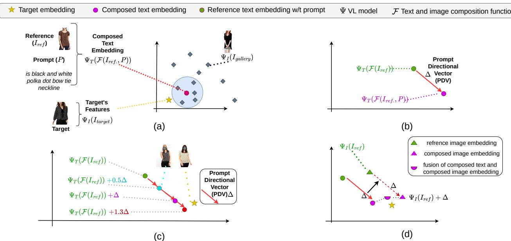
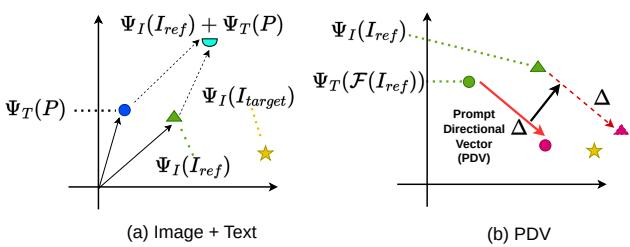
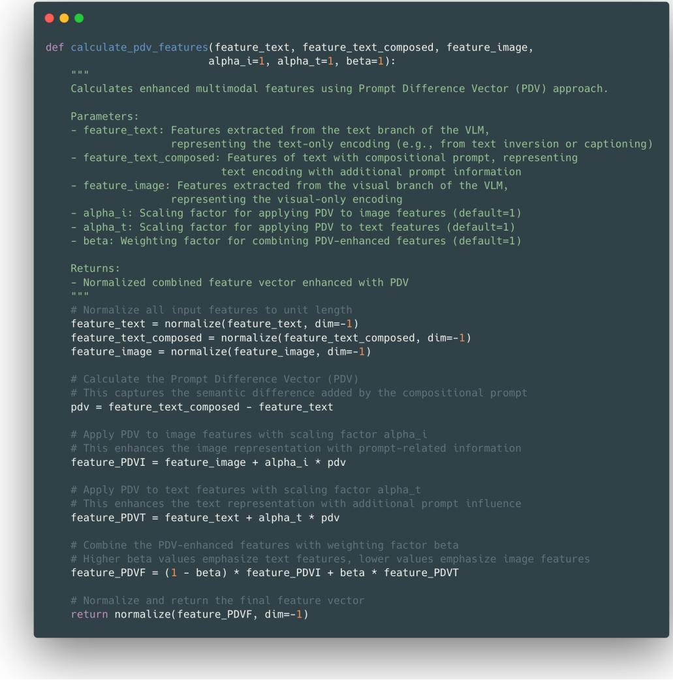
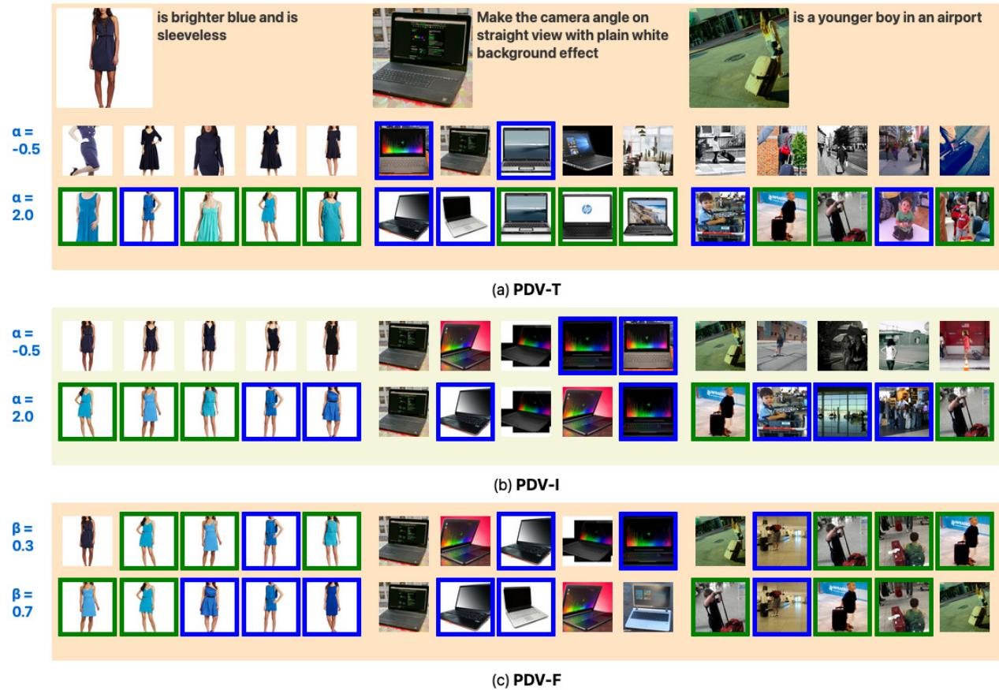
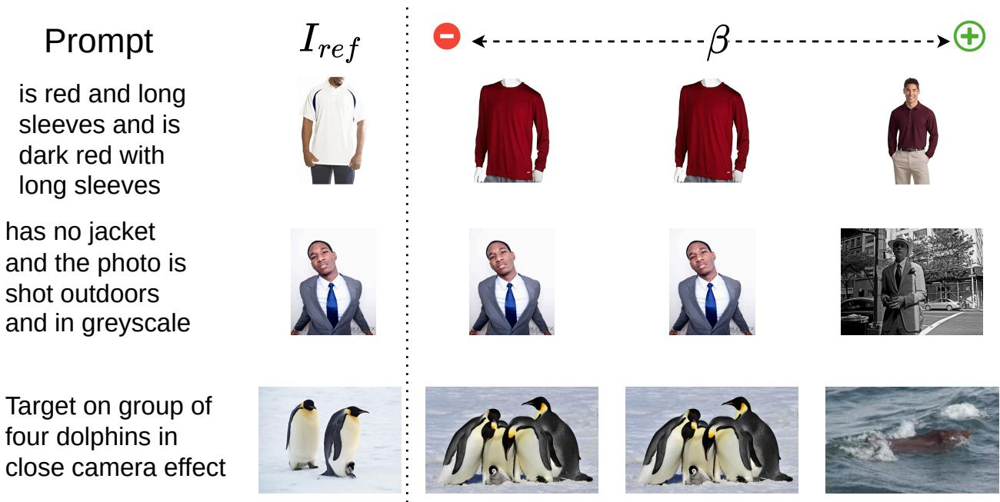
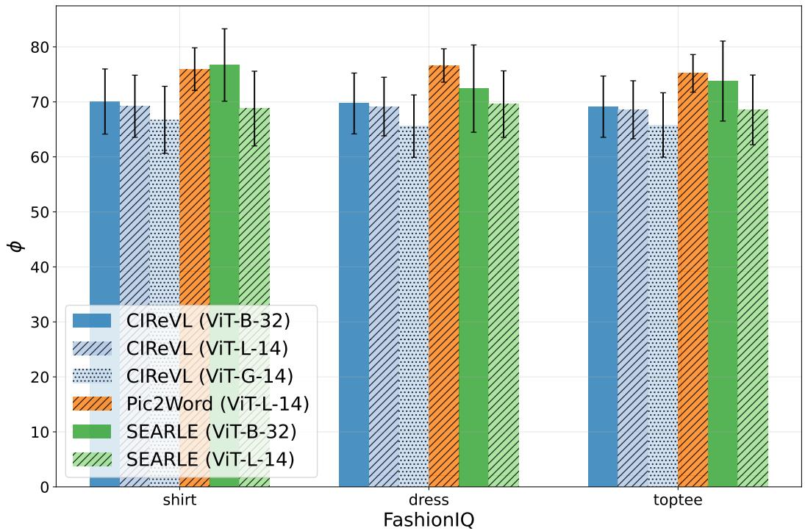

# 1. Bibliographic Information

## 1.1. Title
The central topic of the paper is **PDV: Prompt Directional Vectors for Zero-shot Composed Image Retrieval**. This title indicates that the research focuses on a novel method named "Prompt Directional Vectors" (PDV) designed to enhance the task of Zero-shot Composed Image Retrieval (ZS-CIR). ZS-CIR involves retrieving images based on a combination of a reference image and a text modification prompt without the need for task-specific training data.

## 1.2. Authors
The authors of the paper are **Osman Tursun**, **Sinan Kalkan**, **Simon Denman**, and **Clinton Fookes**.
*   **Osman Tursun**, **Simon Denman**, and **Clinton Fookes** are affiliated with the **Queensland University of Technology (QUT)**.
*   **Sinan Kalkan** is affiliated with the **Middle East Technical University (METU)**.
    Given their affiliations and the nature of the paper, their research backgrounds likely lie in computer vision, machine learning, and specifically multi-modal retrieval systems.

## 1.3. Journal/Conference
The paper is currently a **preprint** published on **arXiv** (arXiv ID: 2502.07215v3). arXiv is a reputable open-access repository for scientific preprints in fields such as physics, mathematics, and computer science. While it has not yet appeared in the proceedings of a specific peer-reviewed conference or journal at the time of this snapshot, its publication on arXiv makes it accessible to the academic community for review and feedback.

## 1.4. Publication Year
The paper was published on arXiv on **2025-02-11**.

## 1.5. Abstract
The paper addresses the limitations of current **Zero-shot Composed Image Retrieval (ZS-CIR)** methods. ZS-CIR enables searching for images using a reference image and a text prompt without requiring specialized networks trained on large-scale paired data. The authors identify three critical gaps in existing approaches: (1) static query embeddings that hinder iterative refinement, (2) insufficient utilization of image embeddings, and (3) suboptimal fusion of text and image embeddings. To solve these, the authors introduce the **Prompt Directional Vector (PDV)**, a simple, training-free enhancement that captures the semantic modifications induced by user prompts. PDV enables dynamic composed text embeddings (controllable via a scaling factor), composed image embeddings (transferring prompt semantics to image features), and a weighted fusion of these embeddings. Extensive experiments demonstrate that PDV consistently improves retrieval performance when integrated with state-of-the-art ZS-CIR methods.

## 1.6. Original Source Link
*   **Official Source:** https://arxiv.org/abs/2502.07215
*   **PDF Link:** https://arxiv.org/pdf/2502.07215v3
*   **Publication Status:** Preprint (arXiv).

# 2. Executive Summary

## 2.1. Background & Motivation
**Core Problem:**
The paper tackles the problem of **Composed Image Retrieval (CIR)**, specifically in a **zero-shot** setting (ZS-CIR). In CIR, a user provides a reference image (e.g., a photo of a red shirt) and a text prompt describing a desired modification (e.g., "make it blue"). The system must retrieve a target image from a database that matches the reference image but incorporates the changes specified in the prompt.

**Importance & Challenges:**
Traditional CIR methods rely on supervised learning, requiring expensive labeled datasets of triplets (reference image, prompt, target image). ZS-CIR aims to solve this by leveraging pre-trained Vision-Language Models (VLMs) like CLIP, eliminating the need for task-specific training. However, current ZS-CIR approaches face three major limitations:
1.  **Static Embeddings:** The query representation is fixed. If the initial retrieval is unsatisfactory, users must manually refine the text prompt and re-extract features, which is computationally expensive and inefficient.
2.  **Underutilization of Image Embeddings:** Existing methods often convert the reference image into text (via captioning or pseudo-tokenization) and ignore the raw visual embedding of the reference image during retrieval, as it performs poorly on its own.
3.  **Suboptimal Fusion:** Simply fusing raw image and text embeddings often yields inferior results compared to using only the composed text embedding.

**Innovative Idea:**
The paper proposes the **Prompt Directional Vector (PDV)**. The core insight is to treat the prompt's effect not as a static point but as a vector (a direction and magnitude) in the embedding space. This vector represents the semantic shift induced by the prompt. By isolating this vector, the authors can manipulate it—scaling it to control the intensity of the modification or adding it to image embeddings to transfer semantics—thereby creating more effective and controllable query representations without any training.

## 2.2. Main Contributions / Findings
**Primary Contributions:**
1.  **Introduction of PDV:** A novel, training-free method to calculate a residual vector that captures the semantic modification induced by a text prompt relative to a reference image.
2.  **Three Novel Applications of PDV:**
    *   **Dynamic Text Embedding (PDV-T):** Allows users to control the strength of the prompt's effect by scaling the PDV, enabling efficient iterative refinement without re-writing prompts.
    *   **Composed Image Embedding (PDV-I):** Transfers prompt semantics to the visual domain by adding the PDV to the reference image's embedding, making previously underutilized visual features effective for retrieval.
    *   **Effective Fusion (PDV-F):** A weighted fusion strategy that balances the composed text and composed image embeddings to optimize retrieval.
3.  **Plug-and-Play Enhancement:** PDV is designed to be a simple add-on that can be integrated with existing ZS-CIR methods (like CIReVL, Pic2Word) to boost their performance with minimal computational overhead.

**Key Findings:**
*   PDV consistently improves retrieval performance across multiple benchmarks (Fashion-IQ, CIRR, CIRCO) when applied to various baseline methods.
*   The method is particularly effective when the baseline method already generates reasonably accurate compositional embeddings, as PDV relies on the quality of the initial directional vector.
*   The introduced hyperparameters ($\alpha$ for scaling, $\beta$ for fusion) provide intuitive control over the retrieval process, allowing users to trade off between visual fidelity and semantic alignment.

# 3. Prerequisite Knowledge & Related Work

## 3.1. Foundational Concepts
To fully understand this paper, one must be familiar with the following foundational concepts:

*   **Vision-Language Models (VLMs):** These are deep learning models designed to process and understand both visual and textual data simultaneously. A prominent example is **CLIP** (Contrastive Language-Image Pre-training). CLIP is trained on massive datasets of image-text pairs to learn a shared embedding space where semantically similar images and text are mapped close to each other. It typically consists of an image encoder (e.g., a Vision Transformer) and a text encoder (e.g., a Transformer).
*   **Embedding Space:** In machine learning, an embedding is a numerical vector representation of data (like an image or a sentence). A "shared embedding space" means that images and text are mapped into the same high-dimensional vector space. This allows for direct comparison and similarity calculation (e.g., using cosine) between an image and a text description.
*   **Zero-Shot Learning:** This refers to a model's ability to perform a task for classes or conditions it has not explicitly seen during training. In this context, ZS-CIR means the model can retrieve images based on novel combinations of reference images and text prompts without having been trained on those specific combinations.
*   **Composed Image Retrieval (CIR):** A specific retrieval task where the query is composed of two distinct modalities: an image and a text modifier. The goal is to find images in a database that are visually similar to the reference image but incorporate the semantic changes described in the text prompt.
*   **Text Inversion:** A technique often used in personalized image generation (e.g., DreamBooth) and adapted for CIR. It involves finding a specific text token (or a vector representing a token) that, when processed by a text encoder, produces an embedding that is close to the embedding of a specific image. This effectively allows an image to be "named" or described by a pseudo-word in the model's vocabulary.

## 3.2. Previous Works
The paper categorizes and discusses several key areas of prior research:

*   **Supervised CIR:** Early approaches to CIR, such as **TIRG** (Text-Image Residual Gating) and **ARTEMIS**, required training on labeled datasets (e.g., FashionIQ). These methods typically learned to combine image and text features using neural networks like LSTMs or MLPs. While effective, they are limited by the high cost and scarcity of labeled triplet data.
*   **Zero-Shot CIR with Text Inversion:** To overcome data limitations, researchers proposed zero-shot methods.
    *   **Pic2Word:** Introduced a self-supervised text inversion network to map images to pseudo-tokens, allowing them to be composed with text prompts in the text encoder's space.
    *   **SEARLE:** An improvement over Pic2Word that reduced the training cost and improved efficiency.
    *   **CIReVL:** A more direct approach that uses an image captioning model to generate a natural language description of the reference image, which is then merged with the user's prompt using a Large Language Model (LLM) to form a single text query.
    *   **LDRE & SEIZE:** Recent methods that leverage multiple captions to increase diversity and account for semantic increments during composition.
*   **Composition with a Residual:** Some supervised methods, like those by Vo et al., learned a "residual" vector representing the change induced by the prompt. The paper notes that while PDV shares this conceptual similarity, it achieves it without supervised training by directly leveraging pre-trained VLMs.

## 3.3. Technological Evolution
The field has evolved from **supervised methods** that require expensive, labeled triplet data to **zero-shot methods** that leverage the general knowledge of large pre-trained VLMs. Initially, zero-shot methods focused on "text inversion" to fit images into the text modality. More recently, "caption-based" methods (like CIReVL) have emerged, which describe images in natural language. The current paper fits into this timeline by proposing a post-processing enhancement (PDV) that can be applied to *any* of these existing zero-shot methods. It addresses the next logical challenge: how to make these composed queries dynamic, controllable, and more fusion-friendly without retraining the underlying models.

## 3.4. Differentiation Analysis
The core differentiation of PDV lies in its **training-free, plug-and-play architecture** and its focus on **vector-based manipulation**.
*   **Vs. Supervised Methods:** Unlike TIRG or ARTEMIS, PDV requires no training data, fine-tuning, or task-specific neural networks. It operates purely on the embeddings produced by pre-trained models.
*   **Vs. Other Zero-Shot Methods:** Unlike Pic2Word or CIReVL, which define *how* to create a composed query from scratch, PDV takes an existing composed query (from any method) and improves it. It introduces the concept of a "directional vector" which allows for *scaling* (controlling intensity) and *transfer* (applying text semantics to image features). This addresses the specific limitations of static embeddings and poor fusion that prior works did not solve.

# 4. Methodology

## 4.1. Principles
The core principle of the **Prompt Directional Vector (PDV)** is to model the semantic modification induced by a text prompt as a vector in the shared embedding space of a Vision-Language Model (VLM). Intuitively, if a user provides a reference image $I_{ref}$ and a prompt $P$, the "target" concept is a shift away from the reference image towards the description of the modification. The authors hypothesize that this shift can be isolated as a vector, $\Delta_{PDV}$, which is the difference between the embedding of the reference image *with* the prompt and the embedding of the reference image *without* the prompt. Once isolated, this vector can be manipulated (scaled) and added to other embeddings to create more effective and controllable query representations.

## 4.2. Core Methodology In-depth (Layer by Layer)

The methodology is built upon a standard ZS-CIR framework and then enhanced with PDV through a series of defined steps.

### Step 1: Baseline ZS-CIR Framework
First, the authors establish the standard retrieval process used by existing methods. We have a Vision-Language Model $\Psi$, which consists of a vision branch $\Psi_I$ and a text branch $\Psi_T$.
*   **Target Images:** Images in the database (gallery) are encoded using the vision branch to get their embeddings: $\Psi_I(I)$.
*   **Query Composition:** A baseline ZS-CIR method (e.g., CIReVL, Pic2Word) takes a reference image $I_{ref}$ and a prompt $P$ to create a composed text representation $\mathcal{F}(I_{ref}, P)$. This is then encoded by the text branch to get the query embedding: $\Psi_T(\mathcal{F}(I_{ref}, P))$.
*   **Retrieval:** The system retrieves images by finding the highest cosine similarity between the query embedding and the gallery image embeddings.

    The paper formalizes the retrieval of top-k images $\mathbb{I}_{top-k}$ from the database $\mathcal{D}$ as:
$$
\mathbb{I}_{top-k} = \underset{I \in \mathcal{D}}{\arg\operatorname*{max}}_k \frac{\Psi_T(\mathcal{F}(I_{ref}, P))^T \cdot \Psi_I(I)}{\|\Psi_T(\mathcal{F}(I_{ref}, P))\| \cdot \|\Psi_I(I)\|}
$$
Where:
*   $\mathbb{I}_{top-k}$ is the set of top-k retrieved images.
*   $\mathcal{D}$ is the database of gallery images.
*   $\Psi_T(\mathcal{F}(I_{ref}, P))$ is the composed query embedding.
*   $\Psi_I(I)$ is the embedding of a gallery image $I$.
*   The fraction calculates the cosine similarity between the query and gallery image embeddings.

### Step 2: Calculating the Prompt Directional Vector ($\Delta_{PDV}$)
The authors define the Prompt Directional Vector, denoted as $\Delta_{PDV}$, as the residual vector representing the change caused by the prompt. It is calculated as the difference between the embedding of the reference image *with* the prompt and the embedding of the reference image *without* the prompt (or with an empty prompt).

The formula for $\Delta_{PDV}$ is:
$$
\Delta_{PDV} = \Psi_T(\mathcal{F}(I_{ref}, P)) - \Psi_T(\mathcal{F}(I_{ref}))
$$
Where:
*   $\Psi_T(\mathcal{F}(I_{ref}, P))$ is the text embedding of the composed query (reference image + prompt).
*   $\Psi_T(\mathcal{F}(I_{ref}))$ is the text embedding of the reference image alone (equivalent to $\Psi_T(\mathcal{F}(I_{ref}, P_{Empty}))$ where $P_{Empty}$ is an empty string).
*   $\Delta_{PDV}$ is the resulting vector that captures the semantic shift.

    
    *该图像是示意图，展示了提出的“Prompt Directional Vector (PDV)”方法在零-shot复合图像检索中的应用。图中标识了参考图像嵌入、复合文本嵌入及目标特征之间的关系，并说明了通过PDV在视觉空间中进行动态调节的重要性。图(a)至(d)展示了文本提示对图像嵌入的影响及其在检索过程中的权重融合，强调了PDV在提升检索性能方面的作用。*

### Step 3: Strategy 1 - PDV for Text (PDV-T)
The first strategy uses the PDV to create a **dynamic composed text embedding**. Instead of using the static composed embedding directly, the authors propose a generalized formulation where the embedding is the sum of the reference image's text embedding and a scaled version of the PDV.

The formula for the PDV-T embedding is:
$$
\Psi_T(\mathcal{F}(I_{ref}, P))_{PDV-T} = \Psi_T(\mathcal{F}(I_{ref})) + \alpha_T \Delta_{PDV}
$$
Where:
*   $\Psi_T(\mathcal{F}(I_{ref}, P))_{PDV-T}$ is the new, dynamic query embedding.
*   $\Psi_T(\mathcal{F}(I_{ref}))$ is the baseline embedding of the reference image.
*   $\alpha_T$ is a scaling factor (hyperparameter).
*   $\Delta_{PDV}$ is the prompt directional vector calculated in Step 2.

    **Intuition:** By varying $\alpha_T$, the user can control the strength of the modification. If $\alpha_T = 1$, it's the standard baseline. If $\alpha_T > 1$, it amplifies the prompt's effect (e.g., "make it *very* blue"). If $\alpha_T < 1$, it reduces the effect. This allows for iterative refinement without re-running expensive feature extraction.

### Step 4: Strategy 2 - PDV for Image (PDV-I)
The second strategy addresses the limitation that raw image embeddings $\Psi_I(I_{ref})$ are often ignored because they lack prompt-specific information. PDV-I proposes transferring the semantic information from the prompt vector $\Delta_{PDV}$ into the visual embedding space by adding it to the reference image's visual embedding.

The formula for the PDV-I embedding is:
$$
\Phi_{PDV-I} = \Psi_I(I_{ref}) + \alpha_I \Delta_{PDV}
$$
Where:
*   $\Phi_{PDV-I}$ is the composed *image* embedding.
*   $\Psi_I(I_{ref})$ is the raw visual embedding of the reference image from the VLM's vision branch.
*   $\alpha_I$ is a scaling factor for the image modality.
*   $\Delta_{PDV}$ is the same prompt vector calculated in Step 2.

    **Intuition:** This creates a "composed image embedding" that visually resembles the reference image but is shifted in the embedding space towards the target concept. This is useful for maintaining visual fidelity (e.g., keeping the style or cut of a shirt) while applying the change.

    
    *该图像是示意图，比较了图(a)中的“Image + Text”与图(b)中的“PDV”。图(a)展示了图像和文本的组合表示，其中包含了参考图像 $I_{ref}$、目标图像 $I_{target}$ 和文本提示 $P$ 的向量表示。图(b)则展示了Prompt Directional Vector (PDV)的应用，通过引入PDV，文本和图像的组合表示得以优化。绿色和粉色的点分别表示不同的语义修改，展示了如何通过PDV增强检索能力。*

### Step 5: Strategy 3 - PDV Fusion (PDV-F)
The third and final strategy is a weighted fusion of the two composed embeddings created in the previous steps (PDV-T and PDV-I). This allows the system to balance semantic alignment (from PDV-T) and visual similarity (from PDV-I).

The formula for the PDV-F embedding is:
$$
\Phi_{PDV-F} = (1 - \beta) \Phi_{PDV-I} + \beta \Phi_{PDV-T}
$$
Where:
*   $\Phi_{PDV-F}$ is the final fused query embedding used for retrieval.
*   $\Phi_{PDV-I}$ is the composed image embedding from Step 4.
*   $\Phi_{PDV-T}$ is the composed text embedding from Step 3.
*   $\beta$ is a fusion weight parameter ranging from 0 to 1.

    **Intuition:** The parameter $\beta$ acts as a slider.
*   If $\beta$ is close to 1, the query relies more on the composed text embedding (PDV-T), prioritizing the semantic description in the prompt.
*   If $\beta$ is close to 0, the query relies more on the composed image embedding (PDV-I), prioritizing visual similarity to the reference image.

    
    *该图像是图表，展示了不同方法在相对召回率@5上的表现随参数 `ext{Alpha}` 的变化。左侧图表显示了五种方法的曲线，包括 Cirr、Circo、FashionIQ/TopTee、FashionIQ/Shirt 和 FashionIQ/Dress，右侧为它们在不同 ViT 模型下的相对表现。*

    
    *该图像是包含两组曲线的图表，展示了不同模型在相对召回率@5与 `ext{Alpha}` 参数之间的关系。左图和右图分别显示了FashionIQ系列与Cirr、Circo模型的比较。*

    
    *该图像是图表，展示了不同模型在各种 `eta` 值下的相对Recall@5表现。以蓝色、红色和绿色分别表示模型Cirr、Circo和FashionIQ系列，示例数据展示了它们在不同超参数设置下的性能变化。这表明参数调整对检索效果的影响。*

### Step 6: Algorithm Implementation
The authors provide a clear algorithm (Algorithm 1 in the paper) to summarize the entire process. It takes the text embedding of the reference image ($f_{text}$), the composed text embedding ($f_{text\_composed}$), and the image embedding ($f_{image}$) as input, along with the hyperparameters $\alpha_I, \alpha_T, \beta$. It normalizes the inputs, calculates the PDV, computes the PDV-I and PDV-T embeddings, fuses them, and returns the normalized final feature.

*该图像是示意图，展示了计算 PDV 特征的 Python 函数。该函数通过参数调整，实现文本特征和图像特征的融合，以及语义差异的捕捉。具体计算中，`pdv = feature ext{_text ext{_composed}} - feature ext{_text}`，最后返回经过 PDV 增强的规范化特征向量。*

# 5. Experimental Setup

## 5.1. Datasets
The authors evaluated their method on three standard benchmarks for Composed Image Retrieval:
1.  **Fashion-IQ:** A dataset focused on fashion items. It consists of triplets: a reference image of a clothing item, a text description of a relative change (e.g., "in a different color, with a floral pattern"), and a target image matching the description. It has three categories: Shirt, Dress, and Top& Tee.
2.  **CIRR:** Composed Image Retrieval on Real-life images. This dataset contains images of everyday objects and scenes with more complex and diverse relative captions compared to Fashion-IQ.
3.  **CIRCO:** Composed Image Retrieval on Common Objects in Context. This dataset is based on COCO objects and focuses on composing images with text prompts to retrieve modified versions of the objects.

    These datasets were chosen because they are the standard benchmarks for evaluating CIR methods, covering both specific domains (fashion) and general real-world scenarios. They effectively validate the method's ability to handle different types of visual and semantic modifications.

## 5.2. Evaluation Metrics
The paper uses standard retrieval metrics to evaluate performance:
1.  **Recall@K (R@K):**
    *   **Conceptual Definition:** Recall@K measures the ability of the system to find the correct target image within the top K retrieved results. For example, Recall@10 checks if the ground truth image is among the top 10 images returned by the retrieval system. A higher Recall@K indicates better performance.
    *   **Mathematical Formula:**
        $$ \text{Recall@K} = \frac{1}{|\mathcal{Q}|} \sum_{q \in \mathcal{Q}} \mathbb{I}(\text{rank}(q, \text{target}) \leq K) $$
    *   **Symbol Explanation:**
        *   $|\mathcal{Q}|$ is the total number of queries in the test set.
        *   $q$ is a specific query.
        *   $\text{rank}(q, \text{target})$ is the rank position of the ground truth target image for query $q$.
        *   $\mathbb{I}(\cdot)$ is the indicator function, which is 1 if the condition is true and 0 otherwise.
        *   $K$ is the cutoff threshold (e.g., 1, 5, 10, 50).

2.  **Mean Average Precision (mAP@K):**
    *   **Conceptual Definition:** Mean Average Precision considers not just whether the correct item is in the top K, but also its rank position. It averages the precision scores at each relevant item's rank. A higher mAP indicates that the correct items are ranked higher (closer to the top of the list).
    *   **Mathematical Formula:**
        $$ \text{mAP@K} = \frac{1}{|\mathcal{Q}|} \sum_{q \in \mathcal{Q}} \frac{1}{\min(m, K)} \sum_{k=1}^{K} \text{Precision@k}(q) \times \mathbb{I}(\text{item}_k \text{ is relevant}) $$
    *   **Symbol Explanation:**
        *   $|\mathcal{Q}|$ is the total number of queries.
        *   $q$ is a specific query.
        *   $m$ is the total number of relevant items for the query (usually 1 in CIR).
        *   $K$ is the cutoff threshold.
        *   $\text{Precision@k}(q)$ is the precision of the top-k results for query $q$.
        *   $\mathbb{I}(\cdot)$ is the indicator function.

## 5.3. Baselines
The paper compares PDV against several state-of-the-art Zero-Shot CIR methods:
*   **CIReVL:** A caption-based method that uses image captioning and LLMs to compose the query.
*   **Pic2Word:** A pseudo-tokenization method that maps images to text tokens.
*   **SEARLE:** An improved version of Pic2Word.
*   **LDRE:** A method using LLM-based divergent reasoning and ensemble of captions.
*   **LinCIR:** A language-only training method.
*   **SEIZE:** A method leveraging multiple captions and semantic increment.

    These baselines are representative of the two main paradigms in ZS-CIR: caption-based (CIReVL, LDRE) and pseudo-tokenization-based (Pic2Word, SEARLE). Comparing against them demonstrates PDV's versatility as a plug-and-play enhancer for different approaches.

# 6. Results & Analysis

## 6.1. Core Results Analysis
The main results show that integrating PDV (specifically the PDV-F fusion strategy) consistently improves the performance of all baseline methods across all datasets.

*   **Fashion-IQ:** On the Fashion-IQ dataset, PDV-F provided substantial gains. For instance, with the CIReVL baseline using a ViT-B/32 backbone, PDV-F improved the average Recall@10 from 28.29% to 34.82%. The improvements were even more significant with larger backbones (ViT-L/14 and ViT-G/14), demonstrating that PDV complements powerful visual encoders well.
*   **CIRCO and CIRR:** Similar trends were observed on CIRCO and CIRR. For example, on CIRCO with CIReVL (ViT-B/32), mAP@10 improved from 15.42% to 20.61%. On CIRR, Recall@10 improved from 52.51% to 64.15%.

    The results strongly validate the effectiveness of PDV. The key finding is that PDV is not just a marginal improvement; it provides significant boosts (often >5-10% absolute improvement in Recall) by enabling better fusion and dynamic adjustment of the query embeddings. The authors also note that PDV is particularly effective when the baseline method is already strong (like CIReVL), as this ensures the calculated $\Delta_{PDV}$ is an accurate representation of the semantic shift.

The following are the results from Table 1 of the original paper:

<table>
<thead>
<tr>
<th colspan="5">Fashion-IQ</th>
<th colspan="2">Shirt</th>
<th colspan="2">Dress</th>
<th colspan="2">Toptee</th>
<th colspan="2">Average</th>
</tr>
<tr>
<th>Backbone</th>
<th>Method</th>
<th>&beta;</th>
<th>&alpha;I</th>
<th>&alpha;T</th>
<th>R@10</th>
<th>R@50</th>
<th>R @ 10</th>
<th>R@50</th>
<th>R @ 10</th>
<th>R@50</th>
<th>R@ 10</th>
<th>R@50</th>
</tr>
</thead>
<tbody>
<tr>
<td rowspan="6">ViT-B/32</td>
<td>SEARLE</td>
<td>-</td>
<td>-</td>
<td>-</td>
<td>24.14</td>
<td>41.81</td>
<td>18.39</td>
<td>38.08</td>
<td>25.91</td>
<td>47.02</td>
<td>22.81</td>
<td>42.30</td>
</tr>
<tr>
<td>SEARLE + PDV-F</td>
<td>0.9</td>
<td>1.1</td>
<td>0.9</td>
<td>24.83</td>
<td>41.71</td>
<td>20.13</td>
<td>41.40</td>
<td>25.96</td>
<td>47.17</td>
<td>23.64</td>
<td>43.43</td>
</tr>
<tr>
<td>CIReVL</td>
<td>-</td>
<td>-</td>
<td>-</td>
<td>28.36</td>
<td>47.84</td>
<td>25.29</td>
<td>46.36</td>
<td>31.21</td>
<td>53.85</td>
<td>28.29</td>
<td>49.35</td>
</tr>
<tr>
<td>CIReVL + PDV-F</td>
<td>0.75</td>
<td>1.4</td>
<td>1.4</td>
<td>32.88</td>
<td>52.80</td>
<td>32.67</td>
<td>54.49</td>
<td>38.91</td>
<td>61.81</td>
<td>34.82</td>
<td>56.37</td>
</tr>
<tr>
<td>LDRE</td>
<td>-</td>
<td>-</td>
<td>-</td>
<td>27.38</td>
<td>46.27</td>
<td>19.97</td>
<td>41.84</td>
<td>27.07</td>
<td>48.78</td>
<td>24.81</td>
<td>45.63</td>
</tr>
<tr>
<td>SEIZE</td>
<td>-</td>
<td>-</td>
<td>-</td>
<td>29.38</td>
<td>47.97</td>
<td>25.37</td>
<td>46.84</td>
<td>32.07</td>
<td>54.78</td>
<td>28.94</td>
<td>49.86</td>
</tr>
<tr>
<td rowspan="8">ViT-L/14</td>
<td>Pic2Word</td>
<td></td>
<td></td>
<td></td>
<td>25.96</td>
<td>43.52</td>
<td>19.63</td>
<td>40.90</td>
<td>27.28</td>
<td>47.83</td>
<td>24.29</td>
<td>44.08</td>
</tr>
<tr>
<td>Pic2Word + PV-F</td>
<td>0.8</td>
<td>1.0</td>
<td>1.0</td>
<td>28.21</td>
<td>44.55</td>
<td>20.92</td>
<td>42.24</td>
<td>29.02</td>
<td>48.90</td>
<td>26.05</td>
<td>45.23</td>
</tr>
<tr>
<td>SEARLE</td>
<td>-</td>
<td>-</td>
<td>-</td>
<td>26.84</td>
<td>45.19</td>
<td>20.08</td>
<td>42.19</td>
<td>28.40</td>
<td>49.62</td>
<td>25.11</td>
<td>45.67</td>
</tr>
<tr>
<td>SEARLE +PDV-F</td>
<td>0.8</td>
<td>1.2</td>
<td>1.0</td>
<td>28.66</td>
<td>46.76</td>
<td>23.60</td>
<td>46.41</td>
<td>31.00</td>
<td>52.32</td>
<td>27.75</td>
<td>48.50</td>
</tr>
<tr>
<td>CIReVL</td>
<td></td>
<td></td>
<td></td>
<td>29.49</td>
<td>47.40</td>
<td>24.79</td>
<td>44.76</td>
<td>31.36</td>
<td>53.65</td>
<td>28.55</td>
<td>48.57</td>
</tr>
<tr>
<td>CIReVL + PDV-F</td>
<td>0.55</td>
<td>1</td>
<td>1.3</td>
<td>37.78</td>
<td>54.22</td>
<td>33.61</td>
<td>56.07</td>
<td>41.61</td>
<td>62.16</td>
<td>37.67</td>
<td>57.48</td>
</tr>
<tr>
<td>LinCIR</td>
<td>-</td>
<td>-</td>
<td>-</td>
<td>29.10</td>
<td>46.81</td>
<td>20.92</td>
<td>42.44</td>
<td>28.81</td>
<td>50.18</td>
<td>26.82</td>
<td>46.49</td>
</tr>
<tr>
<td>SEIZE</td>
<td>-</td>
<td>-</td>
<td>-</td>
<td>33.04</td>
<td>53.22</td>
<td>30.93</td>
<td>50.76</td>
<td>35.57</td>
<td>58.64</td>
<td>33.18</td>
<td>54.21</td>
</tr>
<tr>
<td rowspan="6">ViT-G/14</td>
<td>Pic2Word</td>
<td>-</td>
<td>-</td>
<td>-</td>
<td>33.17</td>
<td>50.39</td>
<td>25.43</td>
<td>47.65</td>
<td>35.24</td>
<td>57.62</td>
<td>31.28</td>
<td>51.89</td>
</tr>
<tr>
<td>SEARLE</td>
<td>-</td>
<td>-</td>
<td>-</td>
<td>36.46</td>
<td>55.55</td>
<td>28.16</td>
<td>50.32</td>
<td>39.83</td>
<td>61.45</td>
<td>34.81</td>
<td>55.71</td>
</tr>
<tr>
<td>CIReVL</td>
<td>-</td>
<td>-</td>
<td>-</td>
<td>33.71</td>
<td>51.42</td>
<td>27.07</td>
<td>49.53</td>
<td>35.80</td>
<td>56.14</td>
<td>32.19</td>
<td>52.36</td>
</tr>
<tr>
<td>CIReVL + PV-F</td>
<td>0.6</td>
<td>1.4</td>
<td>1.4</td>
<td>41.90</td>
<td>58.19</td>
<td>40.70</td>
<td>62.82</td>
<td>48.09</td>
<td>67.77</td>
<td>43.56</td>
<td>62.93</td>
</tr>
<tr>
<td>LinCIR</td>
<td>:</td>
<td>-</td>
<td></td>
<td>46.76</td>
<td>65.11</td>
<td>38.08</td>
<td>60.88</td>
<td>50.48</td>
<td>71.09</td>
<td>45.11</td>
<td>65.69</td>
</tr>
<tr>
<td>SEIZE</td>
<td></td>
<td>-</td>
<td>:</td>
<td>43.60</td>
<td>65.42</td>
<td>39.61</td>
<td>61.02</td>
<td>45.94</td>
<td>71.12</td>
<td>43.05</td>
<td>65.5</td>
</tr>
</tbody>
</table>

The following are the results from Table 2 of the original paper:

<table>
<thead>
<tr>
<th colspan="5">Dataset</th>
<th colspan="4">CIRCO</th>
<th colspan="8">CIRR</th>
</tr>
<tr>
<th colspan="5">Metric</th>
<th colspan="4">mAP@k</th>
<th colspan="5">Recall@k</th>
<th colspan="3">Rs@k</th>
</tr>
<tr>
<th>Arch</th>
<th>Method</th>
<th>&beta;</th>
<th>&alpha;I</th>
<th>&alpha;T</th>
<th>k=5</th>
<th>k=10</th>
<th>k=25</th>
<th>k=50</th>
<th>k=1</th>
<th></th>
<th>k=5</th>
<th>k=10</th>
<th>k=50</th>
<th>k=1</th>
<th>k=2</th>
<th>k=3</th>
</tr>
</thead>
<tbody>
<tr>
<td rowspan="8">ViT-B/32</td>
<td>PALAVRA [8] </td>
<td>-</td>
<td>-</td>
<td>-</td>
<td></td>
<td>4.61</td>
<td>5.32</td>
<td>6.33</td>
<td>6.80</td>
<td>16.62</td>
<td>43.49</td>
<td>58.51</td>
<td>83.95</td>
<td>41.61</td>
<td>65.30</td>
<td>80.94</td>
</tr>
<tr>
<td>SEARLE</td>
<td>-</td>
<td>-</td>
<td>-</td>
<td></td>
<td>9.35</td>
<td>9.94</td>
<td>11.13</td>
<td>11.84</td>
<td>24.00</td>
<td>53.42</td>
<td>66.82</td>
<td>89.78</td>
<td>54.89</td>
<td>76.60</td>
<td>88.19</td>
</tr>
<tr>
<td>SEARLE + PDV-F</td>
<td>0.9</td>
<td>1.4</td>
<td>1.2</td>
<td></td>
<td>9.99</td>
<td>10.50</td>
<td>11.70 12.40</td>
<td></td>
<td>24.53</td>
<td>53.71</td>
<td>67.33</td>
<td>89.81</td>
<td>56.94</td>
<td>78.05</td>
<td>88.99</td>
</tr>
<tr>
<td>CIReVL</td>
<td></td>
<td>- -</td>
<td>-</td>
<td></td>
<td>14.94</td>
<td>15.42</td>
<td>17.00</td>
<td>17.82</td>
<td>23.94</td>
<td>52.51</td>
<td>66.00</td>
<td>86.95</td>
<td>60.17</td>
<td>80.05</td>
<td>90.19</td>
</tr>
<tr>
<td>CIReVL + PDV-F</td>
<td></td>
<td>0.75</td>
<td>1.4</td>
<td>1.2</td>
<td>19.90</td>
<td>20.61</td>
<td>22.64</td>
<td>23.52</td>
<td>33.25</td>
<td>64.15</td>
<td>75.23</td>
<td>92.43</td>
<td>65.81</td>
<td>83.76</td>
<td>92.10</td>
</tr>
<tr>
<td>LDRE</td>
<td>-</td>
<td>-</td>
<td>-</td>
<td></td>
<td>17.81</td>
<td>18.04</td>
<td>19.73</td>
<td>20.67</td>
<td>25.69</td>
<td>55.52</td>
<td>68.77</td>
<td>89.86</td>
<td>60.10</td>
<td>80.58</td>
<td>91.04</td>
</tr>
<tr>
<td>LDRE + PDV-F</td>
<td>0.75</td>
<td>1.4</td>
<td>1.4</td>
<td></td>
<td>17.80</td>
<td>18.78</td>
<td>20.61</td>
<td>21.56</td>
<td>29.30</td>
<td>60.39</td>
<td>72.51</td>
<td>91.42</td>
<td>63.06</td>
<td>82.36</td>
<td>91.54</td>
</tr>
<tr>
<td></td>
<td>SEIZE</td>
<td>-</td>
<td>- -</td>
<td>-</td>
<td>19.04</td>
<td>19.64</td>
<td>21.55</td>
<td>22.49</td>
<td>27.47</td>
<td>57.42</td>
<td>70.17</td>
<td></td>
<td>-</td>
<td>65.59</td>
<td>84.48</td>
<td>92.77</td>
</tr>
<tr>
<td></td>
<td>Pic2Word Pic2Word + PDV-F</td>
<td>-</td>
<td></td>
<td>- 1.0</td>
<td></td>
<td>6.81</td>
<td>7.49</td>
<td>8.51</td>
<td>9.07</td>
<td>23.69</td>
<td>51.32</td>
<td>63.66</td>
<td>86.21</td>
<td>53.61</td>
<td>74.34</td>
<td>87.28</td>
</tr>
<tr>
<td></td>
<td>SEARLE</td>
<td></td>
<td>0.85 -</td>
<td>1.2 -</td>
<td></td>
<td>7.74</td>
<td>8.67 12.73</td>
<td>9.77</td>
<td>10.37</td>
<td>23.90</td>
<td>51.95</td>
<td>64.63</td>
<td>87.04</td>
<td>53.16</td>
<td>74.07</td>
<td>87.08</td>
</tr>
<tr>
<td></td>
<td>SEARLE + PDV-F</td>
<td></td>
<td></td>
<td>-</td>
<td></td>
<td>11.68 12.58</td>
<td>13.57</td>
<td>14.33</td>
<td>15.12</td>
<td>24.24</td>
<td>52.48</td>
<td>66.29</td>
<td>88.84</td>
<td>53.76</td>
<td>75.01</td>
<td>88.19</td>
</tr>
<tr>
<td></td>
<td></> <td>0.85</td>
<td>1.4</td>
<td>1.2</td>
<td></td>
<td></td>
<td></td>
<td>15.30</td>
<td>16.07</td>
<td>25.64</td>
<td>53.61</td>
<td>66.58</td>
<td>88.55</td>
<td>55.83</td>
<td>76.48</td>
<td>88.53</td>
</tr>
<tr>
<td></td>
<td>CIReVL</td>
<td>-</td>
<td>-</td>
<td>- 1.2</td>
<td></td>
<td>18.57 25.67</td>
<td>19.01 26.61</td>
<td>20.89 28.81</td>
<td>21.80</td>
<td>24.55</td>
<td>52.31</td>
<td>64.92</td>
<td>86.34</td>
<td>59.54</td>
<td>79.88</td>
<td>89.69</td>
</tr>
<tr>
<td>ViT-L/14 CIReVL + PDV-F LDRE</td>
<td>0.75</td>
<td>1.4 -</td>
<td>-</td>
<td></td>
<td></td>
<td></td>
<td></td>
<td>29.95</td>
<td>36.24</td>
<td>66.17</td>
<td>76.96</td>
<td>92.29</td>
<td>68.07</td>
<td>85.35</td>
<td>93.47</td>
</tr>
<tr>
<td></td>
<td>LDRE + PDV-F</td>
<td></td>
<td>- 0.75</td>
<td></td>
<td>1.4</td>
<td>22.32 25.23</td>
<td>23.75 26.52</td>
<td>25.97 28.94</td>
<td>27.03 29.95</td>
<td>26.68</td>
<td>55.45 59.98</td>
<td>67.49 71.90</td>
<td>88.65</td>
<td>60.39</td>
<td>80.53</td>
<td>90.15</td>
</tr>
<tr>
<td></td>
<td>LinCIR</td>
<td></td>
<td></td>
<td>1.4 -</td>
<td>-</td>
<td>12.59</td>
<td>13.58</td>
<td>15.00</td>
<td>15.85</td>
<td>30.16 25.04</td>
<td>53.25</td>
<td>66.68</td>
<td>90.87</td>
<td>63.66</td>
<td>82.87</td>
<td>91.57</td>
</tr>
<tr>
<td></td>
<td>SEIZE</td>
<td></td>
<td>- -</td>
<td>-</td>
<td>-</td>
<td>24.98</td>
<td>25.82</td>
<td>28.24</td>
<td>29.35</td>
<td>28.65</td>
<td>57.16</td>
<td>69.23</td>
<td>- -</td>
<td>57.11 66.22</td>
<td>77.37 84.05</td>
<td>88.89 92.34</td>
</tr>
<tr>
<td rowspan="7">ViT-G/14</td>
<td>CIReVL</td>
<td>-</td>
<td>-</td>
<td>-</td>
<td></td>
<td>26.77 27.59</td>
<td>29.96</td>
<td>31.03</td>
<td>34.65</td>
<td>64.29</td>
<td>75.06</td>
<td>91.66</td>
<td>67.95</td>
<td>84.87</td>
<td></td>
</tr>
<tr>
<td>CIReVL + PDV-F</td>
<td>0.75</td>
<td>1.4</td>
<td>1.2</td>
<td>30.02</td>
<td>31.46</td>
<td>34.01</td>
<td>35.08</td>
<td>38.15</td>
<td>67.93</td>
<td>77.90</td>
<td>92.77</td>
<td></td>
<td>69.37 85.37</td>
<td>93.21 93.45</td>
</tr>
<tr>
<td>LDRE</td>
<td>-</td>
<td>-</td>
<td>-</td>
<td>33.30</td>
<td>34.32</td>
<td>37.17</td>
<td>38.27</td>
<td>37.40</td>
<td>66.96</td>
<td>78.17</td>
<td>93.66</td>
<td>68.84</td>
<td>85.64</td>
<td>93.90</td>
</tr>
<tr>
<td>LDRE + PDV-F</td>
<td>0.75</td>
<td>1.4</td>
<td>1.4</td>
<td>34.88</td>
<td>36.41</td>
<td>39.12</td>
<td>40.23</td>
<td>42.51</td>
<td>72.22</td>
<td>81.71</td>
<td>94.94</td>
<td>72.39</td>
<td>88.34</td>
<td>94.80</td>
</tr>
<tr>
<td>SEARLE</td>
<td>-</td>
<td></td>
<td>-</td>
<td>13.20</td>
<td>13.85</td>
<td>15.32</td>
<td>16.04</td>
<td>34.80</td>
<td>64.07</td>
<td>75.11</td>
<td>,</td>
<td>68.72</td>
<td>84.70</td>
<td>93.23</td>
</tr>
<tr>
<td>LinCIR</td>
<td>-</td>
<td>-</td>
<td>-</td>
<td>19.71</td>
<td>21.01</td>
<td>23.13</td>
<td>24.18</td>
<td>35.25</td>
<td>64.72</td>
<td>76.05</td>
<td>-</td>
<td>63.35</td>
<td>82.22</td>
<td>91.98</td>
</tr>
<tr>
<td>SEIZE</td>
<td>-</td>
<td>-</td>
<td>-</td>
<td>32.46</td>
<td>33.77</td>
<td>36.46</td>
<td>37.55</td>
<td>38.87</td>
<td>69.42</td>
<td>79.42</td>
<td>-</td>
<td>74.15</td>
<td>89.23</td>
<td>95.71</td>
</tr>
</tbody>
</table>

## 6.2. Ablation Studies / Parameter Analysis
The authors conducted extensive analysis on the three key hyperparameters introduced by PDV: $\alpha_T$ (text scaling), $\alpha_I$ (image scaling), and $\beta$ (fusion weight).

*   **Effect of $\alpha_T$ (PDV-T):** The authors analyzed how scaling the prompt vector affects retrieval. They found that the optimal $\alpha_T$ depends on the baseline method's accuracy. For strong baselines like CIReVL, increasing $\alpha_T$ (often to 1.3 or 1.4) improves performance by amplifying the semantic modification. For weaker baselines, the optimal $\alpha_T$ might be closer to 1 or even lower, indicating that the calculated vector is less precise.
*   **Effect of $\alpha_I$ (PDV-I):** Similar to $\alpha_T$, scaling the image embedding with the PDV improves performance over the raw image embedding. The authors also proposed an automatic tuning method for $\alpha_I$ by minimizing the distance between the composed image embedding and the composed text embedding, which showed consistent improvements.
*   **Effect of $\beta$ (PDV-F):** The fusion parameter $\beta$ balances the text and image modalities. The experiments showed that a pure fusion (typically $\beta$ between 0.4 and 0.8) outperforms using either modality alone. Lower $\beta$ values preserved visual similarity to the reference image, while higher values prioritized the prompt's semantics.

    
    *该图像是一个示意图，展示了在使用不同的 $\alpha$ 和 $\beta$ 值时，对检索结果的影响。图中包含三个部分：PDV-T、PDV-I 和 PDV-F。每个部分中，绿色框表示真实的正例，蓝色框表示接近真实的正例。不同的 $\alpha$ 值（-0.5 和 2.0）及 $\beta$ 值（0.3 和 0.7）影响了图像检索的结果，展示了各自组合的检索效果。*

    ![Figure S6. Qualitative results of PDV-T showing the effect of different $\\alpha _ { T }$ values. For each query, we display the top-1 retrieval result for three different $\\alpha _ { T }$ settings. The middle result uses $\\alpha _ { T } = 1$ (baseline), the left result uses a smaller $\\alpha _ { T }$ value, and the right result uses a larger $\\alpha _ { T }$ value. All $\\alpha _ { T }$ values are within the range $\[ - 0 . 5 , 2 \]$ .](images/8.jpg)
    *该图像是插图，展示了不同 $\alpha_T$ 值对图像检索结果的影响。左侧为查询提示及参考图像 $I_{ref}$，中间展示使用 $\alpha_T = 1$（基线）的检索结果，左边为较小的 $\alpha_T$ 值，右边为较大的 $\alpha_T$ 值。图中分别包含与服装、场景和动物相关的图像，体现了调整 $\alpha_T$ 值对检索结果的动态变化。所有 $\alpha_T$ 值均在范围 $[-0.5, 2]$ 之内。*

    ![Figure S7. Qualitative results of PDV-I showing the effect of different $\\alpha \\boldsymbol { I }$ values. For each query, we display the top-1 retrieval result for three different $\\alpha _ { I }$ settings. The middle result uses $\\alpha _ { I } = 1$ (baseline), the left result uses a smaller $\\alpha _ { I }$ value, and the right result uses a larger $\\alpha _ { I }$ value. All $\\alpha _ { I }$ values are within the range $\[ - 0 . 5 , 2 \]$ .](images/9.jpg)
    *该图像是插图，展示了不同 `oldsymbol{ ext{I}}` 值对图像检索结果的影响。左侧是 `oldsymbol{ ext{I}}` 的较小值，右侧是较大值，中间为基线 $oldsymbol{ ext{I}}=1$。每行显示相同提示下的不同图像检索结果，体现了提示对图像特征的影响。*

    
    *该图像是示意图，展示了不同 `eta` 值对检索结果的影响。左侧显示 $eta = 0$ 的结果，中间为 $eta = 0.5$，右侧为 $eta = 1$。图中展示了多个目标图像及其对应的描述提示，体现了在检索过程中随着 `eta` 值变化的效果。*

    
    *该图像是一个柱状图，展示了在FashionIQ数据集上不同方法和模型的`heta`角度的性能对比。图中包含了多种方法的结果，包括CIReVL（ViT-B-32、ViT-L-14、ViT-G-14）、Pic2Word（ViT-L-14）和SEARLE（ViT-B-32、ViT-L-14），显示了各类服装（衬衫、裙子、T恤）的性能差异。*

    
    *该图像是示意图，展示了不同 `eta` 值下的检索结果影响。第一列为不同条件下（如 $eta = -0.5, 0.0, 0.5, 1.0$）的模型检索结果，包含绿色框表示真阳性，蓝色框表示近似真阳性。图中的模型分别为 PDV-T、PDV-I 和 PDV-F。*

    
    *该图像是图表，展示了不同 `eta` 值对 Recall `@ 10` 和 Recall `@ 50` 的影响。图中包含四种基线方法的比较：Circo、FashionIQ/Dress、FashionIQ/TopTee 和 FashionIQ/Shirt，以及不同显示方式的结果。*

    
    *该图像是图表，展示了不同 `eta` 值对相对召回率 `@10` 和 `@50` 的影响。图中呈现了三种基线方法 CIReVL、Pic2Word 和 SEARLE 的结果。各个方法的表现曲线在 alpha 值变化时有所不同，反映了它们在检索性能上的差异。*

    
    *该图像是图表，展示了不同基线方法在 `eta` 不同值下的 Recall `@ 10` 和 Recall `@ 50` 的相对性能。图中包含CIReVL、Pic2Word和SEARLE三种方法的曲线表现。*

# 7. Conclusion & Reflections

## 7.1. Conclusion Summary
The paper successfully introduces the **Prompt Directional Vector (PDV)**, a simple yet powerful, training-free enhancement for Zero-shot Composed Image Retrieval. By modeling the prompt's effect as a directional vector in the embedding space, PDV addresses three key limitations of existing methods: static embeddings, underutilized image features, and poor fusion. The authors demonstrate three effective applications of PDV—dynamic text embedding, composed image embedding, and weighted fusion—all of which consistently improve retrieval performance across multiple benchmarks when integrated with state-of-the-art baselines.

## 7.2. Limitations & Future Work
The authors acknowledge that PDV's effectiveness is correlated with the underlying baseline method's ability to generate accurate compositional embeddings. If the baseline is weak, the calculated PDV may not point in the correct semantic direction, limiting the gains from scaling or fusion. Future research directions include developing more robust compositional embedding techniques to provide better inputs for PDV and exploring adaptive scaling strategies that can automatically determine the optimal $\alpha$ and $\beta$ values. The authors also suggest applying PDV to multi-prompt composed image retrieval (dialogue-based search) and other multi-modal tasks.

## 7.3. Personal Insights & Critique
The paper presents a compelling and elegant solution to a practical problem in multi-modal retrieval. The idea of treating the prompt modification as a vector is intuitive and mathematically sound, drawing parallels to residual learning in supervised settings but achieving it in a zero-shot manner.

**Strengths:**
*   **Simplicity & Plug-and-Play Nature:** The method is incredibly simple to implement (as shown by the provided Python code) and requires no training, making it highly accessible and easy to integrate into existing systems.
*   **Controllability:** The ability to scale the prompt effect ($\alpha$) and balance modalities ($\beta$) provides users with fine-grained control over the retrieval process, which is a valuable feature for interactive applications.
*   **Performance Gains:** The consistent and significant improvements across diverse datasets and baselines strongly validate the approach.

**Potential Issues & Improvements:**
*   **Dependency on Baseline Quality:** As noted by the authors, PDV is not a silver bullet for poor baselines. It acts as a force multiplier for good methods. This suggests that future work should focus on pairing PDV with increasingly robust zero-shot composition methods.
*   **Hyperparameter Sensitivity:** While the authors provide guidelines, the optimal hyperparameters ($\alpha, \beta$) can vary depending on the dataset and baseline. An automatic tuning mechanism (like the one proposed for $\alpha_I$) could be extended to all parameters to make the system more user-friendly.
*   **Generalization:** The paper focuses on image retrieval. It would be interesting to see if the concept of a "directional vector" could be applied to other generative tasks, such as text-to-image editing, where controlling the strength of a modification is also crucial.

    Overall, the paper makes a solid contribution by offering a practical, effective tool that bridges the gap between static zero-shot retrieval and the need for dynamic, user-controllable search systems.