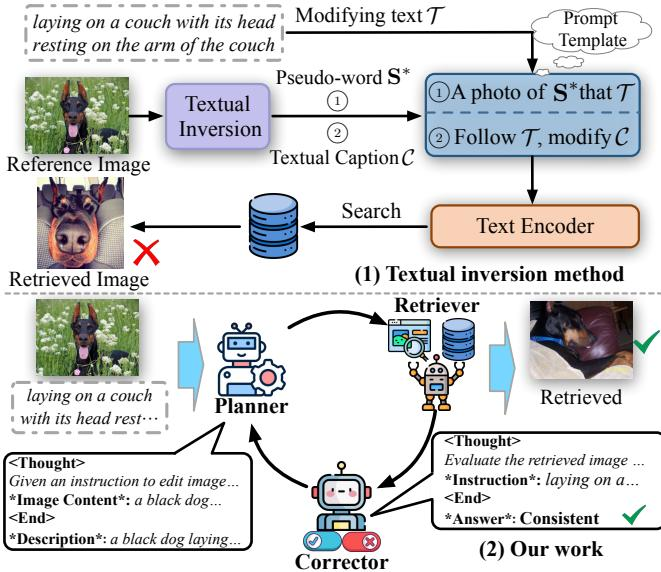
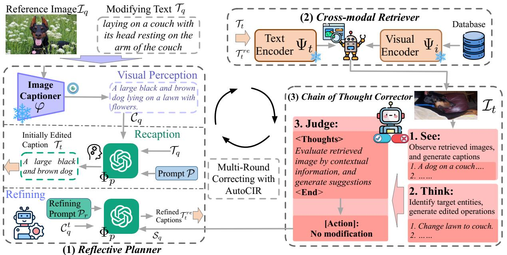
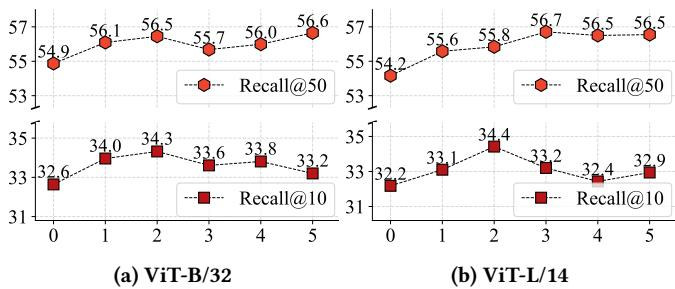
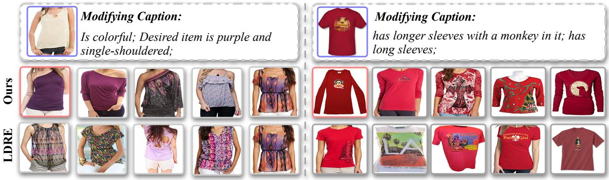
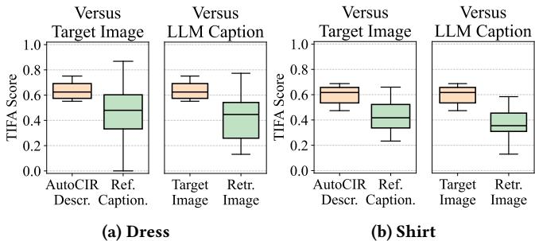
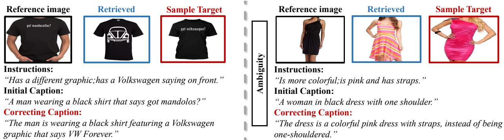
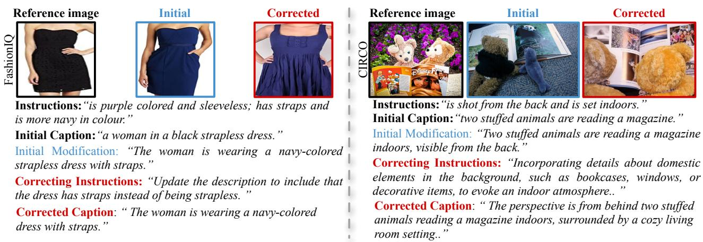

# 生成性思维与纠正性行动：通过自动多智能体协作实现用户友好的复合图像检索

张涛 程 zhangtao.cheng@outlook.com 中国电子科技大学 四川省 成都 于浩 马 简 浪 yhma0819@std.uestc.edu.cn jian_lang@std.uestc.edu.cn 中国电子科技大学 四川省 成都 昆鹏 张 kpzhang@umd.edu 美国马里兰大学 大学公园, 马里兰州 美国 婷 钟 zhongting@uestc.edu.cn 中国电子科技大学 四川省 成都 永 王 wangyong@ipplus360.com 艾文科技 河南省 郑州 香港科技大学 清水湾, 香港 范 坐\* fan.zhou@uestc.edu.cn 中国电子科技大学 四川省 成都 四川省智能数字媒体技术重点实验室 四川省 成都

# 摘要

零-shot 组合图像检索（ZS-CIR）是一项具有挑战性的任务，旨在检索与由参考图像和描述组合而成的查询相似的图像，而无需依赖于三元组数据集的训练。现有的方法通常依赖于预定义的固定检索过程，通过手工设计的模板将图像与修改后的文本结合，这存在两个主要问题：非自适应的检索查询和不友好的用户检索过程。为了解决这些局限性，我们提出了一种新颖的框架——自动多智能体协作零-shot 组合图像检索（AutoCIR）。AutoCIR 由三个无训练的智能体组成：规划者、检索器和校正器，它们共同协作，迭代识别和修正不匹配。规划者通过为组合查询生成定制的目标标题来指导检索器，并基于反馈进一步精炼该标题以解决任何语义差异。校正器配备了链式思维推理机制，对检索结果进行深入评估，并生成适当的自我修正行动。在三个基准上的大量实验表明，AutoCIR 在 ZS-CIR 的表现上始终优于以前的竞争方法。

# CCS 概念

• 信息系统 检索任务与目标；$\bullet$ 社交与职业主题 用户特征。

# 关键词

组合图像检索，零样本学习，智能体混合，思维链。

# ACM参考格式：

Zhangtao Cheng, Yuhao Ma, Jian Lang, Kunpeng Zhang, Ting Zhong, Yong Wang, 和 Fan Zhou. 2025. 生成性思维与纠正行动：通过自动多智能体协作实现用户友好的合成图像检索. 发表在第31届ACM SIGKDD知识发现与数据挖掘会议论文集V.2（KDD '25），2025年8月37日，加拿大安大略省多伦多. ACM, 纽约, NY, 美国, 11页. https://doi.org/10.1145/3711896.3736982

# 1 引言

复合图像检索（CIR）是一项复杂的视觉-语言任务，旨在根据由参考图像和修改文本组成的复合查询来检索目标图像。其目标是识别与参考图像在视觉上相似但包含指定修改的图像[22, 33, 41, 42]。之前的监督学习方法[4, 13, 32]依赖于精心策划的三元组（参考图像、修改文本、目标图像）作为训练数据来构建专业的CIR模型。然而，生成这样的带注释的三元组既费力又耗资源。为了解决这个挑战，最近的研究[3, 39]引入了零-shot CIR（ZS-CIR），使CIR模型能够在没有带注释的三元组的情况下实现泛化，同时保持检索准确性。为了实现ZS-CIR，研究人员[3, 12, 39]通常利用大规模预训练的视觉-语言模型（VLMs）（例如，CLIP [38]）设计各种文本反转方法。这些方法学习一个映射网络，将参考图像投影为伪文本词元。随后，文本修饰器使用手工设计的模板，将这些词元与修改标题结合，生成用于通过VLM检索的目标标题。最近的进展通过手动设计的提示将图像标题与修改文本重新组合，整合了大型语言模型（LLMs），实现了更动态的文本反转[24]。

  

Figure 1: Previous textual inversion method vs. our work.

如图1（a）所示，现有方法通常使用预训练的字幕生成模型为参考图像生成字幕。然后，基于大语言模型（LLM）的文本修改器重新组合图像字幕，并使用手工编写的提示修改文本，以促进内容检索（CIR）。然而，它们依赖于预定义的固定检索过程，将参考图像投影为语言形式，通过手工模板进行重新组合，然后进行一次性检索。尽管前景可期，但它们面临两个主要限制：（1）非自适应检索查询。固定的检索策略无法适应涉及多个对象或复杂修改（如对象移除或属性调整）的复杂、动态场景[24]。这种刚性限制了模型理解和验证用户意图的能力。（2）不友好的用户检索过程。对固定模板的依赖往往迫使用户，特别是新手，参与耗时的试错循环来编辑描述和生成新字幕，导致繁琐的检索体验[36]。

借鉴人类解决问题的行为[23, 37]，个体为特定任务创建初始计划，并根据任务当前状态不断调整，我们提出了AutoCIR，即零-shot组合图像检索的自动多智能体协作框架。AutoCIR执行自我检查，以确保意图修改与检索图像之间的一致性。如图1(b)所示，AutoCIR由三个基于LLM的智能体组成，每个智能体具有专门的角色：规划者、检索器和校正者。规划者制定战略计划（即目标图像标题），指导检索并通过识别检索图像与意图修改之间的语义差异来完善计划。检索器通过在VLM嵌入空间中将规划者的目标与相关图像对齐，执行零-shot文本到图像的检索。最后，校正者利用思维链（COT）推理，通过三个阶段对检索图像进行深入评估：观察、思考和判断。这些阶段涉及解析基本编辑操作，检测查询与检索结果之间的潜在不匹配，并建议适当的自我校正调整。为了评估AutoCIR的有效性，我们在三个数据集上进行了实验：CIRCO [3]、CIRR [32]和FashionIQ [43]。这些数据集评估AutoCIR的组合能力，展示其在不同任务中的泛化能力。结果表明，AutoCIR在所有以往的CIR方法中表现优异，尤其是在FashionIQ领域，其在Recall $@ 10$ 上平均达到$7.26\%$的显著提高。总之，我们工作的关键贡献如下：我们引入了AutoCIR，这一新颖的闭环框架，能够迭代识别并修正CIR中的不匹配。AutoCIR开创了自动多智能体协作，以改善检索过程的可组合性，确保准确的检索而无需额外的训练数据。• 我们提出了三个即插即用的智能体——规划者、检索器和校正者，使得基于参考图像和修改文本可以以与模型无关的方式准确检索组合图像。AutoCIR用户友好，能够无缝集成到各种LLM架构和检索主干中。• 我们在真实世界的数据集上进行了广泛实验，以证明AutoCIR的有效性。AutoCIR推动了最先进的ZS-CIR，提供了更适应性和用户中心化的检索过程。重现结果的代码和数据集可在 https://github.com/coloreyes/AutoCIR 获取。

# 2 相关工作

我们从两个角度回顾相关研究：组合图像检索和用于组合图像检索的视觉-语言模型。

# 2.1 组合图像检索

组合图像检索（CIR）[17, 26, 41]的任务专注于检索与给定参考图像和修改描述最匹配的目标图像，近年来在研究界引起了广泛关注。传统方法[17, 41]通常采用监督策略，在大量人类标注的三元组上训练专门的模型，这些三元组包括参考图像、目标图像及其差异的文本描述。然而，这些传统的CIR方法严重依赖高质量的标注数据，而生产这些数据既劳动密集又昂贵。

为了解决这一局限性，零-shot CIR（ZS-CIR）方法主要在不需要人工标注三元组的情况下运作。相反，ZS-CIR 方法利用嘈杂的图像-文本对学习一个映射函数，将图像转换为词语。这些生成的词元随后与修改文本结合，通过视觉-语言模型（VLMs）进行检索。最近，随着大语言模型（LLMs）的出现，CIReVL 将 LLM 引入 ZS-CIR，设计了一种简单的无训练方法。该方法涉及使用预训练的 VLM 对参考图像进行标注，然后利用基于 LLM 的文本修改器，根据修改文本调整标注以进行检索。然而，这些方法通常依赖于静态提示策略，将文本-图像查询组合以构建所需的目标标注。这种方法在涉及多个物体和复杂变更的场景中表现较差，导致繁琐的试错过程，削弱用户体验。为解决这一挑战，我们探索基于自动多智能体协作的检索方法，结合自检机制以确保预期修改与检索图像之间的对齐，从而提升检索性能。

# 2.2 视觉-语言模型在CIR中的应用

视觉-语言模型（VLMs）如 CLIP、BLIP 和 ALIGN、CoCa 在大规模图像-文本数据集上进行预训练，使得它们能够将图像和文本映射到一个共享的嵌入空间。大多数 VLMs 在下游任务中表现出显著的零-shot 性能，包括零-shot 分类、视觉问答（VQA）、语义分割、推荐系统和社交网络分析。

对于零样本图像检索（ZS-CIR），许多方法利用大型预训练的视觉语言模型（VLM），如 CLIP [38]，作为图像检索的主干，旨在将图像和文本投影到统一的嵌入空间。具体来说，PALAVRA [12] 使用 CLIP 设计映射网络，通过自监督学习将图像嵌入投影到文本嵌入空间，以检索个性化概念。Pic2word [39] 设计了一个映射网络，将图像特征转换为伪词元，然后与修改后的文本特征融合，以利用 CLIP 进行检索。SEARLE [3] 利用大型语言模型（LLMs）通过参考图像的标题提取视觉差异，以提高检索的有效性。虽然这些模型通过专用模块 [13] 或微调 [15] 直接采用 VLM 进行 ZS-CIR，但通常受到静态提示策略的限制，这可能会对用户体验产生负面影响。我们的研究探讨了一种替代方法：将独立的 VLM 与 LLM 结合，以在不需要额外训练的情况下有效执行 ZS-CIR。

# 3 方法论

在本节中，我们详细介绍了我们提出的AutoCIR。AutoCIR的整体框架如图2所示。我们首先在3.1节中介绍相关概念的概述。接下来，我们详细阐述AutoCIR的三个核心组件：反思规划器（3.2节）、跨模态检索器（3.3节）以及思维链校正器（3.4节）。

# 3.1 初步研究

设 $\{ \mathcal { T } _ { q } , \mathcal { T } _ { q } \}$ 表示一个复合查询，其中 $\mathcal { T } _ { q }$ 代表参考图像，$\mathcal { T } _ { q }$ 是相关的修饰文本。复合图像检索（CIR）的目标是从一个大型图像库 $\mathcal { D }$ 中检索目标图像 $\mathcal { T } _ { t } \in \mathcal { D }$，该图像需要结合 $\mathcal { T } _ { q }$ 中指定的修改，同时在其他视觉特征上大体上保留与参考图像 $\mathcal { T } _ { q }$ 的相似性。在零样本设定中，主流的零样本复合图像检索（ZS-CIR）方法主要设计一个定制的映射模块 $\phi$ : $\mathcal { T } _ { q } \to \mathcal { Z } _ { q }$，将图像 $\mathcal { T } _ { q }$ 投影为伪文本词元 $\mathcal { Z } _ { q }$。

实际上，$\phi$ 是在特定图像编码器 $\Psi _ { i }$ 中对中间图像表示进行训练的，属于视觉语言模型（VLMs）。然后，应用精心设计的提示（例如：“$\{ \mathcal { Z } _ { q } \}$ 的照片，$\{ \mathcal { T } _ { q } \} ^ { * }）”到反向嵌入 $\scriptstyle { \mathcal { Z } } _ { q }$ 和修饰文本 $\mathcal { T } _ { q }$，生成目标标题 $\mathcal { T } _ { t }$。该标题 $\mathcal { T } _ { t }$ 随后用于通过基于 VLM 的检索器进行目标图像检索，该检索器使用文本编码器 $\Psi _ { t }$ 编码标题 $\mathcal { T } _ { t }$，使用图像编码器 $\Psi _ { i }$ 编码候选图像 $\tau \in \mathcal { D }$。匹配分数 $s$ 通过余弦相似度计算：$S = \cos \_ \sin ( \Psi _ { i } ( \mathcal { I } ) , \Psi _ { t } ( \mathcal { T } _ { t } ) )$。

# 3.2 反思规划者

AutoCIR 的反思规划器旨在规划目标图像说明 $\mathcal { T } _ { t }$，以确保所组成的查询（图像和文本）与检索结果之间的可靠对齐。这个规划器具备推理和自我反思的能力，首先通过对组成的图像和文本进行推理生成初始说明。然后，它通过评估和反思检索图像与预期修改之间的任何差异来细化该说明。阶段 1：视觉感知。受到现有零样本图像caption检索（ZS-CIR）方法的启发，我们采用了一种语言-视觉策略，将视觉信号转化为语言形式，从而在不需要复杂模型训练（如文本反转方法）情况下，提供对参考图像 $\scriptstyle { \mathcal { T } } _ { q }$ 的初步理解。具体而言，我们使用一个预训练的图像说明模型 $\varphi$（例如 BLIP）来生成参考图像的语言描述 $\begin{array} { r } { \bar { I } _ { q } \colon C _ { q } = \varphi ( \bar { I } _ { q } ) } \end{array}$。该描述 $C _ { q }$ 位于自然语言文本领域，使其对人类推理更具可及性。这种方法为用户提供了更清晰的检索过程洞察，并允许潜在的干预。

阶段 2：重新标题。使用预定义模板以特定和固定的方式重新组合文本（例如，“$C _ { q }$ 的照片 $\mathcal { T } _ { q } ^ { \mathfrak { s } }$ 限制了检索的灵活性，使其对复杂场景的适应性减弱。当组合查询涉及多个对象或复杂修改时，例如对象移除，这种僵化通常会导致检索不准确，并对用户体验产生负面影响。理想情况下，一个智能规划智能体应有效解释用户的修改意图，并相应调整参考图像标题 $C _ { q }$。为此，我们引入了一种具有高级推理能力的大语言模型（LLM），并设计了一种基于LLM的修饰器 $\Phi _ { p }$，以生成连贯、统一的目标标题。具体而言，我们开发了一个简单的提示模板 $\mathcal { P }$，灵感来自于 [24]，用于结合密集标题 $C _ { q }$ 和修改文本 $\mathcal { T } _ { q }$ 生成初始图像标题：$\dot { C _ { q } ^ { t } } = \Phi _ { p } ( \mathcal { P } \circ C _ { q } \circ \mathcal { T } _ { q } )$。这些标题 $C _ { q } ^ { t }$ 然后输入到基于LLM的修饰器中，以确保任务的性质和输入细节得到清晰表示，使模型能够准确解释条件并生成编辑后的标题 $\mathcal { T } _ { t }$。值得注意的是，这种提示构建是一次性设置，仅需最少的标注工作，并且我们发现其在多样化任务中表现良好。

阶段三：优化。在实际操作中，组合检索通常涉及多个对象和细微修改的复杂场景，由多样化、用户特定的意图驱动。由于组合查询中可用信息有限，规划者可能在单次检索尝试中最初生成的目标字幕 $\mathcal { T } _ { t }$ 与目标图像 $\mathcal { T } _ { t }$ 在语义上不一致。为了解决这一不一致，智能规划者需要评估反馈结果与预期修改之间的差距，从而增强规划并减少语义偏差。具体而言，我们通过向修饰符 $\Phi _ { P }$ 查询一个连接了优化提示 $\mathcal { P } _ { r }$、初始字幕 $C _ { q } ^ { t }$（以“初始字幕：”作为前缀）和从校正器获得的编辑建议 $s _ { q }$（详见第 3.4 节，以“编辑建议：”作为前缀）的串联，来优化初始字幕 $C _ { q } ^ { t }$。这个过程可以表示为：$C _ { q } ^ { r e } = \Phi _ { p } ( \mathcal { P } _ { r } \circ C _ { q } ^ { t } \circ S _ { q } )$，其中 $C _ { q } ^ { r e }$ 表示优化后的字幕。这些字幕 $\bar { C } _ { q } ^ { r e }$ 然后输入同样的基于大语言模型的修饰符，以生成编辑后的字幕 $\mathcal { T } _ { t } ^ { r e }$。优化阶段在没有进一步反馈可用或达到最大迭代次数 $N$ 时终止。

  
ox reninnucdepvaatieriveae atpriati .

# 3.3 跨模态检索器

为了实现零样本图像检索（ZS-CIR），我们利用视觉语言模型（VLMs）的先进能力（例如，CLIP）作为检索智能体，以促进零样本的文本到图像检索。视觉语言模型是在大规模的图像-文本对上进行预训练的，将文本和视觉特征对齐到一个共享的嵌入空间中，这显示出了显著的零样本检索能力。给定经过精炼的标题 $\mathcal { T } _ { t } ^ { r e }$（或初始标题 $\mathcal { T } _ { t }$），AutoCIR 采用视觉语言模型中的图像编码器 $\Psi _ { i } ( \cdot )$ 对来自图像数据库 $\mathcal { D }$ 的图像 $I \in \mathcal { D }$ 进行编码，并使用文本编码器 $\Psi _ { t }$ 对 $\mathcal { T } _ { t } ^ { r e }$ 进行建模。因此，目标图像 $\mathcal { T } _ { t }$ 的检索过程如下：

$$
\mathcal { T } _ { t } = \underset { I \in \mathcal { D } } { \operatorname { a r g m a x } } \frac { \Psi _ { i } ( I ) ^ { \top } \Psi _ { t } \left( \mathcal { T } _ { t } ^ { r e } \right) } { \Vert \Psi _ { i } ( I ) \Vert \cdot \left. \Psi _ { t } \left( \mathcal { T } _ { t } ^ { r e } \right) \right. } .
$$

最终检索到的目标图像 $I _ { t }$ 是与目标图像描述 $\mathcal { T } _ { t } ^ { r e }$ 最相似的图像。

# 3.4 思维链修正器

为了进一步优化用于有效检索的标题 $\mathcal{T}_{t}$，我们设计了一个自我纠正的智能体，该智能体利用链式思维（COT）机制深入分析检索到的图像并进行后续纠正。这个基于大型语言模型（LLM）的修正器评估检索到的图像、解析用户的修改，并通过逐步过程提供纠正建议。修正器包括三个阶段：查看、思考和判断。阶段 1：查看。为了获取检索到的前 $N = \{ { \cal T } _{t}^{1}, \cdots , { \cal T } _{t}^{n} \}$ 图像的内容，我们利用标题生成模型 $\varphi$ 提取关键物体特征并为每张图像 $\boldsymbol{ \mathcal{I} }_{t}^{i}$ 生成自然语言标题 $C_{t}^{i}$。这些视觉概念随后在判断阶段被选中并进一步分析，以评估它们是否与用户的意图修改一致。阶段 2：思考。在这一阶段，修正器主要识别参考图像中需要修改的目标实体，并通过推理文本和图像的组合查询生成详细的编辑操作（即添加、删除或属性修改）。首先，我们将参考图像的标题 $C_{q}$ 和编辑文本 $\mathcal{T}_{t}^{re}$ 输入到修正器中，以提取与修改文本 $\mathcal{T}_{q}$ 语义相关的关键实体。接着，选择的实体与用户的修改文本结合，生成细致的编辑操作 $\varepsilon_{q}$，为这些实体的特征变化提供更具信息量和详细描述。阶段 3：判断。在判断阶段，我们将检索到的图像 $N$ 的描述与编辑操作 $\varepsilon_{q}$ 整合到一个提示模板中。这促使 LLM 验证检索到的图像是否符合编辑操作中规定的要求。如果检索到的图像不符合这些标准，我们将生成新的描述 $\scriptstyle { S_{q} }$ 来优化目标标题 $C_{q}^{t}$，否则，我们终止自我纠正过程，并将检索到的图像 $N$ 作为目标用户的最终输出。该自我纠正机制旨在收集包含足够信息的理由，以进一步优化检索过程，从而提升用户体验。

# 4 实验

在本节中，我们进行了广泛的实验，以验证 AutoCIR 的有效性，具体研究问题如下：RQ1：AutoCIR 的性能与基线方法在组合图像检索中的表现如何比较？•RQ2：我们 AutoCIR 的不同组件如何对整体性能产生贡献？•RQ3：AutoCIR 的关键超参数变化如何影响模型性能？RQ4：多智能体协作如何增强我们 AutoCIR 在组合图像检索任务中的性能？

# 4.1 实验设置

- 数据集。为了评估，我们在三个零样本分类-图像检索基准上对我们的AutoCIR进行综合实验：CIRCO [3]、CIRR [32] 和 FashionIQ [43]。以下是三个数据集的详细描述：

• CIRCO 是 COCO 图像数据集的扩展，包含每个查询多个真实标注数据。具体来说，CIRCO 每个查询平均包含 4.53 张真实标注图像。由于 CIRCO 专门设计用于评估 ZS-CIR 方法，因此不包括训练集。相反，它提供了一个验证集（220 个查询）和一个测试集（800 个查询），测试集通过远程评估服务器进行评估。CIRR 收集自更广泛的领域，并包含复杂的描述，由 21,552 张真实生活图像扩展而来，这些图像来源于 NLVR2。具体来说，CIRR 被分为训练集、验证集和测试集，测试集通过远程评估服务器单独评估。FashionIQ 主要包含与时尚相关的图像，分为三类：衬衫、裙子和上衣。具体来说，FashionIQ 由 30,134 个三元组组成，这些三元组来源于 77,684 张与时尚相关的图像，按 6:2:2 划分为训练、验证和评估集。FashionIQ 针对现实的在线购物场景，例如聊天窗口。因此，FashionIQ 中的描述是通过基于视觉的聊天界面收集的，从而产生更真实的用户文本查询。 - 指标。遵循以前的工作，我们使用 Recall@k (R@k) 作为 CIRR 和 FashionIQ 数据集的评估指标。对于 CIRCO，其中每个查询与多个目标图像相关联，我们使用平均精准率 $( \mathrm { m A P @ k } )$ 作为更细粒度的指标来评估检索结果的排序质量。 - 基线。为了评估 AutoCIR 在 ZS-CIR 中的有效性，我们将 AutoCIR 与 11 个竞争基线进行比较，包括仅图像、仅文本、图像 $+ ^ { ' }$ 文本、Pic2word、Slerp、Lin-CIR、PALAVRA、SEARLE、SEARLE-OTI、CIReVL 和 LDRE。所有基线的详细描述总结如下： •仅图像将参考图像直接输入 CLIP 图像编码器，然后计算相似性进行检索。 •仅文本主要关注 CLIP 文本编码器提取的修改文本特征，这些特征被用作检索特征以计算相似性。 图像 $^ { + }$ 文本通过对其进行平均，以组合视觉和文本特征，供后续检索过程使用。 Pic2word 采用依赖于训练的策略，利用经过对比损失优化的预训练文本反转网络构建伪词元，随后与修改文本结合进行检索。

Slerp采用球面线性插值直接整合视觉和文本表示，通过识别二者的中间嵌入进行后续检索。LinCIR设计了一种仅基于语言的训练策略，将文本特征投影到词元嵌入空间，并通过替换原文本的关键词词元构建新文本。PALAVRA是一种基于文本反演的二阶段训练依赖方法，涉及预训练的映射函数，随后优化伪词元。 SEARLE采用一种训练依赖机制，通过基于优化的文本反演策略生成未标记图像的伪词元，然后将其提炼到文本反演网络中。SEARLE-OTI是SEARLE的一个变体，去除了提炼网络。CIReVL提出了一种无训练方法，利用预训练的生成视觉语言模型为参考图像生成标题，然后请求大型语言模型根据文本目标的修改重新组合标题，以便进行后续检索。 LDRE设计了一种无训练、大型语言模型驱动的发散推理与集成策略，以捕捉组合结果的多种可能语义，应用于零样本关键字检索。

其中，图像仅、文本仅以及图像 $+$ 文本是直接应用于单一模态的简单技术；Pic2word、Slerp、LinCIR、PALAVRA、SEARLE 和 SEARLE-OTI 是基于文本反演策略的训练依赖方法；CIReVL 和 LDRE 是基于大语言模型的无训练方法，利用大语言模型根据文本目标修改重新组合从参考图像生成的标题。- 实现细节。我们使用预训练的 BLIP-2 [27] 与语言模型 OPT-6.7b 作为我们的标题生成模型。对于检索器，我们采用来自 OpenCLIP [20] 的 ViT-B/32（ViT-B）和 ViT-L/14（ViT-L）CLIP 模型。默认情况下，我们使用 GPT-4o-Mini [5] 作为我们的大语言模型（LLM），并考虑额外的消融实验，包括 Qwen-Turbo [2]、GPT-3.5-Turbo [5] 和 GPT-4 [1]。每个模型的特征空间维度如下：B/32 为 512，L/14 为 768。我们提出的模型 AutoCIR 在 Pytorch [35] 中实现，并在两块 NVIDIA RTX4090 GPU 上运行。

# 4.2 主要结果 (RQ1)

表1和表2展示了我们的AutoCIR与其他零样本图像检索（ZS-CIR）方法在CIRCO、CIRR和FashionIQ评估协议上的比较评估。结果表明，在所有指标上，AutoCIR始终优于以往的竞争性ZS-CIR模型，而无需任何特定问题的训练。这些结果证明了我们自动化多智能体协作设计的有效性，该设计对检索结果进行自我反思，并迭代优化目标图像的标题，以提升用户体验。此外，我们观察到基于大型语言模型（LLM）的ZS-CIR方法（CIReVL、LDRE和AutoCIR）的检索性能明显优于伪词方法，如PALAVRA、Pic2Word、SEARLE和Slerp。这表明，使用LLM从组合查询中推理目标语义与CLIP的文本编码更为高效，而不是采用伪词策略。我们还提供了三个基准的完整评估结果，结果分别以粗体和下划线标识。-'表示原论文中未报告的结果。

<table><tr><td rowspan="2">Backbone</td><td rowspan="2">Model</td><td rowspan="2">Training- free (?)</td><td colspan="4">CIRCO</td><td colspan="6">CIRR</td></tr><tr><td colspan="4">mAP@k</td><td colspan="3">Recall@k</td><td colspan="3">R@</td></tr><tr><td></td><td></td><td> = 5</td><td>k = 10</td><td>k = 25</td><td>k = 50</td><td> = 1</td><td>= 5 22.99</td><td>k = 10</td><td>k = 50 59.23</td><td>= 1 21.04</td><td> = 2</td><td>k= 3</td></tr><tr><td rowspan="10">ViT-B/32</td><td>Image-only</td><td>20</td><td>1.34</td><td>1.60</td><td>2.12</td><td>2.41 3.18</td><td>6.89 21.81</td><td></td><td>33.68</td><td></td><td>41.04</td><td>60.31</td></tr><tr><td>Text-only</td><td></td><td>2.56</td><td>2.67</td><td>2.98</td><td></td><td>45.22</td><td>57.42</td><td>81.01</td><td>62.24</td><td>81.13</td><td>90.70</td></tr><tr><td>Image+Text</td><td></td><td>2.65</td><td>3.25</td><td>4.14</td><td>4.54</td><td>11.71</td><td>35.06 48.94</td><td>77.49</td><td>32.77</td><td>56.89</td><td>74.96</td></tr><tr><td>PALAVRA</td><td></td><td>4.61</td><td>5.32</td><td>6.33</td><td>6.80</td><td>16.62 43.49</td><td>58.51</td><td>83.95</td><td>41.61</td><td>65.30</td><td>80.94</td></tr><tr><td>SEARLE</td><td></td><td>9.35</td><td>9.94</td><td>11.13</td><td>11.84</td><td>24.00 53.42</td><td>66.82</td><td>89.78</td><td>54.89</td><td>76.60</td><td>88.19</td></tr><tr><td>SEARLE-OTI</td><td></td><td>7.14</td><td>7.83</td><td>8.99</td><td>9.60</td><td>24.27 53.25</td><td>66.10</td><td>88.84</td><td>54.10</td><td>75.81</td><td>87.33</td></tr><tr><td>Slerp</td><td></td><td>9.34</td><td>10.26</td><td>11.65</td><td>12.33</td><td>28.19 55.88</td><td>68.77</td><td>88.51</td><td>61.13</td><td>80.63</td><td>90.68</td></tr><tr><td>CIReVL</td><td></td><td>14.94</td><td>15.42</td><td>17.00</td><td>17.82</td><td>23.94</td><td>52.51 66.00</td><td>86.95</td><td>60.17</td><td>80.05</td><td>90.19</td></tr><tr><td>LDRE</td><td></td><td>17.96</td><td>18.32</td><td>20.21</td><td>21.11</td><td>25.69 55.13</td><td>69.04</td><td>89.90</td><td>60.53</td><td>80.65</td><td>90.70</td></tr><tr><td>AutoCIR</td><td>1</td><td>18.82</td><td>19.41</td><td>21.38</td><td>22.32</td><td>30.53</td><td>59.42</td><td>72.19 91.47</td><td>65.11</td><td>84.02</td><td>92.70</td></tr><tr><td rowspan="8">ViT-L/14</td><td>Pic2Word</td><td></td><td>8.72</td><td>9.51</td><td>10.64</td><td>11.29 15.12</td><td>23.90</td><td>51.70 65.30</td><td>87.80</td><td>-</td><td>-</td><td>-</td></tr><tr><td>SEARLE</td><td></td><td>11.68</td><td>12.73</td><td>14.33</td><td>24.24</td><td>52.48</td><td>66.29</td><td>88.84</td><td>53.76</td><td>75.01</td><td>88.19</td></tr><tr><td>SEARLE-OTI</td><td></td><td>10.18</td><td>11.03</td><td>12.72</td><td>13.67</td><td>24.87 52.31</td><td>66.29</td><td>88.58</td><td>53.80</td><td>74.31</td><td>86.94</td></tr><tr><td>Slerp</td><td></td><td>18.46</td><td>19.41</td><td>21.43</td><td>22.41</td><td>30.94 59.40</td><td>70.94</td><td>89.18</td><td>64.70</td><td>82.92</td><td>92.31</td></tr><tr><td>LinCIR</td><td></td><td>12.59</td><td>13.58</td><td>15.00</td><td>15.85</td><td>25.04</td><td>53.25 66.68</td><td>-</td><td>57.11</td><td>77.37</td><td>88.89</td></tr><tr><td>CIReVL</td><td></td><td>18.57</td><td>19.01</td><td>20.89</td><td>21.80</td><td>24.55</td><td>52.31</td><td>64.92 86.34</td><td>59.54</td><td>79.88</td><td>89.69</td></tr><tr><td>LDRE</td><td></td><td>23.35</td><td>24.03</td><td>26.44</td><td>27.50</td><td>26.53</td><td>55.57</td><td>67.54 88.50</td><td>60.43</td><td>80.31</td><td>89.90</td></tr><tr><td>AutoCIR</td><td>xxxxx&gt;&gt;&gt;</td><td>24.05</td><td>25.14</td><td>27.35</td><td>28.36</td><td>31.81</td><td>61.95</td><td>73.86 92.07</td><td>67.21</td><td>84.89</td><td>93.13</td></tr></table>

Table 2: Comparison Results on the FashionIQ validation set. The best and second-best scores are highlighted in bold and underlined, respectively.   

<table><tr><td rowspan=1 colspan=2>Dataset</td><td rowspan=1 colspan=2>Shirt</td><td rowspan=1 colspan=1>Dress</td><td rowspan=1 colspan=1>Toptee</td><td rowspan=1 colspan=1>Average</td></tr><tr><td rowspan=1 colspan=2>Metric</td><td rowspan=1 colspan=2>|R@10 R@50 |</td><td rowspan=1 colspan=1>|R@10 R@50 |</td><td rowspan=1 colspan=1>|R@10 R@50 |</td><td rowspan=1 colspan=1>|R@10 R@50</td></tr><tr><td rowspan=10 colspan=1>ViT-B</td><td rowspan=9 colspan=1>Image-onlyText-onlyImage+TextPALAVRASEARLESEARLE-OTISlerpCIReVLLDRE</td><td rowspan=1 colspan=2>6.9214.23</td><td rowspan=1 colspan=1>4.4612.19</td><td rowspan=1 colspan=1>6.3213.77</td><td rowspan=2 colspan=1>5.9013.3718.7036.84</td></tr><tr><td rowspan=1 colspan=2>19.8734.99</td><td rowspan=1 colspan=1>15.4235.05</td><td rowspan=1 colspan=1>20.8140.49</td></tr><tr><td rowspan=1 colspan=2>13.4426.25</td><td rowspan=1 colspan=1>13.8330.88</td><td rowspan=1 colspan=1>17.0831.67</td><td rowspan=5 colspan=1>14.7829.6019.7637.2522.8942.5322.4442.3422.9643.96</td></tr><tr><td rowspan=1 colspan=2>21.4937.05</td><td rowspan=1 colspan=1>05</td><td rowspan=1 colspan=1>17.2535.94</td><td rowspan=1 colspan=1>20.5538.76</td></tr><tr><td rowspan=2 colspan=2>24.4441.6125.3741.32</td><td rowspan=1 colspan=1>18.5439.51</td><td rowspan=1 colspan=1>25.7046.46</td></tr><tr><td rowspan=2 colspan=1>24.1245.7926.5747.78</td></tr><tr><td rowspan=1 colspan=2>23.0641.95</td><td rowspan=1 colspan=1>19.2442.14</td></tr><tr><td rowspan=1 colspan=2>28.3647.84</td><td rowspan=1 colspan=1>25.2946.36</td><td rowspan=1 colspan=1>31.2153.85</td><td rowspan=1 colspan=1>28.2949.35</td></tr><tr><td rowspan=1 colspan=2>27.3846.27</td><td rowspan=1 colspan=1>19.9741.84</td><td rowspan=1 colspan=1>27.0748.78</td><td rowspan=1 colspan=1>24.8145.63</td></tr><tr><td rowspan=1 colspan=1>AutoCIR</td><td rowspan=1 colspan=2>32.43 51.67</td><td rowspan=1 colspan=1>26.5246.36</td><td rowspan=1 colspan=1>33.96 56.09</td><td rowspan=1 colspan=1>|30.97 51.37</td></tr><tr><td rowspan=8 colspan=1>ViT-L</td><td rowspan=6 colspan=1>Pic2WordSEARLESEARLE-OTISlerpLinCIRCIReVL</td><td rowspan=1 colspan=2>26.2043.60</td><td rowspan=1 colspan=1>20.0040.20</td><td rowspan=1 colspan=1>27.9047.40</td><td rowspan=2 colspan=1>24.7043.7025.5646.23</td></tr><tr><td rowspan=3 colspan=2>26.8945.5830.3747.4923.3545.12</td><td rowspan=1 colspan=1>58</td><td rowspan=1 colspan=1>20.4843.13</td><td rowspan=1 colspan=1>29.3249.97</td></tr><tr><td rowspan=1 colspan=1>21.5744.47</td><td rowspan=2 colspan=1>30.9051.7631.9751.20</td><td rowspan=2 colspan=1>27.6147.9028.3247.60</td></tr><tr><td rowspan=1 colspan=1>29.6446.47</td></tr><tr><td rowspan=1 colspan=2>29.1046.81</td><td rowspan=1 colspan=1>20.9242.44</td><td rowspan=1 colspan=1>28.8150.18</td><td rowspan=1 colspan=1>26.2846.49</td></tr><tr><td rowspan=1 colspan=2>29.4947.40</td><td rowspan=1 colspan=1>24.7944.76</td><td rowspan=1 colspan=1>31.3653.65</td><td rowspan=1 colspan=1>28.5548.57</td></tr><tr><td rowspan=1 colspan=1>LDRE</td><td rowspan=1 colspan=2>31.0451.22</td><td rowspan=1 colspan=1>22.9346.76</td><td rowspan=1 colspan=1>31.5753.64</td><td rowspan=1 colspan=1>28.5150.54</td></tr><tr><td rowspan=1 colspan=1>AutoCIR</td><td rowspan=1 colspan=2>34.0053.43</td><td rowspan=1 colspan=1>24.9445.81</td><td rowspan=1 colspan=1>33.1055.58</td><td rowspan=1 colspan=1>30.6851.60</td></tr><tr><td rowspan=1 colspan=1></td><td rowspan=1 colspan=1>Pic2Word</td><td rowspan=1 colspan=2>33.1750.39</td><td rowspan=1 colspan=1>25.4347.65</td><td rowspan=1 colspan=1>35.2457.62</td><td rowspan=1 colspan=1>31.2851.89</td></tr><tr><td rowspan=3 colspan=1>ViT-G</td><td rowspan=2 colspan=1>CIReVLLDRE</td><td rowspan=1 colspan=2>33.7151.42</td><td rowspan=1 colspan=1>27.0749.53</td><td rowspan=1 colspan=1>35.8056.14</td><td rowspan=1 colspan=1>32.1952.36</td></tr><tr><td rowspan=1 colspan=2>35.9458.58</td><td rowspan=1 colspan=1>26.1151.12</td><td rowspan=1 colspan=1>35.4256.67</td><td rowspan=1 colspan=1>32.4955.46</td></tr><tr><td rowspan=1 colspan=1>AutoCIR</td><td rowspan=1 colspan=2>36.36 55.84</td><td rowspan=1 colspan=1>26.1847.69</td><td rowspan=1 colspan=1>37.28 60.38</td><td rowspan=1 colspan=1>33.27 54.63</td></tr></table>

CIRCO。表1展示了CIRCO隐含测试集的结果。CIRCO为存在固有模糊性的任务提供了多个正样本，因为对图像的文本修改没有单一解决方案。值得注意的是，AutoCIR在所有指标和CLIP主干网络上始终优于所有基线方法。在ViT-B/32上，AutoCIR在$\mathrm{mAP}@5$上超过了第二好的方法（LDRE）$6.29\%$，在$\mathbf{mAP@10}$上超过$5.94\%$，为我们在固有模糊场景中通过多智能体协作的自我校正策略的有效性提供了有力证据。CIRR。我们在表1中展示了CIRR隐含测试集的结果。如前所述，该数据集相当嘈杂，目标图像在很大程度上依赖于修改文本，而参考图像通常为目标图像提供有限的线索[3, 39]。我们的模型使用ViT-B/32，在Recall@1和Recall$@5$方面相对提升了$8.30\%$和$6.33\%$。这一性能的关键在于AutoCIR能够通过多智能体协作迭代识别和纠正不匹配，从而生成与目标图像一致的高质量检索指令。此外，在需要从6个精心挑选的样本中检索正确图像的评估中，我们的

Table 3: Ablation study of the core components within AutoCIR on the Toptee category of FashionIQ. '\*' denotes the default model implementation in AutoCIR. '-' denotes no LLM.   

<table><tr><td rowspan=1 colspan=1>Arch</td><td rowspan=1 colspan=1>Captioner</td><td rowspan=1 colspan=1>LLM</td><td rowspan=1 colspan=1>R@10 R@50</td></tr><tr><td rowspan=1 colspan=1>ViT-B/32</td><td rowspan=1 colspan=1>BLIP-2</td><td rowspan=1 colspan=1>*w/o Correctorw/o COT</td><td rowspan=1 colspan=1>33.96  56.0932.14  54.2730.81  52.95</td></tr><tr><td rowspan=1 colspan=1>ViT-B/32</td><td rowspan=1 colspan=1>BLIP-2QwenVLLLAVA-OVCoCa</td><td rowspan=1 colspan=1>GPT-4o-Mini</td><td rowspan=1 colspan=1>33.96  56.0933.71   55.0733.10  55.0736.66  57.83</td></tr><tr><td rowspan=3 colspan=1>ViT-B/32</td><td rowspan=3 colspan=1>BLIP-2</td><td rowspan=3 colspan=1>Qwen-TurboGPT-4o-MiniGPT-3.5-TurboGPT-40</td><td rowspan=1 colspan=1>21.58  35.6732.78  55.47</td></tr><tr><td rowspan=1 colspan=1>33.96  56.09</td></tr><tr><td rowspan=1 colspan=1>34.16  56.3934.57  56.82</td></tr></table>

AutoCIR 达到了最高分数，突显了我们方法的多样性。FashionIQ。表 2 报告了在 Fashion-IQ 验证集上的实验结果。当使用 ViT-B 和 ViT-L 时，我们的 AutoCIR 在所有指标上显著超越了之前的所有 ZS-CIR 方法，Recall@10 的平均提升达到 $+ 8 . 4 6 \%$，Recall $@ 5 0$ 的提升为 $+ 5 . 1 6 \%$。这一改善归因于 AutoCIR 在将目标图像生成的标题与用户修改语义对齐方面的增强能力，从而减少了语义偏差，提高了检索准确性。

# 4.3 消融研究（RQ2）

在本小节中，我们对我们的设计选择进行深入分析。除非另有说明，比较均基于 FashionIQ 测试集。

• 思维链修正器的影响。为了评估修正器在AutoCIR中的影响，我们设计了两个变体模型：（1）无修正器（w/o Corrector），即去除思维链修正器；（2）无思维链（w/o COT），即仅去除修正器中的思维链机制。表3中的结果显示，当去除修正器时，性能显著下降（w/o Corrector），强调了其在分析检索图像和实施后续修正中的关键作用。该过程使得对修改后的描述进行进一步细化，以更贴近用户意图。此外，变体（w/o COT）也表现出较低的性能，确认了在图像评估过程中的推理有效性，并突显了我们的思维链自我修正策略的重要性。这些发现为我们的修正器在深入评估检索结果和生成适当自我修正操作中的有效性提供了重要证据。• 标题质量的影响。鉴于我们的AutoCIR框架依赖于参考图像生成的标题用于零样本图像检索（ZS-CIR），我们进行了消融研究以评估标题模型选择的重要性。表3总结了这些结果，基于Toptee测试集的划分。我们尝试了多种替代标题模型，包括QwenVL [2]、LLAVA-OV [31]和CoCa [45]。结果显示，大多数公共标题模型的表现相似，使用CoCa略有提升。这表明参考图像标题的质量对零样本图像检索过程有实际影响。• 文本推理的影响。由于我们的方法在ZS-CIR中严重依赖于LLM进行多智能体协作，我们在Toptee数据集上进行了不同配置的比较实验，结果汇总在表3中：无LLM（使用固定模板）、Qwen-Turbo、GPT-4o-Mini、GPT-3.5-Turbo和GPT-4o。结果表明，基于LLM的方法显著优于固定模板方法，突显了动态文本推理在LLM中生成目标标题的重大影响。此外，GPT变体（GPT-3.5-Turbo和GPT-4）在Recall@10中，分别比Qwen-Turbo有$4.21\%$和$5.46\%$的相对提升。

  

Figure 3: Sensitivity Analysis of feedback round $N$ on the Toptee validation set, in terms of Recall $@ \mathbf { k }$ .

# 4.4 参数敏感性（RQ3）

图3展示了AutoCIR参数的敏感性分析。 •反馈轮次分析。由于我们的模型（AutoCIR）引入了多智能体协作机制，通过迭代方式完善目标标题，我们进行了参数分析实验，以检验反馈轮次 $N$ 对最终表现的影响。图3中报告了FashionIQ验证集中Toptee类别的结果。结果显示，通过自我修正使用重新编辑的建议可以增强模型性能，强有力地证明了基于多个大语言模型的智能体之间的交互有助于更深入地理解用户意图，并实现更准确的图像检索。这突显了多智能体协作在创建用户友好的合成图像检索系统中的潜力。值得注意的是，AutoCIR的性能在 $N = 2$ 时达到峰值。在此之后，增加额外的轮次 $\left( N > 2 \right)$ ，性能开始下降，这可能是由于噪声（无关建议）被引入到规划器中，可能源于校正器引起的幻觉。有趣的是，在 $N = 5$ 时，我们观察到在Recall $@ 50$上的检索性能有所提高，但在Recall@10上的性能下降。这表明，尽管AutoCIR中的自我修正策略增加了多样性，但过多的反馈轮次会降低准确性，这与ZS-CIR本质上是模糊检索任务的直觉相符 [44]。

  
Fu ualivnalyiffnt -CIRea ipecheRecal5iheFasdataset.The reference and target retrievalmages are highlighted wit purple and redoutlines, respectively.

# 4.5 深入分析 (RQ4)

在本小节中，我们进行广泛的分析，以通过定性示例深入理解我们提出的方法。这包括可扩展性研究和通过自然语言操作获得的可解释性优势的见解。 • 定性结果。图4可视化了成功检索的案例，其中指令影响参考图像的不同语义元素，例如颜色、物体插入和物体调整。与强基线（即LDRE）相比，我们观察到即使配备了LLM的推理能力，LDRE往往仍无法正确聚焦于图像中的相关方面。例如，在案例一中，它忽略了“紫色”和“单肩”。在案例二中，则忽略了“长袖”和“猴子”。这提供了关键证据，表明使用不灵活检索策略的方法未能适应涉及多个物体和复杂修改的复杂场景。相比之下，我们的AutoCIR有效识别所有目标修改，并准确检索目标图像。这归因于AutoCIR通过多智能体协作所实现的自我纠正能力。随后，图6可视化了示例失败案例。由于我们的AutoCIR主要在语言领域执行复合图像检索，用户理解这些特定的失败案例非常简单。具体来说，在第一个案例中，我们观察到AutoCIR为目标图像生成了合适的检索指令。然而，模型却检索到了错误的结果。这可以归因于无训练框架缺乏与特定属性相关的定制知识，例如“大众汽车说”。此外，我们还观察到LLM生成了目标图像的准确描述，如案例二所示。尽管标题生成和推理组件运行正常，CLIP模型却未能检索到准确的图像。这突显了检索主干的潜在局限性以及生成的标题与视觉表示对齐的挑战。推理合理性检查。为了评估反思规划者生成的修改描述是否与用户预期的修改对齐，我们使用TIFA进行了文本与图像对齐的定量评估。与CLIP相似性评分等简单度量不同，TIFA通过将其转化为一系列问答任务，提供了更全面的跨模态对齐衡量。图5展示了在Dress和Shirt数据集上的实验结果。这些结果表明，与普通图像标题相比，我们的AutoCIR生成的修改描述在平均对齐度上显著更高且更一致。

  

Figure 5: Alignment evaluation on the Dress and Shirt datasets using TIFA metric, including two aspects: (1) Comparing the planner-edited description with the base caption on the target image; (2) Comparing the target image with the retrieved image on the planner-edited description.

此外，当我们检查经过修改的描述与真实标注图像和检索图像之间的对齐情况（使用 CLIP ViT-B/32）时，我们观察到检索图像的 TIFA 得分显著低于真实标注目标图像的得分。这意味着，尽管检索图像的 CLIP 相似度得分更高，但其与修改后的标题的实际对齐较弱。这一发现表明，标准 CLIP 主干网络通常无法准确检索与修改标题对齐的图像，即使修改后的标题与真实标注图像较好对齐。这一差异突显了基于 CLIP 的检索器由于其亚最优的检索机制而构成了显著瓶颈，从而妨碍了可靠的检索性能。自我校正结果。幸运的是，由于我们的 CIR 过程主要在语言领域进行，我们可以轻松提供用户易理解的检索过程，并在必要时允许用户进行干预。图 7 中展示了简单的示例场景，其中初始修改的标题导致了错误的检索。从这些例子中，我们观察到校正器有效地识别出初始修改标题与用户修改之间的不匹配，然后生成纠正建议，帮助规划者完善标题。此外，由于整个检索过程都在语言领域，用户可以轻松理解检索步骤，从而允许在标题级别进行人工干预，以纠正各种错误。这表明我们的 AutoCIR 框架有潜力作为用户友好的组合图像检索系统。

  
despite generating plausible retrievals, as a result of insufficient annotations in the dataset.

  
is accurate.

# 5 结论

在本研究中，我们介绍了AutoCIR，这是一种用于零-shot复合图像检索的新型自动多智能体协作框架。AutoCIR执行自我纠正，以确保检索图像与预期修改之间的一致性，并由三个基于大语言模型的智能体组成：规划者、检索者和纠正者。规划者制定战略计划以指导检索，通过消除语义差异来细化计划。检索者通过将规划者的目标与相关图像进行对齐来执行零-shot文本到图像的检索。纠正者通过链式思维推理对检索图像进行深入评估，生成适当的自我纠正调整。整个过程在闭环中进行，通过多智能体协作迭代识别和纠正错误。该设计用户友好，操作时无需额外培训。在三个基准数据集上的大量实验证明了我们框架相比现有方法的卓越性能。在未来，我们计划设计一个轻量级的多智能体协作框架，以减少计算和成本开销，使其更适合实际检索系统。此外，我们还将探索将AutoCIR扩展到其他领域，如视觉问答和自动驾驶。

# 6 鸣谢

本研究得到了中国国家自然科学基金的支持（项目编号：62176043、62072077 和 U22A2097）。

# References

[1] Josh Achiam, Steven Adler, Sandhini Agarwal, Lama Ahmad, Ige Akkaya, Florencia Leoni Aleman, Diogo Almeida, Janko Altenschmidt, Sam Altman, Shyamal Anadkat, et al. 2023. Gpt-4 technical report. arXiv preprint arXiv:2303.08774 (2023).   
[ Bu ,  u, e i i , Xi eg Y Fn, Wenbin Ge, Yu Han, Fei Huang, et al. 2023. Qwen technical report. arXiv preprint arXiv:2309.16609 (2023).   
[3] Alberto Baldrati, Lorenzo Agnolucci, Marco Bertini, and Alberto Del Bimbo. 2023. Zero-shot composed image retrieval with textual inversion. In IEEE/CVF Conference on Computer Vision and Pattern Recognition (CVPR). 1533815347.   
[4] Alberto Baldrati, Marco Bertini, Tiberio Uricchio, and Alberto Del Bimbo. 2022. Effective conditioned and composed image retrieval combining clip-based features. In IEEE/CVF Conference on Computer Vision and Pattern Recognition (CVPR). 2146621474.   
[5] Tom B. Brown, Benjamin Mann, Nick Ryder, Melanie Subbiah, Jared Kaplan, Prafulla Dhariwal, Arvind Neelakantan, Pranav Shyam, Girish Sastry, Amanda Askell, et al. 2020. Language Models are Few-Shot Learners. In Advances in Neural Information Processing Systems (Neurips).   
[6] Jiati Cai, Xiaogang Liu, Hongjie Yang, Yi Ding, Ting Zhong, and Zhen Qin. 2025. CPSNet: Comprehensive Enhancement Representation for Polyp Segmentation (ICASSP). 15.   
[7] Tianchi Cai, Zhiwen Tan, Xierui Song, Tao Sun, Jiyan Jiang, Yunqi Xu, Yinger Zhang, and Jinjie Gu. 2024. FoRAG: Factuality-optimized Retrieval Augmented Generation for Web-enhanced Long-form Question Answering. In Proceedings of the ACM SIGKDD Conference on Knowledge Discovery and Data Mining (KDD). 199210.   
[8] Weipeng Cao, Yuhao Wu, Yixuan Sun, Haigang Zhang, Jin Ren, Dujuan Gu, ad Xingkai Wang. 203. A review on multimodal zero-shot learning. Wiley Interdisciplinary Reviews: Data Mining and Knowledge Discovery 13, 2 (2023), e1488.   
[9] Fei-Long Chen, Du-Zhen Zhang, Ming-Lun Han, Xiu-Yi Chen, Jing Shi, Shuang Xu, and Bo Xu. 2023. Vlp: A survey on vision-language pre-training. Machine Intelligence Research 20, 1 (2023), 3856.   
[10] Zhangtao Cheng, Jian Lang, Ting Zhong, and Fan Zhou. 2025. Seeing the Unseen in Mio-Video Populariy Prediction: Self-Correlation Retrieval for Missing Modality Generation. In Proceedings of the ACM SIGKDD Conference on Knowledge Discovery and Data Mining. 122.   
[11] Zhangtao Cheng, Yang Liu, Ting Zhong, Kunpeng Zhang, Fan Zhou, and Philip S Yu. 2025. Disentangling Inter-and Intra-Cascades Dynamics for Information Diffusion Prediction. EE Transactions on Knowledge and Data Engineering (2025).   
[12] Niv Cohen, Rinon Gal, Eli A Meirom, Gal Chechik, and Yuval Atzmon. 2022. "Thi is my unicorn, Fluffy": Personalizing frozen vision-language representations. In Proceedings of the European Conference on Computer Vision (ECCV). Springer, 558577.   
[13] Ginger Delmas, Rafael Sampaio de Rezende, Gabriela Csurka, and Diane Larlus. 2022. ARTEMIS: Attention-based Retrieval with Text-Explicit Matching and Implict Similariy. In Interational ConferencenLearniReprenations (CLR).   
[14] Siqi Fan, Yequan Wang, Xiaobing Pang, Lisi Chen, Peng Han, and Shuo Shang. 2023. UaMC: user-augmented conversation recommendation via multi-modal graph learning and context mining. World Wide Web 26, 6 (2023), 41094129.   
[15] Geonmo Gu, Sanghyuk Chun, Wonjae Kim, HeeJae Jun, Yoohoon Kang, and Sangdoo Yun. 2024. CompoDiff: Versatile Composed Image Retrieval With Latent Diffusion. Transactions on Machine Learning Research (TMLR) 2024 (2024).   
[Go u, SyChun, Wo  Yo ang d Sn . 2024. Language-only Efficient Training of Zero-shot Composed Image Retrieval. In IEEE/CVF Conference on Computer Vision and Pattern Recognition (CVPR). 1322513234.   
[17] Xintong Han, Zuxuan Wu, Phoenix X Huang, Xiao Zhang, Menglong Zhu, Yuan Li, Yang Zhao, and Larry S Davis. 2017. Automatic spatially-aware fashion concept discovery. In Proceedings of the IEEE/CVF International Conference on Computer Vision (ICCV). 146371.   
[18] Yushi Hu, Benlin Liu, Jungo Kasai, Yizhong Wang, Mari Ostendorf, Ranjay Kr-nd Noa  h. . T A  eeable ex-o-m faithulness evaluation with question answerng. In Procedings of the IEEE/CV International Conference on Computer Vision (ICCV). 2040620417.   
[19] Zheng Hu, Zhe Li, Ziyun Jiao, Satoshi Nakagawa, Jiawen Deng, Shimin Cai, Tao Zhou, and Fuji Ren. 2025. Bridging the user-side knowledge gap in knowledgeaware recommendations with large language models. In Proceedings of the AAAI Conference on Artificial Intelligence. 11799-11807.   
[20] Gabriel Ilharco, Mitchell Wortsman, Ross Wightman, Cade Gordon, Nicholas i H ai F ndu . . O. https://doi.org/10.5281/zenodo.5143773   
[21] Young Kyun Jang, Dat Huynh, Ashish Shah, Wen-Kai Chen, and Ser-Nam Lim. 2024. Spherical Linear Interpolation and Text-Anchoring for Zero-shot Composed Image Retrieval. In Proceedings of the European Conference on Computer Vision (ECCV).   
[22] Xintong Jiang, Yaxiong Wang, Mengjian Li, Yujiao Wu, Bingwen Hu, and Xueming Qian. 2024. CaLa: Complementary Association Learning for Augmenting Comoposed Image Retrieval. In Annual International ACM SIGIR Conference on Research and Development in Information Retrieval (SIGIR). 21772187.   
[23] Philp N Johnson-Laird. 2010. Mental models and human reasoning. Proceedings of the National Academy of Sciences 107, 43 (2010), 1824318250.   
[24] Shyamgopal Karthik, Karsten Roth, Massimiliano Mancini, and Zeynep Akata. 2024. Vision-by-Language for Training-Free Compositional Image Retrieval. In International Conference on Learning Representations (ICLR).   
[25] Jian Lang, Zhangtao Cheng, Ting Zhong, and Fan Zhou. 2025. Retrieval-Augmented Dynamic Prompt Tuning for Incomplete Multimodal Learning. In AAAI Conference on Artificial Intelligence (AAAI). 1803518043.   
[26] Fengling Li, Lei Zhu, Tianshi Wang, Jingjing Li, Zheng Zhang, and Heng Tao Shen. 2023. Cross-modal retrieval: a systematic review of methods and future directions. arXiv preprint arXiv:2308.14263 (2023). language-image pre-training with frozen image encoders and large language models. In International Conference on Machine Learning (ICML). 1973019742.   
and Steven Chu Hong Hoi. 2021. Align before fuse: Vision and language representation learning with momentum distillation. Advances in Neural Information Processing Systems (Neurips) 34 (2021), 96949705.   
[29] Xinglin Lian, Chengtai Cao, Yan Liu, Xovee Xu, Yu Zheng, and Fan Zhou. 2025. Facing Anomalies Head-On: Network Traffic Anomaly Detection via Uncertainty-Inspired Inter-Sample Differences. In Proceedings of the ACM on Web Conference. 39083917.   
[30] Tsung-Yi Lin, Michael Maire, Serge Belongie, James Hays, Pietro Perona, Deva Ramanan, Piotr Dollár, and C Lawrence Zitnick. 2014. Microsoft coco: Common objects in context. In Proceedings of the European Conference on Computer Vision (ECCV). 740755.   
[31] Haotian Liu, Chunyuan Li, Qingyang Wu, and Yong Jae Lee. 2024. Visual instruction tuning. Advances in neural information processing systems (Neurips) 36 (2024)..   
[32] Zheyuan Liu, Cristian Rodriguez-Opazo, Damien Teney, and Stephen Gould. models. In IEEE/CVF Conference on Computer Vision and Pattern Recognition (CVPR). 21252134.   
[33] Zijun Long, Xuri Ge, Richard McCreadie, and Joemon M Jose. 2024. Cfir: Fast and effective long-text to image retrieval for large corpora. In Annual International ACM SIGIR Conference on Research and Development in Information Retrieval (SIGIR). 21882198.   
[34] Nandita Naik, Christopher Potts, and Elisa Kreiss. 2023. Context-VQA: Towards context-aware and purposeful visual question answering. In IEEE/CV Conference on Computer Vision and Pattern Recognition (CVPR). 28212825.   
[35] Adam Paszke, Sam Gross, Francisco Massa, Adam Lerer, James Bradbury, Gregory Chanan, Trevor Killeen, Zeming Lin, Natalia Gimelshein, Luca Antiga, et al. 2019. Pytorch: An imperative style, high-performace deep learning library. Advances in Neural Information Processing Systems (Neurips) 32 (2019). moel and how o find them. In Annual Internatinal ACM SIGIR Conference on Research and Development in Information Retrieval (SIGIR). 20672071.   
[37] RT Pramod, Michael Cohen, Kirsten Lydic, Josh Tenenbaum, and Nancy Kanwisher. 2020. Evidence that the brain's physics engine runs forward simulations of what will happen next. Journal of Vision 20, 11 (2020), 15211521.   
[38] Alec Radford, Jong Wook Kim, Chris Hallacy, Aditya Ramesh, Gabriel Goh, Sandhini Agarwal, Girish Sastry, Amanda Askell, Pamela Mishkin, Jack Clark, l0. Learnianserablevisual model fom atural languag sperison. In International Conference on Machine Learning (ICML). 87488763.   
[39] Kuniaki Saito, Kihyuk Sohn, Xiang Zhang, Chun-Liang Li, Chen-Yu Lee, Kate Saenko, and Tomas Pfister. 2023. Pic2word: Mapping pictures to words for zeroshot composed image retrieval. In IEEE/CVF Conference on Computer Vision and Pattern Recognition (CVPR). 1930519314.   
[40] Alane Suhr, Stephanie Zhou, Ally Zhang, Iris Zhang, Huajun Bai, and Yoav Artzi. 20.  Cpus o Reasong bo Natl Lange Gonded in hotogas. In Proceedings of the Annual Meeting of the Association for Computational Linguistics (ACL). 64186428.   
[41] Nam Vo, Lu Jiang, Chen Sun, Kevin Murphy, Li-Jia Li, Li Fei-Fei, and James Hays. 2019. Composing text and image for image retrieval-an empirical odyssey. In IEEE/CVF Conference on Computer Vision and Pattern Recognition (CVPR). 6439 6448.   
[42] Haokun Wen, Xuemeng Song, Xiaolin Chen, Yinwei Wei, Liqiang Nie, and Tat-Seng Chua. 2024. Simple but effective raw-data level multimodal fusion for composed image retrival. InAnnual Interational ACM SIGIR Conferenc on Research and Development in Information Retrieval (SIGIR). 229239.   
[43] Hui Wu, Yupeng Gao, Xiaoxiao Guo, Ziad Al-Halah, Steven Rennie, Kristen Grauman, and Rogerio Feris. 2021. Fashion iq: A new dataset towards retrieving images by natural language feedback. In IEEE/CVF Conference on Computer Vision and Pattern Recognition (CVPR). 1130711317.   
[44] Zhenyu Yang, Dizhan Xue, Shengsheng Qian, Weiming Dong, and Changsheng Xu. 2024. LDRE: LLM-based Divergent Reasoning and Ensemble for Zero-Shot Composed Image Retrieval. In Annual International ACM SIGIR Conference on Research and Development in Information Retrieval (SIGIR). 8090.   
[45] Jiahui Yu, Zirui Wang, Vijay Vasudevan, Legg Yeung, Mojtaba Seyedhosseini, and Yonghui Wu. 2022. CoCa: Contrastive Captioners are Image-Text Foundation Models. Transactions on Machine Learning Research (TMLR) 2022 (2022).   
[46] Chongzhi Zhang, Zhiping Peng, Junhao Zheng, and Qianli Ma. 2024. Conditional logical message passing transformer for complex query answering. In Proceedings of ACM SIGKDD Conference on Knowledge Discovery and Data Mining (KDD). 41194130.   
[47] Jingyi Zhang, Jiaxing Huang, Sheng Jin, and Shijian Lu. 2024. Vision-language models for vision tasks: A survey. IEEE Transactions on Pattern Analysis and Machine Intelligence (TPAMI) (2024).   
[48] Fan Zhou, Xovee Xu, Goce Trajcevski, and Kunpeng Zhang. 2021. A survey of information cascade analysis: Models, predictions, and recent advances. ACM Computing Surveys (CSUR) 54, 2 (2021), 136.

# A Prompt for AutoCIR

In this section, we illustrate all the prompts used in our paper. Part of our prompts are taken from CIReVL [24].

# Prompt for the planner in the recaption stage.

Task Instruction: I have an image. Given an instruction to edit the image, carefully generate a description of the edited image. I will put my image content beginning with "Image Content:". The instruction I provide will begin with "Instruction:". The edited description you generate should begin with "Edited Description:". The edited description you generate should be complete and can cover various semantic aspects, such as cardinality, addition, negation, direct addressing, compare & change, comparative, conjunction, spatial relations & background, viewpoint. The edited description needs to be as simple as possible. The instruction does not need to explicitly indicate which type it is. Avoid adding imaginary things. Each time generate one instruction and one edited description only. Keep the edited description as short as possible.

# Prompt for the planner in the refining stage.

Task Instruction: Assume you are an experienced composed image retrieval expert, skilled at precisely generating new image descriptions based on a reference image's description and the user's modification instructions.

1. {base-prompt} 2Image Content: {all-captions[i]} Instruction: {relative-captions[i]}

However, the caption you generated is not entirely appropriate, as it does not fully integrate the content of the reference image and the user's modification instructions, resulting in inaccurate retrieval results. After comparing the retrieved images, the specific modification suggestions are as follows: {suggestions[i]}. Please think step by step and make appropriate adjustments to the caption you generated last time. Fully understand the reference image and the user's modification requests to create a caption that better aligns with the modifications, ensuring more accurate compositional retrieval.

# Prompt for the corrector.

Task Instruction: Assume you are an experienced composed image retrieval expert, skilled at precisely generating new image descriptions based on a reference image's description and the user's modification instructions. Your task is to help improve the effectiveness of compositional image retrieval by generating precise modification suggestions that will assist another LLM in producing a better image description. Moreover, a retrieval has been performed based on this modified description. Thus, your task is to analyze the last retrieval result and provide modification suggestions and please follow the below steps to finish this task.

1. Step 1: Identifying Modifications

Your first task is to identify the modifications and generate corresponding modification phrases. Specifically, here is the description of the reference image: "{image-caption}." Here are the user's modification requests: "{relative-caption}" By deeply understanding the image description and the user's modifications, please generate the following two types of modification phrases: (1) If the modification involves changing the characteristics of an entity in the original reference image, please specify the changes, (2) If the modification involves adding or deleting an entity, please specify the additions or deletions.

Step 2: Analyzing the Top-k Retrieved Image.

Compare the modification phrases identified in Step 1 with the description of the top-k retrieved image : "{captions}". Note that this retrieval is performed with the modified description generated by another LLM, which has been mentioned above. Determine if the retrieved image meets the user's modification instructions. If it matches after excluding subjective modifications (e.g., "casual", "relaxed"), respond with: "Good retrieval, no more loops needed." If there are unmet modification phrases, proceed to Step 3.

3.Step 3: Providing Modification Suggestions.

For any unmet modifications identified in Step 2, suggest targeted changes to help the LLM regenerate an improved modified description. Keep suggestions concise and specific to ensure they effectively guide the LLM.