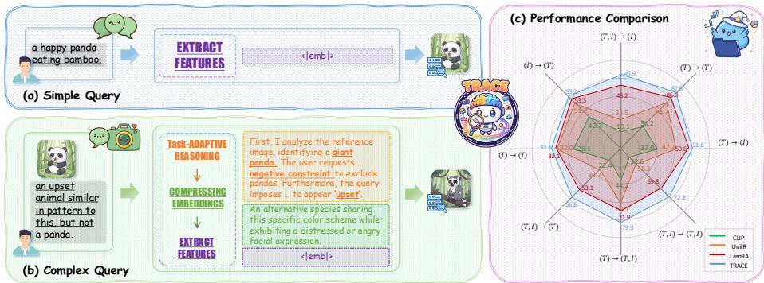
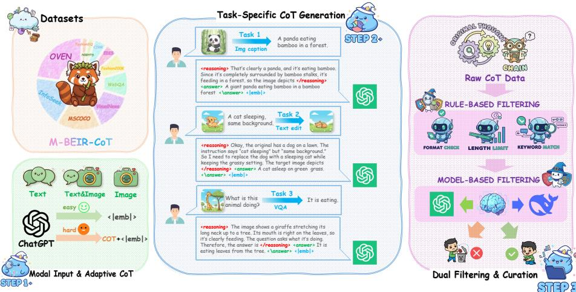
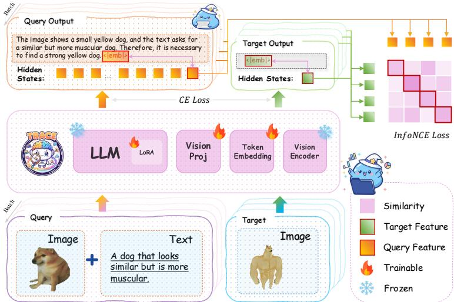
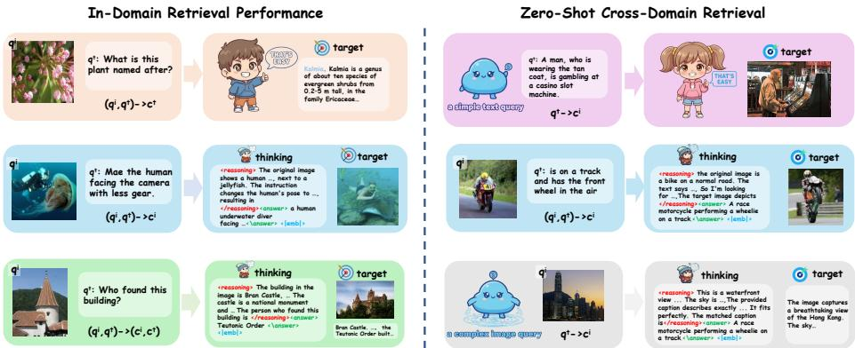
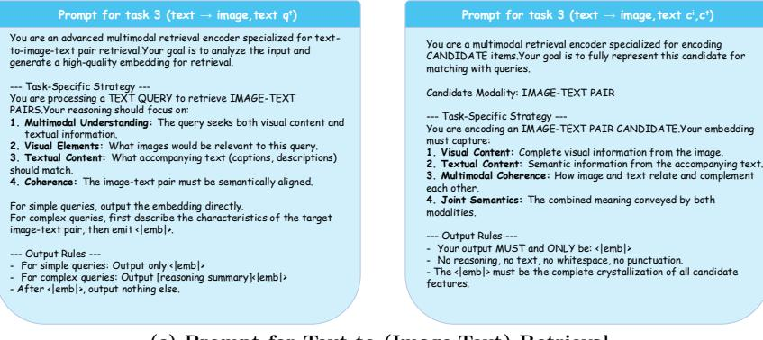
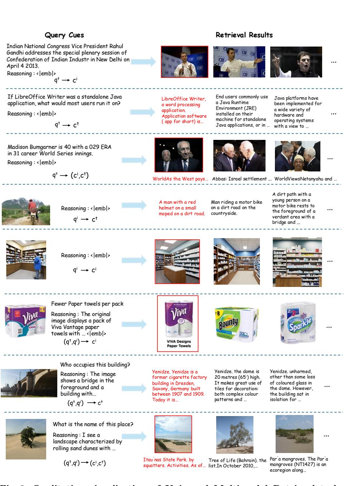

# TRACE：用于通用多模态检索的任务自适应推理与表征学习

肖兆浩 $^{1,2}*$，王世杰 $^{1,2}*$，杨天宇 $^{1,2}*$，王天跃 $^{1,2}$，郭海云 $^{1,2}$，王进乔 $^{1,2}$ $^{1}$ 中国科学院自动化研究所 $^{2}$ 中国科学院大学 {haoxiangzhao2023, wangshijie2026, yangtianyu2024}@ia.ac.cn，wangtianyue25@mails.ucas.ac.cn，{haiyun.guo, jqwang}@nlpr.ia.ac.cn

摘要。通用多模态检索要求统一的嵌入模型能够解读多样化的用户意图，从简单的关键词到复杂的组合指令。虽然多模态大型语言模型（MLLM）具有强大的推理能力，但现有的适配方案将它们局限于静态编码器，未充分利用其生成潜力。这种仅使用编码器的模式在处理需要逻辑推理而非表面模式匹配的复杂意图时面临挑战。为了解决这一问题，我们提出了TRACE（任务自适应推理与压缩嵌入）。TRACE将生成推理与判别表示学习相结合。它首先生成一个结构化的思维链（CoT）以明确推理查询，然后通过专用的词元将这一推理轨迹压缩为紧凑的嵌入。为了训练这一框架，我们构建了M-BEIR-CoT，一个具有难度意识路由策略的大规模数据集。在M-BEIR基准上的实验表明TRACE是新的最先进技术。重要的是，TRACE展示了学习到的隐式路由行为。它在处理复杂查询时自主激活推理，而在处理简单查询时绕过推理，实现了检索准确性与推理吞吐量之间的最佳平衡。此外，通过内化推理过程，TRACE在未见领域和新约束上表现出显著的零样本迁移能力。关键词：通用多模态检索 · 多模态大型语言模型 · 思维链 · 表示学习

# 1 引言

当前通用检索的瓶颈。通用多模态检索旨在统一不同模态的搜索，从纯文本到复杂交错的图像-文本查询[18, 23, 41, 43, 47, 52]。近年来，多模态大语言模型已经彻底改变了跨模态理解[20, 26, 33]。然而，目前将这些模型适应于检索任务的主流范式将其视为静态编码器[17, 18, 23, 43, 53]。该模型接收多模态输入，并通过一次前向传播直接压缩成固定维度的嵌入。虽然对于简单匹配[16, 22, 35, 49, 50]来说效率较高，但在处理组合用户意图时[1, 3, 39, 40, 45]，如命令移除特定对象或改变视觉属性，这种方法面临着一个关键瓶颈。强迫模型在单次编码步骤中隐式执行多步逻辑造成了严重的认知瓶颈，根本未能充分利用其固有的生成推理能力。

  
Fig. 1: The TRACE Framework. TRACE learns a query-dependent inference strategy. (a) For simple queries, it implicitly bypasses the reasoning stage and directly extracts features to maintain high efficiency. (b) For complex queries, it automatically activates the task-adaptive reasoning process. The model generates an explicit reasoning trace [44] to resolve semantic ambiguities before compressing this context into the final representation. (c) Performance comparison on the M-BEIR benchmark [43] demonstrates the effectiveness of TRACE, particularly on reasoning-intensive tasks.

范式转变：先推理后编码。为了充分发挥这些模型在检索中的潜力，我们提出在特征表示之前向任务自适应推理的转变。受到自然语言处理领域结构化推理成功的启发，我们认为在复杂场景中，显式的推理步骤是必不可少的。模型应首先利用其生成头生成一个推理轨迹，以清晰表达其对用户意图的理解。这一生成的上下文作为语义桥梁，引导模型产生高保真嵌入，捕捉细致的推理状态，而不仅仅是表层特征。TRACE框架。基于这一洞察，我们引入TRACE。这个新颖的框架无缝整合了生成推理与辨别性表示学习。TRACE首先利用语言模型生成一个结构化的推理路径，以分析和融合查询模态。随之而来的是，TRACE采用专门的词元和因果注意力机制，将这一显式轨迹压缩为紧凑的向量。关键的是，TRACE学习了一种自适应路由机制。它能够自动识别查询的难度，对于简单的关键字搜索绕过推理阶段，而对于复杂任务则激活推理过程。这确保了在性能与推理效率之间的最佳平衡，而无需显式的架构分支。数据构建与核心发现。在训练这样一个系统的过程中，最大的障碍之一是缺乏高质量推理轨迹与检索目标对齐的数据集。为了解决这个问题，我们构建了M-BEIR-CoT，这是一个通过基础模型合成的大规模数据集，基于M-BEIR基准进行创建。严格的过滤过程确保推理是支持性的，而非幻觉性的。总结而言，我们的主要贡献包括：我们提出TRACE，这是一个将任务自适应推理显式整合到辨别性嵌入过程中的通用检索框架。与传统的两阶段管道不同，TRACE内化推理以平衡准确性与推理吞吐量。 我们引入M-BEIR-CoT，这是一个旨在促进检索任务自适应推理能力的大规模且经过质量过滤的数据集，解决了该领域关键的数据稀缺问题。 我们在M-BEIR基准和广泛的零样本场景上建立了新的最先进性能。此外，我们发现了检索推理中的一个基本不对称性：查询端的推理显著增强了语义对齐，而强迫候选端推理会导致性能严重下降，因过拟合于生成的文本模式。

# 2 相关工作

# 2.1 通用多模态检索的发展历程

多模态检索领域已经从专门的双编码器架构发展到统一的生成框架。早期主流方法，如 CLIP 和 ALIGN，通过在大规模数据集上进行对比学习，将视觉和文本表示对齐，建立了强有力的基线。尽管这些双编码器模型在标准图像-文本匹配中有效，但它们在最终的晚期交互之前独立处理各个模态。这种架构根本限制了它们捕捉细粒度组合逻辑的能力，例如在保留背景上下文的同时需要对象修改的组合图像检索任务。为了应对这些局限性，近期研究转向使用多模态大型语言模型（MLLMs）进行表征学习。UniIR、E5-V 和 LamRA 等方法将 MLLMs 适配为通用检索器，通常通过附加特定提示来提取最后隐藏状态的嵌入。尽管这些方法利用了 MLLMs 的广泛世界知识，在零-shot 基准测试中超越了双编码器，但它们主要将模型视为静态编码器。通过单次前向传递将输入直接压缩为嵌入，这些方法绕过了主干网络固有的生成推理能力。这造成了一个认知瓶颈，模型被迫将复杂逻辑查询直接映射到向量空间，而没有中间的推理步骤。

# 2.2 针对区分任务的推理链

连锁思维（CoT）提示已被证明在提升大型语言模型在多种生成任务中的推理能力方面有效。在多模态领域，近期的研究成功将CoT扩展至减少幻觉并提高视觉问答和图像描述的可解释性。然而，将显式推理整合到区分性检索中仍然未被充分探索。现有的将推理引入检索的方法通常依赖于分离的多阶段流程。例如，一些方法在将扩展文本输入到单独的编码器之前，利用生成模型进行外部查询扩展或重写。这种分离阻碍了视觉感知与逻辑推理的无缝流动。TRACE通过将这一过程内部化于统一的端到端框架而脱颖而出。TRACE不是将推理和编码视为由不同模型处理的独立步骤，而是生成一个潜在的推理轨迹，直接压缩到检索嵌入中。该设计允许模型自适应地平衡推理效率与复杂查询所需的推理深度。

# 3 方法

在本节中，我们详细介绍提议的 TRACE 框架。我们首先在第 3.1 节中阐述推理感知的通用检索问题。第 3.2 节介绍了我们的 M-BEIR-CoT 数据集的构建，该数据集为我们的模型提供了认知基础。最后，在第 3.3 节中，我们展示了统一的 TRACE 架构及其单阶段训练策略。

# 3.1 问题表述

我们旨在学习一个通用检索函数 $f _ { \theta }$，能够处理多模态查询 $Q$（包括文本 $T$、图像 $I$ 或交错序列），从候选集合 $\varOmega$ 中检索目标 $C$。与传统的检索器直接将输入映射到静态向量（$Q \to { \mathbf v } _ { q }$）不同，TRACE 将检索视为条件生成后压缩的过程。形式上，给定一个查询 $Q$，模型生成一个以特殊标记 $< | \mathtt { e m b } | >$ 结尾的中间序列 $S$：

$$
S = [ \mathcal { R } ; < | \operatorname { e m b } | > ] , \quad \mathrm { w h e r e } \ \mathcal { R } = \left\{ \begin{array} { l l } { \emptyset } & { \mathrm { i f } \ z = 0 } \\ { \{ r _ { 1 } , \dots , r _ { k } \} } & { \mathrm { i f } \ z = 1 } \end{array} \right.
$$

  
Fig. 2: The construction pipeline of the M-BEIR-CoT dataset. The process operates in three phases: (1) Query Complexity Assessment: An advanced MLLM assesses query difficulty, routing simple queries to a direct path (generating only $< | \mathsf { e m b } | >$ ) and complex queries to a reasoning path (generating $\mathtt { C o T } + < | \mathtt { e m b } | >$ . (2) Task-Specific CoT Generation: We design specialized prompts for diverse tasks (e.g., captioning, text edit, VQA) to generate structured reasoning traces enclosed in <reasoning> tags. (3) Dual Filtering & Curation: To ensure data quality, we apply a coarse-to-fine strategy. We first use rule-based filtering to verify formats and lengths, followed by model-based filtering to ensure semantic consistency between the generated text and ground-truth targets.

这里，$z \in \{ 0 , 1 \}$ 代表一个潜在复杂性变量，用于判断是否激活推理轨迹 $\mathcal { R }$。最终的查询表示 $\mathbf { e } _ { q }$ 是从负责预测 $< | \mathsf { e m b } | >$ 词元的隐状态中提取的。目标是最大化相似度评分 $\mathrm { s i m } ( \mathbf { e } _ { q } , \mathbf { e } _ { c } )$ 与真实目标之间的相似性。

# 3.2 M-BEIR-CoT 的构建

现有的检索数据集通常缺乏训练具有推理能力模型所需的明确逻辑链。为了解决这一问题，我们构建了 M-BEIR-CoT，这是一个基于 M-BEIR 基准 [43] 的大规模数据集。我们的构建流程分为三个不同阶段，如图 2 所示。阶段 1：查询复杂度评估与自适应路由。为了优化效率与推理深度之间的权衡，我们采用先进的 MLLM（例如 GPT-4o [33]）作为查询复杂度评估器。该模块将模态输入分类为两条流：用于简单模式匹配任务的直接编码流（$z = 0$），以及用于涉及约束或逻辑的复杂查询的推理增强流（$z ~ = ~ 1$）。这创建了一种混合数据集结构，教育模型在何时进行推理以及何时进行反射性动作。

  
Fig. 3: Illustration of the TRACE architecture. The model processes a multimodal query through a frozen vision encoder and a trainable projector. The LLM acts as a unified reasoner and encoder. It first generates a Chain-of-Thought (CoT) [44] to interpret the intent and then compresses the semantics into a learnable $< | \mathtt { e m b } | >$ token. The final query feature is extracted from the hidden state immediately preceding $< | \mathtt { e m b } | >$ . During training, the model is optimized jointly using Cross-Entropy (CE) loss for reasoning generation and InfoNCE loss [32] for embedding alignment.

阶段 2：任务特定的推理链生成。对于路由到推理流的查询，我们采用针对不同检索子任务量身定制的专用提示模板。在视觉推理中，模型在总结之前先明确细致的细节。在遵循指令时（例如 CIR [40,45]），推理轨迹显式定义了源状态、目标操作和不变上下文。在逻辑推理中，模型进行多步推理。所有输出都严格按照 <reasoning> 和 <answer> 标签格式化，以便进行结构化解析。阶段 3：双重过滤与策划。为了减少幻觉现象，我们实施严格的粗到细过滤协议。首先，我们应用基于规则的过滤来移除格式无效或长度不足的样本。随后，使用强验证模型进行基于模型的一致性检查，以计算生成答案与真实目标之间的语义对齐。只有超过高置信度阈值的样本被保留，确保数据集为生成和检索提供高质量的监督。按照此流程，我们策划了 575,442 个高质量推理样本。关键是，在训练过程中我们去除了辅助标签（<reasoning>, <answer $>$），以强制自然生成。将这些样本与 518,311 个简单样本合并，生成我们的最终 M-BEIR-CoT 数据集。有关数据集构建的更多详细信息，请参见补充材料。

# 3.3 TRACE框架

架构与自适应机制。我们框架基于 Qwen2.5-VL [2]，由视觉编码器、投影器和大型语言模型（LLM）主干组成。TRACE 通过 LLM 处理输入查询 $Q$，以自回归方式生成响应序列。我们架构的一个独特特征是推理的自适应激活特性。由于 M-BEIR-CoT 数据集包含经过精心挑选的直接编码（$z = 0$）和增强推理序列（$z = 1$）的混合，模型隐式学习评估查询复杂性。在推理过程中，模型通过标准自回归解码动态确定最佳路径。设 $\mathcal{V}_{\mathrm{text}}$ 为标准文本词汇。在第一次解码步骤中，输出序列受以下约束：

$$
\mathrm { O u t p u t } ( Q ) = \left\{ \begin{array} { l l } { { \left[ \times | \operatorname { e m b } | > \right] } } & { { { \mathrm { i f } } < | \operatorname { e m b } | > = \arg \operatorname* { m a x } _ { y \in \mathcal { V } } P ( y \mid Q ) } } \\ { { \left[ \mathrm { C o T ~ T o k e n s } , < | \operatorname { e m b } | > \right] } } & { { { \mathrm { i f } } \ \arg \operatorname* { m a x } _ { y \in \mathcal { V } } P ( y \mid Q ) \in \mathcal { V } _ { \mathrm { t e x t } } } } \end{array} \right.
$$

TRACE并不依赖于显式的架构分支或手动调优的门控网络，而是自然地将初始概率质量转移到用于简单查询的 $< | \mathtt { e m b } | >$ 词元，以及用于复杂查询的文本词元。由于因果注意力机制，隐藏状态 $\mathbf { h } _ { t }$ 被优化用于预测下一个词元 $y _ { t + 1 }$。因此，紧接在 $< | \mathtt { e m b } | >$ 之前的词元负责预测这个序列结束标识符。因此，这个特定状态聚合了来自整个前文上下文的信息，包括原始查询和生成的推理链——充当了最优的语义瓶颈。我们提取这个预词元的隐藏状态作为最终的检索嵌入 $\mathbf { e } _ { q } \in \mathbb { R } ^ { d }$。统一单阶段训练。我们采用统一的单阶段训练策略，在混合 M-BEIR-CoT 数据集上优化模型。这种方法同时赋予模型推理和表示能力，使用混合目标函数。首先，生成推理损失 $\left( \mathcal { L } _ { \bf g e n } \right)$ 利用标准交叉熵损失来监督推理链词元的生成，强迫模型内化意图分解的逻辑：

$$
\mathcal { L } _ { \mathrm { g e n } } = - \sum _ { t = 1 } ^ { | \mathcal { R } | } \log P ( y _ { t } \mid y _ { < t } , Q ) ,
$$

其中 $y$ 表示真实标注的推理词元。其次，鉴别对比损失 $\left( \mathcal { L } _ { \mathrm { r e t } } \right)$ 通过对最终的 $< | \mathtt { e m b } | >$ 词元应用 InfoNCE 损失 [32] 来构建嵌入空间。给定一批 $B$ 对查询-目标对 $\{ ( Q _ { i } , C _ { i } ) \} _ { i = 1 } ^ { B }$。

$$
\mathcal { L } _ { \mathrm { r e t } } = - \frac { 1 } { B } \sum _ { i = 1 } ^ { B } \log \frac { \exp ( \sin ( \mathbf { e } _ { q _ { i } } , \mathbf { e } _ { c _ { i } } ) / \tau ) } { \sum _ { j = 1 } ^ { B } \exp ( \sin ( \mathbf { e } _ { q _ { i } } , \mathbf { e } _ { c _ { j } } ) / \tau ) } .
$$

$$
\mathcal { L } = \lambda _ { \mathrm { g e n } } \mathcal { L } _ { \mathrm { g e n } } + \lambda _ { \mathrm { r e t } } \mathcal { L } _ { \mathrm { r e t } }
$$

Table 1: Comparison on the M-BEIR test set. We report Recall@5 for the majority of datasets, with the exception of FashionIQ (FIQ) [45] and Fashion200K (F200K) [13] where Recall@10 is utilized. The first row indicates the specific retrieval task type (e.g. $q ^ { t }  c ^ { i }$ for text-to-image retrieval). Abbreviations: VN (VisualNews) [25], InfoS (InfoSeek) [6]. The best results are highlighted in bold, and the second-best are underlined. The Improvement row specifically reports the performance gains of TRACE compared to LamRA-Ret.   

<table><tr><td rowspan="3">Methods</td><td colspan="3">q1 → c{</td><td colspan="2">q {  c{}$</td><td colspan="2">qt → (ci, ct)</td><td colspan="3">qi → c{</td><td>q  c</td><td>(q, qt) → c′ (qi, qt) → ci (q,q′) → (ci,ct)</td><td></td><td></td><td></td><td></td><td></td><td></td></tr><tr><td>VN</td><td>COCO F200K WebQA EDIS WebQA</td><td></td><td></td><td></td><td></td><td>VN</td><td></td><td></td><td>COCO F200K NIGHTS OVEN InfoS FIQ</td><td></td><td></td><td></td><td></td><td></td><td>CIRR OVEN</td><td>InfoS</td><td>Avg.</td></tr><tr><td>R@5</td><td>R@5</td><td>R@10</td><td>R@5</td><td>R@5</td><td></td><td>R@5</td><td>R@5</td><td>R@5</td><td>R@10</td><td>R@5</td><td>R@5</td><td></td><td></td><td>R@5 R@10 R@5</td><td>R@5</td><td>R@5</td><td></td></tr><tr><td>CLIP-L [35]</td><td>43.3</td><td>61.1</td><td>6.6</td><td>36.2</td><td>43.3</td><td>45.1</td><td>41.3</td><td>79.0</td><td>7.7</td><td>26.1</td><td>24.2</td><td>20.5</td><td>7.0</td><td>13.2</td><td>38.8</td><td></td><td>26.4</td><td>32.5</td></tr><tr><td>SigLIP [50]</td><td>30.1</td><td>75.7</td><td>36.5</td><td>39.8</td><td>27.0</td><td>43.5</td><td>30.8</td><td>88.2</td><td>34.2</td><td>28.9</td><td></td><td>29.7</td><td>25.1</td><td>14.4</td><td>22.7</td><td>41.7</td><td>27.4</td><td>37.2</td></tr><tr><td>BLIP[21</td><td>16.4</td><td>74.4</td><td>15.9</td><td>44.9</td><td>26.8</td><td>20.3</td><td>17.2</td><td>83.2</td><td>19.9</td><td>27.4</td><td></td><td>16.1 10.2</td><td></td><td>2.3</td><td>10.6</td><td>27.4</td><td>16.6</td><td>26.8</td></tr><tr><td>BLI2 [20]</td><td>16.7</td><td>63.8</td><td>14.0</td><td>38.6</td><td>26.9</td><td>24.5</td><td>15.0</td><td>80.0</td><td>14.2</td><td>25.4</td><td></td><td>12.2</td><td>5.5</td><td>4.4</td><td>11.8</td><td>27.3</td><td>15.8</td><td>24.8</td></tr><tr><td>Qwen2.5-VL-7B [2]</td><td>9.3</td><td>55.1</td><td>5.0</td><td>42.0</td><td>26.2</td><td>9.4</td><td>5.4</td><td>46.6</td><td>4.0</td><td>21.3</td><td></td><td>21.4</td><td>22.5</td><td>4.3</td><td>16.3</td><td>43.6</td><td>36.2</td><td>23.0</td></tr><tr><td>UniIR-BLIPFF [43]</td><td>23.4</td><td>79.7</td><td>26.1</td><td>80.0</td><td>50.9</td><td>79.8</td><td>22.8</td><td>89.9</td><td>28.9</td><td>33.0</td><td></td><td>41.0</td><td>22.4</td><td>29.2</td><td>52.2</td><td>55.8</td><td>33.0</td><td>46.8</td></tr><tr><td>UniIR-CLIPSF [43]</td><td>42.6</td><td>81.1</td><td>18.0</td><td>84.7</td><td>59.4</td><td>78.7</td><td>43.1</td><td>92.3</td><td>18.3</td><td>32.0</td><td>45.5</td><td>27.9</td><td></td><td>24.4</td><td>44.6</td><td>67.6</td><td>48.9</td><td>50.6</td></tr><tr><td>LamRA-Ret [28]</td><td>41.6</td><td>81.5</td><td>28.7</td><td>86.0</td><td>62.6</td><td>81.2</td><td>39.6</td><td>90.6</td><td>30.4</td><td>32.1</td><td></td><td>54.1</td><td>52.1</td><td>33.2</td><td>53.1</td><td>76.2</td><td>63.3</td><td>56.6</td></tr><tr><td></td><td></td><td></td><td></td><td></td><td></td><td></td><td>Our Method</td><td></td><td></td><td></td><td></td><td></td><td></td><td></td><td></td><td></td><td></td><td></td></tr><tr><td>TRACE - Improvement</td><td>+0.5 +0.8</td><td>42.1 82.3</td><td>30.5 +1.8</td><td>87.8 +1.8</td><td>64.1 +1.5</td><td>82.5 +1.3</td><td>41.2 +1.6</td><td>91.3 +0.7</td><td>33.2 +2.8</td><td>33.6 +1.5</td><td>+3.3</td><td>57.4 55.8 36.4 57.3 78.5 +3.7 +3.2</td><td></td><td></td><td>+4.2</td><td>+2.3</td><td>67.1 +3.8</td><td>58.8 +2.2</td></tr></table>

这种联合优化确保生成推理过程被明确引导，以最大化最终检索嵌入的判别能力。

# 4 实验

# 4.1 实验设置

数据集与评估指标。我们主要利用构建的 M-BEIR-CoT 数据集进行指令微调。该数据集来源于 M-BEIR [43] 基准，增强了高质量的推理注释，以支持认知检索。针对领域内评估，我们在标准的 M-BEIR 测试集上进行评测，该测试集涵盖了 10 个不同数据集中的八个不同检索任务。为了严格评估泛化能力，我们对一组严格排除在训练阶段之外的 13 个未见数据集的性能进行调查。其中包括 ShareGPT4V [5]、Urban-1K [51]、CIRCO [3] 和 Visual Dialog [8]，涉及细粒度识别、复合图像检索和多轮对话等多个领域。我们遵循标准评估指标。对于检索任务，我们报告 Recall@K，对于图像文本匹配任务，我们采用准确率作为主要指标。基准比较。我们将 TRACE 与一组综合的最先进方法进行比较。第一组包括通用视觉-语言模型和双编码器，如 CLIP [35]、SigLIP [50]、BLIP2 [20] 和基础的 Qwen2.5-VL [2]。这些基准用于评估基本的视觉语义对齐。第二组由专业的通用检索器组成，如 UniIR [43] 和最近的最先进的 LamRA [28]。该比较验证了我们的方法在统一多模态搜索特定背景下的有效性。

Table 2: Efficiency vs. Accuracy Trade-off. We compare standard direct embedding, forced reasoning (Always CoT), and our adaptive approach (TRACE). QPS (Queries Per Second) is measured on a single NVIDIA H20 GPU during the online encoding phase.   

<table><tr><td rowspan="2">Method</td><td colspan="3">MSCOCO (Simple) CIRR (Complex)</td></tr><tr><td>QPS ↑</td><td>R@5 ↑</td><td>QPS ↑ R@5 ↑</td></tr><tr><td>Direct Embedding</td><td>15.68</td><td>87.40</td><td>12.15 53.06</td></tr><tr><td>Always CoT (Forced)</td><td>4.45</td><td>63.90 3.42</td><td>54.73</td></tr><tr><td>TRACE (Ours)</td><td>8.25 89.10</td><td>6.48</td><td>57.03</td></tr></table>

实现细节。我们的框架以 Qwen2.5-VL-7B [2] 作为主要主干网络。与复杂的多阶段管道不同，我们采用统一的单阶段训练策略。该模型在 M-BEIR-CoT 数据集上进行微调，使用 16 个 NVIDIA H20 GPU 进行训练。我们以全局批量大小 1024 训练一个周期，学习率设置为 $2 \times 10^{-4}$，并利用带有余弦学习率衰减策略的 AdamW 优化器。为了顺利处理多样的任务类型，我们应用了一种任务感知的采样策略，以确保不同模态间的梯度更新平衡。视觉编码器的参数保持冻结，以保留预训练的视觉表示，而语言模型的参数则采用低秩适配 [14] 进行更新。

# 4.2 效率与自适应分析

将生成推理整合到检索系统中的一个主要问题是潜在的延迟开销。为了解决这个问题，我们进行了一项严格的分析，比较不同任务难度下的查询吞吐量和检索准确性。我们选择 MSCOCO 代表简单的模式匹配查询，选择 CIRR 代表复杂的推理密集型查询。如表 2 所示，TRACE 在计算成本和检索性能之间表现出卓越的平衡。在像 MSCOCO 这样的简单任务中，强迫模型生成推理轨迹导致性能严重下降，从 $8 7 . 4 0 \%$ 降至 $6 3 . 9 0 \%$，表明简单查询面临过度思考和虚假约束的问题。TRACE 有效地绕过了这个问题，将性能恢复至 $8 9 . 1 0 \%$，同时实现了几乎双倍的吞吐量。相反，在像 CIRR 这样的复杂任务中，TRACE 智能地在速度和精度之间进行了取舍，取得了显著的准确性提升。为了进一步验证 TRACE 确实内化了任务难度，而不是依赖启发式猜测或表面数据拟合，我们分析了其在测试集上的路由准确性。值得注意的是，对于 MSCOCO 中的简单查询，模型在第一次解码步骤中直接输出 $< | \mathsf { e m b } | >$ 标记的概率高达 96\%。相反，对于 CIRR 中复杂的组合指令，它自主选择生成文本标记的概率为 62\%。这种高路由精度证实了自适应机制有效捕捉到不同查询的潜在认知需求，实现了高度有利和动态的权衡。

Table 3: Comparison with unseen datasets (Zero-shot). The columns indicate task types, covering text query $( q ^ { t } )$ , image query $( q ^ { i } )$ , dialog query $( q ^ { \mathrm { d i a l o g } } )$ , and multiinterleaved queries. Abbreviations: Share4V (ShareGPT4V) [5], Urban (Urban-1k) [51], VIST (Visual Storytelling) [10], VisD (Visual Dialog) [8], and MT-FIQ (Multi-round FashionIQ) [45]. $^ *$ indicates domain shifts from training data. We report R@1 for most datasets, MAP $@ 5$ for CIRCO [3], R@5 for MT-FIQ, and Accuracy for ITM tasks. The best results are highlighted in bold, and the second-best are underlined. The Improvement row reports the performance gain of TRACE specifically compared to LamRA-Ret.   

<table><tr><td rowspan="3">Methods</td><td colspan="3">qt → ci</td><td colspan="3">qi → ct</td><td colspan="2">(qi,q) → ci</td><td>qdialog → ci</td><td colspan="2">(qi  qt) → ci</td><td colspan="2">ITM</td></tr><tr><td>Share4V</td><td>Urban*</td><td>Flickr</td><td>Share4V</td><td>Urban*</td><td>Flickr</td><td>CIRCO*</td><td>GeneCIS*</td><td>VisD*</td><td>VIST</td><td>MT-FIQ*</td><td>CC-Neg</td><td>Sugar-Crepe*</td></tr><tr><td></td><td>R@1</td><td>R@1</td><td>R@1</td><td>R@1</td><td>R@1</td><td>R@1</td><td>MAP@5</td><td>R@1</td><td>R@1</td><td>R@1</td><td>R@5</td><td>Acc.</td><td>Acc.</td></tr><tr><td>CLIP-L [35]</td><td>84.0</td><td>52.8</td><td>67.3</td><td>81.8</td><td>68.7</td><td>87.2</td><td>4.0</td><td>13.3</td><td>23.7</td><td>0.6</td><td>17.7</td><td>66.7</td><td>73.0</td></tr><tr><td>Long-CLIP-L [51]</td><td>95.6</td><td>86.1</td><td>76.1</td><td>95.8</td><td>82.7</td><td>89.3</td><td>5.7</td><td>16.3</td><td>37.9</td><td>1.1</td><td>18.5</td><td>76.3</td><td>80.9</td></tr><tr><td>UniIR-CLIP [43]”</td><td>85.8</td><td>75.0</td><td>78.7</td><td>84.1</td><td>78.4</td><td>94.2</td><td>12.5</td><td>16.8</td><td>26.8</td><td>0.6</td><td>39.4</td><td>79.9</td><td>80.3</td></tr><tr><td>E5-V [17]</td><td>86.7</td><td>84.0</td><td>79.5</td><td>84.0</td><td>82.4</td><td>88.2</td><td>24.8</td><td>18.5</td><td>54.6</td><td>10.0</td><td>19.2</td><td>83.2</td><td>84.7</td></tr><tr><td>MagicLens-L [52]</td><td>85.5 91.2</td><td>59.3</td><td>72.5</td><td>60.9</td><td>24.2</td><td>84.6</td><td>29.6</td><td>16.3</td><td>28.0</td><td>3.3</td><td>22.6</td><td>62.7</td><td>75.9 81.7</td></tr><tr><td>EVA-CLIP-8B [36]</td><td>92.1</td><td>77.8 81.7</td><td>80.8 83.3</td><td>93.1 94.0</td><td>80.4 83.3</td><td>95.6 96.7</td><td>6.0 6.1</td><td>13.1 13.6</td><td>23.2 24.7</td><td>1.2 1.0</td><td>22.1 21.9</td><td>59.4 63.8</td><td>83.1</td></tr><tr><td>EVA-CLIP-18B [36] LamRA-Ret [28]</td><td>93.3</td><td>95.1</td><td>82.8</td><td>88.1</td><td>94.3</td><td>92.7</td><td>33.2</td><td>18.9</td><td>62.8</td><td>23.1</td><td>60.9</td><td>79.6</td><td>85.8</td></tr><tr><td></td><td></td><td></td><td></td><td></td><td></td><td></td><td></td><td></td><td></td><td></td><td></td><td></td><td></td></tr><tr><td colspan="10">Ours Method</td><td></td><td></td><td></td><td></td><td>87.5</td></tr><tr><td>TRACE - Improvement</td><td>94.9 +1.6</td><td>94.8</td><td>84.5</td><td>89.1</td><td>94.1</td><td>94.5</td><td>34.8</td><td>20.5</td><td>65.4</td><td>25.8</td><td>63.2 +2.3</td><td>84.1</td><td>+1.7</td></tr><tr><td></td><td></td><td>-0.3</td><td>+1.7</td><td>+1.0</td><td>-0.2</td><td>+1.8</td><td>+1.6</td><td>+1.6</td><td>+2.6</td><td>+2.7</td><td></td><td>+4.5</td><td></td></tr></table>

# 4.3 在通用检索中的表现

对M-BEIR基准的分析。表1显示TRACE在全面的M-BEIR基准上建立了新的最先进水平。详细检查表明，性能提升在要求高级认知处理的任务中最为明显。在推理密集型数据集如CIRR [29]、FashionIQ [45]和InfoSeek [6]上，与像LamRA这样的强基线相比，TRACE在Recall@5方面分别取得了$4.2\%$、$3.2\%$和$3.8\%$的显著提升。传统的通用检索器通常在这些数据集上表现不佳，因为它们试图将组合指令直接映射到视觉空间中，而没有中间逻辑。相反，TRACE在实证上验证了生成的推理轨迹有效地弥补了这一语义差距。此外，这种增强的能力并没有影响基础检索性能。在标准单模态任务中，TRACE保持了高度竞争的结果。当直接将TRACE与其基础模型进行比较时，我们的框架的变革性影响最为明显：它将原始的Qwen2.5-VL平均得分从$23.0\%$提升至$58.8\%$。这一巨大的提升证实了任务自适应推理范式对于将多模态模型的潜在知识转化为判别任务的重要性。

# 4.4 主干网络的可扩展性

为了验证泛化能力，我们在不同模型规模和架构上评估了 TRACE。从经验上看，将主干网络从 Qwen2-VL-2B 扩展到 Qwen2-VL-7B，使整体 M-BEIR 平均分数从 $50.2\%$ 提升至 $55.6\%$，而重推理的 CIRR R@5 从 $51.9\%$ 提升至 $54.2\%$。进一步升级到 Qwen2.5-VL-7B 架构，取得了最佳表现，在各自指标上分别达到 $58.8\%$ 和 $57.3\%$。这一持续上升的趋势证实了检索性能与主干网络的推理能力成正比：更强的模型生成更高质量的推理轨迹，这些轨迹压缩为更具判别性的嵌入。

# 4.5 对未见场景的零样本泛化

在未见数据集上的迁移能力。为了严格验证TRACE的迁移能力，我们在完全与训练阶段隔离的13个数据集上进行了广泛的零-shot实验。结果清晰显示TRACE的优势。尽管TRACE在标准匹配任务上表现与大型模型如EVA-CLIP-18B相当，但在需要推理的基准测试上则展现出卓越的泛化能力。在CIRCO，一个具有众多困难干扰项的高度挑战性零-shot组合检索数据集上，TRACE在MAP@5上以1.6%的明显优势超过LamRA。此外，在Multi-round FashionIQ和Visual Dialog等多轮交互任务中，我们分别实现了2.3%和2.6%的增益。我们将这种强大的零-shot性能直接归因于推理过程的内化。TRACE并不是通过记忆特定数据集的分布来学习，而是掌握了一种广泛的认知技能用于意图解析。这使得模型能够自主适应全新检索逻辑和完全陌生领域中的复杂语义约束。

# 4.6 消融研究

我们对 M-BEIR-CoT 数据集的 CIRR 子集进行了全面的消融研究。需要强调的是，我们采用了严格的 M-BEIR 评估协议[43]，该协议从大约 21K 图像的庞大候选池中检索目标。这比标准的 CIRR 验证拆分面临着显著更具挑战性的场景，对难负样本执行严格的区分。我们在补充材料中包含了更多的消融结果。特征提取位置的影响。在因果语言模型中，位置 $t$ 的隐状态被优化以预测位置 $t + 1$ 的词元。因此，确定提取检索嵌入的最佳位置并非易事。我们比较了三种提取策略：使用 $< | \mathtt { e m b } | >$ 词元自身的隐状态、将推理包装在结构标签中并使用最终标签，以及使用 $< | \mathtt { e m b } | >$ 之前的词元的隐状态。表 4 显示，预词元策略实现了最高的性能。从自回归建模的角度来看，这个隐状态恰好是负责预测序列终止嵌入词元的状态。因此，它充当了语义瓶颈，能够有效地将所有前面的推理步骤和视觉上下文简化为一个单一的、针对检索优化的表示。

Table 4: Ablation on feature extraction position. The pre-token strategy provides the optimal semantic bottleneck.   

<table><tr><td>Pooling Position</td><td>R@1</td><td>R@5 R@10</td></tr><tr><td>Last Token (&lt;lemb|&gt;) 24.46</td><td></td><td>52.25 63.81</td></tr><tr><td>Structure &lt;/think&gt;</td><td>24.36</td><td>53.06 63.93</td></tr><tr><td>Pre-Token (Ours)</td><td>28.37 57.03</td><td>68.30</td></tr></table>

Table 5: Ablation on reasoning data components. Full reasoning traces yield the highest retrieval accuracy.   

<table><tr><td>Data Components</td><td>R@1</td><td>R@5 R@10</td></tr><tr><td>Direct Training (None)</td><td>24.52</td><td>53.15 63.10</td></tr><tr><td>&lt;answer&gt; Only</td><td>25.99</td><td>53.67 64.48</td></tr><tr><td>&lt;reasoning&gt; Only</td><td>26.38</td><td>53.41 64.60</td></tr><tr><td>Full CoT</td><td>28.37</td><td>57.03 68.30</td></tr></table>

CoT组件的有效性。我们对推理数据进行拆解，以分析哪些元素对检索准确性贡献最大。我们训练了几种变体，使用直接映射而不使用中间词元，仅使用最终重写的答案文本，仅使用逻辑链，以及使用完整的推理序列。表5揭示了明显的性能层次。直接训练的结果最低，证实了简单的黑箱映射是不够的。虽然添加孤立的答案或逻辑链相较于基线有提升，但使用完整的推理轨迹取得了最佳结果。这证明了意图分解的逐步过程与明确结论相结合，提供了最丰富的语义指导。与两阶段管道的比较。为了严格验证端到端内化的必要性，我们将TRACE与解耦的“外部-CoT $^ +$ 编码器”基线进行了比较。在这个两阶段设置中，我们首先利用基础的Qwen2.5-VL模型显式生成推理文本和目标描述，然后将这个增强的文本输入一个冻结的LamRA编码器。实证结果显示，这种不连续的管道在检索性能上遭遇了严重崩溃。这证实了我们的核心假设：将连续的潜在推理状态直接压缩到$< | \mathtt { e m b } | >$词元中，保留了比强迫通过离散的文本瓶颈更丰富的语义细微差别。非对称推理策略。我们调查生成推理是否对查询和候选图像都有益。在训练期间，我们对候选方应用不同的推理配置。表6揭示了一个显著现象：将推理应用于候选方导致性能灾难性下降，R@5从$5 7 . 0 3 \%$骤降至$1 8 . 9 0 \%$。我们将此归因于检索任务的基本非对称性。查询包含一个尚未解决的用户意图，需要主动的逻辑推导将表示投射到目标状态。相比之下，候选图像作为最终视觉状态的静态真实值锚。强迫模型为候选生成文本会导致嵌入过拟合生成的语言模式，而不是捕捉内在的视觉特征，从而切断了与查询空间的对准。

Table 6: Ablation on asymmetric reasoning. Applying reasoning to the candidate side causes severe performance degradation.   

<table><tr><td>Query Side Candidate Side R@1</td><td></td><td></td><td>R@5 R@10</td></tr><tr><td>Full CoT</td><td>Full CoT</td><td>7.75 18.90</td><td>26.50</td></tr><tr><td>Full CoT</td><td>&lt;answer&gt;</td><td>8.61</td><td>19.78 26.88</td></tr><tr><td>Full CoT</td><td>None (Raw)</td><td>28.37 57.03</td><td>68.30</td></tr></table>

# 4.7 定性可视化

为了直观理解该框架，我们在图4中可视化了推理过程。该可视化清晰地突显了在不同数据分布下的自适应激活能力。在左侧面板中，TRACE根据任务复杂性动态调整其推理深度。对于简单的知识回忆任务，模型识别到认知负荷较低，直接生成嵌入词元，以最大化效率。相反，对于需要特定对象修改的复杂组合说明，它自发地激活推理过程，明确地分解视觉语义，然后进行压缩。右侧面板展示了这种自适应能力在未见领域的强健迁移。即便没有具体的微调，TRACE也能自主决定何时触发逻辑推理，以处理新的约束或复杂状态描述。这一定性证据确认了该模型获得了一种可迁移的认知技能，用于意图解析，而不仅仅是记忆训练集分布。

# 5 讨论与更广泛的影响

局限性。尽管TRACE在推理感知检索方面有显著进展，但我们承认在计算效率和数据合成方面存在局限性。首先，处理复杂意图依赖于自回归生成，相较于纯前馈编码器引入了额外的开销。然而，这种权衡非常值得，因为处理多步推理的能力解锁了静态模型无法实现的应用。其次，由于M-BEIR-CoT是通过基础模型合成的，压缩嵌入的质量本质上与教师模型的推理上限相关。因此，TRACE可能会继承特定的推理偏差，或在极端的离群场景中出现幻觉。然而，我们的实验表明，这些潜在的偏差在我们评估的范围内并未对性能产生实质性影响。未来的工作将探讨推测解码以最小化推理延迟，以及结合人工干预的策划以减轻数据集偏差并增强推理的鲁棒性。

  
Fig. 4: Visualization of Adaptive Activation. (Left) In-Domain Retrieval: TRACE dynamically toggles between a direct path and a reasoning path based on query complexity. (Right) Zero-Shot Generalization: The adaptive behavior effectively transfers to unseen domains and novel constraints.

更广泛的社会影响。通用多模态检索系统的开发，能够进行复杂意图拆解，具有显著的积极影响。例如，它可以大幅改善无障碍工具，使视觉障碍用户能够使用细致的自然语言描述搜索和导航视觉环境。然而，我们也必须考虑潜在的负面社会影响。如果在没有严格访问控制的情况下部署，先进的意图感知检索模型可能会被滥用于未经授权的监视或从大型非结构化数据库中自动提取敏感个人信息。我们倡导对这些技术的负责任开发，强烈建议与坚固的隐私保护协议和持续的偏见监测相结合。

# 6 结论

在本文中，我们介绍了TRACE，一个新的框架，它将通用多模态检索的范式从直接编码转变为推理再编码的过程。通过将生成性推理明确整合到判别性嵌入管道中，TRACE使多模态模型能够有效地解构复杂的组合意图。为了支持这一能力，我们构建了M-BEIR-CoT，一个通过难度感知管道合成的大规模数据集。关键的是，我们引入了一种学习自适应机制，以解决推理深度与推理效率之间的固有矛盾。这使得模型能够在简单查询时自发跳过显式推理，而在复杂指令时激活推理。大量实验证明，TRACE在M-BEIR基准和各种零样本场景中建立了新的最先进性能。此外，我们的分析揭示了检索逻辑中的基本不对称性，证明推理在查询端是独有益处。我们期望我们的框架能够为构建更具可解释性和认知先进性的检索系统提供坚实基础。

# References

1. Anwaar, M.U., Labintcev, E., Kleinsteuber, M.: Compositional learning of imagetext query for image retrieval. In: Proceedings of the IEEE/CVF Winter conference on Applications of Computer Vision. pp. 11401149 (2021)   
Bai, S. Chen, K., Liu, X., Wang, J., Ge, W., Sog, S., Dang, K. Wang, P., Wang, S., Tang, J., Zhong, H., Zhu, Y., Yang, M., Li, Z., Wan, J., Wang, P., Ding, W., Fu, Z., Xu, Y., Ye, J., Zhang, X., Xie, T., Cheng, Z., Zhang, H., Yang, Z., Xu, H., Lin, J.: Qwen2.5-vl technical report (2025), https://arxiv.org/abs/2502.13923   
3. Baldrati, A., Agnolucci, L., Bertini, M., Del Bimbo, A.: Zero-shot composed image retrieval with textual inversion. In: Proceedings of the IEEE/CVF International Conference on Computer Vision. pp. 1533815347 (2023)   
4. Chang, Y., Narang, M., Suzuki, H., Cao, G., Gao, J., Bisk, Y.: Webqa: Multihop and multimodal qa. In: Proceedings of the IEEE/CVF Conference on Computer Vision and Pattern Recognition (CVPR). pp. 1649516504 (June 2022)   
5. Chen, L., Li, J., Dong, X., Zhang, P., He, C., Wang, J., Zhao, F., Lin, D.: Sharegpt4v: Improving large multi-modal models with better captions. In: European Conference on Computer Vision. pp. 370387. Springer (2024)   
6. Chen, Y., Hu, H., Luan, Y., Sun, H., Changpinyo, S., Ritter, A., Chang, M.W.: Can pre-trained vision and language models answer visual information-seeking questions? In: Bouamor, H., Pino, J., Bali, K. (eds.) Proceedings of the 2023 Conference on Empirical Methods in Natural Language Processing. pp. 1494814968. Association for Computational Linguistics, Singapore (Dec 2023). https://doi.org/ 10.1865/v/2023.emnp-main.925,https:aclanthology.org/2023.emnlpmain.925/   
7. Chu, Z., Chen, J., Chen, Q., Yu, W., He, T., Wang, H., Peng, W., Liu, M., Qin, B., Liu, T.: Navigate through enigmatic labyrinth a survey of chain of thought reasoning: Advances, frontiers and future. In: Ku, L.W., Martins, A., Srikumar, V. (eds.) Proceedings of the 62nd Annual Meeting of the Association for Computational Linguistics (Volume 1: Long Papers). pp. 11731203. Association for Computational Linguistics, Bangkok, Thailand (Aug 2024). https://doi.org/10.18653/ v1/2024.acl-long.65, https://aclanthology.org/2024.acl-long.65/   
8. Das, A., Kottur, S., Gupta, K., Singh, A., Yadav, D., Moura, J.M.F., Parikh, D., Batra, D.: Visual dialog. In: Proceedings of the IEEE Conference on Computer Vision and Pattern Recognition (CVPR) (July 2017)   
9. Devlin, J., Chang, M.W., Lee, K., Toutanova, K.: BERT: Pre-training of deep bidirectional transformers for language understanding. In: Burstein, J., Doran, C., Solorio, T. (eds.) Proceedings of the 2019 Conference of the North American Chapter of the Association for Computational Linguistics: Human Language Technologies, Volume 1 (Long and Short Papers). pp. 41714186. Association for Computational Linguistics, Minneapolis, Minnesota (Jun 2019). https: //doi.org/10.18653/v1/N19-1423, https://aclanthology.org/N19-1423/   
0. Dong, S., Shaheen, I., Shen, M., Mallick, R., Bargal, S.A.: Vista: Visual storytelling using multi-modal adapters for text-to-image diffusion models. In: Proceedings of the IEEE/CVF Winter Conference on Applications of Computer Vision (WACV). pp. 1221 (March 2026)   
1. Fu, S., Tamir, N., Sundaram, S., Chai, L., Zhang, R., Dekel, T., Isola, P.: Dreamsim: Learning new dimensions of human visual similarity using synthetic data (2023), https://arxiv.org/abs/2306.09344   
12. Gao, T., Yao, X., Chen, D.: SimCSE: Simple contrastive learning of sentence embeddings. In: Moens, M.F., Huang, X., Specia, L., Yih, S.W.t. (eds.) Proceedings of the 2021 Conference on Empirical Methods in Natural Language Processing. pp. 68946910. Association for Computational Linguistics, Online and Punta Cana, Dominican Republic (Nov 2021). https://doi.org/10.18653/v1/2021.emnlpmain.552, https://aclanthology.org/2021.emnlp-main.552/   
.Han, X., Wu, Z., Huang, P.X., Zhang, X., Zhu, M., Li, Y., Zhao, Y., Davis, L.S.: Automatic spatially-aware fashion concept discovery. In: Proceedings of the IEEE International Conference on Computer Vision (ICCV) (Oct 2017)   
14. Hu, E.J., Shen, Y., Wallis, P., Allen-Zhu, Z., Li, Y., Wang, S., Wang, L., Chen, W.: LoRA: Low-rank adaptation of large language models. In: International Conference on Learning Representations (2022), https://openreview.net/forum?id= nZeVKeeFYf9   
15.Hu, H., Luan, Y., Chen, Y., Khandelwal, U., Joshi, M., Lee, K., Toutanova, K., Chang, M.W.: Open-domain visual entity recognition: Towards recognizing millions of wikipedia entities. In: Proceedings of the IEEE/CVF International Conference on Computer Vision (ICCV). pp. 1206512075 (October 2023)   
16. Jia, C., Yang, Y., Xia, Y., Chen, Y.T., Parekh, Z., Pham, H., Le, Q., Sung, Y.H., Li, Z., Duerig, T.: Scaling up visual and vision-language representation learning wih noisy text supervision. In: International conferenceon machine learning. pp. 49044916. PMLR (2021)   
Jing, T. Sog, M.Zhag, Z. Hug, H. Deng, W.Sun, F. Zhag, Q. Wa, ., Zhuang, F.: E5-v: Universal embeddings with multimodal large language models (2024), https://arxiv.org/abs/2407.12580   
18. Jiang, Z., Meng, R., Yang, X., Yavuz, S., Zhou, Y., Chen, W.: Vlm2vec: Training vision-language models for massive multimodal embedding tasks. In: Yue, Y., Garg, A., Peng, N., Sha, F., Yu, R. (eds.) International Conference on Learning Representations. vol. 2025, pp. 12551279 (2025), https://proceedings. iclr.cc/paper_files/paper/2025/file/04261fce1705c4f02f062866717d592a-Paper-Conference.pdf   
aiX.T .CheY .Y. iS.Jia mentation via large language model. In: Proceedings of the IEEE/CVF Conference on Computer Vision and Pattern Recognition (CVPR). pp. 9579-9589 (June 2024)   
20. Li, J., Li, D., Savarese, S., Hoi, S.: BLIP-2: Bootstrapping language-image pretraining with frozen image encoders and large language models. In: Krause, A., Brunskill, E., Cho, K., Engelhardt, B., Sabato, S., Scarlett, J. (eds.) Proceedings of the 40th International Conference on Machine Learning. Proceedings of Machine Learning Research, vol. 202, pp. 1973019742. PMLR (2329 Jul 2023), https: //proceedings.mlr.press/v202/li23q.html   
21. Li, J., Li, D., Xiong, C., Hoi, S.: BLIP: Bootstrapping language-image pretraining for unified vision-language understanding and generation. In: Chaudhuri, K., Jegelka, S., Song, L. Szepevari, C., Ni, G., Sabato, S. (eds. Proceedings of the 39th International Conference on Machine Learning. Proceedings of Machine Learning Research, vol. 162, pp. 1288812900. PMLR (1723 Jul 2022), https://proceedings.mlr.press/v162/li22n.html   
22. Li, Y., Fan, H., Hu, R., Feichtenhofer, C., He, K.: Scaling language-image pretraining via masking. In: Proceedings of the IEEE/CVF Conference on Computer Vision and Pattern Recognition (CVPR). pp. 2339023400 (June 2023)   
23. Lin, S.C., Lee, C., Shoeybi, M., Lin, J., Catanzaro, B., Ping, W.: Mm-embed: Universal multimodal retrieval with multimodal llms. arXiv preprint arXiv:2411.02571 (2024)   
24. Lin, T.Y., Maire, M., Belongie, S., Hays, J., Perona, P., Ramanan, D., Dollár, P., Zitnick, C.L.: Microsoft coco: Common objects in context. In: Fleet, D., Pajdla, T., Schiele, B., Tuytelaars, T. (eds.) Computer Vision  ECCV 2014. pp. 740755. Springer International Publishing, Cham (2014)   
25. Liu, F., Wang, Y., Wang, T., Ordonez, V.: Visual news: Benchmark and challenges in news image captioning. In: Moens, M.F., Huang, X., Specia, L., Yih, S.W.t. (eds.) Proceedings of the 2021 Conference on Empirical Methods in Natural Language Processing. pp. 67616771. Association for Computational Linguistics, Online and Punta Cana, Dominican Republic (Nov 2021). https://doi.org/ 10.18653/v1/2021.emnlp-main.542, https://aclanthology.org/2021.emnlpmain.542/   
Lu, H. Li, C., Wu, Q., Lee, Y.J. Visl ins . In:Oh, A. Nau, T., Globerson, A., Saenko, K., Hardt, M., Levine, S. (eds.) Advances in Neural Information Processing Systems. vol. 36, pp. 3489234916. Curran Associates, Inc. (2023), https://proceedings.neurips.cc/paper_files/paper/2023/file/ 6dcf277ea32ce3288914faf369fe6de0-Paper-Conference.pdf   
27. Liu, S., Feng, W., Fu, T.J., Chen, W., Wang, W.: EDIS: Entity-driven image search over multimodal web content. In: Bouamor, H., Pino, J., Bali, K. (eds.) i     l tho  l Processing. pp. 48774894. Association for Computational Linguistics, Singapore (Dec 2023). https://doi.org/10.18653/v1/2023.emnlp-main.297, https:// aclanthology.org/2023.emnlp-main.297/   
28. Liu, Y., Zhang, Y., Cai, J., Jiang, X., Hu, Y., Yao, J., Wang, Y., Xie, W.: Lamra: Large multimodal model as your advanced retrieval assistant. In: Proceedings of the IEEE/CVF Conference on Computer Vision and Pattern Recognition (CVPR). pp. 40154025 (June 2025)   
29. Liu, Z., Rodriguez-Opazo, C., Teney, D., Gould, S.: Image retrieval on reallife images with pre-trained vision-and-language models. In: Proceedings of the IEEE/CVF International Conference on Computer Vision (ICCV). pp. 21252134 (October 2021)   
30. Ma, X., Gong, Y., He, P., Zhao, H., Duan, N.: Query rewriting in retrievalaugmented large language models. In: Bouamor, H., Pino, J., Bali, K. (eds.) Proceedings of the 2023 Conference on Empirical Methods in Natural Language Processing. pp. 53035315. Association for Computational Linguistics, Singapore (Dec 2023). https://doi.org/10.18653/v1/2023.emnlp-main.322, https: //aclanthology.org/2023.emnlp-main.322/   
31. Miech, A., Alayrac, J.B., Laptev, I., Sivic, J., Zisserman, A.: Thinking fast and slow: Efficient text-to-visual retrieval with transformers. In: Proceedings of the IEEE/CVF Conference on Computer Vision and Pattern Recognition (CVPR). pp. 98269836 (June 2021)   
32. Oord, A.v.d., Li, Y., Vinyals, O.: Representation learning with contrastive predictive coding. arXiv preprint arXiv:1807.03748 (2018)   
33. OpenAI: Gpt-4v(ision) system card (2023), https://openai.com/research/gpt-4v-system-card   
3Pi, R. Gao, J. Dio S., Pan, R., Dog, H. Za J., Yao, L. Han, J., Xu H., Kog, L., Zhang, T. DetGPT: Detect what you need via reasoning. In: Bouamor, H., Pino, J., Bali, K. (eds.) Proceedings of the 2023 Conference on Empirical Methods in Natural Language Processing. pp. 1417214189. Association for Computational Linguistics, Singapore (Dec 2023). https://doi.org/10.18653/v1/2023. emnlp-main.876, https://aclanthology.org/2023.emnlp-main.876/   
35. Radford, A., Kim, J.W., Hallacy, C., Ramesh, A., Goh, G., Agarwal, S., Sastry, G., Askell, A., Mishkin, P., Clark, J., Krueger, G., Sutskever, I.: Learning transferable visual models from natural language supervision. In: Meila, M., Zhang, T. (eds.) Proceedings of the 38th International Conference on Machine Learning. Proceedings of Machine Learning Research, vol. 139, pp. 87488763. PMLR (1824 Jul 2021), https://proceedings.mlr.press/v139/radford21a.html   
3Su Q. Wn J. Yu, Q. Cui Y.Zha, F. Zha X. Wn X. Eva-cp-18: Scaling clip to 18 billion parameters (2024), https: //arxiv.org/abs/2402.04252   
37. Sun, Z., Jing, D., Yang, G., Fei, N., Lu, Z.: Leveraging large vision-language model as user intent-aware encoder for composed image retrieval. Proceedings of the AAAI Conference on Artificial Intelligence 39(7), 71497157 (Apr 2025). https:// doi.org/10.1609/aaai.v39i7.32768, https://ojs.aaai.org/index.php/AAAI/ article/view/32768   
38. Tang, Y., Zhang, J., Qin, X., Yu, J., Gou, G., Xiong, G., Lin, Q., Rajmohan, S., Zhang, D., Wu, Q.: Reason-before-retrieve: One-stage reflective chain-ofthoughts for training-free zero-shot composed image retrieval. In: Proceedings of the IEEE/CVF Conference on Computer Vision and Pattern Recognition (CVPR). pp. 1440014410 (June 2025)   
39. Vaze, S., Carion, N., Misra, I.: Genecis: A benchmark for general conditional image similarity. In: Proceedings of the IEEE/CVF Conference on Computer Vision and Pattern Recognition (CVPR). pp. 68626872 (June 2023)   
4Vo, N., Jiang, L., Sun, C., Murphy, K., Li, L.J., Fei-Fei, L., Hays, J.: Composing text and image for image retrieval - an empirical odyssey. In: Proceedings of the IEEE/CVF Conference on Computer Vision and Pattern Recognition (CVPR) (June 2019)   
W P. Bai, S. Tan, S. S. Fan, Z. Bai J.Che,K. Liu X.  J. Ge, W., Fan, Y., Dang, K., Du, M., Ren, X., Men, R., Liu, D., Zhou, C., Zhou, J., Lin, J.: Qwen2-vl: Enhancing vision-language model's perception of the world at any resolution (2024), https://arxiv.org/abs/2409.12191   
42. Wang, T., Qu, L., Yang, T., Hao, X., Xu, Y., Guo, H., Wang, J.: Wiser: Wider search, deeper thinking, and adaptive fusion for training-free zero-shot composed image retrieval. arXiv preprint arXiv:2602.23029 (2026)   
43. Wei, C., Chen, Y., Chen, H., Hu, H., Zhang, G., Fu, J., Ritter, A., Chen, W.: Uniir: Training and benchmarking universal multimodal information retrievers. In: Leonardis, A., Ricci, E., Roth, S., Russakovsky, O., Sattler, T., Varol, G. (eds.) Computer Vision  ECCV 2024. pp. 387404. Springer Nature Switzerland, Cham (2025)   
Wei, J.Wa X. Sc D. M. her, b. XiaF. ChiE. Le . Zhou, D.: Chain-of-thought prompting elicits reasoning in large language models. In: Koyejo, S., Mohamed, S., Agarwal, A., Belgrave, D., Cho, K., Oh, A. (eds.) Advances in Neural Information Processing Systems. vol. 35, pp. 2482424837. Curran Associates, Inc. (2022), https://proceedings.neurips.cc/paper_files/ paper/2022/file/9d5609613524ecf4f15af0f7b31abca4-Paper-Conference.pdf   
45. Wu, H., Gao, Y., Guo, X., Al-Halah, Z., Rennie, S., Grauman, K., Feris, R.: Fashion iq: A new dataset towards retrieving images by natural language feedback. In: Proceedings of the IEEE/CVF Conference on Computer Vision and Pattern Recognition (CVPR). pp. 1130711317 (June 2021)   
46. Xu, G., Jin, P., Wu, Z., Li, H., Song, Y., Sun, L., Yuan, L.: Llava-cot: Let vision language models reason step-by-step. In: Proceedings of the IEEE/CVF International Conference on Computer Vision (ICCV). pp. 20872098 (October 2025)   
47. Yang, T., He, C., Hao, X., Wang, T., Guo, J., Guo, H., Qu, L., Wang, J., Chua, T.S.: Recall: Recalibrating capability degradation for mllm-based composed image retrieval. arXiv preprint arXiv:2602.01639 (2026)   
48. Ye, F., Fang, M., Li, S., Yilmaz, E.: Enhancing conversational search: Large language model-aided informative query rewriting. In: Bouamor, H., Pino, J., Bali, K. (eds.) Findings of the Association for Computational Linguistics: EMNLP 2023. pp. 59856006. Association for Computational Linguistics, Singapore (Dec 2023). https://doi.org/10.18653/v1/2023.findings-emnlp.398, https:// aclanthology.org/2023.findings-emnlp.398/   
49. Yu, J., Wang, Z., Vasudevan, V., Yeung, L., Seyedhosseini, M., Wu, Y.: Coca: Contrastive captioners are image-text foundation models. Trans. Mach. Learn. Res. 2022 (2022), https://api.semanticscholar.org/CorpusID:248512473   
50. Zhai, X., Mustafa, B., Kolesnikov, A., Beyer, L.: Sigmoid loss for language image pre-training. In: Proceedings of the IEEE/CVF International Conference on Computer Vision (ICCV). pp. 1197511986 (October 2023)   
51. Zhang, B., Zhang, P., Dong, X., Zang, Y., Wang, J.: Long-clip: Unlocking the longtext capability of clip. In: Leonardis, A., Ricci, E., Roth, S., Russakovsky, O., Sattler, T., Varol, G. (eds.) Computer Vision  ECCV 2024. pp. 310325. Springer Nature Switzerland, Cham (2025)   
52. Zhang, K., Luan, Y., Hu, H., Lee, K., Qiao, S., Chen, W., Su, Y., Chang, M.W.: MagicLens: Self-supervised image retrieval with open-ended instructions. In: Salakhutdinov, R., Kolter, Z., Heller, K., Weller, A., Oliver, N., Scarlett, J., Berkenkamp, F. (eds.) Proceedings of the 41st International Conference on Machine Learning. Proceedings of Machine Learning Research, vol. 235, pp. 5940359420. PMLR (21-27 Jul 2024), https://proceedings.mlr.press/v235/zhang24an. html   
53. Zhang, X., Zhang, Y., Xie, W., Li, M., Dai, Z., Long, D., Xie, P., Zhang, M., Li, W., Zhang, M.: GME: Improving Universal Multimodal Retrieval by Multimodal LLMs. arXiv e-prints arXiv:2412.16855 (Dec 2024). https://doi.org/10.48550/ arXiv.2412.16855   
54. Zhou, J., Xiong, Y., Liu, Z., Liu, Z., Xiao, S., Wang, Y., Zhao, B., Zhang, C.J., Lian, D.: MegaPairs: Massive data synthesis for universal multimodal retrieval. In: Che, W., Nabende, J., Shutova, E., Pilehvar, M.T. (eds.) Proceedings of the 63rd Annual Meeting of the Association for Computational Linguistics (Volume 1: Long Papers). pp. 1907619095. Association for Computational Linguistics, Vienna, Austria (Jul 2025). https://doi.org/10.18653/v1/2025.acl-long.935, https://aclanthology.org/2025.acl-long.935/

# TRACE: Task-Adaptive Reasoning and Representation Learning for Universal Multimodal Retrieval

Supplementary Material

# 7 More Implementation Details

In this section, we provide further details regarding our experimental setup, including the specific prompts used for task-adaptive reasoning, ablations on LoRA configurations, and the analysis of loss weighting.

Task-Specific Prompts. Our M-BEIR-CoT dataset is designed to teach the model to differentiate task intent. To achieve this, we prefix the input with a task-specific instruction prompt. These prompts are crucial for guiding the MLLM to understand the specific intent of each retrieval task (e.g., Composed Retrieval vs. VQA) and to trigger the correct reasoning path. We illustrate some of the key prompt templates used in Figure 5.

Ablation on Fine-tuning Strategy. As discussed in the main paper (Sec. 4.6), we use Low-Rank Adaptation (LoRA) for parameter-efficient fine-tuning, which enables larger batch sizes. To determine the optimal LoRA hyperparameters, we conducted experiments on the CIRR subset (as defined in Sec. 4.6) by varying the rank ( $T$ ) and scale (alpha).

As shown in Table 7, we found that increasing the rank generally improves performance, but with diminishing returns. The configuration of $\mathbf { r } { = } \mathbf { 1 2 8 }$ and alpha=256 (a common 2:1 ratio) achieved the highest performance. While $r { = } 2 5 6$ was comparable, it introduced a higher parameter overhead, making $r { = } 1 2 8$ the optimal choice for our final model.

Table 7: Ablation on LoRA hyperparameters (r and alpha).   

<table><tr><td>Rank (r)</td><td>Alpha (α)</td><td>R@1</td><td>R@5</td><td>R@10</td></tr><tr><td>16</td><td>32</td><td>26.67</td><td>56.31</td><td>66.45</td></tr><tr><td>32</td><td>64</td><td>26.9</td><td>56.19</td><td>67.29</td></tr><tr><td>128</td><td>256</td><td>28.37</td><td>57.03</td><td>68.30</td></tr><tr><td>128</td><td>512</td><td>27.48</td><td>56.74</td><td>67.84</td></tr><tr><td>256</td><td>512</td><td>28.19</td><td>56.81</td><td>68.02</td></tr></table>

Ablation on Loss Weights. Our total objective is a weighted sum of the generative loss and the contrastive retrieval loss: $\mathcal { L } = \lambda _ { \mathrm { g e n } } \mathcal { L } _ { \mathrm { g e n } } + \lambda _ { \mathrm { r e t } } \mathcal { L } _ { \mathrm { r e t } }$ To find the optimal balance, we fixed $\lambda _ { \mathrm { r e t } } = 1 . 0$ and varied the weight of the generative reasoning loss ( $\lambda _ { \mathrm { g e n } }$ ) on the CIRR subset.

The results are presented in Table 8. We observe that without the generative loss ( $\lambda _ { \mathrm { g e n } } = 0$ ), the model fails to learn the reasoning process, leading to poor retrieval performance. Conversely, assigning too much weight to generation $\lambda _ { \mathrm { g e n } } = 2 . 0$ ) distracts the model from the primary retrieval objective, also degrading performance. A 1:1 weighting $\lambda _ { \mathrm { g e n } } = 1 . 0$ ) provided the best balance, ensuring that the reasoning process is explicitly guided to support the discriminative retrieval task.

Table 8: Ablation on loss weights.   

<table><tr><td>λgen</td><td>R@1</td><td>R@5</td><td>R@10</td></tr><tr><td>0.0</td><td>24.52</td><td>53.15</td><td>63.10</td></tr><tr><td>0.5</td><td>26.89</td><td>55.92</td><td>66.80</td></tr><tr><td>1.0</td><td>28.37</td><td>57.03</td><td>68.30</td></tr><tr><td>2.0</td><td>27.01</td><td>55.74</td><td>66.91</td></tr></table>

# 8 Further Analysis

As shown in the main paper (Tab. 6), applying CoT to the candidate side leads to a catastrophic performance degradation. A natural question arises: why does this happen, given that the candidate-side prompts also have variable lengths, yet do not cause such a collapse?

We hypothesize that this discrepancy is mainly due to a qualitative difference in the nature and magnitude of the positional shifts introduced by short prompts versus those introduced by generated CoT, together with the semantic role that the candidate embedding is supposed to play in our contrastive space.

Understanding RoPE and Relative Distance. Our backbone (Qwen2.5- VL) uses Rotary Position Embeddings (RoPE), which do not assign an absolute position to each token, but instead encode the relative distance $d$ between any two tokens (e.g., the query token $q _ { m }$ and key token $k _ { n }$ ) within the attention mechanism. The final representation is extracted from the [pre-token], so we are primarily concerned with the relative distance $d$ between this [pre-token] and the [Image_c] tokens associated with a candidate image $I _ { c }$ .

Benign Case: Candidate-Side Prompts. In the standard setup, the candidate input takes the form

[Image_c] [Prompt_c] [pre-token] [emb].

Here, the length of [Prompt_c] $( L _ { p } )$ varies only across a small number of predefined task templates (e.g., "Describe this image" vs. "Answer the question"). This variation is therefore relatively small and structured. In practice, the relative distance $d$ between [pre-token] and [Image_c] fluctuates only within a narrow range (e.g., an illustrative range of $5 \leq d \leq 1 5$ tokens). RoPE is known to generalize well to relative distances that are sufficiently covered during training, and the model repeatedly encounters these few positional configurations when mapping candidates into the embedding space. As a result, it can learn to produce a consistent representation for $I _ { c }$ regardless of which short prompt is used on the candidate side, and candidate-side prompts do not destabilize the contrastive space.

Catastrophic Case: Candidate-Side CoT. When we force CoT generation on the candidate side, the input becomes

In this case, the length of the generated [CoT_c] ( $L _ { c }$ ) is stochastic and, in practice, much less controlled than the hand-designed prompts. It can range from only a few tokens to well over a hundred tokens, even for the same image $I _ { c }$ . This makes the relative distance

$$
d = L _ { \mathrm { I m g } } + L _ { c } + 1
$$

highly variable and potentially very large. Under this regime, the model is now asked to aggregate information from [Image_c] at relative distances that are rarely or never seen when learning the candidate embedding. Intuitively, the attention patterns induced by RoPE at $d \approx 1 2 0$ can differ significantly from those around the typical training range (e.g., $d \approx 1 0$ ), leading to an out-of-distribution positional configuration for extracting the candidate representation. This makes the resulting embedding ${ \bf e } _ { c } ^ { \prime }$ much less stable across different CoT realizations.

Beyond positional effects, [CoT_c] itself carries high-entropy semantic content. The candidate embedding is no longer a predominantly visual "anchor" for $I _ { c }$ , but becomes heavily entangled with the self-generated explanation. This semantic role shift moves ${ \bf e } _ { c } ^ { \prime }$ away from the intended role of a stable, imagegrounded target in the contrastive space, and instead makes it sensitive to the particular wording and length of the generated CoT.

Taken together, these observations provide a plausible explanation for the drastic degradation observed when applying CoT on the candidate side. The candidate embedding is designed to serve as a stable, visually grounded anchor $\mathbf { e } _ { c }$ in the contrastive space. While small, deterministic positional shifts from short prompts are easily absorbed by RoPE and the training distribution, the combination of (i) stochastic, potentially large positional shifts induced by long CoT and (ii) semantic contamination from candidate-side reasoning yields a highly outof-distribution and unstable target. We conjecture that this compounded effect makes it extremely difficult for the model to maintain representation consistency, ultimately leading to the collapse reported in Table 6. A more systematic study of RoPE behavior under such asymmetric reasoning patterns is left for future work.

Table 9: Summary of the Simple Subset in M-BEIR-CoT.   

<table><tr><td>Task</td><td>Dataset</td><td>Domain #</td><td>Train # Dev</td><td>#</td><td>Test # Pool</td></tr><tr><td rowspan="4">qt → ci</td><td>VisualNews</td><td>News</td><td>99K</td><td>20K 20K</td><td>542K</td></tr><tr><td>MSCOCO</td><td>Misc.</td><td>100K 24.8K</td><td>24.8K</td><td>5K</td></tr><tr><td>Fashion200K Fashion</td><td></td><td>15K 1.7K</td><td>1.7K</td><td>201K</td></tr><tr><td>WebQA</td><td>Wiki</td><td>16K 1.7K</td><td>2.4K</td><td>544K</td></tr><tr><td rowspan="2">qt → ct qt → (ci, ct)</td><td>EDIS</td><td>News</td><td>26K</td><td>3.2K</td><td></td></tr><tr><td>WebQA</td><td>Wiki</td><td>17K 1.7K</td><td>3.2K 2.5K</td><td>1M 403K</td></tr><tr><td rowspan="3">qi → ct</td><td>VisualNews</td><td>News</td><td>100K</td><td>20K</td><td>20K 537K</td></tr><tr><td>MSCOCO</td><td>Misc.</td><td>113K</td><td>5K 5K</td><td>25K</td></tr><tr><td>Fashion200K Fashion</td><td></td><td>15K</td><td>4.8K 4.8K</td><td>61K</td></tr><tr><td>qi → ci</td><td>NIGHTS</td><td>Misc.</td><td>16K</td><td>2K</td><td>2K 40K</td></tr></table>

Table 10: Summary of the Reasoning Subset in M-BEIR-CoT.   

<table><tr><td>Task</td><td>Dataset</td><td>Domain # Train # Dev # Test # Pool</td><td></td><td></td><td></td><td></td></tr><tr><td rowspan="2">(qi, qt) →</td><td>CIRR C2</td><td>Daily</td><td>24.9K</td><td>-</td><td></td><td>21K</td></tr><tr><td>FashionIQ</td><td>Fashion</td><td>15.6K</td><td>-</td><td></td><td>18K</td></tr><tr><td rowspan="2">(qi, qt) → ct</td><td>InfoSeek</td><td>Wiki</td><td>241K</td><td>3.4K</td><td>6.5K</td><td>1M</td></tr><tr><td>OVEN</td><td>Wiki</td><td>294K</td><td>11.7K</td><td>23.3K</td><td>1M</td></tr></table>

# 9 Details about M-BEIR-CoT Dataset

We detail the composition of the M-BEIR-CoT dataset in Table 9 and Table 10, respectively. This dataset comprises two distinct subsets: the Direct Retrieval Subset (Simple Subset) and the Reasoning-Enhanced Subset (Reasoning Subset).

Simple Subset (Table 9): To maintain fundamental multimodal retrieval capabilities, we directly adopted the majority of data from the M-BEIR benchmark [43]. Specifically, we retained datasets that rely on pattern matching rather than complex reasoning. As shown in Table 9, this component includes datasets such as VisualNews [25], MSCOCO [24], Fashion200K [13], WebQA [4], EDIS [27], and NIGHTS [11]. Consistent with the original M-BEIR paper, the training and evaluation splits for these data remain unchanged to ensure experimental comparability.

Reasoning Subset (Table 10): For tasks requiring multi-step logical deduction or fine-grained attribute understanding, we constructed specialized Chainof-Thought (CoT) data. This primarily covers four datasets: CIRR [29], FashionIQ [45], InfoSeek [6], and OVEN [15]. We employed a rigorous "generationfiltering" pipeline to ensure data quality. As indicated by the statistics in Table 10, we first generated a large volume of Original CoT data, which was subsequently cleaned via a dual filtering mechanism based on rules and models. Ultimately, 24,935 high-quality samples were retained for CIRR, 15,626 for

Table 11: Summary of the Unseen Dataset.   

<table><tr><td>Dataset</td><td>Image Source</td><td>Task</td><td>Query Format</td><td>Candidate Format</td></tr><tr><td>ShareGPT4V</td><td>SA-1B</td><td>qt → ci q → ct</td><td>&lt;long text&gt; &lt;image&gt;</td><td>&lt;image&gt; &lt;long text&gt;</td></tr><tr><td>Urban-1K</td><td>MSCOCO</td><td>q → ch qi → c2</td><td>&lt;long text&gt; &lt;image&gt;</td><td>&lt;image&gt; &lt;long text&gt;</td></tr><tr><td>Flickr30K</td><td>Flickr</td><td>qt → ci qi → ct</td><td>&lt;short text&gt; &lt;image&gt;</td><td>&lt;image&gt; &lt;short text&gt;</td></tr><tr><td>CIRCO</td><td>MSCOCO unlabeled set</td><td>(q&#x27;,q′) → ci</td><td>&lt;image&gt;&lt;relative caption&gt;</td><td>&lt;image&gt;</td></tr><tr><td>GeneCIS</td><td>MSCOCO</td><td>(q&#x27;, qt) → ci</td><td>&lt;image&gt;&lt;relative caption&gt;</td><td>&lt;image&gt;</td></tr><tr><td>Visual Dialog</td><td>MSCOCO</td><td>qdialog → ei</td><td>&lt;Q1&gt;&lt;A1&gt;...&lt;Qj&gt;&lt;Aj&gt;</td><td>&lt;image&gt;</td></tr><tr><td>Visual Storytelling</td><td>Flickr</td><td>(qi  qt) → ci</td><td>&lt;text1&gt;&lt;image1&gt;...&lt;textj&gt;</td><td>&lt;image&gt;</td></tr><tr><td>MT-FIQ</td><td>FashionIQ</td><td>(qb  qt) → ci</td><td>&lt;image1&gt;&lt;relative caption1&gt;... &lt;imagej&gt;&lt;relative captionj&gt;</td><td>&lt;image&gt;</td></tr><tr><td>CC-Neg</td><td>CC3M</td><td>ITM</td><td>&lt;image&gt;</td><td>&lt;text&gt;</td></tr><tr><td>Sugar-Crepe</td><td>MSCOCO</td><td>ITM</td><td>&lt;image&gt;</td><td>&lt;text&gt;</td></tr></table>

FashionIQ, while InfoSeek and OVEN retained 241,006 and 293,875 samples, respectively.

Dual Filtering & Curation Details. As illustrated in Fig. 2, we adopt a coarse-to-fine filtration protocol to remove hallucinated or weakly grounded CoT traces. Given a query-target pair $\left( Q , C ^ { + } \right)$ from the training split of M-BEIR, we first prompt a strong MLLM to generate a structured response in the form <reasoning> ... </reasoning> <answer> ... </answer>. We use the auxiliary tags only for reliable parsing; during TRACE training, we remove <reasoning> and <answer> tags while keeping the natural language content (as described in Sec. 3.2).

Rule-based filtering (fast, high-recall). We discard a sample if it violates any of the following rules (corresponding to the "format/length/keyword" checks in the right panel of Fig. 2):

Format check. The output must contain exactly one pair of <reasoning> and <answer> tags, with <reasoning> appearing before <answer>. We reject malformed tags, nested tags, missing closing tags, or obvious prompt leakage/metokens tant

Length limit. We remove near-empty traces and overly verbose generations to control both supervision quality and training cost. In practice, we require the reasoning length to be within [16, 256] tokens and the answer length within [2, 64] tokens (measured by the teacher tokenizer), and we drop samples with excessive repetition (e.g., repeated $n$ -grams) or non-English outputs.

Keyword/sanity check. We filter out refusals and boilerplate (e.g., "As an AI...", "I can't determine.."), and require the <answer> to contain at least one salient keyword from the query instruction or the ground-truth target text (after stopword removal). For composed image retrieval, we additionally remove degenerate cases where the edited answer is identical (after normalization) to the source caption, indicating a failure to apply the modification.

We also perform lightweight deduplication by normalizing <answer> (lowercasing and stripping punctuation) and removing near-duplicate (query, answer) pairs.

Model-based filtering (slow, high-precision). For the remaining candidates, we apply a semantic consistency check using a strong verifier model. The verifier outputs a binary decision along with a confidence score in $[ 0 , 1 ]$ , and we retain samples only when the decision is consistent and the confidence exceeds a conservative threshold $\tau = 0 . 7$ ). For image-target tasks $( q ^ { i } , q ^ { t } ) \to c ^ { i }$ , i.e., CIRR/FashionIQ), the verifier is given $( q ^ { \imath } , q ^ { \imath } )$ , the ground-truth target image $c ^ { i }$ , and the generated <answer>, and is asked to judge whether the answer faithfully describes $c ^ { i }$ while satisfying the modification instruction (e.g., applying the requested change and preserving the invariant context). For text-target tasks $( q ^ { i } , q ^ { t } ) \to c ^ { t }$ , i.e., InfoSeek/OVEN), we verify that the answer refers to the correct target document/entity by checking entailment against the ground-truth title/summary and rejecting vague descriptions that could match multiple candidates. This dual filtering & curation step is critical for ensuring that the final 575,442 reasoning samples provide supportive (rather than hallucinatory) supervision.

Furthermore, to ensure fairness when evaluating on the M-BEIR benchmark, we utilized the same instructions (Table 12) as LamRA [28] during testing.

# 10 Details about Unseen Dataset

Here, we present the details of the Unseen Dataset in Table 11. While several datasets originate from MSCOCO or FashionIQ, they feature distinct captioning styles or query formats that fundamentally alter the retrieval dynamics. For instance, Urban1K utilizes extended captions generated by GPT-4V [33], whereas CIRCO employs a complex query format combining a reference image with a relative caption. Given these substantial distributional shifts compared to the original training data, we categorize them as unseen datasets to strictly evaluate generalization capability.

# 11 More Qualitative Results

In this section, we present comprehensive qualitative examples to demonstrate the versatility and universality of our TRACE framework. As illustrated in Figure 6, our model effectively unifies diverse retrieval tasks within a single generative interface, handling arbitrary combinations of query and candidate modalities.

# Prompt for task 1 (text → image q)

You are an advanced multimodal retrieval encoder specialized for text-quality embedding for retrieval.

Task-Specific Strategy   
You are processng a TEX QUERY to retrieve matching IMAGES. Your reasoning should focus on:   
Visal ConceptExtract ll visual element esriben he text (objects, scenes, colors, compositions, spatial relationships).   
.   
Semantic Mapping: Map abstract concepts in text to concrete visual features.

Fople quer   baluput heing y For complex queries requiring visual reasoning, first output a concise visual description of the target image, then emit <lemb|.

- Output Rules - -   
- For simple queries: Output only <|emb|>   
Fope u After <|emb|, output nothing else.

# Prompt for task 1 (text → image c)

Ye tal retrivalence pecalizeoen CANDITE matching with queries.

Candidate Modality: IMAGE - Task-Specific Strategy -

You are encoding an IMAGE CANDIDATE for text-to-image retrieval. Your embedding must capture:   
Visal ContenAll jescenesan elementinhe   
. SMeh-l anlat teatni ha a tinuh image. - Output Rules -   
Your output MUST and ONLY be: <|emb|>   
T <em ust he comple cystaizatin  ll candidate features.

# (a) Prompt for Text-to-Image Retrieval.

# Prompt for task 2 ext→ text q)

You are an advanced multimodal retrieval encoder specialized for textttext retrieval.Your goal is to analyze the input and generate a high quality embedding for retrieval.

.-- Task-Specific Strategy ---   
You are processing a TEXT QUERY to retrieve relevant TEXT   
PASSAGES.Your reasoning should focus on:   
Semantic Understanding: Deeply understand the question's intent and required information.   
Answer Characteristics: Infer what type of text would answer this query (definition, explanation, fact, narrative).   
Key ConceptsIdentify critical keywords and semantic   
relationships that the answer must contain. For simple factual queries, output the embedding directly.   
answer's content, then emit <|emb|.

- Output Rules - Forsmple queries: Outputnly <emb| - After <emb|>, output nothing else.

# Prompt for task 2 text→ text c

Yo utal etrival encoder specalized or enin matching with queries.

Candidate Modality: TEXT

-- Task-Specific Strategy   
You are encoding a TEXT CANDIDATE for text-to-text retrieval. Your embedding must capture:   
Semantic Content:The core meaning and information in this text. 2. Key Concepts: Important entities, facts, and concepts mentioned. Text Type: Whether it's a definition, explanation, narrative, or fact. Information Density: What questions this text can answer.   
- Output Rules Your output MUST and ONLY be: <|emb|>   
T <emb ust  thecomple crystalizatin  all candidate   
features.

# (b) Prompt for Text-to-Text Retrieval.

  
Fig. 5: Examples of task-specific prompts used in M-BEIR-CoT.

(c) Prompt for Text-to-(Image,Text) Retrieval.

<table><tr><td>Task</td><td>Dataset</td><td>Instruction</td></tr><tr><td rowspan="3"></td><td>VisualNews</td><td>Identify the news-related image in line with the described event. Display an image that best captures the following caption from the news. Based on the caption, provide the most fitting image for the news story. I want you to retrieve an image of this news caption.</td></tr><tr><td>MSCOCO</td><td>Find me an everyday image that matches the given caption. Identify the image showcasing the described everyday scene. I want to retrieve an image of this daily life description. Show me an image that best captures the following common scene description.</td></tr><tr><td>Fashion200K</td><td>Based on the following fashion description, retrieve the best matching image. Match the provided description to the correct fashion item photo. Identify the fashion image that aligns with the described product. You need to identify the image that corresponds to the fashion product description provided.</td></tr><tr><td>qt → ct</td><td>WebQA</td><td>Retrieve passages from Wikipedia that provide answers to the following question. You have to find a Wikipedia paragraph that provides the answer to the question. I want to find an answer to the question. Can you find some snippets that provide evidence from Wikipedia? I&#x27;m looking for a Wikipedia snippet that answers this question.</td></tr><tr><td rowspan="3">qt → (ci, ct)</td><td>EDIS</td><td>Find a news image that matches the provided caption. Identify the news photo for the given caption. Can you pair this news caption with the right image? I&#x27;m looking for an image that aligns with this news caption.</td></tr><tr><td>WebQA</td><td>Find a Wikipedia image that answers this question. Provide with me an image from Wikipedia to answer this question. I want to know the answer to this question. Please find the related Wikipedia image for me. You need to retrieve an evidence image from Wikipedia to address this question. Find a caption for the news in the given photo.</td></tr><tr><td>VisualNews</td><td>Based on the shown image, retrieve an appropriate news caption. Provide a news-related caption for the displayed image. I want to know the caption for this news image. Find an image caption describing the following everyday image.</td></tr><tr><td rowspan="3"></td><td>MSCOCO</td><td>Retrieve the caption for the displayed day-to-day image. Can you find a caption talking about this daily life image? I want to locate the caption that best describes this everyday scene image. Find a product description for the fashion item in the image.</td></tr><tr><td>Fashion200K</td><td>Based on the displayed image, retrieve the corresponding fashion description. Can you retrieve the description for the fashion item in the image? I want to find a matching description for the fashion item in this image. Find a day-to-day image that looks similar to the provided image.</td></tr><tr><td>NIGHTS</td><td>Which everyday image is the most similar to the reference image? Find a daily life image that is identical to the given one. You need to identify the common scene image that aligns most with this reference image. Retrieve a Wikipedia paragraph that provides an answer to the given query about the image.</td></tr><tr><td>(q , q′) → ct</td><td>OVEN</td><td>Determine the Wikipedia snippet that identifies the visual entity in the image. I want to find a paragraph from Wikipedia that answers my question about this image. You have to find a Wikipedia segment that identifies this image&#x27;s subject. Retrieve a Wikipedia paragraph that provides an answer to the given query about the image.</td></tr><tr><td rowspan="3">(q , q°) → ci</td><td></td><td>Determine the Wikipedia snippet that matches the question of this image. I want to find a paragraph from Wikipedia that answers my question about this image. You have to find a Wikipedia segment that answers the question about the displayed image. Find a fashion image that aligns with the reference image and style note. With the reference image and modification instructions, find the described fashion look.</td></tr><tr><td></td><td>Given the reference image and design hint, identify the matching fashion image. I&#x27;m looking for a similar fashion product image with the described style changes. Retrieve a day-to-day image that aligns with the modification instructions of the provided image. Pull up a common scene image like this one, but with the modifications I asked for.</td></tr><tr><td>OVEN</td><td>I&#x27;m looking for a similar everyday image with the described changes. Retrieve a Wikipedia image-description pair that provides evidence for the question of this image. Determine the Wikipedia image-snippet pair that clarifies the entity in this picture. I want to find an image and subject description from Wikipedia that answers my question about this image.</td></tr><tr><td>(q , q‡′) → (ci, c†)</td><td>InfoSeek</td><td>I want to know the subject in the photo. Can you provide the relevant Wikipedia section and image? Retrieve a Wikipedia image-description pair that provides evidence for the question of this image. Determine the Wikipedia image-snippet pair that matches my question about this image. I want to find an image and subject description from Wikipedia that answers my question about this image.</td></tr></table>

Table 12: Summary of the M-BEIR instructions.

  
Fig. 6: Qualitative visualization of Universal Multimodal Retrieval tasks performed by TRACE.