# V-Retrver: Evidence-Driven Agentic Reasoning for Universal Multimodal Retrieval

# Dongyang Chen \* 1 Chaoyang Wang \*2 Dezhao Su 3 Xi Xiao 1 Zeyu Zhang4 Jing Xiong 5 Qing Li 6 Yuzhang Shang 2 Shichao Kan 7

QHome: https://github.com/chendy25/V-Retrver HF:https://huggingface.co/V-Retrver

# Abstract

Multimodal Large Language Models (MLLMs) have recently been applied to universal multimodal retrieval, where Chain-of-Thought (CoT) reasoning improves candidate reranking. However, existing approaches remain largely languagedriven, relying on static visual encodings and lacking the ability to actively verify fine-grained visual evidence, which often leads to speculative reasoning in visually ambiguous cases. We propose V-Retrver, an evidence-driven retrieval framework that reformulates multimodal retrieval as an agentic reasoning process grounded in visual inspection. V-Retrver enables an MLLM to selectively acquire visual evidence during reasoning via external visual tools, performing a multimodal interleaved reasoning process that alternates between hypothesis generation and targeted visual verification. To train such an evidence-gathering retrieval agent, we adopt a curriculum-based learning strategy combining supervised reasoning activation, rejection-based refinement, and reinforcement learning with an evidence-aligned objective. Experiments across multiple multimodal retrieval benchmarks demonstrate consistent improvements in retrieval accuracy (with $2 3 . 0 \%$ improvements on average), perception-driven reasoning reliability, and generalization. modal retrieval (Chen et al., 2024c; Lin et al., 2024a; Wang et al., 2024b; Zhu et al., 2025d; Sun et al.), enabling a single model to support diverse retrieval scenarios such as text-to-image, image-to-text, and interleaved multimodal queries. Recent works further demonstrate that incorporating Chain-of-Thought (CoT) reasoning can improve retrieval performance by enhancing interpretability and candidate discrimination (Zhu et al., 2025d; Xu et al., 2025c; Narayan et al., 2025). However, despite these advances, existing CoT-based retrieval systems remain fundamentally language-driven, even when retrieval decisions critically depend on visual evidence. This limitation becomes particularly pronounced in visually ambiguous retrieval scenarios, where candidate images share similar semantic content but differ in fine-grained visual attributes such as object appearance, style, or local context. Most current MLLM-based retrieval methods (Liu et al., 2025; Chen et al., $2 0 2 4 \mathrm { c }$ ; Lin et al., 2024a) compress visual inputs into fixed embeddings or textual descriptions, forcing the reasoning process to rely on language alone to infer visual differences. Consequently, the model often produces speculative or hallucinated reasoning when the required evidence lies in the visual modality. Even recent reasoning-enhanced retrieval frameworks, such as Retrv-R1 (Zhu et al., 2025d) and MM-R5 (Xu et al., 2025b), improve textual reasoning depth but still rely on single-pass visual encoding, lacking the ability to actively verify visual hypotheses during reasoning.

# 1. Introduction

The rapid development of Multimodal Large Language Models (MLLMs) has substantially advanced universal multi- To overcome this gap, we propose V-Retrver, an evidencedriven retrieval framework that reformulates multimodal retrieval as an agentic reasoning process grounded in visual inspection. Instead of treating visual representations as static inputs, V-Retrver enables an MLLM to selectively acquire visual evidence during reasoning by invoking external visual tools. Through a multimodal interleaved Chain-of-Thought process, the model alternates between hypothesis generation and targeted visual verification, allowing it to dynamically resolve visual ambiguities and progressively refine ranking decisions, as illustrated in Fig. 1.

White sofa with mottled pillows instead of a dark brown sofa with white pillows and books down

  
Candidate 1

  
Candidate 2

  
Candidate 3

  
Candidate 4

  
Candidate 5

# Text-based Chain of thought <think> The objective is to identify a candidate that reflects specific visual transformations from the query: replacing a dark brown sofa with white pillows and books underneath with a white sofa and mottled pillows.Initially, we can perform a pre-screening to filter the candidates. Candidate 2 is an exact match for the negative example described in the text—a dark brown sofa with white pillows and books below—so it is the least relevant . . . Candidate 3 is a simple sofa lacking the mottled texture and the storage theme , making it less   
suitable. =Candidate 4 shows a traditional white sofa with colorful mottled pillows and a book lying on the floor.   
Candidate 4 stands out as a strong match due to its clear presentation of a white sofa and prominent mottled pillows that align well with the textual request. While Candidate 1 also fits the . . . Candidate 4's aesthetic emphasis on the white fabric and vibrant pillow patterns makes it a highly relevant choice for this specific transformation.Following these two, Candidate 3 remains more relevant than the   
remaining options , followed by the bed-like arrangement of Candidate 5 , and finally Candidate 2 as the explicit counterexample.</think>   
<answer>[4, 1, 3, 5, 2]/answer> X

# Multimodal Interleaved Chain of thought hink>Based on your requirements, I will analyze the query and candidate images to provide a ranked list . . . I will use the selection tool to compare them more closely. </think <tool_call {"name: "select_images", "arguments": {"target_images": [1,} </tool_call> <hink>From the comparison: Features a modern white sofa with distinct mottled/zebra-patternec pillows . . . I wil perform a crop on the shelving area.</think> {"name" "crop_image", "arguments": {"bbox_2d [290,80,380,200], "target_image": } </tool_ call>

  
Candidate 1

  
Candidate 4

  
Candidate 1   
xta u uTe reasoning and more reliable ranking decisions.

Based nthis analyshe fial anking   follows   
<answer>[1, 4, 3, 5, 2]/answer> Training such an evidence-gathering retrieval agent requires not only strong reasoning ability but also effective alignment between retrieval performance and visual tool usage. We therefore adopt a curriculum-based training strategy consisting of three stages. First, a cold-start supervised stage initializes the model with basic reasoning capabilities and operation formatting using synthesized high-quality CoT data. Second, rejection sampling fine-tuning consolidates high-quality reasoning trajectories and improves structural compliance. Finally, we introduce Evidence-Aligned Policy Optimization (EAPO), instantiated via Group Relative Policy Optimization (GRPO) (Guo et al., 2025), which reinforces correct ranking decisions while encouraging informative visual verification and discouraging redundant tool usage. Extensive experiments on the universal multimodal retrieval benchmark M-BEIR, as well as multiple out-of-domain datasets, demonstrate that V-Retrver consistently outperforms strong baselines across diverse retrieval settings. The results show that V-Retrver achieves higher retrieval accuracy, more reliable perception-grounded reasoning, and stronger generalization ability, validating the effectiveness of interleaved visual reasoning for multimodal retrieval. In summary, our contributions are three-fold: •We propose V-Retrver, an evidence-driven agentic retrieval framework that enables MLLMs to actively acquire visual evidence during multimodal reasoning. •We introduce a curriculum-based training strategy with an evidence-aligned reinforcement learning objective that jointly improves reasoning quality, ranking accuracy, and efficient visual tool usage. •Extensive experiments across multiple benchmarks demonstrate that V-Retrver consistently outperforms existing methods and generalizes well to diverse multimodal retrieval scenarios.

# 2. Related Work

Multi-modal Large Language Models. In recent years, the rapid advancement of multimodal large language models (MLLMs) has driven the deep integration of visual perception and language reasoning, leading to the emergence of a series of high-performing open-source models, notably the LLaVA (Liu et al., 2024; Guo et al., 2024; Zhang et al., 2025c; Lin et al., 2023a; Li et al., 2023a), Qwen-VL (Bai et al., 2023; Wang et al., 2024a; Yang et al., 2024), and InternVL (Chen et al., 2024b; Ga0 et al., 2024; Lu et al., 2025; Wang et al., 2025a;b;c;d) series. In parallel, large-scale models such as Flamingo (Alayrac et al., 2022), mPLUG-Owl (Ye et al., 2023; 2024b;a), and GPT-4V (Yang et al., 2023) pursue a more holistic vision-language modeling paradigm, incorporating advanced mechanisms including mixture-ofexperts architectures (Shu et al., 2024; Li et al., 2025b; Shen et al., 2024) and image generation components (Xie et al., 2024; Xu et al., 2025a). However, these models generally lack reasoning capabilities such as Chain-of-Thought and test-time scalability (Muennighoff et al., 2025; Zhang et al., 2025b; Chen et al., 2024a), and to a large extent still decouple visual perception from text reasoning processes.

Multimodal Retrieval. Recent advances in deep learning (Zhu et al., 2021; 2024; 2025a;c;b; Ji et al., 2024) have substantially propelled progress across a broad spectrum of retrieval tasks, including text—image cross-modal retrieval (Pham et al., 2024; Fu et al., 2024; Zhang et al., 2020; Chun et al., 2021; Kim et al., 2023b;a), composed image retrieval (Baldrati et al., 2022; Saito et al., 2023; Gu et al., 2024; Suo et al., 2024; Baldrati et al., 2023), multimodal document retrieval (Chen et al., 2023; Hu et al., 2023; Liu et al., 2023), and instruction-based image retrieval (Wu et al., 2021; Zhang et al., 2024a; Asai et al., 2023). Among these approaches, visionlanguage models (VLMs), particularly CLIP (Radford et al., 2021), have demonstrated strong effectiveness and scalability in multimodal retrieval scenarios (Baldrati et al., 2022; Wei et al., 2024b; Sain et al., 2023; Pei et al., 2023; Jin et al., 2024). For instance, Kim et al. (Kim et al., 2023a) improve CLIP via prompt tuning, enabling enhanced generalization across diverse retrieval settings. More recently, multimodal large language models (MLLMs) have been introduced to further advance retrieval performance (Liu et al., 2025; Jiang et al., 2024; Lin et al., 2024a; Zhou et al., 2024). Some approaches (Zhou et al., 2024; Lan et al., 2025; Lin et al., 2024a; Zhang et al., 2024b; Jian et al., 2025; Gu et al., 2025) utilize embeddings extracted from MLLMs to perform similarity-based retrieval. Others approaches, such as LamRA (Liu et al., 2025; Li et al., 2025a), employ MLLMs as reranking agents to refine candidate lists and select the most relevant results. Retrv-R1(Zhu et al., 2025d) equips the model with text reasoning capabilities for multimodal retrieval tasks through reinforcement learning. In contrast to prior work, we introduce V-Retrver, an evidencedriven retrieval framework, which can adaptively adjust its visual exploration strategy during reasoning by invoking visual tools, enabling a more flexible and effective reasoning process and thereby achieving significant improvements in retrieval performance.

# 3. Method

# 3.1. Problem Formulation

We study the problem of universal multimodal retrieval. Given a query $q$ of arbitrary modality (text, image, or interleaved multimodal input) and a candidate pool $\Omega \ =$ $\{ c _ { n } \} _ { n = 1 } ^ { N }$ date $\hat { c } \in \Omega$ Conventional multimodal retrieval approaches typically formulate this problem as static similarity matching or language-only reranking over fixed visual representations. Such formulations implicitly assume that all necessary visual evidence has been fully encoded into embeddings or textual descriptions prior to reasoning. However, this assumption breaks down in fine-grained or visually ambiguous retrieval scenarios, where subtle local details determine relevance and cannot be reliably inferred from compressed representations alone. To address this limitation, we reformulate multimodal retrieval as an evidence-grounded reasoning problem. Under this formulation, retrieval is no longer a single-pass inference process, but an iterative decision-making procedure in which the model is required to actively acquire and verify visual evidence during ranking. Specifically, the retrieval process consists of three tightly coupled steps: (i) generating hypotheses about candidate relevance based on available information, (ii) selectively inspecting visual evidence to resolve uncertainty, and (iii) refining the ranking decision based on verified observations. This perspective naturally gives rise to an agentic reranking paradigm, where a retrieval model is endowed with the ability to reason, inspect, and revise its decisions, rather than passively scoring candidates using fixed representations.

# 3.2. Overview of V-Retrver

Building on the above formulation, we propose V-Retrver, an evidence-driven reasoning framework for universal multimodal retrieval, As illustrated in Fig. 2. V-Retrver follows a coarse-to-fine retrieval pipeline that decouples efficient candidate proposal from computationally intensive evidencebased reasoning. In the first stage, an embedding model $\phi$ encodes the query $q$ and each candidate $c _ { n }$ into a shared representation space, retrieving the top- $K$ candidates based on similarity. We adopt the same method as LamRA (Liu et al., 2025) for constructing the embedding model $\phi$ This stage serves as an efficient candidate proposal mechanism and substantially reduces the search space:

$$
\begin{array} { r } { \mathcal { C } = \{ c _ { k } \} _ { k = 1 } ^ { K } , \quad K \ll N . } \end{array}
$$

In the second stage, V-Retrver employs a reasoning agent $\theta$ to perform fine-grained reranking over the reduced candidate set $\mathcal { C }$ Crucially, $\theta$ is not a conventional reranker that operates over static features. Instead, it is designed as an agentic evidence-gathering model that can iteratively reason, invoke visual inspection tools, and revise its ranking decisions based on newly acquired visual observations. The final prediction is produced as:

$$
{ \hat { c } } = \theta ( q , { \mathcal { C } } ) .
$$

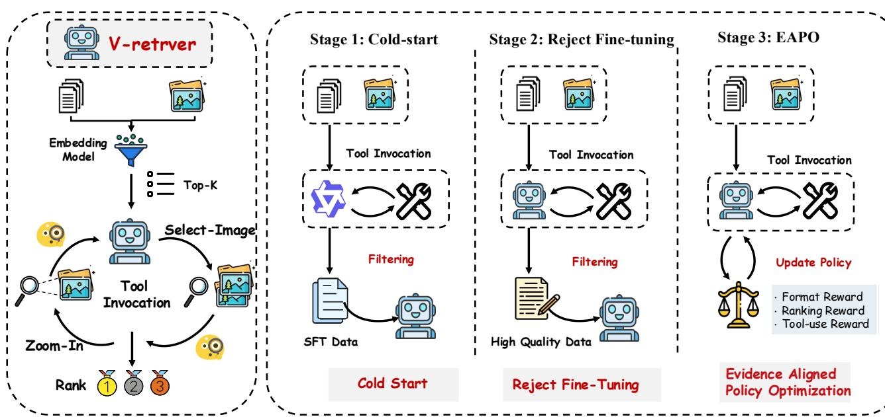  
Rejection sampling Fine-Tuning, and EAPO.

The remainder of this section details the core mechanisms that enable evidence-driven reasoning in V-Retrver, including multimodal interleaved reasoning, visual tools, and a curriculum-based training strategy.

# 3.3. Multimodal Interleaved Evidence Reasoning

We introduce Multimodal Interleaved Evidence Reasoning (MIER), a reasoning paradigm that tightly interleaves textual hypothesis generation with targeted visual evidence acquisition. Unlike language-only Chain-of-Thought reasoning, MIER allows intermediate reasoning steps to be explicitly grounded in visual observations obtained on demand. Formally, given an initial textual query $T _ { 0 }$ and a candidate image set $I _ { 0 }$ , the reasoning agent iteratively produces outputs:

$$
O _ { k } = f _ { \mathrm { M L L M } } \big ( \{ T _ { i } , C _ { i } , V _ { i } \} _ { i = 0 } ^ { k } \big ) ,
$$

where $T _ { i }$ denotes a textual reasoning step, $C _ { i }$ denotes a tool invocation request, and $V _ { i }$ represents the visual evidence returned by the tool. A parser then determines whether to extract the next reasoning step and tool request $( T _ { k + 1 } , C _ { k + 1 } )$ , or to terminate the process and output a final ranking. If a tool is invoked, the corresponding visual tool is executed and returns new visual evidence $V _ { k + 1 }$ , which is appended to the reasoning context. This process yields a multimodal reasoning trajectory:

$$
\tau = \{ T _ { 1 } , C _ { 1 } , V _ { 1 } , T _ { 2 } , C _ { 2 } , V _ { 2 } , . . . , T _ { n } , A _ { n } \} ,
$$

where $A _ { n }$ denotes the final ranked list of candidates. By explicitly grounding intermediate reasoning steps in dynam- ically acquired visual evidence, MIER mitigates speculative inference and hallucination, enabling more reliable ranking decisions in visually ambiguous cases.

# 3.4. Visual Tools

To support MIER, we equip the reasoning agent with a set of Visual Tools, which serve as external perceptual interfaces for selective visual inspection. These tools allow the model to control what to observe and where to focus during reasoning. Specifically, we implement two tools: (1) SELECT-IMAGE, which enables the agent to select a subset of candidate images for closer inspection when multiple candidates exhibit high semantic similarity. (2) ZOOM-IN, which performs localized zoom-in operations on specified regions of an image, allowing fine-grained analysis of discriminative visual attributes such as objects, textures, or spatial configurations. These tools facilitate selective perception during retrieval. Rather than encoding all visual information upfront, the agent dynamically expands its visual receptive field only when necessary, closely mirroring human retrieval behavior in which ambiguous candidates are resolved by "looking again" at critical details.

# 3.5. Training V-Retrver via Curriculum-Based Agentic Learning

Training V-Retrver requires transforming a general-purpose MLLM into an agent capable of stable, evidence-driven reasoning and strategic tool usage. To this end, we design a three-stage curriculum that progressively builds reasoning structure, reliability, and decision-making optimality. Stage I: Reasoning Activation via Supervised Fine-Tuning. We begin with a cold-start supervised fine-tuning stage to activate basic reasoning and tool-use behaviors. Since existing retrieval datasets lack annotated reasoning trajectories, we synthesize multimodal Chain-of-Thought data using Qwen2.5-VL-72B-Instruct. These trajectories include structured reasoning steps and valid tool invocation patterns. After applying rule-based filtering to remove logically inconsistent or malformed samples, the base model is fine-tuned using standard SFT loss. This stage establishes foundational reasoning syntax and tool awareness, but does not yet guarantee robustness or optimal tool-use strategies. Stage II: Rejection Fine-Tuning for Reasoning Reliability. Although Stage I activates tool-use behavior, the resulting policy exhibits high variance and produces a large fraction of low-quality trajectories. To improve reasoning reliability, we perform Rejection Sampling Fine-Tuning (RSFT). For each training instance, we sample multiple reasoning trajectories and retain only those that strictly satisfy formatting constraints and yield correct retrieval rankings. Fine-tuning on this filtered dataset significantly improves logical consistency and format compliance, providing a stable initialization for reinforcement learning. Stage III: Evidence-Aligned Policy Optimization. While the previous stages activate structured reasoning and improve trajectory reliability, they do not explicitly optimize how visual evidence should be acquired during retrieval. In practice, the model may either underutilize visual inspection or invoke tools redundantly without contributing to better ranking decisions. To address this limitation, we introduce Evidence-Aligned Policy Optimization (EAPO), a reinforcement learning objective that explicitly aligns retrieval performance with effective and economical visual verification behavior. EAPO formulates multimodal retrieval as a trajectory-level decision-making problem, where each reasoning trajectory $o _ { i }$ is evaluated based on both ranking quality and evidence utilization. Specifically, we define a composite reward:

$$
R _ { i } = \alpha r _ { \mathrm { f o r m a t } } ( o _ { i } ) + \beta r _ { \mathrm { r a n k } } ( o _ { i } ) + r _ { \mathrm { t o o l } } ( o _ { i } ) ,
$$

where the three components respectively encourage structural correctness, accurate ranking, and informative visual inspection. Below, we detail each reward term. Format Compliance Reward. The format compliance reward $r _ { \mathrm { f o r m a t } }$ ensures that the model adheres to the required reasoning and output protocols, which is essential for stable policy optimization with structured multimodal outputs. Let $\Omega _ { \mathrm { t a g } }$ denote the set of trajectories whose outputs are correctly enclosed by predefined <think $>$ and <answer $>$ tags, and let $\Omega _ { \mathrm { l i s t } }$ denote the set of trajectories whose final answers strictly follow the required integer ranking list format. We define:

$$
r _ { \mathrm { f o r m a t } } ( o _ { i } ) = \frac { 1 } { 2 } \mathbb { I } _ { \{ o _ { i } \in \Omega _ { \mathrm { t a g } } \} } + \frac { 1 } { 2 } \mathbb { I } _ { \{ o _ { i } \in \Omega _ { \mathrm { l i s t } } \} } ,
$$

where $\mathbb { I } _ { \{ \cdot \} }$ is the indicator function. This term primarily serves as a stabilizing signal, preventing malformed trajectories from dominating policy updates. Soft Ranking Reward. To mitigate the sparsity of binary correctness signals in retrieval tasks, we introduce a soft ranking reward $r _ { \mathrm { r a n k } }$ that provides dense feedback based on the relative position of the correct candidate. Let $k$ denote the 1-indexed rank of the ground-truth candidate in the predicted list of trajectory $o _ { i }$ . If the correct candidate does not appear within the top- $K _ { r }$ positions or the output is invalid, the reward is set to zero. Otherwise, it is defined as:

$$
r _ { \mathrm { r a n k } } ( o _ { i } ) = \exp \left( - \frac { ( k - 1 ) ^ { 2 } } { 2 \sigma ^ { 2 } } \right) ,
$$

where $\sigma$ controls the sensitivity to ranking errors. This formulation encourages the agent to continuously improve ranking quality rather than optimizing a sparse top-1 signal. Tool-Use Reward. The tool-use reward $r _ { \mathrm { t o o l } }$ directly governs the agent's evidence acquisition behavior, encouraging visual inspection only when it contributes to correct decisions while discouraging redundant or excessive tool usage. Let $N _ { \mathrm { t o o l } }$ denote the number of valid visual tool invocations in trajectory $o _ { i }$ , and let $k$ be the rank position of the correct candidate. We define:

$$
\begin{array} { r l } & { r _ { \mathrm { t o o l } } ( o _ { i } ) = \eta \cdot \mathbb { I } _ { \{ k = 1 \} } \cdot \mathbb { I } _ { \{ N _ { \mathrm { t o o l } } > 0 \} } } \\ & { ~ - ~ \rho \cdot \operatorname* { m a x } ( 0 , N _ { \mathrm { t o o l } } - \tau ) , } \end{array}
$$

where $\eta$ incentivizes successful evidence-based verification, $\rho$ penalizes excessive tool invocations, and $\tau$ specifies a tolerance threshold. This design explicitly encodes the principle that effective tool usage, rather than frequent usage, should be rewarded. Policy Optimization. We instantiate EAPO using Group Relative Policy Optimization (GRPO) (Guo et al., 2025). Given a group of $G$ trajectories sampled for the same query, we compute normalized advantages:

$$
A _ { i } = { \frac { R _ { i } - \operatorname* { m e a n } ( R ) } { \operatorname* { s t d } ( R ) } } .
$$

The final optimization objective is:

$$
\mathcal { I } _ { \mathrm { E A P O } } ( \theta ) = \mathbb { E } \Bigg [ \frac { 1 } { G } \sum _ { i = 1 } ^ { G } \frac { \pi _ { \theta } ( o _ { i } | q ) } { \pi _ { \theta _ { \mathrm { o l d } } } ( o _ { i } | q ) } A _ { i } - \lambda \mathrm { K L } ( \pi _ { \theta } \| \pi _ { \mathrm { r e f } } ) \Bigg ] .
$$

Through EAPO, the model learns not only what to rank, but also how and when to acquire visual evidence in order to support reliable and efficient retrieval decisions.

# 4. Experiments

# 4.1. Experimental Setup

Table 1. Summary of the evaluation benchmarks. The benchmarks are categorized into Supervised and Zero-shot settings. # Queries represents the number of test queries, and # Candidates denotes the number of test candidates per query.   

<table><tr><td>Benchmark</td><td># Queries</td><td># Candidates</td></tr><tr><td>Supervised</td><td></td><td></td></tr><tr><td>M-BEIR (Wei et al., 2024a)</td><td>190K</td><td>5.6M</td></tr><tr><td>Zero-shot</td><td></td><td></td></tr><tr><td>CIRCO (Baldrati et al., 2023)</td><td>800</td><td>120K</td></tr><tr><td>GeneCIS (Vaze et al., 2023)</td><td>8K</td><td>10 ∼ 15</td></tr><tr><td>Visual Storytelling (Huang et al., 2016)</td><td>5K</td><td>8K</td></tr><tr><td>Visual Dialog (Das et al., 2017)</td><td>2K</td><td>2K</td></tr><tr><td>Multi-round FashionIQ (Yuan &amp; Lam, 2021)</td><td>2.4K</td><td>6.2K</td></tr></table>

Datasets and Metrics. We utilize the M-BEIR (Wei et al., 2024a) dataset for training. The M-BEIR dataset encompasses eight distinct retrieval tasks across 10 different retrieval datasets, comprising a total of 1.1M training samples. As shown in Table 1, to evaluate the versatility of V-Retrver, across various retrieval tasks, we conduct assessments on the M-BEIR test set. Furthermore, we investigate V-Retrver's generalization ability on other previously unseen datasets, including CIRCO (Baldrati et al., 2023),GeneCIS (Vaze et al., 2023), Visual Storytelling (Huang et al., 2016), Visual Dialog (Das et al., 2017), among others. We adhere to the standard evaluation metrics established for each dataset.We primarily utilize Recall $@ \mathrm { K }$ as the evaluation metric for the retrieval tasks. Additionally, for specific datasets like CIRCO, we report $\mathbf { M A P @ 5 }$ to provide a more nuanced evaluation of ranking quality.

Experiment Settings & Baselines. We establish three distinct experiment settings: (i) To validate the versatility of our method across a range of retrieval tasks, we train V-Retrver on all 8 tasks in the M-BEIR benchmark and evaluate its performance on the test sets. For the baselines, we compare our model against: (1) foundational VLMs (e.g., Qwen2.5- VL, CLIP, BLIP); (2) fine-tuned universal retrievers such as UniIR $. { \mathrm { B L I P } } _ { \mathrm { F F } }$ and UniIR $. { \mathrm { C L I P } } _ { \mathrm { S F } }$ ; and (3) recent reasoningenhanced models and universal retriever, including Vision-R1 (Huang et al., 2025), VLM-R1 (Shen et al., 2025), MM-Embed (Lin et al., 2024a), LamRA (Liu et al., 2025) and U-MARVEL (Li et al., 2025a) to demonstrate the advantages of our visual CoT framework. (ii) To evaluate the generalization ability on previously unseen retrieval datasets, we perform zero-shot experiments on 5 datasets not encountered during training. In this case, the baseline includes a selection of universal retrievers, such as E5-V, MagicLens, and MM-Embed. (iii) To investigate the generalization capacity on unseen retrieval tasks, we intentionally exclude data from three retrieval tasks: image-to-image retrieval, text-image-to-text retrieval, and text-image-to-text-image retrieval. Training is then conducted on the remaining five tasks with the evaluation of these excluded tasks. Sliding Window Reranking. Following the coarse-to-fine paradigm, V-Retrver employs a sliding window strategy to rerank the initial retrieval results. Specifically, we first retrieve the top $K$ candidates using the MLLM-based embedding model $\phi$ as described in Sec. 3.1. Inspired by the iterative reranking approach in (Zhang et al., 2025a), we set the window size to $K = 2 0$ with a stride of 10 to efficiently identify the most relevant items. This results in four MLLM reasoning calls per query to progressively refine the results into a finalized rank. This sliding window approach allows our model to perform fine-grained multimodal reasoning over a large candidate pool while maintaining manageable computational overhead.

Implementation Details. Our model is initialized based on Qwen2.5-VL-7B-Instruct (Bai et al., 2025). For the SFT and Rejection Fine-Tuning stages, we utilize the LLaMA-Factory (Zheng et al., 2024) framework and conduct training on 8 A800 GPUs with a batch size of 64 and a learning rate of $1 \times 1 0 ^ { - 5 }$ for two epochs. The RL training is based on the verl-tool (Jiang et al., 2025) framework, which extends the functionalities of verl (Sheng et al., 2024) and vLLM (Kwon et al., 2023) to provide specialized support for multimodal tool-augmented multi-turn training and evaluation. For the RL stage, the model is trained for 1 epoch with a learning rate of $1 \times 1 0 ^ { - 6 }$ , using 8 rollouts per query. Throughout all training stages, the vision encoder remains frozen, while the language model is fine-tuned. The number of candidates $K$ input to the MLLM $\theta$ is set to 20. During the M-BEIR evaluation, experiments are conducted in the local pool, with V-Retrver reranking the top-50 results. For experiments on unseen datasets, reranking is applied to the top-10 results. The soft ranking sensitivity $\sigma$ is set to 1.0, and the ranking reward threshold $K _ { r }$ is set to 5. The reward weighting factors $\alpha$ and $\beta$ are fixed at 0.2 and 0.8, respectively. Regarding the tool-use mechanism, the hyperparameters in Eq. (4) are configured as $\eta = 0 . 2$ , $\rho = 0 . 1$ , and $\tau = 1$ Additionally, we use a KL penalty coefficient $\lambda = 0$ in the EAPO objective.

# 4.2. Main Results

Performance on M-BEIR. As presented in Table 2, V-Retrver-7B establishes a new state-of-the-art across the M-BEIR benchmark with an average Recall of $6 9 . 7 \%$ .This represents a significant improvement of $+ 4 . 9 \%$ over the strongest baseline U-MARVEL-7B $( 6 4 . 8 \% )$ . The advantages of our method are particularly evident in scenarios requiring fine-grained visual detail, such as $( q ^ { i } , q ^ { t } ) \to c ^ { i }$ on FIQ and CIRR. In contrast, V-Retrver achieves $5 1 . 2 \%$ on FIQ and $7 3 . 5 \%$ on CIRR. These scores substantially outperform e U-MARVEL-7B, which achieves $3 8 . 2 \%$ and $6 3 . 2 \%$ respectively. These results confirm that the multimodal interleaved chain-of-thought reasoning method can effectively improve the model's information retrieval capabilities.

Table 2. Comparison with other methods on M-BEIR test set. $\operatorname { R @ K }$ refers to the Recall $@ \mathrm { K }$ metric. $q ^ { t } , q ^ { i }$ $c ^ { t }$ and $c ^ { i }$ denote the text Fashion200K, InfoS for InfoSeek, and FIQ for FashionIQ. The best results are highlighted in bold.   

<table><tr><td rowspan="3">Models</td><td colspan="3">qt → ci</td><td colspan="2">qt → ct</td><td colspan="2">qt → (ci, ct)</td><td colspan="2">qi → ct</td><td>qi → ci</td><td colspan="2">(qi, qt) → ct</td><td>(qi, qt) → ci</td><td colspan="2">(qi, qt) → (ci, ct)</td><td></td><td rowspan="3">Avg.</td></tr><tr><td>VN</td><td>COCO F200K WebQA EDIS WebQA VN</td><td></td><td></td><td></td><td></td><td></td><td></td><td>COCO F200K NIGHTS OVEN InfoS</td><td></td><td></td><td></td><td>FIQ</td><td></td><td>CIRR OVEN</td><td>InfoS</td></tr><tr><td>R@5</td><td>R@5</td><td>R@10</td><td>R@5</td><td>R@5</td><td>R@5</td><td>R@5</td><td>R@5</td><td>R@10</td><td>R@5</td><td>R@5</td><td>R@5</td><td></td><td>R@10 R@5</td><td>R@5</td><td>R@5</td><td></td></tr><tr><td>CLIP-L (Radford et al., 2021)</td><td>43.3</td><td>61.1</td><td>6.6</td><td>36.2</td><td>43.3</td><td>45.1</td><td>41.3</td><td>79.0</td><td>7.7</td><td>26.1</td><td>24.2</td><td>20.5</td><td>7.0</td><td>13.2</td><td>38.8</td><td>26.4</td><td>32.5</td></tr><tr><td>SigLIP (Zhai et al., 2023)</td><td>30.1</td><td>75.7</td><td>36.5</td><td>39.8</td><td>27.0</td><td>43.5</td><td>30.8</td><td>88.2</td><td>34.2</td><td>28.9</td><td>29.7</td><td>25.1</td><td>14.4</td><td>22.7</td><td>41.7</td><td>27.4</td><td>37.2</td></tr><tr><td>BLIP (Li et al., 2022)</td><td>16.4</td><td>74.4</td><td>15.9</td><td>44.9</td><td>26.8</td><td>20.3</td><td>17.2</td><td>83.2</td><td>19.9</td><td>27.4</td><td>16.1</td><td>10.2</td><td>2.3</td><td>10.6</td><td>27.4</td><td>16.6</td><td>26.8</td></tr><tr><td>BLIP2 (Li et al., 2023b)</td><td>16.7</td><td>63.8</td><td>14.0</td><td>38.6</td><td>26.9</td><td>24.5</td><td>15.0</td><td>80.0</td><td>14.2</td><td>25.4</td><td>12.2</td><td>5.5</td><td>4.4</td><td>11.8</td><td>27.3</td><td>15.8</td><td>24.8</td></tr><tr><td>UnilR-BLIPF (Wei et al., 2024b)</td><td>23.4</td><td>79.7</td><td>26.1</td><td>80.0</td><td>50.9</td><td>79.8</td><td>22.8</td><td>89.9</td><td>28.9</td><td>33.0</td><td>41.0</td><td>22.4</td><td>29.2</td><td>52.2</td><td>55.8</td><td>33.0</td><td>46.8</td></tr><tr><td>UnilR-CLIPsF (Wei et al., 202</td><td>42.6</td><td>81.1</td><td>18.0</td><td>84.7</td><td>59.4</td><td>78.7</td><td>43.1</td><td>92.3</td><td>18.3</td><td>32.0</td><td>45.5</td><td>27.9</td><td>24.4</td><td>44.6</td><td>67.6</td><td>48.9</td><td>50.6</td></tr><tr><td>Qwen2.5-VL-3B (Bai et al., 2025)</td><td>36.0</td><td>67.8</td><td>16.1</td><td>69.5</td><td>45.2</td><td>61.7</td><td>23.3</td><td>82.3</td><td>12.0</td><td>20.9</td><td>36.7</td><td>22.3</td><td>24.3</td><td>53.5</td><td>56.4</td><td>49.8</td><td>42.4</td></tr><tr><td>Qwen2.5-VL-7B (Bai et al., 2025)</td><td>40.2</td><td>71.9</td><td>20.3</td><td>71.9</td><td>49.4</td><td>64.5</td><td>29.3</td><td>84.6</td><td>19.4</td><td>25.5</td><td>42.4</td><td>32.1</td><td>25.0</td><td>55.1</td><td>60.8</td><td>54.9</td><td>46.7</td></tr><tr><td>Vision-R1-7B (Huang et al., 20251.9</td><td></td><td>75.0</td><td>22.0</td><td>70.6</td><td>51.3</td><td>69.1</td><td>35.4</td><td>85.1</td><td>22.4</td><td>25.9</td><td>48.8</td><td>44.0</td><td>29.2</td><td>57.7</td><td>66.2</td><td>59.0</td><td>50.2</td></tr><tr><td>VLM-R1-7B (Shen et al., 2025)</td><td>40.5</td><td>77.2</td><td>22.5</td><td>72.3</td><td>50.0</td><td>67.9</td><td>36.2</td><td>86.3</td><td>20.9</td><td>26.4</td><td>48.8</td><td>37.5</td><td>29.9</td><td>57.4</td><td>64.0</td><td>62.3</td><td>50.0</td></tr><tr><td>MM-Embed-7B (Lin et al., 2024a)41.0</td><td></td><td>71.3</td><td>17.1</td><td>95.9</td><td>68.8</td><td>85.0</td><td>41.3</td><td>90.1</td><td>18.4</td><td>32.4</td><td>42.1</td><td>42.3</td><td>25.7</td><td>50.0</td><td>64.1</td><td>57.7</td><td>52.7</td></tr><tr><td>LamRA-7B (Liu et al., 2025)</td><td>48.0 49.4</td><td>85.2 85.6</td><td>32.9</td><td>96.7</td><td>75.8</td><td>87.7</td><td>48.6</td><td>92.3</td><td>36.1</td><td>33.5</td><td>59.2</td><td>64.1</td><td>37.8</td><td>63.3</td><td>79.2</td><td>78.3</td><td>63.7</td></tr><tr><td>U-MARVEL-7B (Li et al., 2025a)</td><td></td><td></td><td>34.2</td><td>98.5</td><td>81.4</td><td>89.4</td><td>50.5</td><td>88.4</td><td>37.7</td><td>34.7</td><td>63.7</td><td>62.9</td><td>38.2</td><td>63.2</td><td>80.8</td><td>78.9</td><td>64.8</td></tr><tr><td>V-Retrver-7B</td><td>51.8 87.5</td><td></td><td>40.3</td><td>96.9</td><td>82.9</td><td>90.2</td><td>52.2</td><td>94.8</td><td>37.8</td><td>39.8</td><td>69.8</td><td>73.2 51.2</td><td></td><td>73.5</td><td>87.8</td><td>85.0</td><td>69.7</td></tr></table>

Table 3. Experimental results on unseen datasets. $q ^ { \mathrm { d i a l o g } }$ and $( q ^ { i } \oplus q ^ { t } )$ refer to the dialog queries and multi-interleaved imagetext queries, respectively.   

<table><tr><td rowspan="3">Models</td><td colspan="2">(qi,qt) → ci</td><td colspan="3">qdialog → ci (qi  qt) → ci</td></tr><tr><td>CIRCO</td><td>GeneCIS</td><td>VisD</td><td></td><td>VIST MT-FIQ</td></tr><tr><td>MAP@5</td><td>R@1</td><td>R@1</td><td>R@1</td><td>R@5</td></tr><tr><td>CLIP-L (Radford et al., 2021)</td><td>4.0</td><td>13.3</td><td>23.7</td><td>0.6</td><td>17.7</td></tr><tr><td>UnilR-CLIP (Wei et al., 2024b)</td><td>12.5</td><td>16.8</td><td>26.8</td><td>0.6</td><td>39.4</td></tr><tr><td>E5-V (Jiang et al., 2024)</td><td>24.8</td><td>18.5</td><td>54.6</td><td>10.0</td><td>19.2</td></tr><tr><td>MagicLens-L (Zhang et al., 2024a)</td><td>29.6</td><td>16.3</td><td>28.0</td><td>3.3</td><td>22.6</td></tr><tr><td>MM-Embed-7B (Lin et al., 2024a)</td><td>35.5</td><td>22.9</td><td>64.7</td><td>25.7</td><td>59.0</td></tr><tr><td>LamRA-7B (Liu et al., 2025)</td><td>42.8</td><td>24.8</td><td>70.9</td><td>28.6</td><td>63.9</td></tr><tr><td>V-Retrver-7B</td><td>48.2</td><td>30.7</td><td>75.1</td><td>31.2</td><td>68.3</td></tr></table>

Generalization to Unseen Datasets. The zero-shot evaluation results in Table 3 underscore the robustness of our reasoning framework on datasets not encountered during training. V-Retrver consistently outperforms specialized models and generalist MLLMs. Notably, on CIRCO which features distinct domain shifts, V-Retrver achieves a $\mathbf { M A P @ 5 }$ of 48.2. This significantly surpasses the specialized MM-Embed-7B (35.5) and LamRA-7B (42.8). Similarly, on GeneCIS, our model attains an $\mathbf { R } \ @ 1$ of 30.7 compared to 24.8 for LamRA-7B. We attribute this generalization to reinforcement learning. Robustness on Held-out Tasks. To verify task-level adaptability, we evaluate V-Retrver on retrieval tasks where specific modality combinations were strictly excluded during training. As shown in Table 4, even without prior exposure to these formats, the model achieves an average Recall of $6 1 . 1 \%$ , significantly outperforming LamRA-7B $( 5 0 . 9 \% )$ by a margin of $1 0 . 2 \%$ These results empirically demonstrate that the MIER framework effectively decouples the reasoning process from specific input types, empowering the model to leverage interleaved evidence for accurate retrieval even in challenging zero-shot scenarios.

Table 4. Experimental results on held-out tasks. \* indicates that training is performed on the remaining tasks, w/o any exposure to the three held-out tasks.   

<table><tr><td rowspan="3">Models</td><td colspan="5">qi → ci (qi, qt) → ct (qi, qt) → (ci, ct)</td><td rowspan="3">Avg.</td></tr><tr><td></td><td>NIGHTS OVEN InfoS</td><td></td><td>OVEN</td><td>InfoS</td></tr><tr><td>R@5</td><td>R@5</td><td>R@5</td><td>R@5</td><td>R@5</td></tr><tr><td>Supervised</td><td></td><td></td><td></td><td></td><td></td><td></td></tr><tr><td>UnilR-BLIPFF (Wei et al., 2024b)</td><td>33.0</td><td>41.0</td><td>22.4</td><td>55.8</td><td>33.0</td><td>37.0</td></tr><tr><td>UnilR-CLIPsF (Wei et al., 2024b)</td><td>32.0</td><td>45.5</td><td>27.9</td><td>67.6</td><td>48.9</td><td>44.4</td></tr><tr><td>Zero-shot</td><td></td><td></td><td></td><td></td><td></td><td></td></tr><tr><td>Qwen2.5-VL-7B (Bai et al., 2025)</td><td>20.3</td><td>38.5</td><td>40.4</td><td>53.6</td><td>44.9</td><td>39.5</td></tr><tr><td>Vision-R1-7B (Huang et al., 2025)</td><td>22.9</td><td>39.8</td><td>42.9</td><td>57.4</td><td>46.5</td><td>41.9</td></tr><tr><td>LamRA-7B* (Liu et al., 2025)</td><td>29.2</td><td>46.9</td><td>54.2</td><td>65.1</td><td>59.1</td><td>50.9</td></tr><tr><td>V-Retrver-7B*</td><td>36.2</td><td>57.8</td><td>65.9</td><td>75.3</td><td>70.3</td><td>61.1</td></tr></table>

# 4.3. Ablation Study & Analysis

Impact of Training Stages. Table 6 presents the ablation results for each training stage. The row w/o SFT & RSFT & RL refers to directly prompting the untrained backbone for tool use, which results in a performance collapse to $4 5 . 8 \%$ , even lower than the Qwen2.5-VL-7B baseline $( 4 7 . 2 \% )$ , indicating that zero-shot tool invocation without alignment is ineffective. The w/o RSFT & RL setting includes only the SFT stage, which activates basic tool-use ability and raises the average recall to $5 9 . 4 \%$ Removing only RSFT (w/o RSFT) means the model is trained with SFT and RL, skipping the rejection sampling phase, and achieves $6 6 . 3 \%$ The w/o RL configuration applies SFT and RSFT but omits reinforcement learning, resulting in $6 0 . 9 \%$ Finally, the full pipeline reaches the highest performance at $6 7 . 2 \%$ . These results highlight the importance of structured curriculum learning, as each stage addresses specific shortcomings of the previous one.

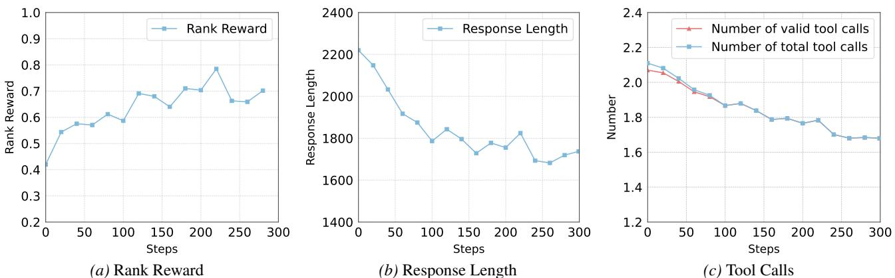  
Figure 3. RL Training curves.   
Table 5. Ablation study on visual tool-use mechanism. We compare the proposed multimodal interleaved CoT (with Visual Tool) against a text-only reasoning baseline (w/o Visual Tool) under the same RL training framework.

Effectiveness of Visual Tool. To isolate the impact of tool-use, we train a variant of Qwen2.5-VL-7B-Instruct using end-to-end RL with text-based CoT reasoning on the same training dataset (RL w/o tool). As shown in Table 5. The text-only variant achieves an average recall of $6 1 . 8 \%$ whereas V-Retrver reaches $6 7 . 2 \%$ . The findings confirm that incorporating vision tools yields supplementary, highfidelity insights that text reasoning alone cannot capture from static representations. Specifically, the ability to actively zoom in or select images allows the model to resolve fine-grained ambiguities that are often lost in compressed visual embeddings, proving indispensable for truly precise multimodal retrieval.

# 4.4. Training Curves

Table 6. Ablation study on training stages and components. We investigate the impact of Cold Start (SFT), Rejection Sampling Fine-Tuning (RSFT), and Reinforcement Learning (RL) using Qwen2.5-VL-7B as the backbone.   

<table><tr><td rowspan="3">Variants</td><td>qt → ci</td><td>qi → ct</td><td>(qi, qt) → ci</td><td>(qi, qt) → ct</td><td rowspan="3">Avg.</td></tr><tr><td>COCO</td><td>F200K</td><td>CIRR</td><td>OVEN</td></tr><tr><td>R@5</td><td>R@10</td><td>R@5</td><td>R@5</td></tr><tr><td rowspan="2">Qwen2.5-VL-7B (Bai et al., 2025) RL w/o tool</td><td>71.9</td><td>19.4</td><td>55.1</td><td>42.4</td><td>47.2</td></tr><tr><td>84.1</td><td>33.2</td><td>66.5</td><td>63.2</td><td>61.8</td></tr><tr><td>V-Retrver-7B</td><td>87.5</td><td>37.8</td><td>73.5</td><td>69.8</td><td>67.2</td></tr></table>

Fig.3 illustrates the evolution of ranking accuracy, reasoning density, and tool-use efficiency throughout the RL training process. As the training progresses, the model's retrieval accuracy exhibits a generally upward trend, indicating that EAPO effectively enhances the model's perception-driven reasoning. Regarding tool-use behavior, we observe that the number of effective tool calls is slightly lower than the total number of invocations in the initial stages. This suggests that while the model acquired basic tool-use capabilities during the SFT and RSFT stages, it still occasionally committed formatting inconsistencies or logical missteps. As training continues, these two curves converge, demonstrating that RL further reinforces tool-use robustness and eliminates erroneous calls. This convergence signifies that the policy optimization process successfully penalizes hallucinated tool actions, steering the agent toward a more rigorous execution of tool protocols. Additionally, the average response length and tool frequency decrease before stabilizing; this indicates the model learns to autonomously judge the necessity of visual evidence, effectively suppressing redundant reasoning and focusing its attention on resolving critical visual ambiguities through more grounded and purposeful multimodal trajectories.

<table><tr><td rowspan="3">Training Stage</td><td>qt → ci</td><td>qi → ct</td><td>(qi, qt) → ci</td><td>(qi,qt) → ct</td><td rowspan="3">Avg.</td></tr><tr><td>COCO</td><td>F200K</td><td>CIRR</td><td>OVEN</td></tr><tr><td>R@5</td><td>R@10</td><td>R@5</td><td>R@5</td></tr><tr><td>Qwen2.5-VL-7B (Bai et al., 2025)</td><td>71.9</td><td>19.4</td><td>55.1</td><td>42.4</td><td>47.2</td></tr><tr><td>w/o SFT &amp; RSFT &amp; RL</td><td>71.5</td><td>18.1</td><td>53.4</td><td>40.2</td><td>45.8</td></tr><tr><td>w/o RSFT &amp; RL</td><td>83.2</td><td>31.6</td><td>63.7</td><td>59.0</td><td>59.4</td></tr><tr><td>w/o RSFT</td><td>87.2</td><td>37.3</td><td>72.4</td><td>68.3</td><td>66.3</td></tr><tr><td>w/o RL</td><td>83.9</td><td>32.8</td><td>65.3</td><td>61.5</td><td>60.9</td></tr><tr><td>V-Retrver-7B</td><td>87.5</td><td>37.8</td><td>73.5</td><td>69.8</td><td>67.2</td></tr></table>

# 5. Conclusion

In this paper, we presented V-Retrver, an evidence-driven MLLM framework tailored for universal multimodal retrieval. V-Retrver adopts multimodal interleaved Chain-of-Thought (CoT) reasoning, enabling the model to dynamically inspect and verify candidate images through visual tool invocation, thereby achieving more fine-grained ranking of candidate result lists. We adopt a three-stage training pipeline to multimodal interleaved CoT reasoning abilities. Extensive experimental results demonstrate that V-Retrver achieves significant improvements in both model effectiveness and task generalization. We regard V-Retrver to be an important step toward effectively introducing agentic MLLMs to enhance downstream multimodal tasks, laying a solid foundation for building general agentic MLLMs with advanced reasoning capabilities.

# Impact Statement

This paper presents work whose goal is to advance the field of machine learning. There are many potential societal consequences of our work, none of which we feel must be specifically highlighted here.

# References

Alayrac, J.-B., Donahue, J., Luc, P., Miech, A., Barr, I., Hasson, Y., Lenc, K., Mensch, A., Millican, K., Reynolds, M., et al. Flamingo: a visual language model for fewshot learning. Advances in neural information processing systems, 35:2371623736, 2022. Asai, A., Schick, T., Lewis, P., Chen, X., Izacard, G., Riedel, S., Hajishirzi, H., and Yih, W.-t. Task-aware retrieval with instructions. In Findings of the Association for Computational Linguistics: ACL 2023, pp. 36503675, 2023. Bai, J., Bai, S., Chu, Y., Cui, Z., Dang, K., Deng, X., Fan, Y., Ge, W., Han, Y., Huang, F., et al. Qwen technical report. arXiv preprint arXiv:2309.16609, 2023. Bai, S., Chen, K., Liu, X., Wang, J., Ge, W., Song, S., Dang, K., Wang, P., Wang, S., Tang, J., et al. Qwen2. 5-vl technical report. arXiv preprint arXiv:2502.13923, 2025. Baldrati, A., Bertini, M., Uricchio, T., and Del Bimbo, A. Effective conditioned and composed image retrieval combining clip-based features. In Proceedings of the IEEE/CVF conference on computer vision and pattern recognition, pp. 2146621474, 2022. Baldrati, A., Agnolucci, L., Bertini, M., and Del Bimbo, A. Zero-shot composed image retrieval with textual inversion. In Proceedings of the International Conference on Computer Vision, 2023. Chen, Y., Hu, H., Luan, Y., Sun, H., Changpinyo, S., Ritter, A., and Chang, M.-W. Can pre-trained vision and language models answer visual information-seeking questions? In Proceedings of the Conference on Empirical Methods in Natural Language Processinng, 2023. Chen, Z., Wang, W., Cao, Y., Liu, Y., Gao, Z., Cui, E., Zhu, J., Ye, S., Tian, H., Liu, Z., et al. Expanding performance boundaries of open-source multimodal models with model, data, and test-time scaling. arXiv preprint arXiv:2412.05271, 2024a. Chen, Z., Wu, J., Wang, W., Su, W., Chen, G., Xing, S., Zhong, M., Zhang, Q., Zhu, X., Lu, L., et al. Internvl: Scaling up vision foundation models and aligning for generic visual-linguistic tasks. In Proceedings of the IEEE/CVF conference on computer vision and pattern recognition, pp. 2418524198, 2024b. Chen, Z., Xu, C., Qi, Y., and Guo, J. Mllm is a strong reranker: Advancing multimodal retrieval-augmented generation via knowledge-enhanced reranking and noiseinjected training. arXiv preprint arXiv:2407.21439, 2024c. Chun, S., Oh, S. J., De Rezende, R. S., Kalantidis, Y., and Larlus, D. Probabilistic embeddings for cross-modal retrieval. In Proceedings of the IEEE/CVF conference on computer vision and pattern recognition, pp. 84158424, 2021. Das, A., Kottur, S., Gupta, K., Singh, A., Yadav, D., Moura, J. M., Parikh, D., and Batra, D. Visual dialog. In Proceedings of the IEEE Conference on Computer Vision and Pattern Recognition, 2017. Fu, Z., Zhang, L., Xia, H., and Mao, Z. Linguistic-aware patch slimming framework for fine-grained cross-modal alignment. In Proceedings of the IEEE/CVF Conference on Computer Vision and Pattern Recognition, pp. 26307 26316, 2024. Gao, Z., Chen, Z., Cui, E., Ren, Y., Wang, W., Zhu, J., Tian, H., Ye, S., He, J., Zhu, X., et al. Mini-internvl: a flexibletransfer pocket multi-modal model with $5 \%$ parameters and $90 \%$ performance. Visual Intelligence, 2(1):117, 2024. Gu, G., Chun, S., Kim, W., Kang, Y., and Yun, S. Languageonly training of zero-shot composed image retrieval. In Proceedings of the IEEE/CVF Conference on Computer Vision and Pattern Recognition, pp. 1322513234, 2024. Gu, T., Yang, K., Feng, Z., Wang, X., Zhang, Y., Long, D., Chen, Y., Cai, W., and Deng, J. Breaking the modality barrier: Universal embedding learning with multimodal llms. In Proceedings of the 33rd ACM International Conference on Multimedia, pp. 28602869, 2025. Guo, D., Yang, D., Zhang, H., Song, J., Zhang, R., Xu, R., Zhu, Q., Ma, S., Wang, P., Bi, X., et al. Deepseek-r1: Incentivizing reasoning capability in llms via reinforcement learning. arXiv preprint arXiv:2501.12948, 2025. Guo, Z., Xu, R., Yao, Y., Cui, J., Ni, Z., Ge, C., Chua, T.-S., Liu, Z., and Huang, G. Llava-uhd: an lmm perceiving any aspect ratio and high-resolution images. In European Conference on Computer Vision, pp. 390406. Springer, 2024. Hu, H., Luan, Y., Chen, Y., Khandelwal, U., Joshi, M., Lee, K., Toutanova, K., and Chang, M.-W. Open-domain visual entity recognition: Towards recognizing millions of wikipedia entities. In Proceedings of the International Conference on Computer Vision, 2023. Huang, T.-H., Ferraro, F., Mostafazadeh, N., Misra, I., Agrawal, A., Devlin, J., Girshick, R., He, X., Kohli, P., Batra, D., et al. Visual storytelling. In Proceedings of the Conference of the North American Chapter of the Association for Computational Linguistics, 2016. Huang, W., Jia, B., Zhai, Z., Cao, S., Ye, Z., Zhao, F., Hu, Y., and Lin, S. Vision-r1: Incentivizing reasoning capability in multimodal large language models. arXiv preprint arXiv:2503.06749, 2025. Ji, D., Zhao, F., Zhu, L., Jin, W., Lu, H., and Ye, J. Discrete latent perspective learning for segmentation and detection. arXiv preprint arXiv:2406.10475, 2024. Jian, W., Zhang, Y., Liang, D., Xie, C., He, Y., Leng, D., and Yin, Y. Rzenembed: Towards comprehensive multimodal retrieval. arXiv preprint arXiv:2510.27350, 2025. Jiang, D., Lu, Y., Li, Z., Lyu, Z., Nie, P., Wang, H., Su, A., Chen, H., Zou, K., Du, C., et al. Verltool: Towards holistic agentic reinforcement learning with tool use. arXiv preprint arXiv:2509.01055, 2025. Jiang, T., Song, M., Zhang, Z., Huang, H., Deng, W., Sun, F., Zhang, Q., Wang, D., and Zhuang, F. E5-v: Universal embeddings with multimodal large language models. arXiv preprint arXiv:2407.12580, 2024. Jin, H., Zhang, Y., Shi, L., Zhang, S., Kou, F., Yang, J., Zhu, C., and Luo, J. An end-to-end graph attention network hashing for cross-modal retrieval. Advances in Neural Information Processing Systems, 37:21062126, 2024. Kim, D., Kim, N., and Kwak, S. Improving cross-modal retrieval with set of diverse embeddings. In Proceedings of the IEEE/CVF conference on computer vision and pattern recognition, pp. 2342223431, 2023a. Kim, J. M., Koepke, A., Schmid, C., and Akata, Z. Exposing and mitigating spurious correlations for cross-modal retrieval. In Proceedings of the IEEE/CVF conference on computer vision and pattern recognition, pp. 25852595, 2023b. Kwon, W., Li, Z., Zhuang, S., Sheng, Y., Zheng, L., Yu, C. H., Gonzalez, J. E., Zhang, H., and Stoica, I. Efficient memory management for large language model serving with pagedattention. In Proceedings of the ACM SIGOPS Symposium on Operating Systems Principles, 2023. Lan, Z., Niu, L., Meng, F., Zhou, J., and Su, J. Llave: Large language and vision embedding models with hardness-weighted contrastive learning. arXiv preprint arXiv:2503.04812, 2025. Li, C., Wong, C., Zhang, S., Usuyama, N.., Liu, H., Yang, J. Naumann, T., Poon, H., and Gao, J. Llava-med: Training a large language-and-vision assistant for biomedicine in one day. Advances in Neural Information Processing Systems, 36:2854128564, 2023a. Li, J., Li, D., Xiong, C., and Hoi, S. Blip: Bootstrapping language-image pre-training for unified vision-language understanding and generation. In Proceedings of the International Conference on Machine Learning, 2022. Li J Li . Se, S. and Hoi S.Bli- Bt language-image pre-training with frozen image encoders and large language models. In Proceedings of the International Conference on Machine Learning, 2023b. Li, X., Li, C., Chen, S.-Z., and Chen, X. U-marvel: Unveiling key factors for universal multimodal retrieval via embedding learning with mllms. arXiv preprint arXiv:2507.14902, 2025a. Li, Y., Jiang, S., Hu, B., Wang, L., Zhong, W., Luo, W., Ma, L., and Zhang, M. Uni-moe: Scaling unified multimodal llms with mixture of experts. IEEE Transactions on Pattern Analysis and Machine Intelligence, 2025b. Lin, B., Ye, Y., Zhu, B., Cui, J., Ning, M., Jin, P., and Yuan, L. Video-llava: Learning united visual representation by alignment before projection. arXiv preprint arXiv:2311.10122, 2023a. Lin, S.-C., Lee, C., Shoeybi, M., Lin, J., Catanzaro, B., and Ping, W. Mm-embed: Universal multimodal retrieval with multimodal llms. arXiv preprint arXiv:2411.02571, 2024a. Lin, W., Chen, J., Mei, J., Coca, A., and Byrne, B. Finegrained late-interaction multi-modal retrieval for retrieval augmented visual question answering. In Advances in Neural Information Processing Systems, 2023b. Lin, W., Mei, J., Chen, J., and Byrne, B. PreFLMR: Scaling up fine-grained late-interaction multi-modal retrievers. In Association for Computational Linguistics, 2024b. Liu, S., Cheng, H., Liu, H., Zhang, H., Li, F., Ren, T., Zou, X., Yang, J., Su, H. Zhu, J., et al. Llava-plus: Learning to use tools for creating multimodal agents. In European Conference on Computer Vision, pp. 126142. Springer, 2024. Liu, Y., Chen, P., Cai, J., Jiang, X., Hu, Y., Yao, J., Wang, Y., and Xie, W. Lamra: Large multimodal model as your advanced retrieval assistant. In Proceedings of the IEEE/CVF Conference on Computer Vision and Pattern Recognition, 2025. Liu, Z., Xiong, C., Lv, Y., Liu, Z., and Yu, G. Universal vision-language dense retrieval: Learning a unified representation space for multi-modal retrieval. In The Eleventh International Conference on Learning Representations, 2023. Lu, D., Sun, Y., Zhang, Z., Huang, L., Zeng, J., Shu, M., and Cao, H. Internvl-x: Advancing and accelerating internvl series with efficient visual token compression. arXiv preprint arXiv:2503.21307, 2025. Marino, K., Rastegari, M., Farhadi, A., and Mottaghi, R. Ok-vqa: A visual question answering benchmark requiring external knowledge. In Proceedings of the IEEE Conference on Computer Vision and Pattern Recognition, 2019. Mensink, T., Uijlings, J., Castrejon, L., Goel, A., Cadar, F., Zhou, H., Sha, F., Araujo, A., and Ferrari, V. Encyclopedic vqa: Visual questions about detailed properties of fine-grained categories. In Proceedings of the International Conference on Computer Vision, 2023. Muennighoff, N., Yang, Z., Shi, W., Li, X. L., Fei-Fei, L., Hajishirzi, H., Zettlemoyer, L., Liang, P., Candès, E., and Hashimoto, T. s1: Simple test-time scaling. arXiv preprint arXiv:2501.19393, 2025. Narayan, K., Xu, Y., Cao, T., Nerella, K., Patel, V. M., Shiee, N., Grasch, P., Jia, C., Yang, Y., and Gan, Z. Deepmmsearch-r1: Empowering multimodal llms in multimodal web search. arXiv preprint arXiv:2510.12801, 2025. Pei, R., Liu, J., Li, W., Shao, B., Xu, S., Dai, P., Lu, J., and Yan, Y. Clipping: Distilling clip-based models with a student base for video-language retrieval. In Proceedings of the IEEE/CVF Conference on Computer Vision and Pattern Recognition, pp. 1898318992, 2023. Pham, K., Huynh, C., Lim, S.-N., and Shrivastava, A. Composing object relations and attributes for image-text matching. In Proceedings of the IEEE/CVF Conference on Computer Vision and Pattern Recognition, pp. 14354 14363, 2024. Radford, A., Kim, J. W., Hallacy, C., Ramesh, A., Goh, G., Agarwal, S., Sastry, G., Askell, A., Mishkin, P., Clark, J., et al. Learning transferable visual models from natural language supervision. In Proceedings of the International Conference on Machine Learning, 2021. Sain, A., Bhunia, A. K., Chowdhury, P. N., Koley, S., Xiang, T., and Song, Y.-Z. Clip for all things zero-shot sketchbased image retrieval, fine-grained or not. In Proceedings of the IEEE/CVF conference on computer vision and pattern recognition, pp. 27652775, 2023. Saito, K., Sohn, K., Zhang, X., Li, C.-L., Lee, C.-Y., Saenko, K., and Pfister, T. Pic2word: Mapping pictures to words for zero-shot composed image retrieval. In Proceedings of the IEEE/CVF Conference on Computer Vision and Pattern Recognition, pp. 1930519314, 2023. Shen, H., Liu, P., Li, J., Fang, C., Ma, Y., Liao, J., Shen, Q. Zhang, Z., Zhao, K., Zhang, Q., et al. Vlm-r1: A stable and generalizable r1-style large vision-language model. arXiv preprint arXiv:2504.07615, 2025. Shen, L., Chen, G., Shao, R., Guan, W., and Nie, L. Mome: Mixture of multimodal experts for generalist multimodal large language models. arXiv preprint arXiv:2407.12709, 2024. Sheng, G., Zhang, C., Ye, Z., Wu, X., Zhang, W., Zhang, R., Peng, Y., Lin, H., and Wu, C. Hybridflow: A flexible and efficient rlhf framework. arXiv preprint arXiv: 2409.19256, 2024. Shu, F., Liao, Y., Zhuo, L., Xu, C., Zhang, L., Zhang, G., Shi, H., Chen, L., Zhong, T., He, W., et al. Llava-mod: Making llava tiny via moe knowledge distillation. arXiv preprint arXiv:2408.15881, 2024. Sun, N., Tang, J., Sun, L., Chen, R., Lu, Y., Chu, X., and Ling, H. Reflection from retrieval: Mllm-guided iterative reasoning for zero-shot composed image retrieval. Suo, Y., Ma, F., Zhu, L., and Yang, Y. Knowledge-enhanced dual-stream zero-shot composed image retrieval. In Proceedings of the IEEE/CVF Conference on Computer Vision and Pattern Recognition, pp. 2695126962, 2024. Vaze, S., Carion, N., and Misra, I. Genecis: A benchmark for general conditional image similarity. In Proceedings of the IEEE Conference on Computer Vision and Pattern Recognition, 2023.

Wang, C., Feng, K., Chen, D., Wang, Z., Li, Z., Gao, S., Meng, M., Zhou, X., Zhang, M., Shang, Y., et al. Adatooler-v: Adaptive tool-use for images and videos. arXiv preprint arXiv:2512.16918, 2025a. Wang, C., He, Y., Zhou, Y., Wang, Y., Liu, J., Xia, P., Tu, Z., Bansal, M., and Yao, H. Knowing the answer isn't enough: Fixing reasoning path failures in lvlms. arXiv preprint arXiv:2512.06258, 2025b. Wang, C., Zhang, Z., Meng, M., Zhou, X., and Jiang, H. Vision-ekipl: External knowledge-infused policy learning for visual reasoning. arXiv preprint arXiv:2506.06856, 2025c. Wang, C., Zhang, Z., Teng, L., Li, Z., and Kan, S. Tmcir: Token merge benefits composed image retrieval. arXiv preprint arXiv:2504.10995, 2025d. Wang, P., Bai, S., Tan, S., Wang, S., Fan, Z., Bai, J., Chen, K., Liu, X., Wang, J., Ge, W., et al. Qwen2-vl: Enhancing vision-language model's perception of the world at any resolution. arXiv preprint arXiv:2409.12191, 2024a. Wang, Y., Wang, L., Zhou, Q., Wang, Z., Li, H., Hua, G., and Tang, W. Multimodal llm enhanced cross-lingual cross-modal retrieval. In Proceedings of the 32nd ACM International Conference on Multimedia, pp. 82968305, 2024b. Wei, C., Chen, Y., Chen, H., Hu, H., Zhang, G., Fu, J., Riter, A., and Chen, W. Uniir: Training and benchmarking universal multimodal information retrievers. In Proceedings of the European Conference on Computer Vision, 2024a. Wu, H., Gao, Y., Guo, X., Al-Halah, Z., Rennie, S., Grauman, K., and Feris, R. Fashion iq: A new dataset towards retrieving images by natural language feedback. In Proceedings of the IEEE Conference on Computer Vision and Pattern Recognition, 2021. Xie, J., Mao, W., Bai, Z., Zhang, D. J., Wang, W., Lin, K. Q., Gu, Y., Chen, Z., Yang, Z., and Shou, M. Z. Show-o: One single transformer to unify multimodal understanding and generation. arXiv preprint arXiv:2408.12528, 2024. Xu, C., Wang, X., Liao, Z., Li, Y., Hou, T., and Deng, Z. Show-o turbo: Towards accelerated unified multimodal understanding and generation. arXiv preprint arXiv:2502.05415, 2025a. Xu, M., Dong, J., Hou, J., Wang, Z., Li, S., Gao, Z., Zhong, R., and Cai, H. MM-R5: Multimodal reasoning-enhanced reranker via reinforcement learning for document retrieval. arXiv preprint arXiv:2506.12364, 2025b. Xu, M., Dong, J., Hou, J., Wang, Z., Li, S., Gao, Z., Zhong, R., and Cai, H. Mm-r5: Multimodal reasoning-enhanced reranker via reinforcement learning for document retrieval. arXiv preprint arXiv:2506.12364, 2025c. Yang, A., Yang, B., Zhang, B., Hui, B., Zheng, B., Yu, B., Li, C., Liu, D., Huang, F., Wei, H., et al. Qwen2. 5 technical report. arXiv preprint arXiv:2412.15115, 2024. Yang, Z., Li, L., Lin, K., Wang, J., Lin, C.-C., Liu, Z., and Wang, L. The dawn of lmms: Preliminary explorations with gpt-4v (ision). arXiv preprint arXiv:2309.17421, 9 (1):1, 2023. Ye, J., Xu, H., Liu, H., Hu, A., Yan, M., Qian, Q., Zhang, J., Huang, F., and Zhou, J. mplug-owl3: Towards long image-sequence understanding in multi-modal large language models. arXiv preprint arXiv:2408.04840, 2024a. Ye, Q., Xu, H., Xu, G., Ye, J., Yan, M., Zhou, Y., Wang, J. Hu, A., Shi, P., Shi, Y., et al. mplug-owl: Modularization empowers large language models with multimodality. arXiv preprint arXiv:2304.14178, 2023. Ye, Q., Xu, H., Ye, J., Yan, M., Hu, A., Liu, H., Qian, Q., Zhang, J., and Huang, F. mplug-owl2: Revolutionizing multi-modal large language model with modality collaboration. In Proceedings of the ieee/cvf conference on computer vision and pattern recognition, pp. 13040 13051, 2024b. Yuan, Y. and Lam, W. Conversational fashion image retrieval via multiturn natural language feedback. In Proceedings of the International ACM SIGIR Conference on Research and Development in Information Retrieval, 2021. Zhai, X., Mustafa, B., Kolesnikov, A., and Beyer, L. Sigmoid loss for language image pre-training. In Proceedings of the International Conference on Computer Vision, 2023. Zhang, K., Luan, Y., Hu, H., Lee, K., Qiao, S., Chen, W., Su, Y., and Chang, M.-W. Magiclens: self-supervised image retrieval with open-ended instructions. In Proceedings of the 41st International Conference on Machine Learning, pp. 5940359420, 2024a. Zhang, L., Wang, B., Qiu, X., Reddy, S., and Agrawal, A. REARANK: Reasoning re-ranking agent via reinforcement learning. In Proceedings of the 2025 Conference on Empirical Methods in Natural Language Processing, pp. 24582471, 2025a. Zhang, Q., Lei, Z., Zhang, Z., and Li, S. Z. Context-aware attention network for image-text retrieval. In Proceedings of the IEEE/CVF conference on computer vision and pattern recognition, pp. 35363545, 2020. Zhang, Q., Lyu, F., Sun, Z., Wang, L., Zhang, W., Guo, Z., Wang, Y., King, I., Liu, X., and Ma, C. What, how, where, and how well? a survey on test-time scaling in large language models. arXiv preprint arXiv:2503.24235, 2025b. Zhang, S., Fang, Q., Yang, Z., and Feng, Y. Llava-mini: Efficient image and video large multimodal models with one vision token. arXiv preprint arXiv:2501.03895, 2025c. Zhang, X., Zhang, Y., Xie, W., Li, M., Dai, Z., Long, D., Xie, P., Zhang, M., Li, W., and Zhang, M. Gme: Improving universal multimodal retrieval by multimodal llms. arXiv preprint arXiv:2412.16855, 2024b. Zheng, Y., Zhang, R., Zhang, J., Ye, Y., Luo, Z., Feng, Z., and Ma, Y. Llamafactory: Unified efficient finetuning of $1 0 0 +$ language models. In Proceedings of the 62nd Annual Meeting of the Association for Computational Linguistics (Volume 3: System Demonstrations), Bangkok, Thailand, 2024. Association for Computational Linguistics. URL http://arxiv.org/abs/2403. 13372. Zhou, J., Liu, Z., Liu, Z., Xiao, S., Wang, Y., Zhao, B., Zhang, C. J., Lian, D., and Xiong, Y. Megapairs: Massive data synthesis for universal multimodal retrieval. arXiv preprint arXiv:2412.14475, 2024. Zhu, L., Ji, D., Zhu, S., Gan, W., Wu, W., and Yan, J. Learning statistical texture for semantic segmentation. In Proceedings of the IEEE/CVF Conference on Computer Vision and Pattern Recognition, pp. 1253712546, 2021. Zhu, L., Chen, T., Ji, D., Ye, J., and Liu, J. Llafs: When large language models meet few-shot segmentation. In Proceedings of the IEEE/CVF Conference on Computer Vision and Pattern Recognition, pp. 30653075, 2024. Zhu, L., Chen, T., Ji, D., Xu, P., Ye, J., and Liu, J. Llafs $^ { + + }$ : Few-shot image segmentation with large language models. IEEE Transactions on Pattern Analysis and Machine Intelligence, 2025a. Zhu, L., Chen, T., Ji, D., Ye, J., and Liu, J. Not every patch is needed: Towards a more efficient and effective backbone for video-based person re-identification. IEEE Transactions on Image Processing, 2025b. Zhu, L., Chen, T., Yin, J., See, S., Soh, D. W., and Liu, J. Replay master: Automatic sample selection and effective memory utilization for continual semantic segmentation. IEEE Transactions on Pattern Analysis and Machine Intelligence, 2025c. Zhu, L., Ji, D., Chen, T., Wu, H., and Wang, S. Retrvr1: A reasoning-driven mllm framework for universal and efficient multimodal retrieval. arXiv preprint arXiv:2510.02745, 2025d.

# A. Prompt Template

# A.1. System Prompt

Fig. 4 illustrate the system prompt for both training and inference. images."}, "minItems": 1, "maxItems": 4}, "required: ["target_images"]}} <tool_call> {"name"<function-name>, "arguments": <args-json-object} </tool_call>

# A.2. User Prompt

Fig. 5 illustrate the user prompt for both training and inference.

<table><tr><td>User Prompt for Training and Inference</td></tr><tr><td>Query: &lt;question&gt; Candidates: (1) &lt;candidate1&gt;(2) &lt;candidate&gt;..(K) &lt;candidate&gt;</td></tr><tr><td>task is  rank all candidates from most relevant o least relevant basedon how well they match the query.</td></tr><tr><td>You can use the following tools to assist with analysis:</td></tr><tr><td>crop_image: Zoom in on speciic areas of the query image or a candidate image for detailed analysis. selaeSelec 4 queryagescaniaage romhe provide isor uec.</td></tr><tr><td></td></tr><tr><td>If you DO need to use tools: </td></tr><tr><td></td></tr><tr><td>If you do NOT need to use tools: &lt;&gt;oudetaiea oehereexpaiyouanalys teps./hn[ranke_is]/a</td></tr></table>

<Yoas ocsshere/hikolcal"name "selectmges", "retsargetmages",1, 15, 12, 4, 8]/answer>

# A.3. Annotation Prompt

F into the user prompt to guide the generation.

<table><tr><td>Annotation Prompt</td></tr><tr><td>a    . </td></tr><tr><td>First, analyze the key features and requirements of the query (both visual and textual). </td></tr><tr><td>F</td></tr><tr><td>match the query (e.g., taxonomy, visual characteristics, context, or any other relevant attributes). </td></tr><tr><td>small subset of the most relevant images.</td></tr><tr><td></td></tr><tr><td>promising candidates and to resolve any ambiguities. </td></tr></table>

# B. Details about M-BEIR Dataset

W  b I haainal siheaas orate hi yeul ifencomeanrval c alatnlyparehata.oroecehensivdetan these differences, we refer the readers to the original UniR (Wei et al., 2024a) paper.

Table 7. Summary of the M-BEIR benchmarks.   

<table><tr><td>Task</td><td>Dataset</td><td>Domain</td><td># Train</td><td># Dev</td><td># Test</td><td># Pool</td></tr><tr><td rowspan="3">qt → ci</td><td>VisualNews</td><td>News</td><td>99K</td><td>20K</td><td>20K</td><td>542K</td></tr><tr><td>MSCOCO</td><td>Misc.</td><td>100K</td><td>24.8K</td><td>24.8K</td><td>5K</td></tr><tr><td>Fashion200K</td><td>Fashion</td><td>15K</td><td>1.7K</td><td>1.7K</td><td>201K</td></tr><tr><td>qt → ct</td><td>WebQA</td><td>Wiki</td><td>16K</td><td>1.7K</td><td>2.4K</td><td>544K</td></tr><tr><td rowspan="2">qt → (ci, ct)</td><td>EDIS</td><td>News</td><td>26K</td><td>3.2K</td><td>3.2K</td><td>1M</td></tr><tr><td>WebQA</td><td>Wiki</td><td>17K</td><td>1.7K</td><td>2.5K</td><td>403K</td></tr><tr><td rowspan="3">qi → ct</td><td>VisualNews</td><td>News</td><td>100K</td><td>20K</td><td>20K</td><td>537K</td></tr><tr><td>MSCOCO</td><td>Misc.</td><td>113K</td><td>5K</td><td>5K</td><td>25K</td></tr><tr><td>Fashion200K</td><td>Fashion</td><td>15K</td><td>4.8K</td><td>4.8K</td><td>61K</td></tr><tr><td>qi → ci</td><td>NIGHTS</td><td>Misc.</td><td>16K</td><td>2K</td><td>2K</td><td>40K</td></tr><tr><td rowspan="2">(qi, qt) → ct</td><td>OVEN</td><td>Wiki</td><td>150K</td><td>50K</td><td>50K</td><td>676K</td></tr><tr><td>InfoSeek</td><td>Wiki</td><td>141K</td><td>11K</td><td>11K</td><td>611K</td></tr><tr><td rowspan="2">(qi, qt) → ci</td><td>FashionIQ</td><td>Fashion</td><td>16K</td><td>2K</td><td>6K</td><td>74K</td></tr><tr><td>CIRR</td><td>Misc.</td><td>26K</td><td>2K</td><td>4K</td><td>21K</td></tr><tr><td rowspan="2">(qi, qt) → (ci, ct)</td><td>OVEN</td><td>Wiki</td><td>157K</td><td>14.7K</td><td>14.7K</td><td>335K</td></tr><tr><td>InfoSeek</td><td>Wiki</td><td>143K</td><td>17.6K</td><td>17.6K</td><td>481K</td></tr><tr><td>8 tasks</td><td>10 datasets</td><td>4 domains</td><td>1.1M</td><td>182K</td><td>190K</td><td>5.6M</td></tr></table>

# C. Details about Unseen Dataset

Here we preent h detail  thense Dataset  Tabl Many  them eactually dapted om MC a T These differences create a substantial disparity compared to the original COCO dataset.

Table 8. Summary of the Unseen Dataset.   

<table><tr><td>Dataset</td><td>Image Source</td><td>Task</td><td>Query Format</td><td>Candidate Format</td></tr><tr><td>CIRCO</td><td>MSCOCO unlabeled set</td><td>(qi, qt) → ci</td><td>&lt;image&gt;&lt;relative caption&gt;</td><td>&lt;image&gt;</td></tr><tr><td>GeneCIS</td><td>MSCOCO</td><td>(qi, qt) → ci</td><td>&lt;image&gt;&lt;relative caption&gt;</td><td>&lt;image&gt;</td></tr><tr><td>Visual Dialog</td><td>MSCOCO</td><td>qdialog → ci</td><td>&lt;Q1&gt;&lt;A1&gt;.…&lt;Qj&gt;&lt;Aj&gt;</td><td>&lt;image&gt;</td></tr><tr><td>Visual Storytelling</td><td>Flickr</td><td>(qi  qt) → ci</td><td>&lt;text1&gt;&lt;image1&gt;..&lt;textj&gt;</td><td>&lt;image&gt;</td></tr><tr><td>MT-FIQ</td><td>FashionIQ</td><td>(qi  qt) → ci</td><td>&lt;image1&gt;&lt;relative caption1&gt;.. &lt;imagej&gt;&lt;relative captionj&gt;</td><td>&lt;image&gt;</td></tr></table>

# D. Exploration of RAG Applications

Visal Quesse (KA)berk. eical ae eval and A sk us the a prhodelheenisl  te neseail Ta Rerve hive pe pc  trival presonan , demonstrating that our Multimodal Interleaved EvidenceReasoning significantly enhances MLLM capabilities in RAG settings.

Table 9. Comparison of RAG capabilities on KVQA tasks.   

<table><tr><td>Method</td><td>OKVQA (Marino et al., 2019)</td><td>Infoseek (Chen et al., 2023)</td><td>E-VQA (Mensink et al., 2023)</td></tr><tr><td colspan="4">Retrieval (PR@5)</td></tr><tr><td>PreFLMR (Lin et al., 2024b)</td><td>70.9</td><td>62.1</td><td>73.7</td></tr><tr><td>LamRA-7B (Liu et al., 2025)</td><td>89.0</td><td>73.4</td><td>75.0</td></tr><tr><td>V-Retrver-7B</td><td>90.9</td><td>78.3</td><td>78.1</td></tr><tr><td colspan="4">VQA (ACC)</td></tr><tr><td>RA-VQAv2 w/ PreFLMR (Lin et al., 2023b)</td><td>61.9</td><td>32.1</td><td>54.5</td></tr><tr><td>LamRA-7B (Liu et al., 2025)</td><td>64.3</td><td>28.8</td><td>56.2</td></tr><tr><td>V-Retrver-7B</td><td>65.7</td><td>31.9</td><td>58.0</td></tr></table>

# E. Algorithms and Detailed Analysis

I      R complexity analysis.

# E.1. Inference Process

T in Algorithm 1.

# E.2. Training Pipeline

Treaay oesivghe ri objectives, is presented in Algorithm 2. Algorithm 1 V-Retrver Inference Pipeline   

<table><tr><td>I: Query q, andidate Pool Ω = {cn}=1, Embedig Model , Reasonig Agent π, Top-ize , Windo ize W, Stride S</td></tr><tr><td>Output: Ranked Candidate List </td></tr><tr><td>{// Stage 1: Coarse Retrieval (Embedding-based)}</td></tr><tr><td>Compute similarity scores sn = cos(Φ(q), Φ(cn)) for all cn  Ω</td></tr><tr><td>Select top-K candidates: Ctop ← Top-K(Ω, {sn})</td></tr><tr><td>{// Stage 2: Agentic Reranking (Reasoning-based)}</td></tr><tr><td>Initialize global ranking list Lglobal ← Ø</td></tr><tr><td>Split Ctop into windows {w1, w2, . . . , wm} with size W and stride S</td></tr><tr><td>for each window wj  {w1, . . . , wm} do</td></tr><tr><td>Initialize context H0 ← (q, ωj, Instruction)</td></tr><tr><td>t ← 0 while True do</td></tr><tr><td>Generate output: 0 ∼ πθ(Ht)</td></tr><tr><td>if ot contains &lt;tool_call&gt; then</td></tr><tr><td>Parse action at and arguments from ot</td></tr><tr><td>Execute visual tool: vobs ← ftool(at, wj)</td></tr><tr><td>Update context: Ht+1 ← Ht  ot  vobs</td></tr><tr><td>else if ot contains &lt;answer&gt; then</td></tr><tr><td>Parse local rank list j from ot</td></tr><tr><td>Update Lglobal with local rank rj</td></tr><tr><td>break</td></tr><tr><td>end if</td></tr><tr><td>t ← t + 1</td></tr><tr><td>end while</td></tr><tr><td>end for</td></tr><tr><td>L ← AggregateRanks(Lglobal)</td></tr></table>

# Algorithm 2 Curriculum-Based Agentic Training

<table><tr><td colspan="2">Iorithm 2 Curriculum-Based Agentic Training</td></tr><tr><td>Input: Pretrained MLLM θinit, Retrieval Dataset D, Synth Model Msyn Output: Optimized Policy πθ*</td><td></td></tr><tr><td>{// Stage 1: Reasoning Activation (SFT)}</td><td></td></tr><tr><td>Synthesize CoT data: Dsft ← {(q, c, Tcot)} using Msyn on D</td><td></td></tr><tr><td>Filter Dsft for format compliance Update θsf t ← Minimize LSFT (θinit, Dsf t)</td><td></td></tr><tr><td>{// Stage 2: Reliability Refinement (Rejection Sampling)}</td><td></td></tr><tr><td>Initialize Drsft ← </td><td></td></tr><tr><td>for each (q, c)  D do</td><td></td></tr><tr><td>Sample k trajectories {τ1, · . . , τk} ∼ πθsf t(q, c)</td><td></td></tr><tr><td>if IsFormatValid(τi)  IsRankCorrect(τi) then Add valid Ti to Drsf t</td><td></td></tr><tr><td>end if</td><td></td></tr><tr><td>end for</td><td></td></tr><tr><td></td><td></td></tr><tr><td>Update θrsf t ← Minimize LSFT (θsf t, Drsf t)</td><td></td></tr><tr><td>{// Stage 3: Evidence-Aligned Policy Optimization (EAPO)}</td><td></td></tr><tr><td>Initialize θ ← θrsft, Reference policy πref ← θrsft</td><td></td></tr><tr><td>while not converged do</td><td></td></tr><tr><td>Sample batch of queries Bq ∼ D</td><td></td></tr><tr><td></td><td></td></tr><tr><td>for each query q  Bq do</td><td></td></tr><tr><td>Sample group of trajectories G = {o1, . . . , 0G} ∼ πθ(q)</td><td></td></tr><tr><td>Compute rewards R(oi) = αr f mt(oi) + βrrank(oi) + rtool(oi) end for</td><td></td></tr><tr><td>Compute advantages Ai via Group Normalization over G</td><td></td></tr><tr><td>Compute GRPO loss TEAPO(θ)</td><td></td></tr><tr><td>Update θ ← Optimize TEAPO(θ)</td><td></td></tr><tr><td>end while</td><td></td></tr><tr><td></td><td></td></tr><tr><td>return πθ</td><td></td></tr></table>

# F. Qualitative Examples u the proposed method.

# G. Limitations and Future Works selcnoeas my n  c ha qv recommendation and retrieval-augmented generation, further advancing general-purpose agentic MLLMs.

11 Has more buttons and is blue and is lighter 1

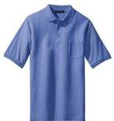  
Candidate 2

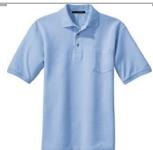  
Candidate 3

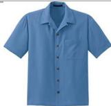  
Candidate 4

# Candidate 1

# Candidate 5 3 and 4</think> <tool_call{"name": "select_images", "arguments": {"target_images": [3,4]} </tool_call> remaining candidates are less relevant. The final ranking is: 4, 3, 2, 1, 5 </think>   
<answer>[4,3,2,1,5]/answer>

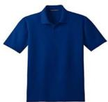  
Figure 7. A qualitative example of the retrieval result generated from V-Retrver.

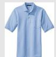  
Candidate 3

  
Candidate 4

Find a smaller monitor and an additional laptop les relevant. To further refine the ranking, let's select images 2 and 5 for detailed analysis./think <tool_call{"name": "select_images", "arguments": {"target_images": [2, 5]}}</tool_call> ki Cta eqea 3</think> <answer>[2, 5, 1, 4, 3]/answer>

  
Candidate 1

  
Candidate 2

  
Candidate 3

  
Candidate 4

  
Candidate 5   
Figure 8. A qualitative example of the retrieval result generated from V-Retrver.

  
Candidate 2

  
Candidate 5

I

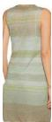  
Green metallic knitted dress   
Candidate 3

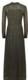  
Candidate 2

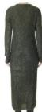

# Candidate 1

  
Candidate 4

Candidate 5 i y confirm.</think> <ol_cal"name" "crop_image", "arguments": {"bbox_2d: [0, 0,180, 250], "target_image": 3}/tool_call> remaining candidates are less relevant. The final ranking is: 4, 3, 2, 1, 5 </think>   
<answer>[4,3,2,1,5]/answer>

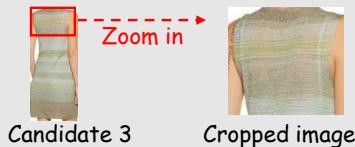  
Figure 9. A qualitative example of the retrieval result generated from V-Retrver.

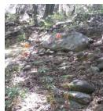

What is this plant named after?

# Candidate 1

Li Car . orange to brown stamens. The plant flowers in June, with flowers.

# Candidate 2

L Cal

# Candidate 3 named by.

Candidate 4 Liuoaal

# Candidate 5 parry" (lemon lily) Photos gallery: "Lilium parryi.

<ool_call"name "cro_image", "argents"{"bbox_2d: [125,88,145,108],{"target_iage:0}</tool_ca nc flowers n the ageh   
<answer>[1, 2, 4, 3, 5]/answer>

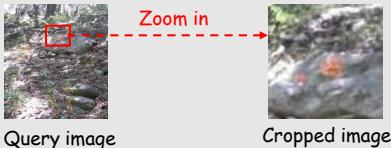  
Figure 10. A qualitative example of the retrieval result generated from V-Retrver.

  
Candidate 2

  
Candidate 3

  
Candidate 4

# Candidate 1

Candidate 5 dyue  .Ca promising. Let's use the select_images'tool to focus on these two for a detailed comparison./think <tool_call{"name": "select_images", "arguments": {"target_images": [2,5]}}</tool_call/tool_call> e nnCoy <answer>[5, 2, 1, 3, 4]/answer>

  
Figure 11. A qualitative example of the retrieval result generated from V-Retrver.

  
Candidate 2

  
Candidate 5