# Embed-RL: Reinforcement Learning for Reasoning-Driven Multimodal Embeddings

Haonan Jiang $^ { 1 , 2 }$ \*, Yuji Wang $^ { 1 , 2 \colon }$ , Yongjie Zhu $^ { 2 \dagger }$ , Xin Lu2, Wenyu Qin $^ 2$ , Meng Wang $^ 2$ , Pengfei Wan $^ 2$ , and Yansong Tang1‡ $\bot$ Tsinghua Shenzhen International Graduate School, Tsinghua University $^ 2$ Kling Team, Kuaishou Technology   
{jiang-hn24@mails, yuji-wan24@mails, tang.yansong@sz}.tsinghua.edu.cn   
{zhuyongjie, luxin09, qinwenyu, wangmeng46, wanpengfei}@kuaishou.com

Abstract. Leveraging Multimodal Large Language Models (MLLMs) has become pivotal for advancing Universal Multimodal Embeddings (UME) in addressing diverse cross-modal tasks. Recent studies demonstrate that incorporating generative Chain-of-Thought (CoT) reasoning can substantially enhance task-specific representations compared to discriminative methods. However, the generated reasoning CoTs of existing generative embedding methods are limited to the textual analysis of queries and are irrelevant to the retrieval of the targets. To address these limitations, we propose a reasoning-driven UME framework that integrates Embedder-Guided Reinforcement Learning (EG-RL) to optimize the Reasoner to produce evidential Traceability CoT (T-CoT). Our key contributions are threefold: (1) We design an EG-RL framework where the Embedder provides explicit supervision to the Reasoner, ensuring the generated CoT traces are aligned with embedding tasks. (2) We introduce T-CoT, which extracts critical multimodal cues to focus on retrieval-relevant elements and provides multimodal inputs for the Embedder. (3) With limited computational resources, our framework outperforms the pioneering embedding model on both MMEB-V2 and UVRB benchmarks. The integration of multimodal evidence in structured reasoning, paired with retrieval-oriented alignment, effectively strengthens cross-modal semantic consistency and boosts the model's fine-grained matching capability as well as its generalization across complex scenarios. Our work demonstrates that targeted reasoning optimization can significantly improve multimodal embedding quality, providing a practical and efficient solution for reasoning-driven UME development. Project page. Keywords: Multimodal Embedding $\cdot$ Generative Reasoning $\cdot$ Reinforcement Learning

# 1 Introduction

Multimodal embedding, as a core supporting technology for cross-modal tasks, has been widely applied to numerous important directions such as image-text retrieval, video moment localization, and visual document understanding [26, 36]. Traditional multimodal embedding methods adopt dual-encoder architectures, such as CLIP [43], BLIP [34], and SigLIP [67]. These methods demonstrate weaker ability in bridging the gap between different modalities compared with Multimodal Large Language Models (MLLMs) [2, 3, 31, 32, 51]. Additionally, MLLMs benefit from their strong multimodal understanding and instructionfollowing capabilities, enabling them to adapt to diverse and complex task requirements. Therefore, an increasing body of literature [18, 26, 41, 46, 63] proves that MLLMs can be used to learn Universal Multimodal Embedding (UME) that captures general-purpose content similarity. Meanwhile, evaluation benchmarks such as the Multimodal Embedding Benchmark (MMEB) [26] and its upgraded version MMEB-V2 [41] have addressed this academic demand for UME research, covering 78 instruction-aware tasks across three modalities.

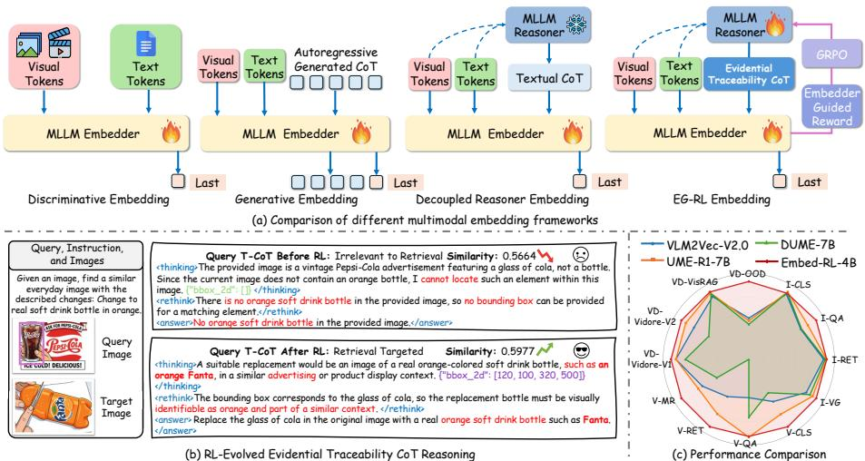  
Fig. 1: Multimodal embedding optimization via Embedder-Guided Reinforcement Learning (EG-RL). (a) Frameworks evolution. (b) Reasoning enhancement with RL-optimized evidential Traceability CoT (T-CoT). (c) Comparison of multi-task performance.

Currently, most MLLM-powered embedding methods are discriminative embedding models [29, 39, 71]. These models typically extract embedding features directly from the final hidden states of input tokens, failing to fully leverage MLLMs' inherent generative capabilities and reasoning potential. Consequently, recent studies explore integrating generative reasoning into UME tasks, as shown in Figure 1. For instance, approaches like UME-R1 [30] unify discriminative and generative embeddings through textual Chain-of-Thoughts (CoTs) generated by the MLLM Embedder. However, simultaneously optimizing contrastive loss and next-token prediction objectives causes conflicting gradients, leading to suboptimal performance [8, 30]. In contrast, the decoupled Reasoner-Embedder paradigm proposed by TTE [13], which relies on massive computational resources and data distillation from large models, aims to alleviate this problem by decoupling the two processes, using pre-trained MLLMs to generate offine CoT reasoning to enhance embedding quality with only the Embedder trained. Nevertheless, the CoTs generated by the Reasoner of TTE are not specifically designed for embedding, as they are not trained together with the Embedder. This misalignment may introduce noise and even lead to hallucinations. Moreover, relying only on textual reasoning fails to fully leverage the MLLM Embedder's potential to process multimodal signals, whose rich representations could significantly enhance retrieval performance. Such insufficiency of multimodal cues leads to notable embedding alignment bias, where critical visual-spatial cues and video-temporal signals are not fully captured in retrieval, resulting in less effective cross-modal matching and restricted generalization on complex real-world multimodal tasks.

To address the above issues, this paper proposes a reasoning-driven decoupled UME framework. This framework leverages the Embedder-Guided Reinforcement Learning (EG-RL) algorithm to optimize the CoTs generated by the Reasoner, using our novel process reward oriented to the alignment between query and target and verifiable outcome reward for retrieval. Firstly, we construct a dataset that initially trains the Embedder to generate high-quality embeddings conditioned on the sequence of preceding input and CoT tokens. The trained Embedder acts as a reward model and provides stable and reliable reward signals. Secondly, inspired by the region-aware paradigm [15, 45, 47, 75] that makes the model focus on the region of interest (RoI), we propose the evidential Traceability CoT (T-CoT) that explicitly guides the Embedder to focus on task-related information, effectively filter out redundant visual elements, and integrate modality-specific critical cues to adapt to long-text retrieval, coarse-grained semantic matching, and fine-grained alignment for robust performance across heterogeneous tasks. The main contributions of this paper are summarized as follows: 1. Embedder-Guided Reinforcement Learning. We propose a novel decoupled RL framework where the Embedder guides the Reasoner to optimize CoT trajectories for specific embedding tasks. This approach resolves key conflict between generative and embedding objectives, ensures the Reasoner's output greatly improves retrieval quality, and addresses core challenge of adapting general CoTs to embedding tasks. 2. Evidential Traceability CoT for Embedding. We further extend CoT reasoning to complex multimodal scenarios, integrating explicit visual localization information, video keyframes, and text keywords into detailed inference trajectories. This design enables the model to focus on core retrieval-related information and effectively mitigate the negative impact of redundant multimodal and text data on overall embedding alignment performance. 3. Efficient Performance Improvement Across Multiple Benchmarks. Under computationally constrained settings, the framework proposed in this paper outperforms state-of-the-art generative embedding models on both MMEB-V2 [41] and video retrieval UVRB [20] benchmark datasets, and achieves exceptional performance across diverse combinatorial scenarios.

# 2 Related Work

# 2.1 Universal Multimodal Embedding

Constructing robust multimodal representations is a fundamental core challenge in multimodal learning. Pioneering models such as CLIP [43] and ALIGN [24] adopt a dual-encoder architecture and learn effective representations through contrastive learning on rich large-scale image-text paired data. However, they struggle to handle interleaved image-text inputs, and their text encoders lack sufficient capacity to understand truly complex textual content. To address this issue, researchers leverage Multimodal Large Language Models (MLLMs) to build embedding models [26, 36, 39, 41, 71, 77], capitalizing on their strong multimodal comprehension capabilities to enhance overall learning performance. Existing works focus on different aspects: VLM2Vec [26] transforms MLLMs into embedding models via contrastive learning and achieves outstanding performance on unconventional retrieval tasks such as visual question answering and localization; MM-Embed [36] explores using off-the-shelf MLLMs as zeroshot rerankers to optimize retrieval results; LamRA [39] unifies the multimodal retrieval paradigm through two-stage retrieval training and joint reranking. Mega-Pairs [77] and GME [72] address the modality imbalance problem with automated pipelines; LLaVE [29] and Unite [27] focus on hard negative sample mining. Recent studies focus on instruction-aware representations: MMEB [26] and MMEB-V2 [41] construct a comprehensive evaluation benchmark covering 78 tasks. UME-R1 [30] first introduces reasoning mechanisms, yet simultaneous optimization of dual components via Reinforcement Learning (RL) leads to conficts, and redundant Chain-of-Thought (CoT) trajectories dilute representations. TTE [13] adopts a decoupled yet computationally expensive architecture, and its Reasoner is misaligned with retrieval tasks, resulting in task-irrelevant outputs. In this paper, we propose a decoupled RL framework enabling separate optimization of dual components and generating retrieval-relevant reasoning trajectories through a dual reward mechanism, addressing the aforementioned challenges.

# 2.2 Multimodal Reasoning with Reinforcement Learning

MLLMs [2,31,38, 51] extend and enrich the capabilities of Large Language Models (LLMs) to the multimodal domain, achieving promising results across diverse tasks including visual question answering [3,17,38,50], visual grounding [12,28, 33], and keyframe extraction [35, 52, 68, 79]. Early works [23, 53, 58, 60, 73] mostly completed reasoning tasks using standardized CoT prompts. Since DeepSeek-R1 [19] proposed the Group Relative Policy Optimization (GRPO) RL algorithm, numerous recent works have optimized advanced RL algorithms [64, 74] and enhanced the reasoning capabilities of MLLMs [6, 14, 44, 56, 59].

GRIT [15] interleaves bounding box coordinates with textual reasoning chains and designs an RL scheme based on the GRPO algorithm, enabling efficient training with dual robust rewards and no additional annotated data. Ground-R1 [6] proposes an RL framework to achieve grounded visual reasoning without extra annotations, guiding response generation through dual rewards to improve reasoning reliability and interpretability. BRPO [11] uses Intersection over Union (IoU)-based rewards to guide models to autonomously generate visual-text reflections, combined with a visual token mechanism to mitigate the problems of visual attention dilution and hallucinations. DeepEyes [75] adopts end-to-end RL to induce models to develop the ability of "thinking with images", improving performance on various reasoning tasks. TreeVGR [47] proposes the TreeBench benchmark and the TreeVGR training paradigm, enhancing visual grounding reasoning capabilities by jointly supervising localization and reasoning via RL. Inspired by grounding reasoning, this paper further proposes evidential Traceability CoT (T-CoT), which constructs structured multimodal reasoning chains by extracting bounding boxes of images, keyframes of videos, and keywords of text. This method enables the model to focus on the core regions of retrieval tasks, thereby improving embedding quality.

# 3 Methodology

# 3.1 Preliminaries

W $q$ $\varOmega = \{ c _ { n } \} _ { n = 1 } ^ { N }$ the goal is to retrieve the most relevant candidate from $\varOmega$ . To learn discriminative multimodal embeddings, we adopt contrastive learning with the InfoNCE loss [42], as shown in Figure 2(a). For a query $q _ { i }$ , its positive target $t _ { i } ^ { + }$ , and its negative target set $\mathcal { T } ^ { - } = \{ t _ { j } ^ { - } \} _ { j \neq i }$ , the InfoNCE loss optimizes the model to maximize the similarity between $q _ { i }$ and $t _ { i } ^ { + }$ while minimizing the similarities to all $t _ { j } ^ { - } \in \mathcal { T } ^ { - }$ . The loss is defined as:

$$
\begin{array} { r } { \mathcal { L } _ { \mathrm { I n f o N C E } } = - \frac { 1 } { N } \sum _ { i = 1 } ^ { N } \log \frac { \exp \Bigl ( \cos ( h _ { q _ { i } } , h _ { t _ { i } ^ { + } } ) / \tau \Bigr ) } { \exp \Bigl ( \cos ( h _ { q _ { i } } , h _ { t _ { i } ^ { + } } ) / \tau \Bigr ) + \sum _ { t ^ { - } \in \mathcal { T } ^ { - } } \exp \bigl ( \cos ( h _ { q _ { i } } , h _ { t ^ { - } } ) / \tau \bigr ) } \ , } \end{array}
$$

where $h _ { q _ { i } }$ and $\boldsymbol { h } _ { t }$ are embeddings of $q _ { i }$ and target $t$ (extracted as the last-layer hidden states of the last token from a vision-language model), $\cos ( \cdot , \cdot )$ denotes cosine similarity, and $\tau$ is the temperature hyperparameter.

# 3.2 Data Construction

To support the training of reasoning-driven universal multimodal embeddings, we construct a high-quality multimodal dataset following a "sampling-annotationfiltering-splitting" pipeline, as illustrated in Figure 2(a). The dataset integrates diverse modalities (image, video, visual document) and ensures alignment between reasoning trajectories and retrieval objectives through strict quality control. We first curate the initial data pool by adopting a stratiedsampling straty across three core sources, and referencing the data paradigm of VLM2Vec-V2 [41]:

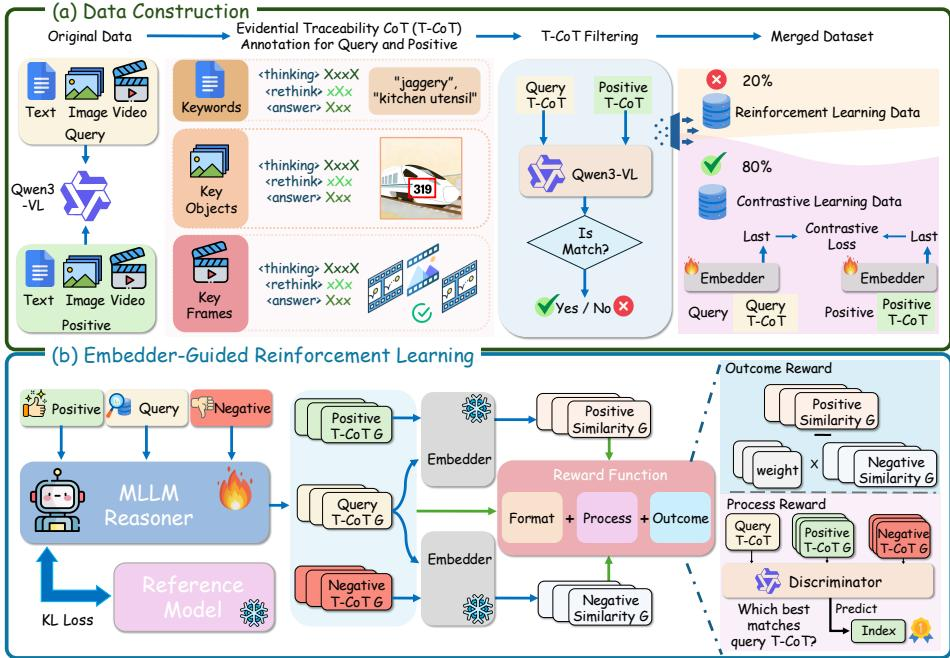  
Fig. 2: Overview of the proposed data synthesis and EG-RL framework. (a) Data Construction generates T-CoT annotations for query-positive pairs, filters and splits the dataset to enable contrastive and reinforcement learning, laying the groundwork for reasoning-aware embedding. (b) Embedder-Guided Reinforcement Learning finetunes the MLLM with a process-outcome reward function, encouraging T-CoT trajectories that yield more discriminative and beneficial generative embeddings.

(1) Image-centric tasks from MMEB-train [26], covering image classification, Question Answering, retrieval, and grounding; (2) Video-language instruction data from LLaVA-Hound [70], including video captioning, QA, and retrieval; (3) Visual document retrieval data from ViDoRe [16] and VisRAG [65]. Next, we perform evidential Traceability Chain-of-Thought (T-CoT) annotation for all query-positive pairs. Each T-CoT follows a structured threepart format: (1) <thinking> extracts modality-specific cues (text keywords via text_keywords, image spatial locations via bbox_2d (two-dimensional bounding box), video critical moments via key_frames); (2) <rethink> refines reasoning logic to focus on key retrieval-relevant aspects; (3) the final answer summarizes core retrieval-relevant information. We design task-specific prompts for annotation, ensuring T-CoT aligns with diverse multimodal retrieval scenarios. Following annotation, we perform a strict CoT-guided relevance filtering to eliminate noisy samples. With a custom-designed judgment prompt, we assess whether the T-CoTs of queries and their positive samples are clearly irrelevant or contradictory to the task description. We retain only samples labeled "No", meaning those that are relevant and not contradictory, for contrastive learning. This filtering step effectively mitigates noise interference in contrastive learning. The initial dataset contains 2.22 million samples, and 1.83 million are preserved after filtering, yielding a retention rate of approximately $8 0 \%$ . Approximately $2 0 \%$ of the filtered-out samples are uniformly sampled and used in the reinforcement learning stage, as these hard examples are valuable for model exploration in reinforcement learning. In addition, we assign training weights to different datasets based on their task importance and data quality. The constructed dataset exhibits three features: (1) modal diversity, covering three modalities of text, image, and video; (2) reasoning alignment, where T-CoT explicitly integrates multimodal cues and retrieval-related logic, avoiding informational redundancy; (3) quality assurance, as rigorous filtering and weighted sampling ensure that the dataset is free of significant noise and balanced across tasks. This dataset lays a solid foundation for the two-stage training, enabling Embedder to learn reasoning-aware representations and the Reasoner to optimize the generation of retrieval-centric T-CoTs through reinforcement learning.

# 3.3 Embedder-Guided Reinforcement Learning

To address the misalignment between generative reasoning and embedding objectives, we propose a decoupled reinforcement learning framework in which the pre-trained Embedder provides supervision to the Reasoner. This framework optimizes the generation of T-CoT to prioritize retrieval-relevant multimodal cues, leveraging a dual-guidance reward mechanism and Group Relative Policy Optimization (GRPO) [19]. Figure 2(b) illustrates the workflow of this stage.

EG-RL Framework Design. First, we fully train an Embedder using the InfoNCE loss to equip it with robust embedding capabilities. Our RL framework maintains strict separation between two components: the Reasoner, which is responsible for generating T-CoT, and the Embedder, which is frozen after contrastive training. This decoupling ensures three key benefits: (1) targeted optimization of reasoning without disrupting the Embedder's learned discriminative capabilities; (2) stable reward signals from the frozen Embedder that consistently evaluate T-CoT quality based on embedding alignment; and (3) flexible integration of multi-source rewards to internalize both retrieval and reranking knowledge. The Reasoner takes multimodal queries as input and outputs structured T-CoT, which integrates three critical cues: text keywords, image bounding boxes, and video keyframes. Additionally, we recrop the content within the bounding boxes and keyframes based on T-CoT to achieve multimodal reasoning-aware embeddings. This structured reasoning is then concatenated with the original input to form the Embedder's input, denoted as $\mathcal { L }$ :

$$
\mathcal { T } = [ x _ { \mathrm { t e x t } } , x _ { \mathrm { i m g } } , x _ { \mathrm { v i d } } , \mathrm { T } \mathrm { - } \mathrm { C o T } ( x ) , \mathrm { < e m b > } ] .
$$

In this equation, $<$ emb $>$ is a special token whose hidden state is extracted as the final embedding, and the evaluation of this embedding by the Embedder directly guides the Reasoner's policy update. Reward Function with Process and Outcome Guidance. We design a three-component reward function to align T-CoT generation with embedding quality, combining format compliance, outcome-level retrieval effectiveness, and process-level T-CoT alignment: Format Reward $( \mathcal { R } _ { f o r m a t } )$ : This reward ensures T-CoT strictly follows the predefined template (<thinking> → <rethink> <answer>) and includes all required multimodal cues. Reward 1 for full compliance, 0 otherwise, guaranteeing T-CoT output interpretability and compatibility with the Embedder module.

Embedder-Guided Outcome Reward (Routcome): This reward measures how T-CoT improves embedding alignment by jointly assessing the ranking accuracy of positive samples and the similarity margin between positive and hard negative samples. The margin is a softmax-weighted average of negative similarities scaled by a temperature parameter. For a query $q _ { i }$ with positive target $t _ { i } ^ { + }$ and in-batch negatives $\{ t _ { j } ^ { - } \} _ { j \neq i }$ , embeddings are $e _ { q _ { i } } = \pi _ { e } ( q _ { i } , o _ { i } ^ { q } )$ and $e _ { t _ { j } } = \pi _ { e } ( t _ { j } , o _ { j } ^ { t } )$ , where $o _ { i } ^ { q }$ and $o _ { j } ^ { t }$ are T-CoT outputs for query and target. The reward for $o _ { i } ^ { q }$ is defined as:

$$
\begin{array} { r } { \mathcal { R } _ { \mathrm { o u t c o m e } } ( o _ { i } ^ { q } ) = \operatorname { A c c } _ { k } ( e _ { q _ { i } } , t _ { i } ^ { + } ) \cdot \Big ( \sin ( e _ { q } , e _ { t _ { i } ^ { + } } ) - \mathbb { E } _ { \tau } \big [ \sin ( e _ { q _ { i } } , e _ { t _ { j } ^ { - } } ) \big ] \Big ) , } \end{array}
$$

where $\mathrm { A c c } _ { k } ( e _ { q _ { i } } , t _ { i } ^ { + } )$ denotes the top $k$ retrieval accuracy, which measures whether $t _ { i } ^ { + }$ is among the top $k$ ranked targets when sorted by cosine similarity to ; $e _ { q _ { i } }$ $\mathrm { s i m } ( \cdot , \cdot )$ denotes the cosine similarity between normalized embeddings; and $\mathbb { E } _ { \tau } [ \cdot ]$ stands for the softmax-weighted average of cosine similarities between $e _ { q _ { i } }$ and embeddings of in-batch negative targets. Additionally, we compute $\mathcal { R } _ { \mathrm { o u t c o m e } }$ symmetrically for positive targets: taking $t _ { i } ^ { + }$ as the anchor, $q _ { i }$ as its positive query, and other in-batch queries as negatives to calculate $\mathcal { R } _ { \mathrm { o u t c o m e } }$ for $o _ { i } ^ { t }$ . This symmetric computation enforces consistent embedding alignment in both query-to-target and target-to-query directions. This reward optimizes T-CoT with embedding learning as the core objective, enhancing its discriminative ability across samples.

T-CoT Process Reward $( \mathcal { R } _ { p r o c e s s } )$ : We employ an independent pretrained Vision-Language Model Discriminator $\mathcal { D }$ for listwise comparison to align T-CoT outputs of queries and targets. Let $q _ { \mathrm { c o t } }$ be the query's T-CoT output and $\{ c _ { \mathrm { c o t } } ^ { j } \} _ { j = 1 } ^ { m }$ the T-CoT outputs of $m$ samples from multiple rollouts of the query's data pair and negative samples. After shuffling, the index set of ground-truth positives is denoted $\mathcal { P }$ . To mitigate position bias, we feed $q _ { \mathrm { c o t } }$ and shuffled $\{ c _ { \mathrm { c o t } } ^ { j } \} _ { j = 1 } ^ { m }$ to $\mathcal { D }$ as pairwise inputs. The reward quantifies alignment via $\mathcal { D }$ 's selection correctness, formally defined as:

$$
\begin{array} { r } { \mathcal { R } _ { \mathrm { p r o c e s s } } ( o _ { i } ) = \left\{ \begin{array} { l l } { 1 , } & { \mathrm { i f } \ \mathcal { D } \big ( q _ { \mathrm { c o t } } , \{ c _ { \mathrm { c o t } } ^ { j } \} _ { j = 1 } ^ { m } \big ) \in \mathcal { P } , } \\ { 0 , } & { \mathrm { o t h e r w i s e } , } \end{array} \right. } \end{array}
$$

where $o _ { i }$ denotes the T-CoT generation outcome of the $i$ -th sample, and $\mathcal { D } ( \cdot , \cdot )$ outputs the index of the candidate T-CoT most aligned with $q _ { \mathrm { c o t } }$ in the shuffled candidate set. A reward of 1 indicates that $\mathcal { D }$ correctly selects a positive T-CoT from the ground-truth set, signifying well-aligned query-target T-CoT pairs; a reward of $0$ means $\mathcal { D }$ fails to select any positive T-CoT, indicating misalignment between query and target T-CoT outputs. We compute $\mathcal { R } _ { \mathrm { p r o c e s s } }$ symmetrically in the reverse direction, moving from positive targets to their corresponding queries, to ensure consistent embedding alignment across both directions. This reward guides Reasoner to align query and target T-CoT outputs. Since T-CoT is the intermediate process for embedding generation, T-CoT alignment quantified by $\mathcal { D }$ selection correctness directly improves embedding quality. The total reward is a weighted combination of these three components:

$$
\mathcal { R } _ { \mathrm { t o t a l } } = \alpha \mathcal { R } _ { \mathrm { f o r m a t } } + \beta \mathcal { R } _ { \mathrm { p r o c e s s } } + \gamma \mathcal { R } _ { \mathrm { o u t c o m e } } ,
$$

where $\alpha , \beta , \gamma$ are non-negative weighting coefficients that balance the relative contributions of the three reward components in the total reward optimization. Policy Optimization with GRPO. We adopt GRPO to optimize the Reasoner's policy, and use group-based rewards to stabilize the training process. For each query-target pair $q \sim s$ , where $\boldsymbol { S }$ denotes the training sample set of query-target pairs. We sample $G = 8$ candidate T-CoT sequences $\{ o _ { i } \} _ { i = 1 } ^ { G }$ according to the old policy $\pi _ { \theta _ { \mathrm { o l d } } }$ . The optimization objective is defined as:

$$
\begin{array} { r l } { \mathcal { L } _ { \mathrm { g r p o } } = \mathbb { E } \underset { \{ o _ { i } \} \sim \pi _ { \theta _ { \mathrm { o l d } } } } { \mathbb { E } } \Bigg [ \frac { 1 } { G } \sum _ { i = 1 } ^ { G } \bigg ( } & { \operatorname* { m i n } ( r _ { \theta } ( o _ { i } ) A _ { i } , \mathrm { c l i p } ( r _ { \theta } ( o _ { i } ) , 1 - \epsilon , 1 + \epsilon ) A _ { i } ) } \\ & { - \beta \mathbb { D } _ { \mathrm { K L } } ( \pi _ { \theta } \| \pi _ { \mathrm { r e f } } ) \bigg ) \Bigg ] , } \end{array}
$$

where $r _ { \theta } ( o _ { i } ) = \pi _ { \theta } ( o _ { i } | q ) / \pi _ { \theta _ { \mathrm { o l d } } } ( o _ { i } | q )$ denotes importance ratio, $\epsilon$ is the clipping threshold of importance ratio, $\beta$ is a hyperparameter weighting the Kullback-Leibler divergence term, $\pi _ { \mathrm { r e f } }$ denotes the reference policy model before optimization, and $A _ { i } = ( r _ { i } - \mu _ { r } ) / \sigma _ { r }$ represents advantage, where $\mu _ { r } = \operatorname { m e a n } ( \{ r _ { 1 } , . . . , r _ { G } \} )$ and $\sigma _ { r } = \mathrm { s t d } ( \{ r _ { 1 } , . . . , r _ { G } \} )$ are the mean and std of group rewards.

# 4 Experiments

# 4.1 Implementation Details

We train Qwen3-VL-2B [2] and Qwen3-VL-4B [2] as Embedders with the Deep-Speed Zero2 optimization framework, and adopt a sub-batch strategy following VLM2Vec [26]. The models are trained for 2 epochs with a learning rate of 1e-4 and weight decay of 0.01; the batch size is computationally light: 512 for the 2B model and 256 for the 4B model, and we use Low-Rank Adaptation (LoRA) [21] for fine-tuning. For reinforcement learning, Qwen3-VL-8B [2] is trained as Reasoner via the GRPO algorithm [19] for 1 epoch, with a computationally light batch size of 256, a learning rate of 3e-6, and standard GRPO hyperparameters.

# 4.2 Baselines and Datasets

We compare with representative multimodal embedding models with diverse architectures, modalities and scales. These baselines cover image, video and visual document retrieval, ensuring thorough and fair evaluation. We evaluate against GME [72], ColPali [16], VLM2Vec [26], LamRA [39], CAFe [63], VLM2Vec-V2 [41], TTE [13],UME-R1 [30], InternVideo2 [55], Unite [18], and GVE [20]. For the training phase, we followed VLM2Vec-V2 [41] and constructed a comprehensive dataset from three key sources: video-language instruction data from LLaVA-Hound [70], visual document retrieval data from ViDoRe [16] and VisRAG [65], and image-based vision-language task data from MMEB-train [26]. Detailed training procedures, hyperparameters, and dataset construction are in the supplementary material. We evaluate on two comprehensive benchmarks: MMEB-V2 (Massive Multimodal Embedding Benchmark) [41]: It is a comprehensive and robust benchmark consisting of 78 diverse tasks across three core visual modalities (image, video, and visual document). MMEB-V2 extends the original MMEB [26] by introducing five additional meta-tasks focused specifically on video and visual document understanding, bringing the total to nine metatasks. We adopted Hit@1 as the evaluation metric for image and video tasks, and Normalized Discounted Cumulative Gain (NDCG@5) [22] for visual documents. UVRB (Universal Video Retrieval Benchmark) [20]: It is a suite of 16 datasets to identify capability gaps in video retrieval across tasks and domains. UVRB measures multi-dimensional generalization over textual, composite, and visual retrieval tasks, including across coarse-grained, fine-grained, and long-context scenarios. We report mean Average Precision (mAP) for all UVRB tasks.

Table 1: Comparison of performance between baselines and our method on MMEB-V2. CLS: classification, QA: question answering, RET: retrieval, GD: grounding, MRET: moment retrieval, VDR: ViDoRe, VR: VisRAG, OOD: out-of-domain. The highest and second-highest values are highlighted in bold and underline.   

<table><tr><td rowspan="2">Model</td><td colspan="4">Image</td><td colspan="6">Video</td><td colspan="4">VisDoc</td><td rowspan="2">All</td></tr><tr><td>CLS</td><td>QA</td><td>RET</td><td>GD</td><td>Overall CLS</td><td></td><td></td><td>QA RET MRET Overall VDRv1 VDRv2</td><td></td><td></td><td></td><td>VR</td><td>OOD Overall</td><td></td></tr><tr><td># of Datasets</td><td>10</td><td>10</td><td>12</td><td>4 36</td><td>5</td><td>5</td><td>5</td><td>3</td><td>18</td><td>10</td><td>4</td><td>6</td><td>4</td><td>24</td><td>78</td></tr><tr><td colspan="10">Baseline Models</td><td></td><td></td><td></td><td></td><td></td><td></td></tr><tr><td>ColPali-V1.3-3B [16]</td><td>40.3 11.5 48.1 40.3</td><td></td><td></td><td></td><td>34.9</td><td>26.7 37.8 21.6</td><td></td><td>25.5</td><td>28.2</td><td>83.6</td><td>52.0</td><td>81.1</td><td>43.1</td><td>71.0</td><td>44.4</td></tr><tr><td>GME-2B [72]</td><td>54.4 29.9</td><td></td><td>66.9</td><td>55.5</td><td>51.9</td><td>34.9 42.0 25.6</td><td></td><td>32.4</td><td>33.9</td><td>86.1</td><td>54.0</td><td>82.5</td><td>43.1</td><td>72.7</td><td>54.1</td></tr><tr><td>GME-7B [72]</td><td>57.7 34.7 71.2 59.3</td><td></td><td></td><td></td><td>56.0</td><td>37.4 50.4 28.4</td><td></td><td>38.2</td><td>38.6</td><td>89.4</td><td>55.6</td><td></td><td>85.0 44.4</td><td>75.2</td><td>57.8</td></tr><tr><td>LamRA-2-7B [39]</td><td>59.2 26.5</td><td></td><td>70.0</td><td>62.7</td><td>54.1</td><td>39.3 42.6 24.3</td><td></td><td>34.6</td><td>35.2</td><td>22.0</td><td>11.5</td><td>37.4 58.2</td><td>21.0</td><td>23.9</td><td>40.4</td></tr><tr><td>LamRA-2.5-7B [39]</td><td>51.7 34.1</td><td></td><td>66.9</td><td>56.7</td><td>52.4</td><td>32.9 42.6 23.2</td><td></td><td>37.6</td><td>33.7</td><td>56.3</td><td>33.3</td><td>51.8</td><td>40.1 33.5</td><td>50.2</td><td>47.4</td></tr><tr><td>VLM2Vec-2B [26]</td><td>58.7</td><td>49.3</td><td>65.0</td><td>72.9</td><td>59.7</td><td>33.4 30.5 39.1 30.0 29.0</td><td>20.6</td><td>33.0 40.6</td><td>29.0 34.0</td><td>49.8 56.9</td><td>13.5 9.4</td><td></td><td>59.1 38.1</td><td>41.6</td><td>47.0 52.3</td></tr><tr><td>VLM2Vec-7B [26]</td><td>62.7 56.9</td><td></td><td>69.4 82.2</td><td></td><td>65.5</td><td></td><td></td><td>38.5</td><td>34.9</td><td>75.5</td><td>44.9</td><td>79.4</td><td>39.4</td><td>46.4</td><td>58.0</td></tr><tr><td>VLM2Vec-V2-2B [41]</td><td>62.9 56.3 69.5</td><td></td><td></td><td>77.3</td><td>64.9 68.1</td><td>39.3 34.3 28.8 45.9 33.9 27.6</td><td></td><td>39.3</td><td>36.4</td><td>78.8</td><td>52.6</td><td>82.7</td><td>42.1</td><td>65.4</td><td>61.2</td></tr><tr><td>VLM2Vec-V2-7B [41]</td><td>65.7 61.5 70.0</td><td></td><td></td><td>85.2</td><td>67.6</td><td>35.8 58.7 34.4</td><td></td><td>39.5</td><td>42.4</td><td>70.7</td><td>49.6</td><td>79.5 38.1</td><td></td><td>69.3 63.9</td><td>60.6</td></tr><tr><td>CAFe-7B [63] TTEs-2B [13]</td><td>63.6 61.7 69.1 87.6 67.9 66.6 70.2</td><td></td><td></td><td>84.1</td><td>70.1</td><td>47.3 49.1</td><td>34.4</td><td>33.2</td><td>32.1</td><td>77.5</td><td>53.2</td><td>83.2</td><td>41.1</td><td>68.8</td><td>63.1</td></tr><tr><td>UME-R1-2B [30]</td><td>64.8 62.8 67.6 77.2</td><td></td><td></td><td></td><td>66.6</td><td>44.3 51.2 32.9</td><td></td><td>39.7</td><td>42.2</td><td>72.4</td><td>46.2</td><td>79.2</td><td>37.2</td><td></td><td></td></tr><tr><td>UME-R1-7B [30]</td><td>67.1</td><td>69.2 71.9 84.9</td><td></td><td></td><td>71.3</td><td>48.6 60.7</td><td>38.2</td><td>39.3</td><td>47.5</td><td>75.7</td><td>50.5</td><td>83.7</td><td>37.6</td><td>63.9</td><td>60.1</td></tr><tr><td></td><td></td><td></td><td></td><td></td><td></td><td></td><td>Ours</td><td></td><td></td><td></td><td></td><td></td><td></td><td>67.1</td><td>64.5</td></tr><tr><td colspan="10"></td><td colspan="7"></td></tr><tr><td>Embed-RL-2B</td><td></td><td>62.8 67.9 68.6 90.4</td><td></td><td>69.2</td><td></td><td>57.0 55.9 45.1</td><td></td><td>49.4</td><td>52.1</td><td>79.9</td><td>52.0 53.4</td><td></td><td>84.6 65.7</td><td>74.1</td><td>66.8</td></tr><tr><td>Embed-RL-4B</td><td></td><td>63.7 70.5 71.3 91.4</td><td></td><td></td><td>70.1</td><td>57.6 58.4 45.1</td><td></td><td>49.5</td><td>53.0</td><td>80.2</td><td></td><td></td><td>84.9 67.1</td><td>74.7</td><td>68.1</td></tr></table>

# 4.3 Main Results

Table 1 compares the comprehensive performance of our proposed Embed-RL models with various baseline approaches on the MMEB-V2 benchmark. Our Embed-RL models consistently achieve superior performance directly compared to all baseline models. Specifically, Embed-RL-4B attains the best overall score of 68.1, outperforming the strong next top baseline UME-R1-7B by 3.6 points. Embed-RL-2B follows closely with an overall score of 66.8, also surpassing all baseline variants. Across different modalities, our models show clear and notable advantages. In the Image modality, Embed-RL-4B impressively achieves the best grounding (GD) performance of 91.4, with Embed-RL-2B ranking second at 90.4. For the Video modality, both Embed-RL-2B and Embed-RL-4B outperform all baselines in overall score, with Embed-RL-2B scoring 52.1 and Embed-RL-4B scoring 53.0, and they achieve a video retrieval (RET) score of 45.1. In the visual document modality, we observe significant improvements in out-of-domain (OOD) performance, where Embed-RL-4B reaches 67.1 and Embed-RL-2B 65.7, far exceeding prior baseline results. These results demonstrate the effectiveness of our proposed approach across diverse visual modalities and task types.

Table 2: Video retrieval performance on UVRB. Domain dimensions: Coarse-grained (CG), Finegrained (FG), Long-context (LC). The best and second-best results are marked in bold and underline.   

<table><tr><td rowspan=1 colspan=1>Model</td><td rowspan=1 colspan=1>CGFGLC</td></tr><tr><td rowspan=1 colspan=1>InternVideo2-6B [55]</td><td rowspan=1 colspan=1>| 50.441.742.3</td></tr><tr><td rowspan=1 colspan=1>VLM2Vec-V2 [41]</td><td rowspan=1 colspan=1>49.850.276.2</td></tr><tr><td rowspan=1 colspan=1>GME-7B [72]</td><td rowspan=1 colspan=1>51.850.778.8</td></tr><tr><td rowspan=1 colspan=1>Unite-7B [</td><td rowspan=1 colspan=1>54.153.974.6</td></tr><tr><td rowspan=1 colspan=1>GVE-3B [20]</td><td rowspan=1 colspan=1>55.254.176.4</td></tr><tr><td rowspan=1 colspan=1>Embed-RL-2BEmbed-RL-4B</td><td rowspan=1 colspan=1>| 59.154.686.960.755.686.1</td></tr></table>

In the broader field of video retrieval, benefiting from the effectiveness of our T-CoT to accurately locate keywords or keyframes, our model exhibits significant advantages in Coarse-grained (CG), Fine-grained (FG), and Long-context (LC) retrieval tasks. As shown in Table 2, detailing video retrieval performance of different models on the UVRB dataset across the three domains, our Embed-RL models consistently excel: 4B tops CG at 60.7 and FG at 55.6, while 2B leads LC at 86.9, both outperforming all existing baselines by a clear margin. Additionally, Figure 3 presents the visualization of our T-CoT on text, image and video; we crop bbox and keyframe to achieve multi-modal CoT input, and our T-CoT accurately locates retrieval needs to improve retrieval performance. More scores and visualizations are provided in the supplementary material.

# 4.4 Ablation Study

To dissect the contribution of each component in our framework, we conduct ablation experiments on MMEB-V2, where Embed-RL-2B serves as the model.

Analysis of the reward model in the RL Stage.As shown in Table 3, removing the RL stage leads to an overall performance decline of 1.5 points, dropping the score from 66.8 to 65.3. This result verifies that RL fine-tuning is indispensable for embedding alignment. Omitting weighted negative sampling, a core module of our contrastive reward mechanism, brings a performance reduction of 0.3 points from 66.8 to 66.5. This outcome emphasizes the component's key function in prioritizing hard negative examples to strengthen discriminative embedding learning.The process reward is formulated to reward logical reasoning steps and align query T-CoT with target T-CoT. It contributes 0.8 points to the overall performance, as its exclusion lowers the score from 66.8 to 66.0. This component shows the most notable influence on video tasks, where performance falls from 52.1 to 51.3. This trend reveals that video understanding strongly depends on step-by-step reasoning and further reflects the critical role of the process reward in T-CoT alignment.Additionally, the outcome reward is built to reward final predictions. It contributes 1.0 point to the overall performance, and its removal reduces the total score from 66.8 to 65.8. This reward ensures that the reasoning process remains consistent with the objective of the target task.

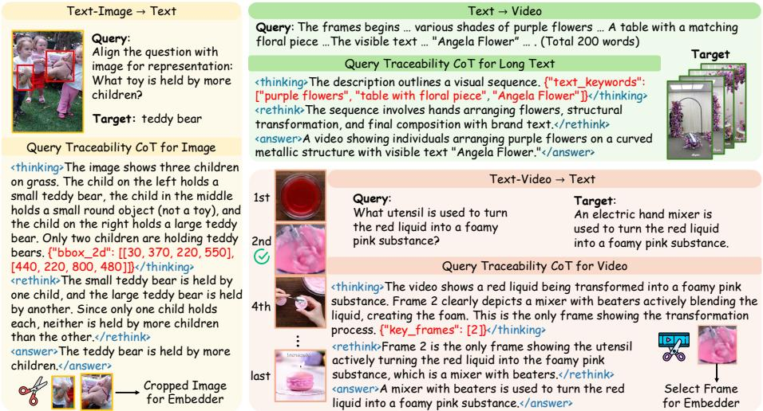  
Fig. 3: Example visualization of our reasoning-driven embedding framework on multimodal retrieval tasks. The figure shows the evidential Traceability CoT reasoning process for video and visual document retrieval.

Impact of Reasoning Components on T-CoT. As shown in Table 4, removing the reasoning process while retaining the answer part leads to a performance decrease of 1.3 points from 66.8 to 65.5. Image grounding and video moment retrieval see notable drops, falling from 69.2 to 67.9 and 52.1 to 50.5, which highlights the importance of multimodal evidence tracking for fine-grained alignment tasks. Removing multimodal cues leads to a performance reduction of 1.0 points from 66.8 to 65.8, validating the necessity of extracting multimodal cues through bounding boxes and keyframes to enhance alignment between multimodal representations and retrieval objectives. Most critically, using only raw input without T-CoT causes a catastrophic decrease in overall performance of 6.6 points, from 66.8 to 60.2. The greatest impact appears on video tasks, where performance falls from 52.1 to 43.7. This dramatic decline demonstrates the necessity of high-quality evidential Traceability CoT for retrieval accuracy, as it enables the model to decompose complex retrieval and understanding tasks into manageable steps and improve cross-modal embedding quality.

Table 3: Ablation Study on Reward Components in EG-RL stage.   

<table><tr><td>Model</td><td>Image</td><td>Video</td><td>VisDoc All</td><td></td></tr><tr><td>Embed-RL-2B</td><td>69.2</td><td>52.1</td><td>74.1</td><td>66.8</td></tr><tr><td>w/o EG-RL</td><td>68.0</td><td>50.1</td><td>72.7</td><td>65.3</td></tr><tr><td>w/o weighted negative</td><td>68.9</td><td>51.7</td><td>73.9</td><td>66.5</td></tr><tr><td>w/o process reward</td><td>68.3</td><td>51.3</td><td>73.5</td><td>66.0</td></tr><tr><td>w/o outcome reward</td><td>68.1</td><td>51.2</td><td>73.1</td><td>65.8</td></tr></table>

Table 4: Ablation Study on Reasoning Components in T-CoT.   

<table><tr><td>Model</td><td colspan="4">Image Video VisDoc All</td></tr><tr><td>Embed-RL-2B</td><td>69.2</td><td>52.1</td><td>74.1</td><td>66.8</td></tr><tr><td>w/o reasoning</td><td>67.9</td><td>50.5</td><td>73.1</td><td>65.5</td></tr><tr><td>w/o multimodal cues</td><td>68.1</td><td>51.4</td><td>73.3</td><td>65.8</td></tr><tr><td>w/ raw input</td><td>60.4</td><td>43.7</td><td>72.4</td><td>60.2</td></tr></table>

Ablation Study on Model's Discriminative Ability for Candidates. We define the top-ranked candidates with the highest similarity (excluding positive samples) as highly similar candidate samples. On this basis, we study how optimizing the reasoner with EG-RL improves the model's ability to distinguish between similar candidates. Specifically, we calculate the difference between the similarity of the query to the most similar candidate and that to the second-most similar candidate on each dataset, both before and after RL. This difference measures whether the model assigns a significantly higher similarity to positive samples than to other highly similar candidates. As shown in Figure 4, we observe that on different datasets across three modalities, the radar chart obtained after RL prominently encloses the one obtained before RL. This indicates that the computed similarity difference becomes larger after RL, widening the gap between the query's similarity to the top-ranked candidate and the second-ranked candidate. It demonstrates that the model's ability to discriminate between similar candidates is effectively enhanced. Meanwhile, the bar chart shows that the model achieves consistent overall improvement on three-modality datasets. This verifies that optimizing T-CoT with RL strengthens the model's general ability to distinguish between different candidates.

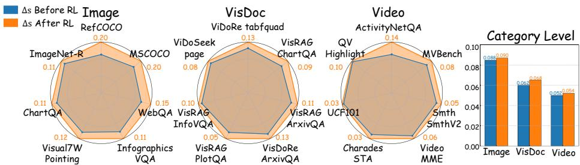  
Fig. 4: Similarity difference $\varDelta s = \sin ( \mathrm { q u e r y } , \mathrm { t o p 1 } ) - \sin ( \mathrm { q u e r y } , \mathrm { t o p 2 } )$ before and after EG-RL. Here, $\mathrm { s i m } ( \cdot , \cdot )$ denotes cosine similarity of normalized embeddings, top1 is the most similar positive candidate and top2 the second-most similar. This metric quantifies the model's discriminative ability over similar candidates on multimodal datasets.

Ablation on traceable evidence count and retrieval metrics.We also systematically analyze the relationship between the number of traceable evidence pieces and core retrieval metrics across all datasets before and after reinforcement learning.For images and visual document data, we count the change in the number of bounding boxes.For video data, we similarly count the change in the number of keyframes.We observe that after reinforcement learning, the T-CoT generated by the Reasoner tends to produce more bounding boxes.For the video modality, the model tends to focus on fewer keyframes.The retrieval metrics yield consistent and significant improvements, with the curves after reinforcement learning lying entirely above those before.For the image modality, the model captures more visual evidence to boost reasoning accuracy and recall.For the video modality, it concentrates on critical frames and conducts precise keyframe extraction and temporal localization to identify key content.These changes are particularly pronounced on complex samples involving multi-object localization and multi-person relationship reasoning.

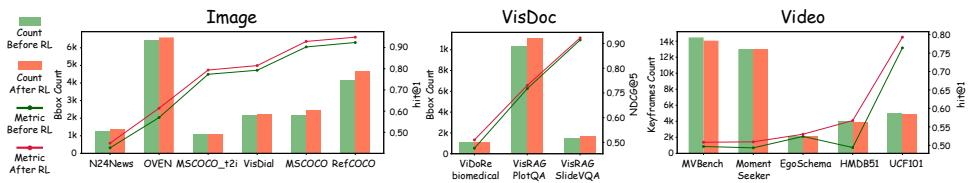  
Fig. 5: Relationship between traceable evidence counts and retrieval metrics across datasets. $\mathrm { H i t @ 1 }$ is employed for Image and Video; NDCG $\ @ 5$ is used for VisDoc. Bounding box counts are shown for Image and VisDoc, while keyframe counts for Video.

# 5 Conclusion

This work addresses key limitations of generative universal multimodal embedding (UME) methods: chain-of-thought (CoT) remains text-only, resulting in poor retrieval relevance, while joint optimization of generative and embedding objectives gives rise to gradient conflicts that impede cross-modal matching. We propose Embed-RL, a reasoning-driven UME model built upon Embedder-Guided RL (EG-RL), which serves as a decoupled reinforcement learning framework that integrates multimodal evidential Traceability CoT (T-CoT) and a retrieval-oriented dual-reward mechanism to enable precise reasoning-embedding alignment. Extensive experiments on the MMEB-V2 and UVRB benchmarks demonstrate that Embed-RL outperforms state-of-the-art counterparts within computational constraints, achieving significant improvements in cross-modal retrieval and out-of-domain generalization tasks. This work shows that targeted reasoning optimization can substantially enhance multimodal embeddings, providing an efficient solution for reasoning-driven UME and valuable insights into the integration of generative reasoning with multimodal representation learning.

# Text-Image → Text #

Represent the given image with the following question: What fruit is to the right of the empty crate?

# Query T-CoT Before RL:

<thinking> The image shows a market stall with multiple bunches of bananas and a crate on the left. To the right of the empty crate, there is a pile of red apples. The apples are clearly visible and located at coordinates [560, 480, 800, 580]. {\"bbox2d\": [560, 480, 800, 580]}/thinking>\n<rethink: The empty crate is on the left side of the image, and the red apples are positioned directly to its right, confirming the fruit in question.</rethink>\n<answer>The fruit to the right of the empty crate is apples.</answer>

# Ground to incorrect information.

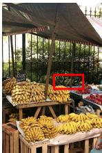  

Similarity: 0.3613

# Query T-CoT After RL:

<thinking> The image shows a market stall with multiple bunches of bananas and a pile of red apples. An empty wooden crate is visible on the lower left. To the right of this empty crate, there are more bananas displayed on a table. {\"bbox_2d\": [0, 760, 200, 998], \"bbox_2d\": [200, 720, 500, 900]}</thinking>\n<rethink>The empty crate is located on the lower left, and the bananas to its right are clearly visible on the table, confirming the fruit is bananas.</rethink>\n<answer>The fruit to the right of the empty crate is bananas.</answer>

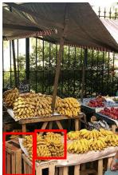

# Ground to accurate information.

Similarity: 0.4883 Target: The fruit is a banana. <thinking: The task requires identifying key concepts in the positive text output. The text "The fruit is a banana." explicitly identifies a fruit and its name. Key concepts include \"fruit" and \"bananal" as the subject and object. {"text_keywords\": [\"fruit\", \"banana\"]]</thinking?\n<rethink>The keywords confirm the output identifies a specific type of fruit, aligning with the expected content of the task.</rethink> \n<answer> The text output identifies banana as a fruit.</answer> Fig. 6: Example 1 of T-CoT Before and After EG-RL.

# Text → Image #

What insights can be drawn about the effects of scaffold pore size on tissue regeneration?

# Query T-CoT:

<thinking>The question asks about insights from scaffold pore size on tissue regeneration, implying a scientific context. Key visual concepts include "scaffold," "pore size," and "tissue regeneration." These terms suggest an image showing a porous biomaterial structure with cells or tissue growing through or around it. {\"text_keywords\": [\"scaffold", \"pore size", \"tissue regeneration\", biomaterial", "cells", \porous structure\"]k/thinking\n<rethinkThe keywords indicate we need an image depicting a scaffold with visible pores and evidence of tissue or cell growth, illustrating the relationship between pore size and regeneration.</rethink> \n<answer>An image of a porous scaffold with visible pores and growing tissue or cells, illustrating the relationship between scaffold pore size and tissue regeneration.</answer>

# Target T-CoT Before RL:

<thinking>The task requires analyzing a biomedical slide about \"Scaffolds o1 peripheral nerves.\" The image contains key text elements: a title, a finding abou conduction velocity, and a citation. The most important visual element is the title, as i defines the slide's subject. The bounding box should cover the title text {\"bbox_2d\": [50, 50, 500, 120]}/thinking>\n<rethink>The title \"Scaffolds o peripheral nerves\" is the central and most informative element, as it directly lis corresponds to the slide's topic. The other text provides supporting context but i: secondary to the main heading.</rethink>\n<answer>The image displays a slide titlec "Scaffolds on peripheral nerves," indicating a biomedical topic on nerve regeneratior and scaffold interactions.</answer>

# Missed grounding.

# Target T-CoT After RL:

<thinking The task is to analyze a biomedical slide about scaffolds on peripheral nerves. \$\frac{}\$ The key visual elements are the red title \"Scaffolds on peripheral nerves" and the text block on the right stating \"Conduction velocity of regenerated nerve became normal at scaffold pore diameter about $5 \mu m \setminus ^ { \prime \prime }$ . These are the most important parts of the slide. I will extract bounding boxes for both text blocks. {\"bbox_2d\": [[40, 50, , 120], [620, 70, 880, 210]]/thinking: \n<rethink The bounding boxes correctly identify the two key textual elements: the title and the critical finding about nerve conduction velocity. These are the essential components for understanding the slide's message.</rethink>\n<answer>The image is a biomedical slide titled \"Scaffolds on peripheral nerves\" with the key finding that \"Conduction velocity of regenerated nerve became normal at scaffold pore diameter about 5 µm\".</answer>

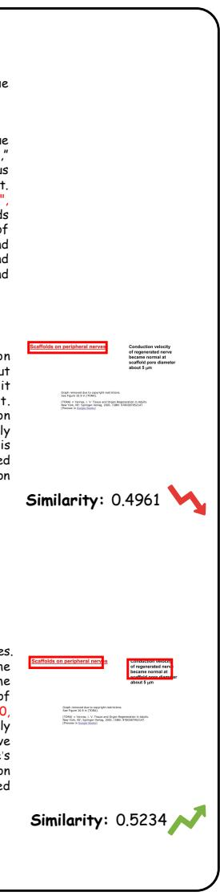  
Fig. 7: Example 2 of T-CoT Before and After EG-RL.

# Text Video #

Aman  u el idemraghe rr  jven

# Query T-CoT:

<thinkings The description specifies a man in an outdoor field performing a javelin throw. Key visual elements include a person (man), an outdoor setting (field), and the action of throwing a javelin. No additional context like weather, clothing, or audience is provided, so focus remains on core visual components. {\"text_keywords\": [\"man\", "outside field", \"throwing\", \"javelin\"]}/thinking?\n<rethinkThe task demands a video capturing a javelin throw by a man in an open field — the core visual concepts are the athlete, the outdoor environment, and the action of throwing a javelin./rethink>\n<answer>A video showing a man in an outdoor field demonstrating the act of throwing a javelin.</answer>

# Target T-CoT Before RL:

<thinking> The video frames depict a tennis player in action on a red clay court, with visible green grass and trees in the background. The player is shown in various stages of a swing, including frames where they are mid-motion (Frame 2, 4, 6) and preparing to hit the ball (Frame 1, 3, 5, 7, 8). These frames capture the dynamic movement and setting.{\"key_frames\": [1, 3, 5, 7]}/thinking>\n<rethink>The key frames (1, 3, 5, 7) capture the player's motion across different phases of a tennis swing, set against the court and background environment</rethink>\n<answer>The video shows a tennis player on a red clay court, captured mid-swing in various frames, with green grass and trees visible in the background.</answer>

# Similarity: 0.3164

# Misguided and query-irrelevant.

Target T-CoT After RL : <thinking> The frames show a person performing athletic movements on a red track adjacent to a green field, with trees and buildings visible in the background. The person is seen in various poses, including swinging a long object (likely a javelin) and running. Frame 3 clearly shows the athlete in mid-throw motion, and Frame 6 shows the follow-through. These frames capture the key actions and setting. {\"key_frames\": [3. 6]}</thinking: \n<rethink>The key frames (3 and 6) capture the athlete in the critical moments of the javelin throw motion and follow-through, along with the context of the track and surrounding environment.</rethink>\n<answer>The video shows an athlete performing a javelin throw on a red track next to a green field, with trees and buildings in the background. The motion is captured in mid-throw and follow-through phases.</answer

# Similarity: 0.5742

Query-aligned and key-action focused.

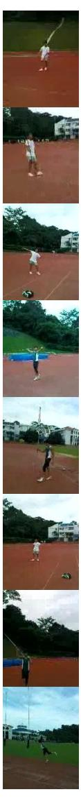  
Fig. 8: Example 3 of T-CoT Before and After EG-RL.

# References

1. Anne Hendricks, L., Wang, O., Shechtman, E., Sivic, J., Darrell, T., Russell, B.: Localizing moments in video with natural language. In: Proceedings of the IEEE international conference on computer vision. pp. 58035812 (2017)

2. Bai, S., Cai, Y., Chen, R., Chen, K., Chen, X., Cheng, Z., Deng, L., Ding, W., Gao, C., Ge, C., Ge, W., Guo, Z., Huang, Q., Huang, J., Huang, F., Hui, B., Jiang, S., Z. Li M. Li, M. LiK.Ln Z. i J. Lu X. Liu J. Liu C. Liu Y. D. Liu, S., Lu, D., Luo, R., Lv, C., Men, R., Meng, L., Ren, X., Ren, X., Song, S., Su Y., Tag, J., Tu, J. Wan, J., Wa, P. Wan, P. Wa, Q. ag,Y. Xie, T. XuY. Xu H. Xu, J  Z. M.  J A.Yu B. , F., Zhang, H., Zhang, X., Zheng, B., Zhong, H., Zhou, J., Zhou, F., Zhou, J., Zhu, Y., Zhu, K.: Qwen3-vl technical report. arXiv preprint arXiv:2511.21631 (2025)   
3.Bai, S., Chen, K., Liu X. Wng, J. Ge, W. Song, S. Dag, K., Wa, P. Wan, S., Tang, J., et al.: Qwen2. 5-vl technical report. arXiv preprint arXiv:2502.13923 (2025)   
4.Bolya, D., Huang, P.Y., Sun, P., Cho, J.H., Madotto, A., Wei, C., Ma, T., Zhi, J., Rajasegaran, J., Rasheed, H., et al.: Perception encoder: The best visual embeddings are not at the output of the network. arXiv preprint arXiv:2504.13181 (2025)   
5.Cai, Q., Liang, H., Dong, H., Qiang, M., An, R., Han, Z., Zhu, Z., Cui, B., Zhang, W.: Lovr: A benchmark for long video retrieval in multimodal contexts. arXiv preprint arXiv:2505.13928 (2025) 6. Cao, M., Zhao, H., Zhang, C., Chang, X., Reid, I., Liang, X.: Ground-r1: Incentivizing grounded visual reasoning via reinforcement learning. arXiv preprint arXiv:2505.20272 (2025) 7. Chai, W., Song, E., Du, Y., Meng, C., Madhavan, V., Bar-Tal, O., Hwang, J.N., Xie, S., Manning, C.D.: Auroracap: Effient, performant video detailed captioning and a new benchmark. arXiv preprint arXiv:2410.03051 (2024) 8. Chen, H., Liu, H., Luo, Y., Wang, L., Yang, N., Wei, F., Dou, Z.: Moca: Modalityaware continual pre-training makes better bidirectional multimodal embeddings. arXiv preprint arXiv:2506.23115 (2025)   
Chen, H., Wang, L., Yang, N., Zhu, Y., Zhao, Z., Wei, F., Dou, Z.: mme5: Improving multimodal multilingual embeddings via high-quality synthetic data. arXiv preprint arXiv:2502.08468 (2025) 0. Cherti, M., Beaumont, R., Wightman, R., Wortsman, M., Ilharco, G., Gordon, C., Schuhmann, C., Schmidt, L., Jitsev, J.: Reproducible scaling laws for contrastive language-image learning. In: Proceedings of the IEEE/CVF conference on computer vision and pattern recognition. pp. 28182829 (2023) 1. Chu, X., Chen, X., Wang, G., Tan, Z., Huang, K., Lv, W., Mo, T., Li, W.: Qwen look again: Guiding vision-language reasoning models to re-attention visual information. arXiv preprint arXiv:2505.23558 (2025)   
Chung, J., Kim, J., Kim, S., Lee J., Kim, M.S., Yu, Y.: Don't look only once: Towards multimodal interactive reasoning with selective visual revisitation. arXiv preprint arXiv:2505.18842 (2025) 3. Cui, X., Cheng, J., Chen, H.y., Shukla, S.N., Awasthi, A., Pan, X., Ahuja, C., Mishra, S.K., Yang, Y., Xiao, J., et al.: Think then embed: Generative context improves multimodal embedding. arXiv preprint arXiv:2510.05014 (2025) 4. Duan, C., Fang, R., Wang, Y., Wang, K., Huang, L., Zeng, X., Li, H., Liu, X.: Gotr1: Unleashing reasoning capability of mllm for visual generation with reinforcement learning. arXiv preprint arXiv:2505.17022 (2025) 15. Fan, Y., He, X., Yang, D., Zheng, K., Kuo, C.C., Zheng, Y., Narayanaraju, S.J., Guan, X., Wang, X.E.: Grit: Teaching mllms to think with images. arXiv preprint arXiv:2505.15879 (2025) 16. Faysse, M., Sibille, H., Wu, T., Omrani, B., Viaud, G., Hudelot, C., Colombo, P.: Colpali: Effcient document retrieval with vision language models. arXiv preprint arXiv:2407.01449 (2024) 17. Geng, X., Xia, P., Zhang, Z., Wang, X., Wang, Q., Ding, R., Wang, C., Wu, J., Zo Y. Li K. al. Wee: ren  s-aee research agent. arXiv preprint arXiv:2508.05748 (2025)   
18Gu, T. Yag, K., Feng, Z., Wag, X., Zhag, Y. Lng, D., Chen, Y., Cai, W., Deng, J.: Breaking the modality barrier: Universal embedding learning with multimodal llms. arXiv preprint arXiv:2504.17432 (2025) 19. Guo, D., Yang, D., Zhang, H., Song, J., Zhang, R., Xu, R., Zhu, Q., Ma, S., Wang, P., Bi, X., et al.: Deepseek-r1: Incentivizing reasoning capability in llms via reinforcement learning. arXiv preprint arXiv:2501.12948 (2025) 20. Guo, Z., Li, M., Zhang, Y., Long, D., Xie, P., Chu, X.: Towards universal video retrieval: Generalizing video embedding via synthesized multimodal pyramid curriculum. arXiv preprint arXiv:2510.27571 (2025) 21. Hu, E.J., Shen, Y., Wallis, P., Allen-Zhu, Z., Li, Y., Wang, S., Wang, L., Chen, W., e a Lora: Low-rank adaptation of large language models. ICLR 1(2), 3 (2022) 22. Järvelin, K., Kekäläinen, J.: Cumulated gain-based evaluation of ir techniques. ACM Transactions on Information Systems (TOIS) 20(4), 422446 (2002)   
D. Zhu L oS. Xu P. Lu H.Ye J. ZhaoF.Treean the power of llms for enhanced large-scale table understanding. arXiv preprint arXiv:2411.08516 (2024) 24. Jia, C., Yang, Y., Xia, Y., Chen, Y.T., Parekh, Z., Pham, H., Le, Q., Sung, Y.H., Li, Z., Duerig, T.: Scaling up visual and vision-language representation learning x uei  Inal ca er pp. 49044916. PMLR (2021)   
Jiang, T. Song, M. Zhang, Z., Huang, H. Deg, W., Sun, F., Zhang, Q., Wang, D., Zhuang, F.: E5-v: Universal embeddings with multimodal large language models. arXiv preprint arXiv:2407.12580 (2024) 26. Jiang, Z., Meng, R., Yang, X., Yavuz, S., Zhou, Y., Chen, W.: Vlm2vec: Training vision-language models for massive multimodal embedding tasks. arXiv preprint arXiv:2410.05160 (2024) 27. Kong, F., Zhang, J., Liu, Y., Zhang, H., Feng, S., Yang, X., Wang, D., Tian, Y., Zhang, F., Zhou, G., et al.: Modality curation: Building universal embeddings for advanced multimodal information retrieval. arXiv preprint arXiv:2505.19650 (2025)   
Lai X. Tin Z.henY. LiY.uanY. Liu S. Jia . iementation via large language model. In: Proceedings of the IEEE/CVF Conference on Computer Vision and Pattern Recognition. pp. 95799589 (2024) 29. Lan, Z., Niu, L., Meng, F., Zhou, J., Su, J.: Llave: Large language and vision embedding models with hardness-weighted contrastive learning. arXiv preprint arXiv:2503.04812 (2025) 30. Lan, Z., Niu, L., Meng, F., Zhou, J., Su, J.: Ume-r1: Exploring reasoning-driven generative multimodal embeddings. arXiv preprint arXiv:2511.00405 (2025) 31. Li, B., Zhang, Y., Guo, D., Zhang, R., Li, F., Zhang, H., Zhang, K., Zhang, P., Li, Y., Liu, Z., et al.: Llava-onevision: Easy visual task transfer. arXiv preprint arXiv:2408.03326 (2024) 32. Li, F., Zhang, R., Zhang, H., Zhang, Y., Li, B., Li, W., Ma, Z., Li, C.: Llava-nextinterleave: Tackling multi-image, video, and 3d in large multimodal models. arXiv preprint arXiv:2407.07895 (2024) 33. Li, G., Xu, J., Zhao, Y., Peng, Y.: Dyfo: A training-free dynamic focus visual search for enhancing lmms in fine-grained visual understanding. In: Proceedings of the Computer Vision and Pattern Recognition Conference. pp. 90989108 (2025) 3. Li, J., Li, D., Savarese, S., Hoi, S.: Blip-2: Bootstrappig language-image pretraining with frozen image encoders and large language models. In: International conference on machine learning. pp. 1973019742. PMLR (2023) 35. Liao, Z., Xie, Q., Zhang, Y., Kong, Z., Lu, H., Yang, Z., Deng, Z.: Improved visual-spatial reasoning via r1-zero-like training. arXiv preprint arXiv:2504.00883 (2025) 36. Lin, S.C., Lee, C., Shoeybi, M., Lin, J., Catanzaro, B., Ping, W.: Mm-embed: Universal multimodal retrieval with multimodalllms. arXiv preprint arXiv:2411.02571 (2024) 37. Lin, Z., Cen, S., Jiang, D., Karhade, J., Wang, H., Mitra, C., Ling, T., Huang, Y., Liu, S., Chen, M., et al.: Towards understanding camera motions in any video. arXiv preprint arXiv:2504.15376 (2025) 38. Liu, H., Li, C., Wu, Q., Lee, Y.J.: Visual instruction tuning. Advances in neural information processing systems 36, 3489234916 (2023)   
Lu Y. Za Y. ai J. J X. Hu,Y.Yo, J. WaY. Xie, W. : Large multimodal model as your advanced retrieval assistant. In: Proceedings of the Computer Vision and Pattern Recognition Conference. pp. 40154025 (2025) 40. Luo, H., Ji, L., Zhong, M., Chen, Y., Lei, W., Duan, N., Li, T.: Clip4clip: An empirical study of clip for end to end video clip retrieval and captioning. Neurocomputing 508, 293304 (2022) 41. Meng, R., Jiang, Z., Liu, Y., Su, M., Yang, X., Fu, Y., Qin, C., Chen, Z., Xu, R., Xiog C. et al Vlm2vec-v2: Advancig multimodal embedding for videos, images, and visual documents. arXiv preprint arXiv:2507.04590 (2025)   
42.Oord, A.v.d., Li, Y., Vinyals, O.: Representation learning with contrastive predictive coding. arXiv preprint arXiv:1807.03748 (2018) 43. Radford, A., Kim, J.W., Hallacy, C., Ramesh, A., Goh, G., Agarwal, S., Sastry, G., Askell, A., Mishkin, P., Clark, J., et al.: Learning transferable visual models from nal language upervision. In: International conference nmachie learning. pp. 87488763. PmLR (2021)   
4.Su, Z., Li, L., Song, M., Hao, Y., Yang, Z., Zhang, J., Chen, G., Gu, J., Li, J., Qu, X., et al.: Openthinkimg: Learning to think with images via visual tool reinforcement learning. arXiv preprint arXiv:2505.08617 (2025) 45. Su, Z., Xia, P., Guo, H., Liu, Z., Ma, Y., Qu, X., Liu, J., Li, Y., Zeng, K., Yang, Z., et al.: Thinking with images for multimodal reasoning: Foundations, methods, and future frontiers. arXiv preprint arXiv:2506.23918 (2025) 46. Thirukovalluru, R., Meng, R., Liu, Y., Su, M., Nie, P., Yavuz, S., Zhou, Y., Chen, . Dhi B.  l Brekg he ba barr cvle smart batch mining. arXiv preprint arXiv:2505.11293 (2025) 47. Wang, H., Li, X., Huang, Z., Wang, A., Wang, J., Zhang, T., Zheng, J., Bai, S., Z. Fe J.  lTrb vvis : Evaluation and methodology. arXiv preprint arXiv:2507.07999 (2025)   
8Wang J., Wang C. Huang, K. Huang, J., Jin, L: Videocli-x: Advancig ong description understanding for video clip models. arXiv preprint arXiv:2410.00741 (2024)   
Wang, J. uan, L. Zhang Y. Sun, H. Tars Recis or ain al large video description models. arXiv preprint arXiv:2407.00634 (2024) 50. Wang, P., Ling, H.: Svqa-r1: Reinforcing spatial reasoning in mllms via viewconsistent reward optimization. arXiv preprint arXiv:2506.01371 (2025) 51. Wang, P., Bai, S., Tan, S., Wang, S., Fan, Z., Bai, J., Chen, K., Liu, X., Wang, J., Ge, W., et al.: Qwen2-vl: Enhancing vision-language model's perception of the world at any resolution. arXiv preprint arXiv:2409.12191 (2024)   
Wg, Q., Lu, J., Liag, J. Jiag, Y., Zhag, Y., Chen, J. Zhe,Y. n, X., Wan, P., Yue, X., et al.: Vr-thinker: Boosting video reward models through thinking-with-image reasoning. arXiv preprint arXiv:2510.10518 (2025) 53. Wang, X., Wei, J., Schuurmans, D., Le, Q., Chi, E., Narang, S., Chowdhery, A., Zhou, D.: Self-consistency improves chain of thought reasoning in language models. arXiv preprint arXiv:2203.11171 (2022)   
5Wa,Y. He, Y., Li Y., Li, K. u, J., Ma, X., Li, X., e, G. Chen, X. Wa, Y.  Inteiaio-x ata rulalntan and generation. arXiv preprint arXiv:2307.06942 (2023) 55. Wng, Y., Li, K., Li, X., Yu, J., He, Y., Chen, G., Pei, B., Zheg, R., Wang, Z., Shi, Y., et al.: Internvideo2: Scaling foundation models for multimodal video understanding. In: European Conference on Computer Vision. pp. 396416. Springer (2024)   
Wang, Y., Liu, W., Niu, J., Zhang, H., Tang, Y.: Vg-refiner: Towards tool-refined referring grounded reasoning via agentic reinforcement learning. arXiv preprint arXiv:2512.06373 (2025)   

57. Wei, C., Chen, Y., Chen, H., Hu, H., Zhang, G., Fu, J., Ritter, A., Chen, W.: Uniir: Training and benchmarking universal multimodal information retrievers. In: European Conference on Computer Vision. pp. 387404. Springer (2024) 58. Wei, J., Wang, X., Schuurmans, D., Bosma, M., Xia, F., Chi, E., Le, Q.V., Zhou, D., et al.: Chain-of-thought prompting elicits reasoning in large language models. Advances in neural information processing systems 35, 2482424837 (2022) 59. Wu, M., Yang, J., Jiang, J., Li, M., Yan, K., Yu, H., Zhang, M., Zhai, C., Nahrstedt, K.: Vtool-r1: Vlms learn to think with images via reinforcement learning on multimodal tool use. arXiv preprint arXiv:2505.19255 (2025)   
60 Xu, G., Jin, P., Wu, Z., Li, H., Song, Y., Sun, L., Yuan, L.: Llava-cot: Let vision language models reason step-by-step. In: Proceedings of the IEEE/CVF International Conference on Computer Vision. pp. 20872098 (2025) 61. Xu, J., Mei, T., Yao, T., Rui, Y.: Msr-vtt: A large video description dataset for bridging video and language. In: Proceedings of the IEEE conference on computer vision and pattern recognition. pp. 52885296 (2016) 62. Xu, Y., Li, X., Yang, Y., Meng, D., Huang, R., Wang, L.: Carebench: A fine-grained benchmark for video captioning and retrieval (2025), https://arxiv.org/abs/ 2501.00513   
63.Yu, H., Zhao, Z., Yan, S., Korycki, L., Wang, J., He, B., Liu, J., Zhang, L., Fan, X., Yu, H.: Cafe: Unifying representation and generation with contrastive-autoregressive finetuning. arXiv preprint arXiv:2503.19900 (2025) 64. Yu, Q., Zhang, Z., Zhu, R., Yuan, Y., Zuo, X., Yue, Y., Dai, W., Fan, T., Liu, G., L, L., et al.: Dapo: An open-source lm reinforcement learning system at scale. arXiv preprint arXiv:2503.14476 (2025)   
6Yu, S., Tang, C., Xu, B., Cui, J., Ran, J., Yan, Y., Liu, Z., Wang, S., Han, X., Liu, Z., et al.: Visrag: Vision-based retrieval-augmented generation on multi-modality documents. arXiv preprint arXiv:2410.10594 (2024) 66. Yuan, H., Ni, J., Liu, Z., Wang, Y., Zhou, J., Liang, Z., Zhao, B., Cao, Z., Dou, Z., Wen, J.R.: Momentseeker: A task-oriented benchmark for long-video moment retrieval. arXiv preprint arXiv:2502.12558 (2025)   
Zhai, X., Mustafa, B., Kolesnikov, A., Beyer, L.: Sigmoid loss for language image pretraining. In: Proceedings of the IEEE/CVF international conference on computer vision. pp. 1197511986 (2023) 68. Zhang, H., Gu, X., Li, J., Ma, C., Bai, S., Zhang, C., Zhang, B., Zhou, Z., He, D., Tag, Y. Thinking with video: Multimodal too-augmente reinorcement learing for long video reasoning. arXiv preprint arXiv:2508.04416 (2025) 69. Zhang, K., Luan, Y., Hu, H., Lee, K., Qiao, S., Chen, W., Su, Y., Chang, M.W.: Magiclens: Self-supervised image retrieval with open-ended instructions. arXiv preprint arXiv:2403.19651 (2024)   
Za R. Gui L. Sun, Z. Feng Y. Xu,K. ZY. Fu, . Li C. H, A.G., Bisk, Y., et al.: Direct preference optimization of video large multimodal models from language model reward. In: Proceedings of the 2025 Conference of the Nations of the Americas Chapter of the Association for Computational Linguistics: Human Language Technologies (Volume 1: Long Papers). pp. 694717 (2025) 71. Zhang, X., Zhang, Y., Xie, W., Li, M., Dai, Z., Long, D., Xie, P., Zhang, M., Li, W., Zhang, M.: Gme: Improving universal multimodal retrieval by multimodal llms. arXiv preprint arXiv:2412.16855 (2024) 7. Zhang, X., Zhang, Y., Xie, W., Li, M., Dai, Z., Long, D., Xie, P., Zhang, M., Li, W., Zhang, M.: Bridging modalities: Improving universal multimodal retrieval by multimodal large language models. In: Proceedings of the Computer Vision and Pattern Recognition Conference. pp. 92749285 (2025) 73. Zhang, X., Du, C., Pang, T., Liu, Q., Gao, W., Lin, M.: Chain of preference optimization: Improving chain-of-thought reasoning in llms. Advances in Neural Information Processing Systems 37, 333356 (2024) 74. Zheng, C., Liu, S., Li, M., Chen, X.H., Yu, B., Gao, C., Dang, K., Liu, Y., Men, R., Yang, A., et al.: Group sequence policy optimization. arXiv preprint arXiv:2507.18071 (2025) 75. Zheng, Z., Yang, M., Hong, J., Zhao, C., Xu, G., Yang, L., Shen, C., Yu, X.: Deepeyes: Incentivizing" thinking with images" via reinforcement learning. arXiv preprint arXiv:2505.14362 (2025) 76. Zhou, J., Liu, Z., Liu, Z., Xiao, S., Wang, Y., Zhao, B., Zhang, C.J., Lian, D., Xiong, Y.: Megapairs: Massive data synthesis for universal multimodal retrieval. arXiv preprint arXiv:2412.14475 (2024)   
7Zhou, J., Xiong, Y., Liu, Z., Liu, Z., Xiao, S., Wang, Y., Zhao, B., Zhang, C.J., Lian, D.: Megapairs: Massive data synthesis for universal multimodal retrieval. In: Proceedings of the 63rd Annual Meeting of the Association for Computational Linguistics (Volume 1: Long Papers). pp. 1907619095 (2025) 78. Zhu, B., Lin, B., Ning, M., Yan, Y., Cui, J., HongFa, W., Pang, Y., Jiang, W., Zhang, J., Li, Z., Zhang, C.W., Li, Z., Liu, W., Yuan, L.: Languagebind: Extending video-language pretraining to n-modality by language-based semantic alignment. In: The Twelfth International Conference on Learning Representations (2024) 79. Zhu, L., Chen, Q., Shen, X., Cun, X.: Vau-r1: Advancing video anomaly understanding via reinforcement fine-tuning. arXiv preprint arXiv:2505.23504 (2025)

# Embed-RL: Reinforcement Learning for Reasoning-Driven Multimodal Embeddings

Supplementary Material

# A Additional details

In this supplementary material, we elaborate on further insights, provide detailed derivations, and include additional qualitative results to enhance the comprehensiveness of our work.

# B Training Details

# B.1 Contrastive Learning

We trained the Qwen3-VL-2B-Instruct [2] and Qwen3-VL-4B-Instruct [2] models using the DeepSpeed Zero2 optimization framework. Key training hyperparameters were summarized as follows: The training process was conducted for 2 epochs with a batch size of 512 for Qwen3-VL-2B-Instruct and 256 for Qwen3- VL-4B-Instruct. Following the sub-batch training scheme in VLM2Vec [26], we adopted a sub-batch training strategy that ensured samples in each sub-batch are drawn from the same dataset, where the sub-batch size was set to 256 for Qwen3-VL-2B-Instruct and 128 for Qwen3-VL-4B-Instruct. We set the initial learning rate to 1e-4, using a cosine learning rate scheduler with 10 warm-up steps and a weight decay of 0.01. We employed Low-Rank Adaptation (LoRA) [21] for fine-tuning: the rank $r$ and scaling factor $\alpha$ were set to 64 and 128 for Qwen3- VL-2B-Instruct, and 96 and 192 for Qwen3-VL-4B-Instruct, respectively. For comparison, UME-R1 [30] was trained with a batch size of 1024 and TTE [13] was trained with 8192, indicating that our training scale was significantly smaller than both methods. Notably, our experimental results could be further scaled up with more abundant computational resources.

# B.2 Embedder-Guided Reinforcement Learning

In the reinforcement learning stage, we trained the Qwen3-VL-8B-Instruct [2] Reasoner with the GRPO [19]. We adopted in-batch negative contrastive rewards for optimization, with GRPO hyperparameters set as group size $G = 8$ , clipping parameter $\varepsilon = 0 . 2$ , and KL-divergence coefficient $\beta = 0 . 0 1$ . We set batch size to 256, learning rate to 3e-6, and trained the model for one epoch. We also restricted each step to samples from the same dataset to avoid overly simple negative samples affecting optimization. For the embedder-guided outcome reward $\mathcal { R } _ { \mathrm { o u t c o m e } }$ , two core hyperparameters balance retrieval accuracy and similarity margin calculation: the top- $k$ parameter for retrieval accuracy $\operatorname { A c c } _ { k }$ and the temperature parameter $\tau$ for softmax-weighted negative sampling. Top- $k$ Retrieval Accuracy $k$ : We set the parameter $k$ in $\mathrm { A c c } _ { k } ( e _ { q _ { i } } , t _ { i } ^ { + } )$ to 8. Specifically, $\mathrm { A c c } _ { 8 } ( e _ { q _ { i } } , t _ { i } ^ { + } )$ checks whether all 8 T-CoT rollouts of a query-target pair rank in the top-8 by cosine similarity to $e _ { q _ { i } }$ , which captures the embedding alignment consistency critical for stable GRPO reward optimization. Temperature Parameter ( $\tau$ ): The temperature $\tau$ scales the softmax weights for hard negative sampling in the similarity margin calculation, which is defined as:

$$
\mathbb { E } _ { \tau } \big [ \mathrm { s i m } ( e _ { q _ { i } } , e _ { t _ { j } ^ { - } } ) \big ] = \frac { \sum _ { j \neq i } \mathrm { e x p } \left( \frac { \mathrm { s i m } ( e _ { q _ { i } } , e _ { t _ { j } ^ { - } } ) } { \tau } \right) \cdot \mathrm { s i m } ( e _ { q _ { i } } , e _ { t _ { j } ^ { - } } ) } { \sum _ { j \neq i } \mathrm { e x p } \left( \frac { \mathrm { s i m } ( e _ { q _ { i } } , e _ { t _ { j } ^ { - } } ) } { \tau } \right) } .
$$

We set $\tau = 0 . 5$ for all experiments, a value chosen to emphasize hard negatives while avoiding overfitting to noisy negative samples. For process reward, we employ an independent Qwen3-VL-8B-Instruct [2] as the pretrained VLM Discriminator $\mathcal { D }$ . It performs listwise comparison to align query T-CoT outputs with corresponding target outputs. The discriminator selects the candidate T-CoT that best matches the query. Selection correctness quantifies alignment quality and forms the process reward signal. We set $\alpha = 0 . 0 5$ , $\beta = 0 . 8$ , and $\gamma = 0 . 2$ for the total reward $\mathcal { R } _ { \mathrm { t o t a l } }$ to balance the contributions of format, process, and outcome rewards respectively.

# B.3 Multimodel Vision Processing

For visual input processing, we set specific pixel constraints for images and videos to balance computational efficiency and feature fidelity: For images: MIN $\mathrm { P I X E L S } = 1 2 8 { \times } 3 2 { \times } 3 2$ and MAX $\mathrm { P I X E L S } = 7 6 8 \times 3 2 \times 3 2$ For videos: VIDEO_MIN_PIXELS $= 1 2 8 \times 3 2 \times 3 2$ , VIDEO_MAX_PIXELS $= 3 0 0 \times 3 2 \times 3 2$ , and VIDEO_TOTAL_PIXELS $= 3 0 0 \times 3 2 \times 3 2 \times 8$ . Video frame sampling hyperparameters were fixed as FRAME _FACTOR = 2, FPS = 2.0, FPS_MIN_FRAMES = 8 and FPS_MAX_FRAMES = 8. For multimodal cropping, we first convert the relative coordinates of bounding boxes, which are scaled to the range 0-1000, into the original image coordinates, then conduct cropping on the raw image. Keyframes corresponding to the sampled frames are re-extracted and concatenated between the </thinking $>$ and <rethink $>$ tokens.

# C Detailed Dataset Construction

# C.1 Data Sources and Initial Sampling Strategy

To enable effective multi-modal task training, we adopt the training data paradigm of VLM2Vec-V2 [41] and build a comprehensive dataset from three core sources: (1) video-language instruction data (LLaVA-Hound [70]), (2) visual document retrieval data (ViDoRe [16] and VisRAG [65]), and (3) image-based vision task data (MMEB-train [26]). We apply a stratified sampling strategy across data modalities to ensure balanced coverage: Image-based datasets: Maximum 50,000 samples per dataset Document-based datasets: Maximum 100,000 samples per dataset Video-based datasets: Maximum 300,000 samples per dataset Full sampling is used if the original dataset size is smaller than the above maximum. As shown in Table 5, we presented the exact number of samples selected for each dataset in our experiments.

Table 5: Statistics of Initial Sampling and CoT-guided Filtering.   

<table><tr><td>Dataset</td><td colspan="4">Initial Samples Filtered Samples Retention Ratio Weight</td></tr><tr><td colspan="6">Modality Image-based (MMEB-train)</td></tr><tr><td>A-OKVQA</td><td>50,000</td><td>37,929</td><td>75.86%</td><td>0.26</td><td>Text-Image → Text</td></tr><tr><td>CIRR</td><td>50,000</td><td>35,085</td><td>70.17%</td><td>0.43</td><td>Text-Image → Text-Image</td></tr><tr><td>ChartQA</td><td>50,000</td><td>39,512</td><td>79.02%</td><td>0.35</td><td>Text-Image → Text</td></tr><tr><td>DocVQA</td><td>50,000</td><td>47,401</td><td>94.80%</td><td>0.84</td><td>Text-Image → Text</td></tr><tr><td>HatefulMemes</td><td>25,500</td><td>16,572</td><td>64.99%</td><td>0.30</td><td>Text-Image → Text</td></tr><tr><td>ImageNet-1K</td><td>50,000</td><td>44,409</td><td>88.82%</td><td>2.25</td><td>Text-Image → Text</td></tr><tr><td>InfographicsVQA</td><td>50,000</td><td>40,746</td><td>81.49%</td><td>0.31</td><td>Text-Image → Text</td></tr><tr><td>MSCOCO</td><td>50,000</td><td>26,429</td><td>52.86%</td><td>3.78</td><td>Text-Image → Text-Image</td></tr><tr><td>MSCOCO-i2t</td><td>50,000</td><td>46,596</td><td>93.19%</td><td>2.58</td><td>Text-Image → Text</td></tr><tr><td>MSCOCO-t2i</td><td>50,000</td><td>43,173</td><td>86.35%</td><td>2.32</td><td>Text → Text-Image</td></tr><tr><td>N24News</td><td>50,000</td><td>30,320</td><td>60.64%</td><td>1.65</td><td>Text-Image → Text</td></tr><tr><td>NIGHTS</td><td>47,823</td><td>43,167</td><td>90.26%</td><td>0.23</td><td>Text-Image → Text-Image</td></tr><tr><td>OK-VQA</td><td>27,027</td><td>19,900</td><td>73.63%</td><td>0.25</td><td>Text-Image → Text</td></tr><tr><td>SUN397</td><td>50,000</td><td>45,864</td><td>91.73%</td><td>0.22</td><td>Text-Image → Text</td></tr><tr><td>VOC2007</td><td>23,532</td><td>20,454</td><td>86.92%</td><td>0.24</td><td>Text-Image → Text</td></tr><tr><td>Visual7W</td><td>50,000</td><td>41,677</td><td>83.35%</td><td>1.68</td><td>Text-Image → Text</td></tr><tr><td>VisDial</td><td>50,000</td><td>34,652</td><td>69.30%</td><td>3.75</td><td>Text → Text-Image</td></tr><tr><td>VisualNews-i2t</td><td>50,000</td><td>34,364</td><td>68.73%</td><td>2.91</td><td>Text-Image → Text</td></tr><tr><td>VisualNews-t2i WebQA</td><td>50,000 50,000</td><td>28,684 43,910</td><td>57.37% 87.82%</td><td>3.49 0.23</td><td>Text → Text-Image Text → Text-Image</td></tr><tr><td colspan="6">Video-based (LLaVA-Hound)</td></tr><tr><td>Caption Retrieval</td><td>300,000</td><td>283,721</td><td>94.57%</td><td>5.27</td><td>Video → Text</td></tr><tr><td>Video QA</td><td>300,000</td><td>273,906</td><td>91.30%</td><td>4.38</td><td>Video-Text → Text</td></tr><tr><td>Video Retrieval</td><td>300,000</td><td>260,410</td><td>86.80%</td><td>5.76</td><td>Text → Video</td></tr><tr><td colspan="6">Document-based</td></tr><tr><td>ViDoRe</td><td>100,000</td><td>83,964</td><td>83.96%</td><td>5.0</td><td>Text-Image → Text</td></tr><tr><td>VisRAG</td><td>100,000</td><td>60,266</td><td>60.27%</td><td>6.0</td><td>Text → Image</td></tr><tr><td>Image-based</td><td>1,123,882</td><td>865,074</td><td>76.97%</td><td></td><td>Image-centric</td></tr><tr><td>Video-based</td><td>900,000</td><td>819,037</td><td>91.02%</td><td>-</td><td>Video-centric</td></tr><tr><td>Document-based</td><td>200,000</td><td>144,230</td><td>72.12%</td><td></td><td>Document-centric</td></tr><tr><td>Total</td><td>2,223,882</td><td>1,828,341</td><td>82.21%</td><td></td><td>Multimodal</td></tr></table>

We exclude three classification datasets (HatefulMemes, N24News, VOC2007) from the first-stage contrastive learning. This stage only employs contrastive loss under a single-dataset sub-batch constraint. Their limited number of categories results in false negatives and noise with large sub-batches, which impairs representation learning. This explains the model's weak performance on image classification, as it never encounters these samples during training.

# C.2 CoT-guided Relevance Filtering

We generate chain-of-thought (CoT) annotations for queries and positive samples using Qwen3-VL-8B [2], and further conduct strict relevance filtering via a custom prompt with the same model to discard annotations that are irrelevant to or conflict with the query task. To mitigate noise in contrastive learning, only samples labeled "No" are retained. Table 5 lists the sample size, retention ratio, training weight, and modality of each dataset.

# k/> CoT Relevance and Conflict Judgment Prompt

Your task is to determine whether the content  'querycot and 'poscotare \*\*obviously ielevant\*\* or \*\*obviously conflicting\*\* based on the given qry' (task description).   
\*\*Rules\*\*: Ony outut a sige wor: "Ye" obviusly irrelevant/conflicing)or "No" relevantand not conficting)   
Oi ene nen  queyct nsct have  oglc  ec or to the qry task   
Oviusy conlcigThe o conclusions/key oati queycot nd scot  ualy contradictory   
Only judge "obvious" cases — if the relevance is ambiguous, output "No"

# C.3 RL Dataset Sampling

Using the high-quality CoT-fltered dataset, we apply equidistant sampling to construct the reinforcement learning (RL) training set, ensuring uniform distribution across challenging sub-datasets, as shown in Table 6.

Table 6: Reinforcement Learning Dataset Construction and Sampling Strategy.   

<table><tr><td>Sampled Dataset</td><td>RL Samples</td><td>Modality</td></tr><tr><td>A-OKVQA</td><td>1,000</td><td>Text-Image → Text</td></tr><tr><td>llavahound video retrieval</td><td>2,000</td><td>Text → Video</td></tr><tr><td>ViDoRe colpali train set</td><td>2,000</td><td>Text-Image → Text</td></tr><tr><td>VisualNews-t2i</td><td>1,000</td><td>Text → Text-Image</td></tr><tr><td>VisualNews-i2t</td><td>1,000</td><td>Text-Image → Text</td></tr><tr><td>VisRAG-Ret-Train-In-domain-data</td><td>2,000</td><td>Text → Image</td></tr><tr><td>CIRR</td><td>2,000</td><td>Text-Image → Text-Image</td></tr><tr><td>ChartQA</td><td>1,000</td><td>Text-Image → Text</td></tr><tr><td>OK-VQA</td><td>1,000</td><td>Text-Image → Text</td></tr><tr><td>llavahound qa</td><td>2,000</td><td>Video-Text → Text</td></tr><tr><td>llavahound caption retrieval</td><td>2,000</td><td>Video → Text</td></tr><tr><td>Visual7W</td><td>1,000</td><td>Text-Image → Text</td></tr><tr><td>N24News</td><td>1,000</td><td>Text-Image → Text</td></tr><tr><td>Total</td><td>19,000</td><td>Multimodal</td></tr></table>

# D Detailed Scores of MMEB-V2

We report the detailed metrics for our MMEB-V2 dataset [41], as shown in Table 7 and Table 8. The highest and second-highest values are highlighted in bold and underlined, respectively.

Table 7: Detailed results of baselines and Embed-RL on full MMEB-v2 benchmark. Video and Visual Doc results are shown on the next table.   

<table><tr><td></td><td colspan="9">v1MVVAF1- 0E1RB</td></tr><tr><td>Avg - All (78 tasks)</td><td>44.4</td><td>57.8</td><td>52.3</td><td>58.0</td><td>60.6</td><td>60.1</td><td>64.5</td><td>66.8</td><td>68.1</td></tr><tr><td>Avg - Image (36 tasks, Hit@1)</td><td>34.9</td><td>56.0</td><td>65.5</td><td>64.9</td><td>67.6</td><td>66.6</td><td>71.3</td><td>69.2</td><td>71.2</td></tr><tr><td>Avg - Video (18 tasks, Hit@1)</td><td>28.2</td><td>38.4</td><td>33.7</td><td>34.6</td><td>42.4</td><td>42.2</td><td>47.5</td><td>52.1</td><td>53.0</td></tr><tr><td>Avg - Visdoc (24 tasks, NDCG@5)</td><td>71.0</td><td>75.2</td><td>46.4</td><td>65.4</td><td>63.9</td><td>63.9</td><td>67.1</td><td>74.1</td><td>74.7</td></tr><tr><td>I-CLS (10)</td><td>40.3</td><td>57.7</td><td>62.7</td><td>62.9</td><td>63.6</td><td>64.8</td><td>67.1</td><td>62.8</td><td>63.7</td></tr><tr><td>I-QA (10)</td><td>11.5</td><td>34.7</td><td>56.9</td><td>56.3</td><td>61.7</td><td>62.8</td><td>69.2</td><td>67.9</td><td>70.5</td></tr><tr><td>I-RET (12)</td><td>48.1</td><td>71.2</td><td>69.4</td><td>69.5</td><td>69.1</td><td>67.6</td><td>71.9</td><td>68.6</td><td>71.3</td></tr><tr><td>I-VG (4)</td><td>40.3</td><td>59.3</td><td>82.2</td><td>77.3</td><td>87.6</td><td>77.2</td><td>84.9</td><td>90.4</td><td>91.4</td></tr><tr><td>V-CLS (5)</td><td>26.7</td><td>37.4</td><td>39.1</td><td>39.3</td><td>35.8</td><td>44.3</td><td>48.6</td><td>57.0</td><td>57.6</td></tr><tr><td>V-QA (5)</td><td>37.8</td><td>50.4</td><td>30.0</td><td>34.3</td><td>58.7</td><td>51.0</td><td>60.7</td><td>55.9</td><td>58.4</td></tr><tr><td>V-RET (5)</td><td>21.6</td><td>28.4</td><td>29.0</td><td>28.8</td><td>34.4</td><td>32.9</td><td>38.2</td><td>45.1</td><td>45.1</td></tr><tr><td>V-MR (3)</td><td>25.5</td><td>37.0</td><td>38.9</td><td>36.8</td><td>39.5</td><td>39.7</td><td>39.3</td><td>49.4</td><td>49.5</td></tr><tr><td>VD-Vidore-V1 (10)</td><td>83.6</td><td>89.4</td><td>56.9</td><td>75.7</td><td>70.7</td><td>72.4</td><td>75.7</td><td>79.9</td><td>80.2</td></tr><tr><td>VD-Vidore-V2 (4)</td><td>52.0</td><td>55.6</td><td>9.4</td><td>45.1</td><td>49.6</td><td>46.2</td><td>50.5</td><td>52.0</td><td>53.4</td></tr><tr><td>VD-VisRAG (6)</td><td>81.1</td><td>85.0</td><td>59.1</td><td>79.6</td><td>79.5</td><td>79.2</td><td>83.7</td><td>84.6</td><td>84.9</td></tr><tr><td>VD-OOD (4)</td><td>43.1</td><td>44.4</td><td>38.1</td><td>39.6</td><td>38.1</td><td>37.2</td><td>37.6</td><td>65.7</td><td>67.1</td></tr><tr><td>ImageNet-1K</td><td>42.4</td><td>64.6</td><td>80.1</td><td>80.8</td><td>77.3</td><td>75.3</td><td>80.4</td><td>78.0</td><td>79.5</td></tr><tr><td>N24News</td><td>25.5</td><td>50.5</td><td>79.7</td><td>72.9</td><td>83.2</td><td>81.1</td><td>82.3</td><td>44.9</td><td>48.3</td></tr><tr><td>HatefulMemes</td><td>50.6</td><td>53.6</td><td>69.7</td><td>56.3</td><td>78.7</td><td>75.2</td><td>79.0</td><td>65.0</td><td>66.2</td></tr><tr><td>VOC2007</td><td>69.8</td><td>80.3</td><td>80.7</td><td>85.0</td><td>89.8</td><td>80.0</td><td>90.8</td><td>78.7</td><td>79.5</td></tr><tr><td>SUN397</td><td>56.1</td><td>69.5</td><td>77.4</td><td>71.0</td><td>79.9</td><td>79.4</td><td>80.3</td><td>75.4</td><td>79.2</td></tr><tr><td>Place365</td><td>27.5</td><td>39.1</td><td>37.4</td><td>35.9</td><td>45.0</td><td>42.6</td><td>46.8</td><td>43.9</td><td>43.1</td></tr><tr><td>ImageNet-A</td><td>14.9</td><td>41.2</td><td>58.1</td><td>47.4</td><td>55.2</td><td>50.4</td><td>53.9</td><td>59.2</td><td>58.1</td></tr><tr><td>ImageNet-R</td><td>64.6</td><td>83.9</td><td>73.9</td><td>89.3</td><td>88.0</td><td>88.7</td><td>90.1</td><td>88.5</td><td>88.2</td></tr><tr><td>ObjectNet</td><td>45.6</td><td>69.0</td><td>40.1</td><td>65.2</td><td>22.5</td><td>52.0</td><td>42.3</td><td>74.8</td><td>75.4</td></tr><tr><td>Country211</td><td>6.0</td><td>24.8</td><td>29.8</td><td>25.2</td><td>16.7</td><td>23.4</td><td>25.0</td><td>20.0</td><td>19.4</td></tr><tr><td>OK-VQA</td><td>9.4</td><td>33.2</td><td>56.8</td><td>51.5</td><td>67.3</td><td>62.4</td><td>71.7</td><td>61.4</td><td>67.3</td></tr><tr><td>A-OKVQA</td><td>6.6</td><td>21.0</td><td>47.3</td><td>43.6</td><td>63.8</td><td>51.1</td><td>58.7</td><td>54.7</td><td>59.3</td></tr><tr><td>DocVQA</td><td>11.3</td><td>41.4</td><td>89.7</td><td>90.1</td><td>79.2</td><td>92.2</td><td>93.8</td><td>92.4</td><td>94.3</td></tr><tr><td>InfographicsVQA</td><td>5.0</td><td>20.3</td><td>60.0</td><td>58.8</td><td>53.3</td><td>67.7</td><td>79.2</td><td>76.7</td><td>77.5</td></tr><tr><td>ChartQA</td><td>5.7</td><td>17.8</td><td>56.9</td><td>47.4</td><td>48.8</td><td>64.9</td><td>75.1</td><td>80.7</td><td>80.9</td></tr><tr><td>Visual7W</td><td>6.1</td><td>22.2</td><td>52.7</td><td>52.9</td><td>52.5</td><td>54.1</td><td>55.2</td><td>52.7</td><td>55.3</td></tr><tr><td>ScienceQA</td><td>16.3</td><td>28.0</td><td>38.5</td><td>38.2</td><td>65.4</td><td>42.7</td><td>53.7</td><td>57.3</td><td>61.6</td></tr><tr><td>VizWiz</td><td>27.6</td><td>39.0</td><td>39.9</td><td>43.3</td><td>43.8</td><td>46.8</td><td>51.6</td><td>54.5</td><td>56.2</td></tr><tr><td>GQA</td><td>8.3</td><td>76.9</td><td>55.1</td><td>64.9</td><td>65.7</td><td>67.3</td><td>69.3</td><td>64.9</td><td>68.5</td></tr><tr><td>TextVQA</td><td>18.8</td><td>46.8</td><td>71.6</td><td>72.2</td><td>76.8</td><td>78.6</td><td>83.5</td><td>83.8</td><td>84.3</td></tr><tr><td>VisDial</td><td>41.2</td><td>60.8</td><td>81.9</td><td>82.7</td><td>82.7</td><td>76.6</td><td>80.7</td><td>81.5</td><td>84.9</td></tr><tr><td>CIRR</td><td>8.2</td><td>54.9</td><td>51.1</td><td>57.5</td><td>60.4</td><td>53.7</td><td>55.3</td><td>47.6</td><td>61.2</td></tr><tr><td>VisualNews_t2i</td><td>50.1</td><td>79.7</td><td>80.5</td><td>74.5</td><td>69.5</td><td>71.7</td><td>76.8</td><td>71.9</td><td>73.7</td></tr><tr><td>VisualNews_i2t</td><td>47.6</td><td>83.6</td><td>81.2</td><td>78.2</td><td>79.4</td><td>74.2</td><td>82.0</td><td>73.6</td><td>73.9</td></tr><tr><td>MSCOCO_t2i MSCOCO_i2t</td><td>59.2 49.9</td><td>71.2 57.7</td><td>77.2 73.9</td><td>75.3 71.4</td><td>75.4 73.1</td><td>75.1 68.9</td><td>78.3 71.4</td><td>79.4 75.3</td><td>78.9 76.3</td></table>

Table 8: Detailed results of baselines and Embed-RL on Video and Visual Doc of MMEB-v2 benchmark.   

<table><tr><td></td><td colspan="8">1V-F1-R10</td></tr><tr><td>K700</td><td>23.4</td><td>39.7</td><td>35.5</td><td>38.0</td><td>40.1</td><td>35.8</td><td>42.8</td><td>55.8</td><td>56.8</td></tr><tr><td>SmthSmthV2</td><td>25.1</td><td>30.6</td><td>32.1</td><td>42.8</td><td>35.8</td><td>44.1</td><td>50.4</td><td>56.7</td><td>59.5</td></tr><tr><td>HMDB51</td><td>24.8</td><td>47.9</td><td>42.2</td><td>40.9</td><td>46.9</td><td>54.4</td><td>58.3</td><td>56.7</td><td>60.1</td></tr><tr><td>UCF101</td><td>49.4</td><td>54.7</td><td>61.8</td><td>60.0</td><td>39.6</td><td>67.2</td><td>70.0</td><td>79.3</td><td>78.5</td></tr><tr><td>Breakfast</td><td>10.9</td><td>14.3</td><td>23.8</td><td>14.8</td><td>16.6</td><td>20.1</td><td>21.5</td><td>36.7</td><td>33.0</td></tr><tr><td>MVBench</td><td>33.7</td><td>46.6</td><td>28.5</td><td>33.7</td><td>48.9</td><td>49.9</td><td>58.2</td><td>50.8</td><td>55.9</td></tr><tr><td>Video-MME</td><td>30.6</td><td>39.2</td><td>27.8</td><td>30.7</td><td>46.0</td><td>41.7</td><td>47.3</td><td>47.1</td><td>50.5</td></tr><tr><td>NExTQA</td><td>35.2</td><td>53.6</td><td>20.3</td><td>20.9</td><td>62.4</td><td>59.9</td><td>69.6</td><td>53.9</td><td>58.2</td></tr><tr><td>EgoSchema</td><td>38.4</td><td>46.8</td><td>21.8</td><td>34.0</td><td>60.0</td><td>45.4</td><td>52.4</td><td>53.0</td><td>52.8</td></tr><tr><td>ActivityNetQA</td><td>51.3</td><td>65.6</td><td>51.4</td><td>52.3</td><td>76.0</td><td>57.8</td><td>76.0</td><td>74.8</td><td>74.4</td></tr><tr><td>DiDeMo</td><td>22.8</td><td>26.4</td><td>29.3</td><td>30.4</td><td>37.8</td><td>32.4</td><td>40.0</td><td>45.3</td><td>46.8</td></tr><tr><td>MSR-VTT</td><td>17.6</td><td>31.8</td><td>34.5</td><td>28.3</td><td>36.5</td><td>34.3</td><td>38.9</td><td>45.7</td><td>46.2</td></tr><tr><td>MSVD</td><td>45.4</td><td>49.7</td><td>46.7</td><td>48.1</td><td>56.4</td><td>55.4</td><td>60.8</td><td>67.2</td><td>65.8</td></tr><tr><td>VATEX</td><td>16.7</td><td>24.9</td><td>25.5</td><td>26.5</td><td>32.0</td><td>29.9</td><td>32.6</td><td>43.6</td><td>43.4</td></tr><tr><td>YouCook2</td><td>5.3</td><td>9.1</td><td>9.0</td><td>10.6</td><td>9.5</td><td>12.7</td><td>18.5</td><td>23.5</td><td>23.3</td></tr><tr><td>QVHighlight</td><td>19.9</td><td>59.5</td><td>57.7</td><td>49.4</td><td>58.4</td><td>57.5</td><td>54.9</td><td>70.7</td><td>73.6</td></tr><tr><td>Charades-STA</td><td>29.0</td><td>14.0 37.4</td><td>19.8 39.3</td><td>20.2 40.8</td><td>18.7 41.4</td><td>20.4 41.2</td><td>21.9 41.1</td><td>26.4 50.9</td><td>25.0 49.9</td></tr><tr><td>MomentSeeker</td><td>27.6</td><td></td><td></td><td></td><td></td><td></td><td></td><td></td><td></td></tr><tr><td>ViDoRe_arxivqa</td><td>81.7</td><td>86.9</td><td>60.2</td><td>80.6</td><td>73.3</td><td>73.9</td><td>73.6</td><td>86.1</td><td>88.7</td></tr><tr><td>ViDoRe_docvqa ViDoRe_infovqa</td><td>56.6</td><td>57.5</td><td>34.7</td><td>44.9</td><td>38.3</td><td>37.9</td><td>41.1</td><td>45.7</td><td>47.5</td></tr><tr><td></td><td>84.9</td><td>91.6</td><td>70.4</td><td>83.7</td><td>80.6</td><td>76.2</td><td>80.8</td><td>86.8</td><td>86.9</td></tr><tr><td>ViDoRe_tabfquad</td><td>86.9</td><td>94.6 74.1</td><td>78.2</td><td>89.2</td><td>80.7</td><td>86.1</td><td>90.2</td><td>94.5</td><td>94.7</td></tr><tr><td>ViDoRe_tatdqa</td><td>70.9</td><td>96.8</td><td>27.6</td><td>43.8</td><td>37.8</td><td>40.6</td><td>46.7</td><td>54.6</td><td>54.8</td></tr><tr><td>ViDoRe_shiftproject</td><td>75.1</td><td>99.6</td><td>38.6</td><td>60.8 88.5</td><td>52.0</td><td>66.8</td><td>65.0</td><td>70.7</td><td>69.0</td></tr><tr><td>ViDoRe−artificial_intelligence</td><td>95.7</td><td>95.3</td><td>67.7</td><td>86.5</td><td>86.0 84.8</td><td>85.9 83.3</td><td>89.5</td><td>94.0 86.7</td><td>91.6</td></tr><tr><td>ViDoRe_energy</td><td>94.7</td><td>98.8</td><td>60.4</td><td></td><td>85.0</td><td></td><td>85.7</td><td></td><td>88.1</td></tr><tr><td>ViDoRe_government_reports</td><td>93.6</td><td>99.3</td><td>61.8 69.9</td><td>85.0 92.2</td><td>88.4</td><td>82.6 90.8</td><td>89.8 94.3</td><td>89.0 91.1</td><td>90.7 90.4</td></tr><tr><td>ViDoRe_healthcare_industry</td><td>95.9</td><td>63.4</td><td>6.8</td><td>45.6</td><td>50.7</td><td>50.2</td><td>50.4</td><td>56.9</td><td>59.8</td></tr><tr><td>ViDoRe_esg_reports_human_labeled_v2</td><td>51.3</td><td>49.5</td><td>5.1</td><td>44.3</td><td>50.9</td><td>46.2</td><td>50.7</td><td></td><td>50.1</td></tr><tr><td>ViDoRe_biomedical_lectures_v2_multilingual</td><td>54.7</td><td>54.2</td><td></td><td></td><td></td><td></td><td></td><td>51.0</td><td></td></tr><tr><td>ViDoRe_economics_reports_v2_multilingual</td><td>49.0</td><td></td><td>13.9</td><td>43.0</td><td>54.3</td><td>45.7</td><td>57.8</td><td>53.0</td><td>53.9</td></tr><tr><td>ViDoRe_esg_reports_v2_multilingual</td><td>52.9</td><td>55.4</td><td>11.9</td><td>46.6</td><td>42.3</td><td>42.7</td><td>43.2</td><td>46.9</td><td>49.7</td></tr><tr><td>VisRAG_ArxivQA</td><td>80.9</td><td>87.4</td><td>52.6</td><td>76.9</td><td>74.0</td><td>74.3</td><td>80.5</td><td>84.9</td><td>86.9</td></tr><tr><td>VisRAG_ChartQA</td><td>72.3</td><td>86.1</td><td>57.7</td><td>83.7</td><td>82.7</td><td>86.0</td><td>85.0</td><td>88.3</td><td>88.5</td></tr><tr><td>VisRAG_MP-DocVQA</td><td>82.0</td><td>89.7</td><td>60.6</td><td>88.1</td><td>75.1</td><td>75.6</td><td>83.4</td><td>79.1</td><td>79.3</td></tr><tr><td>VisRAG_SlideVQA</td><td>85.1</td><td>92.6</td><td>54.7</td><td>84.1</td><td>87.6</td><td>87.1</td><td>91.5</td><td>92.3</td><td>92.6</td></tr><tr><td>VisRAG_InfoVQA</td><td>83.5</td><td>88.6</td><td>66.0</td><td>82.3</td><td>87.9</td><td>84.4</td><td>89.2</td><td>90.0</td><td>89.6</td></tr><tr><td>VisRAG_PlotQA</td><td>79.3</td><td>76.5 32.6</td><td>62.7</td><td>75.9</td><td>69.4</td><td>68.0</td><td>72.7</td><td>73.0</td><td>72.4</td></tr><tr><td>ViDoSeek-page</td><td>38.1</td><td></td><td>16.3</td><td>29.1</td><td>22.5</td><td>21.2</td><td>21.3</td><td>82.0</td><td>84.4</td></tr><tr><td>ViDoSeek-doc</td><td>87.5</td><td>90.3</td><td>69.4</td><td>79.0</td><td>73.8</td><td>75.9</td><td>75.3</td><td>82.6</td><td>82.4</td></tr><tr><td>MMLongBench-page MMLongBench-doc</td><td>27.1 80.4</td><td>36.9 85.2</td><td>0.4 28.8</td><td>15.8 63.0</td><td>13.3 42.6</td><td>11.9 39.7</td><td>12.3 41.3</td><td>47.7 50.3</td><td>51.0 50.7</td></table>

# E Detailed Scores of MMEB-V1

We also report our performance on MMEB-V1 [26], including both in-domain and out-of-domain performance, as shown in Table 9.

Table 9: Results on the MMEB-V1 benchmark (consisting of 36 image embedding tasks). IND and OOD denote the in-distribution and out-of-distribution datasets, respectively. The highest and second-highest values are highlighted in bold and underline.   

<table><tr><td rowspan="2">Model</td><td colspan="4">Per Meta-Task Score</td><td colspan="3">Average Score</td></tr><tr><td>Classification VQA Retrieval Grounding IND </td><td></td><td></td><td></td><td></td><td>OOD Overall</td><td></td></tr><tr><td># of Datasets</td><td colspan="7">10 10 12</td></tr><tr><td colspan="7">Baseline I Models</td><td></td><td></td></tr><tr><td>CLIP [43]</td><td>42.8</td><td>9.1</td><td>53.0</td><td>51.8</td><td>37.1</td><td>38.7</td><td>37.8</td></tr><tr><td>BLIP2 [34]</td><td>27.0</td><td>4.2</td><td>33.9</td><td>47.0</td><td>25.3</td><td>25.1</td><td>25.2</td></tr><tr><td>SigLIP [67]</td><td>40.3</td><td>8.4</td><td>31.6</td><td>59.5</td><td>32.3</td><td>38.0</td><td>34.8</td></tr><tr><td>OpenCLIP [10]</td><td>47.8</td><td>10.9</td><td>52.3</td><td>53.3</td><td>39.3</td><td>40.2</td><td>39.7</td></tr><tr><td>UniIR (BLIPFF) [57]</td><td>42.1</td><td>15.0</td><td>60.1</td><td>62.2</td><td>44.7</td><td>40.4</td><td>42.8</td></tr><tr><td>UniIR (CLIPSF) [57]</td><td>44.3</td><td>16.2</td><td>61.8</td><td>65.3</td><td>47.1</td><td>41.7</td><td>44.7</td></tr><tr><td>Magiclens [69]</td><td>38.8</td><td>8.3</td><td>35.4</td><td>26.0</td><td>31.0</td><td>23.7</td><td>27.8</td></tr><tr><td colspan="8">MLLM-based Baseline Models</td></tr><tr><td>E5-V [25]</td><td>21.8</td><td>4.9</td><td>11.5</td><td>19.0</td><td>14.9</td><td>11.5</td><td>13.3</td></tr><tr><td>VLM2Vec-2B [26]</td><td>59.0</td><td>49.4</td><td>65.4</td><td>73.4</td><td>66.0</td><td>52.6</td><td>60.1</td></tr><tr><td>VLM2Vec-7B [26]</td><td>62.6</td><td>57.8</td><td>69.9</td><td>81.7</td><td>72.2</td><td>57.8</td><td>65.8</td></tr><tr><td>VLM2Vec-V2 [41]</td><td>62.9</td><td>56.3</td><td>69.5</td><td>77.3</td><td>68.8</td><td>59.9</td><td>64.9</td></tr><tr><td>MMRet-7B [77]</td><td>56.0</td><td>57.4</td><td>69.9</td><td>83.6</td><td>68.0</td><td>59.1</td><td>64.1</td></tr><tr><td>CAFe-V1-7B [63]</td><td>65.2</td><td>65.6</td><td>70.0</td><td>91.2</td><td>75.8</td><td>62.4</td><td>69.8</td></tr><tr><td>CAFe-V2-7B [63]</td><td>63.6</td><td>61.7</td><td>69.1</td><td>87.6</td><td>72.8</td><td>61.1</td><td>67.6</td></tr><tr><td>mmE5-11B [9]</td><td>67.6</td><td>62.8</td><td>70.9</td><td>89.7</td><td>72.3</td><td>66.7</td><td>69.8</td></tr><tr><td>LLaVE-2B [29]</td><td>62.1</td><td>60.2</td><td>65.2</td><td>84.9</td><td>69.4</td><td>59.8</td><td>65.2</td></tr><tr><td>LLaVE-7B [29]</td><td>65.7</td><td>65.4</td><td>70.9</td><td>91.9</td><td>75.0</td><td>64.4</td><td>70.3</td></tr><tr><td>UniME-4B [18]</td><td>54.8</td><td>55.9</td><td>64.5</td><td>81.8</td><td>68.2</td><td>52.7</td><td>64.2</td></tr><tr><td>UniME-7B [18]</td><td>66.8</td><td>66.6</td><td>70.6</td><td>90.9</td><td>74.6</td><td>65.8</td><td>70.7</td></tr><tr><td>UME-R1-2B [30]</td><td>64.8</td><td>62.8</td><td>67.6</td><td>77.2</td><td>71.5</td><td>60.4</td><td>66.6</td></tr><tr><td>UME-R1-7B b [30]</td><td>67.1</td><td>69.2</td><td>71.9</td><td>84.9</td><td>76.1</td><td>65.1</td><td>71.3</td></tr><tr><td colspan="8">Ours</td></tr><tr><td>Embed-RL-2B</td><td>62.8</td><td>67.9</td><td>68.6</td><td>90.4</td><td>71.9 65.9</td><td></td><td>69.2</td></tr><tr><td>Embed-RL-4B</td><td>63.7</td><td>70.5</td><td>71.3</td><td>91.4</td><td>74.3 67.3</td><td></td><td>71.2</td></tr></table>

# F Prompt for synthesizing multimodal chain of thought

To enable precise guidance for visual reasoning and retrieval tasks, we design a hierarchically structured prompting system that instructs models to execute visual analysis tasks across text, image, and video modalities. This system consists of two scenario-specialized core modules, which impose constraints on reasoning logic, output formatting, and evidence anchoring, and adheres to a framework of two-round reasoning with fixed-format output to guarantee the consistency and accuracy of the generated results.

# F.1 Basic Visual Reasoning Prompts

Such prompts guide the model to complete basic reasoning based on inputs, supporting various visual tasks, and are divided into 4 items according to inputs and objectives: Text-to-Image Retrieval Reasoning Prompts: Focus on text-to-image retrieval, extract key visual concepts, anchor textual evidence to output a JSON keyword list, adapt to subtasks, and output results in a fixed format. Image Reasoning Prompts: For image-based tasks, anchor visual evidence to output the 2D bounding box coordinates of key elements, locate core features, and complete reasoning and answer output in accordance with the process. Video Reasoning Prompts: Adapt to video sequence tasks, output 1-based key frame indices based on frame visual evidence, identify core frames, and generate results following a fixed process. Text-to-Video Retrieval Reasoning Prompts: For text-to-video retrieval, extract visual concepts containing temporal dynamics, output a JSON keyword list, and standardize result output according to subtasks.

# </> Text-to-Image Retrieval Visual Reasoning Prompt

You are avisual easoning asstant specialized in text—to—mage etrieval.Given  text desciption n a alyz  nn een e ia images.

# \*\*Rules:\*\*

Keep reasoning concise and grounded in textual evidence. Limit each step to 1-2 sentences. Base your reasonig solely  he textual content and the task desiptin Rephrase the final answer to preserve its exact meaning, changing only wording/phrasing if needed.   
In your thinkng process, you must extract and output key visual concepts from the text descption. Use JSON format with key 'text keywords' to specify the important keywords as a list. 5.First, think between ' <thinking>' and $\dot { \iota } _ { < / \mathrm { t h i n k i n g } > } \cdot$ while output necessary keywords from the text in JON with key 'text keywords' Then, based on the thinking contents, rethink between '<rethink and $\cdot _ { < } /$ rethink Finally, output the answer within <answer</answer 6.Your thought process should adapt to the task type: $^ *$ For \*\*caption—based retrieval\*\* (e.g., find image from caption): Extract key visual elements, objects, scenes, and relationships.   
\* F\*ne etrival\*  d news mage from headline: Identy key people, ocatons,nts, and contextual elements. Fo\*\*dialogue—based retrieval\* . find image fromconversation): Summarize visual attriuts, actions, and scene details.   
\* For \*\*question—based retrieval\*\* (e.g., find factual image): Identify the key concepts and relationships. Now, process the following input: TASK/QUESTION: {question} Y al e i gn  adi un aly step—by—step to produce the required output. The task may involve image retrieval, classification, question answering, or object identification.

# \*\*Rules:\*\*

1Keep reasoning concise and grounded in visual evidence. Limit each step to 1—2 sentences. Rephrase the final answer to preserve its exact meaning, changing only wording/phrasing if ne   
In your thinking process, you must output coordinates for the key visual element(s) relevant to anwering the queston. Use JSON format with key 'bbox d to speciy the bounding box as [x1, y1, $_ { \times 2 }$ ,y2]. For multiple elements, use a list of bboxes: [x1, y1, $\times 2$ y2], [x1, y1, $\times 2$ y2]]. 5. First, think between '<thinking>' and $^ { \circ } < \iota$ 'thinking>' while output necessary coordinates needed to answer the question in JSON with key 'bbox _2d'. Then, based on the thinking contents and coordinates, rethink between '<rethink>' and $^ { \cdot } < /$ rethink>'. Finally, output the answer within $^ { \prime } <$ answer>...</answer>'. 6.Your thought process should adapt to the task: For \*\*retrieval\*\* (e.g., find similar image): Identify and locate key visual elements that define the match.   
$^ *$ F\*classificatio\*  sceejecdomai: Locat distinguishinvisal features that be to the class.   
$^ *$ For \*\*question answering\*\*: Locate the visual or textual clues in the image that lead to the answer.   
$^ *$ For \*\*object identification/segmentation\*\*: Provide the object's location and boundaries. Now, process the following input IMAGE: {image} TASK/QUESTION: {question}

# < Video Sequence Visual Reasoning Prompt ly   u ut yo captioning, video question answering, or video retrieval.

# \*\*Rules:\*\*

Keep reasoning concise and grounded in visual evidence from the video frames. Limit each step to 1—2 sentences. .Base your reasoning solely on the visual content of the video frames and the task description. In your thinkng pocess you must entiyand output rames fom the de seuenc tha most relevant to answering the question. Use JSON format with key 'key_frames' to specify the frame indices as a list (using 1—based indexing). 5. First, think between ' <thinking>' and $\cdot < / \mathrm { t h i n k i n g } > ^ { \prime }$ while output necessary key frame indices in JSON with key 'yframes' Then, based on the thinking contents, rethink between'rethinkand $^ { \ast } < /$ rethink> Finally, output the answer within ' <answer>..</answer>'. Your thought process should adapt to the task type: \* For \*\*video captioning/description\*\*: Identify frames that show main events, transitions, or key moments in the video sequence.   
\* For \*\*video question answering\*\*: Locate frames that contain the visual evidence needed to answer the specific question.   
\* For \*\*video retrieval\*\*: Identify frames that represent the core content or distinguishing features o the video. Now, process the following input: VIDEO FRAMES: {video} TASK/QUESTION: {question}

# </> Text-to-Video Retrieval Visual Reasoning Prompt

You ar  visual reasoning assistant specialized in tex—to—videretrival. Given avideo desciption na alyz t connt  dte ial cnt eed evi a video clips or keyframes.

# \*\*Rules:\*\*

Keep reasoning concise and grounded in textual evidence. Limit each step to $^ { 1 - 2 }$ sentences. Rephras th final answer preserve  exact meaningchanging only wording/phrasing  needed. In your thinking process, you must extract and output key visual concepts from the text description. Use JSON format with key 'text _keywords' to specify the important keywords as a list.   
5 First, think between ' <thinking $> ^ { \prime }$ and $^ { \circ } < \iota$ thinking>' while output necessary keywords from the text in JON with key 'text  keywords' Then, based on the thinking contents, rethink between '<rethink> and $\scriptstyle \cdot < / r e t h i n k > ^ { \prime }$ .Finally, output the answer within ' <answer>. $< /$ answer>'. Your thought process should adapt to the task type: $^ *$ For \*\*video—based retrieval\*\* (e.g., find video from description): Extract key visual elements, objects, scenes, actions, temporal sequences, and relationships. \* For \*\*scene—based retrieval\*\* (e.g., find video from scene description): Identify key people, locations, events, contextual elements, and temporal progression. \* For \*\*action—based retrieval\*\* (e.g., find video from action sequence): Summarize visual attributes, actions, scene details, and temporal dynamics. Now, process the following input TASK/QUESTION: {question}

# F.2 Positive Sample Verification Reasoning Prompts

These prompts analyze the rationale behind positive samples to support model training and verification, and are categorized into three types according to the positive sample modality: Text Positive Sample Analysis Prompts: Anchor textual evidence to output a JSON-formatted keyword list, generate a text summary through two rounds of reasoning, and clarify the rationale for labeling the sample as positive. Image Positive Sample Analysis Prompts: Infer image content in conjunction with the target task, output bounding box coordinates of key elements, generate an image summary through two rounds of reasoning, and clarify the core features and grounding basis. Video Positive Sample Analysis Prompts: Anchor video evidence to output 1-indexed key frame indices, generate a structured video analysis through two rounds of reasoning, and clarify the core rationale for positive sample validity.

# </> Positive Text Output Visual Reasoning Analysis Prompt to determine the key concepts that make it the correct output.

\*\*Rules:\*\* 1. Keep reasoning concise and grounded in the textual evidence. Limit each step to $^ { 1 - 2 }$ sentences.   
Use the task description to understand the context of the output.   
In your thinking proess, you must extract and output key concts rom the text. Use JSON forat with key 'text_keywords' to specify the important keywords as a list.   
First, think between<thinkingand </thinkingwhile output necessary keywords from the text in JSON with key 'textkeywords' Then, based on the thinking contents, rethink between <rethink and '</rethink Finally, output a brief description of the text within '<answer></answer   
Now, process the following input: POSITIVE TEXT OUTPUT: {pos_text}

# </> Positive Image Output Visual Reasoning Analysis Prompt

Y al . s de  uu l x templat analyze the ask  determi what the mag hould contand locat key rons. \*\*Rules:\*\* 1Keep reasoning concise and grounded in the task description. Limit each step to $^ { 1 - 2 }$ sentences.   
Use the task description to infer what the target image should look like. In your thinking process, you must output coordinates for the key visual element(s) relevant to answering the question. If no question is specified, output the most important element. Use JSON format with key 'bbox 2d' to specify the bounding box as [x1, y1, $\times 2$ y2] For multiple elements, use a lst of oes: [[1, , $\times 2$ y2], [x1, y1, $\times 2 ,$ y22}]. 4. First, think between '<thinking>' and $^ i < \bar { / }$ thinking>' while output necessary coordinates in JSON with key bboxd Then based on the thinking contents, rethink between <rethinkand $\cdot _ { < } /$ rethink $> ^ { i }$ . Finally, output a brief description of the image within ' <answer>..</answer>'. Now, process the following input: POSITIVE TEXT OUTPUT: {pos_text} POSITIVE IMAGE OUTPUT:{pos_image_description}

# </> Positive Video Output Visual Reasoning Analysis Prompt

Y the output to determine the key moments or concepts that make it correct for the task.

# \*\*Rules:\*\*

Keep reasoning concise and grounded in the provided video output evidence. Limit each step to 1—2 sentences.   
Use the task description to understand the context of the output.   
In yohi p y mus en ouut hd  he os elevn  re frames from the described video sequence. Use JSON format with key 'key_frames' to specify the frame indices as a list (using 1—based indexing). 4. First, think between '<thinking>'and $^ { \circ } < _ { \prime }$ thinking>' while outputting necessary key frame indices in JSON with key 'key_frames'. Then, based on the thinking contents, rethink between '<rethink>' and '</rethink>' Finally, output a brief analysis of the video output within '<answer>..</answer $> ^ { \prime }$ . Now, process the following input: POSITIVE TEXT OUTPUT: {pos_text} POSITIVE VIDEO OUTPUT:{pos_video_output}

# G Comprehensive Performance Characterization on Video Retrieval

To fully validate the cross-dimensional generalization capability of our proposed model in complex and diverse retrieval scenarios, we conduct a systematic performance evaluation on the Universal Video Retrieval Benchmark (UVRB) [20]. This benchmark consists of 16 datasets targeting distinct core capabilities, comprehensively covering multiple retrieval paradigms (textual, composed, and visual retrieval) and diverse semantic scenarios (coarse-grained, fine-grained, and longcontext retrieval). It thus enables accurate quantification of the model's universal adaptation capacity across heterogeneous retrieval tasks. Experimental results demonstrate that our model outperforms counterparts with equivalent parameter scales, maintains a consistent performance advantage, and achieves the optimal comprehensive capability among models of the same parameter scale. Specifically, in core retrieval dimensions: (1) it attains state-of-the-art performance in coarse-grained semantic retrieval tasks and the second-best result in fine-grained semantic understanding scenarios; (2) it secures the optimal and second-best performances in spatial fine-grained perception (object/appearance recognition) and temporal fine-grained perception (motion/dynamics capture) subtasks, respectively. These results fully highlight the model's robust capability in multi-dimensional semantic understanding and spatiotemporal feature extraction.

# G.1 Video Retrieval Performance on UVRB Datasets

Baselines. Following the experimental settings of GVE [20], we evaluate 16 representative baselines spanning diverse architectures, parameter scales, and training data compositions. These baselines are categorized into two groups: (1) traditional CLIP-based embedding models, including CLIP4Clip [40], ViCLIP [54], VideoCLIP-XL [48], LanguageBind [78], and the InternVideo2 (1B/6B) [55]; (2) recent MLLM-based embedding models, including GVE-2B/7B [20], GME-2B/7B [72], Unite-2B/7B [27], VLM2Vec-V2 [41], BGE-VL [76], UniME-7B [18], and B3-7B [46]. Datasets. We adopt the Universal Video Retrieval Benchmark (UVRB) [20], which assesses model universality via 16 test datasets targeting distinct core abilities. UVRB covers diverse retrieval scenarios, with datasets categorized as: coarse-grained retrieval (MSRVTT [61], DiDeMo [1], CRB-G [62]); fine-grained retrieval (spatial: CRB-S [62]/VDC-O [7], temporal: CRB-T [62]/CMRB [37], partially relevant: DREAM-E [49]/LoVR-Theme2Clip [5]/PEV-K [4]); longcontext retrieval (LoVR-V [5], VDC-D [7]); and composed query retrieval (MS-TI/MS-TV adapted from MomentSeeker [66], MSRVTT-I2V [61], LoVR-C2V [5]). Metrics. Following GVE [20], we adopt Recall@1 (R@1) as the primary metric, which measures the accuracy of identifying the most relevant item. For challenging datasets with ambiguous queries (e.g., CMRB, LoVR-TH), we additionally report Recall@10 (R@10) to reflect performance on top-k retrieval. For

Table 10: Performance of video retrieval on UVRB datasets: AVG values represent the average across 16 datasets, with the highest score in each column bolded and the second-highest underlined. Metrics include R@1 (Recall@1), R@10 (Recall@10) and P@1 (Precision $@ 1$ ). The highest and second-highest values are highlighted in bold and underline.   

<table><tr><td>Model</td><td>AVG</td><td>MSRVTT DiDeMo R@1</td><td>R@1</td><td>CRB-G R@1</td><td>CRB-S R@1</td><td>VDC-O R@1</td><td>CRB-T R@1</td><td>R@10</td><td>CMRB DREAM-E R@1</td></tr><tr><td>CLIP4Clip [40]</td><td>39.0</td><td>33.3</td><td>29.7</td><td>51.1</td><td>49.7</td><td>62.0</td><td>28.9</td><td>28.0</td><td>19.1</td></tr><tr><td>ViCLIP [54]</td><td>35.2</td><td>38.6</td><td>30.6</td><td>44.7</td><td>43.7</td><td>53.0</td><td>34.9</td><td>22.9</td><td>23.5</td></tr><tr><td>VideoCLIP-XL [48]</td><td>49.1</td><td>44.3</td><td>40.3</td><td>82.8</td><td>83.9</td><td>73.5</td><td>48.7</td><td>27.4</td><td>26.3</td></tr><tr><td>LanguageBind [78]</td><td>48.7</td><td>47.9</td><td>42.1</td><td>71.6</td><td>68.7</td><td>75.9</td><td>46.6</td><td>29.0</td><td>28.0</td></tr><tr><td>InternVideo2-1B [55]</td><td>40.4</td><td>44.9</td><td>40.4</td><td>58.6</td><td>56.8</td><td>64.4</td><td>47.0</td><td>35.5</td><td>24.2</td></tr><tr><td>InternVideo2-6B [55]</td><td>42.7</td><td>48.5</td><td>41.8</td><td>60.8</td><td>61.2</td><td>65.0</td><td>45.5</td><td>34.6</td><td>27.1</td></tr><tr><td>GME-2B [72]</td><td>48.8</td><td>39.0</td><td>30.3</td><td>69.0</td><td>71.8</td><td>71.5</td><td>40.0</td><td>29.8</td><td>24.0</td></tr><tr><td>Unite-2B [27]</td><td>48.0</td><td>36.7</td><td>29.8</td><td>69.9</td><td>72.3</td><td>72.7</td><td>40.9</td><td>28.4</td><td>22.3</td></tr><tr><td>VLM2Vec-V2 [41]</td><td>50.8</td><td>33.0</td><td>29.9</td><td>82.8</td><td>84.3</td><td>77.5</td><td>41.0</td><td>28.6</td><td>22.8</td></tr><tr><td>BGE-VL [76]</td><td>44.3</td><td>33.7</td><td>31.8</td><td>69.0</td><td>68.8</td><td>63.9</td><td>35.9</td><td>22.5</td><td>21.2</td></tr><tr><td>UniME-7B [18]</td><td>52.1</td><td>35.1</td><td>33.5</td><td>81.5</td><td>82.7</td><td>74.3</td><td>47.6</td><td>31.7</td><td>29.3</td></tr><tr><td>B3-7B [46]</td><td>51.1</td><td>28.2</td><td>35.0</td><td>81.5</td><td>82.5</td><td>76.8</td><td>41.5</td><td>31.2</td><td>21.6</td></tr><tr><td>GME-7B [72]</td><td>53.0</td><td>43.6</td><td>37.7</td><td>74.0</td><td>76.7</td><td>73.1</td><td>44.2</td><td>30.4</td><td>27.4</td></tr><tr><td>Unite-7B [27]</td><td>53.8</td><td>43.9</td><td>38.6</td><td>79.8</td><td>80.4</td><td>75.3</td><td>47.2</td><td>35.1</td><td>27.9</td></tr><tr><td>GVE-3B [20]</td><td>54.4</td><td>43.1</td><td>37.6</td><td>85.0</td><td>84.6</td><td>78.6</td><td>49.6</td><td>36.3</td><td>28.0</td></tr><tr><td>GVE-7B [20]</td><td>57.3</td><td>46.4</td><td>43.3</td><td>86.5</td><td>84.7</td><td>79.4</td><td>53.9</td><td>39.8</td><td>30.2</td></tr><tr><td>Embed-RL-2B</td><td></td><td>43.7</td><td>42.2</td><td>91.4</td><td>89.7</td><td>84.6</td><td>49.4</td><td>36.5</td><td></td></tr><tr><td>Embed-RL-4B</td><td>58.7 60.2</td><td>44.0</td><td>46.1</td><td>92.1</td><td>89.9</td><td>85.9</td><td>53.8</td><td>38.2</td><td>31.8 32.0</td></tr><tr><td colspan="10">Model</td></tr><tr><td></td><td colspan="3">R@10 R@1</td><td>R@1</td><td>R@1 P@1</td><td>P@1</td><td colspan="3">LoVR-TH PEV-K LoVR-V VDC-D MS-TI MS-TV MSRVTT-I2V LoVR-C2V R@1 R@1</td></tr><tr><td>CLIP4Clip [40]</td><td colspan="3">33.8 17.9</td><td>36.0</td><td>56.6 17.3</td><td>18.3</td><td colspan="3">92.4</td></tr><tr><td>ViCLIP [54]</td><td colspan="3">20.2 7.5</td><td>23.0</td><td>39.5 28.3</td><td>24.3</td><td colspan="2">84.6</td><td>50.3 43.3</td></tr><tr><td>VideoCLIP-XL [48]</td><td colspan="3">43.9 22.9</td><td>38.0 82.0</td><td>23.0</td><td>22.3</td><td colspan="2">86.1</td><td>40.3</td></tr><tr><td>LanguageBind [78]</td><td colspan="3">42.5 30.3</td><td>54.0 67.9</td><td>22.8</td><td>23.3</td><td colspan="2">82.7</td><td>46.3</td></tr><tr><td>InternVideo2-1B [55]</td><td colspan="3">29.8 2.6</td><td>28.0 48.5</td><td>26.5</td><td>23.0</td><td colspan="2">79.4</td><td>36.8 45.2</td></tr><tr><td>InternVideo2-6B [55]</td><td colspan="3">30.2 8.6</td><td>33.0 51.6</td><td>23.5</td><td>20.5</td><td colspan="3">86.8</td></tr><tr><td>GME-2B [72]</td><td colspan="3">44.6 35.4</td><td>53.0</td><td>83.9 35.0</td><td>34.0</td><td colspan="3">82.7</td></tr><tr><td>Unite-2B [27</td><td colspan="3">44.5 35.5</td><td>57.0</td><td>79.2 25.0</td><td>23.3</td><td colspan="3">86.3</td></tr><tr><td>VLM2Vec-V2 [41]</td><td colspan="3">49.2 32.4</td><td>61.0</td><td>91.3 27.5</td><td>25.0</td><td colspan="3">84.1</td></tr><tr><td>BGE-VL [76]</td><td colspan="3">38.7 18.4</td><td>55.0</td><td>72.2 30.3</td><td>23.3</td><td colspan="3">77.9 86.7</td></tr><tr><td>UniME-7B [18]</td><td colspan="3">50.4 32.3</td><td>48.0</td><td>84.7 31.0</td><td colspan="3">30.5 88.4</td><td>46.5 53.7</td></tr><tr><td>B3-7B [46]</td><td colspan="3">46.2 38.7</td><td>59.0 85.3</td><td>27.5</td><td colspan="3">26.5</td><td>47.1</td></tr><tr><td>GME-7B [72]</td><td colspan="3">52.3 39.6</td><td>71.0 86.5</td><td>34.8</td><td colspan="3">33.3</td><td>37.0</td></tr><tr><td></td><td colspan="3">55.5 44.0</td><td>62.0 87.1</td><td>27.8</td><td colspan="3">23.0</td><td>44.8</td></tr><tr><td>Unite-7B [</td><td colspan="3">52.2 33.0</td><td>61.0 91.8</td><td></td><td></td><td colspan="3">88.3 89.1</td></tr><tr><td>GVE-3B [20]</td><td colspan="3">54.2</td><td>68.0</td><td>34.0 34.3</td><td>26.8</td><td colspan="3">40.3 89.9</td></tr><tr><td>GVE-7B [20]</td><td colspan="3">41.3</td><td></td><td>94.8</td><td>28.0</td><td colspan="3">41.5 89.1 51.4</td></tr><tr><td>Embed-RL-2B Embed-RL-4B</td><td colspan="2">56.5 57.9</td><td>33.6 31.9</td><td>80.0 77.0</td><td>93.8 19.3 95.2 15.8</td><td>21.0 21.0</td></table>

MS-TI and MS-TV (containing multiple positive candidates), we use Precision@1 (P@1) as the key metric. Performance. Table 10 presents the video retrieval performance of diverse models on the Universal Video Retrieval Benchmark (UVRB) [20] datasets. Our Embed-RL-2B and Embed-RL-4B models outperform all baselines in the average score (AVG), with Embed-RL-4B achieving the highest AVG (0.602). Both models secure the first or second place on key datasets across different retrieval paradigms, including coarse-grained retrieval (DiDeMo [1], CRB-G [62]] and fine-grained/long-context retrieval (CRB-S [62], VDC-O/VDC-D [7]), which verifies their superior multi-dimensional video retrieval capability.

# G.2 Capability Characterization of the UVRB Evaluation Metrics

The Universal Video Retrieval Benchmark (UVRB) adopts unweighted arithmetic means for all metric calculations to ensure fair comparison across heterogeneous datasets, and comprehensively evaluates video retrieval models from three orthogonal dimensions (Tasks, Domains, Sub-domains). UVRB covers 16 datasets that are exhaustively partitioned into non-overlapping categories according to Tasks, Domains and Sub-domains, as detailed in Table 11. This partition is the foundation for quantifying distinct model capabilities in different retrieval scenarios.

Table 11: Detailed Partition of Datasets in the Universal Video Retrieval Benchmark (UVRB) Across Tasks, Domains, and Sub-domains   

<table><tr><td>Partition</td><td>Content</td></tr><tr><td>DTXT</td><td>{MSRVTT, DiDeMo, CRB-G, CRB-S, VDC-O, CRB-T, CMRB, DREAM-E, LoVR-TH, PEV-K, LoVR-V, VDC-D}</td></tr><tr><td>Dcmp</td><td>{MS-TI, MS-TV}</td></tr><tr><td>DvIs</td><td>{MSRVTT-I2V, LoVR-C2V}</td></tr><tr><td>DcG</td><td>{MSRVTT, DiDeMo, CRB-G}</td></tr><tr><td>DFG</td><td>{CRB-S, VDC-O, CRB-T, CMRB, DREAM-E, LoVR-TH, PEV-K}</td></tr><tr><td>DLC</td><td>{LoVR-V, VDC-D}</td></tr><tr><td>Ds</td><td>{CRB-S, VDC-O}</td></tr><tr><td>DT</td><td>{CRB-T, CMRB}</td></tr><tr><td>DPR</td><td>{DREAM-E, LoVR-TH, PEV-K}</td></tr></table>

Based on the above dataset partition, Table 12 defines the calculation rules and corresponding capability characterization for each evaluation dimension. All metrics are computed as unweighted arithmetic means of corresponding datasets (denoted as $\mathcal { D }$ ), with results rounded to three decimal places. The three core dimensions are defined as follows: 1. Task dimension: Distinguishes retrieval paradigms by query formats (textual, composed, visual), reflecting cross-modal alignment ability for different query types; 2. Domain dimension: Assesses model performance across different levels of semantic granularity (coarse-grained, fine-grained, long-context), measuring generalization on retrieval tasks involving short/long context and high/lowlevel semantics; 3. Sub-domain dimension: Further decomposes fine-grained retrieval into three sub-tasks (spatial, temporal, partially relevant), pinpointing model strengths and weaknesses in fine-grained understanding. The overall AVG score is the arithmetic mean of the three task columns (TXT, CMP, VIS) and three domain columns (CG, FG, LC). This score aggregates model performance across core retrieval paradigms, rather than taking raw averages over datasets.

Table 12: Calculation Rules and Capability Characterization for Model Evaluation on UVRB (Table 13). All Metrics Are Computed as Unweighted Arithmetic Means of Corresponding Datasets (Denoted as $_ { \mathcal { D } }$ ), with Results Rounded to Three Decimal Places.   

<table><tr><td colspan="3">Dimension Level Column Name Capability Characterization</td></tr><tr><td>Tasks</td><td>TXT</td><td>Text-to-video retrieval (12 datasets)</td></tr><tr><td>Tasks</td><td>CMP</td><td>Composed retrieval (text+image/video, 2 datasets)</td></tr><tr><td>Tasks</td><td>VIS</td><td>Visual-to-video retrieval (image/video, 2 datasets)</td></tr><tr><td>Domains</td><td>CG</td><td>Coarse-grained semantic retrieval (3 datasets)</td></tr><tr><td>Domains</td><td>FG</td><td>Fine-grained semantic retrieval (7 datasets)</td></tr><tr><td>Domains</td><td>LC</td><td>Long-context retrieval (long text/video, 2 datasets)</td></tr><tr><td>Sub-domains</td><td>S</td><td>Spatial fine-grained (object/appearance, 2 datasets)</td></tr><tr><td>Sub-domains</td><td>T</td><td>Temporal fine-grained (motion/dynamics, 2 datasets)</td></tr><tr><td>Sub-domains</td><td>PR</td><td>Partially relevant retrieval (3 datasets)</td></tr><tr><td>Overall</td><td>AVG</td><td>Aggregated task and domains performance (core retrieval paradigms)</td></tr></table>

Table 13 presents the video retrieval performance of mainstream models on UVRB, characterized by the above-defined abilities (Tasks, Domains, and Sub-domains). The AVG score is the arithmetic mean of performance across textual (TXT), composed (CMP), and visual (VIS) retrieval tasks, aggregating model performance across core retrieval paradigms (rather than raw averages over datasets).

Table 13: Video Retrieval Performance of Models on UVRB by Ability Dimensions (Tasks, Domains, Sub-domains). The AVG score denotes the mean performance across textual (TXT), composed (CMP), and visual (VIS) retrieval tasks. Domains involve coarse-grained (CG), fine-grained (FG), and long-context (LC) retrieval, while subdomains include spatial (S), temporal (T), and partially relevant (PR) retrieval. The highest and second-highest values are highlighted in bold and underline.   

<table><tr><td rowspan="2">Model</td><td></td><td>Tasks</td><td></td><td></td><td colspan="3">Domains</td><td colspan="3">Sub-domains</td></tr><tr><td>|AVG|</td><td> TXT</td><td>CMP</td><td>VIS|</td><td>CG</td><td>FG</td><td>LC</td><td>S</td><td>T</td><td>PR</td></tr><tr><td>CLIP4Clip [40]</td><td>41.6</td><td>40.1</td><td>17.8</td><td>71.4</td><td>|38.0</td><td>36.0</td><td>46.3</td><td>55.9</td><td>28.5</td><td>23.6</td></tr><tr><td>ViCLIP [54</td><td>37.5</td><td>33.6</td><td>26.3</td><td>64.0</td><td>38.0</td><td>31.5</td><td>31.3</td><td>48.4</td><td>28.9</td><td>17.1</td></tr><tr><td>VideoCLIP-XL [48]</td><td>51.0</td><td>55.0</td><td>22.7</td><td>63.2</td><td>55.8</td><td>49.3</td><td>60.0</td><td>78.7</td><td>38.1</td><td>31.0</td></tr><tr><td>LanguageBind [78</td><td>50.8</td><td>54.3</td><td>23.1</td><td>64.5</td><td>53.9</td><td>47.9</td><td>61.0</td><td>72.3</td><td>37.8</td><td>33.6</td></tr><tr><td>InternVideo2-1B [55]</td><td>42.0</td><td>42.2</td><td>24.8</td><td>58.1</td><td>48.0</td><td>40.3</td><td>38.3</td><td>60.6</td><td>41.3</td><td>18.9</td></tr><tr><td>InternVideo2-6B [55]</td><td>44.5</td><td>44.8</td><td>22.0</td><td>66.0</td><td>50.4</td><td>41.7</td><td>42.3</td><td>63.1</td><td>40.0</td><td>22.0</td></tr><tr><td>GME-2B [72]</td><td>41.6</td><td>53.9</td><td>34.5</td><td>59.7</td><td>46.1</td><td>47.1</td><td>68.5</td><td>71.6</td><td>34.9</td><td>34.7</td></tr><tr><td>Unite-2B [27]</td><td>50.7</td><td>53.6</td><td>24.2</td><td>65.4</td><td>45.5</td><td>47.1</td><td>68.1</td><td>72.5</td><td>34.7</td><td>34.1</td></tr><tr><td>VLM2Vec-V2 [41]</td><td>53.8</td><td>58.7</td><td>26.3</td><td>61.3</td><td>49.8</td><td>50.2</td><td>76.2</td><td>80.9</td><td>34.8</td><td>34.8</td></tr><tr><td>BGE-VL [76]</td><td>48.0</td><td>49.7</td><td>26.8</td><td>62.2</td><td>44.8</td><td>40.6</td><td>63.6</td><td>66.4</td><td>29.2</td><td>26.1</td></tr><tr><td>UniME-7B [18]</td><td>54.2</td><td>56.1</td><td>30.8</td><td>70.2</td><td>50.0</td><td>51.8</td><td>66.4</td><td>78.5</td><td>39.6</td><td>37.3</td></tr><tr><td>B3-7B [46]</td><td>53.8</td><td>57.0</td><td>27.0</td><td>67.8</td><td>48.2</td><td>50.5</td><td>72.2</td><td>79.7</td><td>36.4</td><td>35.5</td></tr><tr><td>GME-7B [72]</td><td>56.2</td><td>60.4</td><td>34.1</td><td>61.5</td><td>51.8</td><td>50.7</td><td>78.8</td><td>74.9</td><td>37.3</td><td>39.8</td></tr><tr><td>Unite-7B [27]</td><td>55.9</td><td>60.9</td><td>25.4</td><td>66.6</td><td>54.1</td><td>53.9</td><td>74.6</td><td>77.9</td><td>41.2</td><td>42.5</td></tr><tr><td>GVE-3B [0]</td><td>57.1</td><td>61.9</td><td>30.4</td><td>64.7</td><td>55.2</td><td>54.1</td><td>76.4</td><td>81.6</td><td>43.0</td><td>37.7</td></tr><tr><td>Embed-RL-2B</td><td>58.7</td><td>61.1</td><td>20.1</td><td>70.3</td><td>59.1</td><td>54.6</td><td>86.9|</td><td>| 87.2</td><td>43.0</td><td>40.6</td></tr><tr><td>Embed-RL-4B</td><td>58.5</td><td>62.0</td><td>18.4</td><td>70.3</td><td></td><td>60.7 55.6</td><td>86.1</td><td></td><td>87.9 46.0</td><td>40.6</td></tr></table>

# H Training Trajectory Dynamics

This section details dynamic training trajectories of 2B and 4B Embed-RL models via core metrics.

# H.1 Training Metrics

We track key metrics throughout the reinforcement learning phase, as shown in Figure 9. We observe that the entropy declines gradually and then plateaus, while the response length increases steadily with ongoing training. Meanwhile, the reward exhibits a fluctuating upward trend, which is attributed to the effects of in-batch reward sample sampling as the discrepancies between individual samples far outweigh the inherent growth of the reward itself.

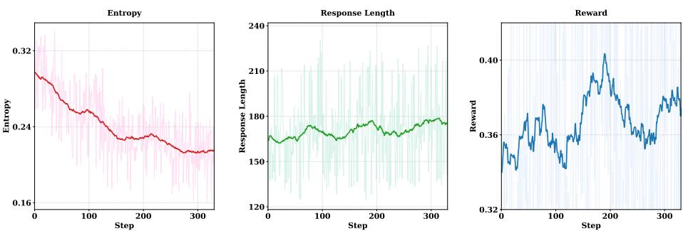  
Fig. 9: Key RL-phase metrics of Embedder-Guided RL (entropy, response length, reward).

Additionally, we track two core training metrics for 2B and 4B-scale Embed-RL models during contrastive learning: contrastive training loss and gradient norm, as presented in Figure 10. Based on our training experience, neither an excessively large nor an overly small converged loss is favorable.An overly large converged loss suggests that the model fails to correctly discriminate positive and negative samples, whereas an excessively small one indicates that in-batch negative samples are too easily distinguished, leaving the model unable to learn effective discriminative information.Proper adjustment of the sampling ratio and sub-batch size is thus required to ensure the model converges correctly.

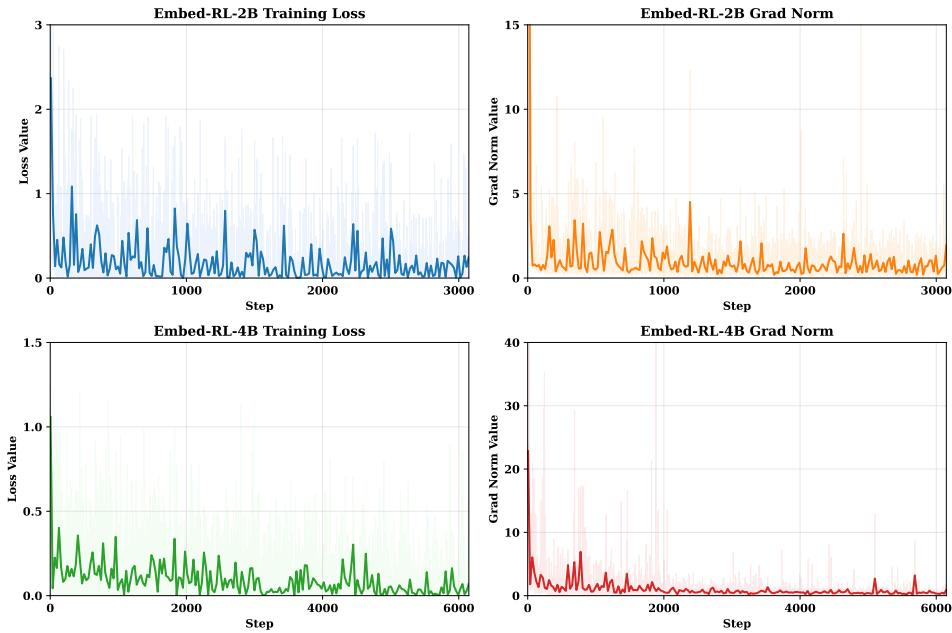  
Fig. 10: Contrastive training loss and gradient norm of 2B and 4B scale Embed-RL models.

# I Efficiency and Latency

The proposed evidential Traceability CoT (T-CoT) demonstrates prominent efficiency advantages and negligible latency overhead compared with traditional generative embedding methods. For any multimodal retrieval target, T-CoT only needs to be generated once offline, and the derived multimodal embedding vector can be directly stored in the retrieval database. This is different from generative embedding approaches that require on-the-fly reasoning chain and embedding generation for each query, which leads to repeated computational costs. Designed to be targeted and concise, T-CoT only extracts core retrievalrelated multimodal cues such as text keywords, image bounding boxes and video keyframes while abandoning redundant content. This ensures it does not significantly increase single embedding inference latency. Additionally, the stable semantic representation of T-CoT-based embeddings allows for long-term caching and reuse in subsequent tasks without frequent re-generation or updates. This further reduces inference latency and computational consumption in largescale scenarios and makes the framework more suitable for practical industrial deployment.

# J Limitations

This work has several notable limitations. First, the weight coefficients of the multi-component reward function are empirically set for simplicity, lacking an adaptive optimization mechanism for diverse multimodal tasks, which may lead to suboptimal performance in specific scenarios. Second, the constructed dataset excludes partial classification tasks, resulting in relatively weak performance on image classification subtasks; we recommend designing additional loss for classification tasks to avoid false negatives while adapting to large-batch contrastive loss. Finally, we have not applied any hard negative sample mining or curriculum learning strategies, which are expected to further enhance the model's discriminative capability and training stability if incorporated.

# K Exploratory Perspectives

In numerous practical systems such as Multimodal Content Understanding, Recommendation Systems (RS), and Retrieval-Augmented Generation (RAG), high-quality Universal Multimodal Embeddings serve as the core foundation supporting downstream tasks. The quality of embeddings directly determines the performance ceiling of downstream tasks—whether it is the matching accuracy of recommendation systems, the answer correctness of RAG systems, or the semantic alignment performance of cross-modal tasks, all are closely related to it. In existing solutions, to extract richer semantic information, multi-dimensional feature fusion is often performed through techniques such as semantic segmentation, image and video fine-grained understanding, and user profile analysis. However, this approach typically incurs additional computational and storage overhead, and the feature fusion module suffers from high design complexity. To address this, we strive to deeply internalize key information capture capabilities, including core visual region localization, video keyframe extraction, and core semantic keyword mining, into the embedding large model itself. This exploration aims to simplify the model structure of feature fusion, reduce the computational and storage costs of semantic vectors, and simultaneously enable embedding results to naturally incorporate task-relevant core semantic information.

# L Comparative Examples of T-CoT Before and After Embedder-Guided RL

Figures 11 to 8 present additional comparative examples of T-CoT before and after the application of Embedder-Guided Reinforcement Learning. These examples fully demonstrate that after RL optimization, the Reasoner achieves more accurate localization of key regions and exhibits improved embedding quality, which further validates the effectiveness of the proposed EG-RL approach in enhancing the performance of T-CoT.

# Text-Image → Text

# Query:

Represent the given image with the following question: Is the plastic bowl to the left of the bread on the right?

# Query T-CoT Before RL:

<thinking> The image shows a meal in bento boxes on a checkered tablecloth. The bread is not visible; instead, there are apple slices in a clear plastic container on the top left and rice in a blue container on the bottom left. The \"bread\" mentioned in the question is not present in the image. The plastic bowl (containing apple slices) is on the left side of the image, but there is no bread to its right. {\"bbox_2d\": [100, 0, 450, 250]]}</thinking>\n<rethink> The plastic bowl with apple slices is located on the left, but there is no bread visible anywhere in the image, so the condition \"to the left of the bread on the right\" cannot be evaluated as true or false./rethink? \n<answer>No, there is no bread visible in the image, so the plastic bowl is not to the left of the bread on the right.</answer>

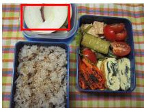

# Failed to ground.

Similarity: 0.5742

# Query T-CoT After RL:

<thinking> The image shows a meal in bento-style containers on a checkered tablecloth. On the right side, there is a container with bread (specifically, sliced bread with spinach) and vegetables. To the left of this container, there is a plastic bowl containing sliced apples. The question asks if the plastic bowl is to the left of the bread on the right. The plastic bowl is indeed located to the left of the bread container. {\"bbox_2d\": [[105, 0, 437, 280], [437, 105, 870, 720]]}</thinking>\n<rethink>The plastic bowl with apples is positioned to the left of the container with bread and vegetables, which is on the right side of the image. This confirms the spatial relationship described in the question.</rethink: \n<answer>Yes, the plastic bowl is to the left of the bread on the right.</answer"

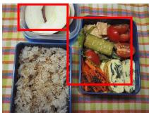

Similarity: 0.7070

# Ground to accurate information.

# Target:

Yes, the bowl is to the left of the bread. Target T-CoT:   
<thinking? The task involves spatial reasoning about object placement. The output confirms a relative position: \"bowl" is to the \"left of the bread.\" Key concepts include object names and directional relationship. {\"text_keywords\": '[\"bowl\", \"bread\", \"left\", \"Yes\"]}/thinking>\n<rethink>The keywords indicate a spatial relationship between two objects, with a clear affirmative confirmation of their relative positioning.</rethink>\n<answer The text confirms that the bowl is positioned to the left of the bread.</answer> Fig. 11: Example 4 of T-CoT Before and After EG-RL.

# Text-Image → Text #

Represent the given image with the following question: What is needed to use this transportation?

# Query T-CoT Before RL:

<thinking The image shows a black car being lifted by a car lift, with a person in a blue shirt and red cap operating the lift. The car is on a platform, and the lift mechanism is visible. The key visual element is the car lift, which requires electricity to operate. {\bbox_2d\": [550, 340, 997, 997]}/thinking>\n<rethink>The car lift in the image is a mechanical device that requires power to function, so electricity is needed to use this transportation-related equipment.</rethink>\n<answer>Electricity is needed to use this transportation.</answer>

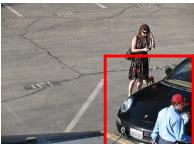

# Missed grounding.

Similarity: 0.4141

# Query T-CoT After RL:

<thinking> The image shows a black car parked on a ramp, with a man in a red cap and blue shirt appearing to work on or inspect it. The car is positioned on a loading ramp, suggesting it is being loaded or unloaded, likely for transport. To use this type of transportation (a car), one typically needs a'driver and a vehicle in operational condition. The man's activity implies he may be a mechanic or technician, indicating that maintenance or preparation is needed. The key visual elements are the car and the man interacting with it. {\"bbox_2d\": [[540, 350, 997, 930], [700, 610, 950, 997]]}/thinking>\n<rethink> The car is the primary transportation vehicle, and the man's presence suggests that maintenance or preparation is required to use it. The ramp indicates it may be part of a transport or loading process, reinforcing the need for operational readiness.</rethink>\n<answer To use this transportation, a driver and a properly maintained vehicle are needed.</answer>

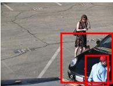

Similarity: 0.6055

# Complete grounding.

Target: driver Target T-CoT: <thinking? The task requires identifying key concepts from the positive text output "driver". The word "driver" is a noun and likely refers to a person who operates a vehicle or a software component that controls hardware. Key concepts include the role or function implied by the term. {\"text_keywords\" [\"driver\", \"person\", \"vehicle\", \"software", \"hardware\"]}/thinking\n<rethinkThe term \"driver\" is contextually ambiguous but commonly refers to either a human operator or a software component; both interpretations are valid based on common usage.</rethink> \n<answer> The text output \"driver\" refers to either a person who operates a vehicle or a software component that interfaces with hardware.</answer> Fig. 12: Example 5 of T-CoT Before and After EG-RL.

# Text-Video → Text #

Who did Chandler think was "the other guy" after Joey said he had a feeling Katy was into some other guy?

# Query T-CoT Before RL:

<thinking>The video frames show two men, Chandler and Joey, engaged in a conversation. Their expressions and body language suggest a comedic exchange. The question references a specific line from' the show \"Friends\" where Chandler jokes that Joey is \"the other guy\" after Joey expresses concern about Kathy. The visual content aligns with this scene, showing the characters interacting in a way consistent with their dynamic. {\"key_frames\": [1, 2, 3, 4, 5, 6, 7, 8]}/thinking>\n<rethink>The frames depict Chandler and Joey in a familiar setting, with their expressions and gestures indicating a humorous dialogue. This matches the context of the question, which references a well-known joke from the show.</rethink>\n<answer> Chandler/answer> Similarity: 0.6719

# Excessive attention to non-key points.

# Query T-CoT After RL:

<thinking>The video frames show two men, Joey and Chandler, engaged in a conversation. In frames 1, 3, and 7, Chandler appears to be reacting with surprise or disbelief, which aligns with his character's comedic response to Joey's statement about Kathy. The context of their interaction and Chandler's facial expressions suggest he is reacting to Joey's comment about \"the other guy." {\"key_frames" [1, 3, 7]}</thinking\n<rethink>Chandler'ssurprised reaction in frames 1, 3, and 7 indicates he is responding to Joey's claim about Kathy being interested in someone else, which is consistent with his character's typical behavior in this scenario.</rethink \n<answer>Chandler thought it was himself.</answer>

# Similarity: 0.7773

Focus on key points. Target: Chandler thinks the \"other guy" is himself.

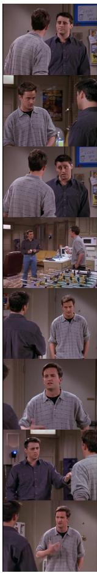  

Target T-CoT : <thinking? The output states a belief held by Chandler regarding \"the other guy.\" The key elements are Chandler's perspective, the phrase \"the other guy,\" and the selfreferential conclusion that it is himself. {\"text_keywords\": [""Chandler\", \"the other guy\", \"himself\", \"thinks\"]}/thinking\n<rethink The keywords indicate that the output is a statement of Chandler's belief that \"the other guy\" refers to himself, implying self-awareness or confusion.</rethink>\n<answer>Chandler believes that \"the other guy\" refers to himself./answer Fig. 13: Example 6 of T-CoT Before and After EG-RL.

# Text → Video #

A young girl does gymnastics outside in the middle of grass in a sunlight.

# Query T-CoT:

<thinking The description specifies a young girl performing gymnastics outdoors on grass under sunlight. Key visual elements include the subject (young girl), activity (gymnastics), location (grass), and environmental condition (sunlight). These are critical for video retrieval to match the correct visual content. {"text_keywords\": [\"young gir|\", "gymnastics\", \"outside\", \"grass\", \"sunlight\"]}/thinking>\n<rethink>The task requires identifying a video of a young girl doing gymnastics on grass in sunlight, so the retrieval should prioritize these core visual concepts to ensure accurate match.</rethink \n<answerA video of a young girl performing gymnastics on grass outdoors under sunlight.</answer>

# Target T-CoT Before RL:

<thinking?The video shows a young girl in a green top and pink skirt playing energetically on a grassy lawn in front of buildings. Frame 1 shows her posing, Frame shows her smiling and moving, Frame 3-5 capture her performing a cartwheel, and Framhos arem il another child. These frames represent the main actions and the conclusion. {\"key_frames\": [1, 2, 3, 5, 7, 8]}/thinking>\n<rethinkThe key frames (1, 2, 3, 5, 7, 8] capture the girl's initial pose, her joyful movement, the cartwheel action, her running toward the camera, and the final embrace with another child, showing the full sequence of play and interaction./rethink \n<answer The video shows a young girl in a green top and pink skirt playing on a grassy lawn in front of buildings. She poses, runs, performs a cartwheel, and then runs toward the camera before hugging another child in a final photo.</answer>

# Similarity: 0.4961

# Overly detailed and off-topic.

Target T-CoT After RL :   
<thinking> The video shows a young girl playing energetically on a grassy lawn in front of buildings. Frame 1 establishes the setting and the girl's initial pose. Frames 2-5 capture her dynamic movements, including a jump and a handstand. Frame 6 shows her running toward the camera. Frame 7 shows her running closer while smiling. Frame 8 ends with her hugging another child. These frames represent the key actions and transitions.{\"key_frames\": [1, 3, 5, 6, $\angle 1$ thinking\n<rethink The key frames (1, 3, 8 capture the sequene inial pos, acrobac moves, runnig toward camera, and the final embrace, showing the progression of playful activity.</rethink>\n<answer> The video shows a young girl in a turquoise top and pink skirt playing on a grassy lawn in front of buildings. She performs a jump and a handstand, then runs toward the camera ending with her hugging another child./answer>

# Similarity: 0.5664

Concise and query-aligned.

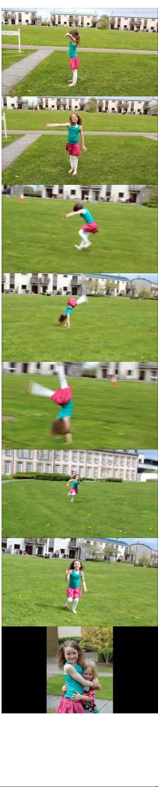  
Fig. 14: Example 7 of T-CoT Before and After EG-RL.