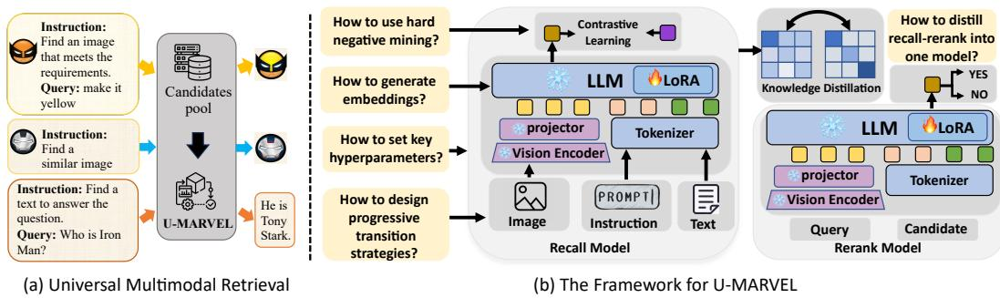
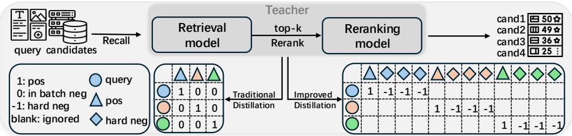

# 1. Bibliographic Information
## 1.1. Title
The paper's title is *U-MARVEL: Unveiling Key Factors for Universal Multimodal Retrieval via Embedding Learning with MLLMs*. Its central topic is to systematically identify critical design factors that drive the performance of Multimodal Large Language Model (MLLM) based universal multimodal retrieval (UMR) systems, and introduce a unified, state-of-the-art framework built on these findings.
## 1.2. Authors
The authors and their affiliations are:
- Xiaojie Li: Tencent PCG (Platform and Content Group), Nanjing University
- Chu Li: ByteDance
- Shi-Zhe Chen: Tencent PCG (corresponding author)
- Xi Chen: Tencent PCG (corresponding author)
  All authors have strong industrial and academic backgrounds in multimodal learning, large language model optimization, and information retrieval, supported by leading tech firms (Tencent, ByteDance) with extensive experience in real-world retrieval system deployment.
## 1.3. Journal/Conference
The work is published as a preprint on arXiv, the leading open-access preprint server for computer science research. As of 2026-04-21, it has not yet been formally accepted for peer-reviewed conference or journal publication, but its state-of-the-art results have drawn significant attention from the multimodal retrieval community.
## 1.4. Publication Year
2025 (preprint published UTC 2025-07-20)
## 1.5. Abstract
This work addresses the gap that existing MLLM-based UMR methods all adopt contrastive learning but use ad-hoc, unvalidated training recipes, leading to suboptimal performance and limited generalization. The core methodology involves: (1) implementing a general MLLM-based embedding learning pipeline, (2) systematically ablating design choices across embedding generation, training strategies, and distillation methods, and (3) building the unified U-MARVEL framework based on the findings. The main results show U-MARVEL outperforms state-of-the-art competitors by a large margin on the M-BEIR UMR benchmark in supervised settings, and achieves strong zero-shot performance on unseen tasks including composed image retrieval and text-to-video retrieval. The key conclusion is that often-overlooked design choices have a substantial impact on UMR performance, and the proposed framework delivers strong generalization across diverse retrieval tasks.
## 1.6. Original Source Link
- Preprint page: https://arxiv.org/abs/2507.14902
- PDF link: https://arxiv.org/pdf/2507.14902
- Publication status: Preprint

# 2. Executive Summary
## 2.1. Background & Motivation
### Core Problem
Universal Multimodal Retrieval (UMR) refers to retrieval tasks where both queries and candidates can be any combination of modalities (text, image, etc.), guided by natural language instructions (e.g., "find a blue version of the dress in this image"). UMR is a foundational technology for real-world applications including retrieval-augmented generation (RAG), cross-modal search, and visual question answering.
### Existing Gap
Recent MLLM-based UMR methods have delivered strong performance, but all rely on contrastive learning with ad-hoc, unvalidated training recipes. There is no systematic analysis of which design choices actually drive retrieval performance, leading to suboptimal accuracy, poor generalization, and inefficient training/inference pipelines.
### Innovative Entry Point
This work conducts a comprehensive, controlled ablation study of the entire design space for MLLM-based UMR embedding models, uncovering overlooked critical factors, then combines the optimal choices into a unified, high-performance framework.
## 2.2. Main Contributions / Findings
### Key Findings
1.  For embedding extraction from decoder-only MLLMs, bidirectional attention with mean pooling (no compression prompt) outperforms the widely used last-token + compression prompt method.
2.  Masking instruction tokens during mean pooling reduces bias and improves retrieval performance.
3.  A 3-stage progressive training curriculum (text retrieval → cross-modal alignment → multimodal instruction tuning) smooths the transition of decoder-only MLLMs from generation tasks to retrieval tasks, avoiding catastrophic forgetting.
4.  In contrastive learning, batch size must be scaled with learning rate to deliver performance gains, and learnable temperature parameters significantly outperform fixed temperature settings.
5.  Filtered hard negative mining (removing false negatives above a similarity threshold) avoids training collapse while improving model discriminability.
6.  An improved knowledge distillation method reduces the computational cost of distilling a recall-then-rerank pipeline into a single embedding model by ~96%, while closing 68% of the performance gap between the two-stage pipeline and single embedding model.
### Primary Contributions
1.  The first systematic exploration of the MLLM-based UMR design space, providing actionable, validated best practices for the research community.
2.  The U-MARVEL unified framework, which achieves new state-of-the-art performance on the M-BEIR benchmark in both single-model and two-stage supervised settings, and delivers strong zero-shot generalization across unseen retrieval tasks.

# 3. Prerequisite Knowledge & Related Work
## 3.1. Foundational Concepts
All concepts are defined for beginner readers:
- **Multimodal Large Language Model (MLLM)**: An extension of large language models that can process and understand multiple modalities (text, images, video) as input, rather than just text. Examples include Qwen2-VL, LLaVA, and Gemini.
- **Universal Multimodal Retrieval (UMR)**: A retrieval paradigm that supports arbitrary combinations of query and candidate modalities (text query → image, image + text query → text, etc.) and follows natural language instructions to define the retrieval goal.
- **Contrastive Learning**: A learning paradigm where the model is trained to pull semantically similar sample pairs close together in the embedding space, and push dissimilar pairs far apart. It is the de facto standard training objective for retrieval models.
- **InfoNCE Loss**: The most widely used contrastive loss for retrieval tasks, which calculates the log probability that a positive (matching) query-candidate pair is more similar than all negative (non-matching) pairs in a training batch.
- **Embedding**: A low-dimensional dense vector representation of an input (text, image, etc.), where semantically similar inputs have high cosine similarity between their embeddings. Retrieval systems compare embedding similarities to find matching candidates efficiently.
- **Decoder-only LLM**: The transformer architecture used by models like GPT, LLaMA, and Qwen, which originally uses causal (unidirectional) attention: each token can only attend to previous tokens in the sequence, to support autoregressive text generation.
- **Low-Rank Adaptation (LoRA)**: A parameter-efficient fine-tuning method that only trains small low-rank matrices inserted into transformer attention layers, rather than all model parameters, reducing the number of trainable parameters by 1000x or more, making fine-tuning of 7B+ models feasible on mid-range GPUs.
- **Hard Negative Mining**: A contrastive training strategy that selects "hard" negatives: samples that are semantically similar to the query but not correct matches, to force the model to learn more discriminative features.
- **Recall-then-Rerank Pipeline**: A standard two-stage industrial retrieval system: 1) A fast embedding-based recall model retrieves the top-K most similar candidates from the full candidate pool; 2) A more accurate but slower reranker model reorders these top-K candidates to produce the final ranking.
- **Knowledge Distillation**: A model compression technique where a small "student" model is trained to mimic the outputs of a larger, more accurate "teacher" model, so the student achieves near-teacher performance with lower inference latency.
## 3.2. Previous Works
### Foundational Cross-Modal Retrieval
CLIP (Radford et al., 2021) is the foundational work for modern cross-modal retrieval, which aligns image and text embeddings using contrastive learning on 400 million image-text pairs, enabling zero-shot cross-modal retrieval. However, CLIP cannot handle complex multimodal queries (e.g., image + text) or follow natural language instructions, so it is not suitable for UMR tasks.
The standard InfoNCE loss used in CLIP and all subsequent UMR works is defined as:
$$
\mathcal{L}_{\text{InfoNCE}} = -\mathbb{E}\left[\log \frac{\exp(\text{sim}(q, c^+) / \tau)}{\exp(\text{sim}(q, c^+) / \tau) + \sum_{i=1}^{N} \exp(\text{sim}(q, c_i^-) / \tau)}\right]
$$
Where:
- $q$: Embedding of the query
- $c^+$: Embedding of the positive (matching) candidate
- $c_i^-$: Embedding of the i-th negative (non-matching) candidate
- $\text{sim}(\cdot, \cdot)$: Cosine similarity function, ranging from -1 (opposite semantics) to 1 (identical semantics)
- $\tau$: Temperature parameter that controls the sharpness of the similarity probability distribution
- $N$: Number of negative samples per query
### MLLM-based UMR Works
Recent state-of-the-art MLLM-based UMR methods include:
1.  **LamRA (Liu et al., 2024b)**: Adapts MLLMs to retrievers using LoRA, with a two-stage recall-rerank pipeline using joint pointwise and listwise loss.
2.  **MM-Embed (Lin et al., 2024)**: Uses MLLM fine-tuning and modality-aware hard negative mining for UMR.
3.  **VLM2Vec (Jiang et al., 2024b)**: Trains vision-language models for general multimodal embedding tasks.
    All these methods use contrastive learning, but none systematically validate their design choices, leading to ad-hoc training recipes.
### Text Embedding for Decoder LLMs
NV-Embed (Lee et al., 2024) found that bidirectional attention + mean pooling outperforms last-token extraction for text-only embedding models based on decoder-only LLMs. This work extends this finding to the multimodal UMR setting.
## 3.3. Technological Evolution
The evolution of cross-modal retrieval follows this timeline:
1.  Pre-2021: Cross-modal retrieval uses separate, task-specific encoders trained on small datasets, with limited generalization across tasks/modalities.
2.  2021: CLIP is released, enabling large-scale aligned cross-modal representations and zero-shot cross-modal retrieval, but only supports single-modality queries and no instruction following.
3.  2023-2024: MLLMs become widely accessible, and researchers start adapting MLLMs to UMR tasks to support complex multimodal queries and instruction following. Works like LamRA and MM-Embed achieve strong performance, but their design choices are unvalidated.
4.  2025: This work conducts the first systematic analysis of MLLM-based UMR design choices, and introduces the U-MARVEL framework that sets a new state of the art.
## 3.4. Differentiation Analysis
Compared to prior MLLM-based UMR works:
1.  Prior works focus on proposing a single model with ad-hoc training recipes, while this work focuses on systematically exploring the entire design space, providing validated best practices for the community.
2.  Prior works either use last-token + compression prompt for embedding extraction, or use mean pooling without analyzing tradeoffs. This work proves bidirectional attention + mean pooling (no compression prompt) is the optimal choice for multimodal embedding extraction.
3.  Prior works use fixed temperature for InfoNCE loss, while this work shows learnable temperature delivers significant performance gains.
4.  Prior works either avoid hard negative mining, or use unfiltered hard negatives that cause training collapse. This work proposes filtered hard negative mining that avoids collapse while improving discriminability.
5.  Prior distillation methods for recall-then-rerank pipelines are computationally prohibitive for large MLLMs, while this work introduces an improved distillation method that reduces compute cost by ~96%.

# 4. Methodology
## 4.1. Principles
The core intuition is that decoder-only MLLMs are originally trained for autoregressive generation, not embedding-based retrieval, so their architecture and training pipeline must be modified to adapt to retrieval tasks. The methodology follows three core principles:
1.  Optimize embedding extraction to capture holistic sequence representations, rather than generation-oriented last-token representations.
2.  Use a progressive training curriculum to smooth the distribution shift from generation to retrieval objectives, avoiding catastrophic forgetting of the MLLM's pre-trained knowledge.
3.  Optimize contrastive training and distillation to improve discriminability while keeping inference latency low for real-world deployment.
    The following figure (Figure 1 from the original paper) illustrates the overall U-MARVEL exploration framework:

    
    *该图像是插图，展示了 U-MARVEL 系统的设计原则和训练策略。在左侧部分，展示了多模态检索的示例，包括如何生成嵌入和使用硬负采样的方法。右侧部分描述了为了将检索和重排模型联合成一个模型的知识蒸馏过程。*

## 4.2. Core Methodology In-depth
### 4.2.1 Adapting Decoder-only MLLMs to Embedding Models
Decoder-only MLLMs natively use causal (unidirectional) attention for generation, which is suboptimal for embedding extraction, as it cannot attend to all tokens in the sequence to build a holistic representation. This work explores three components of this adaptation:
#### 4.2.1.1 Embedding Extraction
The paper systematically compares two widely used embedding extraction methods:
1.  **Last Token Method (used in most prior UMR works)**: Appends a compression prompt to the end of the input sequence, e.g., for input $<image> <text>$, the full sequence is $<image> <text> Summarize above image and sentence in one word: <emb>$. The embedding of the final $<emb>$ token is used as the sequence embedding. This uses the MLLM's native causal attention.
2.  **Mean Pooling Method**: First modifies the MLLM's attention to bidirectional attention (all tokens can attend to every other token, like BERT encoder models). Then takes the last-layer hidden states of all non-special tokens, averages them (mean pooling) to produce the sequence embedding.
    The optimal configuration, validated via ablation, is **bidirectional attention + mean pooling without a compression prompt**, which outperforms the standard last-token method by 0.6% local average and 0.4% global average on M-BEIR. The performance gain comes from avoiding recency bias in the last-token method, which overweights the final tokens in the sequence.
#### 4.2.1.2 Instruction Integration
UMR inputs are structured as `[instruction] + [query]`, where the instruction defines the retrieval goal (e.g., "find a fashion image matching this description"). During mean pooling, the paper proposes **masking all instruction tokens** when calculating the average, only pooling tokens from the query itself.
This improves performance by 0.1% local average and 0.3% global average. The intuition is that the instruction already influences the query's token representations via bidirectional self-attention, so including instruction tokens in the pooling step introduces unnecessary bias, as retrieval similarity only depends on query and candidate content, not the instruction itself.
#### 4.2.1.3 Progressive Transition
To avoid the large distribution shift between the MLLM's original generation objective and the retrieval objective, the paper proposes a 3-stage progressive training curriculum, following the principle of learning from simple to complex tasks:
1.  **Stage 1: Text Retrieval Adaptation**: Fine-tune the MLLM on text-only retrieval datasets (e.g., NLI dataset) using InfoNCE loss, to build foundational single-modality retrieval capability.
2.  **Stage 2: Cross-modal Alignment**: Fine-tune the model on text-image paired retrieval datasets (e.g., CC3M) using InfoNCE loss with bidirectional attention, to align text and image representations in the embedding space.
3.  **Stage 3: Instruction-tuned Multimodal Retrieval**: Fine-tune the model on the target UMR dataset (M-BEIR) with instruction-guided multimodal tasks, to adapt to complex UMR requirements.
    This progressive training improves performance by 1.1% local average and 1.9% global average compared to directly fine-tuning on M-BEIR, as it smooths the transition from causal attention generation to bidirectional attention retrieval.
---
### 4.2.2 Training MLLM-based Embedders with InfoNCE Loss
All training uses the InfoNCE loss exactly as defined in the paper:
$$
\mathcal{L}_{\text{InfoNCE}} = - \log \frac{\exp(\sin(e_q, e_c^+) / \tau)}{\sum_{i} \exp(\sin(e_q, e_{c^i}) / \tau)}
$$
Where:
- $e_q$: Embedding of the query
- $e_c^+$: Embedding of the positive candidate
- $e_{c^i}$: Embedding of any sample from the candidate set
- $\tau$: Temperature parameter
- $\sin(\cdot, \cdot)$: Cosine similarity between two embeddings
  The paper explores two critical training factors for this loss:
#### 4.2.2.1 Interactions between Batch Size, Learning Rate, and Temperature
Three key validated findings:
1.  **Batch size must be scaled with learning rate**: Larger batch sizes provide more negative samples per query, improving the contrastive signal. However, increasing batch size without scaling learning rate delivers minimal gains (e.g., increasing batch size from 480 to 1920 with fixed learning rate 1e-4 only improves local average from 57.2 to 57.4). Following the linear scaling rule (learning rate scales linearly with batch size) delivers significant gains: batch size 1920 with learning rate 2e-4 achieves local average 58.3, a 0.9% improvement.
2.  **Learnable temperature outperforms fixed temperature**: Prior works use a fixed temperature (e.g., 0.05). Making $\tau$ a learnable parameter that is optimized during training improves performance by 1.4% local average compared to fixed temperature, as it dynamically adjusts the sharpness of the similarity distribution to match the training state and batch size.
#### 4.2.2.2 Filtered Hard Negative Mining
Directly using top-K hard negatives (the most similar negative samples to the query) causes training collapse, as many of these are false negatives: samples that are semantically matching the query but labeled as negatives due to dataset annotation noise. The paper proposes a filtered hard negative mining strategy:
1.  **Feature Extraction**: Use the model from the progressive transition stage to extract embeddings for all training queries and candidates. For each query, rank all candidates by similarity (excluding the positive) to identify hard negatives.
2.  **False Negative Filtering**: Filter out any hard negative with a similarity score above a predefined threshold (0.7 in the paper), as these are assumed to be false negatives.
3.  **Balanced Training**: Select the top-K (K=5) filtered hard negatives per query, mix them with random in-batch negatives, and continue fine-tuning the model with InfoNCE loss.
    This strategy improves performance by 1.1% local average and 1.2% global average without training collapse.
---
### 4.2.3 Improved Reranker Distillation
The two-stage recall-then-rerank pipeline achieves higher performance than a single embedding model, but has higher inference latency. This work proposes an improved distillation method to compress the two-stage pipeline into a single embedding model, with drastically lower compute cost than traditional distillation.
First, build the teacher recall-then-rerank pipeline:
1.  **Train the Reranker**: Use the MLLM backbone to train a generative reranker. For each query, take the positive candidate and top-50 hard negatives from the recall model. The reranker input is `[query] + [candidate]`, and it is trained to output "YES" for positive candidates and "NO" for negative candidates using next-token prediction loss:
    $$
    \mathcal{L}_{\text{rerank}}(\theta) = -\log P_\theta(y \mid \text{query} + \text{candidate})
    $$
    Where $y = \text{YES}$ for positive candidates, $y = \text{NO}$ for negative candidates.
2.  **Fuse Recall and Rerank Scores**: For each query, the recall model retrieves top-K candidates with similarity scores $S_{\text{recall}}$. The reranker produces scores $S_{\text{rerank}}$, the predicted probability of outputting "YES". The final fused teacher score is a linear combination:
    $$
    S_{\text{multi}} = \alpha \cdot S_{\text{recall}} + (1-\alpha) \cdot S_{\text{rerank}}
    $$
    Where $\alpha = 0.5$ in the paper.
Then, distill the teacher into a single student embedding model using KL divergence loss:
$$
\mathcal{L}_{\text{distill}} = D_{KL}(S_{\text{multi}} \parallel S_{\text{single}}) = \sum_{i} S_{\text{multi}}(i) \log \frac{S_{\text{multi}}(i)}{S_{\text{single}}(i)}
$$
Where $S_{\text{single}}$ is the student's similarity score for the i-th candidate, and both scores are softmax-normalized before KL divergence calculation.
Traditional distillation requires calculating teacher scores for all in-batch query-candidate pairs, with $O(n^2)$ complexity per batch (n = batch size), which is prohibitive for large batch sizes used in contrastive learning (would take >340 hours of training). The paper's improved distillation solves this:
- Instead of using all in-batch negatives, only use the positive candidate and top-K (K=50) filtered hard negatives per query, as constructed during hard negative mining.
- Only calculate the teacher's fused score for these triplets, not all in-batch pairs.
  This reduces complexity to $O(nk)$ per batch, cutting training time from 340 hours to 14 hours (~96% reduction), while increasing training sample diversity by 26x. The distillation improves performance by 1.5% local average and 0.8% global average compared to the hard negative mining baseline.
The following figure (Figure 2 from the original paper) illustrates the improved distillation method:

*Figure 2: Distillation Ilustration. It shows how the teacher model generates scores, and compares the traditional and improved distillation methods.*

---
### 4.2.4 Full U-MARVEL Framework
The final U-MARVEL framework combines all optimal design choices into 3 stages:
1.  **Progressive Transition**: Train the model through the 3-stage curriculum using InfoNCE loss with learnable temperature, using bidirectional attention, mean pooling, and instruction masking for embedding extraction.
2.  **Hard Negative Mining and Teacher Construction**: Continue training with filtered hard negative mining to get the recall model. Train the reranker, and build the fused recall-rerank teacher model.
3.  **Improved Distillation**: Distill the teacher model into the single student embedding model to get the final U-MARVEL model.
    A two-stage variant U-MARVEL+ uses the U-MARVEL recall model plus the reranker, fusing their scores for even higher performance at the cost of higher inference latency.

# 5. Experimental Setup
## 5.1. Datasets
### 5.1.1 Training Datasets
1.  **NLI Dataset (Gao et al., 2021)**: Text-only natural language inference dataset with 566k training samples, used for stage 1 of progressive transition. Samples are sentence pairs labeled as entailment (positive) or contradiction (negative).
2.  **CC3M Dataset (Sharma et al., 2018)**: 3.3 million concise image-text pairs collected from web alt text, used for stage 2 of progressive transition. Its short, query-like descriptions are well-aligned with retrieval task requirements.
3.  **M-BEIR Dataset (Wei et al., 2024)**: The main UMR benchmark, covering 8 retrieval tasks across text/image modality combinations, built from 10 datasets across 4 domains (news, wiki, fashion, misc.). It has 1.33 million training queries, 0.19 million test queries, and a 5.6 million candidate pool. It supports two evaluation settings:
    - Local Pool: Each task retrieves from its own task-specific candidate pool, no modality errors.
    - Global Pool: All tasks retrieve from a single combined 5.6 million candidate pool, requiring the model to handle modality matching and semantic similarity.
      Example M-BEIR query: An image of a red dress + instruction "find an image of the same dress in blue", with a candidate pool of fashion images.
### 5.1.2 Zero-Shot Evaluation Datasets
Unseen datasets not used in training, to evaluate generalization:
1.  Cross-modal image-text retrieval: ShareGPT4V (1k queries), Urban-1K (1k queries), Flickr30K (1k queries), CIRCO (800 composed image retrieval queries), GeneCIS (8k queries), Visual Dialog (2k dialog queries), Multi-round FashionIQ (2.4k multi-turn queries), CC-Neg (40k matching queries), Sugar-Crepe (7.5k compositionality queries).
2.  Text-to-video retrieval: MSR-VTT (670 text queries, 27k videos), MSVD (1k text queries, 1k videos). These are zero-shot as U-MARVEL is only trained on image-text data, no video data.
## 5.2. Evaluation Metrics
### 5.2.1 Recall@K (R@K)
1.  **Conceptual Definition**: The percentage of queries where at least one positive candidate appears in the top-K retrieved results. It measures the model's ability to retrieve relevant candidates in the first K positions, which is critical for real-world retrieval systems where users only view the first few pages of results. Higher values indicate better performance.
2.  **Mathematical Formula**:
    $$
    \text{Recall@K} = \frac{1}{Q} \sum_{q=1}^{Q} \mathbb{1}\left( \text{rank}_q(c^+) \leq K \right)
    $$
    Where:
    - $Q$: Total number of queries
    - $\text{rank}_q(c^+)$: Rank of the positive candidate for query $q$ (1 = top result)
    - $\mathbb{1}(\cdot)$: Indicator function, equals 1 if the condition is true, 0 otherwise.
3.  **Usage**: R@10 is used for Fashion200K and FashionIQ datasets; R@5 is used for all other datasets. The average across all tasks is reported as Local Avg. or Global Avg.
### 5.2.2 Mean Average Precision (MAP@K)
1.  **Conceptual Definition**: A more strict metric that measures the average precision of top-K results across all queries, rewarding models that rank relevant candidates higher, rather than just retrieving them in the top-K.
2.  **Mathematical Formula**:
    First, average precision (AP) for a single query:
    $$
    \text{AP@K} = \frac{1}{R} \sum_{k=1}^{K} P(k) \cdot \mathbb{1}(k\text{-th result is relevant})
    $$
    Where $R$ is the total number of relevant candidates for the query, `P(k)` is precision at rank k (number of relevant candidates in top k results divided by k).
    MAP@K is the average of AP across all queries:
    $$
    \text{MAP@K} = \frac{1}{Q} \sum_{q=1}^{Q} \text{AP}_q@K
    $$
3.  **Usage**: Used for the CIRCO zero-shot dataset.
## 5.3. Baselines
The paper compares U-MARVEL with representative state-of-the-art baselines covering all major UMR paradigms:
1.  Pre-MLLM cross-modal models: CLIP-L, SigLIP (foundational contrastive models, no instruction following).
2.  Non-MLLM UMR models: UniIR-BLIP, UniIR-CLIP (UMR models built on BLIP/CLIP, no large MLLM backbone).
3.  MLLM-based UMR models: LamRA-Ret (single-stage recall model), LamRA (two-stage recall-rerank pipeline), MM-Embed, VLM2Vec, UniME (recent SOTA MLLM-based UMR methods).
    These baselines are representative of the full range of current UMR approaches, making the comparisons fair and meaningful.

# 6. Results & Analysis
## 6.1. Core Results Analysis
### 6.1.1 Supervised M-BEIR Local Pool Results
The following are the results from Table 7 of the original paper:

| Methods               | Local Avg. |
|-----------------------|------------|
| CLIP-L                | 32.5       |
| SigLIP                | 37.2       |
| UnilR-BLIP            | 46.8       |
| UnilR-CLIP            | 50.6       |
| LamRA-Ret             | 56.6       |
| **U-MARVEL (single model)** | **63.2** |
| LamRA (two-stage)     | 63.7       |
| **U-MARVEL+ (two-stage)** | **64.8** |

Key observations:
- U-MARVEL single model outperforms the previous best single model LamRA-Ret by 6.6% absolute, a very large margin. It even matches the performance of the two-stage LamRA pipeline, which has significantly higher inference latency, validating that the distillation step successfully transfers reranker performance into the single embedding model.
- U-MARVEL+ outperforms the two-stage LamRA pipeline by 1.1% local average, setting a new state of the art.
### 6.1.2 Supervised M-BEIR Global Pool Results
The following are the results from Table 17 of the original paper:

| Methods               | Global Avg. |
|-----------------------|-------------|
| UnilR-BLIP            | 45.5        |
| UnilR-CLIP            | 48.9        |
| MM-Embed              | 52.7        |
| LamRA-Ret             | 54.9        |
| **U-MARVEL (single model)** | **60.7** |
| LamRA (two-stage)     | 61.4        |
| **U-MARVEL+ (two-stage)** | **61.8** |

U-MARVEL single model outperforms LamRA-Ret by 5.8% global average, and again matches the two-stage LamRA pipeline. This shows U-MARVEL learns robust, task-agnostic features that perform well even in the challenging global pool setting with mixed modalities and tasks.
### 6.1.3 Zero-Shot Results
On zero-shot image-text retrieval tasks (Table 8), U-MARVEL achieves state-of-the-art performance on 9 out of 12 tasks, outperforming VLM2Vec, UniME, and LamRA-Ret. On zero-shot text-to-video retrieval (Table 9), U-MARVEL outperforms all other MLLM-based UMR models despite never being trained on video data:

| Model               | MSR-VTT R@1 | MSVD R@1 |
|---------------------|-------------|----------|
| VLM2Vec             | 43.5        | 49.5     |
| LamRA               | 44.7        | 52.4     |
| LLaVE-7B            | 46.8        | 52.9     |
| **U-MARVEL**        | **47.2**    | **54.6** |

This demonstrates U-MARVEL's strong cross-domain generalization ability.
## 6.2. Ablation Studies
### 6.2.1 Embedding Extraction Ablation (Table 1)

| ID | Causal/Bidirectional | Last/Mean Token | Compression Prompt | Local Avg. | Global Avg. |
|----|----------------------|-----------------|--------------------|------------|-------------|
| 0  | Causal               | Last            | ✓                  | 56.6       | 54.8        |
| 4  | Bidirectional        | Mean            | ×                  | 57.2       | 55.2        |

Bidirectional attention + mean pooling without compression prompt outperforms the standard last-token method by 0.6% local, 0.4% global.
### 6.2.2 Progressive Transition Ablation (Table 3)

| ID | Method | Local Avg. | Global Avg. |
|----|--------|------------|-------------|
| 0  | Direct fine-tune on M-BEIR | 56.6 | 53.9 |
| 1  | + text-only retrieval pre-training | 57.3 | 55.5 |
| 2  | + text-image retrieval pre-training | 57.7 | 55.8 |

Each progressive step improves performance, with the full curriculum delivering 1.1% local, 1.9% global gains over direct fine-tuning.
### 6.2.3 InfoNCE Parameter Ablation (Table 4)

| ID | Batch Size | Temp | LR | Local Avg. |
|----|------------|------|----|------------|
| 0 | 480 | fixed 0.05 | 1e-4 | 57.2 |
| 1 | 1920 | fixed 0.05 | 1e-4 | 57.4 |
| 2 | 1920 | fixed 0.05 | 2e-4 | 58.3 |
| 4 | 3840 | fixed 0.05 | 4e-4 | 58.9 |
| 7 | 3840 | learnable | 4e-4 | 60.1 |

Learning rate must be scaled with batch size to deliver gains, and learnable temperature improves performance by 1.2% over fixed temperature.
### 6.2.4 Hard Negative Mining Ablation (Table 5)

| Method | Local Avg. | Global Avg. |
|--------|------------|-------------|
| Progressive Transition baseline | 60.6 | 58.7 |
| only top-k hard neg | failed | failed |
| in-batch + unfiltered top-k hard neg | 57.4 | 55.4 |
| in-batch + filtered top-k hard neg | 61.7 | 59.9 |

Filtered hard negative mining improves performance by 1.1% local, 1.2% global, while unfiltered hard negatives cause performance drops or training collapse.
### 6.2.5 Distillation Ablation (Table 6)

| Method | Local Avg. | Global Avg. |
|--------|------------|-------------|
| Hard Negative Mining baseline | 61.7 | 59.9 |
| Recall-Rerank Teacher | 64.5 | 61.7 |
| Distilled U-MARVEL | 63.2 | 60.7 |

The distillation closes 68% of the performance gap between the single recall model and the two-stage teacher pipeline, while maintaining single-model inference speed.
### 6.2.6 Backbone Generalization Ablation (Table 16)
When tested on the smaller Qwen3-VL-4B backbone, U-MARVEL achieves 58.8% Local Avg. and 56.2% Global Avg., which outperforms the 7B LamRA-Ret model (56.6% local, 54.9% global). This validates that the U-MARVEL training recipe is robust across model sizes, and even smaller models trained with U-MARVEL outperform larger state-of-the-art models.

# 7. Conclusion & Reflections
## 7.1. Conclusion Summary
This work provides the first systematic, comprehensive analysis of design choices for MLLM-based universal multimodal retrieval, uncovering 6 key overlooked factors that significantly impact performance. Based on these findings, the proposed U-MARVEL framework achieves new state-of-the-art performance on the M-BEIR benchmark in both single-model and two-stage supervised settings, and demonstrates strong zero-shot generalization across unseen retrieval tasks including text-to-video retrieval. The findings provide actionable, validated best practices for the research community to build better, more efficient MLLM-based UMR systems.
## 7.2. Limitations & Future Work (Stated by Authors)
1.  **Modality Support**: The current U-MARVEL only supports text and image modalities; future work will extend it to audio, video, and other modalities.
2.  **RAG Integration**: The performance of U-MARVEL in retrieval-augmented generation (RAG) systems is underexplored; future work will test its integration with LLMs for RAG applications.
3.  **Model Size**: Experiments are limited to 4B and 7B sized models; future work will extend to larger models (e.g., 70B) to explore scaling laws, and smaller models for edge deployment.
## 7.3. Personal Insights & Critique
### Key Inspirations
The systematic ablation approach of this work is highly valuable for the field: rather than proposing a single new "trick", it provides a complete set of validated best practices that any researcher can apply to build better MLLM-based retrieval models. The improved distillation method is a particularly impactful contribution, as it makes distilling high-performance two-stage pipelines into low-latency single models feasible for large MLLMs, which is critical for industrial deployment.
### Transferability
The design principles uncovered in this work can be transferred to other retrieval tasks, including text-only retrieval, cross-lingual retrieval, and domain-specific retrieval (e.g., medical, legal). The progressive training method can also be applied to adapt any decoder-only LLM to embedding tasks.
### Potential Improvements
1.  The current hard negative filtering uses a fixed threshold of 0.7, which may not be optimal across different tasks or datasets. A dynamic, task-adaptive threshold could further improve performance.
2.  The current distillation only uses the fused score of the teacher model; distilling intermediate representations of the reranker could further close the performance gap between the student and teacher.
3.  The current model does not natively support multi-turn conversational retrieval queries; adding support for conversational history would extend its applicability to conversational search applications.
### Unverified Assumptions
The paper assumes that CC3M's concise captions are better for retrieval than detailed captions from datasets like ShareGPT4V, but it does not test if weighted mixing of both datasets could deliver better performance by combining concise retrieval-aligned text and detailed multimodal descriptions. This is a promising direction for future work.