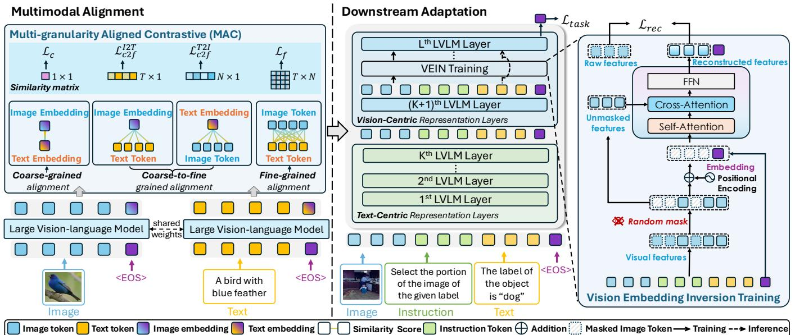
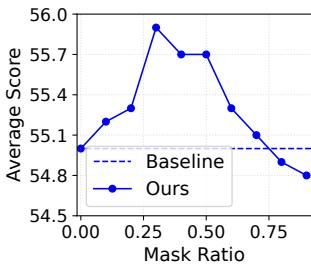
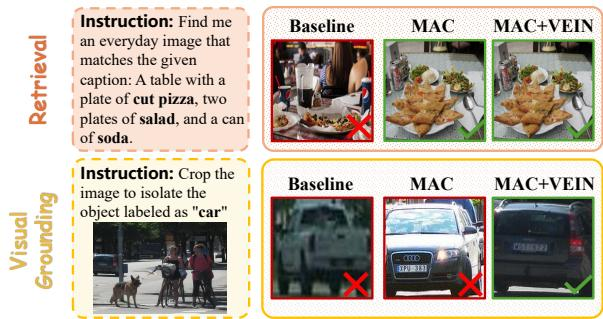

# 1. Bibliographic Information

## 1.1. Title
The central topic of the paper is **FAM: Fine-Grained Alignment Matters in Multimodal Embedding Learning with Large Vision-Language Models**. The title highlights the core contribution of the work: a method named FAM that emphasizes the importance of fine-grained alignment between vision and language modalities when adapting Large Vision-Language Models (LVLMs) for embedding tasks.

## 1.2. Authors
The authors are **Tianhang Xiang**, **Yirui Li**, **Lizhao Liu**, **Hongyan Zhi**, **Chuanshen Chen**, **Qing Du**, and **Mingkui Tan**.
*   **Affiliations:** The authors are affiliated with the **South China University of Technology** (1, 2), **Peng Cheng Laboratory** (2), and **Tencent AI Lab** (3).
*   **Research Background:** The research group appears to be focused on computer vision and multimodal learning, specifically investigating how to effectively leverage large foundation models (like LVLMs) for representation learning and retrieval tasks.

## 1.3. Journal/Conference
The paper does not explicitly state the journal or conference in the provided text, but the references cite **ICLR** (e.g., "VLM2Vec... In ICLR") and **CVPR** (e.g., "Proceedings of the IEEE/CVF Conference on Computer Vision"). Given the citation style and the presence of a "Code" link, it is likely a recent conference submission or a preprint on arXiv. The venue is likely a top-tier AI conference such as ICLR, CVPR, or NeurIPS, given the rigorous technical content and comparison with state-of-the-art models like VLM2Vec.

## 1.4. Publication Year
Based on the references (e.g., citations from 2025 like "Bai et al. 2025" and "Jiang et al. 2025"), the paper was likely published or submitted in **2025**.

## 1.5. Abstract
The paper addresses the challenge of adapting generative **Large Vision-Language Models (LVLMs)** into effective **multimodal embedding models** for tasks like image-text retrieval. The authors identify that directly adapting LVLMs leads to **insufficient visual representation** (loss of detail) and **coarse multimodal alignment**. To solve this, they propose **FAM (Fine-grained Alignment Matters)**, which consists of two main components:
1.  **Multi-granularity Aligned Contrastive (MAC):** A pre-alignment stage using image-text pairs to align features at multiple granularities (coarse, coarse-to-fine, and fine-grained).
2.  **Vision Embedding Inversion (VEIN):** A training strategy during adaptation that reconstructs masked visual features from the embedding, forcing the model to preserve fine-grained visual details.
    Experiments show that FAM achieves superior performance on various downstream multimodal datasets compared to existing methods.

## 1.6. Original Source Link
The original source link is provided as: `uploaded://ab0cc6af-dd45-47a5-9f56-96558de47fa4`.
The PDF link is: `/files/papers/69e6d2d284947a5132b62ec7/paper.pdf`.
The publication status appears to be a **preprint** or **conference paper** given the availability of a PDF and a GitHub repository (`https://github.com/TianhangXiang/FAM`).

# 2. Executive Summary

## 2.1. Background & Motivation
**Core Problem:** The paper tackles the problem of learning unified multimodal representations (embeddings) that can effectively bridge vision and language data. While traditional dual-encoder models like **CLIP** have been successful, they lack complex reasoning capabilities. Recently, researchers have tried to adapt powerful generative **Large Vision-Language Models (LVLMs)** (like LLaVA or Qwen-VL) to serve as embedding models.

**Importance & Challenges:** This transition is important because LVLMs possess strong reasoning abilities. However, the authors identify a critical gap: LVLMs are trained for text *generation*, which biases them towards the language modality and causes them to overlook fine-grained visual details. When these models are directly adapted for *embedding* tasks (like retrieval), they suffer from:
1.  **Insufficient Visual Representation:** The embeddings lose detailed visual information (e.g., specific object attributes).
2.  **Coarse Multimodal Alignment:** The alignment between image and text embeddings is too general, failing to capture fine-grained correspondences.

    **Entry Point:** The authors conducted pilot studies showing that existing methods (like VLM2Vec) perform poorly on tasks requiring fine-grained detail (e.g., matching specific object crops to captions). This motivated the development of FAM to explicitly enforce fine-grained alignment and visual preservation.

## 2.2. Main Contributions / Findings
**Primary Contributions:**
1.  **Problem Identification:** The authors are the first to identify and characterize the issues of insufficient visual representation and coarse alignment when adapting generative LVLMs to embedding models.
2.  **FAM Framework:** A simple yet effective framework comprising two novel techniques:
    *   **Multi-granularity Aligned Contrastive (MAC):** A method to align vision and language features at three distinct levels (coarse, coarse-to-fine, and fine-grained) before task adaptation.
    *   **Vision Embedding Inversion (VEIN):** A training strategy that uses a Transformer decoder to reconstruct masked visual features from the embedding, acting as a regularization signal to preserve visual details.

**Key Findings:**
*   The proposed FAM method significantly outperforms state-of-the-art baselines (like VLM2Vec) on the MMEB benchmark.
*   Both MAC and VEIN contribute positively to performance, with VEIN being most effective when applied to the deeper, "vision-centric" layers of the LVLM.
*   A moderate mask ratio (around 0.3) is optimal for the VEIN reconstruction task, differing from the high mask ratios typically used in pixel-level MAE models.

# 3. Prerequisite Knowledge & Related Work

## 3.1. Foundational Concepts
To understand this paper, one must grasp the following fundamental concepts:

*   **Multimodal Embedding Models:** These are models that map data from different modalities (e.g., images and text) into a shared vector space. In this space, semantically similar items (like a dog and the word "dog") are close together, while dissimilar items are far apart. This is crucial for tasks like **Cross-Modal Retrieval** (searching for images using text).
*   **Large Vision-Language Models (LVLMs):** These are large-scale foundation models (e.g., LLaVA, GPT-4V) that take both images and text as input and generate text as output. They are typically trained on massive amounts of image-text pairs to follow instructions and answer questions.
*   **Contrastive Learning:** A technique used to learn representations by pulling positive pairs (related items) closer and pushing negative pairs (unrelated items) apart in the embedding space. A common loss function used is **InfoNCE**.
    *   *InfoNCE Loss Formula:*
        \$
        \mathcal{L}_{\text{InfoNCE}} = -\log \frac{\exp(\text{sim}(z_i, z_j) / \tau)}{\sum_{k=1}^{K} \exp(\text{sim}(z_i, z_k) / \tau)}
        \$
        Where $z_i$ and $z_j$ are positive pairs, $z_k$ are negatives, $\text{sim}$ is cosine similarity, and $\tau$ is a temperature parameter.
*   **Dual-Encoder vs. Fusion-Encoder:**
    *   *Dual-Encoder (e.g., CLIP):* Uses separate networks for images and text. Efficient for retrieval but limited interaction.
    *   *Fusion-Encoder (e.g., LVLMs):* Fuses image and text tokens inside a deep Transformer network (usually via Cross-Attention). Allows complex reasoning but is computationally heavier.
*   **LoRA (Low-Rank Adaptation):** A parameter-efficient fine-tuning technique. Instead of updating all weights in a large neural network, it adds small, trainable rank-decomposition matrices to the existing weights. This allows adapting large models (like Qwen2-VL) without massive computational resources.

## 3.2. Previous Works
The paper discusses several key lines of prior research:

*   **Multimodal Representation Learning:** Pioneering works like **CLIP** (Radford et al. 2021) and **ALIGN** (Jia et al. 2021) use dual-encoder architectures with contrastive learning on large-scale noisy data. While effective for retrieval, they struggle with complex reasoning and interleaved inputs.
*   **Multimodal Embeddings with LVLMs:** Recent efforts focus on adapting generative LVLMs for embedding tasks.
    *   **VLM2Vec (Jiang et al. 2025):** Constructs the Massive Multimodal Embedding Benchmark (MMEB) and adapts LVLMs using contrastive learning on instruction-formatted data. This serves as the primary baseline for the FAM paper.
    *   **E5-V (Jiang et al. 2024):** Leverages contrastive learning to adapt LVLMs.
    *   **LLaVE (Lan et al. 2025):** Improves representation learning using hardness-weighted contrastive learning.
    *   **UniME (Gu et al. 2025):** Uses a two-stage scheme distilling knowledge from a language expert.

## 3.3. Technological Evolution
The field has evolved from **Dual-Encoders** (efficient but shallow interaction) to **Generative LVLMs** (deep interaction, strong reasoning). The current trend is adapting these powerful LVLMs for **Embedding Tasks** to combine the best of both worlds: the reasoning power of LVLMs and the efficiency/retrieval capability of embedding models. The FAM paper sits at the cutting edge of this trend, addressing specific limitations (visual detail loss) in the latest adaptation methods like VLM2Vec.

## 3.4. Differentiation Analysis
Compared to previous works, specifically **VLM2Vec**, FAM introduces two key differentiations:
1.  **Alignment Stage:** Unlike VLM2Vec, which might directly train on downstream tasks, FAM introduces a dedicated pre-alignment stage (MAC) using raw image-text pairs to explicitly bridge the gap between generative objectives and embedding objectives.
2.  **Visual Preservation:** While other methods focus on aligning the global embedding, FAM introduces **VEIN**, a unique mechanism that actively reconstructs visual features from the embedding. This ensures the embedding retains information that is usually lost in the "pooling" process of generative models.

# 4. Methodology

## 4.1. Principles
The core principle of FAM is an **"Align-Before-Adapt"** paradigm. The authors argue that because LVLMs are trained for generation, their internal representations are not immediately suitable for fine-grained embedding tasks. Therefore, the training is divided into two stages:
1.  **Alignment Stage:** Uses **Multi-granularity Aligned Contrastive (MAC)** to align the vision and language representations at multiple levels (instance, token, cross-modal) using simple image-text pairs.
2.  **Adaptation Stage:** Adapts the aligned model to downstream tasks (like retrieval) while using **Vision Embedding Inversion (VEIN)** to force the model to preserve fine-grained visual details within the embedding vector.

## 4.2. Core Methodology In-depth (Layer by Layer)

### Notations and Preliminaries
The method operates on a Large Vision-Language Model $\mathcal{M}$. Inputs are formatted with instructions:
\$
x_{\text{ins}} = [V; \text{Instruction}; \{\text{instruction}\}; \text{Text}; <\text{EOS}>]
\$
where $V$ denotes visual tokens. The model produces hidden states $\mathbf{H}^l$ at layer $l$. The final embedding $\mathbf{e}_{\text{ins}}$ is taken from the hidden state of the $<\text{EOS}>$ token at the final layer $L$:
\$
\mathbf{e}_{\text{ins}} = \mathcal{M}^L(x_{\text{ins}})[<\text{EOS}>]
\$
We can also access intermediate hidden states for visual and textual tokens:
\$
\mathbf{H}_{\text{img}}^l = \mathbf{H}^l[\text{VIS\_INDEX}], \quad \mathbf{H}_{\text{txt}}^l = \mathbf{H}^l[\text{TXT\_INDEX}]
\$

### Stage 1: Multi-granularity Aligned Contrastive (MAC)
In this stage, the model is trained on a batch of $B$ image-text pairs $\{p^b = (\text{img}^b, \text{txt}^b)\}_{b=1}^B$. The goal is to align features at three granularities.

**Step 1: Coarse-grained Contrastive Alignment**
First, the model establishes a basic alignment between the global image embedding and the global text embedding. We extract the embeddings $\mathbf{e}_{\text{img}}^b$ and $\mathbf{e}_{\text{txt}}^b$. The loss function is defined as:
\$
\mathcal{L}_c = - \frac{1}{B} \sum_{b=1}^{B} \log \frac{\exp(g(\mathbf{e}_{\text{img}}^b, \mathbf{e}_{\text{txt}}^b))}{\sum_{b'=1}^{B} \exp(g(\mathbf{e}_{\text{img}}^b, \mathbf{e}_{\text{txt}}^{b'}))}
\$
Here, $g(\mathbf{u}, \mathbf{v})$ is the scaled cosine similarity function defined as:
\$
g(\mathbf{u}, \mathbf{v}) = \frac{1}{\tau} \frac{\mathbf{u}^{\top} \mathbf{v}}{\|\mathbf{u}\|_2 \|\mathbf{v}\|_2}
\$
where $\tau$ is the temperature parameter. This loss maximizes the similarity between matching image-text pairs while minimizing it for non-matching pairs in the batch.

**Step 2: Coarse-to-Fine Contrastive Alignment**
Next, the model aligns the global embedding of one modality with the *token-level* features of the other modality. This encourages the global representation to be aware of fine-grained parts.
For the Image-to-Text direction, we calculate the similarity between the image embedding $\mathbf{e}_{\text{img}}^i$ and all text token hidden states $\mathbf{H}_{\text{txt}}^j[t]$ of sample $j$:
\$
\mathbf{s}_{\text{I2T}}^{i, j} = \frac{1}{T} \sum_{t=1}^{T} g(\mathbf{e}_{\text{img}}^i, \mathbf{H}_{\text{txt}}^j[t])
\$
where $T$ is the number of text tokens. Symmetrically, for Text-to-Image:
\$
\mathbf{s}_{\text{T2I}}^{i, j} = \frac{1}{N} \sum_{n=1}^{N} g(\mathbf{e}_{\text{txt}}^i, \mathbf{H}_{\text{img}}^j[n])
\$
where $N$ is the number of image patches. The contrastive losses for these directions are:
\$
\mathcal{L}_{c2f}^{\text{I2T}} = - \frac{1}{B} \sum_{b=1}^{B} \log \frac{\exp(\mathbf{s}_{\text{I2T}}^{b, b})}{\sum_{b'=1}^{B} \exp(\mathbf{s}_{\text{I2T}}^{b, b'})}
\$
\$
\mathcal{L}_{c2f}^{\text{T2I}} = - \frac{1}{B} \sum_{b=1}^{B} \log \frac{\exp(\mathbf{s}_{\text{T2I}}^{b, b})}{\sum_{b'=1}^{B} \exp(\mathbf{s}_{\text{T2I}}^{b, b'})}
\$
The total coarse-to-fine loss is the average:
\$
\mathcal{L}_{c2f} = \frac{1}{2} (\mathcal{L}_{c2f}^{\text{I2T}} + \mathcal{L}_{c2f}^{\text{T2I}})
\$

**Step 3: Fine-grained Contrastive Alignment**
Finally, the model aligns features at the finest level: matching individual image patches with individual text tokens. For a pair `(i, j)`, we compute a similarity matrix $\mathbf{S} \in \mathbb{R}^{N \times T}$:
\$
\mathbf{S}_{n, t}^{i, j} = g(\mathbf{H}_{\text{img}}^i[n], \mathbf{H}_{\text{txt}}^j[t])
\$
We aggregate this by taking the mean similarity over all patch-token pairs:
\$
\mathbf{s}_f^{i, j} = \frac{1}{NT} \sum_{n=1}^{N} \sum_{t=1}^{T} \mathbf{S}_{n, t}^{i, j}
\$
The fine-grained contrastive loss is then:
\$
\mathcal{L}_f = - \frac{1}{B} \sum_{b=1}^{B} \log \frac{\exp(\mathbf{s}_f^{b, b})}{\sum_{b'=1}^{B} \exp(\mathbf{s}_f^{b, b'})}
\$
The total alignment loss is the sum of all three:
\$
\mathcal{L}_{\text{align}} = \mathcal{L}_c + \mathcal{L}_{c2f} + \mathcal{L}_f
\$

The following figure (Figure 2 from the original paper) illustrates the overall scheme of FAM, including the MAC alignment stage and the VEIN adaptation stage:

*该图像是示意图，展示了多模态对齐（MAC）和下游适应的过程，包括相似性矩阵、图像与文本嵌入的关系以及任务适应的结构。图中涉及多个层次的视觉语言模型和特征重建方法。*

### Stage 2: Visual-enhanced Adaptation
After alignment, the model is adapted to downstream tasks (e.g., retrieval) defined in the MMEB benchmark.

**Step 1: Adaptation to Downstream Tasks**
Given queries and candidates, the model computes embeddings and applies a standard contrastive task loss:
\$
\mathcal{L}_{\text{task}} = - \frac{1}{B} \sum_{k=1}^{B} \log \frac{\exp(g(\mathbf{e}_q^k, \mathbf{e}_{c^+}^k))}{\sum_{j=1}^{B} \exp(g(\mathbf{e}_q^k, \mathbf{e}_c^j))}
\$

**Step 2: Vision Embedding Inversion (VEIN)**
To ensure the embedding $\mathbf{e}^l$ (at layer $l$) retains visual information, VEIN attempts to reconstruct the visual features from it.
1.  **Masking:** At a specific layer $l$, we extract visual hidden states $\mathbf{H}_{\text{img}}^l$. We randomly mask a proportion $\gamma$ of these tokens using a binary mask $\mathbf{M}$. The masked sequence is:
    \$
    \mathbf{H}_{\text{img, mask}}^l[j] = \begin{cases} \mathbf{m}^l, & \text{if } \mathbf{M}_j = 1 \\ \mathbf{H}_{\text{img}}^l[j], & \text{otherwise} \end{cases}
    \$
    where $\mathbf{m}^l$ is a learnable mask token.
2.  **Decoder Input:** We concatenate the embedding $\mathbf{e}^l$ with the masked visual tokens to form the input for a Transformer decoder $\mathcal{D}$:
    \$
    \mathbf{X}^l = \text{concat}(\mathbf{e}^l, \mathbf{H}_{\text{img, mask}}^l)
    \$
3.  **Reconstruction:** The decoder uses self-attention and cross-attention (where unmasked tokens serve as keys/values) to reconstruct the features:
    \$
    \mathbf{Z}^l = \text{SelfAttn}(\mathbf{X}^l_{\text{pos}})
    \$
    \$
    \mathbf{Z}_{\text{ca}}^l = \text{CrossAttn}(\mathbf{Z}^l, \mathbf{H}_{\text{img, unmask}}^l)
    \$
    \$
    \hat{\mathbf{H}}_{\text{img}}^l = \text{FFN}(\mathbf{Z}_{\text{ca}}^l)
    \$
4.  **Reconstruction Loss:** We calculate the loss only on the masked tokens to ensure the embedding contains enough info to recover them:
    \$
    \mathcal{L}_{\text{rec}} = \frac{1}{|\mathbf{M}|} \sum_{j : \mathbb{I}(\mathbf{M}_j = 1)} [1 - \cos(\hat{\mathbf{H}}_{\text{img}}^l[j], \mathbf{H}_{\text{img}}^l[j])]
    \$
    where $\cos(\cdot, \cdot)$ is cosine similarity.

The authors observe that LVLM layers can be categorized as text-centric or vision-centric. The following figure (Figure 3 from the original paper) shows the layer-wise attention patterns, indicating that deeper layers focus more on vision. VEIN is applied in these "vision-centric" layers (specifically the last 3 layers) for best results.

**Overall Optimization Objective**
The total loss during the adaptation stage combines the task loss and the reconstruction loss:
\$
\mathcal{L}_{\text{adapt}} = \mathcal{L}_{\text{task}} + \mathcal{L}_{\text{rec}}
\$

# 5. Experimental Setup

## 5.1. Datasets
The experiments utilize two main sets of data corresponding to the two training stages:

1.  **Alignment Stage Data:**
    *   **LLAVA-595K:** A large-scale dataset of image-text pairs used for instruction tuning. The authors use the BLIP-2 refined captions.
    *   **Purpose:** This data is used for the **MAC** component to teach the model fine-grained alignment before it sees specific downstream tasks.

2.  **Adaptation Stage Data:**
    *   **MMEB (Massive Multimodal Embedding Benchmark):** This benchmark contains 20 in-distribution datasets covering 4 meta-tasks:
        *   **Classification (Cls.):** 10 datasets.
        *   **Visual Question Answering (VQA):** 10 datasets.
        *   **Multimodal Retrieval (Re.):** 12 datasets.
        *   **Visual Grounding (VG):** 4 datasets.
    *   **Purpose:** These tasks are reformulated as retrieval tasks to train and evaluate the model's embedding capabilities.

## 5.2. Evaluation Metrics
The primary evaluation metric used in the paper is **Precision@1 (P@1)**.

1.  **Conceptual Definition:** Precision@1 measures the accuracy of the top-1 result returned by the model. In a retrieval task, for each query, the model ranks a set of candidates. P@1 checks if the top-ranked candidate is the correct (ground truth) match. It is a strict metric indicating the model's ability to identify the single best match.

2.  **Mathematical Formula:**
    \$
    P@1 = \frac{1}{Q} \sum_{q=1}^{Q} \mathbb{I}(\text{rank}(q, \text{correct\_candidate}) = 1)
    \$
    Alternatively, expressed as a ratio:
    \$
    P@1 = \frac{\text{Number of queries where the top result is correct}}{\text{Total number of queries (Q)}}
    \$

3.  **Symbol Explanation:**
    *   $Q$: The total number of queries in the evaluation set.
    *   $\mathbb{I}(\cdot)$: The indicator function, which is 1 if the condition is true and 0 otherwise.
    *   $\text{rank}(q, \text{correct\_candidate})$: The rank position of the ground truth candidate for query $q$.

        The paper reports the average P@1 score for each meta-task and the overall average across all datasets.

## 5.3. Baselines
The paper compares FAM against several strong baselines:
*   **Dual-Encoder Models:** CLIP, BLIP2, SigLIP, OpenCLIP, UniR.
*   **LVLM-based Models:**
    *   **E5-V:** An early method adapting LVLMs for embeddings.
    *   **VLM2Vec:** The state-of-the-art baseline and the most direct competitor. It adapts LVLMs using contrastive learning on MMEB tasks but lacks the explicit fine-grained alignment and visual reconstruction of FAM.

# 6. Results & Analysis

## 6.1. Core Results Analysis
The main results demonstrate that FAM significantly outperforms existing state-of-the-art methods, particularly the strong baseline VLM2Vec.

*   **Comparison with VLM2Vec:** On the Qwen2-VL-2B backbone, FAM achieves an overall average score of **57.3**, compared to VLM2Vec's **55.0**. This is a gain of +2.3 points.
*   **Consistency:** The improvement is consistent across different model backbones (Qwen2-VL-7B and Phi-3.5-V).
*   **Task-Specific Gains:** The most significant improvements are observed in **Multimodal Retrieval** and **Visual Grounding** tasks. For example, on the Qwen2-VL-2B backbone, the Retrieval score improved from 60.6 to 64.1, and Visual Grounding improved from 67.1 to 70.9. This validates the paper's claim that FAM improves fine-grained visual representation and alignment, which are crucial for grounding and complex retrieval.

    The following are the results from Table 1 of the original paper:

    <table>
    <thead>
    <tr>
    <th rowspan="2">Method</th>
    <th rowspan="2">Backbone</th>
    <th colspan="4">Per Meta-Task Score</th>
    <th colspan="3">Average Score</th>
    </tr>
    <tr>
    <th>Classification</th>
    <th>VQA</th>
    <th>Retrieval</th>
    <th>VG</th>
    <th>IND</th>
    <th>OOD</th>
    <th>Overall</th>
    </tr>
    </thead>
    <tbody>
    <tr>
    <td colspan="2"># Datasets Numbers</td>
    <td>10</td>
    <td>10</td>
    <td>12</td>
    <td>4</td>
    <td>20</td>
    <td>16</td>
    <td>36</td>
    </tr>
    <tr>
    <td colspan="9"><strong>Dual-Encoder-based Models (Zero-shot)</strong></td>
    </tr>
    <tr>
    <td>CLIP (Radford et al. 2021)</td>
    <td></td>
    <td>42.8</td>
    <td>9.1</td>
    <td>53.0</td>
    <td>51.8</td>
    <td>37.1</td>
    <td>38.7</td>
    <td>37.8</td>
    </tr>
    <tr>
    <td>BLIP2 (Li et al. 2023)</td>
    <td></td>
    <td>27.0</td>
    <td>4.2</td>
    <td>33.9</td>
    <td>47.0</td>
    <td>25.3</td>
    <td>25.1</td>
    <td>25.2</td>
    </tr>
    <tr>
    <td>SigLIP (Zhai et al. 2023)</td>
    <td></td>
    <td>40.3</td>
    <td>8.4</td>
    <td>31.6</td>
    <td>59.5</td>
    <td>32.3</td>
    <td>38.0</td>
    <td>34.8</td>
    </tr>
    <tr>
    <td>OpenCLIP (Cherti et al. 2023)</td>
    <td></td>
    <td>47.8</td>
    <td>10.9</td>
    <td>52.3</td>
    <td>53.3</td>
    <td>39.3</td>
    <td>40.2</td>
    <td>39.7</td>
    </tr>
    <tr>
    <td>UniR (BLIP_FF) (Wei et al. 2024)</td>
    <td></td>
    <td>42.1</td>
    <td>15.0</td>
    <td>60.1</td>
    <td>62.2</td>
    <td>44.7</td>
    <td>40.4</td>
    <td>42.8</td>
    </tr>
    <tr>
    <td>UniR (CLIP_SF) (Wei et al. 2024)</td>
    <td></td>
    <td>44.3</td>
    <td>16.2</td>
    <td>61.8</td>
    <td>65.3</td>
    <td>47.1</td>
    <td>41.7</td>
    <td>44.7</td>
    </tr>
    <tr>
    <td>Magiclens (Zhang et al. 2024)</td>
    <td></td>
    <td>38.8</td>
    <td>8.3</td>
    <td>35.4</td>
    <td>26.0</td>
    <td>31.0</td>
    <td>23.7</td>
    <td>27.8</td>
    </tr>
    <tr>
    <td colspan="9"><strong>Dual-Encoder-based Models (Fine-tuning on MMEB Training)</strong></td>
    </tr>
    <tr>
    <td>CLIP-FFT (Radford et al. 2021)</td>
    <td></td>
    <td>55.2</td>
    <td>19.7</td>
    <td>53.2</td>
    <td>62.2</td>
    <td>47.6</td>
    <td>42.8</td>
    <td>45.4</td>
    </tr>
    <tr>
    <td>OpenCLIP-FFT (Cherti et al. 2023)</td>
    <td></td>
    <td>56.0</td>
    <td>21.9</td>
    <td>55.4</td>
    <td>64.1</td>
    <td>50.5</td>
    <td>43.1</td>
    <td>47.2</td>
    </tr>
    <tr>
    <td colspan="9"><strong>LVLM-based Models</strong></td>
    </tr>
    <tr>
    <td>E5-V (Jiang et al. 2024)</td>
    <td>LLaVA-NeXT-8B</td>
    <td>21.8</td>
    <td>4.9</td>
    <td>11.5</td>
    <td>19.0</td>
    <td>14.9</td>
    <td>11.5</td>
    <td>13.3</td>
    </tr>
    <tr>
    <td>VLM2Vec* (Jiang et al. 2025)</td>
    <td>Qwen-2VL-2B</td>
    <td>57.8</td>
    <td>40.9</td>
    <td>60.6</td>
    <td>67.1</td>
    <td>59.8</td>
    <td>49.2</td>
    <td>55.0</td>
    </tr>
    <tr>
    <td>FAM (Ours)</td>
    <td>Qwen-2VL-2B</td>
    <td>58.6</td>
    <td>42.2</td>
    <td>64.1</td>
    <td>70.9</td>
    <td>61.7</td>
    <td>51.8</td>
    <td>57.3</td>
    </tr>
    <tr>
    <td>VLM2Vec* (Jiang et al. 2025)</td>
    <td>Phi-3.5-V</td>
    <td>52.7</td>
    <td>50.8</td>
    <td>59.3</td>
    <td>81.0</td>
    <td>63.2</td>
    <td>50.4</td>
    <td>57.5</td>
    </tr>
    <tr>
    <td>FAM (Ours)</td>
    <td>Phi-3.5-V</td>
    <td>53.8</td>
    <td>50.9</td>
    <td>61.2</td>
    <td>83.1</td>
    <td>64.8</td>
    <td>51.1</td>
    <td>58.7</td>
    </tr>
    <tr>
    <td>VLM2Vec* (Jiang et al. 2025)</td>
    <td>Qwen-2VL-7B</td>
    <td>61.3</td>
    <td>47.8</td>
    <td>65.5</td>
    <td>75.8</td>
    <td>65.6</td>
    <td>54.2</td>
    <td>60.5</td>
    </tr>
    <tr>
    <td>FAM (Ours)</td>
    <td>Qwen-2VL-7B</td>
    <td>62.1</td>
    <td>47.5</td>
    <td>68.0</td>
    <td>78.9</td>
    <td>66.5</td>
    <td>56.1</td>
    <td>61.9</td>
    </tr>
    </tbody>
    </table>

## 6.2. Ablation Studies / Parameter Analysis

The authors conducted comprehensive ablation studies to validate the design choices of FAM.

**Effect of MAC and VEIN**
The following are the results from Table 2 of the original paper:

<table>
<thead>
<tr>
<th rowspan="2">Method</th>
<th rowspan="2">MAC</th>
<th rowspan="2">VEIN</th>
<th colspan="4">Meta-Task Avg. Score</th>
<th rowspan="2">Avg.</th>
</tr>
<tr>
<th>Cls.</th>
<th>VQA</th>
<th>Re.</th>
<th>VG</th>
</tr>
</thead>
<tbody>
<tr>
<td>VLM2Vec</td>
<td>-</td>
<td>-</td>
<td>57.8</td>
<td>40.9</td>
<td>60.6</td>
<td>67.1</td>
<td>55.0</td>
</tr>
<tr>
<td>FAM (Ours)</td>
<td>✓</td>
<td>X</td>
<td>58.5</td>
<td>39.8</td>
<td>64.0</td>
<td>70.3</td>
<td>56.4</td>
</tr>
<tr>
<td>FAM (Ours)</td>
<td>X</td>
<td>✓</td>
<td>58.4</td>
<td>42.9</td>
<td>60.2</td>
<td>69.2</td>
<td>55.9</td>
</tr>
<tr>
<td>FAM (Ours)</td>
<td>✓</td>
<td>✓</td>
<td>58.6</td>
<td>42.2</td>
<td>64.1</td>
<td>70.9</td>
<td>57.3</td>
</tr>
</tbody>
</table>

*   **Analysis:** Removing either MAC or VEIN leads to a performance drop compared to the full FAM model.
    *   With only MAC: Avg score 56.4.
    *   With only VEIN: Avg score 55.9.
    *   With both: Avg score 57.3.
    *   This confirms that both components contribute to the final performance, addressing different aspects (alignment vs. visual preservation).

**Effect of VEIN Mask Ratio ($\gamma$)**
The authors investigated the impact of the mask ratio in the VEIN module. The following figure (Figure 4 from the original paper) shows the results:

*该图像是图表，展示了不同掩码比例对平均得分的影响。可以看出，适中的掩码比例（例如，0.3）获得了最佳准确性。*

*   **Analysis:** The performance peaks at a mask ratio of **0.3**. Interestingly, unlike Masked Autoencoders (MAE) for pixels which often use high mask ratios (e.g., 0.75), VEIN performs worse with high ratios (above 0.8). The authors attribute this to the fact that VEIN operates on semantic feature-level representations, where excessive masking destroys the structural context needed for reconstruction.

**Effect of VEIN Insert Positions**
The authors analyzed where to insert the VEIN module within the LVLM layers.

The following are the results from Table 5 of the original paper:

<table>
<thead>
<tr>
<th>VEIN Conduct Position</th>
<th>Avg.</th>
</tr>
</thead>
<tbody>
<tr>
<td>N/A</td>
<td>55.0</td>
</tr>
<tr>
<td>All Layers</td>
<td>54.2</td>
</tr>
<tr>
<td>Last Layer</td>
<td>55.3</td>
</tr>
<tr>
<td>Second to Last Layer</td>
<td>55.6</td>
</tr>
<tr>
<td>Third to Last Layer</td>
<td>55.2</td>
</tr>
<tr>
<td>Last Three Layers</td>
<td>55.9</td>
</tr>
</tbody>
</table>

*   **Analysis:** Applying VEIN to "All Layers" actually harms performance (54.2 vs 55.0). The best performance is achieved when applying VEIN to the **Last Three Layers** (55.9). This supports the authors' hypothesis that deeper layers in LVLMs are more "vision-centric" and thus better suited for visual feature reconstruction tasks.

**Qualitative Results**
The following figure (Figure 5 from the original paper) provides qualitative examples of retrieval and visual grounding tasks. It shows that FAM successfully retrieves images matching complex captions (e.g., "cut pizza, salad and soda") and accurately grounds objects (e.g., a specific car color/shape), demonstrating its fine-grained understanding.

*该图像是插图，展示了VLM2Vec模型在MMEB基准上进行检索和视觉定位任务的定性示例。图中分别展示了基线方法与应用MAC和VEIN后，如何在给定说明下获取更合适的图像。左侧为检索任务，右侧为视觉定位任务，显示了不同方法的效果对比。*

# 7. Conclusion & Reflections

## 7.1. Conclusion Summary
The paper successfully addresses the limitations of adapting generative LVLMs to embedding models. The authors identified that direct adaptation leads to insufficient visual representation and coarse alignment. They proposed FAM, a two-stage framework featuring **Multi-granularity Aligned Contrastive (MAC)** for pre-alignment and **Vision Embedding Inversion (VEIN)** for visual preservation during adaptation. Extensive experiments on the MMEB benchmark demonstrate that FAM achieves state-of-the-art performance, significantly outperforming the baseline VLM2Vec.

## 7.2. Limitations & Future Work
*   **Limitations:** The paper does not explicitly list major limitations in the conclusion, but the methodology implies increased training complexity (two stages) and the need for extra alignment data (LLAVA-595K).
*   **Future Work:** The authors mention plans to explore FAM on "more diverse and higher-resolution settings" in the future. This suggests that the current work might be focused on standard resolutions, and scaling up is a natural next step.

## 7.3. Personal Insights & Critique
*   **Innovation:** The identification of the "visual-centric" layers for applying VEIN is a particularly insightful contribution. It shows a deep understanding of LVLM internals rather than just applying a standard MAE loss blindly.
*   **Effectiveness:** The gains in Visual Grounding and Retrieval are substantial. This suggests that FAM is highly relevant for real-world applications where precision matters (e.g., e-commerce search, medical imaging).
*   **Potential Issues:** The VEIN module introduces a Transformer decoder into the training loop. While the paper states it incurs "no additional inference overhead," it does add computational cost and memory usage during the training phase.
*   **Transferability:** The concept of "Embedding Inversion" (reconstructing input features from the embedding to enforce information retention) is a powerful idea that could likely be transferred to other domains, such as audio-text embeddings or even purely textual embeddings where specific details (like numbers or names) might be lost.