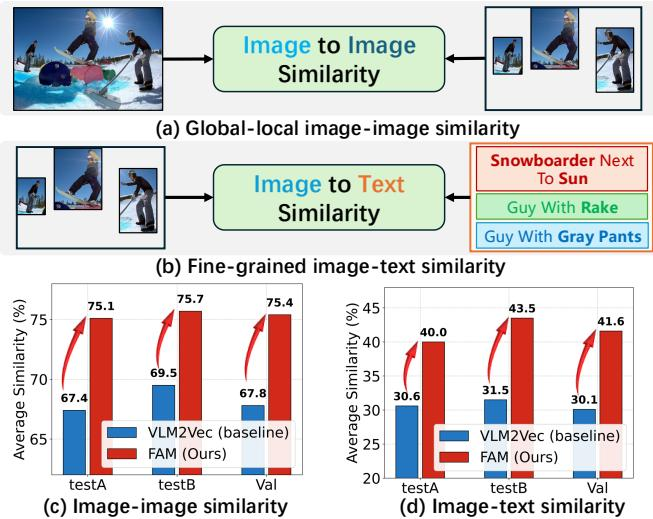
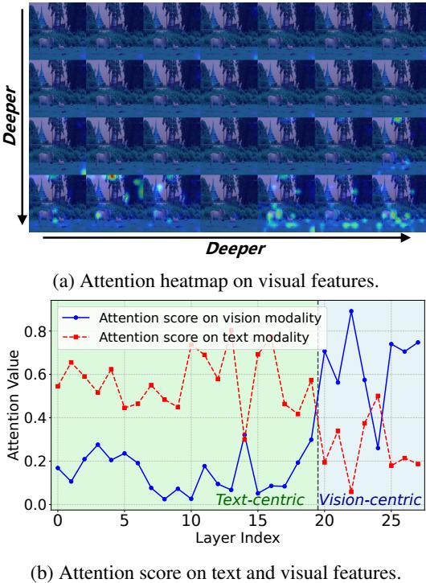

# FAM: Fine-Grained Alignment Matters in Multimodal Embedding Learning with Large Vision-Language Models

Tianhang Xiang1, 2, Yi $\mathbf { L i } ^ { 1 : }$ , Lizhao Liu3, Hongyan $\mathbf { Z } \mathbf { h } \mathbf { i } ^ { 1 }$ , Chuanshen Chen', Qing $\mathbf { D } \mathbf { u } ^ { 1 \dagger }$ , Mingkui Tan1, 2

1South China University of Technology, 2Peng Cheng Laboratory, 3 Tencent AI Lab {sexiangtianhang, se_liyirui, sezhihongyan, sechenchuanshen}@mail.scut.edu.cn; lizhaoliu@tencent.com; {duqing, mingkuitan}@scut.edu.cn

# Abstract

Learning multimodal representation is a fundamental task that supports a wide range of applications such as visual-text retrieval. While pioneering approaches e.g., CLIP paves the way by learning separated encoders for different modalities, they struggle to model complex interactions between modalities, resulting in inferior vision and language representation. Recently, researchers have begun to leverage powerful Large Vision-Language Models (LVLMs) for unimodal or multimodal encoding, showing substantial improvement over separated encoder methods. However, we find that directly adapting LVLMs to embedding models suffers from insufficient visual representation and coarse multimodal alignment. To address these issues, we propose a simple yet effective Finegrained Alignment Matters (FAM) method to achieve finegrained vision-language embedding learning with LVLMs. First, to close the gap between the pure generation and multimodal embedding using LVLMs, we propose Multigranularity Aligned Contrastive (MAC) to explicitly learn and align fine-grained modality representations at multiple granularity levels using image-text pairs. Second, to mitigate the insufficiency of visual representation during adapting LVLMs to downstream embedding tasks, we propose a Vision Embedding Inversion (VEIN) training strategy to encourage the extracted embeddings to preserve fine-grained visual features. Extensive experiments demonstrate the effectiveness of our method, which achieves superior performance on various downstream multimodal datasets.

# Code — https://github.com/TianhangXiang/FAM

  
Figure 1: Illustration of the proposed tasks for evaluating multimodal alignment and fine-grained visual representation. (a) Global-local image-image similarity: evaluate the similarity between a global image embedding and object embeddings to measure the preservation of visual details; (b) Fine-grained image-text similarity: evaluate the similarity between each object embedding and its associated caption embedding within an image to assess multimodal alignment. (c) and (d) show quantitative results on the $\operatorname { R e f C O C O + }$ (Yu et al. 2016) dataset across testA, testB and val splits.

# Introduction

Multimodal representations play a crucial role in bridging data across various modalities, enabling multimodal understanding for a wide range of downstream applications, including image-text retrieval (Cao et al. 2022; Wu et al. 2021), visual question answering (Antol et al. 2015; Wu et al. 2017; Li et al. 2021), and retrieval-augmented generation (Yasunaga et al. 2022; Xia et al. 2024). Pioneering approaches, such as CLIP (Radford et al. 2021) and

ALIGN (Jia et al. 2021), employ dual-encoder architectures trained with large-scale image-text contrastive objectives, achieving notable text-image retrieval performance. However, these methods process text and images separately or perform shallow fusion of visual and textual information. Furthermore, these models exhibit limited reasoning capabilities, particularly in complex reasoning tasks.

Recently, with the rapid development and exceptional performance of large vision-language models (LVLMs) (Liu et al. 2023, 2024; Bai et al. 2025) in multimodal reasoning, researchers have begun to leverage powerful LVLMs for multimodal representation learning (Jiang et al. 2024; Lin et al. 2024; Jiang et al. 2025; Lan et al. 2025; Gu et al. 2025).

As a representative method, VLM2Vec (Jiang et al. 2025) constructs the Massive Multimodal Embedding Benchmark (MMEB), which reformulates four multimodal meta-tasks into embedding tasks. They adapt generative LVLMs to embedding models through contrastive learning on interleave image-text data from MMEB, showing substantial improvement over separated encoder methods. However, since LVLMs are trained in a generative paradigm focusing on high semantic text generation, which usually biases towards dominant language modality and overlooks visual representation according to prior studies (Liu, Zheng, and Chen 2024; Fu et al. 2025). Compared to text generation, embedding learning is more sensitive to fine-grained feature and modality alignment. We argue that existing methods that directly adapt generative LVLMs to representative embedding models may suffer from insufficient visual representation (e.g., insufficient representation for local regions in the whole embedding) and coarse multimodal alignment, which harm the vision-language embedding learning.

To inspect the quality of visual representation and multimodal alignment, we conduct pilot studies on two similarity evaluation tasks as illustrated in Figure 1 (a)(b). To evaluate visual representation quality and multimodal alignment, we compute the average similarity between the global image and its corresponding object crops, and the average similarity between each object and its associated caption within the same image. As the results 1 (c)(d) show, the VLM2Vec is much worse than our approach in both image-image and image-text similarity evaluations, indicating the degradation of visual representation and coarse multimodal alignment.

To address these issues, we propose a simple yet effective Fine-grained Alignment Matters (FAM) method to achieve fine-grained vision-language embedding learning with LVLMs. First, before adapting LVLMs to embedding models, we propose Multi-granularity Aligned Contrastive (MAC) to mitigate the semantic gap between generative tasks and fine-grained feature-sensitive embedding tasks. Specifically, we design multiple contrastive losses from coarse-grained to fine-grained to explicitly align finegrained features across modalities in LVLMs using imagetext pairs. These objectives encourage the model to explore fine-grained feature alignment between images and their textual descriptions. Second, during the adaptation of LVLMs, we propose a Vision Embedding INversion (VEIN) training strategy to encourage the extracted embeddings to preserve sufficient fine-grained visual representation. Specifically, VEIN first randomly replace a part of the visual features with mask tokens, then use the visual embedding to guide the reconstruction of masked features. Lastly, a reconstruction loss is applied between the input visual features and the reconstructed features.

In summary, our main contributions are as follows:

•To the best of our knowledge, we are the first to identify and alleviate two critical issues in directly adapting generative LVLMs to embedding models: insufficient visual representation and coarse modality alignment.

• To effectively align multimodality, we propose Multigranularity Aligned Contrastive (MAC). Moreover, to enhance the visual representation, we also introduce Vision Embedding Inversion (VEIN) training strategy to preserve detailed visual features in learned embeddings.

•Extensive experiments on a range of multimodal datasets demonstrate the effectiveness of our approach, achieving superior performance compared to existing methods.

# Related Work

# Multimodal Representation Learning

Multimodal embeddings have emerged as a crucial area of research, aiming to unify information from various modalities, such as vision and language, into a cohesive representation space. This integration facilitates a more comprehensive understanding across different types of data. Early studies in this field (Radford et al. 2021; Jia et al. 2021; Li et al. 2022; Zhai et al. 2023) predominantly utilized dual-stream architectures, which independently encode textual and visual information. These models employ dual-encoder frameworks that leverage large-scale, weakly supervised imagetext pairs, utilizing contrastive learning techniques to develop universal representations. However, these approaches often struggle with tasks involving interleaved text-image processing and complex instructions, indicating a need for more effective solutions in multimodal interactions.

# Multimodal Embeddings with LVLMs

The rapid advancement of vision-language models (VLMs) has significantly propelled multimodal embedding research by enabling unified processing and understanding of diverse input modalities. MegaPairs (Zhou et al. 2024), a large-scale dataset for multimodal instruction retrieval, has set promising results on standard benchmarks. Prior works such as E5- V (Jiang et al. 2024) and VLM2Vec (Jiang et al. 2025) have leveraged contrastive learning to adapt large vision-language models (LVLMs) into effective embedding frameworks, exploiting their capacity to seamlessly integrate interleaved text and image inputs. More recent studies (Lin et al. 2024; Liu et al. 2025) have introduced retrieval-based strategies that employ reranking models to identify top- $K$ candidates, further enhancing multimodal embedding performance. Additionally, LLaVE (Lan et al. 2025) improves representation learning for negative pairs, achieving state-of-the-art performance on the MMEB benchmark (Jiang et al. 2025) and demonstrating zero-shot generalization to text-video retrieval, underscoring its versatility across embedding tasks. However, these approaches predominantly rely on singlestage instruction tuning, which often results in suboptimal modality alignment and loss of fine-grained visual details. In contrast, UniME (Gu et al. 2025) adopts a two-stage training scheme that distills knowledge from a language expert but depends solely on unimodal supervision, limiting its ability to capture rich cross-modal semantics.

# Notations and Preliminaries

We study unified multimodal representation learning under a contrastive framework. Each training instance consists of a query $q$ and a set of candidates $\{ c ^ { + } , \bar { c _ { 1 } ^ { - } } , \ldots , c _ { K } ^ { - } \}$ , where $c ^ { + }$

  
T I $( \mathcal { L } _ { \mathrm { c } } , \mathcal { L } _ { { c 2 f } } ^ { \mathrm { I 2 } \breve { \Gamma } } , \mathcal { L } _ { { c 2 f } } ^ { \mathrm { T 2 I } } , \mathcal { L } _ { { f } } )$ reconstructed under a reconstruction loss $\mathcal { L } _ { \mathrm { r e c } }$ , aiming to enhance the visual representation capacity of LVLMs.

is the positive candidate and $c _ { i } ^ { - }$ are negatives. To make all inputs compatible with LVLMs, we follow the instructionbased input format, denoted as $x _ { \mathrm { i n s } }$ :

$$
x _ { \mathrm { { i n s } } } = [ \mathrm { V } ; \mathrm { I n s t r u c t i o n } ; \{ i n s t r u c t i o n \} ; \mathrm { T e x t } ; < \mathrm { E O S } > ] .
$$

The LVLM $\mathcal { M }$ , composed of $L$ stacked layers, produces hidden states $\mathbf { H } ^ { l } = \mathcal { M } ^ { \bar { l } } ( x _ { \mathrm { i n s } } )$ , and the final-layer representation is obtained from the $< \mathrm { E O S } >$ token:

$$
\mathbf { e } _ { i n s } = \mathcal { M } ^ { L } ( x _ { \mathrm { { i n s } } } ) [ < \mathrm { E O S > } ] .
$$

Given the indices of visual and textual tokens, we can further access their intermediate hidden states at any layer $l$ :

$$
\mathbf { H } _ { \mathrm { i m g } } ^ { l } = \mathbf { H } ^ { l } [ \mathrm { V I S } _ { - } \mathrm { I N D E X } ] , \quad \mathbf { H } _ { \mathrm { t x t } } ^ { l } = \mathbf { H } ^ { l } [ \mathrm { T X T } _ { - } \mathrm { I N D E X } ] ,
$$

where $[ \cdot ]$ denotes the indexing operation.

# Method

In this section, we first propose an overview of the proposed FAM methods. Next, we present our Multi-granularity Aligned Contrastive (MAC). Then, we present Vision Embedding Inversion (VEIN) training strategy. Last, we summarize the overall optimization objectives.

# Overview scheme of FAM

The overall scheme of our Fine-grained Alignment Matters (FAM) is presented in Figure 2. We transform the generative LVLM into an embedding model following an align-beforeadapt training paradigm. The paradigm is composed of the alignment stage and the adaptation stage. In the alignment stage, we introduce Multi-granularity Aligned Contrastive (MAC) which applies multiple contrastive loss objectives from coarse to fine to align the representations between vision and language using image-text pairs. In the adaptation stage, we adapt the aligned model to various downstream multimodal embedding tasks. To further enhance the finegrained visual representation, we introduce a Vision Embedding Inversion (VEIN) training strategy, which reconstructs the masked visual features with the guidance of embeddings. It explicitly encourages the fine-grained visual information preservation in the extracted embeddings.

# Multi-granularity Aligned Contrastive

In the alignment stage, we aim to align the fine-grained vision-language representation using multi-granularity loss functions with image-text pair data. Given a batch of $B$ image-text pairs $\{ p ^ { \bar { b } } = ( \mathrm { i m g } ^ { b } , \mathrm { t x t } ^ { b } ) \} _ { b = 1 } ^ { B }$ we process each image and text separately. For each modality, we prepend a simple representative instruction (e.g., "Represent the given image.") and append an $< \mathrm { E O S } >$ token before feeding it into the model $\mathcal { M }$ This process yields a set of representative em-bedings $\{ { \mathbf { e } _ { \mathrm { i m g } } ^ { b } , { \mathbf { e } _ { \mathrm { t x t } } ^ { b } } } ^ { \bullet } \in \mathbb { R } ^ { d } \} _ { b = 1 } ^ { \tilde { B } }$   
ities, respectively. In addition, the model outputs token-level hidden $\{ \mathbf { H } _ { \mathrm { i m g } } ^ { b } \in \mathbb { R } ^ { N \times d } , \mathbf { H } _ { \mathrm { t x t } } ^ { b } \in$ $\mathbb { R } ^ { T \times d } \} _ { b = 1 } ^ { B }$ whe e $N$ and $T$   
$d$   
After extracting both the globals embeddings and tokenlevel features, we apply contrastive alignment at three levels: coarse, coarse-to-fine, and fine-grained.

Coarse-grained Contrastive Alignment To achieve a basic vision-language alignment, we employ a contrastive $\{ { \mathbf { e } _ { \mathrm { i m g } } ^ { b } } \} _ { b = 1 } ^ { B }$ and $\{ { \mathbf { e } _ { \mathrm { t x t } } ^ { b } } \} _ { b = 1 } ^ { B }$ level:

$$
\mathcal { L } _ { c } = - \frac { 1 } { B } { \sum _ { b = 1 } ^ { B } } \log \frac { \exp { \left( g ( \mathbf { e } _ { \mathrm { i m g } } ^ { b } , \mathbf { e } _ { \mathrm { t x t } } ^ { b } ) \right) } } { \sum _ { b ^ { \prime } = 1 } ^ { B } \exp { \left( g ( \mathbf { e } _ { \mathrm { i m g } } ^ { b } , \mathbf { e } _ { \mathrm { t x t } } ^ { b ^ { \prime } } ) \right) } } ,
$$

where $\begin{array} { r } { g ( \mathbf { u } , \mathbf { v } ) = \frac { 1 } { \tau } \frac { \mathbf { u } ^ { \top } \mathbf { v } } { \| \mathbf { u } \| _ { 2 } \| \mathbf { v } \| _ { 2 } } } \end{array}$ denotes the scaled cosine similarity with temperature parameter $\tau$ .

Coarse-to-Fine Contrastive Alignment To encourage the model to capture fine-grained correspondences beyond instance-level alignment, we apply dual contrastive losses to align the embeddings from one modality with the tokenlevel features from the other. We compute the similarity between the image embedding and the text hidden states as:

$$
\mathbf { s } _ { \mathrm { I 2 T } } ^ { i , j } = \frac { 1 } { T } \sum _ { t = 1 } ^ { T } g \left( \mathbf { e } _ { \mathrm { i m g } } ^ { i } , \mathbf { H } _ { \mathrm { t x t } } ^ { j } [ t ] \right) ,
$$

where $i , j$ represent different samples, ${ \bf H } _ { \mathrm { t x t } } ^ { j } [ t ]$ denotes the feature of the $t$ -th text token in the $j$ -th sample. Symmetrically, the similarity between the text embedding and the image hidden states is:

$$
{ \bf s } _ { \mathrm { T 2 I } } ^ { i , j } = \frac { 1 } { N } \sum _ { n = 1 } ^ { N } g \left( { \bf e } _ { \mathrm { t x t } } ^ { i } , { \bf H } _ { \mathrm { i m g } } ^ { j } [ n ] \right) ,
$$

Then, the coarse-to-fine contrastive losses for both directions are defined as:

$$
\begin{array} { l } { { \displaystyle { \mathcal E } _ { c 2 f } ^ { \mathrm { { I 2 T } } } = - \frac { 1 } { B } \sum _ { b = 1 } ^ { B } \log \frac { \exp { \left( { \mathbf s } _ { { \mathrm { I 2 T } } } ^ { b , b } \right) } } { \sum _ { b ^ { \prime } = 1 } ^ { B } \exp { \left( { \mathbf s } _ { { \mathrm { I 2 T } } } ^ { b , b ^ { \prime } } \right) } } , } } \\ { { \displaystyle { \mathcal E } _ { c 2 f } ^ { \mathrm { T 2 I } } = - \frac { 1 } { B } \sum _ { b = 1 } ^ { B } \log \frac { \exp { \left( { \mathbf s } _ { \mathrm { T 2 I } } ^ { b , b } \right) } } { \sum _ { b ^ { \prime } = 1 } ^ { B } \exp { \left( { \mathbf s } _ { { \mathrm { T 2 I } } } ^ { b , b ^ { \prime } } \right) } } . } } \end{array}
$$

Here, S2T and $\mathbf { s } _ { \mathrm { T 2 I } } ^ { b , b }$ correspond to the similarity scores of matched image-text pairs, the final loss is computed as the average of the two directions:

$$
\mathcal { L } _ { c 2 f } = \frac { 1 } { 2 } \left( \mathcal { L } _ { c 2 f } ^ { \mathrm { I 2 T } } + \mathcal { L } _ { c 2 f } ^ { \mathrm { T 2 I } } \right) ,
$$

Fine-grained Contrastive Alignment To further enhance cross-modal alignment at a finer granularity, we apply an additional contrastive loss to maximize the average similarity between text tokens and image patches within a pair. Specifically, for each image-text pair in the batch, we calculate the similarity matrix Si,j  RN ×T:

$$
\mathbf { S } _ { n , t } ^ { i , j } = g \left( \mathbf { H } _ { \mathrm { i m g } } ^ { i } [ n ] , \mathbf { H } _ { \mathrm { t x t } } ^ { j } [ t ] \right) ,
$$

  
Figure 3: Layer-wise attention patterns from the embedding token to all other tokens in LVLMs on the MSCOCO i2t evaluation set, which uses instructionimage pairs for image caption retrieval, with the instruction "Find an image caption describing the given everyday image".

For each image-text pair $( i , j )$ , we aggregate the similarities by taking the mean over all patch-token pairs:

$$
\mathbf { s } _ { \mathrm { f } } ^ { i , j } = \frac { 1 } { N T } \sum _ { n = 1 } ^ { N } \sum _ { t = 1 } ^ { T } \mathbf { S } _ { n , t } ^ { i , j } ,
$$

The fine-grained contrastive loss is then formulated as:

$$
\mathcal { L } _ { \mathrm { f } } = - \frac { 1 } { B } \sum _ { b = 1 } ^ { B } \log \frac { \exp \left( \mathbf { s } _ { \mathrm { f } } ^ { b , b } \right) } { \sum _ { b ^ { \prime } = 1 } ^ { B } \exp \left( \mathbf { s } _ { \mathrm { f } } ^ { b , b ^ { \prime } } \right) } ,
$$

# Visual-enhanced Adaptation

In the adaptation stage, we adapt the model after alignment to various downstream multimodal embedding tasks through contrastive learning on instruction-formatted inputs.

Adaptation to Downstream Embedding Tasks Following VLM2Vec (Jiang et al. 2025), we apply a contrastive loss on extracted embeddings between queries and targets from the downstream multimodal tasks. Given a batch of querycandidate pairs $\{ ( q , c ) \}$ , each query $q$ and candidate $c$ is converted into instruction-formatted inputs $q _ { \mathrm { i n s } }$ and $\dot { c } _ { \mathrm { i n s } }$ . The model $\mathcal { M }$ then produces embeddings $\mathbf { e } _ { q }$ and $\mathbf { e } _ { c }$ as shown in Equation 2. The task loss is defined as:

$$
\mathcal { L } _ { \mathrm { t a s k } } = - \frac { 1 } { B } \sum _ { k = 1 } ^ { B } \log \frac { \exp { \left( g ( \mathbf { e } _ { q } ^ { k } , \mathbf { e } _ { c ^ { + } } ^ { k } ) \right) } } { \sum _ { j = 1 } ^ { B } \exp { \left( g ( \mathbf { e } _ { q } ^ { k } , \mathbf { e } _ { c } ^ { j } ) \right) } } .
$$

Vision Embedding Inversion Training To better preserve rich visual information in the generated embeddings, we propose the Vision Embedding Inversion (VEIN) training strategy. The core idea of VEIN is to ensure that finegrained visual features can be decoded from the embeddings if these features are sufficiently represented. Specifically, we incorporate a module with a Transformer decoder layer $\mathcal { D }$ (Vaswani et al. 2017) into the LVLM architecture. At a designated layer $l$ of the model $\mathcal { M }$ , we first extract the hidden states of the visual tokens, denoted as ${ \bf H } _ { \mathrm { i m g } } ^ { l } \in \mathbb { R } ^ { N \times d }$ as well as the corresponding embedding $\mathbf { e } ^ { l } \in \mathbb { R } ^ { \bar { d } }$ , where $N$ is the number of visual tokens and $d$ is the feature dimension. To encourage the model to encode more visual information into the embeddings, we randomly mask a proportion $\gamma \in [ 0 , 1 ]$ of the visual tokens. Let $\dot { \mathbf { M } } \in \{ 0 , 1 \bar  \} ^ { N }$ be a binary mask vector, where $\mathbf { M } _ { j } = 1$ indicates that the $j$ -th token is masked. The masked visual token sequence is then constructed as follows:

$$
\mathbf { H } _ { \mathrm { i m g , m a s k } } ^ { l } [ j ] = \left\{ \mathbf { m } ^ { l } , \quad \right. \mathrm { i f } ~ \mathbf { M } _ { j } = 1
$$

where $\mathbf { m } ^ { l } \in \mathbb { R } ^ { d }$ is a learnable mask token. Next, we concatenate the embedding $e ^ { l }$ with the masked visual tokens to form the input sequence for the decoder:

$$
\mathbf { X } ^ { l } = \operatorname { c o n c a t } ( \mathbf { e } ^ { l } , \mathbf { H } _ { \mathrm { i m g , m a s k } } ^ { l } ) \in \mathbb { R } ^ { ( N + 1 ) \times d } ,
$$

and add positional encodings to obtain $\mathbf { X } _ { \mathrm { p o s } } ^ { l } = \mathbf { X } ^ { l } + \mathrm { P E }$ where PE denotes the positional encoding. The resulting sequence is then fed into the Transformer decoder layer $\mathcal { D }$ which consists of a self-attention layer, a cross-attention layer, and a feed-forward network (FFN). Formally, the process can be described as:

$$
\begin{array} { r } { \mathbf { Z } ^ { l } = \mathrm { S e l f A t t n } ( \mathbf { X } _ { \mathrm { p o s } } ^ { l } ) , \phantom { x x x x x x x x x x x x x x x x x x x x x x x x x x x x x x x x } } \\ { \mathbf { Z } _ { \mathrm { c a } } ^ { l } = \mathrm { C r o s s A t t n } ( \mathbf { Z } ^ { l } , \mathbf { H } _ { \mathrm { i m g , u n m a s k } } ^ { l } ) , } \\ { \hat { \mathbf { H } } _ { \mathrm { i m g } } ^ { l } = \mathrm { F F N } ( \mathbf { Z } _ { \mathrm { c a } } ^ { l } ) , \phantom { x x x x x x x x x x x } } \end{array}
$$

where $\mathbf { H } _ { \mathrm { i m g , u n m a s k } } ^ { l }$ denotes the set of unmasked visual tokens, which serve as keys and values in the cross-attention layer to facilitate the reconstruction of the masked tokens. Finally, we compute the reconstruction loss only on the masked tokens, encouraging the embedding to retain sufficient visual information for accurate recovery:

$$
\mathcal { L } _ { \mathrm { r e c } } = \frac { 1 } { | \mathbf { M } | } \sum _ { j : \mathbb { I } ( \mathbf { M } _ { j } = 1 ) } \left[ 1 - \cos \left( \hat { \mathbf { H } } _ { \mathrm { i m g } } ^ { l } [ j ] , \mathbf { H } _ { \mathrm { i m g } } ^ { l } [ j ] \right) \right] ,
$$

where $\cos ( \cdot , \cdot )$ denotes the cosine similarity, $| \mathbf { M } |$ is the number of masked tokens and $\mathbb { I } ( \cdot )$ is the indicator function. This process explicitly encourages the model to encode finegrained visual information into the embeddings, as the ability to reconstruct masked visual features from the embedding serves as a strong regularization signal and improves the visual representation quality.

Where VEIN is applied within the layers of LVLMs is a critical design choice that significantly impacts the model's performance. Through qualitative and quantitative analyses, as shown in Figure 3, we observe that LVLMs extract embeddings in a way that allows their layers to be categorized into text-centric and vision-centric stages in the presentation tasks, based on the level of attention activation to the visual input. The vision-centric layers are more effective at capturing and representing visual features. To accommodate this characteristic, we conduct VEIN in the vision-centric layers. Ablation study for the choice is shown in Table 5.

# Overall Optimization

The training of FAM is conducted in two stages: alignment and adaptation. In the alignment stage, we supervise the model with three contrastive objectives to progressively enhance the vision-language alignment at different granularities: coarse-grained instance alignment, cross-modal coarseto-fine alignment, and fine-grained token-level alignment. The total alignment loss is:

$$
{ \mathcal { L } } _ { \mathrm { a l i g n } } = { \mathcal { L } } _ { c } + { \mathcal { L } } _ { c 2 f } + { \mathcal { L } } _ { f } .
$$

In the adaptation stage, we continue training the aligned model on downstream multimodal embedding tasks. The training objective here consists of the task-specific contrastive loss and the proposed VEIN-based visual reconstruction loss. The overall objective is:

$$
{ \mathcal { L } } _ { \mathrm { a d a p t } } = { \mathcal { L } } _ { \mathrm { t a s k } } + { \mathcal { L } } _ { \mathrm { r e c } } .
$$

# Experiment

# Datasets and Metrics

In the alignment stage, we use image-caption data from LLAVA-595K (Liu et al. 2023) dataset and the caption used is the BLIP-2 (Li et al. 2023) refine version. In the adaptation stage, we follow VLM2Vec (Jiang et al. 2025) to train the model on 20 in-distribution datasets from MMEB (Jiang et al. 2025). These datasets contain four meta-tasks: Classification (Cls.), Visual Question Answering (VQA), Multimodal Retrieval (Re.) and Visual Grounding (VG), which are reforming into a retrieval task format. We report the Precision $@ 1$ on each meta-task and the overall average accuracy on both in-distribution and out-of-distribution datasets.

# Implementation Details

Following VLM2Vec, we adopt Qwen2-VL (2B and 7B) (Wang et al. 2024) and Phi-3.5-V (Abdin et al. 2024) as our backbone models. We leverage LoRA (Hu et al. 2022) with bfloat16 precision for parameter-efficient training. During the alignment stage, a LoRA module is trained and subsequently merged into the base model. In this phase, input images are resized to $6 7 2 \times 6 7 2$ with a batch size of 512. For the adaptation stage, an additional LoRA module is trained on top of the merged model, with images resized to $3 3 6 \times 3 3 6$ and a batch size of 256. VEIN is applied exclusively during the adaptation stage and incurs no additional inference overhead. It is applied to queries and targets containing image inputs, except for VQA tasks. For both stages, the LoRA rank is set to 8 and the learning rate is $2 \times 1 0 ^ { - 5 }$ . Specifically, for Qwen2-VL-2B, VEIN is applied to the last three layers, whereas for Qwen2-VL-7B and Phi-3.5-V, it is applied only to the final layer. All experiments are conducted on NVIDIA A100 GPUs (80GB).

Table 1: Comparisons with state-of-the-art methods on MMEB benchmark. $^ *$ denotes results based on our reimplementatio under the low-resolution $( 3 3 6 \times 3 3 6 )$ setting for fair comparison. For Phi-3.5-Vbased models, 4 crops are used for each image   

<table><tr><td rowspan="2">Method</td><td rowspan="2">Backbone</td><td colspan="4">Per Meta-Task Score</td><td colspan="3">Average Score</td></tr><tr><td>Classification</td><td>VQA</td><td>Retrieval</td><td>VG</td><td>IND</td><td>OOD</td><td>Overall</td></tr><tr><td># Datasets Numbers</td><td></td><td>10</td><td>10</td><td>12</td><td>4</td><td>20</td><td>16</td><td>36</td></tr><tr><td colspan="9">Dual-Encoder-based Models (Zero-shot)</td></tr><tr><td>CLIP (Radford et al. 2021)</td><td></td><td>42.8</td><td>9.1</td><td>53.0</td><td>51.8</td><td>37.1</td><td>38.7</td><td>37.8</td></tr><tr><td>BLIP2 (Li et al. 2023)</td><td></td><td>27.0</td><td>4.2</td><td>33.9</td><td>47.0</td><td>25.3</td><td>25.1</td><td>25.2</td></tr><tr><td>SigLIP (Zhai et al. 2023)</td><td></td><td>40.3</td><td>8.4</td><td>31.6</td><td>59.5</td><td>32.3</td><td>38.0</td><td>34.8</td></tr><tr><td>OpenCLIP (Cherti et al. 2023)</td><td></td><td>47.8</td><td>10.9</td><td>52.3</td><td>53.3</td><td>39.3</td><td>40.2</td><td>39.7</td></tr><tr><td>UnilR (BLIP_FF) (Wei et al. 2024)</td><td></td><td>42.1</td><td>15.0</td><td>60.1</td><td>62.2</td><td>44.7</td><td>40.4</td><td>42.8</td></tr><tr><td>UnilR (CLIP_SF) (Wei et al. 2024)</td><td></td><td>44.3</td><td>16.2</td><td>61.8</td><td>65.3</td><td>47.1</td><td>41.7</td><td>44.7</td></tr><tr><td>Magiclens (Zhang et al. 2024)</td><td></td><td>38.8</td><td>8.3</td><td>35.4</td><td>26.0</td><td>31.0</td><td>23.7</td><td>27.8</td></tr><tr><td colspan="9">Dual-Encoder-based Models (Fine-tuning on MMEB Training)</td></tr><tr><td>CLIP-FFT (Radford et al. 2021)</td><td></td><td>55.2</td><td>19.7</td><td>53.2</td><td>62.2</td><td>47.6</td><td>42.8</td><td>45.4</td></tr><tr><td>OpenCLIP-FFT (Cherti et al. 2023)</td><td></td><td>56.0</td><td>21.9</td><td>55.4</td><td>64.1</td><td>50.5</td><td>43.1</td><td>47.2</td></tr><tr><td colspan="9">LVLM-based Models</td></tr><tr><td>E5-V (Jiang et al. 2024)</td><td>LLaVA-NeXT-8B</td><td>21.8</td><td>4.9</td><td>11.5</td><td>19.0</td><td>14.9</td><td>11.5</td><td>13.3</td></tr><tr><td>VLM2Vec* (Jiang et al. 2025)</td><td>Qwen-2VL-2B</td><td>557.8</td><td>40.9</td><td>60.6</td><td>67.1</td><td>59.8</td><td>49.2</td><td>55.0 57.3</td></tr><tr><td>FAM (Ours) VLM2Vec* (Jiang et al. 2025)</td><td></td><td>58.6 52.7</td><td>42.2 50.8</td><td>64.1 59.3</td><td>70.9 81.0</td><td>61.7 63.2</td><td>51.8 50.4</td><td>57.5</td></tr><tr><td>FAM (Ours)</td><td>Phi-3.5-V</td><td>53.8</td><td>50.9</td><td>61.2</td><td>83.1</td><td>64.8</td><td>51.1</td><td>58.7</td></tr><tr><td>VLM2Vec* (Jiang et al. 2025)</td><td></td><td>61.3</td><td>47.8</td><td>65.5</td><td>75.8</td><td>65.6</td><td>54.2</td><td>60.5</td></tr><tr><td>FAM (Ours)</td><td>Qwen-2VL-7B</td><td>62.1</td><td>47.5</td><td>68.0</td><td>78.9</td><td>66.5</td><td>56.1</td><td>61.9</td></tr></table>

Table 2: Ablation studies on the proposed MAC and VEIN.   

<table><tr><td rowspan="2">Method</td><td rowspan="2">MAC VEIN</td><td rowspan="2"></td><td>Meta-Task Avg. Score</td><td rowspan="2">Avg.</td></tr><tr><td>Cls. VQA Re. VG</td></tr><tr><td>VLM2Vec</td><td>-</td><td>-</td><td>57.8 40.9 60.6 67.1</td><td>55.0</td></tr><tr><td>FAM (Ours)</td><td>✓</td><td>X</td><td>58.5 39.8 64.0 70.3</td><td>56.4</td></tr><tr><td>FAM (Ours)</td><td>X</td><td>✓</td><td>58.4 42.9 60.2 69.2</td><td>55.9</td></tr><tr><td>FAM (Ours)</td><td>√</td><td>✓</td><td>58.6 42.2</td><td>64.1 70.9 57.3</td></tr></table>

# Comparison with State-of-the-arts

Table 1 provides a comprehensive comparison on the MMEB benchmark, evaluating our method against dualencoder models (e.g., CLIP (Radford et al. 2021), Open-CLIP (Cherti et al. 2023)) and recent LVLM-based models. Benefiting from powerful language understanding and multimodal reasoning ability, LVLM-based models generally outperform dual-encoder methods. FAM surpasses VLM2Vec by a noticeable margin with $+ 2 . 3$ , $+ 1 . 4$ and $+ 1 . 2$ on the Qwen2-VL (2B and 7B) and Phi-3.5-V backbones, respectively. Notably, FAM delivers significant improvements on the multimodal retrieval task and the visually sensitive grounding task, demonstrating its superior fine-grained cross-modal alignment and visual representations.

# Ablation Studies

Ablation study on the proposed method We conduct comprehensive ablation studies to assess the effectiveness of the proposed MAC and VEIN modules, as shown in Table 2. Removing either component leads to a performance drop, indicating that both are beneficial. Compared to the baseline VLM2Vec, adding MAC or VEIN individually improves the average score to 55.9 and 56.4, respectively. Combining both modules yields the best performance of 57.3, with notable gains in multimodal retrieval and visual grounding tasks, confirming the effectiveness of proposed MAC and VEIN.

Ablation study on training strategy As MAC involves additional training data, we perform experiments to ensure that the observed improvements primarily originate from our training strategy rather than the increased data volume. To enable a fair comparison, we transform the extra image-text pairs used in MAC into retrieval task data and add them to the VLM2Vec training dataset. As shown in Table 3, adding alignment data slightly improves the average score to 55.3, suggesting that simply increasing the training data provides limited gains. In contrast, our training strategy efficiently utilizes the image-text pairs data to achieve fine-grained modality alignment and achieves a notable improvement.

Analysis on Multi-granularity Aligned Contrastive Since MAC leverages multiple contrastive losses to align modality features at different granularities, we perform an ablation by progressively adding these losses. We evaluate their impact on both the alignment-only model and the full training pipeline. As shown in Table 4, incorporating finergrained losses consistently improves performance in both settings, confirming their effectiveness in enhancing multigranularity alignment and downstream task performance.

Table 3: Ablation studies on training strategy and MAC. A." indicates the LLAVA pretraining data for alignment and "D." indicates the training data from MMEB for adaptation.   

<table><tr><td rowspan="2">Method</td><td rowspan="2">Data MAC</td><td rowspan="2"></td><td>Meta-Task Avg. Score</td><td rowspan="2">Avg.</td></tr><tr><td>Cls. VQA Re. VG</td></tr><tr><td>VLM2Vec</td><td>D.</td><td>××&gt;</td><td>57.8 40.9 60.6 67.1</td><td>55.0</td></tr><tr><td>VLM2Vec A.+D.</td><td></td><td></td><td>58.5 41.6 59.6 68.9</td><td>55.3</td></tr><tr><td>FAM (Ours) A.+D.</td><td></td><td></td><td>58.5 39.8 64.0</td><td>70.3 56.4</td></tr></table>

Table 4: Effect of different granularity contrastive losses on the MMEB benchmark. "Align" indicates the alignment stage, "Adapt" stands for the adaptation stage.   

<table><tr><td rowspan="2">Stage</td><td rowspan="2"></td><td rowspan="2">Lc Lc2f Lf</td><td rowspan="2"></td><td colspan="2">Meta-Task Avg. Score</td><td rowspan="2">Avg.</td></tr><tr><td>Cls. VQA</td><td>Re. VG</td></tr><tr><td>Align</td><td>;</td><td></td><td>×</td><td>32.6 7.6</td><td>50.2 55.2</td><td>34.0</td></tr><tr><td>Align</td><td></td><td></td><td></td><td>35.6 9.1</td><td>51.2 52.1</td><td>35.3</td></tr><tr><td>Align</td><td>✓</td><td></td><td>✓</td><td>35.9 8.9</td><td>51.4 52.6</td><td>35.4</td></tr><tr><td>Align + Adapt</td><td>√</td><td>\</td><td>×</td><td>57.1 40.1</td><td>63.2</td><td>69.6 55.8</td></tr><tr><td>Align + Adapt</td><td>v</td><td></td><td></td><td>58.0 39.8</td><td>63.4 70.4</td><td>56.1</td></tr><tr><td>Align + Adapt</td><td>✓</td><td></td><td></td><td>58.5 39.8</td><td>64.0 70.3</td><td>56.4</td></tr></table>

Effect of Mask Ratio $( \gamma )$ of VEIN We investigate the impact of different mask ratios for VEIN during adaptation. Figure 4 shows that performance improves as the mask ratio increases at first and peaks around 0.3. After that, the improvement decreases and ratios above 0.8 make the model worse than the baseline. This trend differs from MAE (He et al. 2022), where higher mask ratios often yield better results. We attribute this discrepancy to the fact that VEIN reconstructs feature-level representations, which are more semantic and structured than the pixel-level inputs reconstructed in MAE. Excessive feature-level masking disrupts meaningful visual reconstruction and reduces effectiveness.

Impact of VEIN Insert Positions As shown in Figure 3, different LVLM layers attend to different modality inputs. Since VEIN is a visual reconstruction strategy, we investigate its effectiveness when conducted at different model depths. As shown in Table 5, conducting VEIN at all layers harms performance. In contrast, conducting VEIN at deeper and visually focused layers consistently improves results, with the best performance obtained when inserted into the last three layers. This confirms that placing VEIN in visioncentric layers is more beneficial than vinilla insertion that performs masked visual feature reconstruction in all layers.

# Qualitative Results

Figure 5 provides qualitative examples of retrieval and visual grounding tasks on the MMEB benchmark1. After applying MAC to the baseline method VLM2Vec, the model is more effective in capturing finer-grained visionlanguage correspondences, enabling it to retrieve images that better match complex captions with multiple objects (e.g., cut pizza, salad and soda). Incorporating VEIN further enhances the representation of fine-grained visual details, allowing the model to capture subtle but crucial cues (e.g., the color and shape of the car), which ultimately leads to more accurate localization of the target object.

  
Figure 4: Effect of mask ratios. A moderate ratio (e.g., 0.3) yields the best accuracy.

Table 5: Ablation study on positions conducing VEIN. Conducting VEIN in deeper layers yields competitive or better overall performance.   

<table><tr><td>VEIN Conduct Position</td><td>Avg.</td></tr><tr><td>N/A</td><td>55.0</td></tr><tr><td>All Layers</td><td>54.2</td></tr><tr><td>Last Layer</td><td>55.3</td></tr><tr><td>Second to Last Layer</td><td>55.6</td></tr><tr><td>Third to Last Layer</td><td>55.2</td></tr><tr><td>Last Three Layers</td><td>55.9</td></tr></table>

  
Figure 5: Qualitative examples on retrieval and visual grounding tasks after applying MAC and VEIN to the baseline method VLM2Vec on the MMEB benchmark.

# Conclusion

In this work, we investigate the limitations of directly adapting generative Large Vision-Language Models (LVLMs) for multimodal embedding learning and indentify insufficient visual representation and coarse modality alignment as key challenges. To address these issues, we propose Fine-grained Alignment Matters (FAM), a simple yet effective framework that leverages fine-grained multi-level contrastive alignment Multi-granularity Aligned Contrastive (MAC) and Vision Embedding Inversion (VEIN) training strategy to enhance fine-grained visual perseveration. Our approach explicitly aligns visual and textual features at multiple granularities and encourages the retention of detailed visual information in the learned embeddings. Extensive experiments across diverse multimodal datasets demonstrate the effectiveness of our method. In the future, we will further explore the proposed FAM on more diverse and higherresolution settings.

# Acknowledgments

This work was partially supported by the Joint Funds of the National Natural Science Foundation of China (Grant No.U24A20327).

#

References Abdin, M.; Jacobs, S. A.; Awan, A. A.; Aneja, J.; Awadallah, A.; Awadalla, H. H.; Bach, N.; Bahree, A.; Bakhtiari, A.; Behl, H. S.; Benhaim, A.; Bilenko, M.; Bjorck, J.; Bubeck, S.; Cai, M.; Mendes, C. C. T.; Chen, W.; Chaudhary, V.; Chopra, P.; Giorno, A. D.; de Rosa, G.; Dixon, M.; Eldan, R.; Iter, D.; Goswami, A.; Gunasekar, S.; Haider, E.; Hao, J.; Hewett, R. J.; Huynh, J.; Javaheripi, M.; Jin, X.; Kauffmann, P.; Karampatziakis, N.; Kim, D.; Kim, Y. J.; Khademi, M.; Kurio, L.; Lee, J. R.; Lee, Y. T.; Li, Y.; Lia C.; Liu, W.; Lin, E.; Lin, Z.; Madan, P.; Mitra, A.; Modi, H.; Nguyen, A.; Norick, B.; Patra, B.; Perez-Becker, D.; Portet, T.; Pryzant, R.; Qin, H.; Radmilac, M.; Ren, L.; Rosset, C.; Roy, S.; Saarikivi, O.; Saied, A.; Salim, A.; Santacroce, M.; Shah, S.; Shang, N.; Sharma, H.; Song, X.; Ruwase, O.; Vaddamanu, P.; Wang, X.; Ward, R.; Wang, G.; Witte, P. A.; Wyatt, M.; Xu, C.; Xu, J.; Yadav, S.; Yang, F.; Yang, Z.; Yu, D.; Zhang, C.-Y; Zhang, C. Zhang, J. Zhang, L. LZhang, YZag Y.; Zhou X.; and YangY. 2024.PhiTe cal Report: A Highly Capable Language Model Locally on Your Phone. ArXiv, abs/2404.14219. Antol, S.; Agrawal, A.; Lu, J.; Mitchell, M.; Batra, D.; Zitnick, C. L.; and Parikh, D. 2015. Vqa: Visual question answering. In Proceedings of the IEEE international conference on computer vision, 24252433. Bai S.; Chen, K.; Liu, X.; Wag J.; Ge, W.; Song, S.; Dag, K.; Wang, P.; Wang, S.; Tang, J.; et al. 2025. Qwen2. 5-vl technical report. arXiv preprint arXiv:2502.13923. Cao, M.; Li, S.; Li, J.; Nie, L.; and Zhang, M. 2022. Imagetext retrieval: A survey on recent research and development. arXiv preprint arXiv:2203.14713. Cherti, M.; Beaumont, R.; Wightman, R.; Wortsman, M.; Ilharco, G.; Gordon, C.; Schuhmann, C.; Schmidt, L.; and Jitsev, J. 2023. Reproducible scaling laws for contrastive language-image learning. In Proceedings of the IEEE/CVF Conference on Computer Vision and Pattern Recognition, 28182829. Fu, S.; Bonnen, T.; Guillory, D.; and Darrell, T. 2025. Hidden in plain sight: VLMs overlook their visual representations. arXiv preprint arXiv:2506.08008. Gu, T.; Yang, K.; Feng, Z.; Wang, X.; Zhang, Y.; Long, D.; Chen, Y.; Cai, W.; and Deng, J. 2025. Breaking the Modality Barrier: Universal Embedding Learning with Multimodal LLMs. arXiv preprint arXiv:2504.17432. He, K.; Chen, X.; Xie, S.; Li, Y.; Dollár, P.; and Girshick, R. 2022. Masked autoencoders are scalable vision learners. In Proceedings of the IEEE/CVF conference on computer vision and pattern recognition, 1600016009. HE JeY, Pu Y S.; Wang, L.; Chen, W.; et al. 2022. Lora: Low-ank daptation of large language models. ICLR, 1(2): 3.

JiaC.; Yang, Y.; Xia, Y.; Chen, Y.-T.; Pare, Z.; ha H.; Le, Q.; Sung, Y.-H.; Li, Z.; and Dueig, T. 2021.Scalng up visual and vision-language representation learning with noisy text supervision. In International conference on machine learning, 49044916. PMLR.   
Jiang, T.; Song, M.; Zhang, Z.; Huang, H.; Deng, W.; Sun, F.; Zhang, Q.; Wang, D.; and Zhuang, F. 2024. E5-v: Universal embeddings with multimodal large language models. arXiv preprint arXiv:2407.12580.   
Jiang, Z.; Meng, R.; Yang, X.; Yavuz, S.; Zhou, Y.; and Chen, W. 2025. VLM2Vec: Training Vision-Language Models for Massive Multimodal Embedding Tasks. In ICLR. Lan, Z.; Niu, L.; Meng, F.; Zhou, J.; and Su, J. 2025. Llave: Large language and vision embedding models with hardness-weighted contrastive learning. arXiv preprint arXiv:2503.04812.   
Li, J.; Li, D.; Savarese, S.; and Hoi, S. 2023. Blip-2: Bootstrapping language-image pre-training with frozen image encoders and large language models. In International conference on machine learning, 1973019742. PMLR.   
Li, J.; Li, D.; Xiong, C.; and Hoi, S. 2022. Blip: Bootstrapping language-image pre-training for unified visionlanguage understanding and generation. In International conference on machine learning, 1288812900. PMLR. Li, L.; Lei, J.; Gan, Z.; and Liu, J. 2021. Adversarial vqa: A new benchmark for evaluating the robustness of vqa models. In Proceedings of the IEEE/CVF International Conference on Computer Vision, 20422051.   
Lin, S.-C.; Lee, C.; Shoeybi, M.; Lin, J.; Catanzaro, B.; and Ping, W. 2024. Mm-embed: Universal multimodal retrieval with multimodal llms. arXiv preprint arXiv:2411.02571. Liu, H.; Li, C.; Li, Y.; and Lee, Y. J. 2024. Improved balines with visal stucion tuigI roi the IEEE/CVF conference on computer vision and pattern recognition, 2629626306.   
Liu, H.; Li, C.; Wu, Q.; and Lee, Y. J. 2023. Visual instruction tuning. Advances in neural information processing systems, 36: 3489234916.   
Liu, S.; Zheng, K.; and Chen, W. 2024. Paying more attention to image: A training-free method for alleviating hallucination in lvlms. In European Conference on Computer Vision, 125140. Springer.   
Y.ZhY.ai J. Jia X. Hu Y.;Yao, J.Wa, Y.; and Xie, W. 2025. Lamra: Large multimodal model as your advanced retrieval assistant. In Proceedings o the Computer Vision and Pattern Recognition Conference, 40154025.   
Oord, A. v. d.; Li, Y.; and Vinyals, O. 2018. Representation learning with contrastive predictive coding. arXiv preprint arXiv:1807.03748.   
Radford, A.; Kim, J. W.; Hallacy, C.; Ramesh, A.; Goh, G.; Agarwal, S.; Sastry, G.; Askell, A.; Mishkin, P.; Clark, J.; et al. 2021. Learning transferable visual models from natural language supervision. In International conference on machine learning, 87488763. PmLR. Vaswani, A.; Shazeer, N.; Parmar, N.; Uszkoreit, J.; Jones, L.; Gomez, A. N.; Kaiser, L.; and Polosukhin, I. 2017. Attention is all you need. Advances in neural information processing systems, 30.   
Wan, P.; Bai, S.; Tan, S.; Wang, S.; Fan, Z.; Bai, J.; Chen, K.; Liu, X.; Wang, J.; Ge, W.; et al. 2024. Qwen2-vl: Enhancing vision-language model's perception of the world at any resolution. arXiv preprint arXiv:2409.12191.   
Wei, C.; Chen, Y.; Chen, H.; Hu, H.; Zhang, G.; Fu, J.; Ritter, A.; and Chen, W. 2024. Unir: Training and benchmarking universal multimodal information retrievers. In European Conference on Computer Vision, 387404. Springer.   
Wu, H.; Gao, Y.; Guo, X.; Al-Halah, Z.; Rennie, S.; Grauman, K.; and Feris, R. 2021. Fashion iq: A new dataset towards retrieving images by natural language feedback. In Proceedings of the IEEE/CVF Conference on computer vision and pattern recognition, 1130711317.   
Wu, Q.; Teney, D.; Wang, P.; Shen, C.; Dick, A.; and Van Den Hengel, A. 2017. Visual question answering: A survey of methods and datasets. Computer Vision and Image Understanding, 163: 2140.   
Xia, P.; Zhu, K.; Li, H.; Wang, T.; Shi, W.; Wag, S.; Zha, L.; Zou, J.; and Yao, H. 2024. Mmed-rag: Versatile multimodal rag system for medical vision language models. arXiv preprint arXiv:2410.13085.   
Yasunaga, M.; Aghajanyan, A.; Shi, W.; James, R.; Leskovec, J.; Liang, P.; Lewis, M.; Zettlemoyer, L.; and Yih, W.-t. 2022. Retrieval-augmented multimodal language modeling. arXiv preprint arXiv:2211.12561.   
Yu, L.; Poirson, P.; Yang, S.; Berg, A. C.; and Berg, T. L. 2016. Modeling context in referring expressions. In European conference on computer vision, 6985. Springer. Zhai, X.; Mustafa, B.; Kolesnikov, A.; and Beyer, L. 2023. Sigmoid loss for language image pre-training. In Proceedings of the IEEE/CVF international conference on computer vision, 1197511986.   
Zhang, K.; Luan, Y.; Hu, H.; Lee, K.; Qiao, S.; Chen, W.; Su, Y.; and Chang, M.-W. 2024. Magiclens: Self-supervised image retrieval with open-ended instructions. arXiv preprint arXiv:2403.19651.   
Zhou, J.; Liu, Z.; Liu, Z.; Xiao, S.; Wang, Y.; Zhao, B.; Zhang, C. J.; Lian, D.; and Xiong, Y. 2024. Megapairs: Massive data synthesis for universal multimodal retrieval. arXiv preprint arXiv:2412.14475.