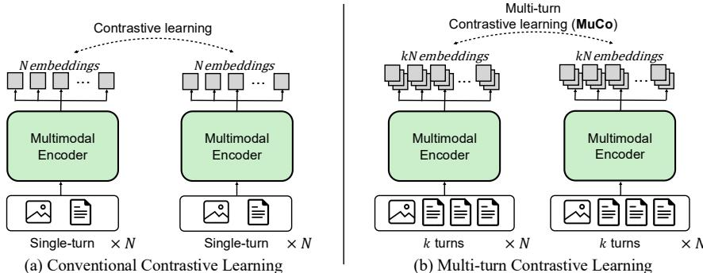
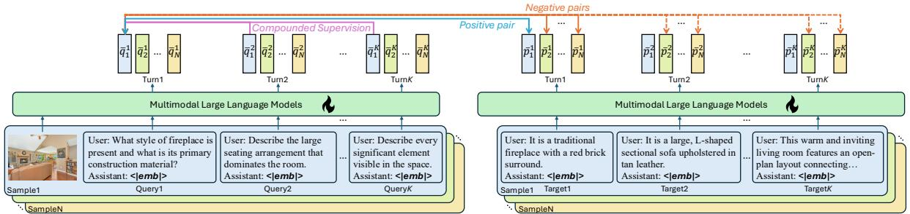
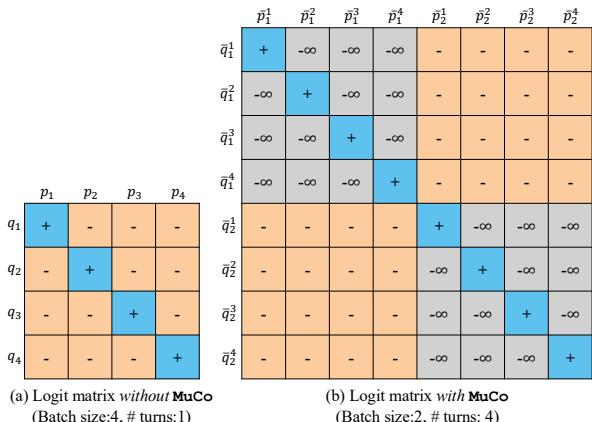
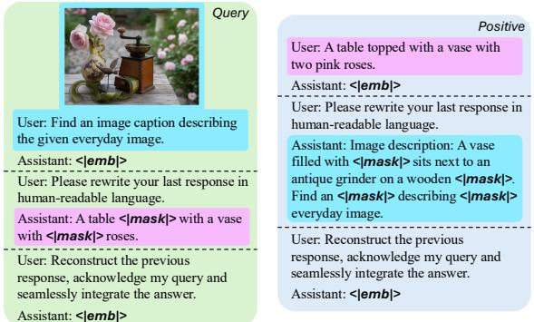
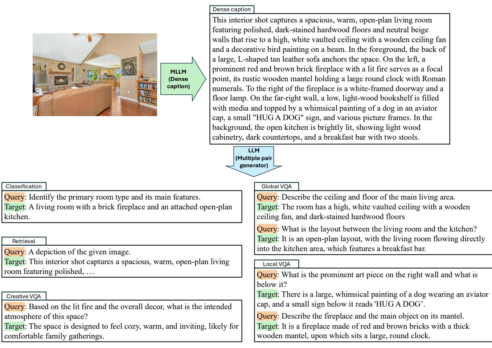
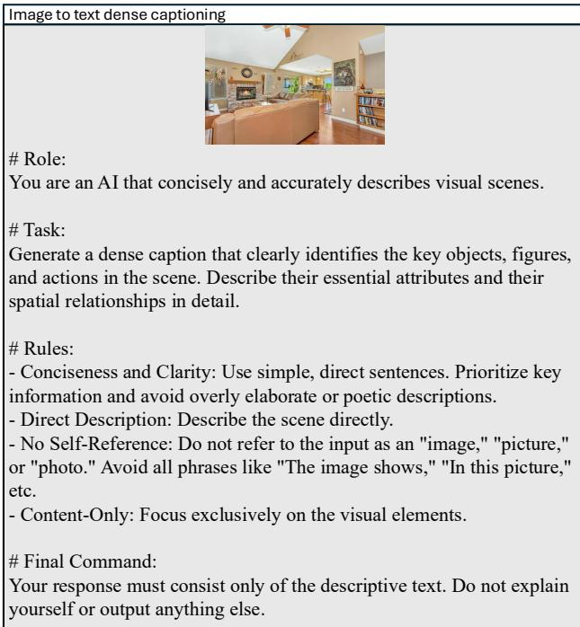
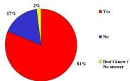
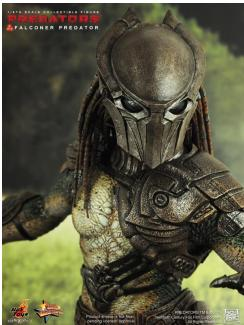

# MuCo: Multi-turn Contrastive Learning for Multimodal Embedding Model

Geonmo $\mathrm { G u ^ { 1 , 3 } }$ Byeongho Heo1 Jaemyung $\mathrm { { Y u ^ { 1 } } }$ Jaehui Hwang1 Taekyung Kim1   
Sangmin Lee3 HeeJae Jun2 Yoohoon Kang#, 2 Sangdoo Yunt, 1 Dongyoon Han†, 1

1NAVER AI Lab 2NAVER AI Search Platform 3Korea University

# Abstract

Universal Multimodal embedding models built on Multimodal Large Language Models (MLLMs) have traditionally employed contrastive learning, which aligns representations of query-target pairs across different modalities. Yet, despite its empirical success, they are primarily built on a "single-turn" formulation where each querytarget pair is treated as an independent data point. This paradigm leads to computational inefficiency when scaling, as it requires a separate forward pass for each pair and overlooks potential contextual relationships between multiple queries that can relate to the same context. In this work, we introduce Multi-Turn Contrastive Learning (MuCo), a dialogue-inspired framework that revisits this process. MuCo leverages the conversational nature of MLLMs to process multiple, related query-target pairs associated with a single image within a single forward pass. This allows us to extract a set of multiple query and target embeddings simultaneously, conditioned on a shared context representation, amplifying the effective batch size and overall training efficiency. Experiments exhibit MuCo with a newly curated 5M multimodal multi-turn dataset (M3T), which yields state-of-the-art retrieval performance on MMEB and M-BEIR benchmarks, while markedly enhancing both training efficiency and representation coherence across modalities. Code and M3T are available at https://github.com/naver-ai/muco

# 1. Introduction

Universal multimodal embeddings aim to encode diverse modalities and tasks into a unified vector space, enabling a single model to generalize across a wide range of applications without task-specific adaptation. As real-world scenarios increasingly demand flexible and scalable multimodal understanding, Multimodal Large Language Models (MLLMs) have emerged as a powerful foundation for learning such universal representations. By jointly modeling visual and textual inputs, MLLM-based embedding frameworks have demonstrated remarkable performance across classification, Visual Question Answering (VQA), and multimodal retrieval tasks [7, 8, 16, 21, 29, 30, 38, 43, 65].

Despite this progress, most existing methods [7, 8, 16, 21, 29, 3638, 43, 53, 65] still rely on "single-turn" contrastive learning [52], which processes one query-target pair per image and relies on a large batch size to enhance their embedding quality. We argue that this paradigm has two critical limitations. First, by treating each pair as an isolated data point, it overlooks the rich contextual interdependence among the potential multiple queries that can be derived from the same image. While a semantically rich image can support diverse text queries (e.g., object attributes, spatial relationships) [11], processing them independently may miss the opportunity to build a contextually coherent representation. Second, scaling up contrastive learning by enlarging batch size introduces substantial computational overhead. This is because a large batch simply means processing more images. Unlike text, each image requires processing by a visual encoder and generates a substantially larger number of tokens. This inefficiency hinders the scalability of universal multimodal embedding models that depend on large-batch contrastive learning.

We introduce Multi-turn Contrastive Learning (MuCo)  a novel method that extends traditional singleturn contrastive learning (Fig. 1a) into a multi-turn setting (Fig. 1b). Instead of processing isolated pairs, MuCo processes multiple query-target pairs for a single image in a dialog format. By leveraging the causal and conversational capability of MLLMs, MuCo models the sequential querytarget interactions across turns. This enables the model to progressively refine its embeddings through subsequent turns, yielding context-rich representations that generalize effectively across diverse tasks. Furthermore, our method is efficient: the computationally heavy visual input is processed only once, while subsequent lightweight text-only turns are used to extract multiple distinct embeddings. This strategy dramatically increases the effective batch size with minimal additional training cost.

  
multi-turn contrastive learning $( \tt M u C o )$ generalizes this paradigm by using multiple query-target pairs per image, with expanded negative for the same number of encoder forward passes, MuCo provides $k$ -times larger effective batch size than conventional contrastive learning.

Our framework is strengthened through successive pretraining and fine-tuning stages. For pretraining, we construct a 5M-scale multimodal multi-turn dataset featuring diverse multi-turn conversational pairs that explicitly model various tasks from a single image, synthesized via MLLMs [2] and LLMs [1]. Pretraining on the M3T dataset allows MuCo to benefit from both a large effective batch size and richer contextual signals from sequential turns, leading to a substantially more powerful and discriminative shared embedding space. Subsequently, in the fine-tuning stage, we adopt the multi-turn paradigm to standard single-turn datasets. This is achieved by simulating multi-turn reasoning via a prompt-based in-context reconstruction task (akin to masked modeling [14]), which further enhances the embedding's discriminative power.

Extensive experiments demonstrate that MuCo substantially outperforms existing MLLM-based embedding models across multiple benchmarks [51, 62], achieving state-ofthe-art performance with improved efficiency and generalization. MuCo achieved new SOTA on the MMEB benchmark [30], improving zero-shot performance (Precision $@ 1$ ) by $+ 3 . 0 \% \mathrm { p }$ and fine-tuning performance by $+ 1 . 6 \% \mathrm { p }$ over the previous SOTA [8, 58]. On the M-BEIR benchmark [62], MuCo also secures SOTA in both 2B and 7B, improving overall Recall by $+ 1 . 6 \% \mathrm { p }$ and $+ 1 . 7 \% \mathrm { p }$ , respectively. Notably, MuCo demonstrates remarkable efficiency: while increasing the effective batch size 7 times $( 1 0 2 4  7 1 6 8 )$ , the required FLOPs increase by a mere $\leq 3 \%$ (from 17.5 to 18.0 PFLOPs). This is substantially more efficient than standard contrastive learning, which requires 122.7 PFLOPs for the same batch size expansion, and achieves $+ 0 . 7 \% \mathrm { p }$ higher performance.

# 2. Related Work

MLLM-based universal multimodal embedding model. Recent studies on universal multimodal embedding can be grouped into two main paradigms: CLIP-based methods [36, 37, 53, 66] introduced architectural or objective variations to improve visual-text alignment. In contrast, MLLM-based approaches leveraged the strong multimodal understanding and instruction-following capabilities of large multimodal language models (MLLMs) to produce more semantically aligned and instruction-aware embeddings. Within this paradigm, one line of work focused on scaling and curating data for embedding learning, such as VLM2Vec [30], MMRet [69], mmE5 [8]. A complementary line of research improved the training procedure itself. E5-V [29] unified representations through MLLM distillation, while UniME [21] and LLaVE [33] improved supervision through refined negative sampling. B3 [58] enhanced scalability via optimized batch construction, and M3Task-UEM [56] introduced task-adaptive representation learning to improve embedding effectiveness across diverse tasks. While these models advance the field, they predominantly rely on single-turn supervision.

# Training data for the universal multimodal embeddings.

Advances in data construction have strongly shaped universal multimodal embedding. Early web-crawled datasets like DataComp [18], Conceptual Captions [5, 55], and YFCC [59] enabled large-scale alignment but suffered from noise and lacked semantic richness. The next generation [20, 67, 69] introduced synthetic captioning for existing images [67, 69] or synthesized images [20], improving linguistic diversity and grounding quality. Later efforts focused on large-scale aggregation. MMEB benchmark [30] unified 36 datasets across four meta-tasks, and M-BEIR [62] consists of 16 retrieval datasets across 8 retrieval tasks. These two benchmarks are widely used to evaluate universal multimodal embeddings. More recently, mmE5 [8] moved beyond aggregation by automatically generating aligned supervision, addressing data insufficiency, and extending to multilingual domains. Despite these advances, most data still relies on single query-target pairs. Recent MLLM-based embedding models focus on one-shot descriptions or isolated instructions, leaving their multi-turn conversational nature underexploited. To address this gap, our work explores how multi-turn, dialogue-inspired supervision can enhance contextual alignment and instruction grounding in universal multimodal embedding learning.

# 3. Preliminary

Multimodal Large Language Models (MLLMs) [2, 34, 35, 41, 60] are generative models that extend beyond textonly inputs, processing a combination of images and text to produce sequential text tokens. Employing MLLMs as the backbone for multimodal embedding models is highly advantageous, as this enables the creation of unified embeddings from free-form multimodal samples. However, a fundamental challenge arises from the inherent asymmetry between modalities. The multimodal embedding models still rely on a visual encoder that converts each image into a dense sequence of tokens. For instance, on the MMEB benchmark [30], an image with the average resolution $( 5 0 9 \times 4 5 6$ , 294 tokens) requires 2.24 TFLOPs to process, while an average-length text (25 tokens) requires only $0 . 1 2 \ \mathrm { T F L O P s ^ { 1 } }$ . This token length imbalance makes the visual input far more computationally costly to process, creating a significant bottleneck for training efficiency.

Contrastive learning. Previous methods [7, 8, 21, 30, 38, 58, 69] for training multimodal embedding models typically rely on a contrastive learning objective, InfoNCE loss [52], applied to single query-target pairs, where query and target consist of multimodal data such as images and texts:

$$
\mathcal { L } = \frac { 1 } { | \mathcal { B } | } \sum _ { ( q _ { i } , p _ { i } ) \in \mathcal { B } } - \log \frac { \phi ( q _ { i } , p _ { i } ) } { \sum _ { p \in \mathcal { N } \cup \{ p _ { i } \} } \phi ( q _ { i } , p ) } ,
$$

where $q _ { i }$ is a query and $p _ { i }$ is its positive target. The similarity score is given by $\phi ( q _ { i } , p _ { i } ) = \exp ( f ( q _ { i } ) ^ { \top } f ( p _ { i } ) / \tau )$ where $f ( \cdot )$ denotes an encoder producing $\ell _ { 2 }$ -normalized embeddings and $\tau$ is the temperature. $\boldsymbol { B }$ denotes the minibatch, and $\mathcal { N }$ represents the set of valid negative targets within the batch. While using Eq. (1) has become the de facto standard for contrastive learning, its effectiveness depends heavily on the batch size [6, 9, 19, 53, 66], as larger batches provide more negative samples, which further leads to severe scalability issues in multimodal training.

# 4. Method

This section introduces our proposed method Multi-turn Contrastive learning (MuCo). MuCo capitalizes on the inherent causal processing capability of MLLMs, extending it to sequential multi-turn input processing such that each embedding (for each query) reflects the contextual dependencies of all prior turns. In effect, the model is compelled to internalize richer and coherent entangled embeddings that extend beyond conventional single-query alignment.

We implement MuCo through a two-stage training process. In the first pretraining stage (§4.1), the model is trained on our newly constructed Multi-Modal Multi-Turn (M3T) dataset. This large-scale, dialogue-oriented corpus, containing multiple query-target pairs per image, enables the model to learn contextually coherent representations from conversational data. Subsequently, the finetuning stage extends the proposed MuCo framework on standard single-turn-based benchmarks, ensuring its effectiveness under conventional evaluation protocols (§4.2).

# 4.1. Multi-turn Contrastive Learning (MuCo)

Our method reframes the embedding extraction process as a multi-turn dialogue. By placing a special embedding token $( < | \mathrm { e m b } \mid > )$ in the response of the ass ist ant within a prompt structure, as shown in Fig. 2, our framework can extract multiple distinct embeddings from a single input sequence at once. Subsequent turns per image consist of appending text-only queries or positive targets.

We first instantiate MuCo in pretraining by compounding supervisory signals across sequential turns. Our goal is to learn context-rich embeddings for earlier turns  particularly for the initial $\mathrm { t u r n } ^ { 2 }$ that generalize effectively across tasks such as classification, retrieval, and visual question answering. We believe this could be achieved by training on multiple query-target pairs, processed sequentially via our dialogue template (Fig. 2); this design ensures that earlier embeddings become effective through training subsequent turns, as they are continually referenced by later queries (e.g., the $n$ -th embedding is formed after attending to the previous $n - 1$ queries).

Let the set of training data be denoted as $\begin{array} { r l } { { \mathcal { D } } } & { { } = } \end{array}$ $\{ (  { T _ { i } } ,  { q _ { i } } ^ { j } ) ,  { p _ { i } ^ { j } } ) \}$ where $\mathcal { T } _ { i }$ is an $i$ -th image and $q _ { i } ^ { j } , p _ { i } ^ { j }$ represent $j$ -th query text and positive target text. For a mini-batch $B \subset \mathcal { D }$ , employing the traditional contrastive learning loss Eq. (1) gives

$$
\frac { 1 } { | \mathscr { B } | } \sum _ { ( ( \mathscr { T } _ { i } , q _ { i } ^ { j } ) , p _ { i } ^ { j } ) \in \mathscr { B } } - \log \frac { \phi ( ( \mathscr { T } _ { i } , q _ { i } ^ { j } ) , p _ { i } ^ { j } ) } { \sum _ { p \in \mathscr { N } \cup \{ p _ { i } ^ { j } \} } \phi ( ( \mathscr { T } _ { i } , q _ { i } ^ { j } ) , p ) } .
$$

We believe this naive approach has two drawbacks. First, it often fails to leverage the full context of multiple querytarget pairs for a given single image, as trained exclusively in a single-query setting, despite the fact that these pairs are not mutually exclusive (i.e., crucial cues may lie in other questions and answers). Second, when increasing the number of images by enlarging the batch size, it usually fails to mitigate the computational overhead incurred by the image parts. To address these drawbacks, we propose concatenating queries and positive targets that share the same image using the prompt template shown in Fig. 2:

  
we omit the embedding function notation (e.g. $f ( \cdot ) \dot { }$ .

$$
\bar { q } _ { i } ^ { j } = ( \mathcal { T } _ { i } , ( q _ { i } ^ { l } ) _ { l \leq j } ) , \quad \bar { p } _ { i } ^ { j } = ( p _ { i } ^ { l } ) _ { l \leq j } .
$$

This cumulative structure enables processing multiple queries and positive targets in a single forward pass. By placing $< | \mathrm { e m b } | >$ tokens at the end of each turn, we simultaneously extract all embeddings without re-encoding the image, significantly reducing computational overhead. Furthermore, gradients from all subsequent turns could flow back to the initial turn. The loss function for multiple queries and targets is changed as

$$
\mathcal { L } _ { \sf M u C o } = \frac { 1 } { | \boldsymbol { \it B } | } \sum _ { ( \bar { q } _ { i } ^ { j } , \bar { p } _ { i } ^ { j } ) \in \boldsymbol { B } } - \log \frac { \phi ( \bar { q } _ { i } ^ { j } , \bar { p } _ { i } ^ { j } ) } { \sum _ { \bar { p } \in \mathcal { N } _ { i } \cup \{ \bar { p } _ { i } ^ { j } \} } \phi ( \bar { q } _ { i } ^ { j } , \bar { p } ) } ,
$$

$$
\begin{array} { r } { \mathcal { N } _ { i } = \{ \bar { p } _ { k } ^ { l } \ | \ ( \cdot , \bar { p } _ { k } ^ { l } ) \in B , \ k \neq i \} . } \end{array}
$$

Note that to address the second drawback, the semantic overlap issue, we exclude all other positive targets originating from the same image $\mathcal { T } _ { i }$ as the current query $\bar { q } _ { i } ^ { j }$ from its negative set $\mathcal { N } _ { i }$ (the denominator in Eq. (4)). This exclusion is practically achieved by adding negative infinity to the corresponding values in the logit matrix for the pairs to be masked, as shown in Fig. 3 (b). This approach is better than Eq. (2) in optimizing computation overheads. For example, with a batch size of 1,024 images and 7 pairs per image, our method provides each query with 7,161 effective negative samples $( 1 0 2 4 \times 7 - 7 )$ .

In this way, MuCo inherently processes inputs as sequential turns, where each subsequent embedding is conditioned on the context of all preceding turns, enabling the model to learn diversified and context-aware relationships between multiple queries and a given image. From another perspective, gradients from later turns retroactively refine earlier ones, yielding a compounded supervisory signal that encourages the initial representations to remain informative across the entire dialogue.

Dialogue-templated data (M3T). We construct synthetic corpora, named M3T, to train MuCo effectively, as such dialogue-oriented multimodal structures are publicly unavailable. Our key design principles are: we prioritize a large scale and multiple query-target pairs for an image for versatility and diversity, and structure the data to reflect comprehensive visual information, ensuring a thorough interpretation of both global and local image contexts. Furthermore, to maximize computational efficiency during training, we restrict positive targets to text-only formats, while images are exclusively used as part of the queries.

We take 5 million images sampled from DataComp [18], processed through a two-step pipeline combining state-ofthe-art MLLM [2] and LLM [1]. First, we employ the MLLM to generate dense captions, distilling rich visual information into text. Second, we let the LLM synthesize seven diverse query-target pairs per image using the dense captions, aligned with MMEB core categories [30]: one for classification, one for retrieval, and five distinct VQA pairs composed of two requiring holistic understanding, two focusing on localized details, and one demanding creative reasoning. This process yields 35 million query-target text pairs and 5 million images. Further details and prompts are provided in the supplementary material.

# 4.2. Single-turn Adaptation of MuCo

Our multi-turn pretraining generalizes to the conventional multimodal benchmarks [30, 62], having a single querytarget pair per sample. To align with single-query data, we introduce an adaptive strategy that employs extra contextual dialogue from a given query, allowing MuCo to elicit its pre-trained multi-turn capability.

We repurpose MuCo to handle single-query pairs. As shown in Fig. 4, we first establish an initial turn to extract the initial embedding from the query $q$ or positive target $p$ . In the following turns, we provide the model with its masked counterpart (e.g., the masked positive target for a given query). The model is then explicitly instructed to first reconstruct the masked parts and generate a subsequent embedding capturing the context of the entire dialogue.

  
Figure 3. Logit masking strategy in our MuCo framework. (a) The conventional method with a batch size of $N = 4$ yields a $N \times N$ (i.e. $4 \times 4 )$ matrix. In contrast, MuCo (b) uses a batch size of $N = 2$ and $k = 4$ turns to construct a larger $N k \times N k$ (i.e. $8 \times 8 )$ matrix. Crucially, our method masks out pairs originating from the same image (gray, $- \infty )$ to prevent a semantic overlap issue. True positives (blue, $+$ ) and true negatives (orange, $-$ are used for the loss. Crucially, other pairs originating from the same image (gray, $- \infty )$ are masked to prevent a semantic overlap issue.

We argue this process functions as an in-context reconstruction task, compelling the model to reason about the relationship between the query and target to infer the masked content. We achieve this by leveraging LLMs' capabilities through prompting (i.e., instructing the LLM to perform reconstruction) and a special mask token $( < | \operatorname* { m a s k } | > )$ ; interestingly, even simple tokens such as a space or '' work equally well. This prompt-only approach avoids auxiliary objectives, ensuring simplicity and direct application to standard contrastive learning. To maintain the efficiency of text-only subsequent turns, we convert any images in the counterpart to text via image captioning. This conversion is performed offline, prior to finetuning, using a image captioning model. This approach offers flexibility, as any suitable captioning model can be employed for this preprocessing step (See Tab 8). Crucially, we use only the initial embedding without the subsequent turn to align with standard single-query test scenarios [30, 62].

Details work as follows: first, the query $q$ and the corresponding positive target $p$ are augmented using prompts. The augmented query and target $( q ^ { \prime } , p ^ { \prime } )$ is defined as $q ^ { \prime } =$ $( q , \pi _ { 1 } , \tilde { p } , \pi _ { 2 } )$ , $p ^ { \prime } = ( p , \pi _ { 1 } , \tilde { q } , \pi _ { 2 } )$ , where $\pi _ { 1 }$ is a describing request such as User: Please rewrite your last response in human-readable language, $\tilde { p }$ and $\tilde { q }$ represents the masked query and target, and $\pi _ { 2 }$ requests a new embedding such as User: Reconstruct the previous response, acknowledge my query, and seamlessly integrate the answer.

For original mini-batch $\boldsymbol { B }$ , we utilizes augmented set $\bar { B }$ :

$$
\bar { B } = \bigcup _ { ( q , p ) \in { \cal B } } \{ ( q , p ) , ( q , p ^ { \prime } ) , ( q ^ { \prime } , p ) , ( q ^ { \prime } , p ^ { \prime } ) \} .
$$

  
Figure 4. Multi-turn template for fine-tuning MuCo on singlepair datasets. We illustrate Query (left) and Positive (right) templates. The initial query (cyan) is reused as a masked target on the Positive side, and the positive target (pink) becomes a masked target on the Query side. This process simulates multi-turn interactions from a single pair, guiding the model to reconstruct its counterpart and enrich the learned embeddings.

The contrastive loss with the augmented set is defined as

$$
\frac { 1 } { | \bar { \mathcal { B } } | } { \sum _ { ( q _ { i } , p _ { i } ) \in \bar { \mathcal { B } } } } - \log \frac { \phi ( q _ { i } , p _ { i } ) } { \displaystyle p \in \mathcal { N } _ { p _ { i } } \cup \{ p _ { i } \} } ( q _ { i } , p )  .
$$

Since the augmented samples are similar to the original ones, we exclude them from negative samples in contrastive loss. i.e., the negative set $\mathcal { N } _ { p _ { i } }$ is

$$
\mathcal { N } _ { p _ { i } } = \{ p \vert ( \cdot , p ) \in \bar { B } \} \backslash \{ p _ { i } , p _ { i } ^ { - } \} ,
$$

where $\mathfrak { p } _ { i } ^ { - }$ denotes the opposite form of $p _ { i }$ : it is the augmented version if $p _ { i }$ is an original target in $\boldsymbol { B }$ , and the original target if $p _ { i }$ is an augmented one. With this loss, the supervisory signal flows back to refine the initial embedding, enabling it to encapsulate richer relational information. In essence, our key intuition is to use simple prompting (without any further complicated elements) to leverage the MLLM's capability to simulate multi-turn behavior on single-turn data, thereby exploiting its pretraining strength. Simple tweaks such as token masking are also believed to enhance the discriminative power of the learned embeddings. We examine several related design choices in the experimental section.

# 5. Experiment

# 5.1. Experimental Setup

Implementation details. Qwen2-VL [60] is utilized as the MLLM backbone. We apply LoRA [26] with a rank of 64 and a scaling factor of $\alpha = 6 4$ exclusively to the LLMs components of the model and freeze the visual encoder of the model. All training is conducted for 1 epoch on 32 NVIDIA A100 80GB GPUs. Unless otherwise specified, a global batch size of 1,024 is used. The contrastive learning temperature $\tau$ is set to 0.02, and a constant learning rate of $5 e ^ { - 5 }$ is employed. For our pretraining (§4.1), multiple query-target pairs are randomly shuffled per batch instance to prevent positional bias. In our adaptive prompting strategy (§4.2), we split the text sentence into words based on spaces and then randomly mask $50 \%$ of the words using a uniform sampling strategy. If not specified, we employ Qwen2-VL-7B for image captioning in $\ S 4 . 2$

Table 1. Precision $@ 1$ $( \% )$ results on MMEB, which includes 36 tasks across four categories: Classification, Visual Question Answering reveooereen oh   

<table><tr><td rowspan="2">Models</td><td rowspan="2"># Params</td><td colspan="4">Per Meta-Task Score</td><td colspan="3">Average Score</td></tr><tr><td>Classification</td><td>VQA</td><td>Retrieval</td><td>Grounding</td><td>ID</td><td>OOD</td><td>Overall</td></tr><tr><td colspan="9">Zeroshot setting (pretrained) on MMEB benchmark</td></tr><tr><td>CLIP [53]</td><td>0.4B</td><td>42.8</td><td>9.1</td><td>53.0</td><td>51.8</td><td></td><td></td><td>37.8</td></tr><tr><td>MagicLens [67]</td><td>0.6B</td><td>38.8</td><td>8.3</td><td>35.4</td><td>26.0</td><td></td><td></td><td>27.8</td></tr><tr><td>E5-V [29]</td><td>8B</td><td>21.8</td><td>4.9</td><td>11.5</td><td>19.0</td><td>−</td><td>−</td><td>13.3</td></tr><tr><td>MMRet [69]</td><td>7B</td><td>47.2</td><td>18.4</td><td>56.5</td><td>62.2</td><td>−</td><td>−</td><td>44.0</td></tr><tr><td>mmE5 [8]</td><td>11B</td><td>60.6</td><td>55.7</td><td>54.7</td><td>72.4</td><td>−</td><td></td><td>58.6</td></tr><tr><td>MuCo-2B</td><td>2B</td><td>53.6</td><td>59.9</td><td>55.2</td><td>74.6</td><td></td><td></td><td>58.2</td></tr><tr><td>MuCo-7B</td><td>7B</td><td>56.0</td><td>64.7</td><td>58.9</td><td>75.7</td><td></td><td></td><td>61.6</td></tr><tr><td colspan="9">Fine-tuning on MMEB benchmark (&lt; 7B Models)</td></tr><tr><td>CLIP [53]</td><td>0.4B</td><td>55.2</td><td>19.7</td><td>53.2</td><td>62.2</td><td>47.6</td><td>42.8</td><td>45.4</td></tr><tr><td>VLM2Vec [30]</td><td>4B</td><td>54.8</td><td>54.9</td><td>62.3</td><td>79.5</td><td>66.5</td><td>52.0</td><td>60.1</td></tr><tr><td>LLaVE [33]</td><td>2B</td><td>62.1</td><td>60.2</td><td>65.2</td><td>84.9</td><td>69.4</td><td>59.8</td><td>65.2</td></tr><tr><td>UniME [21]</td><td>4B</td><td>54.8</td><td>55.9</td><td>64.5</td><td>81.8</td><td>68.2</td><td>52.7</td><td>64.2</td></tr><tr><td>B3-2B [58]</td><td>2B</td><td>67.0</td><td>61.2</td><td>70.9</td><td>79.9</td><td>72.1</td><td>63.1</td><td>68.1</td></tr><tr><td>MoCa-3B [7]</td><td>3B</td><td>59.8</td><td>62.9</td><td>70.6</td><td>88.6</td><td>72.3</td><td>61.5</td><td>67.5</td></tr><tr><td>MuCo-2B</td><td>2B</td><td>66.2</td><td>65.6</td><td>70.1</td><td>85.8</td><td>72.9</td><td>65.0</td><td>69.5</td></tr><tr><td colspan="9">Fine-tuning on MMEB benchmark (≥ 7B Models)</td></tr><tr><td>VLM2Vec [30]</td><td>7B</td><td>61.2</td><td>49.9</td><td>67.4</td><td>86.1</td><td>67.5</td><td>57.1</td><td>62.9</td></tr><tr><td>MMRet [69]</td><td>7B</td><td>56.0</td><td>57.4</td><td>69.9</td><td>83.6</td><td>68.0</td><td>59.1</td><td>64.1</td></tr><tr><td>mmE5 [8]</td><td>11B</td><td>67.6</td><td>62.7</td><td>71.0</td><td>89.7</td><td>72.4</td><td>66.6</td><td>69.8</td></tr><tr><td>LLaVE [33]</td><td>7B</td><td>65.7</td><td>65.4</td><td>70.9</td><td>91.9</td><td>75.0</td><td>64.4</td><td>70.3</td></tr><tr><td>UniME [21]</td><td>7B</td><td>66.8</td><td>66.6</td><td>70.6</td><td>90.9</td><td>74.6</td><td>65.8</td><td>70.7</td></tr><tr><td>B3-7B [58]</td><td>7B</td><td>70.0</td><td>66.5</td><td>74.1</td><td>84.6</td><td>75.9</td><td>67.1</td><td>72.0</td></tr><tr><td>MoCa-7B [7]</td><td>7B</td><td>65.8</td><td>64.7</td><td>75.0</td><td>92.4</td><td>74.7</td><td>67.6</td><td>71.5</td></tr><tr><td>MuCo-7B</td><td>7B</td><td>68.3</td><td>71.9</td><td>73.7</td><td>90.9</td><td>77.3</td><td>69.1</td><td>73.6</td></tr></table>

Table 2. Recall( $\%$ )Results on M-BEIR. $S$ Single modality (text or image), $M$ : Multi-modality (text and image). The arrow denotes 'query target'. Full per-dataset results are in the supplementary material. Boldface denotes the best scores in the subset and the second-best scores are highlighted with underline.   

<table><tr><td>Models</td><td colspan="5"># Params S → S S → M M → S M → M </td><td>Overall</td></tr><tr><td>UniIR [62]</td><td>0.4B</td><td>51.0</td><td>69.1</td><td>32.9</td><td>52.4</td><td>48.9</td></tr><tr><td>LamRA-Ret [43]</td><td>2B</td><td>47.6</td><td>66.2</td><td>41.0</td><td>61.0</td><td>50.0</td></tr><tr><td>MuCo-2B</td><td>2B</td><td>49.1</td><td>68.2</td><td>41.6</td><td>64.8</td><td>51.6</td></tr><tr><td>MM-Embed [38]</td><td>7B</td><td>50.9</td><td>76.9</td><td>40.0</td><td>60.9</td><td>52.7</td></tr><tr><td>LamRA-Ret [43]</td><td>7B</td><td>52.9</td><td>71.8</td><td>45.2</td><td>65.0</td><td>54.9</td></tr><tr><td>M3Task-UEM [56]</td><td>7B</td><td>54.0</td><td>74.9</td><td>41.9</td><td>55.7</td><td>53.9</td></tr><tr><td>MuCo-7B</td><td>7B</td><td>54.0</td><td>71.6</td><td>47.4</td><td>70.4</td><td>56.6</td></tr></table>

Datasets. In Tab. 1, we use the proposed M3T dataset of 5M samples to pretrain MuCo. For pre-training dataset analysis in Tab. 3, we construct two randomly sampled subsets, M3T $( 2 0 \% )$ with 1M and M3T $( 6 0 \% )$ with 3M samples.

We also utilize mmE5 [8] dataset with 560K and the Mega-Pairs [69] dataset with 26M samples for comparison. The details of these datasets are described in the supplementary material. For the fine-tuning stage, models are trained on two benchmarks: MMEB [30] and M-BEIR [62]. MMEB is a benchmark containing 36 individual datasets across four categories: classification, visual question answering (VQA), retrieval, and visual grounding. MMEB reframes all four categories into ranking problems with a maximum of 1,000 candidates. The benchmark provides training samples from 20 of the 36 datasets (considered In-Distribution), while the remaining 16 are reserved exclusively for evaluation (Out-of-Distribution). M-BEIR is a benchmark focusing specifically on multimodal retrieval performance. It consists of 16 retrieval datasets across 8 retrieval tasks. In our experiments, we fine-tune our models on the respective training set for each benchmark and evaluate them on the corresponding test set.

# 5.2. Main Results

We provide the evaluation results on MMEB in Tab. 1 and M-BEIR in Tab. 2. MuCo achieves state-of-the-art (SOTA) performance on the MMEB and M-BEIR benchmark across different model scales. This superior performance stems from our multi-turn dialogue structure, which allows the model to learn rich context and compounded supervisory signals, thereby effectively improving the embeddings. In the zero-shot setting, our 7B model (61.6) surpasses the previous SOTA mmE5-11B [8] (58.6). In the fine-tuning setting, MuCo establishes new SOTA scores in both sub-7B and 7B-and-above categories. Specifically, MuCo-2B achieves 69.5, outperforming the previous best B3-2B [58] (68.1). Similarly, MuCo-7B establishes a new top score of 73.6, surpassing B3-7B [58] (72.0) and achieving the highest OOD score, which indicates superior generalization to unseen tasks. This strong performance trend continues on the M-BEIR benchmark. MuCo-2B (51.6) and MuCo-7B (56.6) ourperform all competing methods. We note their robust performance in the complex multi-modal to multimodal $M  M$ setting, achieving top scores of 64.8 (2B) and 70.4 (7B).

Table 3. Pretraining dataset variants. 'None' represents finetuning without pretraining. We compare against other pretraining datasets (mmE5 and MegaPair) and our M3T at various scales. The 'mmE5' entry under the 'Multi-turn' section is generated using images from the single-turn mmE5 synth dataset.   

<table><tr><td>Pre-training</td><td>Dataset</td><td>Samples</td><td>ZS MMEB</td><td>FT MMEB</td></tr><tr><td rowspan="3">Single-turn</td><td>None</td><td></td><td>−</td><td>68.5</td></tr><tr><td>mmE5 [8]</td><td>0.6M</td><td>55.6</td><td>68.6</td></tr><tr><td>MegaPairs [69]</td><td>26M</td><td>41.5</td><td>68.7</td></tr><tr><td rowspan="4">Multi-turn MuCo-§4.1</td><td>mmE5 [8]</td><td>0.6M</td><td>57.0</td><td>69.0</td></tr><tr><td>M3T (20%)</td><td>1M</td><td>57.1</td><td>69.0</td></tr><tr><td>M3T (60%)</td><td>3M</td><td>57.7</td><td>69.2</td></tr><tr><td>M3T</td><td>5M</td><td>58.2</td><td>69.5</td></tr></table>

# 5.3. Empirical Analysis

This section analyzes our design choices. Unless specified, all experiments use MuCo-2B on MMEB. In tables, ZS MMEB denotes zero-shot performance (Precision $@ 1$ ) after MuCo pretraining (§4.1), and FT MMEB denotes the performance (Precision $@ 1$ ) after MuCo fine-tuning (§4.2) on the MMEB training set.

Impact of pretraining dataset. We analyze the impact of different pretraining datasets in Tab. 3 by varying pretraining method and dataset. Note that we fix MuCo finetuning (§4.2) to all cases for FT MMEB. The results reveal two key insights. First, MuCo pretraining is highly effective. Training on mmE5 after converting them to our multiturn format outperforms the original single-turn pretraining (69.0 vs. 68.6 FT MMEB), demonstrating the significant advantage of our richer, multi-turn signal. Second, M3T is a high-quality dataset that enables large-scale MuCo pretraining with clear gains. MuCo pretraining performance improves monotonically from 0.6M to 5M. It implies that M3T offers mmE5-level quality at roughly $\times 1 0$ scale, while MegaPairs [69] degrades performance with massive data. It is noteworthy that the model without any pretraining (None) achieves 68.5, which is competitive with the mmE5- pretrained model (68.6). This shows that MuCo fine-tuning alone is strong enough to surpass the previous SOTA B3-2B (68.1, Table 1) even without pre-training.

Table 4. Ablation study for data composition. 'All' means the full dataset. Subsequent rows show performance after sequentially removing task categories: Classification ( CLS), followed by global VQA (— global VQA; holistic understanding), local VQA (− local VQA; localized details), and creative VQA (— creative VQA; creative reasoning). All results are in the zero-shot setting on MMEB. GRD stands for visual grounding. The final row is the result of training only on the remaining Retrieval (RET) data.   

<table><tr><td>Setup</td><td>CLS</td><td>VQA</td><td>RET</td><td>GRD</td><td>Overall</td></tr><tr><td>All</td><td>53.6</td><td>59.9</td><td>55.2</td><td>74.6</td><td>58.2</td></tr><tr><td>- CLS</td><td>51.7</td><td>59.2</td><td>54.6</td><td>72.5</td><td>56.9</td></tr><tr><td>global VQA</td><td>51.1</td><td>57.6</td><td>54.6</td><td>71.5</td><td>56.3</td></tr><tr><td>local VQA</td><td>50.8</td><td>56.1</td><td>54.1</td><td>70.2</td><td>55.5</td></tr><tr><td>creative VQA</td><td>50.2</td><td>55.7</td><td>53.7</td><td>69.8</td><td>55.1</td></tr></table>

Table 5. Analysis of scaling batch size vs. turns. We compare the baseline method (#turns $\mathord { \mathop { : } } = 1$ ) with increasing batch sizes (1024 to 8192) against our proposed MuCo method (#turns $\geq 2$ ) with an increasing number of turns at a fixed batch size 1024 in a zero-shot setting on MMEB. For the 2-turn and 4-turn settings, pairs were randomly sampled from the 7 available pairs. The 'effective batch' refers to the total number of query-target pairs (#batch $\times$ #turns), which amplifies the learning signal by providing more positive and negative pairs for the contrastive loss.   

<table><tr><td>#turns</td><td>#batch</td><td>#effective batch</td><td>PFLOPs</td><td>MMEB</td></tr><tr><td>1</td><td>1024</td><td>1024</td><td>17.5</td><td>57.1</td></tr><tr><td>1</td><td>2048</td><td>2048</td><td>35.1</td><td>57.3</td></tr><tr><td>1</td><td>4096</td><td>4096</td><td>70.2</td><td>57.4</td></tr><tr><td>1</td><td>7168</td><td>7168</td><td>122.7</td><td>57.5</td></tr><tr><td>1</td><td>8192</td><td>8192</td><td>140.4</td><td>57.8</td></tr><tr><td>2</td><td>1024</td><td>2048</td><td>17.6</td><td>57.4</td></tr><tr><td>4</td><td>1024</td><td>4096</td><td>17.7</td><td>57.7</td></tr><tr><td>7</td><td>1024</td><td>7168</td><td>18.0</td><td>58.2</td></tr></table>

We analyze each pretraining task's contribution in Tab. 4. Sequentially excluding tasks (— CLS, global/local/creative VQA) causes a performance drop in the corresponding task. Notably, excluding local VQA also degrades Visual Grounding (GRD), and removing creative VQA further lowers overall performance. This confirms each component of our synthesized data is beneficial.

Scaling batch-size vs. turns. We compare scaling the batch size and the number of turns in Tab. 5. For the conventional method (#turns $^ { - 1 }$ ), increasing the batch size from 1024 to 8192 yields performance gains (57.1 to 57.8) at a prohibitively high computational cost. In contrast, our method scales the number of turns (#turns 2 to 7) at a fixed 1024 batch size. Notably, our 7-turn model (7168 effective batch size) achieves a higher score than the 1-turn baseline with a 7168 batch size (58.2 vs. 57.5) and even surpasses the larger 8192-batch baseline (57.8) while the 7168- batch baseline incurs a massive computation overhead. This demonstrates that our method provides a far more efficient path to achieving the benefits of a larger effective batch.

Table 6. Impact of compounded supervision. Preventing causal attention to attend earlier contexts leads to a performance drop, supporting the importance of compounded supervision.   

<table><tr><td>Setup</td><td>ZS MMEB</td><td>FT MMEB</td></tr><tr><td>w/o compounded supervision</td><td>57.3</td><td>68.4</td></tr><tr><td>w/ compounded supervision</td><td>58.2</td><td>69.5</td></tr></table>

Table 7. Impact of logit masking. While beneficial in pre-training due to its diverse multi-turn data, this strategy is critical for finetuning, as it prevents a severe performance collapse caused by incorrectly treating self-augmented pairs as negatives   

<table><tr><td colspan="4">Logit masking</td></tr><tr><td>Pretraining</td><td>Fine-tuning</td><td>ZS MMEB</td><td>FT MMEB</td></tr><tr><td>-</td><td>-</td><td>57.7</td><td>31.1</td></tr><tr><td></td><td>✓</td><td>57.7</td><td>69.2</td></tr><tr><td>✓</td><td></td><td>58.2</td><td>30.9</td></tr><tr><td>✓</td><td>✓</td><td>58.2</td><td>69.5</td></tr></table>

Impact of compounded supervision. We conduct an ablation study to validate the effectiveness of our compounded supervision (i.e., subsequent turns provide a compounded supervisory signal that retroactively refines earlier embeddings), as shown in Tab. 6. We test a variant where this accumulation is disabled by modifying the causal attention mask in both pretraining and fine-tuning; this forces each turn to only attend to the initial image and its own tokens, isolating it from the context of preceding turns. The results demonstrate our hypothesis: disabling this compounded supervision leads to a performance drop (68.4) compared to MuCo (69.5). This confirms that our strategy of accumulating supervisory signals across turns is a superior approach for learning robust representations.

Impact of logit masking. We validate the importance of our logit masking strategy in Tab. 7, which is critical for fine-tuning. Disabling it (e.g. row (1,3) vs. row (2,4) in FT MMEB) causes a performance collapse. This is because, during fine-tuning, we construct subsequent turns using each counterpart. Without logit masking, the model treats these semantically overlapped pairs as negative pairs, leading to severe confusion that prevents learning. In contrast, the impact during pretraining is far less severe in ZS MMEB. This is because the pretraining data consists of diverse query-target pairs for each image. While this still causes a minor performance drop due to potential semantic overlap between the pairs, the diversity prevents the learning collapse seen in the fine-tuning stage.

Ablation study of the subsequent turn design for finetuning on single-pair dataset. We compare other design choices for the subsequent turn used in the fine-tuning stage as shown in Tab. 8. First, we analyze the counterpart masking ratio, finding that $50 \%$ yields the best performance. A lower ratio (e.g. $2 5 \%$ ) is suboptimal as the masked input is too similar to the original counterparts which provide only a minimal learning signal. Conversely, a higher ratio (e.g. $7 5 \%$ )also results in a larger performance drop because the reconstruction task becomes excessively difficult.

Table 8. Ablation study of the subsequent turn design for finetuning on single-pair dataset. We analyze the counterpart masking ratio, the importance of reconstruction guidance (compared to no guidance or simple rephrasing), and find that the choice of image captioning model has a minimal impact   

<table><tr><td>Setup</td><td>MMEB</td></tr><tr><td>Counterpart masking ratio 25%</td><td>69.3</td></tr><tr><td>Counterpart masking ratio 50%</td><td>69.5</td></tr><tr><td>Counterpart masking ratio 75%</td><td>68.9</td></tr><tr><td>Rephrasing template</td><td>68.5</td></tr><tr><td>Without reconstruction guidance</td><td>69.0</td></tr><tr><td>Image captioning (BLIP Large [36])</td><td>69.4</td></tr><tr><td>Image captioning (Qwen2-VL-7B [60])</td><td>69.5</td></tr></table>

We also analyze the dialog template for the fine-tuning strategy. Interestingly, using just a simple rephrasing template (User: Please rephrase your last response in embedding space \ n Assistant: $< / \in m b \mid > )$ outperforms the MuCo without compounded supervision (68.4 in Tab. 6). This demonstrates our compounded supervision can improve the performance even though a simple subsequent is employed. When training without reconstruction guidance, the performance drops to 69.0 from 69.5, which confirms that the explicit reconstruction prompt is crucial for compelling the model to reason about the relationship between the pairs in Eq. 6. Finally, we observe that the choice of image captioning model (BLIP-Large vs. Qwen2-VL-7B) has a minimal impact on performance.

# 6. Conclusion

In this work, we propose Multi-turn Contrastive Learning $( \tt M u C o )$ , a dialogue-inspired framework to overcome the limitations of conventional single-turn contrastive learning. By reframing representation learning as a multi-turn dialogue and modeling contextual dependencies, MuCo learns richer and more coherent embeddings than isolated pair alignment. Furthermore, MuCo tackles scalability bottlenecks by processing multi-turn query sequences in a single forward pass. This approach significantly reduces computational overhead while increasing the effective batch size. Supported by our new 5M-scale M3T corpus, MuCo achieves new state-of-the-art performance on universal multimodal embedding benchmarks. MuCo demonstrates that it is possible to simultaneously enhance model performance and training scalability, effectively redefining the efficiency-capacity trade-off in multimodal alignment. We believe this work opens new avenues for more efficient and context-aware multimodal representation learning systems.

# Acknowledgment

This work utilized Bruno from the NAVER AI Search Platform to facilitate large-scale data processing tasks. We thank the platform for providing robust Model as a Service (MaaS) support.

# References

[1] Sandhini Agarwal, Lama Ahmad, Jason Ai, Sam Altman, Andy Applebaum, Edwin Arbus, Rahul K Arora, Yu Bai, Bowen Baker, Haiming Bao, et al. gpt-oss-120b & gpt-oss-20b model card. arXiv preprint arXiv:2508.10925, 2025. 2, 4, 15   
[2] Shuai Bai, Keqin Chen, Xuejing Liu, Jialin Wang, Wenbin Ge, Sibo Song, Kai Dang, Peng Wang, Shijie Wang, Jun Tang, et al. Qwen2. 5-vl technical report. arXiv preprint arXiv:2502.13923, 2025. 2, 3, 4, 15   
[3] Andrei Barbu, David Mayo, Julian Alverio, William Luo, Christopher Wang, Dan Gutfreund, Josh Tenenbaum, and Boris Katz. Objectnet: A large-scale bias-controlled dataset for pushing the limits of object recognition models. Advances in neural information processing systems, 32, 2019. 14   
[4] Yingshan Chang, Mridu Narang, Hisami Suzuki, Guihong Cao, Jianfeng Gao, and Yonatan Bisk. Webqa: Multihop and multimodal qa. In Proceedings of the IEEE/CVF conference on computer vision and pattern recognition, pages 16495 16504, 2022. 14   
[5] Soravit Changpinyo, Piyush Sharma, Nan Ding, and Radu Soricut. Conceptual $1 2 \mathrm { m }$ :Pushing web-scale image-text pretraining to recognize long-tail visual concepts. In Proceedings of the IEEE/CVF conference on computer vision and pattern recognition, pages 35583568, 2021. 2   
[6] Changyou Chen, Jianyi Zhang, Yi Xu, Liqun Chen, Jiali Duan, Yiran Chen, Son Tran, Belinda Zeng, and Trishul Chilimbi. Why do we need large batchsizes in contrastive learning? a gradient-bias perspective. Advances in Neural Information Processing Systems, 35:3386033875, 2022. 3   
[7] Haonan Chen, Hong Liu, Yuping Luo, Liang Wang, Nan Yang, Furu Wei, and Zhicheng Dou. Moca: Modality-aware continual pre-training makes better bidirectional multimodal embeddings. arXiv preprint arXiv:2506.23115, 2025. 1, 3, 6   
[8] Haonan Chen, Liang Wang, Nan Yang, Yutao Zhu, Ziliang Zhao, Furu Wei, and Zhicheng Dou. mme5: Improving multimodal multilingual embeddings via high-quality synthetic data. In Findings of the Association for Computational Linguistics: ACL 2025, pages 82548275, 2025. 1, 2, 3, 6, 7, 14   
[9] Ting Chen, Simon Kornblith, Mohammad Norouzi, and Geoffrey Hinton. A simple framework for contrastive learning oltis. In Inaal ochine learning, pages 15971607. PMLR, 2020. 3   
10] Yang Chen, Hexiang Hu, Yi Luan, Haitian Sun, Soravit Changpinyo, Alan Ritter, and Ming-Wei Chang. Can pre-trained vision and language models answer visual information-seeking questions? In EMNLP. 2023. 14 Yun. Probabilistic language-image pre-training. In The Thirteenth International Conference on Learning Representations, 2025. 1   
[12] Abhishek Das, Satwik Kottur, Khushi Gupta, Avi Singh, Deshraj Yadav, José MF Moura, Devi Parikh, and Dhruv Batra. Visual dialog. In Proceedings of the IEEE conference on computer vision and pattern recognition, pages 326335, 2017. 14   
[13] Jia Deng, Wei Dong, Richard Socher, Li-Jia Li, Kai Li, and Li Fei-Fei. Imagenet: A large-scale hierarchical image database. In 2009 IEEE conference on computer vision and pattern recognition, pages 248255. Ieee, 2009. 14   
[14] Jacob Devlin, Ming-Wei Chang, Kenton Lee, and Kristina Toutanova. Bert: Pre-training of deep bidirectional transformers for language understanding. In Proceedings of the 2019 conference of the North American chapter of the association for computational linguistics: human language technologies, volume 1 (long and short papers), pages 4171 4186, 2019. 2   
[15] Mark Everingham, SM Ali Eslami, Luc Van Gool, Christopher KI Williams, John Winn, and Andrew Zisserman. The pascal visual object classes challenge: A retrospective. International journal of computer vision, 111(1):98136, 2015. 14   
[16] Manuel Faysse, Hugues Sibille, Tony Wu, Bilel Omrani, Gautier Viaud, Céline Hudelot, and Pierre Colombo. Colpali: Efficient document retrieval with vision language models. In The Thirteenth International Conference on Learning Representations, 2025. 1   
[17] Stephanie Fu, Netanel Y Tamir, Shobhita Sundaram, Lucy Chai, Richard Zhang, Tali Dekel, and Phillip Isola. Dreamsim: learning new dimensions of human visual similarity using synthetic data. In Proceedings of the 37th International Conference on Neural Information Processing Systems, pages 5074250768, 2023. 14   
[18] Samir Yitzhak Gadre, Gabriel Ilharco, Alex Fang, Jonathan Hayase, Georgios Smyrnis, Thao Nguyen, Ryan Marten, Mitchell Wortsman, Dhruba Ghosh, Jieyu Zhang, et al. Datacomp: In search of the next generation of multimodal datasets. Advances in Neural Information Processing Systems, 36:2709227112, 2023. 2, 4, 15   
[19] Luyu Gao, Yunyi Zhang, Jiawei Han, and Jamie Callan. Scaling deep contrastive learning batch size under memory limited setup. In Proceedings of the 6th Workshop on Representation Learning for NLP (RepL4NLP-2021), pages 316 321, 2021. 3   
[20] Geonmo Gu, Sanghyuk Chun, Wonjae Kim, HeeJae Jun, Yoohoon Kang, and Sangdoo Yun. Compodiff: Versatile composed image retrieval with latent diffusion. Transactions on Machine Learning Research, 2024. 2   
[21] Tiancheng Gu, Kaicheng Yang, Ziyong Feng, Xingjun Wang, Yanzhao Zhang, Dingkun Long, Yingda Chen, Weidong Cai, and Jiankang Deng. Breaking the modality barrier: Universal embedding learning with multimodal llms. In Proceedings of the 33rd ACM International Conference on Multimedia, pages 28602869, 2025. 1, 2, 3, 6 [22] Danna Gurari, Qing Li, Abigale J Stangl, Anhong Guo, Chi Lin, Kristen Grauman, Jiebo Luo, and Jeffrey P Bigham. Vizwiz grand challenge: Answering visual questions from blind people. In Proceedings of the IEEE conference on computer vision and pattern recognition, pages 36083617,   
2018. 14 [23] Xintong Han, Zuxuan Wu, Phoenix X Huang, Xiao Zhang, Menglong Zhu, Yuan Li, Yang Zhao, and Larry S Davis. Automatic spatially-aware fashion concept discovery. In Proceedings of the IEEE international conference on computer vision, pages 14631471, 2017. 14 [24] Dan Hendrycks, Steven Basart, Norman Mu, Saurav Kadavath, Frank Wang, Evan Dorundo, Rahul Desai, Tyler Zhu, Samyak Parajuli, Mike Guo, et al. The many faces of robustness: A critical analysis of out-of-distribution generalization. In Proceedings of the IEEE/CVF international conference on computer vision, pages 83408349, 2021. 14 [25] Dan Hendrycks, Kevin Zhao, Steven Basart, Jacob Steinhardt, and Dawn Song. Natural adversarial examples. In Proceedings of the IEEE/CVF conference on computer vision and pattern recognition, pages 1526215271, 2021. 14 [26] Edward J Hu, Phillip Wallis, Zeyuan Allen-Zhu, Yuanzhi Li, Shean Wang, Lu Wang, Weizhu Chen, et al. Lora: Lowrank adaptation of large language models. In International Conference on Learning Representations, 2022. 5 [27] Hexiang Hu, Yi Luan, Yang Chen, Urvashi Khandelwal, Mandar Joshi, Kenton Lee, Kristina Toutanova, and Ming-Wei Chang. Open-domain visual entity recognition: Towards recognizing millions of wikipedia entities. In Proceedings of the IEEE/CVF International Conference on Computer Vision, pages 1206512075, 2023. 14 [28] Drew A Hudson and Christopher D Manning. Gqa: A new dataset for real-world visual reasoning and compositional question answering. In Proceedings of the IEEE/CVF conference on computer vision and pattern recognition, pages   
67006709, 2019. 14 [29] Ting Jiang, Minghui Song, Zihan Zhang, Haizhen Huang, Weiwei Deng, Feng Sun, Qi Zhang, Deqing Wang, and Fuzhen Zhuang. E5-v: Universal embeddings with multimodal large language models. arXiv preprint arXiv:2407.12580, 2024. 1, 2, 6 [30] Ziyan Jiang, Rui Meng, Xinyi Yang, Semih Yavuz, Yingbo Zhou, and Wenhu Chen. Vlm2vec: Training vision-language models for massive multimodal embedding tasks. In The Thirteenth International Conference on Learning Representations, 2025. 1, 2, 3, 4, 5, 6 [31] Sahar Kazemzadeh, Vicente Ordonez, Mark Matten, and Tamara Berg. Referitgame: Referring to objects in photographs of natural scenes. In Proceedings of the 2014 conference on empirical methods in natural language processing (EMNLP), pages 787798, 2014. 14 [32] Douwe Kiela, Hamed Firooz, Aravind Mohan, Vedanuj Goswami, Amanpreet Singh, Pratik Ringshia, and Davide Testuggine. The hateful memes challenge: Detecting hate speech in multimodal memes. Advances in neural information processing systems, 33:26112624, 2020. 14 [33] Zhibin Lan, Liqiang Niu, Fandong Meng, Jie Zhou, and Jinsong Su. Llave: Large language and vision embedding models with hardness-weighted contrastive learning. arXiv preprint arXiv:2503.04812, 2025. 2, 6   
[34] Bo Li, Yuanhan Zhang, Dong Guo, Renrui Zhang, Feng Li, Hao Zhang, Kaichen Zhang, Peiyuan Zhang, Yanwei Li, Ziwei Liu, et al. Llava-onevision: Easy visual task transfer. arXiv preprint arXiv:2408.03326, 2024. 3   
[35] Feng Li, Renrui Zhang, Hao Zhang, Yuanhan Zhang, Bo Li, Wei Li, Zejun Ma, and Chunyuan Li. Llava-next-interleave: Tackling multi-image, video, and 3d in large multimodal models. arXiv preprint arXiv:2407.07895, 2024. 3   
[36] Junnan Li, Dongxu Li, Caiming Xiong, and Steven Hoi. Blip: Bootstrapping language-image pre-training for unified vision-language understanding and generation. In International conference on machine learning, pages 1288812900. PMLR, 2022. 1, 2, 8, 18   
[37] Junnan Li, Dongxu Li, Silvio Savarese, and Steven Hoi. Blip-2: Bootstrapping language-image pre-training with frozen image encoders and large language models. In International conference on machine learning, pages 19730 19742. PMLR, 2023. 2, 18   
[38] Sheng-Chieh Lin, Chankyu Lee, Mohammad Shoeybi, Jimmy Lin, Bryan Catanzaro, and Wei Ping. Mm-embed: Universal multimodal retrieval with multimodal llms. In The Thirteenth International Conference on Learning Representations, 2025. 1, 3, 6, 18   
[39] Tsung-Yi Lin, Michael Maire, Serge Belongie, James Hays, Pietro Perona, Deva Ramanan, Piotr Dollár, and C Lawrence Zitnick. Microsoft coco: Common objects in context. In European conference on computer vision, pages 740755. Springer, 2014. 14   
[40] Fuxiao Liu, Yinghan Wang, Tianlu Wang, and Vicente Ordonez. Visual news: Benchmark and challenges in news image captioning. In Proceedings of the 2021 conference on empirical methods in natural language processing, pages 67616771, 2021. 14   
[41] Haotian Liu, Chunyuan Li, Qingyang Wu, and Yong Jae Lee. Visual instruction tuning. Advances in neural information processing systems, 36:3489234916, 2023. 3   
[42] Siqi Liu, Weixi Feng, Tsu-Jui Fu, Wenhu Chen, and William Wang. Edis: Entity-driven image search over multimodal web content. In Proceedings of the 2023 Conference on Empirical Methods in Natural Language Processing, pages 48774894, 2023. 14   
[43] Yikun Liu, Yajie Zhang, Jiayin Cai, Xiaolong Jiang, Yao Hu, Jiangchao Yao, Yanfeng Wang, and Weidi Xie. Lamra: Large multimodal model as your advanced retrieval assistant. In Proceedings of the Computer Vision and Pattern Recognition Conference, pages 40154025, 2025. 1, 6, 18   
[44] Zheyuan Liu, Cristian Rodriguez-Opazo, Damien Teney, and Stephen Gould. Image retrieval on real-life images with pre-trained vision-and-language models. In Proceedings of the IEEE/CVF international conference on computer vision, pages 21252134, 2021. 14   
[45] Pan Lu, Swaroop Mishra, Tanglin Xia, Liang Qiu, Kai-Wei Chang, Song-Chun Zhu, Oyvind Tafjord, Peter Clark, and Ashwin Kalyan. Learn to explain: Multimodal reasoning via thought chains for science question answering. Advances in Neural Information Processing Systems, 35:25072521, 2022. 14   
[46] Xueguang Ma, Sheng-Chieh Lin, Minghan Li, Wenhu Chen, and Jimmy Lin. Unifying multimodal retrieval via document screenshot embedding. In Proceedings of the 2024 Conference on Empirical Methods in Natural Language Processing, pages 64926505, 2024. 14   
[47] Kenneth Marino, Mohammad Rastegari, Ali Farhadi, and Roozbeh Mottaghi. Ok-vqa: A visual question answering benchmark requiring external knowledge. In Proceedings of the IEEE/cvf conference on computer vision and pattern recognition, pages 31953204, 2019. 14   
[48] Ahmed Masry, Xuan Long Do, Jia Qing Tan, Shafiq Joty, and Enamul Hoque. Chartqa: A benchmark for question answering about charts with visual and logical reasoning. In Findings of the association for computational linguistics: ACL 2022, pages 22632279, 2022. 14   
[49] Minesh Mathew, Dimosthenis Karatzas, and CV Jawahar. Docvqa: A dataset for vqa on document images. In Proceedings of the IEEE/CVF winter conference on applications of computer vision, pages 22002209, 2021. 14   
[50] Minesh Mathew, Viraj Bagal, Rubèn Tito, Dimosthenis Karatzas, Ernest Valveny, and CV Jawahar. Infographicvqa. In Proceedings of the IEEE/CVF Winter Conference on Applications of Computer Vision, pages 16971706, 2022. 14   
[51] Rui Meng, Ziyan Jiang, Ye Liu, Mingyi Su, Xinyi Yang, Yuepeng Fu, Can Qin, Zeyuan Chen, Ran Xu, Caiming Xiong, et al. Vlm2vec-v2: Advancing multimodal embedding for videos, images, and visual documents. arXiv preprint arXiv:2507.04590, 2025. 2   
[52] Aaron van den Oord, Yazhe Li, and Oriol Vinyals. Representation learning with contrastive predictive coding. arXiv preprint arXiv:1807.03748, 2018. 1, 3   
[53] Alec Radford, Jong Wook Kim, Chris Hallacy, Aditya Ramesh, Gabriel Goh, Sandhini Agarwal, Girish Sastry, Amand Aske, Pamea Mishki, Jck Clark, e al Lear transferable visual models from natural language supervision. In International conference on machine learning, pages 87488763. PMLR, 2021. 1, 2, 3, 6, 14, 18   
[54] Dustin Schwenk, Apoorv Khandelwal, Christopher Clark, Kenneth Marino, and Roozbeh Mottaghi. A-okvqa: A benchmark for visual question answering using world knowledge. In European conference on computer vision, pages 146162. Springer, 2022. 14   
[55] Piyush Sharma, Nan Ding, Sebastian Goodman, and Radu Soricut. Conceptual captions: A cleaned, hypernymed, image alt-text dataset for automatic image captioning. In Proceedings of the 56th Annual Meeting of the Association for Computational Linguistics (Volume 1: Long Papers), pages 25562565, 2018. 2   
[56] Rohan Sharma, Changyou Chen, Feng-Ju Chang, Seongjun Yun, Xiaohu Xie, Rui Meng, Dehong Xu, Alejandro Mottini, and Qingjun Cui. Multi-modal multi-task unified embeding model (m3-uem): A task-adaptive representation learning framework. In Proceedings of the IEEE/CVF International Conference on Computer Vision, pages 2278322793, 2025. 2,6, 18   
[57] Amanpreet Singh, Vivek Natarajan, Meet Shah, Yu Jiang, Xinlei Chen, Dhruv Batra, Devi Parikh, and Marcus Rohrbach. Towards vqa models that can read. In Proceedings of the IEEE/CVF conference on computer vision and pattern recognition, pages 83178326, 2019. 14   
[58] Raghuveer Thirukovalluru, Rui Meng, Ye Liu, Karthikeyan K, Mingyi Su, Ping Nie, Semih Yavuz, Yingbo Zhou, Wenhu Chen, and Bhuwan Dhingra. Breaking the batch barrier (b3) of contrastive learning via smart batch mining. In The Thirtyninth Annual Conference on Neural Information Processing Systems, 2025. 2, 3, 6, 7   
[59] Bart Thomee, David A Shamma, Gerald Friedland, Benjamin Elizalde, Karl Ni, Douglas Poland, Damian Borth, and Li-Jia Li. Yfcc100m: The new data in multimedia research. Communications of the ACM, 59(2):6473, 2016. 2   
[60] Peng Wang, Shuai Bai, Sinan Tan, Shijie Wang, Zhihao Fan, Jinze Bai, Keqin Chen, Xuejing Liu, Jialin Wang, Wenbin Ge, et al. Qwen2-vl: Enhancing vision-language model's perception of the world at any resolution. arXiv preprint arXiv:2409.12191, 2024. 3, 5, 8   
[61] Zhen Wang, Xu Shan, Xiangxie Zhang, and Jie Yang. N24news: A new dataset for multimodal news classification. In Proceedings of the thirteenth language resources and evaluation conference, pages 67686775, 2022. 14   
[62] Cong Wei, Yang Chen, Haonan Chen, Hexiang Hu, Ge Zhang, Jie Fu, Alan Ritter, and Wenhu Chen. Unir: Training and benchmarking universal multimodal information retrievers. In European Conference on Computer Vision, pages 387404. Springer, 2024. 2, 4, 5, 6, 18   
[63] Hui Wu, Yupeng Gao, Xiaoxiao Guo, Ziad Al-Halah, Steven Rennie, Kristen Grauman, and Rogerio Feris. Fashion iq: A new dataset towards retrieving images by natural langage feedback. In Proceedings of the IEEE/CVF Conference on computer vision and pattern recognition, pages 11307 11317, 2021. 14   
[64] Jianxiong Xiao, James Hays, Krista A Ehinger, Aude Oliva, and Antonio Torralba. Sun database: Large-scale scene recognition from abbey to z00. In 2010 IEEE computer society conference on computer vision and pattern recognition, pages 34853492. IEEE, 2010. 14   
[65] Hao Yu, Zhuokai Zhao, Shen Yan, Lukasz Korycki, Jianyu Wang, Baosheng He, Jiayi Liu, Lizhu Zhang, Xiangjun Fan, and Hanchao Yu. Cafe: Unifying representation and generation with contrastive-autoregressive finetuning. In Proceedings of the IEEE/CVF International Conference on Computer Vision (ICCV) Workshops, pages 63456356, 2025. 1   
[66] Xiaohua Zhai, Basil Mustafa, Alexander Kolesnikov, and Lucas Beyer. Sigmoid loss for language image pre-training. In Proceedings of the IEEE/CVF international conference on computer vision, pages 1197511986, 2023. 2, 3, 18   
[67] Kai Zhang, Yi Luan, Hexiang Hu, Kenton Lee, Siyuan Qiao, Wenhu Chen, Yu Su, and Ming-Wei Chang. Magiclens: selfsupervised image retrieval with open-ended instructions. In Proceedings of the 41st International Conference on Machine Learning, pages 5940359420, 2024. 2, 6   
[68] Bolei Zhou, Agata Lapedriza, Aditya Khosla, Aude Oliva, and Antonio Torralba. Places: A 10 million image database for scene recognition. IEEE transactions on pattern analysis and machine intelligence, 40(6):14521464, 2017. 14   
[69] Junjie Zhou, Yongping Xiong, Zheng Liu, Ze Liu, Shitao Xiao, Yueze Wang, Bo Zhao, Chen Jason Zhang, and Defu Lian. Megapairs: Massive data synthesis for universal multimodal retrieval. In Proceedings of the 63rd Annual Meeting of the Association for Computational Linguistics (Volume 1: Long Papers), pages 1907619095, 2025. 2, 3, 6, 7, 14   
[70] Yuke Zhu, Oliver Groth, Michael Bernstein, and Li Fei-Fei. Visual7w: Grounded question answering in images. In Proceedings of the IEEE conference on computer vision and pattern recognition, pages 49955004, 2016. 14

# MuCo: Multi-turn Contrastive Learning for Multimodal Embedding Model

Supplementary Material

# Appendix

We include additional materials in this document.

•Section A: Clarification after the initial submission   
Section B: Detailed comparison of pretraining datasets Section C: Details of benchmark datasets for fine-tuning Section D: Details of synthesizing our M3T dataset   
Section E: Additional ablation studies   
•Section F: Extended main tables   
Section G: M3T examples

# A. Additional clarification for Tab. 5

Regarding the batch size scaling experiments in Tab. 5 of the main paper, we clarify that the learning rates were scaled according to the batch size: $5 e ^ { - 5 }$ for batch size 2,048, $1 e ^ { - 4 }$ for 4,096, and $2 e ^ { - 4 }$ for batch sizes 7,168 and 8,192.

# B. Detailed comparison of pretraining datasets

We include this section to further substantiate the effectiveness and efficiency of our M3T dataset, providing a more detailed analysis than the main paper. As shown in Tab. A, we present a comprehensive statistical and performance comparison with mmE5 and MegaPairs. This comparison highlights M3T's superior efficiency (evident in its simplified IT-2-T structure and zero hard negatives) and its effectiveness (achieving state-of-the-art zeroshot and fine-tuning performance on the MMEB and M-BEIR benchmarks).

Differences in meta-Task composition. The datasets differ in their meta-task composition. Both mmE5 and our M3T include samples for CLS, VQA, and RET, which are core categories from the MMEB benchmark. Notably, M3T features a highly diverse VQA set (25.5M pairs) categorized into global, local, and creative sub-tasks. In contrast, Mega-Pairs consists solely of retrieval samples, specifically for the IT-2-I modality. This compositional difference is clearly reflected in the zeroshot (ZS) MMEB benchmark performance. As shown in Tab. A, M3T and mmE5, which align with the MMEB benchmark's core categories, significantly outperform MegaPairs in the ZS setting (Overall scores: 58.2 and 55.6 vs. 41.5). Interestingly, this trend shifts after fine-tuning (FT), where MegaPairs (68.7) surpasses mmE5 (68.6), suggesting that Overall FT performance correlates strongly with data scale. Therefore, we scaled M3T to 5M images, achieving the highest performance in both zeroshot and fine-tuning. One notable observation is that despite M3T's large volume of VQA data, it does not lead to disproportionately high VQA performance at the expense of other tasks. Instead, it contributes to a robust improvement across all categories. We attribute this balanced enhancement to our MuCo framework, which effectively leverages this task diversity to refine the quality of the initial turn's embedding.

Differences in modality composition and robust generalization. A unique characteristic of M3T is its exclusive reliance on the IT-2-T (Image+Text query to Text target) modality structure, unlike mmE5 or MegaPairs which utilize diverse combinations. Despite this constraint, M3T demonstrates remarkable generalization in the M-BEIR benchmark. In the zeroshot setting, M3T achieves the highest Overall score (37.8), surpassing both mmE5 (37.3) and MegaPairs (35.7). Specifically, M3T secures the best performance in $S \  \ S$ (38.2) and notably in $M \ \to \ M$ tasks (48.3). While M3T shows a slightly lower score in the zeroshot $M \ \to \ S$ setting (27.0) compared to Mega-Pairs (29.6), this gap is effectively bridged after fine-tuning, where M3T achieves comparable performance (45.5 vs. 45.8) and dominates across all other metrics. Crucially, the robustness of our learned representations is highlighted in the global retrieval setting, where the candidate pool includes all datasets combined. As shown in Table A, while the inclusion of massive distractors causes a performance drop across all models, training with M3T consistently outperforms baselines in the global setting (Overall 17.4 vs. 15.8 for mmE5). This suggests that training with M3T learns a globally discriminative embedding space. Even without domain-specific tuning, our model effectively mitigates inter-task interference and maintains semantic separability against distractors from heterogeneous tasks, a capability that is further amplified after fine-tuning (Global Overall 51.6).

Computational Efficiency and Training Statistics. To analyze efficiency from a computational perspective, we list the statistical characteristics observed during actual training in Tab. A. All metrics were measured using the Qwen2- VL-2B model with a batch size of 1,024, specifically breaking down the computational load into query, positive target, and explicit hard-negative batches. A key distinction is that M3T does not utilize explicitly mined hard negatives. Consequently, M3T exhibits a lower total token count compared to mmE5, leading to a reduced time per iteration (8.41s for M3T vs. 15.33s for mmE5). It is crucial to note that the token counts reported for M3T encompass the simultaneous processing of all seven multi-turn pairs, whereas the metrics for other datasets only reflect the processing of single pairs. MegaPairs shows the lowest token counts, GFLOPs, and time per iteration; this is primarily because it employs a fixed image resolution of $5 1 2 \times 5 1 2$ , whereas both M3T and mmE5 support variable resolutions. Regarding total training time for one epoch, MegaPairs takes the longest (53.4 hours) due to its massive scale, followed by

Table A. Detailed comparison of pretraining datasets. We compare our M3T with mmE5 [8] and MegaPairs [69] across dataset statistics, training efficiency, and downstream performance. Metrics marked with $^ \dagger$ are measured using the MuCo-2B model with 1024 batch size on 32 A100 GPUs. For M-BEIR, values in parentheses indicate results evaluated using local candidate pools specific to each of the 16 datasets.   

<table><tr><td>Metric</td><td>mmE5</td><td>MegaPairs</td><td>M3T (ours)</td></tr><tr><td></td><td># of Samples</td><td></td><td></td></tr><tr><td># of samples</td><td>560,000</td><td>26,235,105</td><td>5,103,183</td></tr><tr><td colspan="4"># of Pairs per Meta-task</td></tr><tr><td># of All pairs</td><td>560,000</td><td>26,235,105</td><td>5,103,183</td></tr><tr><td># of CLS pairs</td><td>140,000</td><td>0</td><td>5,103,183</td></tr><tr><td># of VQA pairs</td><td>140,000</td><td>0</td><td>25,515,915</td></tr><tr><td># of RET pairs</td><td>280,000</td><td>26,235,105</td><td>5,103,183</td></tr><tr><td colspan="4"># of Pairs per modality</td></tr><tr><td># of T-2-T</td><td>0</td><td>0</td><td></td></tr><tr><td># of T-2-I</td><td>14,090</td><td>0</td><td>0 0</td></tr><tr><td># of T-2-IT</td><td>14,081</td><td>0</td><td>0</td></tr><tr><td># of I-2-T</td><td>224,217</td><td>0</td><td>0</td></tr><tr><td># of I-2-I</td><td>27,988</td><td>0</td><td>0</td></tr><tr><td># of IT-2-T</td><td>195,783</td><td>0</td><td>35,722,281</td></tr><tr><td># of IT-2-I</td><td>56,185</td><td>26,235,105</td><td>0</td></tr><tr><td># of IT-2-IT</td><td>27,656</td><td>0</td><td>0</td></tr><tr><td colspan="4">Batch metrics and training time for 1024 batch</td></tr><tr><td>Avg batch Qry tokens†</td><td>1,318,912</td><td>447,488</td><td>1,252,352</td></tr><tr><td>Avg batch Pos tokens†</td><td>918,528</td><td>432,128</td><td>596,992</td></tr><tr><td>Avg batch HN tokens †</td><td>828,416</td><td>361,472</td><td>0</td></tr><tr><td>GFLOPs per Iteration†</td><td>37.5</td><td>13.7</td><td>18.6</td></tr><tr><td>Second per Iteration†</td><td>15.33</td><td>7.51</td><td>8.41</td></tr><tr><td>Total Iterations†</td><td>547</td><td>25,620</td><td>4,984</td></tr><tr><td>Total Hours†</td><td>2.3</td><td>53.4</td><td>11.6</td></tr><tr><td colspan="4">Zeroshot setting on MMEB benchmark</td></tr><tr><td>ZS MMEB (CLS)</td><td>51.1</td><td>50.4</td><td>53.6</td></tr><tr><td>ZS MMEB (VQA)</td><td>58.8</td><td>21.6</td><td>59.9</td></tr><tr><td>ZS MMEB (RET)</td><td>53.4</td><td>45.2</td><td>55.2</td></tr><tr><td>ZS MMEB (GRD)</td><td>65.2</td><td>57.5</td><td>74.6</td></tr><tr><td>ZS MMEB (Overall)</td><td>55.6</td><td>41.5</td><td>58.2</td></tr><tr><td colspan="4">Fine-tuning on MMEB benchmark</td></tr><tr><td>FT MMEB (CLS)</td><td>65.4</td><td>65.9</td><td>66.2</td></tr><tr><td>FT MMEB (VQA)</td><td>65.6</td><td>64.2</td><td>65.6</td></tr><tr><td>FT MMEB (RET)</td><td>69.5</td><td>69.7</td><td>70.1</td></tr><tr><td>FT MMEB (GRD)</td><td>81.1</td><td>83.7</td><td>85.8</td></tr><tr><td>FT MMEB (Overall)</td><td>68.6</td><td>68.7</td><td>69.5</td></tr><tr><td colspan="4">Zeroshot setting on M-BEIR benchmark</td></tr><tr><td>ZS M-BEIR (S → S)</td><td>12.7(36.8)</td><td>11.7(34.6)</td><td>15.1(38.2)</td></tr><tr><td>ZS M-BEIR (S → M)</td><td>21.7(48.6)</td><td>14.6(45.9)</td><td>21.7(47.5)</td></tr><tr><td>ZS M-BEIR (M → S)</td><td>9.0(27.8)</td><td>16.7(29.6)</td><td>11.0(27.0)</td></tr><tr><td>ZS M-BEIR (M → M )</td><td>35.9(47.0)</td><td>32.6(42.1)</td><td>35.4(48.3)</td></tr><tr><td>ZS M-BEIR (Overall)</td><td>15.8(37.3)</td><td>15.9(35.7)</td><td>17.4(37.8)</td></tr><tr><td colspan="4">Fine-tuning on M-BEIR benchmark</td></tr><tr><td>FT M-BEIR (S → S)</td><td>47.1(50.6)</td><td>48.1(50.6)</td><td>49.1(51.4)</td></tr><tr><td>FT M-BEIR (S → M)</td><td>65.8(66.5)</td><td>66.0(66.9)</td><td>68.2(68.3)</td></tr><tr><td>FT M-BEIR (M → S)</td><td>40.9(45.5)</td><td>42.2(45.8)</td><td>41.6(45.5)</td></tr><tr><td>FT M-BEIR (M → M)</td><td>61.5(65.8)</td><td>62.8(66.8)</td><td>64.8(68.7)</td></tr><tr><td>FT M-BEIR (Overall)</td><td>49.7(53.2)</td><td>49.7(53.5)</td><td>51.6(54.2)</td></tr></table>

Table B. MMEB datasets. Boldface indicates out-of-distribution evaluation data, while the others represent in-distribution evaluation.   

<table><tr><td>Tasks</td><td>Datasets</td></tr><tr><td>Classification</td><td>ImageNet-1K [13], N24News [61], Hateful- Memes [32], VOC2007 [15], SUN397 [64], ImageNet-A [25], ImageNet-R [24], Place365 [68], ObjectNet [3], Country- 211 [53]</td></tr><tr><td>VQA</td><td>OK-VQA [47], A-OKVQA [54], DocVQA [49], InfographicsVQA [50], ChartQA [48], Visual7W-telling [70], ScienceQA [45], VizWiz [22], TextVQA [57], GQA [28]</td></tr><tr><td>Retrieval</td><td>VisDial [12], CIRR [44], VisualNews [40], MSCOCO [39], NIGHTS [17], WebQA [4], FashionIQ [63], Wiki-SS-NQ [46], OVEN [27], EDIS [42]</td></tr><tr><td>Visual Grounding</td><td>MSCOCO [39], RefCOCO [31], RefCOCO- matching [31], Visual7W-pointing [70]</td></tr></table>

Table C. M-BEIR datasets. $S$ :Single modality (text or image), $M$ : Multi-modality (text and image).   

<table><tr><td>Tasks</td><td>Datasets</td></tr><tr><td>S → S</td><td>VisualNews(T2I) [40], MSCOCO(T2I) Fashion-200K(T2I)</td></tr><tr><td>alNews(I2T) [40], 200K(I2T) [23], NIGHTS(I2I) [17]</td><td>[23], WebQA(T2T [4], Visu- MSCOCO(I2T) [39], Fashion-</td></tr><tr><td>S → M</td><td>EDIS(T2IT) [42], WebQA(T2IT) [4]</td></tr><tr><td>M → S</td><td>OVEN(IT2T) [27], InfoSeek(IT2T) [10] Fash- ionIQ(IT2I) [63], CIRR(IT2I) [44]</td></tr><tr><td>M → M</td><td>OVEN(IT2IT) [27], InfoSeek(IT2IT) [10]</td></tr></table>

M3T (11.6 hours), with mmE5 being the fastest (2.3 hours) due to its smaller dataset size. However, when normalizing for scale, the efficiency of M3T becomes evident. If $\mathrm { m m E } 5$ were scaled to match the volume of MegaPairs or M3T, its estimated training time would surge from 2.3 hours to approximately 109 hours and 21.2 hours (nearly double the time required for M3T), respectively. This confirms that the M3T framework is explicitly designed to maximize both performance and computational efficiency.

# C. Details of benchmark datasets for finetuning.

In this work, we evaluate our proposed method and compare it with previous methods using two representative benchmarks for universal multimodal embeddings: MMEB and M-BEIR. As detailed in Tab. B, MMEB comprises four meta-tasks: Classification, Visual Question Answering, Retrieval, and Visual Grounding, consisting of 10, 10, 12, and 4 datasets, respectively. As shown in Tab. C, M-BEIR consists of 16 datasets. Unlike MMEB, M-BEIR focuses exclusively on retrieval tasks, serving as a specialized benchmark to analyze retrieval performance across diverse modalities.

  
VL .

# D. Details of synthesizing our M3T dataset

We introduce the M3T (Multi-modal multi-turn) dataset, a large-scale dataset designed for pretraining robust multimodal embedding models. Here, we describe the synthesis process of our M3T dataset.

The M3T data synthesis pipeline is intentionally straightforward as depicted in Fig. A. The construction process proceeds in two main steps. The first step involves dense image captioning using a state-of-the-art MLLM, Qwen2.5- VL-75B [2]. For the first step, we randomly sample 5 million images from DataComp [18], selecting only images where at least one spatial dimension is 512 pixels or larger, a threshold established empirically. We observe this is a crucial factor for the MLLM to accurately recognize small-sized objects and perform Optical Character Recognition (OCR) on text within the images during the first step. Guided by a prompt (Fig. B), the MLLM is instructed to produce objective, direct descriptions that identify key objects, their essential attributes, and their spatial relationships. This initial step effectively distills the rich visual information of an image into a dense caption, focusing on observable content.

In the second step, we use the generated dense captions as input to a LLMs, OSS-20B [1], to synthesize a diverse set of query-positive pairs for each image. We design these synthesized pairs to align with the core categories of the MMEB benchmark. Specifically, we generate the following pairs for each image: 1) a query for classifying the image's dominant semantic content, 2) one retrieval query, for which the dense caption serves as the positive target, and 3) five distinct Visual Question Answering (VQA) pairs. The VQA pairs were designed to encourage different reasoning abilities: two pairs require a holistic understanding of the entire scene, two pairs require focusing on localized details, and one creative pair demands reasoning beyond literal description. Notably, this entire set of query-positive pairs is synthesized in a single pass using one comprehensive prompt (Fig. C) for the LLM.

  
Figure B. Prompt used for dense image captioning with an MLLM. The prompt is structured into four sections: Role, Task, Rules, and Final command. The core objective is to instruct the MLLM to generate a dense, objective description capturing all key visual information.

Table D. Additional ablation study of the subsequent turn design for fine-tuning on single-pair dataset. 'Self-reconstruction template' implies using the initial turn for the subsequent turn. Notably, simple text patterns for the special mask token yield comparable performance. ' ' is 3 space characters.   

<table><tr><td>Setup</td><td>MMEB</td></tr><tr><td>Self-reconstruction template</td><td>68.5</td></tr><tr><td>Simple text pattern for masking (&#x27; &#x27;)</td><td>69.4</td></tr><tr><td>Simple text pattern for masking (&#x27;&#x27;)</td><td>69.4</td></tr><tr><td>Special token for masking (&lt; | ma sk | &gt;)</td><td>69.5</td></tr></table>

This two-stage approach is intentional, as it is designed to create an efficient and extensible pipeline. By isolating the computationally intensive image-to-text conversion as a distinct, one-time preliminary step, the subsequent synthesis of query-positive pairs becomes a flexible and inexpensive text-only operation. Consequently, our 5-millionimage dataset yields a total of 35 million query-positive pairs with 5 million images.

Table E. Various augmented data combinations (Eq. 6). We report MMEB performance for various data combinations using MuCo-2B model. Note that Case 1 represents the baseline result obtained by fine-tuning without applying the MuCo strategy for fine-tuning.   

<table><tr><td>Case</td><td>| (q,p)</td><td>(q, p′)</td><td>(q′,p)</td><td>(q&#x27;′, p′)</td><td>MMEB</td></tr><tr><td>1</td><td>√</td><td>-</td><td></td><td></td><td>68.1</td></tr><tr><td>2</td><td>-</td><td>✓</td><td></td><td>-</td><td>67.7</td></tr><tr><td>3</td><td>-</td><td>-</td><td>✓</td><td>-</td><td>67.9</td></tr><tr><td>4</td><td>-</td><td>-</td><td>-</td><td>✓</td><td>68.0</td></tr><tr><td>5</td><td>√</td><td>✓</td><td></td><td>-</td><td>69.1</td></tr><tr><td>6</td><td>✓</td><td>-</td><td>✓</td><td>-</td><td>68.9</td></tr><tr><td>7</td><td>✓</td><td>-</td><td>-</td><td>✓</td><td>68.9</td></tr><tr><td>8</td><td>-</td><td>✓</td><td>✓</td><td>-</td><td>68.6</td></tr><tr><td>9</td><td></td><td>✓</td><td>-</td><td>✓</td><td>68.7</td></tr><tr><td>10</td><td>-</td><td>-</td><td>✓</td><td>✓</td><td>68.7</td></tr><tr><td>11</td><td>✓</td><td>✓</td><td>√</td><td>✓</td><td>69.5</td></tr></table>

# E. Additional ablation studies

Impact of pretraining and fine-tuning stages. To investigate the individual contributions of the pretraining and fine-tuning stages, we conduct an ablation study reported in Tab. F for MMEB and Tab. G for M-BEIR. Interestingly, our results demonstrate that the MuCo fine-tuning strategy alone is highly effective; even without pretraining, it surpasses previous state-of-the-art methods. For instance, on MMEB, MuCo-2B (fine-tuning only) achieves $6 8 . 4 \%$ , outperforming the fully trained B3-2B $( 6 8 . 1 \% )$ . Similarly, MuCo-7B (fine-tuning only) reaches $7 2 . 6 \%$ , exceeding B3-7B $( 7 2 . 0 \% )$ . A similar trend is observed on M-BEIR, where our fine-tuning-only models consistently outperform strong baselines like LamRA-Ret. Furthermore, incorporating the pretraining stage with our M3T dataset provides a significant performance boost. This confirms that the multi-turn learning signals are beneficial in both stages. Consequently, the combined effect of leveraging the rich, dialogue-driven context from M3T during pretraining and the adaptive multi-turn reconstruction during finetuning maximizes the model's representational power, leading to the most robust performance.

Additional ablation study of the subsequent turn design for fine-tuning on single-pair dataset. We present an additional ablation study on subsequent turn and token design in Tab. D. The 'self-reconstruction template', which utilizes the initial turn for its subsequent turn, achieves a score of 68.5, matching the 'rephrasing template' result in Tab. 8 from the main paper. This suggests that selfreconstruction functions as a semantic refinement process similar to rephrasing. Furthermore, substituting the special mask token with simple text patterns yields comparable performance. This demonstrates that the model can effectively interpret the reconstruction instruction from the prompt context alone during fine-tuning.

Various augmented data combination for fine-tuning.

Table F. Impact of pretraining and fine-tuning on MMEB. We report Precision $@ 1$ $( \% )$ results across four categories: Classification LVis ueA RvalRT sG RDo-performance.   

<table><tr><td>Pretraining</td><td>Fine-tuning</td><td>CLS</td><td>VQA</td><td>RET</td><td>GRD</td><td>ID</td><td>OOD</td><td>Overall</td></tr><tr><td colspan="9">MuCo-2B</td></tr><tr><td>√</td><td>−</td><td>53.6</td><td>59.9</td><td>55.2</td><td>74.6</td><td></td><td></td><td>58.2</td></tr><tr><td></td><td>✓</td><td>62.4</td><td>64.5</td><td>70.2</td><td>85.1</td><td>72.9</td><td>62.2</td><td>68.4</td></tr><tr><td>✓</td><td>✓</td><td>66.2</td><td>65.6</td><td>70.1</td><td>85.8</td><td>72.9</td><td>65.0</td><td>69.5</td></tr><tr><td colspan="9">MuCo-7B</td></tr><tr><td>✓</td><td></td><td>56.0</td><td>64.7</td><td>58.9</td><td>75.7</td><td>−</td><td>−</td><td>61.6</td></tr><tr><td></td><td>✓</td><td>68.6</td><td>70.7</td><td>72.0</td><td>89.7</td><td>76.7</td><td>67.6</td><td>72.6</td></tr><tr><td>✓</td><td>v</td><td>68.3</td><td>71.9</td><td>73.7</td><td>90.9</td><td>77.3</td><td>69.1</td><td>73.6</td></tr></table>

Table G. Impact of pretraining and fine-tuning on M-BEIR. We report average Recall $( \% )$ results where $S$ and $M$ denote Single modality (text or image) and Multi-modality (text and image), respectively. The arrow $(  )$ indicates the 'query target' direction.   

<table><tr><td>Pretraining</td><td>Fine-tuning</td><td>| S → S</td><td>S → M</td><td>M → S</td><td>M → M</td><td>Overall</td></tr><tr><td colspan="7">MuCo-2B</td></tr><tr><td>√✓</td><td>-</td><td>15.1</td><td>21.7</td><td>11.0</td><td>35.4</td><td>17.4</td></tr><tr><td></td><td></td><td>48.5</td><td>67.3</td><td>41.2</td><td>63.5</td><td>50.9</td></tr><tr><td>✓</td><td>V</td><td>49.1</td><td>68.2</td><td>41.6</td><td>64.8</td><td>51.6</td></tr><tr><td colspan="7">MuCo-7B</td></tr><tr><td>✓</td><td></td><td>16.7</td><td>29.1</td><td>11.9</td><td>33.7</td><td>19.2</td></tr><tr><td></td><td></td><td>52.8</td><td>70.4</td><td>46.3</td><td>69.3</td><td>55.5</td></tr><tr><td>V</td><td>✓</td><td>54.0</td><td>71.6</td><td>47.4</td><td>70.4</td><td>56.6</td></tr></table>

We analyze the impact of different pair combinations in Eq. 6. Tab. E shows the result. The baseline (Case 1), which uses only the initial $( q , p )$ pairs, achieves 68.1. Interestingly, using only one of the subsequent pairs (Cases 2-4) results in slightly worse performance (67.7-68.0) than the baseline. This suggests that while the subsequent turn provides accumulative supervision, this signal alone is insufficient to effectively train the initial embedding (which is used for inference). However, performance significantly improves (e.g., 69.1 in Case 5) when the initial $( q , p )$ pair is combined with any augmented pair (Cases 5-7). This validates our hypothesis: while the initial embedding is explicitly trained, the accumulative supervision from the subsequent augmented turns acts as a powerful refiner. As expected, Cases 8-10 perform worse than Cases 5-7 because they omit the crucial training signal for the initial turn. As expected, our full approach (Case 11), which utilizes all four combinations, achieves the highest performance (69.5).

# F. Extended main tables

In this section, we present the comprehensive experimental results for the MMEB and M-BEIR benchmarks, expanding upon the summarized findings in the main text. Due to space constraints, the main paper reported only aggregated performance metrics. Here, we provide the full breakdown: Tab. J details the Precision $@ 1$ scores for all 36 individual datasets within the MMEB benchmark, covering both In-Distribution and Out-of-Distribution splits. Tab. H presents the detailed retrieval performance for the M-BEIR benchmark, reporting Recall metrics (Recall $\textcircled { \alpha } 5$ or Recall $@ 1 0$ for each of the 16 datasets across diverse retrieval tasks. We also report quantitative results $\mathrm { ( M { - } B E I R _ { l o c a l . } }$ evaluated using local candidate pools specific to each of the 16 datasets in Tab. I.

# G. M3T examples

We present examples of our dataset in Fig. D and Fig. E.

Table H. Extended main table on M-BEIR. The first row specifies the retrieval task, where $q$ and $c$ denote query and candidate, with superscripts $t$ and $_ { i }$ representing text andimage modalities, espectively.Abbreviations includeN (VisualNews), F200K (Fashion200K), InfoS (InfoSeek), and FIQ (FashionIQ). We report Recal $@ 1 0$ for FashionIQ and Fashion200K, and Recall $\textcircled { \omega } 5$ for all other datasets.   

<table><tr><td rowspan="3">Methods</td><td rowspan="3">Size</td><td colspan="3">qt → ci</td><td>q  c}$</td><td colspan="2">qt → (c, ct)</td><td colspan="2">qi → ct</td><td>qi → ci</td><td colspan="2">(qi, qt) → ct</td><td colspan="2">(q, qt) → ci</td><td colspan="2">(qi, qt) → (ci, ct)</td><td rowspan="3">Overall</td></tr><tr><td rowspan="2"></td><td colspan="2">VN COCO F200K WebQA EDIS WebQA</td><td colspan="2"></td><td colspan="2"></td><td colspan="2">VN COCO F200K NIGHTS OVEN InfoS</td><td colspan="2"></td><td colspan="2">FIQ CIRR</td><td>OVEN</td><td>InfoS</td></tr><tr><td>R@5 R@5 R@10</td><td></td><td>R@5</td><td>R@5 R@5</td><td>R@5 R@5 R@10</td><td></td><td></td><td>R@5</td><td>R@5 R@5</td><td></td><td>R@10 R@5</td><td>R@5</td><td>R@5</td><td></td></tr><tr><td></td><td></td><td colspan="10"></td><td colspan="7"></td></tr><tr><td>CLIP-L [53]</td><td>428M</td><td>0.0</td><td>0.0</td><td>0.0</td><td>Zeroshot stting (pretrained) on M-BEIR benchmark 32.1</td><td>6.7 5.5</td><td>0.0</td><td>0.0</td><td>0.0</td><td>25.3</td><td>0.0</td><td>0.0</td><td>4.4</td><td>5.4</td><td>24.5</td><td>22.1</td><td>9.9</td></tr><tr><td>S i IP [66]</td><td>652M</td><td>0.0</td><td>0.0</td><td>0.0</td><td>34.0</td><td>1.1 2.1</td><td>0.0</td><td>0.0</td><td>0.0</td><td>28.7</td><td>0.0</td><td>0.0</td><td>4.8</td><td>7.1</td><td>27.2</td><td>24.3</td><td>8.1</td></tr><tr><td> BLIIP [36]</td><td>470M</td><td>0.0</td><td>0.0</td><td>0.0</td><td>38.1</td><td>0.0 0.0</td><td>0.0</td><td>0.0</td><td>0.0</td><td>25.1</td><td>0.0</td><td>0.0</td><td>2.2</td><td>7.4</td><td>10.1</td><td>7.9</td><td>5.7</td></tr><tr><td> BLIP2 [37]</td><td>210M</td><td>0.0</td><td>0.0</td><td>0.0</td><td>35.2</td><td>0.0 0.0</td><td>0.0</td><td>0.0</td><td>0.0</td><td>24.0</td><td>0.0</td><td>0.0</td><td>3.9</td><td>6.2</td><td>13.8</td><td>11.4</td><td>5.9</td></tr><tr><td>MuCo-2B</td><td>2B</td><td>3.4</td><td>6.7</td><td>0.2</td><td>64.4</td><td>28.4 15.0</td><td>1.9</td><td>17.6</td><td>0.2</td><td>26.0</td><td>7.3</td><td>8.6</td><td>10.2</td><td>18.1</td><td>38.0</td><td>32.9</td><td>17.4</td></tr><tr><td>MuCo-7B</td><td>7B</td><td>4.1</td><td>7.6</td><td>0.1</td><td>72.6 31.3</td><td>26.9</td><td>2.0</td><td>20.1</td><td>0.2</td><td>26.6</td><td>8.2</td><td>8.7</td><td>10.3</td><td>20.5</td><td>36.0</td><td>31.5</td><td>19.2</td></tr><tr><td colspan="10"></td><td colspan="7"></td></tr><tr><td>UniIR [62]</td><td></td><td></td><td></td><td></td><td></td><td>Fine-tuning on M-BEIR benchmark (&lt; 7B Models)</td><td></td><td></td><td></td><td></td><td></td><td></td><td></td><td></td><td></td><td></td><td></td></tr><tr><td>LamRA-Ret [43]</td><td>428M 2B</td><td>42.6 77.9 31.5 70.8</td><td></td><td>17.8</td><td>84.7 59.4</td><td>78.8</td><td>42.8</td><td>92.3 88.3</td><td>17.9</td><td>32.0</td><td>39.2 45.8</td><td>24.0 42.4</td><td>24.3 30.2</td><td>43.9 45.5</td><td>60.2</td><td>44.6 55.1</td><td>48.9 50.0</td></tr><tr><td>MuCo-2B</td><td>2B</td><td>32.3 63.3</td><td></td><td>23.1 27.9</td><td>82.9 54.2</td><td>78.3 82.0</td><td>31.3 33.7</td><td>90.8</td><td>24.5 26.0</td><td>28.8 29.9</td><td></td><td></td><td>29.9</td><td>47.1</td><td>67.0 66.3</td><td>63.3</td><td>51.6</td></tr><tr><td colspan="10">89.0 54.5 Fine-tuning on M-BEIR benchmark (≥ 7B Models)</td><td colspan="7">45.0 44.5</td></tr><tr><td>MM-Embed [38]</td><td></td><td>41.0 71.3</td><td></td><td></td><td></td><td></td><td>41.3</td><td>90.1</td><td>18.4</td><td>32.4</td><td>42.1</td><td>42.3</td><td>25.7</td><td>50.0</td><td>64.1</td><td></td><td>52.7</td></tr><tr><td>LamRA-Ret [43]</td><td>7B 7B</td><td>41.3 75.4</td><td>17.1</td><td>95.9 85.8</td><td>68.8 62.5</td><td>85.0 81.0</td><td></td><td>39.3 90.4</td><td>30.4</td><td>32.1</td><td>48.4</td><td>48.7</td><td>33.1</td><td>50.5</td><td>70.0</td><td>57.7 60.0</td><td>54.9</td></tr><tr><td>M3Task-UEM [56]</td><td>7B</td><td>40.1</td><td>82.1</td><td>28.7 30.7</td><td>67.8</td><td>82.0</td><td>44.4</td><td>93.4</td><td>31.0</td><td>29.8</td><td>51.7</td><td>31.9</td><td>31.4</td><td>52.5</td><td>71.4</td><td>40.0</td><td>53.9</td></tr><tr><td>MuCo-7B</td><td>7B</td><td>41.7 74.0</td><td></td><td>32.3</td><td>80.5 91.8</td><td>59.7 83.6</td><td>39.2 92.3</td><td></td><td>31.6</td><td>29.5</td><td>51.1</td><td>51.7</td><td>33.3</td><td>53.4</td><td>72.0</td><td>68.8</td><td>56.6</td></tr></table>

Table I. Extended main table on $\mathbf { M } \mathbf { - B } \mathbf { E } \mathbf { I } \mathbf { R } _ { \mathrm { l o c a l } }$ . This table presents quantitative results evaluated using local candidate pools specific to each of the 16 datasets. The first row specifies the retrieval task, where $q$ and $c$ denote query and candidate, with superscripts $t$ and $_ { i }$ li0, and FIQ (FashionIQ). We report Recall $@ 1 0$ for FashionIQ and Fashion200K, and Recall $\ @ 5$ for all other datasets.   

<table><tr><td rowspan="3">Methods</td><td rowspan="3">Size</td><td colspan="2">qt → ci</td><td></td><td>qt → ct</td><td colspan="2">qt → (ci, ct)</td><td colspan="2">qi → ct</td><td>$qi → c$</td><td colspan="2">(qi,qt) → ct</td><td colspan="2">(qi,qt) → ci FIQ</td><td>(qi, qt) → (c, ct)</td><td></td><td rowspan="3">Overall</td></tr><tr><td colspan="2"></td><td colspan="2"></td><td colspan="2">VN COCO F200K WebQA EDIS WebQA</td><td colspan="2">VN COCO F200K NIGHTS OVEN InfoS</td><td colspan="2"></td><td colspan="2"></td><td colspan="2">CIRR OVEN</td><td colspan="2">InfoS</td></tr><tr><td>R@5 R@5 R@10</td><td></td><td></td><td>R@5</td><td>R@5 R@5</td><td></td><td>R@5 R@5 R@10</td><td></td><td>R@5</td><td>R@5</td><td>R@5</td><td>R@10</td><td>R@5</td><td>R@5</td><td>R@5</td></tr><tr><td></td><td></td><td colspan="10"></td><td colspan="7"></td></tr><tr><td>CLIP-L [53]</td><td>428M</td><td>43.3</td><td>61.1</td><td>6.6</td><td>36.2</td><td>Zeroshot setting (pretrained) on M-BEIR bencark 43.3 45.1</td><td>41.3</td><td>79.0</td><td>7.7</td><td>26.1</td><td>24.2</td><td>20.5</td><td>7.0</td><td>13.2</td><td>38.8</td><td>26.4</td><td></td><td>32.5</td></tr><tr><td>SigLIP [66]</td><td>652M</td><td>30.1</td><td>75.7</td><td>36.5</td><td>39.8</td><td>27.0</td><td>43.5</td><td>30.8 88.2</td><td></td><td>34.2</td><td>28.9</td><td>29.7</td><td>25.1</td><td>14.4</td><td>22.7</td><td>41.7</td><td>27.4</td><td>37.2</td></tr><tr><td>BLIP [36]</td><td>470M</td><td>16.4</td><td>74.4</td><td>15.9</td><td>44.9</td><td>26.8</td><td>20.3</td><td>17.2</td><td>83.2</td><td>19.9</td><td>27.4</td><td>16.1</td><td>10.2</td><td>2.3</td><td>10.6</td><td>27.4</td><td>16.6</td><td>26.8</td></tr><tr><td>BBIP2 [37]</td><td>210M</td><td>16.7</td><td>63.8</td><td>14.0</td><td>38.6</td><td>26.9</td><td>24.5</td><td>15.0</td><td>80.0</td><td>14.2</td><td>25.4</td><td>12.2</td><td>5.5</td><td>4.4</td><td>11.8</td><td>27.38</td><td>15.8</td><td>24.8</td></tr><tr><td>MuCo-2B</td><td>2B</td><td>18.5 66.0</td><td></td><td>13.8</td><td>71.0</td><td>46.0</td><td>49.0</td><td>17.8 79.4</td><td></td><td>10.9</td><td>28.0</td><td>31.6</td><td>39.3</td><td>9.8</td><td>27.4</td><td>48.2</td><td>48.3</td><td>37.8</td></tr><tr><td>MuCo-7B</td><td>7B</td><td>18.8 68.6</td><td></td><td>15.6</td><td>79.1</td><td>49.7</td><td>58.2</td><td>18.5 80.9</td><td></td><td>13.0</td><td>29.7</td><td>37.6</td><td>41.1</td><td>12.8</td><td>29.1</td><td>49.5</td><td>49.1</td><td>40.7</td></tr><tr><td>Fine-tuning on M-BEIR benchmark (&lt; 7B Models)</td><td colspan="10"></td><td colspan="7"></td></tr><tr><td>UniIR [62]</td><td>428M</td><td>42.6 81.1</td><td></td><td>18.0</td><td>84.7</td><td></td><td>78.7</td><td>92.3</td><td>18.3</td><td></td><td>32.0</td><td>45.5</td><td>27.9</td><td>24.4</td><td>44.6</td><td>67.6</td><td>48.9</td><td>50.6</td></tr><tr><td>LamRA-Ret [43]</td><td>2B</td><td>30.8</td><td>79.7</td><td>25.1</td><td>80.8</td><td>59.4 54.3</td><td>43.1 77.8 31.2</td><td>88.9</td><td>27.1</td><td></td><td>28.7 51.1</td><td>44.2</td><td>28.9</td><td></td><td>47.7</td><td>72.3</td><td>60.8</td><td>51.8</td></tr><tr><td>MuCo-2B</td><td>2B</td><td>33.2 80.3</td><td></td><td>28.2</td><td>89.5</td><td>55.3</td><td>81.3</td><td>32.8 90.4</td><td>26.8</td><td></td><td>30.0</td><td>51.9</td><td>48.0 30.7</td><td></td><td>51.4</td><td>72.2</td><td>65.2</td><td>54.2</td></tr><tr><td></td><td></td><td colspan="3"></td><td></td><td colspan="7">Fine-tuning on M-BEIR benchmark (≥ 7B Models)</td><td></td><td></td><td></td><td></td><td></td><td></td></tr><tr><td>LamRA-Ret [43]</td><td>7B</td><td>41.6 81.5</td><td></td><td>28.7</td><td>86.0</td><td>62.6</td><td>81.2</td><td>39.6 90.6</td><td></td><td>30.4</td><td>30.4</td><td>32.1</td><td>54.1</td><td>52.1</td><td>33.1</td><td>76.2</td><td>63.3</td><td>56.6</td></tr><tr><td>MuCo-7B</td><td>7B</td><td>42.2 83.3</td><td></td><td>33.2</td><td>90.9</td><td>60.2</td><td>83.1</td><td>40.6 92.5</td><td></td><td>32.2</td><td>28.6</td><td>57.3</td><td>55.8 33.6</td><td></td><td>56.7</td><td>76.2</td><td>72.3</td><td>58.7</td></tr></table>

T background. We specifically feature our strongest model MuCo-7B   

<table><tr><td rowspan="2"></td><td colspan="4">Zeroshot</td><td colspan="8">Fine-tuning</td></tr><tr><td>CLIP</td><td>MMRet</td><td>mmE5</td><td>MuCo</td><td>VLM2VEC</td><td>MMRet</td><td>mmE5</td><td>LLaVE</td><td>UniME</td><td>B3</td><td>MoCa</td><td>MuCo</td></tr><tr><td colspan="9">Classification (10 tasks)</td><td></td><td></td><td></td></tr><tr><td>ImageNet-1K</td><td>55.8</td><td>49.1</td><td>68.8</td><td>62.7</td><td>74.5</td><td>58.8</td><td>77.8</td><td>77.1</td><td>71.3</td><td>84.3</td><td>78.0</td><td>82.9</td></tr><tr><td>N4News</td><td>34.7</td><td>45.8</td><td>54.5</td><td>48.1</td><td>80.3</td><td>71.3</td><td>81.7</td><td>82.1</td><td>79.5</td><td>81.6</td><td>81.5</td><td>82.0</td></tr><tr><td>HatefulMemes</td><td>51.1</td><td>51.0</td><td>55.0</td><td>58.9</td><td>67.9</td><td>53.7</td><td>64.2</td><td>74.3</td><td>64.6</td><td>64.2</td><td>77.6</td><td>73.4</td></tr><tr><td>VOC2007</td><td>50.7</td><td>74.6</td><td>73.9</td><td>67.1</td><td>91.5</td><td>85.0</td><td>91.0</td><td>90.3</td><td>90.4</td><td>89.7</td><td>90.0</td><td>86.5</td></tr><tr><td>SSUN397</td><td>43.4</td><td>60.1</td><td>72.7</td><td>73.1</td><td>75.8</td><td>70.0</td><td>77.7</td><td>79.1</td><td>75.9</td><td>82.8</td><td>76.8</td><td>80.7</td></tr><tr><td>lace365</td><td>28.5</td><td>35.3</td><td>39.7</td><td>40.8</td><td>44.0</td><td>43.0</td><td>43.0</td><td>45.0</td><td>45.6</td><td>47.9</td><td>43.0</td><td>46.0</td></tr><tr><td>mageNet-A</td><td>25.5</td><td>31.6</td><td>46.1</td><td>24.0</td><td>43.6</td><td>36.1</td><td>56.3</td><td>51.6</td><td>45.5</td><td>56.5</td><td>52.7</td><td>61.8</td></tr><tr><td>mageNet-R</td><td>75.6</td><td>66.2</td><td>86.2</td><td>89.5</td><td>79.8</td><td>71.6</td><td>86.3</td><td>90.9</td><td>78.4</td><td>91.9</td><td>83.0</td><td>91.9</td></tr><tr><td> bjectNet</td><td>43.4</td><td>49.2</td><td>74.8</td><td>70.9</td><td>39.6</td><td>55.8</td><td>62.5</td><td>46.2</td><td>36.4</td><td>73.2</td><td>45.2</td><td>49.9</td></tr><tr><td>Cuntry-211</td><td>19.2</td><td>9.3</td><td>35.1</td><td>25.2</td><td>14.7</td><td>14.7</td><td>35.4</td><td>20.1</td><td>18.7</td><td>27.8</td><td>30.4</td><td>28.3</td></tr><tr><td>All Classification</td><td>42.8</td><td>47.2</td><td>60.7</td><td>62.6</td><td>61.2</td><td>56.0</td><td>67.6</td><td>65.7</td><td>60.6</td><td>70.0</td><td>65.8</td><td>68.3</td></tr><tr><td colspan="9">VQA (10 tasks)</td><td rowspan="3"></td><td></td><td></td><td></td></tr><tr><td>OK-VQA</td><td>7.5</td><td>28.0</td><td>56.6</td><td>62.6</td><td>69.0</td><td>73.3</td><td>67.6</td><td>71.1 68.3</td><td>71.6</td><td>36.9</td><td>72.7</td></tr><tr><td>AOKA</td><td>3.8</td><td>11.6</td><td>50.0</td><td>53.4</td><td>54.4</td><td>56.7</td><td>56.1</td><td>70.8 58.7</td><td>59.5</td><td>57.1</td><td>60.4</td></tr><tr><td> DVCQA</td><td>4.0</td><td>12.6</td><td>81.3</td><td>92.0</td><td>52.0</td><td>78.5</td><td>90.3</td><td>90.3 67.6</td><td>94.7</td><td>94.3</td><td>95.4</td><td></td></tr><tr><td>Infographics VQA</td><td>4.6</td><td>10.6</td><td>44.0</td><td>68.6</td><td>30.7</td><td>39.3</td><td>56.5</td><td>53.5</td><td>37.0</td><td>68.9</td><td>77.2</td><td>78.0</td></tr><tr><td>ChhartQA</td><td>1.4</td><td>2.4</td><td>35.2</td><td>50.6</td><td>34.8</td><td>41.7</td><td>50.5</td><td>62.2</td><td>33.4</td><td>59.8</td><td>69.8</td><td>68.2</td></tr><tr><td> Vissual7w</td><td>4.0</td><td>9.0</td><td>40.4</td><td>48.4</td><td>49.8</td><td>49.5</td><td>51.9</td><td>55.8</td><td>51.7</td><td>55.9</td><td>58.5</td><td>64.1</td></tr><tr><td>ScienceQA</td><td>9.4</td><td>23.3</td><td>47.3</td><td>52.9</td><td>42.1</td><td>45.2</td><td>55.8</td><td>54.4</td><td>40.5</td><td>51.7</td><td>59.2</td><td>57.3</td></tr><tr><td> Viz Wiz</td><td>8.2</td><td>25.9</td><td>54.0</td><td>50.1</td><td>43.0</td><td>51.7</td><td>52.8</td><td>48.5</td><td>42.7</td><td>50.6</td><td>46.2</td><td>55.0</td></tr><tr><td>GQA</td><td>41.3</td><td>41.3</td><td>65.4</td><td>84.4</td><td>61.2</td><td>59.0</td><td>61.7</td><td>68.4</td><td>63.6</td><td>67.5</td><td>71.6</td><td>81.4</td></tr><tr><td> TextVQA</td><td>7.0</td><td>18.9</td><td>83.1</td><td>84.4</td><td>62.0</td><td>79.0</td><td>83.3</td><td>79.4</td><td>65.2</td><td>85.1</td><td>75.8</td><td>86.4</td></tr><tr><td>Alll VGA</td><td>9.1</td><td>18.4</td><td>55.7</td><td>65.0</td><td>49.9</td><td>57.4</td><td>62.6</td><td>65.4</td><td>52.9</td><td>66.5</td><td>64.7</td><td>71.9</td></tr><tr><td colspan="9">Retrieval (12 tasks)</td><td></td><td></td><td></td><td></td></tr><tr><td>VisDial</td><td>30.7</td><td>62.6</td><td>39.1</td><td>65.0</td><td>80.9</td><td>83.0</td><td>74.1</td><td>83.0</td><td>79.7</td><td>86.1</td><td></td><td>85.3</td></tr><tr><td>CIRR</td><td>12.6</td><td>65.7</td><td>41.6</td><td>27.6</td><td>49.9</td><td>61.4</td><td>54.7</td><td>54.5</td><td>52.2</td><td>65.8</td><td>84.5 53.4</td><td>54.1</td></tr><tr><td>VisualNews_t2i</td><td>78.9</td><td>45.7</td><td>51.2</td><td>48.7</td><td>75.4</td><td>74.2</td><td>77.6</td><td>76.6</td><td>74.8</td><td>80.7</td><td>78.2</td><td>82.9</td></tr><tr><td>VisualNews.i2t</td><td>79.6</td><td>33.4</td><td>64.9</td><td>60.4</td><td>80.0</td><td>78.1</td><td>83.3</td><td>81.2</td><td>78.8</td><td>84.5</td><td>83.1</td><td>85.6</td></tr><tr><td>MMSCOt2i</td><td>59.5</td><td>68.7</td><td>55.0</td><td>67.5</td><td>75.7</td><td>78.6</td><td>76.4</td><td>78.9</td><td>74.9</td><td>79.8</td><td>79.8</td><td>79.3</td></tr><tr><td>MSCCO i2t</td><td>57.7</td><td>56.7</td><td>59.1</td><td>62.3</td><td>73.1</td><td>72.4</td><td>73.2</td><td>74.7</td><td>73.8</td><td>76.7</td><td>73.9</td><td>77.2</td></tr><tr><td> NIGHTS</td><td>60.4</td><td>59.4</td><td>58.9</td><td>64.6</td><td>65.5</td><td>68.3</td><td>68.3</td><td>67.0</td><td>66.2</td><td>67.4</td><td>66.7</td><td>66.6</td></tr><tr><td>WebQA</td><td>67.5</td><td>76.3</td><td>82.9</td></table>

# Role:

You are an expert data generator for training advanced vision-language models. You meticulously create structured data based on descriptive input.

# Task:

Your task is to generate a structured dataset in JSON format based on a provided scene description. The dataset must contain question-answer pairs forthree distinct tasks:classification,Visual Question Answering (VQA), and retrieval.

- Classification: Generate one question that categorizes the main subject, setting, or event, along with a concise answer (which can be a single word or a short sentence).

- VQA: Generate five distinct question-answer pairs. Prioritize questions that explore the relationships, interactions, or comparative attributes between different subjects and objects, rather than simple identification queries (e.g., avoid "What color is the car?"):

Two global questions and answers that cover the overall context.

- Two local questions and answers that focus on specific, localized details. If the context allows for spatial distinction, these questions must refer to distinct areas (e.g., "on the left", "at the top", "in the middle of").

- One creative question and answer that requires inference or imagination based on the context.

- Retrieval: Formulate a concise and simple query whose answer would be a detailed description of the entire scene. Write queries naturally without explicitly using spatial positioning terms like "background" or "foreground."

- Any statement-style query or question-style query.

# Rules:

- The output must be a single, raw JSON object and nothing else.   
- All generated text must be in English.   
- Use the exact JSON keys as specified in the format below.   
- All answers and negative answers can be a single word or a short sentence.

- Query Style Variation: For the "query_cls" and all five "query_vqa_\*" fields, you must generate a mix of question-style and statement-style queries. Do not exclusively use one style.

- Secure Answer: All queries must not contain the answer of it. It should be formulated in a way that someone cannot guess the answer from the query alone, without seeing the context.

- Information Gap Principle: Every query, regardless of its style (question or statement), must create an "information gap" that can only be filled by the answer from the context. The query itself should never contain the core information that the answer is supposed to provide.

- The query ASKS FOR information; the answer PROVIDES it. - Avoid the pattern where the query PROVIDES information and the answer simply REPHRASES it.

- Relevance: All questions and answers must be factually grounded in and directly derivable from the provided description. Do not invent details not present in the context.

# (Cond.) Multiple pairs synthesis

- Strict Grounding and No Invention Principle: Every generated element (query, answer) must be strictly and explicitly verifiable from the provided description. Do not infer, assume, or add information that is not explicitly stated.

- This is especially critical for spatial details. If the description does not specify an object's location (e.g., 'on the left', 'at the top', 'in the background'), you must not generate a query that asks for such information or an answer that states it.

- Clarity: Frame questions that are clear, specific, and unambiguous, ensuring they are grammatically correct and easily understandable.

- Diversity: Vary the sentence structures and vocabulary used across all generated questions and answers. Avoid using repetitive patterns or templates.

- No Self-Reference: Do not refer to the context as an "image," "picture," "photo," "scene," or any similar noun. Avoid phrases like "This shows," "What is depicted," or using words like "query" or "documents". Frame all questions and answers from the perspective of a direct observer.

- Expert-Level Inquiry: All queries and answers should be formulated to challenge an individual with a graduate-level education or higher.

# JSON Format:   
You should answer in this JSON format: json   
{   
"query_cls": ™,   
"answer_cls": ",   
"negative_answer_cls": "™",   
"query_vqa_global1":   
"answer_vqa_global1": "™",   
"query_vqa_global2": "   
"answer_vqa_global2": "™   
"query_vqa_local1": "",   
"answer_vqa_local1": "",   
"query_vqa_local2": "   
"answer_vqa_local2": "",   
"query_vqa_creative":   
"answer_vqa_creative": ""   
"query_retrieval"

# Image description:

# {dense_caption_here}

# Final command:

Generate the JSON object based on the description provided above. Adhere strictly to all rules. Do not output any text, explanation, or code block formatting before or after the JSON object.

Query: What type of dessert is served on the white plate? Target: Smoothie.

# Global VQA

# Classification

Query: Which topping appears on top of the pink smoothi?   
Target: Crumbled nuts.   
Query: Which color, other than white, dominates the surface where the items are placed?   
Target: Red.

# Creative VQA

# Local VQA

Query: To add crunch to the smoothie, which item in the setting would   
serve that purpose?   
Target: Golden-brown cookies   
Q W oo  te  pos o the gh  te as?   
Target: Golden-brown   
Query: Which fruit in the background is ripe?   
Target: Banana

# Retrieval

Query: Describe the arrangement of food items presented. Target: A glass filled with a pink smoothie or yogurt-based dessert is placed on a white plate atop a red checkered tablecloth. The smoothie is topped with crumbled nuts and garnished with a dark berry. To the right of the glass, there are two round, golden-brown cookies resting on the tablecloth. In the background, a ripe banana and a small pink bowl containing dark berries are visible, adding to the overall fresh and healthy presentation. The setting appears bright and clean, emphasizing the vibrant colors of the food items.

<table><tr><td>Classification</td><td></td></tr><tr><td colspan="2">Query:What type of jewey is being described? Target: Ring.</td></tr></table>

# Global VQA

Query: Explain the shape contrast between the center stone and the surrounding diamonds.   
Target: The center square-cut gemstone contrasts with the round diamonds.   
Query: State the style of the band on this piece.   
Ta: It has  sleek, doublebande des

# Local VQA

Query: Identify the feature that secures the central gemstone.   
It is e y  .   
Query: Speciy how the surrounding diamonds are st.   
Target: They are set in a pave arrangement.

Creative VQA

Query: What narrative could one infer about the wearer based on the diamond setting?   
Target: Perhaps the wearer values sharp elegance, akin to disciplined thoughts, reflected in the square-cut stone.

# Retrieval

Query: Provide a detailed description of the jewelry item presented. Target: A ring featuring a prominent square-cut gemstone at its center, surrounded by a halo of smaller round diamonds. The band is crafted from polished silver or white metal with a sleek, double-banded design. The central gemstone is held securely by four prongs, and the surrounding diamonds are set in a pave arrangement, enhancing the overall brilliance and elegance of the piece. The ring's surface reflects light, emphasizing its polished finish and intricate details.

Classification

Qry: en he p ygetat

Target: Bamboo forest.

# Global VQA

Target: Tall, slender, straight bamboo stalks. Query: Explain how ligh interats with the canopy above. Target: Filtering sunlight into dappled patterns.

# Local VQA

Query: What color variations are observed along the bamboo stalks? Targe: Varying shades of green and gray.   
Query: Summarize the appearance of the canopy overhead.   
Target: Lush and vibrant.

# Creative VQA

Query: If the forest were a musical composition, which instrument would most aptly represent the bamboo stalks? Target: A high-pitched harp

# Retrieval

Query: Detail the forest scene.   
Target: A dense bamboo forest is captured from a low-angle   
perspective, looking upward through the towering, slender trunks of bamboo trees. The bamboo stalks are tall, straight, and segmented, with varying shades of green and gray. The canopy above is lush and vibrant, filtering sunlight into dappled patterns. The scene conveys a sense of height and natural density, emphasizing the verticality of the bamboo forest.

Do you know how to operate an automatic teller machine (ATM)? Remittance Recipients

Query: What is the chart's main topic?

Target: ATM knowledge.

# Global VQA

Query: How many respondents indicated they understand ATM operations?   
Target: $8 1 \%$ .   
Query: What percentage of respondents chose an option other than 'Yes'?   
Target: $1 9 \%$ .

# Local VQA

Query: Which color segment represents respondents who do not know how to use an ATM?   
Target: Blue.   
Query: Which segment percentage reflects respondents who answered 'Don't know / No answer'?   
Target: $2 \%$ .

# Creative VQA

Query: If this survey had been conducted 20 years ago when ATMs were less common, how would the red section likely change? Target: It would be likely smaller than $8 1 \%$ .

# Retrieval

Query: What does the chart about ATM usage show? teller machine (ATM)?" is displayed, focusing specifically on "Remittance Recipients." The chart is divided into three segments: a red segment comprising $8 1 \%$ of respondents labeled "Yes," indicating they know how to operate an ATM; a blue segment comprising $1 7 \%$ labeled "No"; and a yellow segment comprising $2 \%$ labeled "Don't know / No answer." A legend on the right side of the chart corresponds to these segments using colored squares—red for "Yes," blue for "No," and yellow for "Don't know / No answer." The overall layout is clean and organized, featuring clear labels and percentages for each category, with the slide number "52" located in the bottom right corner.

Figure D. Examples of our M3T.

# Classification

Query: What product category does this showcase belong to? Target: Wall stickers

Creative VQA

Query: Which sticker design would best complement a blue sofa? Target: White circular decals.

#

# Global VQA

Query: How do the wall stickers interact with the surrounding   
furniture?   
Target: They provide a decorative backdrop that enhances the furniture. Query: What color palette is chosen for the circular decals across the display?   
T Te  ee hi r  ba, hues.

# Local VQA

Query: In the uppr lef setting, how are he decals arrngd?   
Tae They are installed in  grid pattern.   
Query: Regarding the close-up, what details are visible in the rings? Target: Concentric rings in black and red.

# Retrieval

Query: Describe the decor setup. Target: The image presents concentric circular wall stickers showcased in four distinct settings: a bedroom with a green wall and lime-green grid decals, a living area with a blue wall and scattered white decals, a minimalist yellow room with dark brown decals, and a close-up detailing a black and red design. It offers extensive customization through a color chart that includes White, Black, Silver, Grey, Charcoal, Cream, Yellow, Gold, Light Brown, Brown, Copper, Burgundy, Lavender, Purple, Violet, Red, Soft Pink, Pink, Turquoise, Bright Green, Racing Green, Pastel Blue, Light Blue, and Dark Blue. The product is available in three size sets, Small $8 \mathrm { ~ x ~ } 1 3 \mathrm { ~ c m }$ , Medium( $_ { 1 6 \times }$ $1 3 \mathrm { c m } )$ , nd L $2 8 \mathrm { ~ x ~ } 1 3 \mathrm { ~ c m } )$ , with a note indicating that prices vary based on the chosen size, emphasizing versatility for interior decor.

<table><tr><td>Classification</td><td></td></tr><tr><td rowspan="7">Query: Identiy the main category of the ty.</td><td></td></tr><tr><td>Target:Predator figure.</td></tr></table>

# Global VQA

Query: Identify the accessory that conveys combat readiness. Target: Bladed weapon   
Query: Which visual trait demonstrates the figure's battle-worn appearance?   
Target: Weathered armor plates.

# Local VQA

Query: State the feature seen on the chest plate. Target: Body armor with weathered plates. Query: What texture is visible beneath the armor? Target: Scaly reptilian skin texture.

# Creative VQA

Query: If this fgure were to engage in a jungle hunt, which environmental element might it prioritize? Target: Green foliage.

# Retrieval

Query: What details can be found in the figure's overall depiction? Ta This hily etai 1/th sal colletib ur dep e "Falconer Predator" from the Predators franchise, featuring a sleek metallic helmet with angular eye slits, weathered battle-worn armor, and exposed scaly reptilian skin. Posed dynamically in a combat-ready stance with a bladed weapon in hand and utility equipment strapped to its waist and arms, the figure is set against a blurred background of green foliage and earthy tones suggestive of a jungle environment. The lighting accentuates the intricate craftsmanship and realistic textures of the figure, which includes official branding from Hot Toys and Twentieth Century Fox to capture the intense essence of the formidable alien hunter.

Classification

Query: What type of natural feature dominates the horizon? Target: Mountain.

# Global VQA

Query: Describe the overall natural setting portrayed.   
Target: A tranquil lake within a forested hillside capped by a mountain under a hazy sky.   
QyH    . Target: The dirt path winds along the lakeshore, bordered by rocks and logs, flanked by evergreen trees.

# Local VQA

Query: What materials frame the water's edge?   
Targe: Tall grasses and fllen tree branches.   
Qury: What type o vegetation lines the path toward the background? Target: Dense evergreen trees.

# Creative VQA

Query: If a traveler followed the winding path, what sense of motion might they experience?   
Target: A quiet, gentle progression through a secluded, water-bordered landscape toward the mountain.

# Retrieval

Query: Summarize the entire wilderness scene. Tl n surrounding environment. In the foreground, tall grasses and fallen tree branches frame the water's edge. The middle ground includes a dirt path winding along the lakeshore, bordered by scattered rocks and logs. Dense evergreen trees line the path, leading toward the background where a forested hillside rises. Beyond the trees, a mountain with rocky slopes and sparse vegetation dominates the horizon under a hazy sky. The overall scene conveys tranquility and untouched wilderness.

<table><tr><td>Classification</td><td></td></tr><tr><td colspan="2">Query: : What is the slide about?</td></tr><tr><td colspan="2">Target: Caffeine beliefs.</td></tr></table>

# Global VQA

Query: What category of items are displayed around the central text? Target: Caffeine-containing items Qury: What o the o bulle pont bnh the ie a? Target: Enhances performance & mood; encourages wakefulness

# Local VQA

<table><tr><td>Query: : Which slogan is featured on the Lipton tea box? Target: : Feel good.</td></tr><tr><td></td></tr><tr><td>Query: : What is printed on the NoDoz tablet box?</td></tr><tr><td>Target: NoDoz Maximum Strength.</td></tr></table>

Creative VQA

Query: Why is the pink Nescafé mug positioned prominently? Target: Because it's named Nescafe, a coffee brand, distinguishing it from energy drinks

# Retrieval

Query: What does the slide illustrate about caffeine items? Target: The image features a slide titled "Common Beliefs & Claims about Caffeine," which presents a symmetrically arranged collection of caffeine-containing beverages and supplements against a clean white background to highlight their colorful packaging. The display includes beverages such as Monster Energy, Red Bull, V8 Plus Energy, Spike energy drink, Shasta Cola, and sparkling water, alongside a Lipton tea box, a Nescafé mug, and a coffee advertisement featuring a woman. These items are complemented by caffeine supplements like NoDoz Maximum Strength, Vivarin, and ProPlus. Centrally located text emphasizes the theme with claims that caffeine "enhances performance & mood" and "encourages wakefulness."