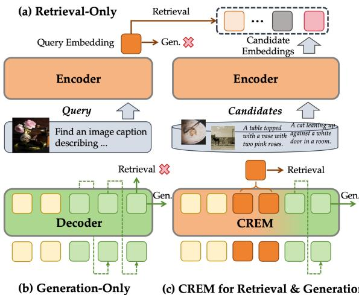
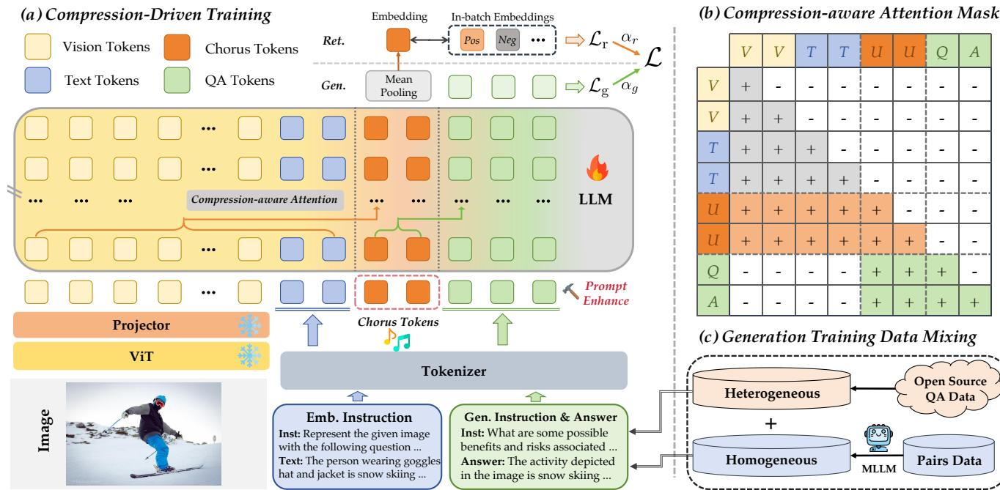
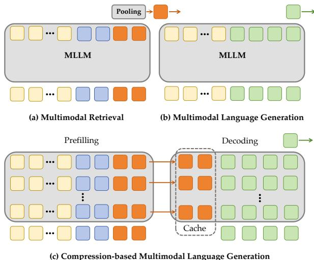
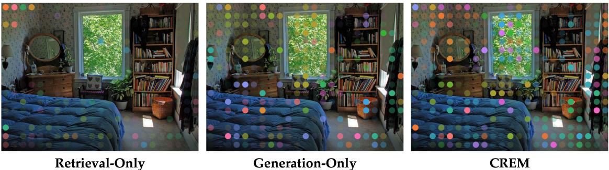

# CREM: 基于压缩驱动的多模态检索与理解的表示增强

刘立豪\* 王焱\* 杨标\* 蒋佳\mathrm{Li^{2*}} 曹江夏 罗宇晓 陈翔 沃向宇\mathrm{W u^{2}} 袁伟 方扬 丁桂光\1 高婷婷\2 周国瑞\2 1清华大学 2快手科技

# 摘要

多模态大语言模型（MLLMs）在视觉描述和视觉问答等理解任务中表现出了显著的成功。然而，由于输出格式和优化目标之间的差异，它们在嵌入基础的任务（如检索）中的直接应用仍然具有挑战性。以往的方法通常采用对比微调来调整MLLMs以进行检索，但代价是失去了其生成能力。我们认为，无论是生成任务还是嵌入任务，基本上都依赖于共享的认知机制，特别是跨模态表示对齐和上下文理解。为此，我们提出了CREM（压缩驱动的表示增强模型），它提供了一个统一的框架，在增强多模态表示以进行检索的同时保留生成能力。具体而言，我们引入了一种基于压缩的提示设计，使用可学习的合唱词元来聚合多模态语义，并通过压缩感知注意力融合对比和生成目标的压缩驱动训练策略。大量实验表明，CREM在MMEB上实现了最先进的检索性能，同时在多个理解基准上保持了强大的生成性能。我们的发现强调，生成监督可以进一步改善在所提出的压缩驱动范式下MLLMs的表示质量。

# 1. 引言

多模态大语言模型（MLLMs）通过将输入能力扩展到视觉数据而取得了显著进展。这些模型能够整合来自不同模态的信息，并在视觉问答、视觉定位和复杂推理等多种任务中展现了卓越的性能。使这种多功能性得以实现的关键因素在于，MLLMs能够将这些任务统一为对话格式，从而使其能够进行训练。然而，由于生成和嵌入之间的根本不匹配，MLLMs的下一个词预测机制限制了其为下游应用如检索和推荐系统生成高质量表示的能力。

  
Figure 1. Comparison of Different Paradigms. (a) Embedding models fall short on generation tasks. (b) Generative models lack retrieval capability. (c) Our proposed model CREM enables both in a single model.

此前的研究 [5, 16, 20, 21, 23, 35, 55, 56, 58] 探索了通过对比学习将多模态大语言模型（MLLMs）转换为嵌入模型。这些基于MLLM的嵌入模型表现出了竞争力的结果，往往优于传统的基于CLIP的模型 [19, 27, 41]。然而，在经过对比表示学习后，这些嵌入模型丧失了其原有的生成能力，并且在完成问答任务时面临困难，如图1(a)所示。这表明MLLM在生成能力和嵌入能力之间存在权衡。尽管生成任务和嵌入任务在本质上差异显著，但它们都要求MLLM具备共享能力，例如跨模态对齐和上下文推理。生成能力与嵌入能力之间的关系如同硬币的两面。虽然它们共享基础能力，但优化其中一个通常会以牺牲另一个为代价。这一现象提出了一个重要问题：MLLM是否能在不损害生成能力的情况下平滑提升表示能力？社区已经进行了初步探索。CAFe [50] 引入了一个框架，联合优化对比损失和语言建模损失，旨在统一嵌入与生成。具体而言，CAFe利用两种不同的提示来指导MLLM适应不同的任务（例如，i. 用一个词压缩这个图像/句子：和 ii. 描述这个图像：），并通过简单地添加损失来建立这些任务之间的联系。实际上，这种学习范式将生成和嵌入视为独立的任务，必然导致次优结果：1) 图像/文本信息必须被压缩到有限的表示空间中，和 2) 嵌入与生成任务被隐式地独立建模，忽视了它们之间的内在联系，从而导致两者任务间的权衡。为克服这些限制，我们引入了CREM，该模型基于一个统一的框架，利用可学习的合唱词元结合压缩驱动的训练范式，实现嵌入与生成任务的无缝整合。该框架旨在将视觉和文本信息压缩为一组紧凑的特殊词元，作为多种下游应用的通用表示。主要创新在于统一的基于提示的对齐和新颖的压缩感知注意力机制，该机制通过约束合唱词元关注之前的输入，同时允许指令和答案聚焦于压缩表示来协调特征交互。非对称注意力设计确保了信息流的高效性，同时保持任务特定的适应性。此外，我们从不同来源聚合生成数据，以增强一致性，同时保持泛化能力。通过这些机制，CREM在不妥协的情况下增强了表示能力并实现了强大的性能。我们在检索基准MMEB [21] 和多项理解基准（如MMB [34]，MMMU [53]）上评估了CREM的性能。得益于压缩驱动的表示增强，CREM在多模态检索中实现了最先进的性能，显著超越了仅基于检索数据训练的嵌入模型，同时保持其语言生成能力，降幅几乎可以忽略不计。这说明生成能力与嵌入能力之间的内在关系，即生成监督可以帮助MLLM在统一优化下提升嵌入质量。此外，为了评估压缩词元的质量，我们仅基于压缩表示进行相同的理解任务。我们观察到，即使在进行了 $8 0 \times$ 的词元减少后，模型仍能保留 $83 \%$ 的响应质量，表明压缩词元保留了足够的信息用于检索和理解。这也展示了在下游应用中减少KV缓存大小和上下文长度的潜在应用。该工作的主要贡献总结如下：• 我们提出了一种基于压缩的提示设计，引入可学习的合唱词元作为嵌入与生成之间的桥梁。该设计为高质量检索嵌入与生成词元提供了广泛而一致的表示空间。• 我们开发了一种压缩驱动的训练策略，在统一框架内联合优化对比学习和语言建模。通过引入压缩感知注意力机制和生成数据混合策略，该方法实现了动态的跨任务互动和两个范式之间的高效知识共享。 大量实验表明，CREM在检索基准MMEB上实现了最先进的性能，同时保持理解能力。我们还进行了广泛的分析，以证明生成可以有效提高检索性能。

# 2. 相关工作

多模态大语言模型（MLLMs）通过联合处理和整合跨模态信息扩展了大语言模型（LLMs）[2, 31, 40, 48, 59]。早期工作如LLaVA [31, 33]通过投影集成视觉编码器，将视觉输入转换为与语言兼容的词元。LLaVA-OneVision [25]整合了LLaVA系列的数据信息、模型和训练策略。主要模型如Qwen-VL [3, 43]和InternVL [9, 60]系列通过架构创新、改进训练和大规模数据集，进一步推动了多模态理解，支持复杂任务。

多模态表示学习模型，如 CLIP、SigLIP 和 CoCa，通过对每种模态进行独立编码，从弱监督的图像-文本对中学习对齐表示。近期的方法旨在利用嵌入在大语言模型中的丰富预训练知识，构建高质量的通用嵌入。例如，E5-V 采用了一种单模态训练范式，在图像-文本检索中超过传统的多模态方法。VLM2Vec 引入了一种对比学习框架，能够处理基于指令的多模态对。mmE5 采用数据合成策略，以增强多模态多语言嵌入，而 UniME 通过文本知识蒸馏和困难负样本感知的指令调优来提升性能。LLaVE 进一步通过利用负样本的区分难度来改善多模态嵌入。UNITE 对模态特定数据进行了系统分析，并提出了一种模态感知训练方案，以减轻跨模态实例之间的竞争。尽管取得了这些进展，但大语言模型在适应嵌入任务时，往往妥协其生成能力，且转移过程仍然不够优化，可能导致生成知识的丧失。

  
i. k $" + "$ indicates e .

统一生成嵌入模型 最近的研究[11, 36, 38, 39, 50]探讨了在单一框架内统一生成和嵌入目标，以克服任务特定架构的局限性。GRITLM [38]采用指令微调，使大语言模型能够灵活切换生成和嵌入模式。Sugar [11]引入了一种结构诱导的训练策略，通过交替的图像-文本序列联合建模判别和生成能力。MM-GEM [36]证明了具有共享池化机制的统一视觉-语言架构可以有效支持这两项任务，在检索和图像描述方面实现了有竞争力的结果。VladVA [39]利用短和长的描述进行联合自回归学习和图像-文本对比对齐。CAFe [50]整合了对比和自回归目标，以在详细的图像-文本描述上微调大语言模型，提升检索准确性和生成连贯性。然而，这些方法大多依赖于简单的将两个独立损失函数结合在一起的方式。一个真正统一的范式，能够同时增强生成和嵌入视角的表示学习，仍未得到深入探索。多模态词元压缩。在大语言模型中，词元压缩旨在将冗余的视觉词元浓缩为紧凑的表示，以减轻二次计算开销并缓解生成时的上下文溢出。已经探索了一系列压缩策略。一些方法在大语言模型输入层进行词元剪枝[12, 29, 42, 46]，而其他方法则根据注意力图或相似性度量逐步在编码器或解码器层中丢弃词元[8, 45, 47, 57]。尽管Perceiver Resampler [1, 2, 18]和Q-Former [28]通过交叉注意力聚合密集的视觉词元，但其他研究[44, 49]则利用大语言模型的自注意力能力来压缩全面的视觉信息。CoMa [26]引入了一个压缩的预训练阶段，明确将信息覆盖与判别匹配解耦。这些进展强调了我们观察到的生成任务的词元压缩与嵌入学习存在内在目标的一致性。

# 3. 方法

如图 2(a) 所示，CREM 引入了一组可学习的合唱词元，旨在存储和共享紧凑的语义信息，这些信息可以共同用于嵌入和生成任务。在训练过程中，这些特殊词元被附加到原始的多模态输入中，以对原始词元进行语义压缩。基于结果压缩表示，我们联合优化两个互补的目标：1) 对于嵌入任务，我们对汇聚表示应用对比学习；2) 对于生成任务，我们限制模型仅从压缩表示中生成响应。这个以压缩为驱动的框架增强了信息存储的表示能力，同时将本质上不同任务的优化对齐在一致的表示空间内。此外，我们观察到压缩表示在推理过程中自然地充当冗余多模态词元的有效替代，减少了 KV 缓存的大小，同时保留了模型的大部分理解能力。

# 3.1. 基于压缩的提示设计

对于多模态生成，模型提示通常采用结构化模板组织，其中系统和用户提供指令，助理在前置标记的基础上生成响应。相比之下，嵌入模型通常采用不一致的提示模板，并使用EOS标记作为编码表示。从检索的角度来看，EOS标记作为视觉内容的聚合表示，而从理解的角度来看，视觉特征标记捕捉了细粒度的空间和语义细节。这两种范式表现出不同的特征：检索逐渐将视觉特征提炼为紧凑的EOS表示，而理解依赖于众多视觉标记之间稀疏的交互。以往的研究表明，现有的视觉表示包含相当大的空间和语义冗余，暗示着压缩的巨大潜力。受到此启发，我们提出重建检索优化压缩特征（即EOS标记）作为理解任务的语义原语。这种重建形成一个统一的表示单元，称为合唱标记，作为连接理解和检索的共享载体。通过这种统一的表示，我们的框架以端到端的方式协调检索和理解的双重目标，将视觉信息提炼为紧凑而又语义丰富的合唱标记。系统：您是一个可以表示和理解多模态输入的助手。用户：<image> [eInst] <chorus> [gInst] 助理：<answer> 为了实现这一目标，我们统一了两个任务的提示设计。具体而言，嵌入过程被重新构造为遵循生成风格的提示，充分利用模型固有的指令跟随能力。然后，我们在嵌入指令$\tau$ ([eInst])和生成指令$\mathcal{Q}$ ([gInst])之间将合唱标记$\mathcal{U}$ (<chorus>)插入用户内容中，作为先前视觉标记$\nu$ (<image>)和文本标记$\tau$的压缩表示。在生成过程中，助理根据合唱表示生成响应$\mathcal{A}$ (<answer>)，合唱表示充当全多模态输入的高效替代。因此，两个任务都被构造成一个联合优化目标，最大化合唱标记和多模态表示之间的互信息。

$$
\mathbb { I } _ { \mathcal { V } , \mathcal { T } ; \mathcal { U } } = D _ { \mathrm { K L } } \left( p ( \mathcal { V } , \mathcal { T } , \mathcal { U } ) \parallel p ( \mathcal { V } , \mathcal { T } ) \otimes p ( \mathcal { U } ) \right)
$$

如图2(b)所示，视觉词元 $\nu$ 和文本词元 $\tau$ 仅对合唱词元 $\mathcal { U } 可见，而对问题词元 $\mathcal { Q }$ 和答案词元 $\mathcal { A }$ 隐藏。为了实现将现有模型无缝适配到统一框架的目标，我们通过压缩感知的注意力掩码 $M$ 来调节这种可见性。具体而言，我们通过限制问题-答案词元对原始文本和视觉词元的注意力流动，修改标准的因果注意力掩码，定义如下：

$$
M _ { i j } = { \left\{ \begin{array} { l l } { 0 , } & { { \mathrm { i f ~ } } i \in ( \mathscr { Q } , \mathscr { A } ) { \mathrm { ~ a n d ~ } } j \in ( \mathscr { V } , \mathscr { T } ) , } \\ { 1 ( j \leq i ) , } & { { \mathrm { o t h e r w i s e } } . } \end{array} \right. }
$$

# 3.2. 压缩驱动的训练策略

基于上述方法，我们将检索和生成整合到一个共享的优化空间中。我们进一步引入了两种生成数据混合策略来优化该空间，如图2(c)所示。1) 同质数据混合：两个任务使用相同的样本，其中每个检索对都通过一个现成的大型语言模型生成的QA风格数据进行增强。对于图像—文本样本，基于图像和指令生成描述性答案。对于仅文本数据（例如，标题或标签），将[gInst]设置为“重构所表示的文本”，以通过生成促发文本重构。我们在同一样本上计算对比损失和生成损失，以鼓励跨任务一致性。2) 异质数据混合：检索和生成样本来自不同来源，但在每个批次内共同优化。对于生成样本，[eInst]设置为“表示给定图像”，而[gInst]对应于与图像相关的查询。通过梯度累积，这两个任务在单个批次内混合，其中任务特定损失独立计算并在统一的反向传播之前进行累积。多样化生成数据的纳入增强了细粒度表示学习，并有助于在多模态理解中保持强大的泛化能力。

  
Figure 3. CREM Inference Modes. (a) Retrieval embeddings are derived from pooled chorus tokens. (b) Native next-token prediction is performed with full access to all vision tokens (Nat.). (c) Efficient inference is achieved by pruning vision tokens and reducing KV caches (Comp.).

对于对比学习，我们遵循文献[21]中提出的基于指令的多模态对比学习框架。基于图像-文本对数据，我们通过合成指令驱动的查询$q$和目标$t$构建正样本对，并针对检索任务计算批内负样本的标准InfoNCE损失：

$$
\mathcal { L } _ { \mathrm { r } } = - \log \frac { \phi ( \mathbf { h } _ { q } , \mathbf { h } _ { t ^ { + } } ) } { \phi ( \mathbf { h } _ { q } , \mathbf { h } _ { t ^ { + } } ) + \displaystyle \sum _ { t ^ { - } \in \mathbb { N } } \phi ( \mathbf { h } _ { q } , \mathbf { h } _ { t ^ { - } } ) }
$$

在这里，$\mathbb { N }$ 表示所有负样本的集合，$\phi$ 是一个计算匹配分数的函数。我们采用余弦相似度函数作为 $\phi ( \mathbf { h } _ { q } , \mathbf { h } _ { t } ) = \exp ( \cos ( \mathbf { h } _ { q } , \mathbf { h } _ { t } ) / \tau )$，其中 $\tau$ 是一个温度超参数。表示 $\mathbf { h } _ { q }$ 和 $\mathbf { h } _ { t }$ 是通过对 $k$ 个可学习合唱标记的表示 $\mathbf { h } _ { u }$ 进行均值池化获得的。为了促进训练收敛，同时保留模型的原生生成能力，我们引入了随机压缩驱动的语言建模损失。具体而言，我们定义一个伯努利随机变量 $z \sim$ 伯努利 $( p )$，用于控制生成模型是基于完整的多模态上下文 ($z = 0$) 还是仅基于压缩表示 ($z = 1$) 来进行条件生成。于是，生成目标可以形式化为：

$$
\mathcal { L } _ { \mathrm { g } } = - \frac { 1 } { T } \sum _ { t = 1 } ^ { T } \log p _ { C } ( y _ { t } \mid y _ { < t } , \mathcal { U } , 1 _ { z = 0 } ( \mathcal { V } , \mathcal { T } ) ) .
$$

这种随机化形式鼓励模型保持压缩鲁棒性和生成流畅性。因此，整体的多任务目标是对比损失和语言建模损失的加权组合：

$$
{ \mathcal { L } } = \alpha _ { \mathrm { { r } } } { \mathcal { L } } _ { \mathrm { r } } + \alpha _ { \mathrm { { g } } } { \mathcal { L } } _ { \mathrm { g } }
$$

# 3.3. 多任务推理模式

我们的压缩驱动训练不仅提高了表示质量，还实现了高效的生成推理。所得到的压缩表示可以同时作为多模态嵌入和即插即用的键值缓存。通过在解码过程中丢弃之前的多模态标记，我们支持更长的输入上下文并减少内存消耗。对于检索任务，由于下游处理是非自回归的，输出仅依赖于先前的标记，推理过程与传统流程基本保持一致。最终层的所有合唱表示被汇聚形成多模态嵌入，如图3(a)所示。对于生成任务，我们采用双路径解码策略。如图3(b)所示，模型能够以原生格式处理多模态输入，而无需插入合唱标记$\mathcal{U}$。在基于压缩的生成中，合唱标记$\mathcal{U}$在单次前向传播中被用来聚合信息，如图3(c)所示。这些标记随后可以填充键值缓存以进行解码，或被存储以供今后重用，从而消除了冗余计算并减少了长上下文场景下的内存使用。

# 4. 实验

训练数据集 由于一致的优化策略，CREM 自然融合了检索和生成的能力。为了在训练过程中有效激活这些功能，我们采用了两类数据：面向检索的和面向生成的数据集。对于检索训练，我们使用了大规模多模态嵌入基准（MMEB）[21] 的训练拆分，其中包含来自四个元任务类别的数据集：分类、视觉问答、检索和视觉定位。对于面向生成的训练，我们利用了两个互补来源。异构的 ShareGPT-4V 数据集 [6] 被用于增强词元压缩，同时保持模型的泛化能力。此外，对于同质生成数据，我们使用 Qwen2.5-VL-7B [3] 来合成与每个 MMEB 样本对应的问答风格数据，从而实现跨任务的一致监督。各数据集组的平均精度 $@ 1$ 如上所示。每列中的最高分以加粗显示，第二好的结果则用下划线标出。

<table><tr><td rowspan="2">Model</td><td rowspan="2">Backbone</td><td rowspan="2">#Params</td><td colspan="4">Per Meta-Task Score</td><td colspan="3">Average Score</td></tr><tr><td>Classification</td><td>VQA</td><td>Retrieval</td><td>Grounding</td><td>IND</td><td>OOD</td><td>Overall</td></tr><tr><td># of Datasets →</td><td></td><td></td><td>10</td><td>10</td><td>12</td><td>4</td><td>20</td><td>16</td><td>36</td></tr><tr><td>CLIP [41]</td><td>-</td><td>0.4B</td><td>55.2</td><td>19.7</td><td>53.2</td><td>62.2</td><td>47.6</td><td>42.8</td><td>45.4</td></tr><tr><td>OpenCLIP [10]</td><td>-</td><td>0.4B</td><td>56.0</td><td>21.9</td><td>55.4</td><td>64.1</td><td>50.5</td><td>43.1</td><td>47.2</td></tr><tr><td colspan="10">&lt; 3B Models</td></tr><tr><td>VLM2Vec [21]</td><td>Qwen2-VL</td><td>2B</td><td>59.0</td><td>49.4</td><td>65.4</td><td>73.4</td><td>66.0</td><td>52.6</td><td>59.3</td></tr><tr><td>VLM2Vec-V2 [37]</td><td>Qwen2-VL</td><td>2B</td><td>62.9</td><td>56.3</td><td>69.5</td><td>77.3</td><td>68.7</td><td>60.1</td><td>64.9</td></tr><tr><td>GME [56]</td><td>Qwen2-VL</td><td>2B</td><td>54.4</td><td>29.9</td><td>66.9</td><td>55.5</td><td>-</td><td>-</td><td>51.9</td></tr><tr><td>UNITTE [23]</td><td>Qwen2-VL</td><td>2B</td><td>63.2</td><td>55.9</td><td>65.4</td><td>75.6</td><td>65.8</td><td>60.1</td><td>63.3</td></tr><tr><td>LLaVE [24]</td><td>Aquila-VL</td><td>2B</td><td>62.1</td><td>60.2</td><td>65.2</td><td>84.9</td><td>69.4</td><td>59.8</td><td>65.2</td></tr><tr><td>CAFe [50]</td><td>LLaVA-OV</td><td>1B</td><td>59.1</td><td>49.1</td><td>61.0</td><td>83.0</td><td>64.3</td><td>53.7</td><td>59.6</td></tr><tr><td>CREM (Ours)</td><td>Qwen2-VL</td><td>2B</td><td>65.8</td><td>60.7</td><td>68.3</td><td>78.9</td><td>70.8</td><td>61.5</td><td>66.7</td></tr><tr><td colspan="10">&gt; 7B Models</td></tr><tr><td>E5-V [20]</td><td>LLaVA-1.6</td><td>7B</td><td>39.7</td><td>10.8</td><td>39.4</td><td>60.2</td><td>34.2</td><td>33.9</td><td>33.9</td></tr><tr><td>MMRet [58]</td><td>LLaVA-1.6</td><td>7B</td><td>56.0</td><td>57.4</td><td>69.9</td><td>83.6</td><td>68.0</td><td>59.1</td><td>65.8</td></tr><tr><td>VLM2Vec [21]</td><td>Qwen2-VL</td><td>7B</td><td>62.6</td><td>57.8</td><td>69.9</td><td>81.7</td><td>72.2</td><td>57.8</td><td>65.8</td></tr><tr><td>UniME [16]</td><td>LLaVA-OV</td><td>7B</td><td>66.8</td><td>66.6</td><td>70.5</td><td>90.9</td><td>-</td><td>-</td><td>70.7</td></tr><tr><td>UNITE [23]</td><td>Qwen2-VL</td><td>7B</td><td>68.3</td><td>65.1</td><td>71.6</td><td>84.8</td><td>73.6</td><td>66.3</td><td>70.3</td></tr><tr><td>mmE5 [5]</td><td>Llama-3.2-Vision</td><td>11B</td><td>67.6</td><td>62.8</td><td>70.9</td><td>89.7</td><td>72.3</td><td>66.7</td><td>69.8</td></tr><tr><td>CAFe [50]</td><td>LLaVA-OV</td><td>7B</td><td>65.2</td><td>65.6</td><td>70.0</td><td>91.2</td><td>75.8</td><td>62.4</td><td>69.8</td></tr><tr><td>CREM (Ours)</td><td>Qwen2-VL</td><td>7B</td><td>68.3</td><td>69.4</td><td>72.9</td><td>86.1</td><td>75.6</td><td>67.8</td><td>72.1</td></tr></table>

评估与指标 我们在MMEB基准上评估检索性能，该基准还提供了全面的评估数据划分。根据元任务分类法，36个评估数据集被分为20个分布内子集和16个分布外子集。我们采用准确率 $@ 1$ 作为主要指标，强调排名靠前候选项的正确性。在生成评估中，我们进行了广泛而系统的比较。为了严格评估我们方法所带来的改进，我们采用多个已确立的基准，包括MMB [34]、MMVet [52]、AI2D [22]、Hallusion-Bench [17]、MMMU [53] 和MMStar [7]，遵循Qwen-VL [43]的评估协议。我们在两种设置下报告平均性能：1) Nat.，所有视觉词元均被完全关注，以评估模型的内在生成能力；2) Comp.，仅保留合唱词元作为压缩视觉上下文，以评估压缩表示的细粒度保真度。

实现细节 我们采用 Qwen2-VL 作为主干模型，并使用 LoRA 进行训练，秩为 16，alpha 为 64。合唱词元的数量 $k$ 默认设置为 16。每个训练批次包括 1024 个标签为检索的同质样本和 128 个标签为生成的异质样本。按照 VLM2Vec 的方法，我们应用 GradCache 来扩大每设备有效批次大小，并采用交错采样策略进行检索任务，其中一个全局批次被划分为 $n$ 个子批次，每个子批次对应一个不同的数据集。模型采用动态分辨率，将视觉词元的数量限制为最多 1280，总上下文长度限制为 2048。训练进行 2000 步，学习率为 $5 e ^ { - 5 }$，热身步骤为 100 步。检索和生成的损失权重分别设置为 $\alpha _ { \mathrm { { r } } } = 1$ 和 $\alpha _ { \mathrm { g } } = 0 . 5$。生成损失中的压缩概率 $p$ 固定为 0.5。

# 5. 主要结果

多模态检索 如表1所示，CREM的表现优于专门用于检索的模型，即便其仅采用批内负样本训练策略，且与VLM2Vec [21, 37]使用相同的数据调度。CREM优于基于大规模多源数据训练的UNITE [23]、采用困难负样本采样策略的UniME [16]以及使用合成数据训练的更大模型如mmE5 [5]。与CAFe [50]相比，CREM在检索准确性上表现更优，尽管CAFe在多任务训练后进行了针对MMEB的特定微调。这些改进主要归功于基于压缩的提示设计和与压缩驱动目标的统一训练。TaRuMul nsrsaal 不同模型的生成能力。$\mathbf { C R E M } _ { G }$指的是仅使用标准生成流程在ShareGPT-4V数据集上微调的Qwen2-VL，而$\mathbf { C R E M } _ { R }$表示在遵循VLM2Vec [21]的MMEB上独立训练的Qwen2-VL。“AVG”表示……

<table><tr><td>Model</td><td>MMB</td><td>MMVet</td><td>AI2D</td><td>Hallusion</td><td>MMMU</td><td>MMStar</td><td>AVG</td></tr><tr><td colspan="8">2B Models</td></tr><tr><td>Qwen2-VL</td><td>72.3</td><td>45.7</td><td>73.8</td><td>41.9</td><td>41.1</td><td>46.1</td><td>53.5</td></tr><tr><td>CREMG</td><td>73.1</td><td>44.5</td><td>72.9</td><td>41.0</td><td>41.2</td><td>46.2</td><td>53.2</td></tr><tr><td>CREMR</td><td>64.3</td><td>17.3</td><td>66.7</td><td>33.6</td><td>34.9</td><td>43.9</td><td>43.4</td></tr><tr><td>CREM</td><td>72.5</td><td>45.1</td><td>72.8</td><td>41.2</td><td>41.4</td><td>45.5</td><td>53.1</td></tr><tr><td colspan="8">7B Models</td></tr><tr><td>Qwen2-VL</td><td>80.9</td><td>58.0</td><td>82.2</td><td>50.9</td><td>53.7</td><td>59.5</td><td>64.2</td></tr><tr><td>CREMG</td><td>80.7</td><td>56.8</td><td>81.9</td><td>49.2</td><td>51.7</td><td>59.8</td><td>63.4</td></tr><tr><td>CREMR</td><td>77.3</td><td>41.4</td><td>80.9</td><td>44.5</td><td>47.0</td><td>56.9</td><td>58.0</td></tr><tr><td>CREM</td><td>80.5</td><td>56.7</td><td>81.9</td><td>48.8</td><td>52.1</td><td>59.3</td><td>63.2</td></tr></table>

多模态语言生成 如表2所示，我们的方法使模型在保持生成能力的同时，实现了最先进的多模态检索性能。为了隔离生成训练数据的影响，我们直接在相同批次大小和训练步骤下对Qwen2-VL进行微调，使用ShareGPT-4V作为参考。结果显示，CREM的性能与原始和微调基线相当，而仅在检索任务上训练的模型（\({ \mathrm { C R E M } _ { R } }\)）表现出显著的性能下降，特别是在开放式问题情境下，如MMVet。这表明我们统一框架与生成任务的兼容性，且未损害整体模型能力。

Table 3. Analysis on Retrieval and Generation. "Ret." denotes training on retrieval datasets; "Gen." denotes training on generation datasets. "CPD" indicates the compression-based prompt design, and "CTS" refers to the compression-driven training strategy.   

<table><tr><td rowspan="2">Ret.</td><td rowspan="2">Gen.</td><td rowspan="2">CPD</td><td rowspan="2">CTS</td><td colspan="2">Generation</td><td rowspan="2">Retrieval MMEB</td></tr><tr><td>Nat.</td><td>Comp.</td></tr><tr><td>✓</td><td></td><td></td><td></td><td>43.4</td><td>-</td><td>62.3</td></tr><tr><td rowspan="3"></td><td rowspan="3">V</td><td></td><td></td><td>53.2</td><td></td><td>2.9</td></tr><tr><td></td><td></td><td>47.2</td><td></td><td>66.1</td></tr><tr><td></td><td></td><td>53.0</td><td>43.9</td><td>21.1</td></tr><tr><td></td><td></td><td></td><td></td><td>52.8</td><td></td><td>65.5</td></tr><tr><td></td><td></td><td></td><td>√</td><td>53.1</td><td>44.2</td><td>66.7</td></tr></table>

# 6. 分析

检索与生成分析 我们进一步分析检索和生成任务之间的关系，见表3。我们的基线实验是在MMEB上训练一个针对检索的特定模型，在ShareGPT-4V上训练一个针对生成的特定模型，结果显示了一个明显的限制：每个模型在其主要任务上表现良好，但在另一个任务上的能力却严重下降甚至缺失。为了解决这个问题，我们引入了一种基于压缩的提示设计（CPD），并分别在检索和生成数据集上训练模型，其中生成任务是在一种驱动压缩的策略（CTS）下进行优化。结果表明，检索性能显著受益于优化空间的扩大和生成风格提示模板的使用。同时，基于压缩的训练保持了多模态理解，同时在推理过程中实现了高效的词元压缩。值得注意的是，检索任务的表现也有所提升，这表明引入压缩表示有助于跨任务迁移。我们进一步通过结合检索目标与生成监督的加性损失，评估了一种简单的混合训练方法。我们观察到，当这两个任务天真地一起训练时，即使使用生成风格的模板和合唱词元，检索和生成的性能都会下降。这些发现突出了基于压缩的训练策略（CTS）的重要性，其中一致且富有信息的生成监督在强化检索表示中发挥了关键作用。 关于合唱词元的分析 我们研究了合唱词元的类型和数量对检索和生成性能的影响。传统的嵌入模型通常依赖于一个单一词元（例如，EOS词元）进行检索。如表4所示，使用EOS词元会严重削弱生成能力，而用一个未使用的特殊词元替代作为合唱词元则缓解了这个问题。我们进一步观察到，增加表示词元的数量会对检索准确率产生适度提升，但最终会在超过某个阈值时导致性能下降。这一发现反映了稀疏与密集表示空间之间的权衡。考虑到性能和压缩效率，我们将合唱词元的默认数量设置为16。

  
attention strength.

Table 4. Analysis on Different Chorus Token Design. "CTok." refers to the type or the number of chorus token. "Cache" denotes the KV cache ratio during decoding, with $100 \%$ corresponds to full caching $\sim 1 2 8 0$ tokens).   

<table><tr><td>CTok.</td><td>MMEB</td><td>Nat.</td><td>Comp.</td><td>Cache(%)</td></tr><tr><td>EOS</td><td>62.3</td><td>43.4</td><td></td><td>100%</td></tr><tr><td>1</td><td>65.6</td><td>51.9</td><td>38.2</td><td>0.07%</td></tr><tr><td>4</td><td>66.1</td><td>52.3</td><td>41.7</td><td>0.28%</td></tr><tr><td>8</td><td>66.5</td><td>52.5</td><td>43.1</td><td>0.56%</td></tr><tr><td>16</td><td>66.7</td><td>53.1</td><td>44.2</td><td>1.12%</td></tr><tr><td>32</td><td>66.7</td><td>52.9</td><td>44.6</td><td>2.24%</td></tr><tr><td>64</td><td>66.6</td><td>53.1</td><td>46.2</td><td>4.48%</td></tr></table>

生成数据混合分析 在检索和生成的联合训练中，我们利用设计的同质和异质生成数据的混合。如表5所示，我们进一步探讨了每个数据源对模型性能的影响。在压缩驱动的联合训练下，纳入同质数据显著提升了生成质量，尽管仍未达到原始性能。此外，它有助于提高检索嵌入质量，展示了同质样本的协同效应。另一方面，单独使用异质数据进行训练显著提升了理解能力，但在嵌入质量上仅带来了适度的提高。通过在混合训练方案中结合两种数据类型，实现了最佳的整体性能，既增强了表示质量，又保持了在理解任务中的强健泛化能力。

Table 5. Analysis on Generation Data Mixing. "HMD" denotes training with homogeneous data, which are pseudo-labeled from retrieval pairs, while "HTD" denotes training with heterogeneous data collected from open-source datasets.   

<table><tr><td rowspan="2">HMD</td><td rowspan="2">HTD</td><td colspan="2">Generation</td><td rowspan="2">Retrieval MMEB</td></tr><tr><td>Nat.</td><td>Comp.</td></tr><tr><td rowspan="3">√</td><td></td><td>47.2</td><td>-</td><td>66.1</td></tr><tr><td></td><td>49.8</td><td>42.5</td><td>66.5</td></tr><tr><td></td><td>53.0</td><td>44.0</td><td>66.2</td></tr><tr><td>√</td><td>√</td><td>53.1</td><td>44.2</td><td>66.7</td></tr></table>

可视化 我们可视化了在不同训练范式下合唱词元的空间聚焦（仅检索模型、压缩驱动生成模型和我们提出的CREM）。我们使用 $" < I m \cdot$ age> \n表示给定图像" 的提示来引导模型，并从中间层获取所有合唱词元对视觉词元的注意力分数。如图4所示，仅检索模型产生了集中在少数区域的稀疏注意力，反映出冗余。压缩驱动生成导致更广泛的注意力，但全球覆盖有限。相比之下，CREM 将注意力更均匀地分配在图像上，捕捉到不同且互补的区域。

# 7. 结论

在本研究中，我们提出了CREM，它通过统一的压缩驱动框架连接检索和理解。通过将基于压缩的提示设计与对比目标和生成目标的联合优化相结合，我们的方法在提升多模态表征的同时，保持了竞争性的生成性能。针对MMEB和多个理解基准的广泛实验结果证明了其有效性，为未来的统一表征学习和生成建模提供了一条可扩展的路径。

# References

[1] Jean-Baptiste Alayrac, Jeff Donahue, Pauline Luc, Antoine Miech, Iain Barr, Yana Hasson, Karel Lenc, Arthur Mensch, Katherine Millican, Malcolm Reynolds, et al. Flamingo: a visual language model for few-shot learning. Advances in neural information processing systems, 35:2371623736, 2022. 3   
[2] Jinze Bai, Shuai Bai, Yunfei Chu, Zeyu Cui, Kai Dang, Xiaodong Deng, Yang Fan, Wenbin Ge, Yu Han, Fei Huang, et al. Qwen technical report. arXiv preprint arXiv:2309.16609, 2023. 1, 2, 3   
[3] Shuai Bai, Keqin Chen, Xuejing Liu, Jialin Wang, Wenbin Ge, Sibo Song, Kai Dang, Peng Wang, Shijie Wang, Jun Tang, et al.Qwen2. 5-vl technical report. arXiv prerint arXiv:2502.13923, 2025. 2, 5   
[4] Daniel Bolya, Cheng-Yang Fu, Xiaoliang Dai, Peizhao Zhang, Christoph Feichtenhofer, and Judy Hoffman. Token merging: Your vit but faster. arXiv preprint arXiv:2210.09461, 2022. 4   
[5] Haonan Chen, Liang Wang, Nan Yang, Yutao Zhu, Ziliang Zhao, Furu Wei, and Zhicheng Dou. mme5: Improving multimodal multilingual embeddings via high-quality synthetic data. arXiv preprint arXiv:2502.08468, 2025. 1, 2, 3, 6   
[6] Lin Chen, Jinsong Li, Xiaoyi Dong, Pan Zhang, Conghui He, Jiaqi Wang, Feng Zhao, and Dahua Lin. Sharegpt4v: Improving large multi-modal models with better captions. In European Conference on Computer Vision, pages 370387. Springer, 2024. 5   
[7] Lin Chen, Jinsong Li, Xiaoyi Dong, Pan Zhang, Yuhang Zang, Zehui Chen, Haodong Duan, Jiaqi Wang, Yu Qiao, large vision-language models? Advances in Neural Information Processing Systems, 37:2705627087, 2024. 6   
[8] Liang Chen, Haozhe Zhao, Tianyu Liu, Shuai Bai, Junyang Lin, Chang Zhou, and Baobao Chang. An image is worth 1/2 tokens after layer 2: Plug-and-play inference acceleration for large vision-language models. In European Conference on Computer Vision, pages 1935. Springer, 2024. 3, 4   
[9] Zhe Chen, Weiyun Wang, Yue Cao, Yangzhou Liu, Zhangwei Gao, Erfei Cui, Jinguo Zhu, Shenglong Ye, Hao Tian, Zhaoyang Liu, et al. Expanding performance boundaries of open-source multimodal models with model, data, and testtime scaling. arXiv preprint arXiv:2412.05271, 2024. 1, 2, 4   
10] Mehdi Cherti, Romain Beaumont, Ross Wightman, Mitchell Wortsman, Gabriel Ilharco, Cade Gordon, Christoph Schuhmann, Ludwig Schmidt, and Jenia Jitsev. Reproducible scaling laws for contrastive language-image learning. In Proceedings of the IEEE/CVF conference on computer vision and pattern recognition, pages 28182829, 2023. 6   
11] Wei Chow, Juncheng Li, Qifan Yu, Kaihang Pan, Hao Fei, Zhiqi Ge, Shuai Yang, Siliang Tang, Hanwang Zhang, and Qianru Sun. Unified generative and discriminative training for multi-modal large language models. Advances in Neural Information Processing Systems, 37:2315523190, 2024. 3   
12] Xiangxiang Chu, Limeng Qiao, Xinyang Lin, Shuang Xu, Yang Yang, Yiming Hu, Fei Wei, Xinyu Zhang, Bo Zhang, Xiaolin Wei, et al. Mobilevlm: A fast, strong and open vision language assistant for mobile devices. arXiv preprint arXiv:2312.16886, 2023. 3 [13] Zheniao Du, Yuje Qian, Xiao Liu, Ming Ding, Jiezhong Q Zhilin Yang, and Jie Tan. Glm: General langage model pretraining with autoregressive blank infilling. arXiv preprint arXiv:2103.10360, 2021. 1 [14] Haodong Duan, Junming Yang, Yuxuan Qiao, Xinyu Fang, Lin Chen, Yuan Liu, Xiaoyi Dong, Yuhang Zang, Pan Zhang, Jiaqi Wang, et al. Vlmevalkit: An open-source toolkit for evaluating large multi-modality models. In Proceedings of the 32nd ACM international conference on multimedia, pages 1119811201, 2024. 1 [15] Luyu Gao, Yunyi Zhang, Jiawei Han, and Jamie Callan. Scaling deep contrastive learning batch size under memory limited setup. arXiv preprint arXiv:2101.06983, 2021. 6 [16] Tiancheng Gu, Kaicheng Yang, Ziyong Feng, Xingjun Wang, Yanzhao Zhang, Dingkun Long, Yingda Chen, Weidong Cai, and Jiankang Deng. Breaking the modality barrier: Universal embedding learning with multimodal llms. arXiv preprint arXiv:2504.17432, 2025. 1, 2, 3, 4, 6 [17] Tianrui Guan, Fuxiao Liu, Xiyang Wu, Ruiqi Xian, Zongxia Li, Xiaoyu Liu, Xijun Wang, Lichang Chen, Furong Huang, Yaser Yacoob, et al. Hallusionbench: an advanced diagnostic suite for entangled language hallucination and visual illusion in large vision-language models. In Proceedings of the IEEE/CVF Conference on Computer Vision and Pattern Recognition, pages 1437514385, 2024. 6 [18] Andrew Jaegle, Felix Gimeno, Andy Brock, Oriol Vinyals, Andrew Zisserman, and Joao Carreira. Perceiver: General perception with iterative attention. In International conference on machine learning, pages 46514664. PMLR, 2021.   
3 [19] Chao Jia, Yinfei Yang, Ye Xia, Yi-Ting Chen, Zarana Parekh, Hieu Pham, Quoc Le, Yun-Hsuan Sung, Zhen Li, and Tom Duerig. Scaling up visual and vision-language representation learning with noisy text supervision. In International conference on machine learning, pages 49044916. PMLR,   
2021. 1 [20] Ting Jiang, Minghui Song, Zihan Zhang, Haizhen Huang, Weiwei Deng, Feng Sun, Qi Zhang, Deqing Wang, and Fuzhen Zhuang. E5-v: Universal embeddings with multimodal large language models. arXiv preprint arXiv:2407.12580, 2024. 1, 2, 4, 6 [21] Ziyan Jiang, Rui Meng, Xinyi Yang, Semih Yavuz, Yingbo Zhou, and Wenhu Chen. Vlm2vec: Training vision-language models for massive multimodal embedding tasks. arXiv preprint arXiv:2410.05160, 2024. 1, 2, 4, 5, 6, 7 [22] Aniruddha Kembhavi, Mike Salvato, Eric Kolve, Minjoon Seo, Hannaneh Hajishirzi, and Ali Farhadi. A diagram is worth a dozen images. In European conference on computer vision, pages 235251. Springer, 2016. 6 [3] Fan Kong, Jign Zhang, Yahu Lu, Honi Zhang, Shi Feng, Xiaocui Yang, Daling Wang, Yu Tian, Fuzheng Zhang, Guorui Zhou, et al. Modality curation: Building universal embeddings for advanced multimodal information re-…: .1 ...V:.. -V:2505 10650 2025 1   
[24] Zhibin Lan, Liqiang Niu, Fandong Meng, Jie Zhou, and Jinsong Su. Llave: Large language and vision embedding models with hardness-weighted contrastive learning. arXiv preprint arXiv:2503.04812, 2025. 2, 3, 6   
[25] Bo Li, Yuanhan Zhang, Dong Guo, Renrui Zhang, Feng Li, Hao Zhang, Kaichen Zhang, Peiyuan Zhang, Yanwei Li, Ziwei Liu, et al. Llava-onevision: Easy visual task transfer. arXiv preprint arXiv:2408.03326, 2024. 2   
[26] Da Li, Yuxiao Luo, Keping Bi, Jiafeng Guo, Wei Yuan, Biao Yang, Yan Wang, Fan Yang, Tingting Gao, and Guorui Zhou. Compression then matching: An efficient pretraining paradigm for multimodal embedding. arXiv preprint arXiv:2511.08480, 2025. 3   
[27] Junnan Li, Dongxu Li, Caiming Xiong, and Steven Hoi. Blip: Bootstrapping language-image pre-training for unified vision-language understanding and generation. In International conference on machine learning, pages 1288812900. PMLR, 2022. 1   
[28] Junnan Li, Dongxu Li, Silvio Savarese, and Steven Hoi. Blip-2: Bootstrapping language-image pre-training with frozen image encoders and large language models. In International conference on machine learning, pages 19730 19742. PMLR, 2023. 3   
[29] Wentong Li, Yuqian Yuan, Jian Liu, Dongqi Tang, Song Wang, Jie Qin, Jianke Zhu, and Lei Zhang. Tokenpacker: Efficient visual projector for multimodal llm. International Journal of Computer Vision, pages 119, 2025. 3   
[30] Sheng-Chieh Lin, Chankyu Lee, Mohammad Shoeybi, Jimmy Lin, Bryan Catanzaro, and Wei Ping. Mm-embed: Universal multimodal retrieval with multimodal llms. arXiv preprint arXiv:2411.02571, 2024. 2   
[31] Haotian Liu, Chunyuan Li, Qingyang Wu, and Yong Jae Lee. Visual instruction tuning. Advances in neural information processing systems, 36:3489234916, 2023. 1, 2, 4   
[32] Haotian Liu, Chunyuan Li, Yuheng Li, and Yong Jae Lee. Improved baselines with visual instruction tuning. In Proceedings of the IEEE/CVF conference on computer vision and pattern recognition, pages 2629626306, 2024. 1   
[33] Haotian Liu, Chunyuan Li, Yuheng Li, Bo Li, Yuanhan Zhang, Sheng Shen, and Yong Jae Lee. Llavanext: Improved reasoning, ocr, and world knowledge, 2024. 2   
[34] Yuan Liu, Haodong Duan, Yuanhan Zhang, Bo Li, Songyang Zhang, Wangbo Zhao, Yike Yuan, Jiaqi Wang, Conghui He, Ziwei Liu, et al. Mmbench: Is your multi-modal model an all-around player? In European conference on computer vision, pages 216233. Springer, 2024. 2, 6, 1   
[35] Yikun Liu, Yajie Zhang, Jiayin Cai, Xiaolong Jiang, Yao Hu, Jiangchao Yao, Yanfeng Wang, and Weidi Xie. Lamra: Large multimodal model as your advanced retrieval assistant. In Proceedings of the Computer Vision and Pattern Recognition Conference, pages 40154025, 2025. 1   
[36] Feipeng Ma, Hongwei Xue, Guangting Wang, Yizhou Zhou, Fengyun Rao, Shilin Yan, Yueyi Zhang, Siying Wu, Mike Zheng Shou, and Xiaoyan Sun. Multi-modal generative embedding model. arXiv preprint arXiv:2405.19333, 2024. 3   
[37] Rui Meng, Ziyan Jiang, Ye Liu, Mingyi Su, Xinyi Yang, Yuepeng Fu, Can Qin, Zeyuan Chen, Ran Xu, Caiming Xiong, et al. Vlm2vec-v2: Advancing multimodal embedding for videos, images, and visual documents. arXiv preprint arXiv:2507.04590, 2025. 2, 6, 1   
[38] Niklas Muennighoff, SU Hongjin, Liang Wang, Nan Yang, Furu Wei, Tao Yu, Amanpreet Singh, and Douwe Kiela. Generative representational instruction tuning. In The Thirteenth International Conference on Learning Representations, 2024. 3   
[39] Yassine Ouali, Adrian Bulat, Alexandros Xenos, Anestis Zaganidis, Ioannis Maniadis Metaxas, Brais Martinez, and Georgios Tzimiropoulos. Vladva: Discriminative fine-tuning of lvlms. In Proceedings of the Computer Vision and Pattern Recognition Conference, pages 41014111, 2025. 3   
[40] Zhiliang Peng, Wenhui Wang, Li Dong, Yaru Hao, Shaohan Huang, Shuming Ma, and Furu Wei. Kosmos-2: Grounding multimodal large language models to the world. arXiv preprint arXiv:2306.14824, 2023. 1, 2   
[41] Alec Radford, Jong Wook Kim, Chris Hallacy, Aditya Ramesh, Gabriel Goh, Sandhini Agarwal, Girish Sastry, Amanda Askell, Pamela Mishkin, Jack Clark, et al. Learning transferable visual models from natural language supervision. In International conference on machine learning, pages 87488763. PmLR, 2021. 1, 2, 6   
[42] Yuzhang Shang, Mu Cai, Bingxin Xu, Yong Jae Lee, and Yan Yan. Llava-prumerge: Adaptive token reduction for effcient large multimodal models. arXiv preprint arXiv:2403.15388, 2024. 3   
[43] Peng Wang, Shuai Bai, Sinan Tan, Shijie Wang, Zhihao Fan, Jinze Bai, Keqin Chen, Xuejing Liu, Jialin Wang, Wenbin Ge, et al. Qwen2-vl: Enhancing vision-language model's perception of the world at any resolution. arXiv preprint arXiv:2409.12191, 2024. 1, 2, 4, 6   
[44] Yuxin Wen, Qingqing Cao, Qichen Fu, Sachin Mehta, and Mahyar Najibi. Efficient vision-language models by summarizing visual tokens into compact registers. arXiv preprint arXiv:2410.14072, 2024. 3   
[45] Long Xing, Qidong Huang, Xiaoyi Dong, Jiajie Lu, Pan Zhang, Yuhang Zang, Yuhang Cao, Conghui He, Jiaqi Wang, Feng Wu, et al. Pyramiddrop: Accelerating your large vision-language models via pyramid visual redundancy reduction. arXiv preprint arXiv:2410.17247, 2024. 3   
[46] Mingze Xu, Mingfei Gao, Zhe Gan, Hong-You Chen, Zhengfeng Lai, Haiming Gang, Kai Kang, and Afshin Dehghan. Slowfast-llava: A strong training-free baseline for video large language models. arXiv preprint arXiv:2407.15841, 2024. 3   
[47] Senqiao Yang, Yukang Chen, Zhuotao Tian, Chengyao Wang, Jingyao Li, Bei Yu, and Jiaya Jia. Visionzip: Longer is better but not necessary in vision language models. In Proceedings of the Computer Vision and Pattern Recognition Conference, pages 1979219802, 2025. 3, 4   
[48] Yuan Yao, Tianyu Yu, Ao Zhang, Chongyi Wang, Junbo Cui, Hongji Zhu, Tianchi Cai, Haoyu Li, Weilin Zhao, Zhihui He, et al. Minicpm-v: A gpt-4v level mllm on your phone. arXiv preprint arXiv:2408.01800, 2024. 2   
[49] Xubing Ye, Yukang Gan, Xiaoke Huang, Yixiao Ge, and Yansong Tang. Voco-llama: Towards vision compression with large language models. In Proceedings of the Computer Vision and Pattern Recognition Conference, pages 29836 29846, 2025. 3, 4   
[50] Hao Yu, Zhuokai Zhao, Shen Yan, Lukasz Korycki, Jianyu Wang, Baosheng He, Jiayi Liu, Lizhu Zhang, Xiangjun Fan, and Hanchao Yu. Cafe: Unifying representation and generation with contrastive-autoregressive finetuning. arXiv preprint arXiv:2503.19900, 2025. 2, 3, 6   
[51] Jiahui Yu, Zirui Wang, Vijay Vasudevan, Legg Yeung, Mojtaba Seyedhosseini, and Yonghui Wu. Coca: Contrastive captioners are image-text foundation models. arXiv preprint arXiv:2205.01917, 2022. 2   
[52] Weihao Yu, Zhengyuan Yang, Linjie Li, Jianfeng Wang, Kn Lin Zi  Xi ag d  Wa Mm-vet: Evaluating large multimodal models for integrated capabilities. arXiv preprint arXiv:2308.02490, 2023. 6   
[53] Xiang Yue, Yuansheng Ni, Kai Zhang, Tianyu Zheng, Ruoqi Liu, Ge Zhang, Samuel Stevens, Dongfu Jiang, Weiming Ren, Yuxuan Sun, et al. Mmmu: A massive multi-discipline multimodal understanding and reasoning benchmark for expert agi. In Proceedings of the IEEE/CVF Conference on Computer Vision and Pattern Recognition, pages 9556 9567, 2024. 2, 6   
[54] Xiaohua Zhai, Basil Mustafa, Alexander Kolesnikov, and Lucas Beyer. Sigmoid loss for language image pre-training. In Proceedings of the IEEE/CVF international conference on computer vision, pages 1197511986, 2023. 2   
[55] Kai Zhang, Yi Luan, Hexiang Hu, Kenton Lee, Siyuan Qiao, Wenhu Chen, Yu Su, and Ming-Wei Chang. Magiclens: Self-supervised image retrieval with open-ended instructions. arXiv preprint arXiv:2403.19651, 2024. 1   
[56] Xin Zhang, Yanzhao Zhang, Wen Xie, Mingxin Li, Ziqi Dai, Dingkun Long, Pengjun Xie, Meishan Zhang, Wenjie Li, and Min Zhang. Gme: Improving universal multimodal retrieval by multimodal llms. arXiv preprint arXiv:2412.16855, 2024. 1, 2, 6   
[57] Yuan Zhang, Chun-Kai Fan, Junpeng Ma, Wenzhao Zheng, Tao Huang, Kuan Cheng, Denis Gudovskiy, Tomoyuki Okuno, Yohei Nakata, Kurt Keutzer, et al. Sparsevlm: Visual token sparsification for efficient vision-language model inference. arXiv preprint arXiv:2410.04417, 2024. 3, 4   
[8Jn ou, Zheg Zeu,h Xio,z , Bo Zhao, Chen Jason Zhang, Defu Lian, and Yongping Xiong. Megapairs: Massive data synthesis for universal multimodal retrieval. arXiv preprint arXiv:2412.14475, 2024. 1, 2,6   
[59] Deyao Zhu, Jun Chen, Xiaoqian Shen, Xiang Li, and Mohamed Elhoseiny. Minigpt-4: Enhancing vision-language understanding with advanced large language models. arXiv preprint arXiv:2304.10592, 2023. 2   
[60] Jinguo Zhu, Weiyun Wang, Zhe Chen, Zhaoyang Liu, Shenglong Ye, Lixin Gu, Hao Tian, Yuchen Duan, Weijie Su, Jie Shao, et al. Internvl3: Exploring advanced training and test-time recipes for open-source multimodal models. arXiv preprint arXiv:2504.10479, 2025. 2

# A. More Implementation Details

Training Details As shown in Tab. 6, we follow most hyperparameter configurations from [21, 37]. A cosine annealing learning rate schedule is adopted for both retrieval and generation tasks. We apply LoRA with rank 16 and alpha 64, targeting the projection layers of query, key, value, and output. This preserves the model's comprehension capacity without degrading retrieval performance. Images are processed using dynamic resolution and MRoPE, with the number of image tokens constrained between 256 and 1280. Training is conducted for 2000 steps with a 100- step warmup. All experiments are run on 8 NVIDIA A800 GPUs. Details of the retrieval training datasets are listed in Tab. 10.

Table 6. Training Hyperparameters and Computational Requirements for Retrieval and Generation Tasks.   

<table><tr><td>Hyperparameter</td><td>Retrieval</td><td>Generation</td></tr><tr><td>Training Samples</td><td>1.1M</td><td>665K</td></tr><tr><td>Batch Size</td><td>1024</td><td>128</td></tr><tr><td>Resize Tokens</td><td>(256, 1280)</td><td></td></tr><tr><td>Learning rate</td><td>5 × 10-5</td><td></td></tr><tr><td>Optimizer</td><td></td><td>AdamW</td></tr><tr><td>Learning Rate Decay</td><td></td><td>cosine</td></tr><tr><td>Loss Weight</td><td>1</td><td>0.5</td></tr><tr><td>Warmup Steps</td><td></td><td>100</td></tr><tr><td>LoRA Rank</td><td></td><td>16</td></tr><tr><td>LoRA Alpha</td><td></td><td>64</td></tr><tr><td>LoRA Target Modules</td><td></td><td>q, k, v, o</td></tr><tr><td>Temperature T</td><td></td><td>0.02</td></tr><tr><td>Training Steps</td><td></td><td>2000</td></tr><tr><td>GPU Configuration</td><td></td><td>8×A800</td></tr></table>

Evaluation Details For retrieval evaluation, we use the MMEB test set shown in Tab. 10. Generation tasks are evaluated based on VLMEvalKit [14], which supports over 80 benchmarks. We report MMBench [34] results based on its English version, as our model is trained on corpora only in English.

# B. More Results and Analysis

Detailed Results on MMEB Per-task results on MMEB across 36 tasks are presented in Tab. 11. Some potentially stronger baselines are excluded due to incomplete score reporting. CREM 2B and CREM 7B variants shown are trained with high-resolution images, using up to 1280 vision tokens as in UNITE [23].

Cross-domain Evaluations on More Benchmarks Following the evaluation protocol in UniME [16], we further validate the cross-domain generalization of our model across three distinct dimensions: short-caption retrieval, long-caption retrieval, and compositional reasoning. As summarized in Tab. 7, our model, particularly the CREM-7B variant, demonstrates superior cross-domain generalization, outperforming LLaVA-OV-based UniME in most metrics. This performance edge is particularly evident in complex long-form text matching and fine-grained compositional understanding, highlighting the effectiveness of our compression-driven representation in capturing and preserving intricate multimodal semantics.

Table. Zero-shot cross-domain retrieval performance.Results are reported as average Recall $@ 1$ across short-caption, long-caption, and compositional retrieval benchmarks. The best results are in bold.   

<table><tr><td rowspan="3">Models</td><td colspan="4">Short Caption Retrieval</td><td colspan="4">Long Caption Retrieval</td><td colspan="3">Compositional Retrieval</td></tr><tr><td colspan="2">Flickr30K</td><td colspan="2">COCO</td><td colspan="2">ShareGPT4V</td><td colspan="2">Urban1K</td><td colspan="3">SugarCrepe</td></tr><tr><td>qt → ci</td><td>$qfc}$</td><td>$q fr {xc{ }$</td><td>qi → ct</td><td>$q fxc{ }$</td><td>$qfcxc}$</td><td>qt → ci</td><td>qi → ct</td><td>Replace</td><td>Swap</td><td>Add</td></tr><tr><td>VLM2Vec [21]</td><td>76.0</td><td>90.6</td><td>46.8</td><td>66.6</td><td>85.8</td><td>90.7</td><td>84.7</td><td>90.8</td><td>85.8</td><td>66.3</td><td>86.5</td></tr><tr><td>UniME [16]</td><td>83.3</td><td>94.4</td><td>54.8</td><td>74.0</td><td>93.9</td><td>89.3</td><td>94.3</td><td>95.5</td><td>80.5</td><td>65.5</td><td>82.2</td></tr><tr><td>CREM 2B</td><td>81.4</td><td>91.9</td><td>55.8</td><td>71.6</td><td>90.3</td><td>89.4</td><td>94.0</td><td>94.3</td><td>87.9</td><td>66.1</td><td>91.5</td></tr><tr><td>CREM 7B</td><td>82.9</td><td>95.5</td><td>56.4</td><td>76.1</td><td>90.7</td><td>90.8</td><td>97.6</td><td>98.0</td><td>88.7</td><td>74.0</td><td>91.7</td></tr></table>

Ablations on Training Hyperparameters As shown in Tab. 8, we conduct an ablation study on the loss weights for retrieval $( \alpha _ { r } )$ and generation $( \alpha _ { g } )$ , as well as the probability $p$ used in stochastic compression-driven language modeling. We observe that reducing the generation loss weight yields only a marginal impact on generative quality while slightly improving embedding performance. Based on these observations, we set $\alpha _ { r } ~ = ~ 1$ and $\alpha _ { g } ~ = ~ 0 . 5$ to achieve a balanced trade-off between retrieval accuracy and comprehension ability. Furthermore, applying compression-driven training for all samples weakens native generative capability and provides only limited gains in retrieval performance, whereas pure generative training does not enhance representation quality, lacks compression ability, and leads to inferior retrieval results. Therefore, we set $p = 0 . 5$ to balance generative fidelity and retrieval effectiveness.

Table 8. Ablation on Loss Weights and Compression Probability. $\alpha _ { r }$ and $\alpha _ { g }$ denote the loss weights for retrieval and generation objectives, respectively, while $p$ represents the probability of applying compression-driven generation.   

<table><tr><td rowspan="2">αr</td><td rowspan="2">αg</td><td rowspan="2">p</td><td colspan="2">Generation</td><td>Retrieval</td></tr><tr><td>Nat.</td><td>Comp.</td><td>MMEB</td></tr><tr><td>1</td><td>1</td><td>1</td><td>52.4</td><td>45.3</td><td>66.4</td></tr><tr><td>1</td><td>1</td><td>0.5</td><td>53.1</td><td>44.5</td><td>66.3</td></tr><tr><td>1</td><td>1</td><td>0</td><td>52.9</td><td>-</td><td>65.3</td></tr><tr><td>1</td><td>0.5</td><td>0.5</td><td>53.1</td><td>44.2</td><td>66.7</td></tr><tr><td>0.5</td><td>1</td><td>0.5</td><td>53.2</td><td>45.0</td><td>65.5</td></tr></table>

Table 9. Ablation on Pooling Methods. Evaluation of various pooling strategies used to aggregate chorus tokens for retrieval. "CLS": classification, "QA": question answering, "RET": retrieval, "GD" grounding.   

<table><tr><td>Pooling</td><td>CLS</td><td>QA</td><td>RET GD</td><td>Overall</td></tr><tr><td>MLP</td><td>64.6</td><td>60.7</td><td>67.6 76.0</td><td>65.8</td></tr><tr><td>Attention</td><td>63.6</td><td>59.4</td><td>67.7 76.7</td><td>65.3</td></tr><tr><td>Mean</td><td>65.8</td><td>60.7</td><td>68.3 78.9</td><td>66.7</td></tr></table>

Ablations on Pooling Methods As shown in Tab. 9, we evaluate several pooling strategies for aggregating information from chorus tokens into a single retrieval embedding. Using a mlp network followed by mean pooling degrades performance, and attention pooling with a learnable query token also underperforms compared to simple mean pooling. We attribute this to weak supervision signals during contrastive training, which may hinder the pooling module from effectively learning to extract informative features across tokens.

# C. Limitations

Although our framework achieves impressive performance on both retrieval and generation, several limitations remain. The fixed number of chorus tokens after training limits adaptability, as optimal compression may vary between tasks. Dynamic or task-aware token allocation is a promising direction for future work. Compression-based inference leads to poor performance in OCR tasks, likely due to impaired fine-grained visual understanding, which could be alleviated by incorporating more OCR-specific data. Additionally, our training is primarily based on MMEB and ShareGPT-4V, and incorporating more diverse, high-quality retrieval and generation data may further improve generalization.

are used for training and 16 out-of-distribution datasets are reserved for evaluation.   

<table><tr><td>Meta-Task</td><td>Dataset</td><td>Query→Target</td><td>Distribution Type</td><td>#Training</td><td>#Eval</td><td>#Candidates</td></tr><tr><td rowspan="10">Classification (10 Tasks)</td><td>ImageNet-1K</td><td>I→T</td><td>IND</td><td>100K</td><td>1000</td><td>1000</td></tr><tr><td>N24News</td><td>I + T→I</td><td>IND</td><td>49K</td><td>1000</td><td>24</td></tr><tr><td>HatefulMemes</td><td>I→T</td><td>IND</td><td>8K</td><td>1000</td><td>2</td></tr><tr><td>VOC2007</td><td>I→T</td><td>IND</td><td>8K</td><td>1000</td><td>20</td></tr><tr><td>SUN397</td><td>I→T</td><td>IND</td><td>20K</td><td>1000</td><td>397</td></tr><tr><td>Place365</td><td>I→T</td><td>OOD</td><td>-</td><td>1000</td><td>365</td></tr><tr><td>ImageNet-A</td><td>I→T</td><td>OOD</td><td>-</td><td>1000</td><td>1000</td></tr><tr><td>ImageNet-R</td><td>I→T</td><td>OOD</td><td></td><td>1000</td><td>200</td></tr><tr><td>ObjectNet</td><td>I→T</td><td>OOD</td><td></td><td>1000</td><td>313</td></tr><tr><td>Country-211</td><td>I→T</td><td>OOD</td><td>-</td><td>1000</td><td>211</td></tr><tr><td rowspan="9">VQA (10 Tasks)</td><td>OK-VQA</td><td>I + T→T</td><td>IND</td><td>9K</td><td>1000</td><td>1000</td></tr><tr><td>A-OKVQA</td><td>I + T→T</td><td>IND</td><td>17K</td><td>1000</td><td>1000</td></tr><tr><td>DocVQA</td><td>I + T→T</td><td>IND</td><td>40K</td><td>1000</td><td>1000</td></tr><tr><td>InfographicVQA</td><td>I + T→T</td><td>IND</td><td>24K</td><td>1000</td><td>1000</td></tr><tr><td>ChartQA</td><td>I + T→T</td><td>IND</td><td>28K</td><td>1000</td><td>1000</td></tr><tr><td>Visual7W</td><td>I + T→T</td><td>IND</td><td>70K</td><td>1000</td><td>1000</td></tr><tr><td>ScienceQA</td><td>I + T→T</td><td>OOD</td><td>-</td><td>1000</td><td>1000</td></tr><tr><td>VizWiz</td><td>I + T→T</td><td>OOD</td><td></td><td>1000</td><td>1000</td></tr><tr><td>GQA TextVQA</td><td>I + T→T</td><td>OOD</td><td></td><td>1000</td><td>1000</td></tr><tr><td rowspan="12">Retrieval (12 Tasks)</td><td></td><td>I + T→T</td><td>OOD</td><td></td><td>1000</td><td>1000</td></tr><tr><td>VisDial</td><td>T→I</td><td>IND</td><td>123K</td><td>1000</td><td>1000</td></tr><tr><td>CIRR</td><td>I + T→I</td><td>IND</td><td>26K</td><td>1000</td><td>1000</td></tr><tr><td>VisualNews_t2i</td><td>T→I</td><td>IND</td><td>100K</td><td>1000</td><td>1000</td></tr><tr><td>VisualNews_i2t</td><td>I→T</td><td>IND</td><td>100K</td><td>1000</td><td>1000</td></tr><tr><td>MSCOCO_t2i</td><td>T→I</td><td>IND</td><td>100K</td><td>1000</td><td>1000</td></tr><tr><td>MSCOCOi2t</td><td>I→T</td><td>IND</td><td>113K</td><td>1000</td><td>1000</td></tr><tr><td>NIGHTS</td><td>I→I</td><td>IND</td><td>16K</td><td>1000</td><td>1000</td></tr><tr><td>WebQA</td><td>T→I + T</td><td>IND</td><td>17K</td><td>1000</td><td>1000</td></tr><tr><td>OVEN</td><td>I + T→I + T</td><td>OOD</td><td>-</td><td>1000</td><td>1000</td></tr><tr><td>FashionIQ</td><td>I + T→I</td><td>OOD</td><td></td><td>1000</td><td>1000</td></tr><tr><td>EDIS</td><td>T→I + T</td><td>OOD</td><td></td><td>1000</td><td>1000</td></tr><tr><td rowspan="4">Visual Grounding</td><td>Wiki-SS-NQ</td><td>T →I</td><td>OOD</td><td></td><td>1000</td><td>1000</td></tr><tr><td>MSCOCO</td><td>I + T→I</td><td>IND</td><td>100K</td><td>1000</td><td>1000</td></tr><tr><td>Visual7W-Pointing</td><td>I + T→I</td><td>OOD</td><td>-</td><td>1000</td><td>1000</td></tr><tr><td>RefCOCO</td><td>I + T→I</td><td>OOD</td><td></td><td>1000</td><td>1000</td></tr><tr><td>RefCOCO-Matching</td><td>I +T→I + T</td><td>OOD</td><td></td><td>1000</td><td>1000</td></tr></table>

T wcvaVLM2VecB LLaVA-1.MMRB (LLaVA-1.UniMEB LLaVA-. E51BL-3.2-Vision), and UNITE 7B (Qwen2-VL).   

<table><tr><td colspan="10">CLIP VLM2Vec MMRet UniME mmE5 UNITE CREM 2B CREM 7B</td></tr><tr><td>Classification (10 tasks)</td><td></td><td></td><td></td><td></td><td></td><td></td><td></td><td></td></tr><tr><td>ImageNet-1K</td><td>55.8</td><td>74.5</td><td>58.8</td><td>71.3</td><td>77.8</td><td>80.2</td><td>82.6</td><td>83.6</td></tr><tr><td>N24News</td><td>34.7</td><td>80.3</td><td>71.3</td><td>79.5</td><td>81.7</td><td>80.3</td><td>77.8</td><td>81.2</td></tr><tr><td>HatefulMemes</td><td>51.1</td><td>67.9</td><td>53.7</td><td>64.6</td><td>64.2</td><td>67.1</td><td>62.1</td><td>65.0</td></tr><tr><td>VOC2007</td><td>50.7</td><td>91.5</td><td>85.0</td><td>90.4</td><td>91.0</td><td>84.9</td><td>80.8</td><td>85.6</td></tr><tr><td>SUN397</td><td>43.4</td><td>75.8</td><td>70.0</td><td>75.9</td><td>77.7</td><td>78.7</td><td>77.5</td><td>77.3</td></tr><tr><td>Place365</td><td>28.5</td><td>44.0</td><td>43.0</td><td>45.6</td><td>43</td><td>44.5</td><td>41.5</td><td>44.0</td></tr><tr><td>ImageNet-A</td><td>25.5</td><td>43.6</td><td>36.1</td><td>45.5</td><td>56.3</td><td>59.2</td><td>47.6</td><td>54.5</td></tr><tr><td>ImageNet-R</td><td>75.6</td><td>79.8</td><td>71.6</td><td>78.4</td><td>86.3</td><td>90.5</td><td>90.8</td><td>90.2</td></tr><tr><td> bjectNet</td><td>43.4</td><td>39.6</td><td>55.8</td><td>36.4</td><td>62.5</td><td>68.1</td><td>72.2</td><td>71.4</td></tr><tr><td>Contry-211</td><td>19.2</td><td>14.7</td><td>14.7</td><td>18.7</td><td>35.4</td><td>29.5</td><td>25.1</td><td>30.1</td></tr><tr><td>All Classification</td><td>42.8</td><td>61.2</td><td>56.0</td><td>60.6</td><td>67.6</td><td>68.3</td><td>65.8</td><td>68.3</td></tr><tr><td>VQA (10 tasks)</td><td></td><td></td><td></td><td></td><td></td><td></td><td></td><td></td></tr><tr><td></td><td></td><td>69.0</td><td>73.3</td><td>68.3</td><td>67.6</td><td></td><td></td><td></td></tr><tr><td>OK-VQAA</td><td>7.5</td><td>54.4</td><td>56.7</td><td>58.7</td><td>56.1</td><td>67.1</td><td>63.9</td><td>71.8</td></tr><tr><td>A-OKVQA DocVQA</td><td>3.8 4.0</td><td>52.0</td><td>78.5</td><td>67.6</td><td>90.3</td><td>58.0 92.7</td><td>53.4 91.7</td><td>61.4</td></tr><tr><td>InfographicsVQA</td><td>4.6</td><td>30.7</td><td>39.3</td><td>37.0</td><td>56.5</td><td>71.3</td><td>65.2</td><td>94.2 76.2</td></tr><tr><td>ChartQA</td><td>1.4</td><td>34.8</td><td>41.7</td><td>33.4</td><td>50.5</td><td>63.2</td><td></td><td></td></tr><tr><td>Visual7W</td><td>4.0</td><td>49.8</td><td>49.5</td><td>51.7</td><td>51.9</td><td>54.9</td><td>53.3 52.7</td><td>67.2</td></tr><tr><td>ScienceQA</td><td>9.4</td><td>42.1</td><td>45.2</td><td>40.5</td><td>55.8</td><td>51.2</td><td>42.5</td><td>57.4 59.2</td></tr><tr><td>VizWiz</td><td>8.2</td><td>43.0</td><td>51.7</td><td>42.7</td><td>52.8</td><td>53.4</td><td>48.2</td><td>53.6</td></tr><tr><td>GQA</td><td>41.3</td><td>61.2</td><td>59.0</td><td>63.6</td><td>61.7</td><td>56.8</td><td>54.0</td><td>66.5</td></tr><tr><td>TextVQA</td><td>7.0</td><td>62.0</td><td>79.0</td><td>65.2</td><td>83.3</td><td>82.3</td><td></td><td></td></tr><tr><td>All VQA</td><td></td><td></td><td></td><td></td><td></td><td></td><td>82.4</td><td>86.4</td></tr><tr><td>Retrieval (12 tasks)</td><td>9.1</td><td>49.9</td><td>57.4</td><td>52.9</td><td>62.6</td><td>65.1</td><td>60.7</td><td>69.4</td></tr><tr><td colspan="9"></td></tr><tr><td>VisDial</td><td>30.7</td><td>80.9</td><td>83.0</td><td>79.7</td><td>74.1</td><td>80.5</td><td>80.5</td><td>85.6</td></tr><tr><td>CIRR</td><td>12.6</td><td>49.9</td><td>61.4</td><td>52.2</td><td>54.7</td><td>51.6</td><td>58.2</td><td>62.5</td></tr><tr><td>VisualNews_t2i</td><td>78.9</td><td>75.4</td><td>74.2</td><td>74.8</td><td>77.6</td><td>79.3</td><td>71.3</td><td>79.5</td></tr><tr><td>VisualNews_i2t</td><td>79.6</td><td>80.0</td><td>78.1</td><td>78.8</td><td>83.3</td><td>82.4</td><td>76.9</td><td>83.2</td></tr><tr><td>MSCOCO_t2i</td><td>59.5</td><td>75.7</td><td>78.6</td><td>74.9</td><td>76.4</td><td>78.2</td><td>75.1</td><td>78.3</td></tr><tr><td>MSCOCO i2t</td><td>57.7</td><td>73.1</td><td>72.4</td><td>73.8</td><td>73.2</td><td>74.3</td><td>72.2</td><td>73.8</td></tr><tr><td>NIGHTS</td><td>60.4</td><td>65.5</td><td>68.3</td><td>66.2</td><td>68.3</td><td>66.0</td><td>66.8</td><td>67.6</td></tr><tr><td>WebQA</td><td>67.5</td><td>87.6</td><td>90.2</td><td>89.8</td><td>88.0</td><td>87.0</td><td>89.3</td><td>90.8</td></tr><tr><td>FashionIQ</td><td>11.4</td><td>16.2</td><td>54.9</td><td>16.5</td><td>28.8</td><td>26.3</td><td>16.1</td><td>23.3</td></tr><tr><td>Wiki-ss-NQ</td><td>55.0</td><td>60.2</td><td>24.9</td><td>66.6</td><td>65.8</td><td>72.2</td><td>61.0</td><td>73.2</td></tr><tr><td>OVEN</td><td>41.1</td><td>56.5</td><td>87.5</td><td>55.7</td><td>77.5</td><td>73.1</td><td>67.4</td><td>73.1</td></tr><tr><td>EEDIS</td><td>81.0</td><td>87.8</td><td>65.6</td><td>86.2</td><td>83.7</td><td>88.3</td><td>84.5</td><td>84.4</td></tr><tr><td>All Retrieval</td><td>53.0</td><td>67.4</td><td>69.9</td><td>67.9</td><td>71.0</td><td>71.6</td><td>68.3</td><td>72.9</td></tr><tr><td colspan="9">Visual Grounding (4 tasks)</td></tr><tr><td>MSCOCO RefCOCO</td><td>33.8</td><td>80.6</td><td>76.8</td><td>76.5</td><td>53.7</td><td>73.9</td><td>65.0</td><td>69.5</td></tr><tr><td>RefCoCO-matching</td><td>56.9</td><td>88.7</td><td>89.8</td><td>89.3</td><td>92.7</td><td>89.2</td><td>86.5</td><td>92.0</td></tr><tr><td></td><td>61.3</td><td>84.0</td><td>90.6</td><td>90.6</td><td>88.8</td><td>90.1</td><td>89.3</td><td>93.6</td></tr><tr><td>Visual7W-pointing</td><td>55.1</td><td>90.9</td><td>77.0</td><td>84.1</td><td>92.3</td><td>86.1</td><td>74.7</td><td>89.3</td></tr><tr><td>All Visual Grounding</td><td>51.8</td><td>86.1</td><td>83.6</td><td>85.1</td><td>89.6</td><td>84.8</td><td>78.9</td><td>86.1</td></tr><tr><td colspan="9">Final Score (36 tasks)</td></tr><tr><td>All All IND</td><td>37.8 37.1</td></table>