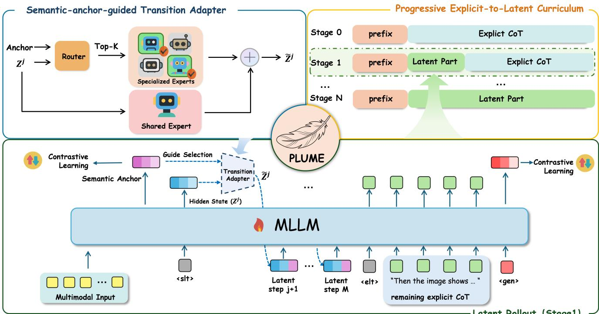
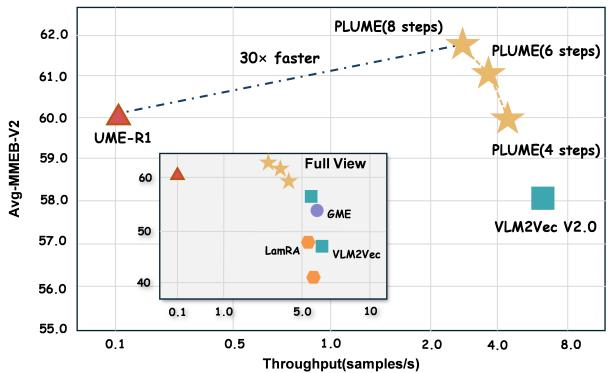
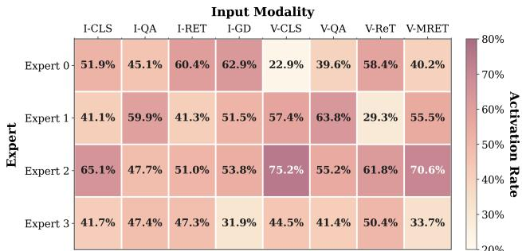

# 1. 论文基本信息

## 1.1. 标题
**PLUME: Latent Reasoning Based Universal Multimodal Embedding** (基于潜在推理的通用多模态嵌入)

## 1.2. 作者
**Chenwei He** (东南大学), **Xiangzhao Hao** (中科院自动化所), **Tianyu Yang** (中科院自动化所), **Yuxiang Ma** (东南大学), **Yuheng Jia** (东南大学), **Lingxiang Wu** (中科院自动化所), **Chaoyang Zhao** (中科院自动化所), **Haiyun Guo** (中科院自动化所), **Jinqiao Wang** (中科院自动化所)。

作者团队主要来自东南大学和中国科学院自动化研究所，研究背景集中在计算机视觉、多模态学习和信息检索领域。

## 1.3. 发表期刊/会议
arXiv 预印本。论文链接显示为 $arxiv.org/abs/2604.02073$。根据提供的元数据，发布时间为 2026 年 4 月 2 日（UTC），这表明该论文目前处于预印本阶段，尚未正式被顶级会议（如 CVPR, ICCV, ACL, NeurIPS）录用，但引用了 2025/2026 年的最新工作，属于前沿研究。

## 1.4. 发表年份
2026 年

## 1.5. 摘要
通用多模态嵌入（UME）旨在利用单一模型将异构输入（文本、图像、视频等）映射到共享的检索空间。为了处理复杂的查询意图，近期方法通过生成显式的思维链来增强嵌入，但这带来了巨大的推理开销，并将丰富的多模态证据压缩到了狭窄的文本瓶颈中。本文提出了 **PLUME**，一种潜在推理框架，它用简短的连续潜在状态自回归推演替代了显式的文本思维链。为了支持多样化的多模态查询，PLUME 引入了语义锚定引导的转接适配器，在固定的计算预算下引导潜在推演沿着不同的推理轨迹进行。为了稳定训练，PLUME 采用了一种渐进式的显式到潜在的课程学习策略，仅将文本化推理作为临时的训练脚手架，逐步将这种行为转移到隐藏状态计算中，从而在推理时消除了显式思维链。在 78 个任务的 MMEB-v2 基准测试中，PLUME 在将推理步骤从数百个词元减少到不到 10 个潜在步骤的同时，超越了强大的显式思维链基线，实现了超过 30 倍的推理加速。

## 1.6. 原文链接
https://arxiv.org/abs/2604.02073 (PDF: https://arxiv.org/pdf/2604.02073)

# 2. 整体概括

## 2.1. 研究背景与动机
**核心问题：**
通用多模态嵌入（UME）旨在将文本、图像、视频、文档等异构输入映射到同一向量空间以便检索。虽然多模态大语言模型（MLLM）具备强大的推理能力，但现有的 UME 方法要么采用单次前向传播（效率高但难以处理复杂查询），要么先生成显式的思维链文本再提取嵌入（准确率高但推理极慢）。核心挑战在于：**如何在不牺牲检索效率的前提下，利用 MLLM 的推理能力来处理复杂的查询意图？**

**现有挑战与空白：**
1.  **计算瓶颈：** 显式思维链需要生成数百个词元，导致自回归解码开销巨大，严重限制了吞吐量。
2.  **表征瓶颈：** 将多模态推理路由通过离散的文本词元，创建了一个狭窄的瓶颈，可能会丢弃细粒度的连续证据，限制了丰富多模态信息的传递。

**切入点与创新思路：**
论文提出了一种全新的视角：检索需要的是**中间计算**，而不一定是**中间文本**。PLUME 将多步推理直接在主干网络的连续隐藏空间中展开，通过简短的潜在推演保留推理的顺序依赖结构，同时避免了长文本生成。

## 2.2. 核心贡献/主要发现
**主要贡献：**
1.  **潜在推理框架：** 提出了 PLUME，将中间推理内化为 UME 中的简短连续潜在过程，替代了昂贵的显式思维链生成，同时保留了中间计算的好处。
2.  **输入自适应的潜在推理架构：** 设计了语义锚定引导的转接适配器，根据输入的语义结构自适应地分配潜在计算，允许相同的紧凑推演预算支持图像、视频、文档和文本的不同推理模式。
3.  **实证增益：** 在 MMEB-v2 上，PLUME 超越了显式思维链基线，将推理从数百个词元压缩到不到 10 个潜在步骤，实现了超过 30 倍的推理加速，特别是在视频和视觉文档检索中表现出色。

**关键结论：**
结构化的潜在计算可以在没有显式推理生成开销的情况下保留中间推理的好处。PLUME 打破了显式思维链的双重瓶颈，将中间推理的优势带回了实际 UME 系统所需的效率范围内。

# 3. 预备知识与相关工作

## 3.1. 基础概念
为了理解本文，读者需要掌握以下核心概念：

*   <strong>通用多模态嵌入 (Universal Multimodal Embedding, UME):</strong>
    指使用单一模型将不同模态（如文本、图像、视频、文档）的输入映射到同一个高维向量空间。在这个空间中，语义相似的内容（例如一张“狗”的图片和“狗”这个词）距离更近，便于进行跨模态检索。

*   <strong>多模态大语言模型 (Multimodal Large Language Models, MLLM):</strong>
    如 GPT-4V、Qwen2-VL 等模型，它们不仅能处理文本，还能通过视觉编码器处理图像和视频，具备强大的视觉理解和跨模态对齐能力。

*   <strong>思维链 (Chain-of-Thought, CoT):</strong>
    一种提示技术，通过引导模型生成中间推理步骤（例如“首先识别物体...然后分析关系...最后得出结论”），来提高模型在复杂任务上的准确性。

*   **潜在推理:**
    指模型在内部隐藏状态空间进行多步计算，而不将中间步骤输出为可读的文本。这类似于人类在脑海中“想”而不必说出来，旨在保留推理的计算过程但减少输出开销。

*   **KV Cache (Key-Value Cache):**
    在 Transformer 模型的自回归生成过程中，为了避免重复计算之前词元的注意力，模型会将每个词元的 Key 和 Value 矩阵缓存起来。在生成新词元时，只需计算新词元的 Key/Value 并与之前的 Cache 拼接即可。

*   **主干网络:**
    指模型的核心特征提取部分，通常是一个预训练好的大型 Transformer（如 Qwen2-VL），负责处理输入的原始数据并提取深层语义特征。

## 3.2. 前人工作
作者将相关工作分为三类：

1.  <strong>通用多模态嵌入 (UME):</strong>
    *   **早期工作：** CLIP, ALIGN, BLIP-2 等通过对比学习对齐图像和文本，但在复杂组合上表现不佳。
    *   **近期工作：** VLM2Vec, GME, UniME 等利用 MLLM 生成嵌入。但这些方法大多通过单次前向传播生成嵌入，没有建模中间推理，限制了在复杂查询上的性能。

2.  **推理增强嵌入:**
    *   Think-then-Embed (TTE), UME-R1, TRACE 等方法在提取嵌入前先生成显式的推理文本。这虽然提高了准确率，但生成数百个词元导致延迟和内存成本急剧增加。

3.  **大语言模型中的潜在推理:**
    *   Quiet-STaR, Coconut, CODI 等工作探索了在连续隐藏空间中进行推理，而不是显式输出文本。LaSER 将显式推理内化到潜在空间用于文本检索。
    *   **区别：** PLUME 与 LaSER 不同，PLUME 针对**通用多模态嵌入**，必须处理视频、图像、文档等异构输入，并需要在紧凑的推理预算下自适应地分配计算。

## 3.3. 技术演进
该领域的技术演进路径如下：
1.  **双编码器时代：** CLIP 等模型通过简单的对比对齐实现高效检索，但缺乏细粒度和推理能力。
2.  **MLLM 单次编码时代：** 利用 MLLM 的强大理解能力直接生成嵌入，提升了语义对齐，但仍是“一步到位”，难以处理需要多步推理的复杂查询。
3.  **显式推理时代：** 引入 CoT，先生成推理文本再生成嵌入，解决了复杂推理问题，但带来了巨大的计算开销。
4.  <strong>潜在推理时代 (本文)：</strong> 将推理过程从显式文本转移到隐藏状态，旨在兼顾推理能力与计算效率。

## 3.4. 差异化分析
PLUME 与现有方法的核心区别在于：
*   <strong>vs. 单次 UME (如 VLM2Vec):</strong> PLUME 引入了多步潜在计算，能够处理需要时序聚合、空间组合的复杂查询。
*   <strong>vs. 显式 CoT UME (如 UME-R1):</strong> PLUME 不生成文本词元，而是在隐藏空间进行推演，消除了文本解码的开销和表征瓶颈。此外，PLUME 引入了**语义锚定引导的转接适配器**，使推理路径能根据输入模态自适应调整，而 UME-R1 对所有输入使用相同的文本生成流程。

# 4. 方法论

## 4.1. 方法原理
PLUME 的核心思想是将显式的文本推理替换为模型内部的隐藏状态推演。它包含三个关键组件：
1.  **潜在推演：** 在隐藏空间进行多步自回归计算，复用 Transformer 的注意力机制和 KV Cache。
2.  **语义锚定引导的转接适配器：** 一个轻量级的模块，根据输入的全局语义（锚点）和当前推理步骤，动态选择不同的专家网络来调整隐藏状态，从而适应不同模态的推理需求。
3.  **渐进式显式到潜在课程：** 训练时先用显式文本推理作为“脚手架”，逐步将推理任务转移到潜在空间，最终在推理时完全移除文本生成。

    下图（原文 Figure 3）展示了 PLUME 的整体框架结构，包括潜在推演过程和语义锚定引导的转接适配器：

    
    *该图像是一个示意图，展示了PLUME框架的结构，包括语义锚定指导的转接适配器和渐进式显式到潜在的课程。该框架通过替代显式推理，利用潜在状态的自回归滚动来支持多模态查询，以提高效率并减少推理时间。图中还包含对比学习和多模态输入的流程。*

## 4.2. 核心方法详解

### 4.2.1. 问题定义与损失函数
首先，论文定义了通用多模态嵌入的目标。给定查询 $q$ 和正样本 $t^+$ 以及负样本集 $\mathcal{T}^-$，目标是最大化 $q$ 与 $t^+$ 的相似度，并最小化与负样本的相似度。论文使用标准的 InfoNCE 损失函数：

$$
\mathcal{L}_{\mathrm{NCE}} = \frac{1}{N} \sum_{i=1}^{N} -\log \frac{\exp(\sin(q_i, t_i) / \tau)}{\sum_{j=1}^{N} \exp(\sin(q_i, t_j) / \tau)},
$$

其中，$\sin(\cdot, \cdot)$ 表示归一化嵌入之间的余弦相似度，$\tau$ 是温度超参数。该损失函数通过对比学习拉近正样本对，推远负样本对。

### 4.2.2. 多模态前缀编码与潜在初始化
PLUME 的输入处理分为几个阶段。首先，模型处理多模态前缀（包含文本、图像、视频等特征），直到遇到一个特殊的 $<slt>$ (start-latent-thinking) 标记。这个标记开启了一个潜在块，包含 $K$ 个占位符 $<ct>$ 和一个结束标记 $<elt>$。

在这个过程中，模型会生成两个关键输出：
1.  **KV Cache ($\mathcal{C}(x)$):** 缓存前缀部分的 Key 和 Value 矩阵，供后续潜在步骤复用，使每个潜在步骤都能关注到完整的多模态上下文。
2.  <strong>语义锚点 ($\mathbf{c}(x)$):</strong> 从前缀中一个专用的 $<anchor>$ 标记处的隐藏状态提取，作为输入语义意图的固定摘要，用于后续的路由决策。

    潜在状态的初始化直接从 $<slt>$ 位置的隐藏状态 $\mathbf{h}_L$ 开始：

$$
\mathbf{z}^{(0)} = \mathbf{h}_L,
$$

这表示初始的潜在状态已经包含了多模态前缀的累积信息。

### 4.2.3. 迭代潜在推演
在第 $k$ 个潜在步骤（$k \in \{1, \dots, K\}$），PLUME 执行两个主要操作。

**第一步：转接适配器调整**
前一个潜在状态 $\mathbf{z}^{(k-1)}$ 首先通过转接适配器进行调整，得到适应后的状态 $\tilde{\mathbf{z}}^{(k-1)}$。这一步的详细公式将在下一节介绍。

**第二步：主干网络前向传播**
调整后的状态 $\tilde{\mathbf{z}}^{(k-1)}$ 被输入到主干网络 Transformer 中，作为位置 $p_{<slt>} + k$ 的输入嵌入。模型复用之前累积的 KV Cache 并推进到下一个因果位置：

$$
\mathbf{z}^{(k)} = \mathcal{B}_{\boldsymbol{\theta}}\Big( \tilde{\mathbf{z}}^{(k-1)}, \ \mathcal{C}^{(k-1)}, \ p_{<slt>} + k \Big), \qquad k = 1, \dots, K,
$$

其中：
*   $\mathcal{B}_{\boldsymbol{\theta}}$ 表示参数为 $\boldsymbol{\theta}$ 的 Transformer 主干网络。
*   $\mathcal{C}^{(k-1)}$ 是截止到步骤 `k-1` 的 KV Cache。
*   $\mathbf{z}^{(k)}$ 是该步骤输出的最后一层隐藏状态。

    通过这种方式，$\mathbf{z}^{(k)}$ 可以通过标准的因果注意力机制关注到完整的多模态前缀以及所有之前的潜在状态 $\mathbf{z}^{(1)}, \dots, \mathbf{z}^{(k-1)}$。这保留了显式 CoT 的顺序依赖结构，但用连续状态替换了离散词元。

### 4.2.4. 语义锚定引导的转接适配器
为了使潜在推理适应不同的模态（如视频需要时序推理，文档需要布局推理），PLUME 在潜在步骤之间插入了一个轻量级的路由适配器。

路由决策基于语义锚点 $\mathbf{c}(x)$ 和当前步骤的嵌入 $\mathbf{e}^{(k)}$。路由器计算 $M_e$ 个专家的权重 $\boldsymbol{\pi}^{(k)}$：

$$
\boldsymbol{\pi}^{(k)} = \mathrm{Softmax}\biggl( W_r \left[ \mathbf{z}^{(k-1)} + \mathbf{c}(x); \mathbf{e}^{(k)} \right] + \mathbf{b}_r \biggr),
$$

其中：
*   $[\cdot; \cdot]$ 表示向量拼接。
*   $W_r \in \mathbb{R}^{M_e \times 2D}$ 和 $\mathbf{b}_r \in \mathbb{R}^{M_e}$ 是可学习的路由参数。
*   $\mathbf{z}^{(k-1)} + \mathbf{c}(x)$ 将当前状态与全局语义锚点相加，注入全局上下文信号。

    每个专家 $E_m$ 是一个两层 MLP（扩展比为 2）。调整后的状态是共享专家 $E_0$ 和加权混合的特化专家输出的残差连接：

$$
\tilde{\mathbf{z}}^{(k-1)} = \mathbf{z}^{(k-1)} + E_0\Big( \hat{\mathbf{z}}^{(k-1)} \Big) + \sum_{m \in \mathrm{Top}K_r(\pmb{\pi}^{(k)})} \pi_m^{(k)} E_m\Big( \hat{\mathbf{z}}^{(k-1)} \Big),
$$

其中 $\hat{\mathbf{z}}^{(k-1)} = \mathrm{LN}(\mathbf{z}^{(k-1)})$ 是层归一化后的输入。这种设计允许模型根据输入类型（如图像 vs 视频）动态选择不同的计算路径。

为了防止路由崩溃（即总是只选少数几个专家），论文引入了平衡损失：

$$
\mathcal{L}_{\mathrm{bal}} = \frac{1}{M_e} \sum_{m=1}^{M_e} \left( \bar{\pi}_m - \frac{1}{M_e} \right)^2,
$$

其中 $\bar{\pi}_m$ 是专家 $m$ 在批次和步骤上的平均路由权重。该损失鼓励所有专家被均匀使用。

### 4.2.5. 嵌入形成与训练目标
最终的检索嵌入 $\mathbf{e}_{\mathrm{gen}}(x)$ 取自潜在推演结束后的 $<gen>$ 标记处的隐藏状态：

$$
\mathbf{e}_{\mathrm{gen}}(x) = \mathrm{Norm}(\mathbf{h}_{<\mathrm{gen}>}),
$$

此外，还有一个辅助的锚点嵌入 $\mathbf{e}_{\mathrm{anc}}(x)$，取自 $<anchor>$ 标记。它在训练时接受对比监督，帮助锚点编码有意义的全局摘要，从而提供更好的路由信号，并在训练初期提供额外的梯度路径。但在推理时，锚点嵌入被丢弃，只使用 $\mathbf{e}_{\mathrm{gen}}(x)$。

总的训练损失包含以下部分：

$$
\mathcal{L} = \mathcal{L}_{\mathrm{CE}} + \lambda_{\mathrm{gen}} \mathcal{L}_{\mathrm{NCE}}^{\mathrm{gen}} + \lambda_{\mathrm{anc}} \mathcal{L}_{\mathrm{NCE}}^{\mathrm{anc}} + \lambda_{\mathrm{bal}} \mathcal{L}_{\mathrm{bal}},
$$

其中 $\mathcal{L}_{\mathrm{CE}}$ 是因果语言建模损失，应用于查询和正样本的解码后缀。

### 4.2.6. 渐进式显式到潜在课程
直接从显式 CoT 跳转到纯潜在推理是不稳定的。PLUME 采用课程学习策略：
1.  **阶段 0：** 完全显式 CoT，作为热身。
2.  **中间阶段：** 逐步将显式推理的句子片段从左到右替换为潜在块 $<ct>$。模型学习在部分潜在前缀的基础上继续显式推理。
3.  **最终阶段：** 显式推理完全被潜在块替代，潜在推演直接连接到 $<gen>$ 标记，与推理时模式一致。

    这种渐进式的转移确保了模型能够稳定地将语义基础从文本转移到隐藏状态。

# 5. 实验设置

## 5.1. 数据集
实验在 **MMEB-v2** 基准测试上进行。MMEB-v2 是一个全面的通用多模态嵌入基准，包含 9 个元任务和 78 个测试任务。它涵盖了广泛的视觉语言检索设置，包括：
*   <strong>图像级检索 (Image):</strong> 如 ImageNet 分类、COCO 检索、RefCOCO 等。
*   <strong>视频理解与检索 (Video):</strong> 如 K700, MSR-VTT, ActivityNet QA 等。
*   <strong>视觉文档检索 (VisDoc):</strong> 如 DocVQA, InfoVQA, ChartQA 等。

    选择该数据集是因为它涵盖了需要细粒度对齐、时序推理和结构理解的复杂任务，能够充分验证 PLUME 处理异构输入的能力。

## 5.2. 评估指标
论文使用了以下指标进行评估：

1.  <strong>Hit@1 (命中率@1)</strong>
    *   **概念定义：** 用于图像和视频任务。它衡量在检索结果中，排名第一的项是否是正确的目标项。直观地说，就是“模型第一次猜就猜对”的概率。
    *   **数学公式：**
        $$
        \mathrm{Hit}@1 = \frac{1}{N} \sum_{i=1}^{N} \mathbb{I}(\mathrm{rank}(q_i, t_i^+) == 1)
        $$
    *   **符号解释：** $N$ 是查询总数，$\mathbb{I}(\cdot)$ 是指示函数（条件为真时为1，否则为0），$\mathrm{rank}(q_i, t_i^+)$ 是正样本 $t_i^+$ 在查询 $q_i$ 的检索结果列表中的排名。

2.  <strong>NDCG@5 (归一化折损累计增益@5)</strong>
    *   **概念定义：** 用于视觉文档检索任务。它不仅考虑结果是否相关，还考虑相关项在排名中的位置（位置越高得分越高），并对结果进行归一化。相比 Hit@1，它能反映排序的整体质量。
    *   **数学公式：**
        $$
        \mathrm{NDCG}@k = \frac{1}{\mathrm{IDCG}@k} \sum_{j=1}^{k} \frac{2^{rel_j} - 1}{\log_2(j + 1)}
        $$
    *   **符号解释：** $k$ 是截断位置（此处为 5），$rel_j$ 是第 $j$ 个结果的相关性等级（通常二值 0 或 1），$\mathrm{IDCG}@k$ 是理想排序下的 DCG 值。

## 5.3. 对比基线
论文将 PLUME 与两组基线进行了比较：
1.  <strong>早期 UME 方法（无显式推理）：</strong> LamRA, VLM2Vec, GME, VLM2Vec-V2, DUME。这些方法通常通过单次前向传播生成嵌入。
2.  <strong>推理增强 UME 方法（显式 CoT）：</strong> UME-R1。该方法在提取嵌入前生成显式的 CoT 文本。

    所有方法均使用相同的 Qwen2-VL-2B 主干网络，确保性能差异源于推理机制而非模型容量。

# 6. 实验结果与分析

## 6.1. 核心结果分析
以下是原文 Table 1 的结果，展示了 PLUME 在 MMEB-v2 上的性能对比：

<table>
<thead>
<tr>
<th rowspan="2">Model</th>
<th rowspan="2">Venue</th>
<th colspan="5">Image</th>
<th colspan="5">Video</th>
<th colspan="5">VisDoc</th>
<th rowspan="2">All</th>
</tr>
<tr>
<th>CLS</th>
<th>QA</th>
<th>RET</th>
<th>GD</th>
<th>Overall</th>
<th>CLS</th>
<th>QA</th>
<th>RET</th>
<th>MRET</th>
<th>Overall</th>
<th>VDRv1</th>
<th>VDRv2</th>
<th>VR</th>
<th>OOD</th>
<th>Overall</th>
</tr>
</tr>
<tr>
<td># of Datasets</td>
<td></td>
<td>10</td>
<td>10</td>
<td>12</td>
<td>4</td>
<td>36</td>
<td>5</td>
<td>5</td>
<td>5</td>
<td>3</td>
<td>18</td>
<td>10</td>
<td>4</td>
<td>6</td>
<td>4</td>
<td>24</td>
<td>78</td>
</tr>
<tr>
<td></td>
<td></td>
<td colspan="10"></td>
<td></td>
<td></td>
<td></td>
<td></td>
<td></td>
<td></td>
</tr>
<tr>
<td>LamRA</td>
<td>CVPR'25</td>
<td>59.2</td>
<td>26.5</td>
<td>70.0</td>
<td>62.7</td>
<td>54.1</td>
<td>39.3</td>
<td>42.6</td>
<td>24.3</td>
<td>34.6</td>
<td>35.2</td>
<td>22.0</td>
<td>11.5</td>
<td>37.4</td>
<td>21.0</td>
<td>23.9</td>
<td>40.4</td>
</tr>
<tr>
<td>VLM2Vec</td>
<td>ICLR'25</td>
<td>58.7</td>
<td>49.3</td>
<td>65.0</td>
<td>72.9</td>
<td>59.7</td>
<td>33.4</td>
<td>30.5</td>
<td>20.6</td>
<td>33.0</td>
<td>29.0</td>
<td>49.8</td>
<td>13.5</td>
<td>51.8</td>
<td>33.5</td>
<td>41.6</td>
<td>47.0</td>
</tr>
<tr>
<td>GME</td>
<td>CVPR'25</td>
<td>54.4</td>
<td>29.9</td>
<td>66.9</td>
<td>55.5</td>
<td>51.9</td>
<td>34.9</td>
<td>42.0</td>
<td>25.6</td>
<td>32.4</td>
<td>33.9</td>
<td>86.1</td>
<td>54.0</td>
<td>82.5</td>
<td>43.1</td>
<td>72.7</td>
<td>54.1</td>
</tr>
<tr>
<td>VLM2Vec-V2</td>
<td>TMLR'26</td>
<td>62.0</td>
<td>56.3</td>
<td>69.5</td>
<td>77.3</td>
<td>64.9</td>
<td>39.3</td>
<td>34.3</td>
<td>28.8</td>
<td>38.5</td>
<td>34.9</td>
<td>75.5</td>
<td>44.9</td>
<td>79.4</td>
<td>39.4</td>
<td>65.4</td>
<td>58.0</td>
</tr>
<tr>
<td>DUME</td>
<td>ICLR'26</td>
<td>59.3</td>
<td>55.0</td>
<td>66.3</td>
<td>78.0</td>
<td>62.5</td>
<td>37.7</td>
<td>46.6</td>
<td>17.1</td>
<td>30.0</td>
<td>33.2</td>
<td>67.6</td>
<td>43.3</td>
<td>47.1</td>
<td>33.8</td>
<td>52.8</td>
<td>52.7</td>
</tr>
<tr>
<td>Reasoning UME</td>
<td colspan="10"></td>
<td></td>
<td></td>
<td></td>
<td></td>
<td></td>
<td></td>
</tr>
<tr>
<td>UME-R1</td>
<td>ICLR'26</td>
<td>64.8</td>
<td>62.8</td>
<td>67.6</td>
<td>77.2</td>
<td>66.6</td>
<td>44.3</td>
<td>51.2</td>
<td>32.9</td>
<td>39.7</td>
<td>42.2</td>
<td>72.4</td>
<td>46.2</td>
<td>79.2</td>
<td>37.2</td>
<td>63.9</td>
<td>60.1</td>
</tr>
<tr>
<td>PLUME</td>
<td>Ours</td>
<td>66.5</td>
<td>59.2</td>
<td>67.6</td>
<td>79.7</td>
<td>66.3</td>
<td>45.0</td>
<td>52.3</td>
<td>33.5</td>
<td>46.7</td>
<td>44.1</td>
<td>72.1</td>
<td>49.8</td>
<td>78.1</td>
<td>57.4</td>
<td>67.5</td>
<td>61.6</td>
</tr>
</tbody>
</table>

**分析：**
*   **整体性能：** PLUME 在所有 78 个任务上平均得分 **61.6**，超过了显式 CoT 方法 UME-R1 (60.1) 和最佳单次基线 VLM2Vec-V2 (58.0)。
*   **模态细分：**
    *   **Image:** PLUME (66.3) 与 UME-R1 (66.6) 持平，略优于单次基线。
    *   **Video:** PLUME (44.1) 显著优于 UME-R1 (42.2) 和单次基线。这表明潜在推理在处理视频的时序动态和跨帧关系时比文本化推理更有效，因为它保持了连续的状态。
    *   **VisDoc:** PLUME (67.5) 明显优于 UME-R1 (63.9)，在视觉文档检索上取得了巨大提升，显示出其在处理结构化文档布局方面的优势。

## 6.2. 效率与精度权衡
下表（原文 Table 2）展示了推理效率的对比：

| Metric | PLUME | UME-R1 | VLM2Vec-V2 |
| :--- | :--- | :--- | :--- |
| Reasoning tokens/steps | 8 | 403 | 0 |
| Latency (ms/sample) | 298±12 | 9023±187 | 156±8 |
| Throughput (samples/s) | 3.3±0.1 | 0.11±0.01 | 6.4±0.3 |
| Speedup vs. UME-R1 | 30.3× | 1.0× | − |
| Overhead vs. VLM2Vec-V2 | 1.9× | − | 1.0× |

**分析：**
*   PLUME 将推理步骤从平均 403 个词元（UME-R1）压缩到 8 个潜在步骤。
*   推理延迟从 9023ms 降低到 298ms，实现了 **30.3 倍** 的加速。
*   虽然比单次基线 VLM2Vec-V2 慢约 1.9 倍，但 PLUME 在精度上取得了显著提升，证明了这种额外的潜在计算预算是值得的。

    下图（原文 Figure 1）直观展示了 PLUME 在精度-效率权衡上的优势：

    
    *该图像是一个图表，展示了PLUME在MMEB-v2基准测试中的准确性与效率的权衡。X轴表示单个H20 GPU上的推理吞吐量（samples/s），Y轴表示平均MMEB-v2性能。PLUME在不同步骤下的表现相比于UME-R1有显著提升，并且PLUME的推理速度快了30倍。*

## 6.3. 消融实验与参数分析
论文进行了详细的消融实验，结果如下表（原文 Table 3）：

| Configuration | Image | Video | VisDoc | All |
| :--- | :--- | :--- | :--- | :--- |
| Full PLUME | 66.3 | 44.1 | 67.5 | 61.6 |
| w/o Latent Transition | 63.6 | 41.0 | 64.8 | 58.8 |
| w/o MoE (single MLP) | 64.2 | 41.8 | 64.4 | 59.2 |
| w/o Semantic Anchor | 65.4 | 42.3 | 66.1 | 60.1 |
| w/o Curriculum | 60.2 | 36.5 | 60.2 | 54.8 |

**分析：**
*   **课程学习的重要性：** 移除课程学习导致性能下降最大（-6.8），特别是在视频任务上（-7.6）。这证明了直接从显式切换到潜在推理会导致训练不稳定，渐进式转移至关重要。
*   **潜在推理的有效性：** 移除潜在转换（即退化为单次编码）导致整体下降 2.8，验证了多步隐藏计算的必要性。
*   **MoE 与语义锚点：** 移除 MoE 适配器或语义锚点都会导致性能下降，说明自适应地分配计算对于处理异构输入非常重要。

**潜在步数 $K$ 的影响：**
实验还测试了不同潜在步数 $K$ 的影响。随着 $K$ 从 4 增加到 8，精度稳步提升，但边际收益递减。$K=8$ 提供了最佳精度，而 $K=6$ 提供了良好的速度-精度平衡。

## 6.4. 诊断分析
为了理解模型内部行为，论文可视化了专家的激活偏好和潜在轨迹。

**专家激活偏好：**
下图（原文 Figure 5）展示了不同专家在不同任务上的激活率：

*该图像是一个热图，展示了在图像和视频检索子任务中，各个专家的激活倾向。不同专家在不同输入模态下的激活率各异，数据以百分比形式呈现，为理解多模态嵌入提供了重要见解。*

*   **Expert 2:** 在视频分类（V-CLS）和视频多模态检索（V-MRET）上激活率最高，表明它擅长处理时序和视频特征。
*   **Expert 1:** 在问答任务（V-QA, I-QA）上激活率高，表明它专注于知识密集型推理。
*   **Expert 0:** 在图像定位（I-GD）和检索（I-RET）上活跃，表明它专注于空间和视觉匹配。
    这种无监督学习到的任务特异性分工证明了路由机制的有效性。

**潜在轨迹可视化：**
下图（原文 Figure 6）比较了 PLUME 和 UME-R1 在推理过程中中间状态与正样本的平均余弦相似度：

*该图像是一个图表，展示了在200个样本上，PLUME与UME-R1在不同推理步骤下的平均余弦相似度。左侧为图像检索的结果，右侧为视频检索的结果，PLUME在推理步骤中显示出更平滑的轨迹和较小的方差。*

*   PLUME 展示出更平滑的轨迹和更小的方差，尤其是在视频检索中。这表明潜在推理提供了一致的中间计算路径，而显式 CoT 在离散词元生成下表现出更大的波动性。

# 7. 总结与思考

## 7.1. 结论总结
PLUME 提出了一种新颖的潜在推理框架，用于通用多模态嵌入。通过将显式的思维链文本替换为简短的隐藏状态推演，并结合语义锚定引导的转接适配器和渐进式课程学习，PLUME 成功地在保留推理能力的同时大幅提升了推理效率。在 MMEB-v2 基准测试上，PLUME 不仅超越了显式 CoT 基线，还实现了 30 倍以上的推理加速，特别是在视频和视觉文档检索任务上表现出色。

## 7.2. 局限性与未来工作
作者指出了以下局限性：
1.  **Image QA 性能差距：** PLUME 在图像问答子集（特别是 ChartQA, InfographicsVQA）上与 UME-R1 存在差距。这可能是因为这些任务高度依赖细粒度的文本细节和显式的语义组织，而 PLUME 的紧凑潜在推演可能丢失了部分细节。
2.  **可解释性：** 虽然路由器展示了任务偏好，但连续潜在轨迹的形式化可解释性保证仍然是一个开放问题。

## 7.3. 个人启发与批判
**启发：**
*   **推理不等于文本：** 这篇论文强有力地证明了“推理”本质上是一种计算过程，并不一定需要外化为自然语言。在检索任务中，我们只需要一个好的向量表示，中间的推理过程完全可以是“黑盒”的，只要它能优化最终的表示。
*   **效率与精度的解耦：** PLUME 展示了如何通过架构创新（如潜在推演、MoE 路由）来打破通常认为的“高精度必然低效率”的权衡。
*   **课程学习的价值：** 在训练深度模型时，从简单的监督信号（显式文本）过渡到复杂的内部机制（潜在状态）是一种非常实用的训练策略。

**批判与思考：**
*   **潜在风险：** 虽然潜在推理很快，但其内部过程不可见。在需要向用户解释“为什么检索到这个结果”的场景下，显式 CoT 可能更具优势。PLUME 牺牲了可解释性换取了效率。
*   **数据依赖：** PLUME 的训练依赖于带有显式 CoT 标注的数据（如 UME-R1 的数据集）。如果缺乏这种高质量的推理轨迹数据，课程学习的第一阶段可能难以进行。
*   **应用前景：** 该方法非常适合部署在边缘设备或对延迟敏感的大规模检索系统中，特别是涉及视频和文档检索的场景。未来的工作可以探索如何进一步压缩潜在状态，或者如何让潜在推理具备更强的可解释性。