# PLUME：基于潜在推理的通用多模态嵌入

陈韦 $\mathrm{H e^{1*}}$ 向兆浩²³\* 杨天宇²³\* 马宇翔¹ 贾宇恒¹ 向良 $\mathrm{\sf W u^{2, 3}}$ 赵朝阳²³ 郭海云²³† 王进侨²³ ¹东南大学 ²中国科学院自动化研究所 ³中国科学院大学 {hechenwei, 220256453, yhjia}@seu.edu.cn {haoxiangzhao2023, yangtianyu2024}@ia.ac.cn {lingxiang.wu, chaoyang.zhao, haiyun.guo, jqwang}@nlpr.ia.ac.cn

# 摘要

普适多模态嵌入（UME）将异构输入映射到共享检索空间，使用单一模型。最近的研究通过在提取嵌入之前生成显式的思维链（CoT）推理来改进UME，使多模态大语言模型能够更好地推断复杂的查询意图。然而，显式CoT会带来可观的推理开销，并且可能将丰富的多模态证据压缩成狭窄的文本瓶颈。我们提出了PLUME，这是一种潜在推理框架，通过用连续潜在状态的短自回归推演替代口头化的CoT，从而推动UME的发展。为了支持多样化的多模态查询，PLUME进一步引入了语义锚导向的过渡适配器，能够在相同的固定计算预算下，引导潜在推演沿着不同的推理轨迹开展。为了稳定训练，PLUME采用了渐进的显式到潜在的课程，将口头化推理仅作为临时的训练支架，并逐步将这一行为转移到隐藏状态计算中，从而在推理时消除显式CoT。在78个任务的MMEB- $\nu 2$基准上，PLUME在超越强大的显式CoT UME基线的同时，将推理从数百个生成的符号减少到不到10个潜在步骤，实现了超过$30\times$的推理速度提升。PLUME特别适用于检索设置，其中相关证据密集、结构复杂，并且难以通过口头化的中间推理进行组织，比如视频和视觉文档检索。这些结果表明，结构化潜在计算能够保留中间推理的优点，而不需显式推理生成的开销，为实际检索系统提供了更强大和高效的范式。我们的代码和数据已公开，地址为 https://github.com/haoxiangzhao12138/CLEAR。

  
Figure 1. PLUME achieves a favorable accuracy-efficiency tradeoff on MMEB-v2. The $\mathbf { X }$ -axis shows inference throughput on a single H20 GPU and the y-axis shows average MMEB-v2 performance.

# 1. 引言

通用多模态嵌入（UME）旨在将异构输入，包括文本、图像、视频和视觉文档，映射到一个共享的检索空间中，采用单一模型。然而，在现实世界的检索中，许多查询不能仅通过表面相似性来解决。它们通常需要组合的空间理解、知识密集型的视觉推理，或者时间和结构上分散证据的聚合。这些需求使得多模态大语言模型（MLLMs）成为 UME 越来越具有吸引力的主干网络，得益于它们的原生多模态基础、强大的语义对齐和广泛的世界知识。然而，简单地将 MLLM 作为编码器并不能自动将其推理潜力转化为更强的嵌入。在大多数现有的 UME 流水线中，嵌入仍然是在单次传递中形成的，这在查询意图复杂时，留给故意中间计算的空间有限。这为 UME 提出了一个核心问题：我们如何在嵌入生成过程中利用 MLLM 的推理能力，而不牺牲检索效率？

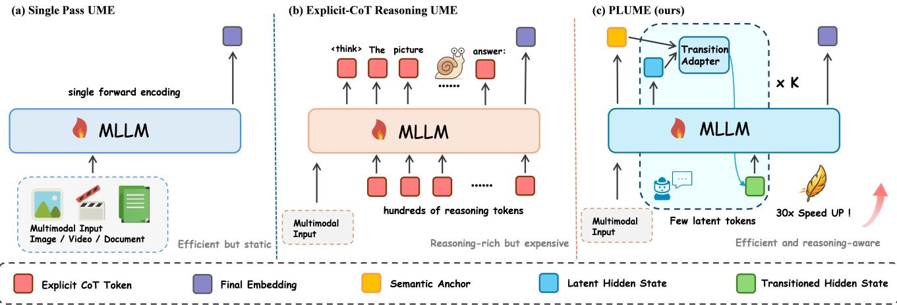  
achieving reasoning-aware embedding with substantially lower inference cost.

现有的解决这个问题的尝试主要沿着两个方向展开，如图2所示。基于单通道大语言模型（MLLM）的方法[19, 20, 28, 54]效率较高，但需要将复杂的查询解析、证据整合和表示形成压缩到一个前向推理中。为了更好地处理这种复杂性，近期增强推理的方法，例如TTE [5]、UME-R1 [24]和TRACE [13]，在得出最终嵌入之前，首先生成明确的推理链（CoT）[41, 43]。尽管这种策略有效，但引入了双重瓶颈。在计算上，每个样本生成数百个推理词元会带来相当大的自回归解码开销，并严重限制推理吞吐量。在表示上，通过离散文本词元来传递多模态推理创建了一个狭窄的瓶颈，可能丢弃细粒度的连续证据，并限制多模态信息如何丰富地传递到最终的嵌入中。因此，明确的CoT将多步计算的好处与根本上不匹配检索效率要求的冗长接口联系在了一起。鉴于此，我们对UME采取了不同的视角：检索所需的是中间计算，而不一定是被明言的中间文本。如图2(c)所示，有助于嵌入质量的多步推理可以直接在主干网络的连续隐藏空间中展开[4, 12, 36]。短期的潜在推理可以在避免长文本生成的同时，保持推理的序列依赖结构。然而，在多模态设置中，从明确推理转向潜在推理并不是微不足道的替代。与纯语言任务不同，UME必须在一个共享框架内处理视频、图像、文档和文本，而这些输入要求在时间动态、空间关系、布局结构和语义抽象等方面进行不同形式的中间计算。一旦在短期潜在预算内执行推理，关键挑战不再是是否进行推理，而是如何在异构多模态查询中自适应地分配这种紧凑的潜在计算，而不是强迫每个输入通过同一路径进行推理。为了解决上述问题，我们提出了PLUME，一种用于通用多模态嵌入的潜在推理框架。PLUME将推理内化为MLLM内部的一种紧凑的潜在过程，使模型能够执行多步计算，而无需生成明确的推理。为了使这个潜在过程适应结构多样化的多模态输入，PLUME进一步引入了一个语义锚引导的转换适配器，根据输入的语义结构引导潜在计算，使得不同的查询在相同的推理预算下遵循不同的推理模式。最后，与其将明确的CoT视为一种高成本的推理过程，PLUME更将其作为临时训练支架。在训练期间，模型首先接触到被明言的中间推理，然后逐渐将推理过程转移到潜在推理中，逐步用隐藏状态计算替换明确的文本推理，直到在推理时不再需要明确的CoT。在MMEB-v2上的实验表明，PLUME在压缩推理从数百个生成词元到不到十个潜在步骤的同时，实现了超过$30 \mathrm { x }$的推理速度提升，如图1所示，性能超过了强大的显性CoT UME基线。PLUME在检索任务中表现尤为出色，尤其是在相关证据稠密、结构复杂且难以通过明言的中间推理进行组织的场景中，例如视频和视觉文档检索。综合来看，这些结果表明，强大的UME更有益于自适应中间计算而非明确的语言推理。通过在一个紧凑的潜在过程中保留推理质量，PLUME破除了明确CoT的双重瓶颈，将中间推理的好处带回到了实际UME系统所需的效率范畴。总之，我们的贡献包括：• 一个用于UME的潜在推理框架。我们引入PLUME，将中间推理内化为UME的一个短期连续潜在过程，替代昂贵的明确推理链生成，同时保留中间计算的好处。 • 一个输入自适应的潜在推理架构。我们设计了一个语义锚引导的转换适配器，根据异构多模态查询自适应分配潜在计算，使得相同的紧凑推理预算支持图像、视频、文档和文本的不同推理模式。与有效性和效率的强大经验增益。我们展示了潜在推理能够将UME推进超越明确的CoT基线，在MMEB-v2上获得更强的检索性能，同时将推理从数百个生成词元减少到不到十个潜在步骤，实现超过$30 \mathrm { x }$的提速，特别是在视频和视觉文档检索中取得显著的提升。

# 2. 相关工作

# 2.1. 通用多模态嵌入

通用多模态嵌入（UME）将异构输入映射到共享的检索空间，使用单一模型。早期的双编码器方法，例如 CLIP、ALIGN、SigLIP 和 BLIP-2，通过对比目标学习对齐的图像-文本表示，但在复杂的多模态组合上效果较差。UniIR 和 MagicLens 开始在统一框架内解决多任务多模态检索的问题。在基于 LLM 的文本嵌入进展的基础上，基于 MLLM 的方法进一步克服了这一局限性：E5-V 和 MM-Embed 通过提示 MLLM 来获得通用嵌入；VLM2Vec 引入了 MMEB 基准；而 VLM2Vec-V2、GME、UniME、LamRA、LLaVE、MoCa 和 DUME 则进一步提升了检索质量和模态覆盖范围。最近的努力探索多向量表示、大规模数据合成、视觉文档检索和基于强化学习的对齐，以推动准确性和效率的前沿。然而，大多数方法从单次前向传播中提取嵌入，而没有建模中间推理，这限制了在复杂检索查询上的性能。

# 2.2. 推理增强嵌入

链式思维（CoT）提示引发了语言模型中的多步推理，后续扩展如多模态 CoT 和偏好优化推理进一步提升了推理质量。将此理念进行扩展，推理专用的大语言模型如 DeepSeek-R1 展现了长时推理的强大能力。最近的研究将显性推理扩展到嵌入层：先思考后嵌入（TTE）、UME-R1、TRACE 和 Embed-RL 在提取嵌入之前生成显性的推理轨迹，而增强推理的检索表示进一步确认了额外推理计算的价值。这些方法实现了一致的精确度提升，但每个样本生成数百个推理词元会显著增加延迟和内存成本。相比之下，PLUME 在推理时保留了结构化推理的好处，而无需生成推理词元。

# 2.3. 大语言模型中的潜在推理

一个相关的研究方向探索了超越显式链式推理的额外内部计算或潜在推理。Pausetoken 方法在词元预测之前增加内部计算，Quiet-STaR 训练模型生成有用的内部思维，而 Coconut 和 CODI 将推理移入连续隐空间。Fast Quiet-STaR 进一步压缩思维轨迹以减少推理开销。在检索方面，LaSER 将显式推理内化为潜在空间，以进行密集文本检索。与 LaSER 不同的是，LaSER 关注于仅文本的均匀潜在推理过程，而 PLUME 针对通用的多模态嵌入，在这里潜在推理必须在异质输入上运行，并在多样化的查询结构中自适应地分配紧凑的推理预算。

# 3. 方法

# 3.1. PLUME 概述

PLUME 是一个用于通用多模态嵌入的渐进式潜在推理框架。它用一个短的潜在推演替代了显式推理标记，通过语义锚定引导的过渡适配器调整每个潜在过渡，并通过渐进式课程将显式推理转化为隐空间计算。主干网络经过全面微调；唯一添加的组件是轻量级路由适配器及其锚定条件路由器。检索嵌入直接来自主干网络的归一化隐状态，而不引入单独的检索头。图 3 总结了该框架。

  
extracting the final retrieval embedding from the hidden state at $\mathsf { < g e n s }$ .The top-left panel expands the semantic-anchor-guided transition panel corresponds to an intermediate curriculum stage.

# 3.2. 问题表述

我们考虑通用多模态嵌入 (UME) [20]，其中一个模型将异构输入映射到共享嵌入空间以进行检索。给定一个查询 $q$ 及其对应的正目标 $t ^ { + }$，以及一组负目标 $\mathcal { T } ^ { - } = \{ t _ { 1 } ^ { - } , \ldots , t _ { N _ { e } } ^ { - } \}$，目标是最大化 $q$ 和 $t ^ { + }$ 之间的相似性，而对所有负样本进行对比。查询和目标可以是文本、图像、视频、视觉文档或它们的组合。

在实际操作中，我们从 $N$ 对查询-目标样本 $\{ ( q _ { i } , t _ { i } ) \} _ { i = 1 } ^ { N }$ 中抽取一个小批量，其中 $( q _ { i } , t _ { i } )$ 形成正样本对，其余目标 $\{ t _ { j } \mid j \neq i \}$ 则作为 $q _ { i }$ 的批内负样本。我们通过 InfoNCE 目标 [32] 优化模型，其中 $\mathrm { s i m } ( \cdot , \cdot )$ 表示模型生成的归一化嵌入之间的余弦相似度，$\tau$ 是温度超参数。除非另有说明，我们在查询到目标和目标到查询的两个方向上双向应用该目标。此外，进一步对查询及其正目标的解码后缀应用因果语言建模损失 $\mathcal { L } _ { \mathrm { C E } }$，提供基于词元的监督，确保生成路径的有效性，具体细节见第 3.5 节。

$$
\mathcal { L } _ { \mathrm { N C E } } = \frac { 1 } { N } \sum _ { i = 1 } ^ { N } - \log \frac { \exp ( \sin ( q _ { i } , t _ { i } ) / \tau ) } { \sum _ { j = 1 } ^ { N } \exp ( \sin ( q _ { i } , t _ { j } ) / \tau ) } ,
$$

上述检索目标是UME的标准；PLUME的贡献在于嵌入的形成方式——通过主干网络中的紧凑潜在推理过程，这将在接下来的部分中描述。

# 3.3. 通用多模态嵌入的潜在推演

PLUME用简短的自回归推演替代了显式的链式思维解码，在隐藏空间中保留了多步骤推理的迭代结构，同时避免了在推理时生成中间词元的需要。下面我们描述这个过程的四个阶段：前缀编码、潜在初始化、迭代推演和后缀解码。多模态前缀编码。给定输入$x$，主干网络首先处理多模态前缀——可以将文本词元与图像、视频或文档特征交错，然后遇到一个特殊的${ < s l \pm > }$（开始潜在思维）词元，开启一个潜在块$< s 1 t > < c t > ^ { K } < \tt { e l t } >$，其中${ < } { \mathsf { C } } { \mathsf { t } } >$保留了$K$个自回归位置，而${ < } \ominus \bot \ t >$（结束潜在思维）标记了潜在块的结束。${ < } \mathbf { C } \mathbf { t } >$词元仅作为序列中的位置占位符；在每个潜在步骤，模型接收的是一个连续的隐状态，而不是离散的词元嵌入。

令 $\mathbf { h } _ { 1 } , \ldots , \mathbf { h } _ { L }$ 表示主干网络在前缀上生成的隐藏状态，其中 $\mathbf { h } _ { L }$ 对应于 ${ < s l \pm > }$ 。这个前缀传递生成两个在潜在推理过程中持续存在的输出。第一个是缓存的键值状态 $\mathcal C ( x )$ [22, 37]，它允许每一个后续的潜在步骤通过因果注意力返回到完整的多模态上下文。第二个是语义锚点 $\mathbf { c } ( x )$，从前缀中特定的 <anchor> 令牌的隐藏状态中提取; 它提供一个输入语义意图的固定总结，用于路由（见第 3.4 节）。所有的视觉特征——图像块、视频帧和文档渲染——仅在这个前缀编码阶段注入; 潜在推理过程纯粹在隐藏空间中进行。潜在状态初始化。我们从 ${ < s l \pm > }$ 位置的隐藏状态初始化潜在状态，因为这个状态已经总结了在潜在块之前积累的多模态上下文。

$$
{ \bf z } ^ { ( 0 ) } = { \bf h } _ { L } ,
$$

迭代潜在推演。在每个潜在步骤 $k \in \{ 1 , \ldots , K \}$ 中，PLUME 执行两个操作。首先，通过路由适配器（第 3.4 节）对先前的潜在状态 $\mathbf { z } ^ { ( \bar { k } - 1 ) }$ 进行精细化，得到适配后的状态 $\tilde { \mathbf { z } } ^ { ( k - 1 ) }$。其次，将 $\tilde { \mathbf { z } } ^ { ( k - 1 ) }$ 作为输入嵌入，输入到主干网络的第 $p _ { < s \mathrm { 1 t } > } + k$ 位置，重用累积的 KV 缓存，并推进到下一个因果位置：

$$
\mathbf { z } ^ { ( k ) } = \mathcal { B } _ { \boldsymbol { \theta } } \Big ( \tilde { \mathbf { z } } ^ { ( k - 1 ) } , \ \mathcal { C } ^ { ( k - 1 ) } , \ p _ { < \mathrm { s 1 t } > } + k \Big ) , \qquad k = 1 , \dots , K ,
$$

其中 $B _ { \theta }$ 表示对单个位置的完整变压器主干进行一次正向传播。KV 缓存逐步增长：${ \mathcal C } ^ { ( 0 ) } = { \mathcal C } ( \bar { x } )$ 从前缀编码初始化，每一步都会附加自己的键值对，导致 $\mathcal { C } ^ { [ k ) } = \mathcal { C } ^ { ( k - 1 ) } \cup \{ ( \mathbf { \bar { k } } ^ { ( k ) } , \mathbf { v } ^ { ( k ) } ) \}$。因此，输出 $\mathbf { z } ^ { ( k ) }$——在位置 $p _ { < s \mathrm { 1 t } > } + k -$ 的最后一层隐藏状态，关注于完整的多模态前缀和所有前置潜在状态 $\mathbf { z } ^ { ( 1 ) } , \ldots , \mathbf { z } ^ { ( k - 1 ) }$，通过对不断增长的缓存进行标准的因果注意力机制。$K$ 个输出 $\mathbf { z } ^ { ( 1 ) } , \ldots , \mathbf { z } ^ { ( K ) }$ 组成完整的潜在推理轨迹。每个潜在步骤占据一个因果位置，在该位置本应解码一个显式推理令牌。主干网络观察到一个连续向量，而不是通常看到的令牌嵌入，但注意力掩码、位置编码和 KV 缓存机制与标准自回归生成是相同的。因此，PLUME 保持了显式 CoT 的顺序依赖结构，同时用短序列的连续隐藏状态过渡替换了离散令牌生成。后缀解码和嵌入提取。在 $K$ 步推演后，潜在区块由 ${ < } \ominus \bot \ t >$ 关闭，并且 ${ < } { \tt g e n > }$ 紧接在 ${ < } \ominus \bot \ t >$ 后面。最终的检索嵌入是从 <gen $>$ 的隐藏状态中提取的（第 3.5 节）。实际上，PLUME 用仅 $K$ 个潜在步骤替换了数百个显式推理令牌，同时保持完整的 KV 缓存兼容性。

# 3.4. 语义锚定引导的过渡适配器

统一的潜在转变无法适应 UME 实例的多样性，这些实例在模态组成、基础要求和推理结构上各不相同。受专家混合（MoE）架构的启发，PLUME 在相邻潜在步骤之间插入了一个轻量级的路由适配器，使每个转变都具有输入适应性，而无需修改主干网络。路由取决于语义锚点 $\mathbf { c } ( x )$（见第 3.3 节），这是一个固定的全局信号，可以在快速变化的潜在状态下稳定专家选择。在潜在步骤 $k$ 时，路由器将加性融合的状态 $\mathbf { z } ^ { ( k - 1 ) } + \mathbf { c } ( x )$ 与一个可学习的步骤嵌入 $\mathbf { e } ^ { ( k ) } \in \mathbb { R } ^ { D }$ 进行拼接。对于 $M _ { e }$ 个专门的专家，路由权重为：

$$
\boldsymbol { \pi } ^ { ( k ) } = \mathrm { S o f t m a x } \biggl ( W _ { r } \left[ \mathbf { z } ^ { ( k - 1 ) } + \mathbf { c } ( x ) ; \mathbf { e } ^ { ( k ) } \right] + \mathbf { b } _ { r } \biggr ) ,
$$

其中 $[ \cdot ; \cdot ]$ 表示连接，$W _ { r } ~ \in ~ \mathbb { R } ^ { M _ { e } \times 2 D }$ 和 $\mathbf { b } _ { r } \in \mathbb { R } ^ { M _ { e } }$ 是可学习的路由参数。加性融合在不改变路由输入的维度的情况下注入锚信号，而步嵌入则使路由器能够区分早期和后期的潜在步骤。每个专家 $E _ { m }$ 是具有2倍扩展比的两层多层感知机（MLP）：线性投影 $D \rightarrow 2 D$，然后是 GELU 激活 [14]，再投影回 $D$。在进入任何专家之前，对 $\mathbf { z } ^ { ( k - 1 ) }$ 应用层归一化，并且在激活之后应用 dropout 以进行正则化。适配器包含一个共享专家 $E _ { 0 }$，它捕捉广泛有用的转变模式，以及 $M _ { e }$ 个专业专家 $\{ E _ { m } \} _ { m = 1 } ^ { M _ { e } }$ $K _ { r }$。适应后的潜在状态通过残差连接将共享专家的输出与所选专业专家的加权混合结合起来：

$$
\tilde { \mathbf { z } } ^ { ( k - 1 ) } = \mathbf { z } ^ { ( k - 1 ) } + E _ { 0 } \Big ( \hat { \mathbf { z } } ^ { ( k - 1 ) } \Big ) + \sum _ { \substack { m \in \mathrm { T o p } K _ { r } ( \pmb { \pi } ^ { ( k ) } ) } } \pi _ { m } ^ { ( k ) } E _ { m } \Big ( \hat { \mathbf { z } } ^ { ( k - 1 ) } \Big ) _ { \mathbf { \hat { b } } } ^ { \mathrm { S t } }
$$

其中 $\hat { \mathbf { z } } ^ { ( k - 1 ) } = \mathrm { L N } ( \mathbf { z } ^ { ( k - 1 ) } )$ 是层归一化的输入。结果 $\tilde { \mathbf { z } } ^ { ( k - 1 ) }$ 被传递到公式 (3) 中的主干步骤。因此，PLUME 中的路由仅作用于轻量级的潜在过渡模块，而不是将主干本身转变为完整的 MoE 模型。为了防止路由崩溃，我们施加了平衡正则化。令 $\begin{array} { r } { \bar { \boldsymbol { \pi } } _ { m } = \frac { 1 } { N K } \sum _ { i = 1 } ^ { N } \sum _ { k = 1 } ^ { K } \boldsymbol { \pi } _ { i , m } ^ { ( k ) } } \end{array}$ 表示在小批量和潜在步骤中专家 $m$ 的平均路由质量。平衡损失惩罚与均匀分配的偏差：

$$
\mathcal { L } _ { \mathrm { b a l } } = \frac { 1 } { M _ { e } } \sum _ { m = 1 } ^ { M _ { e } } \left( \bar { \pi } _ { m } - \frac { 1 } { M _ { e } } \right) ^ { 2 } ,
$$

当所有专家接收到相等的路由质量时，其值达到零的最小值。这个设计使得潜在推理在不牺牲效率的情况下具备适应性：不断演变的潜在状态捕捉局部逐步计算，而固定的语义锚点则提供稳定的全局线索，因此不同的多模态输入在相同的主干网络和推演预算下沿着不同的潜在推理路径进行。

# 3.5. 嵌入形成与训练目标

最终的检索嵌入来自生成路径，因为它反映了由推理引发的完整潜在到后缀的计算。

正式地，对于输入 $x$，我们将最终检索嵌入定义为，其中 $\scriptstyle \mathbf { h } _ { < _ { \mathsf { g e n } } > }$ 表示 <gen> 位置的最后一层隐藏状态，而 $\operatorname { N o r m } ( { \mathord { \cdot } } )$ 表示 $\ell _ { 2 }$ 归一化。此外，辅助锚点嵌入 $\mathbf { e } _ { \mathrm { a n c } } ( x ) \ = \mathrm { N o r m } ( \mathbf { h } _ { \mathrm { a n c h o r } } )$ 是从第 3.3 节引入的语义锚点派生而来。在训练过程中，$\mathbf { e } _ { \mathrm { a n c } }$ 接收其自身的对比监督 $( \mathcal { L } _ { \mathrm { N C E } } ^ { \mathrm { a n c } } )$，这有两个目的：它鼓励锚点编码输入的语义上有意义的全局摘要，从而为 MoE 适配器提供更高质量的路由信号，并且提供额外的梯度路径，在潜在推演尚未收敛的早期训练阶段起到稳定作用。值得注意的是，$\mathbf { e } _ { \mathrm { a n c } }$ 在推理时被丢弃：检索始终完全依赖于 $\mathbf { e } _ { \mathrm { g e n } }$。由于 $\mathbf { e } _ { \mathrm { g e n } }$ 是在完整的潜在推演和后缀解码后提取的，因此在没有有效潜在轨迹的情况下无法计算，从而防止模型仅通过锚点嵌入走捷径。

$$
{ \bf e } _ { \mathrm { g e n } } ( x ) = \mathrm { N o r m } ( { \bf h } _ { < \mathrm { g e n } > } ) ,
$$

完整的训练目标结合了后缀生成、检索对齐和路由正则化。因果语言建模损失 $\mathcal { L } _ { \mathrm { C E } }$ 在查询及其正目标的解码后缀上进行计算，从而使生成路径在每个训练对的两侧都能接收到基于词元的监督。我们在第 3.2 节中对生成和锚点嵌入应用 InfoNCE 目标 [15, 32]，分别得到 $\mathcal { L } _ { \mathrm { N C E } } ^ { \mathrm { g e n } }$ 和 $\mathcal { L } _ { \mathrm { N C E } } ^ { \mathrm { a n c } }$。总体目标为 $\lambda _ { \mathrm { g e n } } , \lambda _ { \mathrm { a n c } }$ 和 $\lambda _ { \mathrm { b a l } }$ 是平衡系数。

$$
\mathcal { L } = \mathcal { L } _ { \mathrm { C E } } + \lambda _ { \mathrm { g e n } } \mathcal { L } _ { \mathrm { N C E } } ^ { \mathrm { g e n } } + \lambda _ { \mathrm { a n c } } \mathcal { L } _ { \mathrm { N C E } } ^ { \mathrm { a n c } } + \lambda _ { \mathrm { b a l } } \mathcal { L } _ { \mathrm { b a l } } ,
$$

因此，生成路径接收主要的嵌入监督，而锚点路径提供辅助训练信号，以改善路由质量和训练稳定性；锚点嵌入在推理时被丢弃，检索嵌入则完全依赖于潜在推演。

# 3.6. 渐进式显性到潜在的课程设计

从显式链式思维（CoT）监督直接过渡到仅潜在执行是不稳定的，因为语义基础并不能可靠地转移到隐空间推演中。如果没有显式支架，潜在状态可能会崩溃为退化的捷径，而不是保留从语言化推理中学习到的多步骤结构。因此，PLUME 采用了一种渐进的显式到潜在的课程，该课程仅将显式链式思维作为一个过渡性训练支架。对于每个训练实例，我们将显式的推理分解为句子级别的片段，并逐渐从左到右用潜在块替换这些片段。在早期阶段，大部分推理步骤仍然是显式的并且是强制性的，这样可以保持语义基础。随着训练的进行，推理的更大前缀被吸收进潜在块中，而剩余未替换的步骤在 ${ < } \ominus \bot \ t >$ 之后作为监督后缀符号保留。因此，模型学习从部分潜在前缀继续显式推理，然后再内化完整的推理过程。潜在块本身没有接受词元级的监督。监督仅应用于剩余的显式推理和下游答案。在最终阶段，显式推理和答案跨度都被移除，从而使潜在推演直接连接到 ${ \tt { < g e n > } }$ ，与推理时的执行模式相匹配。我们为最终完全潜在阶段分配了更多的训练，而早期阶段主要用于稳定从语言化到潜在推理的转移。这种课程提供了一座结构化的桥梁，从显式链式思维到紧凑的潜在推演，使 PLUME 能够保留结构化中间推理的好处，而不在推理时保留显式链式思维。

<table><tr><td rowspan="2">Model</td><td rowspan="2">Venue</td><td colspan="5">Image</td><td colspan="5">Video</td><td colspan="5">VisDoc</td><td rowspan="2">All</td></tr><tr><td>CLS</td><td>QA</td><td>RET</td><td>GD</td><td>Overall</td><td>CLS</td><td>QA</td><td>RET</td><td>MRET</td><td>Overall</td><td>VDRv1</td><td>VDRv2</td><td>VR</td><td>OOD</td><td>Overall</td></tr><tr><td># of Datasets</td><td></td><td>10</td><td>10</td><td>12</td><td>4</td><td>36</td><td>5</td><td>5</td><td>5</td><td>3</td><td>18</td><td>10</td><td>4</td><td>6</td><td>4</td><td>24</td><td>78</td></tr><tr><td></td><td></td><td colspan="10"></td><td></td><td></td><td></td><td></td><td></td><td></td></tr><tr><td>LamRA</td><td>CVPR&#x27;25</td><td>59.2</td><td>26.5</td><td>70.0</td><td>62.7</td><td>54.1</td><td>39.3</td><td>42.6</td><td>24.3</td><td>34.6</td><td>35.2</td><td>22.0</td><td>11.5</td><td>37.4</td><td>21.0</td><td>23.9</td><td>40.4</td></tr><tr><td>VLM2Vec</td><td>ICLR&#x27;25</td><td>58.7 49.3</td><td></td><td>65.0</td><td>72.9</td><td>59.7</td><td>33.4</td><td>30.5</td><td>20.6</td><td>33.0</td><td>29.0</td><td>49.8</td><td>13.5</td><td>51.8</td><td>33.5</td><td>41.6</td><td>47.0</td></tr><tr><td>GME</td><td>CVPR&#x27;25</td><td>54.4</td><td>29.9</td><td>66.9</td><td>55.5</td><td>51.9</td><td>34.9</td><td>42.0</td><td>25.6</td><td>32.4</td><td>33.9</td><td>86.1</td><td>54.0</td><td>82.5</td><td>43.1</td><td>72.7</td><td>54.1</td></tr><tr><td>VLM2Vec-V2</td><td>TMLR&#x27;26</td><td>62.0</td><td>56.3</td><td>69.5</td><td>77.3</td><td>64.9</td><td>39.3 34.3</td><td></td><td>28.8</td><td>38.5</td><td>34.9</td><td>75.5</td><td>44.9</td><td>79.4</td><td>39.4</td><td>65.4</td><td>58.0</td></tr><tr><td>DUME</td><td>ICLR&#x27;26</td><td>59.3</td><td>55.0</td><td>66.3</td><td>78.0</td><td>62.5</td><td>37.7</td><td>46.6</td><td>17.1</td><td>30.0</td><td>33.2</td><td>67.6</td><td>43.3</td><td>47.1</td><td>33.8</td><td>52.8</td><td>52.7</td></tr><tr><td>Reasoning UME</td><td colspan="10"></td><td></td><td></td><td></td><td></td><td></td><td></td><td></td></tr><tr><td>UME-R1</td><td>ICLR&#x27;26</td><td>64.8 62.8 67.6 77.2</td><td></td><td></td><td></td><td>66.6</td><td></td><td>44.3 51.2 32.9</td><td></td><td>39.7</td><td>42.2</td><td>72.4</td><td>46.2</td><td></td><td>79.2 37.2</td><td>63.9</td><td>60.1</td></tr><tr><td>PLUME</td><td>Ours</td><td>66.5 59.2 67.6 79.7</td><td></td><td></td><td></td><td>66.3</td><td>45.0 52.3 33.5</td><td></td><td></td><td>46.7</td><td>44.1</td><td>72.1</td><td>49.8</td><td>78.1</td><td>57.4</td><td>67.5</td><td>61.6</td></tr></table>

# 4. 实验

# 4.1. 实验设置

评估指标。我们在 MMEBv2 上评估 PLUME，这是一个用于通用多模态嵌入的综合基准。MMEB-v2 通过引入视频和视觉文档检索场景，扩展了 MMEB-V1，形成了一个包含 9 个元任务和总共 78 个测试任务的基准。该基准涵盖了广泛的视觉-语言检索设置，包括图像级检索、视频理解与检索、视觉文档检索以及推理密集型的多模态匹配。遵循以往的研究，我们报告图像和视频任务的 $\mathrm { H i t } @ 1$，以及视觉文档检索任务的 NDCG $\textcircled { a } 5$。

基线。我们将PLUME与两组代表性的基线进行比较。第一组由早期的UMe方法组成，这些方法在没有明确推理的情况下构建嵌入，包含LamRA [30]、VLM2Vec [20]、GME [54]、VLM2Vec-V2 [31]和DUME [55]。第二组则由增强推理的UMe方法组成，以UME-R1 [24]为代表，该方法在嵌入提取之前生成明确的链式思维（CoT）推理。所有方法共享相同的Qwen2-VL-2B主干网络[40]，确保性能差异反映的是推理机制而非主干容量或数据规模。我们注意到，正在进行的工作TTE [5]使用单独的Qwen2.5-VL-72B [1]模型作为专门的推理模块，在2B编码器提取最终嵌入之前生成链式思维推理；由于这引入了其他方法所没有的额外大规模模型能力，因此我们未将其纳入主要比较。我们同样排除了基于不同主干系列或训练语料的方法。

实施细节。我们的模型基于 Qwen2-VL-2B 主干网络。对于训练数据，我们使用与 UME-R1 相同的监督微调语料库，因为它提供了明确的多模态推理轨迹，适合进行逐步的显式到潜在的转移。InfoNCE 温度设置为 0.02，全球批量大小为 1024，学习率为 $5 \times 10^{-5}$。潜在推演长度设置为 $K = 8$。训练总共持续 5 个周期。课程从一个初始完全显式的 CoT 热身阶段（阶段 0）开始，训练 3 个周期，然后是四个逐步的潜在课程阶段（阶段 1 到阶段 4）。其中，中间过渡阶段（阶段 1 到阶段 3）总共在 1 个周期内完成，最终的完全潜在阶段（阶段 4）训练了 1 个额外的周期。

# 4.2. MMEB-v2 的主要比较

表 1 展示了 MMEB-v2 的三个模态组之间的比较。方法分为早期 UME 基准（单次编码）和推理 UME。在相同的骨干网络和训练数据的受控环境下，PLUME 总体表现超越了 UME-R1 [24]，提高了 1.5 分（61.6 对 60.1），同时仅需 8 个潜在步骤，而不是数百个生成的推理词元。与早期基准相比，PLUME 整体超越了最强的单次编码方法 VLM2Vec-V2 [31]，提高了 3.6 分，在视频模态上尤其显著（ + 9 . 2 ），这是多步骤时间推理最有利的地方。

在各模态组中，PLUME在图像上的得分为66.3（相比UME-R1的66.6），在视频上的得分为44.1（相比42.2），在VisDoc上的得分为67.5（相比63.9）。尽管PLUME在图像上稍微落后于UME-R1（-0.3），但在视频（+1.9）和VisDoc（+3.6）上明显超出。视频优势与我们的动机一致，即时间动态和跨帧关系难以线性化为离散词元，保持推理步骤间的连续状态能够保留更丰富的时间语义。这一优势在视频多模态检索中最为明显（PLUME 46.7 vs. UME-R1 39.7，+7.0），这里的多步骤跨模态对齐受益于不间断的连续推理。PLUME在图像定位（79.7）和VisDoc O0D（57.4）上也创下了最佳得分，这两个任务都涉及组合空间推理或具有跨分布泛化特征的任务，这些都受益于连续状态计算。图4可视化了这些任务的比较，确认PLUME在大多数子任务中持续优于UME-R1和单循环基线。

Table 2. Inference efficiency on a single H20 GPU   

<table><tr><td>Metric</td><td>PLUME</td><td>UME-R1</td><td>VLM2Vec-V2</td></tr><tr><td>Reasoning tokens/steps</td><td>8</td><td>403</td><td>0</td></tr><tr><td>Latency (ms/sample)</td><td>298±12</td><td>9023±187</td><td>156±8</td></tr><tr><td>Throughput (samples/s)</td><td>3.3±0.1</td><td>0.11±0.01</td><td>6.4±0.3</td></tr><tr><td>Speedup vs. UME-R1</td><td>30.3×</td><td>1.0×</td><td>−</td></tr><tr><td>Overhead vs. VLM2Vec-V2</td><td>1.9×</td><td>−</td><td>1.0×</td></tr></table>

# 4.3. 效率与准确性之间的权衡

表 2 提供了推理成本的定量细分。所有测量均在一台 NVIDIA H20 GPU 上进行。对于每种方法，我们随机抽取每种模态的 500 个输入作为一个评估集，前置 20 次热身迭代，并重复 5 个独立抽取的评估集。该表报告了 5 次运行的均值；$\pm$ 表示标准差。PLUME 将推理从平均生成的 403 个词元 (UME-R1 [24]) 压缩到 8 个潜在步骤，将每个样本的延迟从 9023 毫秒降低到 $2 9 8 \mathrm { m s }$，实现了 $3 0 . 3 \times$ 的加速。与单遍基线 VLM2Vec-V2 [31] $( 1 5 6 \mathrm { m s } )$ 相比，PLUME 仅增加了不到 $1 5 0 \mathrm { m s }$ 的开销，但整体准确度提高了 2.1 分，证实了小的潜在计算预算在 modest 的成本下提供了显著的推理增益。图 1 可视化了准确度与效率的权衡。PLUME 在帕累托边界上占据了有利位置：在 $K = 6$ 时，它的准确度已超越 UME-R1，同时速度超过 $3 0 \mathrm { x }$，而在 $K = 4$ 时，它仍然超越所有单遍基线，吞吐量与 VLM2Vec-V2 相当。这确认了潜在推理有效调和了检索质量和推理效率。

# 4.4. 消融研究

我们进行消融研究以验证每个核心组件的贡献。除非另有说明，所有的消融实验都使用与完整模型相同的训练方法。组件消融。表3显示每个组件都有显著贡献。移除渐进式课程造成整体性能最大下降（$ - 6 . 8 $），而视频模块受到的影响最大（$ - 7 . 6 $）。在此消融实验中，模型首先在全显式的链式思维下完成阶段0的训练，然后直接以阶段4的设置（完全隐式，未显式使用词元）进行训练，从而跳过了阶段1到阶段的渐进过渡。

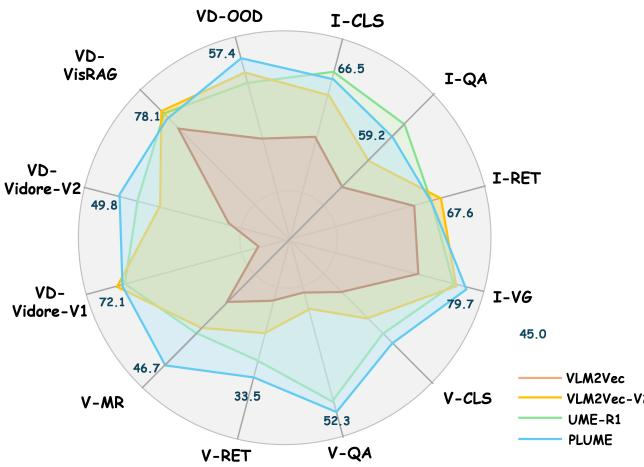  
Figure 4. Per task performance comparison on MMEB-v2.

Table 3. Ablation on the core components of PLUME.   

<table><tr><td>Configuration</td><td>Image</td><td>Video</td><td>VisDoc</td><td>All</td></tr><tr><td>Full PLUME</td><td>66.3</td><td>44.1</td><td>67.5</td><td>61.6</td></tr><tr><td>w/o Latent Transition</td><td>63.6</td><td>41.0</td><td>64.8</td><td>58.8</td></tr><tr><td>w/o MoE (single MLP)</td><td>64.2</td><td>41.8</td><td>64.4</td><td>59.2</td></tr><tr><td>w/o Semantic Anchor</td><td>65.4</td><td>42.3</td><td>66.1</td><td>60.1</td></tr><tr><td>w/o Curriculum</td><td>60.2</td><td>36.5</td><td>60.2</td><td>54.8</td></tr></table>

表 . 潜在步骤 $K$ 对准确性和延迟的影响。

<table><tr><td></td><td></td><td>K Image Video</td><td></td><td></td><td> VisDoc All Latency (ms)</td></tr><tr><td>4</td><td>64.3</td><td>43.3</td><td>65.7</td><td>59.9</td><td>232</td></tr><tr><td>6</td><td>65.9</td><td>43.6</td><td>66.7</td><td>61.1</td><td>268</td></tr><tr><td>8</td><td>66.3</td><td>44.1</td><td>67.5</td><td>61.6</td><td>300</td></tr></table>

3. 大幅降级确认从显式推理到隐式推理的突然转变导致训练不稳定，而渐进的调度对于稳定知识转移是必要的。完全去除隐式转换（从最后一个前缀词元读取嵌入）总体上降低了 2.8 的准确性，所有模态的一致损失验证了迭代隐空间计算提供了超出额外参数的真实推理收益。用单个共享 MLP 替代 MoE 适配器损失 2.4 分，而在 Vis-Doc 上降级最为明显 $( - 3 . 1 )$，因为文档理解受益于专门的专家路径。去除路由器中的语义锚定对视频影响最大 $( - 1 . 8 )$，表明全局输入上下文对路由时间推理的重要性。隐式步骤 $K$。表 4 显示准确性从 $K = 4$ 到 $K = 8$ 稳步提升，总体上提高了 1.7 分。从 6 到 8 的增益 $( + 0 . 5 )$ 小于从 4 到 6 的增益 $( + 1 . 2 )$，展现出收益递减的特点。延迟大致线性增长 $2 3 2 \mathrm { m s } 3 0 0 \mathrm { m s }$，因此 $K = 8$ 提供最佳的绝对准确性，而 $K = 6$ 则提供有利的准确性—速度平衡（见图 1）。

Table 5. Ablation on the transition adapter design.   

<table><tr><td>Configuration</td><td>Image</td><td>Video</td><td>VisDoc</td><td>All</td></tr><tr><td>Default (Me = 4, Kr = 2, shared)</td><td>66.3</td><td>44.1</td><td>67.5</td><td>61.6</td></tr><tr><td>w/o Shared Expert</td><td>65.4</td><td>42.5</td><td>66.1</td><td>60.3</td></tr><tr><td>Top-1 expert (instead of Top-2)</td><td>65.8</td><td>43.0</td><td>66.8</td><td>60.8</td></tr><tr><td>Router: w/o c(x)</td><td>65.4</td><td>42.3</td><td>66.1</td><td>60.1</td></tr><tr><td>Router: w/o e(k)</td><td>65.7</td><td>41.9</td><td>66.2</td><td>60.4</td></tr></table>

  
Figure 5. Activation preferences of specialized experts across image and video retrieval sub-tasks.

过渡适配器设计。表5验证了路由适配器中各个设计选择。移除共享专家使整体准确率下降了1.3，证实了一个与模态无关的基线路径能够补充专业专家。Top-2 路由比 Top-1 高出0.8，表明组合两个专家能够捕捉到更丰富的过渡模式。在路由输入中，移除语义锚点 $c ( x )$ 的影响更大 $( - 1 . 5 )$ ，相比之下，移除步长嵌入 $e ^ { ( k ) }$ 的影响为 $( - 1 . 2 )$ ，但两者均有贡献：$c ( x )$ 为专家选择提供了全局输入上下文，而 $e ^ { ( k ) }$ 则编码了在推演过程中的位置进展。

# 4.5. 诊断分析

我们可视化四个专业专家的路由行为，以检查路由适配器是否学习到了有意义的专业化。共享专家始终对每个输入激活，因此在热图中被省略；图中仅显示选择的前 $K _ { r }$ 个专业专家。

任务级路由。图5提供了图像和视频子任务的细粒度视图。专家2在视频分类（V-CLS: $7 5 . 2 \%$）和视频多模态检索（V-MRET: $7 0 . 6 \%$）上显示出最高的激活，且在图像分类（I-CLS: $6 5 . 1 \%$）和视频检索（V-ReT: $6 1 . 8 \%$）上也保持较高水平。专家1优先在问答任务中被激活：视频问答（V-QA: $6 3 . 8 \%$）和图像问答（I-QA: $5 9 . 9 \%$），与其对知识密集型推理的偏好一致。专家0在图像标注（I-GD: $6 2 . 9 \%$）和图像检索（I-RET: $6 0 . 4 \%$）上达到峰值，而几乎从未被选用于视频分类（V-CLS: $2 2 . 9 \%$）。专家3则保持较低激活，没有强烈的任务级峰值。这些激活模式纯粹源自路由目标，而没有任何显式任务标签，确认了语义锚点引导的路由器能够将潜在计算适应于每个输入的结构需求。

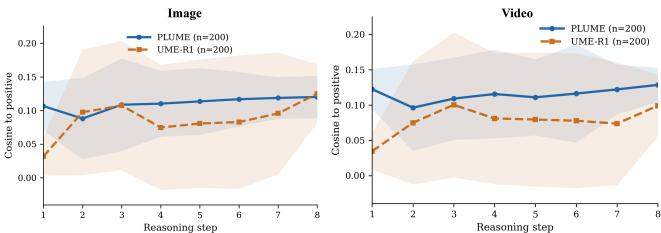  
Figure 6. Average cosine similarity between intermediate states and the positive target over 200 samples, reported separately on image and video retrieval. PLUME shows a smoother trajectory with consistently smaller variance than UME-R1 across reasoning steps.

潜在轨迹可视化。图6比较了200个样本中间状态与正目标之间的平均余弦相似度，报告用于图像和视频检索。我们将此指标作为轨迹稳定性的诊断信号，而不是要求每个中间步骤必须单调接近正目标。在这两个子集中，PLUME展示出比UME-R1更平滑的轨迹，并且方差始终较小，尤其是在早期推理步骤之后。在图像检索中，两个方法在开始时接近，但UME-R1在中间轨迹阶段出现更大的下降和明显更广的分散，而PLUME在整个推理过程中保持更稳定。在视频检索中，优势更加明显：PLUME在大多数步骤中与正目标保持更强的对齐，而UME-R1则较低且波动更大。这些趋势表明，潜在推理为检索提供了更一致的中间计算路径，而显式的链式思维则在离散词元生成下产生更变量的隐状态轨迹。局限性。尽管在整体上超越了UME-R1，PLUME在图像问答子集上显示出明显的差距。这一弱点在所有问答任务中并不均匀：在ScienceQA和WebQA上差距较小，但在文本丰富或知识密集型基准（如ChartQA、InfographicsVQA和OK-VQA）上明显更大。我们推测这些任务更依赖于保留细致的文本细节和明确的中间语义组织，而PLUME则将推理压缩为一个短的潜在推理轨迹，优化用于检索导向的表示形成。此外，虽然路由适配器发展出与我们的设计假设一致的差异化激活模式，但对于连续潜在轨迹的正式可解释性保证仍然是一个未解决的问题。

# 5. 结论

我们提出了PLUME，一种用于通用多模态嵌入的潜在推理框架，该框架用简短的隐空间推演替代了显式的思维链生成。通过结合潜在的多步推理、基于锚点的路由适应和渐进式显式到潜在的课程，PLUME实现了推理在紧凑嵌入中的更好转移。在78个任务的MMEBv2基准测试中，PLUME超越了在相同数据上训练的UME-R1，将推理从数百个词元减少到少于十个潜在步骤，并实现了超过30倍的推理速度提升。

# References

[1] Shuai Bai, Keqin Chen, Xuejing Liu, Jialin Wang, Wenbin Ge, Sibo Song, Kai Dang, Peng Wang, Shijie Wang, Jun Tang, et al. Qwen2. 5-vl technical report. arXiv preprint arXiv:2502.13923, 2025. 7   
[2] Yoshua Bengio, Jérôme Louradour, Ronan Collobert, and Jason Weston. Curriculum learning. In Proceedings of the 26th International Conference on Machine Learning, pages 4148. ACM, 2009. 6   
[3] Haonan Chen, Hong Liu, Yuping Luo, Liang Wang, Nan Yang, Furu Wei, and Zhicheng Dou. Moca: Modality-aware continual pre-training makes better bidirectional multimodal embeddings. arXiv preprint arXiv:2506.23115, 2025. 3   
[4] Xinghao Chen, Anhao Zhao, Heming Xia, Xuan Lu, Hanlin Wang, Yanjun Chen, Wei Zhang, Jian Wang, Wenjie Li, and Xiaoyu Shen. Reasoning beyond language: A comprehensive survey on latent chain-of-thought reasoning. CoRR, abs/2505.16782, 2025. 2, 3   
[5] Xuanming Cui, Jianpeng Cheng, Hong-you Chen, Satya Narayan Shukla, Abhijeet Awasthi, Xichen Pan, Chaitanya Ahuja, Shlok Kumar Mishra, Yonghuan Yang, Jun Xiao, et al. Think then embed: Generative context improves multimodal embedding. arXiv preprint arXiv:2510.05014, 2025. 2, 3, 7   
[6] Manuel Faysse, Hugues Sibille, Tony Wu, Bilel Omrani, Gautier Viaud, Céline Hudelot, and Pierre Colombo. Colpali: Efficient document retrieval with vision language models. arXiv preprint arXiv:2407.01449, 2024. 3   
[7] William Fedus, Barret Zoph, and Noam Shazeer. Switch transformers: Scaling to trillion parameter models with simple and efficient sparsity. ArXiv, abs/2101.03961, 2021. 5   
[8] Sachin Goyal, Ziwei Ji, Ankit Singh Rawat, Aditya Menon, Sanjiv Kumar, and Vaishnavh Nagarajan. Think before you speak: Training language models with pause tokens. In International Conference on Learning Representations (ICLR), 2024. 3   
[9] Aaron Grattafiori, Abhimanyu Dubey, Abhinav Jauhri, Abhinav Pandey, Abhishek Kadian, Ahmad Al-Dahle, Aiesha Letman, Akhil Mathur, Alan Schelten, Alex Vaughan, et al. The llama 3 herd of models. arXiv preprint arXiv:2407.21783, 2024. 1   
[10] Tiancheng Gu, Kaicheng Yang, Ziyong Feng, Xingjun Wang, Yanzhao Zhang, Dingkun Long, Yingda Chen, Weidong Cai, and Jiankang Deng. Breaking the modality barrier: Universal embedding learning with multimodal llms. arXiv preprint arXiv:2504.17432, 2025. 3   
[11] Daya Guo, Dejian Yang, Haowei Zhang, Junxiao Song, Ruoyu Zhang, Runxin Xu, Qihao Zhu, Shirong Ma, Peiyi Wang, Xiao Bi, et al. Deepseek-r1: Incentivizing reasoning capability in llms via reinforcement learning. arXiv preprint arXiv:2501.12948, 2025. 3   
[12] Shibo Hao, Sainbayar Sukhbaatar, DiJia Su, Xian Li, Zhiting Hu, Jason Weston, and Yuandong Tian. Training large language models to reason in a continuous latent space. CoRR, abs/2412.06769, 2024. 2, 3   
[13] Xiangzhao Hao, Shijie Wang, Tianyu Yang, Tianyue Wang, Haiyun Guo, and Jinqiao Wang. Trace: Task-adaptive reasoning and representation learning for universal multimodal retrieval, 2026. 2, 3   
[14] Dan Hendrycks and Kevin Gimpel. Gaussian error linear units (gelus). arXiv: Learning, 2016. 5   
[15] Gautier Izacard, Mathilde Caron, Lucas Hosseini, Sebastian Riedel, Piotr Bojanowski, Armand Joulin, and Edouard Grave. Unsupervised dense information retrieval with contrastive learning. Trans. Mach. Learn. Res., 2022, 2022. 6   
[16] Kalervo Järvelin and Jaana Kekäläinen. Cumulated gainbased evaluation of ir techniques. ACM Transactions on Information Systems (TOIS), 20(4):422446, 2002. 7   
[17] Chao Jia, Yinfei Yang, Ye Xia, Yi-Ting Chen, Zarana Parekh, Hieu Pham, Quoc Le, Yun-Hsuan Sung, Zhen Li, and Tom Duerig. Scaling up visual and vision-language representation learning with noisy text supervision. In International conference on machine learning, pages 49044916. PMLR, 2021. 3   
[18] Haonan Jiang, Yuji Wang, Yongjie Zhu, Xin Lu, Wenyu Qin, Meng Wang, Pengfei Wan, and Yansong Tang. Embedrl: Reinforcement learning for reasoning-driven multimodal embeddings. arXiv preprint arXiv:2602.13823, 2026. 3   
[19] Ting Jiang, Minghui Song, Zihan Zhang, Haizhen Huang, Weiwei Deng, Feng Sun, Qi Zhang, Deqing Wang, and Fuzhen Zhuang. E5-v: Universal embeddings with multimodal large language models. arXiv preprint arXiv:2407.12580, 2024. 2, 3   
[20] Ziyan Jiang, Rui Meng, Xinyi Yang, Semih Yavuz, Yingbo Zhou, and Wenhu Chen. Vlm2vec: Training vision-language models for massive multimodal embedding tasks. arXiv preprint arXiv:2410.05160, 2024. 1, 2, 3, 4, 7   
[21] Jiajie Jin, Yanzhao Zhang, Mingxin Li, Dingkun Long, Pengjun Xie, Yutao Zhu, and Zhicheng Dou. Laser: Internalizing explicit reasoning into latent space for dense retrieval, 2026. 3   
[22] Woosuk Kwon, Zhuohan Li, Siyuan Zhuang, Ying Sheng, Lianmin Zheng, Cody Hao Yu, Joseph Gonzalez, Hao Zhang, and Ion Stoica. Efficient memory management for large lanouage model cerving with nagedattention In Proceedings of the 29th Symposium on Operating Systems Principles, SOSP 2023, Koblenz, Germany, October 23-26, 2023, pages 611626. ACM, 2023. 5 [23] Zhibin Lan, Liqiang Niu, Fandong Meng, Jie Zhou, and Jinsong Su. Llave: Large language and vision embedding models with hardness-weighted contrastive learning. arXiv preprint arXiv:2503.04812, 2025. 3 [24] Zhibin Lan, Liqiang Niu, Fandong Meng, Jie Zhou, and Jinsong Su. Ume-r1: Exploring reasoning-driven generative multimodal embeddings. arXiv preprint arXiv:2511.00405,   
2025. 2, 3, 7, 8 [25] Chankyu Lee, Rajarshi Roy, Mengyao Xu, Jonathan Raiman, Mohammad Shoeybi, Bryan Catanzaro, and Wei Ping. Nvembed: Improved techniques for training llms as generalist embedding models. In The Thirteenth International Conference on Learning Representations, ICLR 2025, Singapore, April 24-28, 2025. OpenReview.net, 2025. 3 [26] Bo Li, Yuanhan Zhang, Dong Guo, Renrui Zhang, Feng Li, Hao Zhang, Kaichen Zhang, Peiyuan Zhang, Yanwei Li, Ziwei Liu, et al.Llava-onevision:Easy visual task transfer. arXiv preprint arXiv:2408.03326, 2024. 1 [27] Junnan Li, Dongxu Li, Silvio Savarese, and Steven Hoi. Blip-2: Bootstrapping language-image pre-training with frozen image encoders and large language models. In International conference on machine learning, pages 19730   
19742. PMLR, 2023. 3 [28] Sheng-Chieh Lin, Chankyu Lee, Mohammad Shoeybi, Jimmy Lin, Bryan Catanzaro, and Wei Ping. Mm-embed: Universal multimodal retrieval with multimodal llms. arXiv preprint arXiv:2411.02571, 2024. 2, 3 [29] Haotian Liu, Chunyuan Li, Qingyang Wu, and Yong Jae Lee. Visual instruction tuning. Advances in neural information processing systems, 36:3489234916, 2023. 1 [30] Yikun Liu, Yajie Zhang, Jiayin Cai, Xiaolong Jiang, Yao Hu, Jiangchao Yao, Yanfeng Wang, and Weidi Xie. Lamra: Large multimodal model as your advanced retrieval assistant. In Proceedings of the Computer Vision and Pattern Recognition Conference, pages 40154025, 2025. 3, 7 [31] Rui Meng, Ziyan Jiang, Ye Liu, Mingyi Su, Xinyi Yang, Yuepeng Fu, Can Qin, Zeyuan Chen, Ran Xu, Caiming Xiong, et al. Vlm2vec-v2: Advancing multimodal embedding for videos, images, and visual documents. arXiv preprint arXiv:2507.04590, 2025. 1, 3, 7, 8 [32] Aaron van den Oord, Yazhe Li, and Oriol Vinyals. Representation learning with contrastive predictive coding. arXiv preprint arXiv:1807.03748, 2018. 3, 4, 6 [33] Jacob Pfau, William Merrill, and Samuel R. Bowman. Let's think dot by dot: Hidden computation in transformer language models. ArXiv, abs/2404.15758, 2024. 3 [34] Alec Radford, Jong Wook Kim, Chris Hallacy, Aditya Ramesh, Gabriel Goh, Sandhini Agarwal, Girish Sastry, Amanda Askell, Pamela Mishkin, Jack Clark, et al. Learning transferable visual models from natural language supervision. In International conferenceon machine learning, ages   
87488763. PmLR, 2021. 3 [35] Noam Shazeer, Azalia Mirhoseini, Krzysztof Maziarz, Andy Davis, Quoc Le, Geoffrey Hinton, and Jeff Dean. Outrageously large neural networks: The sparsely-gated mixtureof-experts layer, 2017. 5   
[36] Zhenyi Shen, Hanqi Yan, Linhai Zhang, Zhanghao Hu, Yali Du, and Yulan He. CODI: compressing chain-ofthought into continuous space via self-distillation. CoRR, abs/2502.21074, 2025. 2, 3   
[37] Ashish Vaswani, Noam Shazeer, Niki Parmar, Jakob Uszkoreit, Llion Jones, Aidan N. Gomez, Lukasz Kaiser, and Illia Polosukhin. Attention is all you need. In Neural Information Processing Systems, 2017.5   
[38] Liang Wang, Nan Yang, Xiaolong Huang, Binxing Jiao, Linjun Yang, Daxin Jiang, Rangan Majumder, and Furu Wei. Text embeddings by weakly-supervised contrastive pretraining. CoRR, abs/2212.03533, 2022. 3   
[39] Liang Wang, Nan Yang, Xiaolong Huang, Linjun Yang, Rangan Majumder, and Furu Wei. Improving text embeddings with large language models. In Proceedings of the 62nd Annual Meeting of the Association for Computational Linguistics (Volume 1: Long Papers), ACL 2024, Bangkok, Thailand, August 11-16, 2024, pages 1189711916. Association for Computational Linguistics, 2024. 3   
[40] Peng Wang, Shuai Bai, Sinan Tan, Shijie Wang, Zhihao Fan, Jinze Bai, Keqin Chen, Xuejing Liu, Jialin Wang, Wenbin G, et al. Qwen2-vl: Enhancing vision-language model's perception of the world at any resolution. arXiv preprint arXiv:2409.12191, 2024. 1, 7   
[41] Xuezhi Wang, Jason Wei, Dale Schuurmans, Quoc Le, Ed Chi, Sharan Narang, Aakanksha Chowdhery, and Denny Zhou. Self-consistency improves chain of thought reasoning in language models. arXiv preprint arXiv:2203.11171, 2022. 2, 3   
[42] Cong Wei, Yang Chen, Haonan Chen, Hexiang Hu, Ge Zhang, Jie Fu, Alan Ritter, and Wenhu Chen. Uniir: Training and benchmarking universal multimodal information retrievers. In European Conference on Computer Vision, pages 387404. Springer, 2024. 3   
[43] Jason Wei, Xuezhi Wang, Dale Schuurmans, Maarten Bosma, Fei Xia, Ed Chi, Quoc V Le, Denny Zhou, et al. Chain-of-thought prompting elicits reasoning in large language models. Advances in neural information processing systems, 35:2482424837, 2022. 2, 3   
[44] Shitao Xiao, Zheng Liu, Peitian Zhang, Niklas Muennighoff, Defu Lian, and Jian-Yun Nie. C-pack: Packed resources for general chinese embeddings. In Proceedings of the 47th International ACM SIGIR Conference on Research and Development in Information Retrieval, SIGIR 2024, Washington DC, USA, July 14-18, 2024, pages 641649. ACM, 2024. 3   
[45] Guowei Xu, Peng Jin, Ziang Wu, Hao Li, Yibing Song, Lichao Sun, and Li Yuan. Llava-cot: Let vision language models reason step-by-step. In Proceedings of the IEEE/CVF International Conference on Computer Vision, pages 2087 2098, 2025. 3   
[46] Tianyu Yang, ChenWei He, Xiangzhao Hao, Tianyue Wang, Jiarui Guo, Haiyun Guo, Leigang Qu, Jinqiao Wang, and Tat-Seng Chua. Recall: Recalibrating capability degradation for mllm-based composed image retrieval. arXiv preprint arXiv:2602.01639, 2026. 2   
[4/] Tianyu Yang, Chenwei He, Xiangzhao Hao, Tianyue Wang, Jiarui Guo, Haiyun Guo, Leigang Qu, Jinqiao Wang, and Tat-Seng Chua. Recall: Recalibrating capability degradation for mllm-based composed image retrieval, 2026. 3   
[48] Hao Yu, Zhuokai Zhao, Shen Yan, Lukasz Korycki, Jianyu Wang, Baosheng He, Jiayi Liu, Lizhu Zhang, Xiangjun Fan, and Hanchao Yu. Cafe: Unifying representation and generation with contrastive-autoregressive finetuning. arXiv preprint arXiv:2503.19900, 2025. 3   
[49] Shi Yu, Chaoyue Tang, Bokai Xu, Junbo Cui, Junhao Ran, Yukun Yan, Zhenghao Liu, Shuo Wang, Xu Han, Zhiyuan Liu, et al. Visrag: Vision-based retrieval-augmented generation on multi-modality documents. arXiv preprint arXiv:2410.10594, 2024. 3   
[50] E. Zelikman, Georges Harik, Yijia Shao, Varuna Jayasiri, Nick Haber, and Noah D. Goodman. Quiet-star: Language models can teach themselves to think before speaking. ArXiv, abs/2403.09629, 2024. 3   
[51] Xiaohua Zhai, Basil Mustafa, Alexander Kolesnikov, and Lucas Beyer. Sigmoid loss for language image pre-training. In Proceedings of the IEEE/CVF international conference on computer vision, pages 1197511986, 2023. 3   
[52] Kai Zhang, Yi Luan, Hexiang Hu, Kenton Lee, Siyuan Qiao, Wenhu Chen, Yu Su, and Ming-Wei Chang. Magiclens: Self-supervised image retrieval with open-ended instructions. arXiv preprint arXiv:2403.19651, 2024. 3   
[53] Xuan Zhang, Chao Du, Tianyu Pang, Qian Liu, Wei Gao, and Min Lin. Chain of preference optimization: Improving chain-of-thought reasoning in llms. Advances in Neural Information Processing Systems, 37:333356, 2024. 3   
[54] Xin Zhang, Yanzhao Zhang, Wen Xie, Mingxin Li, Ziqi Dai, Dingkun Long, Pengjun Xie, Meishan Zhang, Wenjie Li, and Min Zhang. Gme: Improving universal multimodal retrieval by multimodal llms. arXiv preprint arXiv:2412.16855, 2024. 1, 2, 3, 7   
[55] Xin Zhang, Yanzhao Zhang, Wen Xie, Mingxin Li, Ziqi Dai, Dingkun Long, Pengjun Xie, Meishan Zhang, Wenjie Li, and Min Zhang. Bridging modalities: Improving universal multimodal retrieval by multimodal large language models. In Proceedings of the Computer Vision and Pattern Recognition Conference, pages 92749285, 2025. 3, 7   
[56] Junjie Zhou, Zheng Liu, Ze Liu, Shitao Xiao, Yueze Wang, Bo Zhao, Chen Jason Zhang, Defu Lian, and Yongping Xiong. Megapairs: Massive data synthesis for universal multimodal retrieval. arXiv preprint arXiv:2412.14475, 2024. 3   
[57] Junjie Zhou, Yongping Xiong, Zheng Liu, Ze Liu, Shitao Xiao, Yueze Wang, Bo Zhao, Chen Jason Zhang, and Defu Lian. Megapairs: Massive data synthesis for universal multimodal retrival. In Proceding of the 63rd Annual Meeting of the Association for Computational Linguistics (Volume 1: Long Papers), pages 1907619095, 2025. 3

# A. Curriculum Ablation Details

We provide additional ablations on the curriculum design used in PLUME. Specifically, we vary the number of curriculum stages while keeping the backbone, training data, total number of training epochs, and all other optimization settings fixed. Unless otherwise specified, all variants use the same final latent rollout length and differ only in how progressively the explicit reasoning segments are rewritten into latent computation.

Table 6 compares curriculum schedules with 2, 4, 6, and 8 stages. Overall, we observe that curriculum granularity has a non-monotonic effect on performance. Using only 2 stages yields the weakest result, suggesting that an overly abrupt transition from explicit reasoning supervision to latent computation is suboptimal. With too few stages, the model must absorb a large distribution shift at each transition, which makes it harder to preserve stable representation quality during the handoff from token-level reasoning traces to latent reasoning steps.

Increasing the number of stages to 4 substantially improves performance across all three domains, indicating that a moderately progressive curriculum better supports optimization. A finer curriculum allows the model to adapt more smoothly as explicit reasoning is gradually replaced by latent rollout, reducing optimization difficulty and stabilizing embedding formation. This effect is particularly visible in the visual document setting, where the gap between 2 and 4 stages is the largest.

Further increasing the number of stages beyond 4 does not bring additional gains. Although 6 stages remains competitive, its overall result is slightly below the 4-stage setting, and 8 stages degrades more clearly. Since the total training budget is fixed for all variants, increasing the number of stages necessarily reduces the effective training time allocated to each individual stage. As a result, later stages may be under-optimized before the curriculum advances again, preventing the model from fully adapting to each intermediate supervision regime. In addition, an overly finegrained curriculum weakens the distinction between adjacent stages, which may reduce the practical benefit of each transition while introducing extra scheduling complexity.

Taken together, these results suggest that the curriculum should be progressive enough to avoid a sharp explicit-tolatent shift, but not so fragmented that each stage becomes too short to be fully exploited. We therefore adopt 4 stages as the default setting, as it provides the best overall trade-off between retrieval accuracy and curriculum efficiency in our experiments.

Implementation details. For all curriculum variants, we preserve the same overall training setup and only modify the number of transition stages. The rewritten portion of the reasoning sequence increases progressively across stages, while the latent rollout budget is scaled accordingly to match the increasing degree of latent computation. This design isolates the effect of curriculum granularity without confounding it with changes in model capacity or total optimization budget.

Table 6. Ablation on the number of curriculum stages. All models are trained with the same data, backbone, and total training recipe unless otherwise specified. The best result is in bold and the second best is underlined.   

<table><tr><td># Stages</td><td>Image</td><td>Video</td><td>VisDoc</td><td>Avg.</td></tr><tr><td>2</td><td>64.0</td><td>42.1</td><td>64.3</td><td>59.0</td></tr><tr><td>4</td><td>66.3</td><td>44.1</td><td>67.5</td><td>61.6</td></tr><tr><td>6</td><td>66.4</td><td>43.7</td><td>67.3</td><td>61.4</td></tr><tr><td>8</td><td>65.6</td><td>43.6</td><td>66.7</td><td>60.9</td></tr></table>

# B. Training Time and Computational Cost Analysis

We briefly report the training cost of PLUME under different latent rollout lengths. Since all variants share the same backbone and training recipe, the main difference in computational cost comes from the number of latent reasoning steps. In our experiments, training PLUME with 4 latent steps requires approximately 2562 H20 GPU hours. The cost increases to about 2838 H20 GPU hours for 6 latent steps and $3 1 1 9 \mathrm { H } 2 0$ GPU hours for 8 latent steps. This increase is expected, as longer latent rollouts introduce additional computation during training. These results show that the training cost grows steadily with the latent rollout length, without introducing unexpected overhead beyond the added latent computation itself.

# C. Failure Case Analysis

We provide representative failure cases to better understand the remaining limitations of PLUME. In general, PLUME performs strongly on retrieval tasks that benefit from compact multi-step reasoning, but it can still struggle in cases requiring fine-grained textual preservation, dense document understanding, or externally grounded factual knowledge.

Figure 7 presents representative failure cases from ChartQA. We focus on this benchmark because it requires fine-grained numerical reading, localized text grounding, and compositional reasoning over structured visual content. In both examples, the correct answer remains semantically close to the retrieved candidates, but PLUME fails to rank it first. This pattern suggests that the main limitation is not a complete loss of task intent, but rather insufficient preservation of small numerical distinctions and multi-step relational structure after explicit reasoning is compressed into a compact latent rollout.

Figure 8 presents a representative failure case from InfographicsVQA. Compared with natural image question answering, infographic style inputs require the model to aggregate fine-grained textual cues distributed across multiple regions under a complex visual layout. In this example, PLUME correctly identifies the relevant semantic neighborhood, but ranks broader or compositionally related answers ahead of the exact target. This suggests that the main challenge lies not in coarse semantic localization, but in maintaining precise answer granularity when dense textual structure must be compressed into a compact latent reasoning trajectory. In many instances, PLUME still places semantically related candidates near the top, indicating that the latent rollout preserves a substantial portion of the relevant query intent even when the exact target is not ranked first.

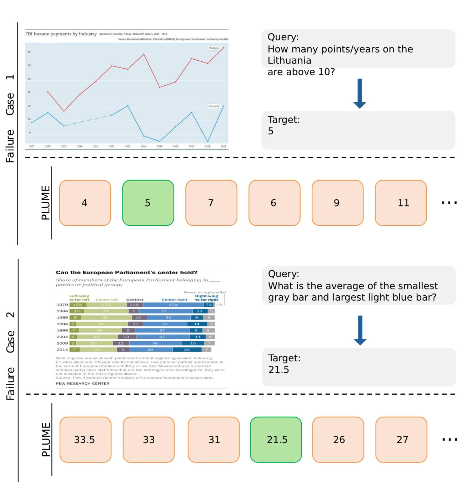  
LUM o fnegrainednumericalrelations and localized textual details required by chart-intensive question answering.

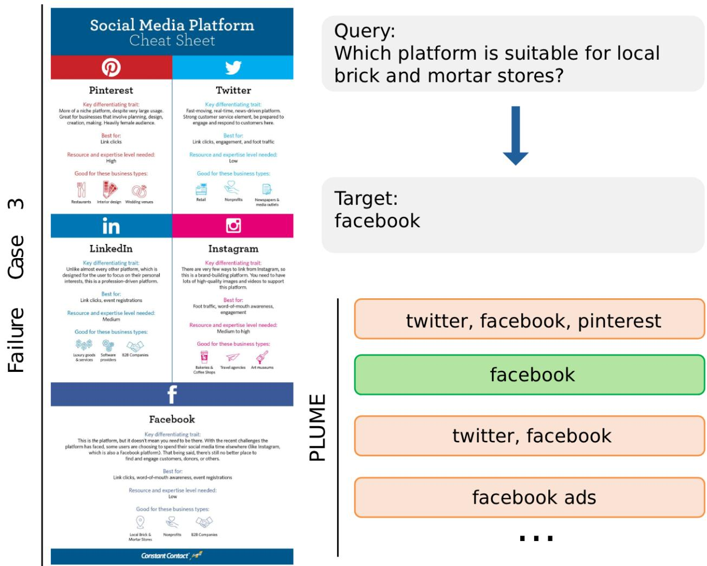  
answer granularity needed for exact retrieval.

More broadly, the weakness on QA-style subsets should also be interpreted in light of the benchmark formulation itself. In MMEB, visual question answering is cast as an embedding retrieval problem, where the query consists of an instruction, an image, and a question, and the model must retrieve the correct answer from a fixed candidate pool. Prior work has noted that this type of evaluation pattern is not fully aligned with realistic question answering settings, where relevant evidence retrieval and answer generation are more tightly coupled, and where bounded candidate pools can simplify or distort the underlying retrievalreasoning difficulty. We therefore view the larger gaps on text-rich QA benchmarks such as ChartQA and InfographicsVQA as reflecting both a model-side challenge in preserving finegrained textual and numerical structure, and a benchmarkside mismatch between QA and retrieval formulations.

These cases are consistent with the discussion in Sec. 4.5: while latent reasoning is more efficient and often sufficient for retrieval-oriented representation formation, explicit verbal reasoning may still preserve certain types of fine-grained semantic structure better in some challenging settings.

# D. Additional Routing Visualization

To further analyze the behavior of the semantic-anchorguided routed adapter, we visualize the average activation rate of each expert across different input modalities. Rather than focusing on individual examples, this aggregated view provides a coarse but informative picture of how the routed adapter allocates computation under different modality conditions.

Figure 9 summarizes expert activation patterns for six input types: text (T), image (I), video (V), document (D), text-image (TI), and text-video (TV). Several non-uniform trends can be observed. Expert 2 shows consistently high activation across almost all modalities, with especially strong responses on text and video inputs, suggesting that it serves as a broadly useful expert shared across diverse reasoning situations. In contrast, Expert 1 exhibits clearer specialization, reaching its highest activation on document and text-video inputs, which indicates a stronger preference for inputs with richer structured or cross-modal information. Expert O is comparatively more active on image and text-image inputs, while Expert 3 is most activated on text inputs and remains less preferred for document and mixedmodality cases.

These patterns suggest that the routed adapter does not collapse to a uniform expert usage distribution. Instead, different experts develop differentiated modality preferences, while still maintaining partial overlap that allows computation to be shared across related settings. This behavior is consistent with our design motivation: multimodal retrieval inputs are heterogeneous in structure, and thus benefit from adaptive latent transition pathways rather than a single fixed computation pattern.

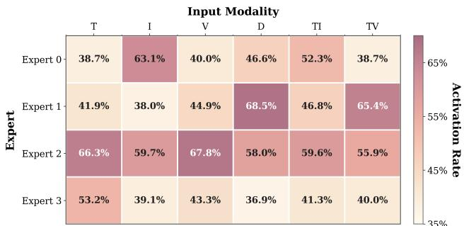  
Figure 9. Average activation rate of each expert across input modalities. T, I, V, D, TI, and TV denote text, image, video, document, text-image, and text-video inputs, respectively. Darker cells indicate higher expert activation rates.

Overall, the visualization shows that the routed adapter learns structured but non-uniform expert allocation patterns across modalities, supporting the claim that different multimodal inputs benefit from differentiated latent computation.

# E. Full MMEB-V2 Results

We report the full MMEB-V2 evaluation results in this section. Following prior work, we provide per-task scores to give a more complete picture beyond the averaged categorylevel metrics reported in the main paper.

Table 7, 8 lists the detailed performance of all compared methods on MMEB-V2. These results show that the gains of PLUME are broadly distributed across task families, rather than arising from only a small subset of benchmarks.

# F. Additional Baseline Comparisons

In this section, we provide additional qualitative comparisons between explicit CoT and PLUME on representative retrieval cases. As shown in Figures 10, 11, 12, and 13, explicit CoT can fail in several different ways: it may overfocus on a spurious textual detail, compress the retrieval intent into an overly coarse verbal summary, rely on a misleading surface-level prior, or drift toward an incorrect action description.

For each PLUME example, the small line chart visualizes the cosine similarity between the hidden state at each latent rollout step and the embeddings of the top retrieved candidates at the end of inference. In other words, the curves show how strongly each intermediate latent state aligns with several final candidate targets as the rollout proceeds. We emphasize that these trajectories are used only as a diagnostic view of latent computation: they are not intended to imply that every step must monotonically approach the correct target or correspond to an interpretable verbal reasoning trace. Instead, they illustrate a different property from explicit CoT: PLUME does not externalize intermediate reasoning into a fixed textual path, and therefore is less likely to be locked into an early verbal mistake. Across these cases, although the relative similarities may fluctuate during rollout, the correct target remains recoverable and is ultimately selected at the end. These examples further support our claim that latent reasoning is less vulnerable to discrete verbal lock-in than explicit CoT in retrievaloriented embedding formation.

TablFul MMEB- results witelecte baselnes Par Overal and Image LM2Vecdenot VLM2Ve7B   

<table><tr><td>Task</td><td>GME-2B</td><td>LamRA</td><td>VLM2Vec</td><td>VLM2Vec-V2.0</td><td>DUME-2B</td><td>UME-R1-2B</td><td>PLUME</td></tr><tr><td>Avg - All (78 tasks)</td><td>54.1</td><td>40.5</td><td>46.9</td><td>58.1</td><td>52.7</td><td>60.1</td><td>61.6</td></tr><tr><td>Avg - Image (36 tasks, Hit@1)</td><td>51.9</td><td>54.1</td><td>59.7</td><td>64.9</td><td>62.5</td><td>66.6</td><td>66.3</td></tr><tr><td>I-CLS (10)</td><td>54.6</td><td>59.3</td><td>58.6</td><td>62.9</td><td>59.3</td><td>64.8</td><td>66.5</td></tr><tr><td>I-QA (10)</td><td>29.8</td><td>26.5</td><td>49.2</td><td>56.4</td><td>54.9</td><td>62.8</td><td>59.2</td></tr><tr><td>I-RET (12)</td><td>66.8</td><td>70.1</td><td>65.0</td><td>69.6</td><td>66.3</td><td>67.6</td><td>67.6</td></tr><tr><td>I-VG (4)</td><td>55.6</td><td>62.6</td><td>73.1</td><td>77.1</td><td>78.0</td><td>77.2</td><td>79.7</td></tr><tr><td>ImageNet-1K</td><td>58.1</td><td>72.6</td><td>77.5</td><td>80.8</td><td>74.6</td><td>75.3</td><td>74.1</td></tr><tr><td>N24News</td><td>50.3</td><td>51.6</td><td>73.8</td><td>73.0</td><td>69.7</td><td>81.1</td><td>81.1</td></tr><tr><td>HatefulMemes</td><td>53.7</td><td>49.1</td><td>57.9</td><td>55.8</td><td>65.3</td><td>75.2</td><td>75.5</td></tr><tr><td>VOC2007</td><td>75.8</td><td>80.0</td><td>74.3</td><td>84.9</td><td>68.9</td><td>80.0</td><td>86.1</td></tr><tr><td>SUN397</td><td>67.0</td><td>68.7</td><td>73.7</td><td>70.9</td><td>71.4</td><td>79.4</td><td>76.9</td></tr><tr><td>Place365</td><td>36.1</td><td>40.5</td><td>35.0</td><td>36.1</td><td>41.0</td><td>42.6</td><td>42.4</td></tr><tr><td>ImageNet-A</td><td>28.4</td><td>47.2</td><td>50.6</td><td>47.6</td><td>41.3</td><td>50.4</td><td>50.8</td></tr><tr><td>ImageNet-R</td><td>78.5</td><td>88.4</td><td>84.7</td><td>89.3</td><td>90.7</td><td>88.7</td><td>87.5</td></tr><tr><td>ObjectNet</td><td>71.2</td><td>66.3</td><td>36.9</td><td>65.1</td><td>46.2</td><td>52.0</td><td>61.5</td></tr><tr><td>Country211</td><td>26.4</td><td>28.3</td><td>21.7</td><td>25.8</td><td>23.9</td><td>23.4</td><td>25.0</td></tr><tr><td>OK-VQA</td><td>30.1</td><td>37.9</td><td>48.2</td><td>51.7</td><td>56.8</td><td>62.4</td><td>60.5</td></tr><tr><td>A-OKVQA</td><td>18.6</td><td>26.9</td><td>39.7</td><td>44.0</td><td>46.9</td><td>51.1</td><td>49.9</td></tr><tr><td>DocVQA</td><td>30.0</td><td>22.4</td><td>82.7</td><td>90.1</td><td>86.0</td><td>92.2</td><td>89.9</td></tr><tr><td>InfographicsVQA</td><td>11.8</td><td>16.5</td><td>47.3</td><td>59.1</td><td>59.2</td><td>67.7</td><td>59.6</td></tr><tr><td>ChartQA</td><td>13.3</td><td>11.6</td><td>42.2</td><td>48.1</td><td>39.1</td><td>64.9</td><td>49.8</td></tr><tr><td>Visual7W</td><td>15.6</td><td>19.8</td><td>50.9</td><td>52.8</td><td>46.9</td><td>54.1</td><td>47.6</td></tr><tr><td>ScienceQA</td><td>27.1</td><td>26.5</td><td>30.5</td><td>38.1</td><td>38.7</td><td>42.7</td><td>42.9</td></tr><tr><td>VizWiz</td><td>37.1</td><td>31.9</td><td>38.8</td><td>43.3</td><td>42.0</td><td>46.8</td><td>46.5</td></tr><tr><td>GQA</td><td>75.3</td><td>38.3</td><td>48.1</td><td>65.4</td><td>60.2</td><td>67.3</td><td>69.1</td></tr><tr><td>TextVQA</td><td>39.5</td><td>33.1</td><td>63.2</td><td>71.6</td><td>73.9</td><td>78.6</td><td>78.9</td></tr><tr><td>VisDial</td><td>47.7</td><td>61.0</td><td>75.1</td><td>82.7</td><td>75.9</td><td>76.6</td><td>72.6</td></tr><tr><td>CIRR</td><td>43.1</td><td>52.1</td><td>46.8</td><td>57.3</td><td>52.0</td><td>53.7</td><td>54.6</td></tr><tr><td>VisualNews.t2i</td><td>74.8</td><td>70.9</td><td>73.4</td><td>74.7</td><td>71.2</td><td>71.7</td><td>71.3</td></tr><tr><td>VisualNews.i2t</td><td>77.7</td><td>84.1</td><td>73.8</td><td>78.3</td><td>72.5</td><td>74.2</td><td>72.7</td></tr><tr><td>MSCOCO.t2i</td><td>68.3</td><td>72.0</td><td>73.1</td><td>75.9</td><td>74.5</td><td>75.1</td><td>74.1</td></tr><tr><td>MSCOCO.i2t</td><td>63.2</td><td>73.6</td><td>68.3</td><td>71.1</td><td>68.3</td><td>68.9</td><td>69.8</td></tr><tr><td>NIGHTS</td><td>67.6</td><td>65.7</td><td>65.8</td><td>68.4</td><td>67.5</td><td>67.2</td><td>68.0</td></tr><tr><td>WebQA</td><td>88.8</td><td>81.2</td><td>85.8</td><td>90.6</td><td>90.2</td><td>90.0</td><td>89.1</td></tr><tr><td>FashionIQ</td><td>32.2</td><td>41.7</td><td>13.8</td><td>19.6</td><td>11.5</td><td>17.1</td><td>20.3</td></tr><tr><td>Wiki-SS-NQ</td><td>73.8</td><td>70.1</td><td>54.6</td><td>67.6</td><td>60.0</td><td>62.0</td><td>68.6</td></tr><tr><td>OVEN</td><td>72.1</td><td>82.2</td><td>68.4</td><td>64.8</td><td>65.2</td><td>66.9</td><td>68.4</td></tr><tr><td>EDIS</td><td>91.7</td><td>86.1</td><td>81.4</td><td>84.2</td><td>86.5</td><td>88.0</td><td>81.8</td></tr><tr><td>MSCOCO</td><td>28.4</td><td>44.7</td><td>65.7</td><td>66.2</td><td>68.1</td><td>69.5</td><td>66.9</td></tr><tr><td>RefCOCO</td><td>55.8</td><td>62.5</td><td>80.8</td><td>87.0</td><td>85.1</td><td>83.3</td><td>86.5</td></tr><tr><td>RefCOCO-Matching</td><td>73.7</td><td>76.2</td><td>76.6</td><td>86.3</td><td>89.3</td><td>84.4</td><td>88.4</td></tr><tr><td>Visual7W-Pointing</td><td>64.6</td><td>67.1</td><td>69.1</td><td>69.0</td><td>69.5</td><td>71.5</td><td>74.9</td></tr></table>

Tabl Full MMEB-V2 results with selected baselines (Par IVideo and VisDoc). "VLM2Vec"denotes VLM2Vec-7B.   

<table><tr><td>Task</td><td>GME-2B</td><td>LamRA</td><td>VLM2Vec</td><td>VLM2Vec-V2.0</td><td>DUME-2B</td><td>UME-R1-2B</td><td>PLUME</td></tr><tr><td>Avg - Video (18 tasks, Hit@1)</td><td>33.6</td><td>35.2</td><td>28.6</td><td>34.7</td><td>33.2</td><td>42.2</td><td>44.1</td></tr><tr><td>Avg - Visdoc (24 tasks, NDCG@5)</td><td>72.7</td><td>23.9</td><td>41.6</td><td>65.4</td><td>52.8</td><td>63.9</td><td>67.5</td></tr><tr><td>V-CLS (5)</td><td></td><td>39.4</td><td>33.3</td><td>39.2</td><td>37.7</td><td>44.3</td><td>45.0</td></tr><tr><td>V-QA (5)</td><td>34.8 41.8</td><td>42.7</td><td>30.7</td><td>34.7</td><td>46.6</td><td>51.0</td><td>52.3</td></tr><tr><td>V-RET (5)</td><td>25.4</td><td>24.5</td><td>20.5</td><td>28.4</td><td>17.1</td><td>32.9</td><td>33.5</td></tr><tr><td>V-MR (3)</td><td>31.8</td><td>33.6</td><td>30.7</td><td>37.6</td><td>30.0</td><td>39.7</td><td>46.7</td></tr><tr><td>K700</td><td>34.9</td><td>42.3</td><td>31.0</td><td>38.2</td><td>22.7</td><td>35.8</td><td></td></tr><tr><td>SmthSmthV2</td><td>30.1</td><td>36.1</td><td>30.8</td><td>43.0</td><td>37.7</td><td>44.1</td><td>42.2 44.8</td></tr><tr><td>HMDB51</td><td>43.0</td><td>40.4</td><td>34.0</td><td>40.2</td><td>53.4</td><td>54.4</td><td>51.2</td></tr><tr><td>UCF101</td><td>52.1</td><td>60.7</td><td>57.6</td><td>60.0</td><td>55.7</td><td></td><td></td></tr><tr><td>Breakfast</td><td>13.6</td><td>17.6</td><td>12.9</td><td>14.8</td><td>18.9</td><td>67.2</td><td>66.5</td></tr><tr><td>MVBench</td><td></td><td>37.3</td><td>30.5</td><td>33.6</td><td></td><td>20.1</td><td>20.1</td></tr><tr><td>Video-MME</td><td>37.6</td><td>34.1</td><td>27.1</td><td></td><td>48.8</td><td>49.9</td><td>47.4</td></tr><tr><td>NExTQA</td><td>34.0</td><td>43.7</td><td>20.2</td><td>30.8</td><td>39.2</td><td>41.7</td><td>40.0</td></tr><tr><td></td><td>39.4</td><td>44.8</td><td>25.6</td><td>20.9</td><td>55.2</td><td>59.9</td><td>57.3</td></tr><tr><td>EgoSchema</td><td>40.6</td><td>53.8</td><td>49.9</td><td>35.0</td><td>23.2</td><td>45.4</td><td>47.8</td></tr><tr><td>ActivityNetQA</td><td>57.2</td><td></td><td></td><td>53.0</td><td>66.7</td><td>57.8</td><td>69.2</td></tr><tr><td>DiDeMo</td><td>21.5</td><td>25.0</td><td>19.1</td><td>30.0</td><td>16.9</td><td>32.4</td><td>32.7</td></tr><tr><td>MSR-VTT</td><td>27.0</td><td>22.6</td><td>25.6</td><td>27.8</td><td>16.2</td><td>34.3</td><td>36.2</td></tr><tr><td>MSVD</td><td>47.3</td><td>46.4</td><td>37.5</td><td>47.3</td><td>34.9</td><td>55.4</td><td>56.1</td></tr><tr><td>VATEX</td><td>23.1</td><td>19.1</td><td>15.7</td><td>26.2</td><td>11.1</td><td>29.9</td><td>28.2</td></tr><tr><td>YouCook2</td><td>7.9</td><td>9.3</td><td>4.4</td><td>10.6</td><td>0.06</td><td>12.7</td><td>14.5</td></tr><tr><td>QVHighlight Charades-STA</td><td>44.0</td><td>53.9 10.9</td><td>43.7 12.9</td><td>49.7</td><td>40.3</td><td>57.5</td><td>57.1</td></tr><tr><td>MomentSeeker</td><td>14.3 37.1</td><td>36.0</td><td>35.4</td><td>20.1 42.9</td><td>16.1 33.7</td><td>20.4 41.2</td><td>19.4 63.5</td></tr><tr><td>VD-Vidore-V1 (10)</td><td></td><td></td><td></td><td></td><td></td><td></td><td></td></tr><tr><td>VD-Vidore-V2 (4)</td><td>87.1</td><td>33.8 11.5</td><td>20.6 13.2</td><td>74.4 44.6</td><td>67.6 43.3</td><td>72.4 46.2</td><td>72.1</td></tr><tr><td>VD-VisRAG (6)</td><td>53.9 82.4</td><td>37.6</td><td>52.2</td><td>79.3</td><td>47.1</td><td>79.2</td><td>49.8 78.1</td></tr><tr><td>VD-OOD (4)</td><td>43.1</td><td>21.0</td><td>33.6</td><td>39.4</td><td>33.8</td><td>37.2</td><td>57.4</td></tr><tr><td>ViDoRe.arxivqa</td><td></td><td>31.5</td><td>18.1</td><td></td><td></td><td></td><td></td></tr><tr><td>ViDoRe.docvqa</td><td>82.5 55.2</td><td>19.9</td><td>14.0</td><td>78.9 37.1</td><td>68.7 33.6</td><td>73.9 37.9</td><td>72.6</td></tr><tr><td>ViDoRe.infovqa</td><td>90.7</td><td>63.7</td><td>39.5</td><td>82.7</td><td>74.5</td><td>76.2</td><td>36.2 79.0</td></tr><tr><td>ViDoRe.tabfquad</td><td>93.3</td><td>53.5</td><td>36.0</td><td>87.8</td><td>78.3</td><td>86.1</td><td></td></tr><tr><td>ViDoRe.tatdqa</td><td>70.3</td><td>7.9</td><td>10.5</td><td>44.3</td><td>35.3</td><td>40.6</td><td>88.8</td></tr><tr><td>ViDoRe.shiftproject</td><td>92.9</td><td>16.0</td><td>8.4</td><td>61.0</td><td>61.8</td><td>66.8</td><td>36.6</td></tr><tr><td>ViDoRe.artificial_intelligence</td><td>98.1</td><td>29.8</td><td>17.0</td><td>89.1</td><td>74.3</td><td>85.9</td><td>64.8</td></tr><tr><td>ViDoRe.energy</td><td></td><td>36.1</td><td>16.4</td><td>86.3</td><td>78.4</td><td></td><td>83.8</td></tr><tr><td>ViDoRe.government_reports</td><td>92.6</td><td>41.2</td><td></td><td></td><td></td><td>83.3</td><td>82.6</td></tr><tr><td>ViDoRe.healthcare_industry</td><td>97.2</td><td></td><td>25.2 20.8</td><td>85.6</td><td>83.0</td><td>82.6</td><td>83.2</td></tr><tr><td>ViDoRe.csg_reports_human_labeled_v2</td><td>98.5</td><td>38.8</td><td></td><td>91.1</td><td>88.2</td><td>90.8</td><td>91.1</td></tr><tr><td>ViDoRe.biomedical_lectures_v2_multilingual</td><td>60.3</td><td>6.9</td><td>13.1</td><td>45.8</td><td>48.0</td><td>50.2</td><td>52.1</td></tr><tr><td>ViDoRe.economics_reports_v2_multilingual</td><td>54.0</td><td>13.4</td><td>6.5</td><td>44.6</td><td>39.8</td><td>46.2</td><td>48.2</td></tr><tr><td>ViDoRe.csg_reports_v2_multilingual</td><td>50.8</td><td>19.4</td><td>12.9</td><td>42.3</td><td>44.1</td><td>45.7</td><td>49.6</td></tr><tr><td>VisRAG.ArxivQA</td><td>50.4</td><td>6.4</td><td>20.3</td><td>45.7</td><td>41.1</td><td>42.7</td><td>49.0</td></tr><tr><td>VisRAG.ChartQA</td><td>82.0</td><td>2.0</td><td>41.2</td><td>76.7</td><td>35.8</td><td>74.3</td><td>71.6</td></tr><tr><td>VisRAG.MP-DocVQA</td><td>79.1</td><td>42.7</td><td>59.5</td><td>84.2</td><td>47.2</td><td>86.0</td><td>80.8</td></tr><tr><td></td><td>84.3</td><td>33.4</td><td>43.6</td><td>71.8</td><td>35.3</td><td>75.6</td><td>74.9</td></tr><tr><td>VisRAG.SlideVQA</td><td>93.7</td><td>56.3</td><td>74.5</td><td>91.4</td><td>61.3</td><td>87.1</td><td>88.9</td></tr><tr><td>VisRAG.InfoVQA</td><td>91.4</td><td>56.9</td><td>71.1</td><td>85.9</td><td>64.7</td><td>84.4</td><td>85.7</td></tr><tr><td>VisRAG.PlotQA ViDoSeck-page</td><td>64.1 21.6</td><td>34.1 11.3</td><td>23.5 17.7</td><td>65.9 21.9</td><td>38.5 20.0</td><td>68.0 21.2</td><td>66.2 80.6</td></tr><tr></table>

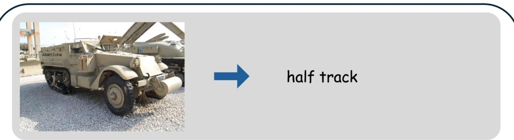

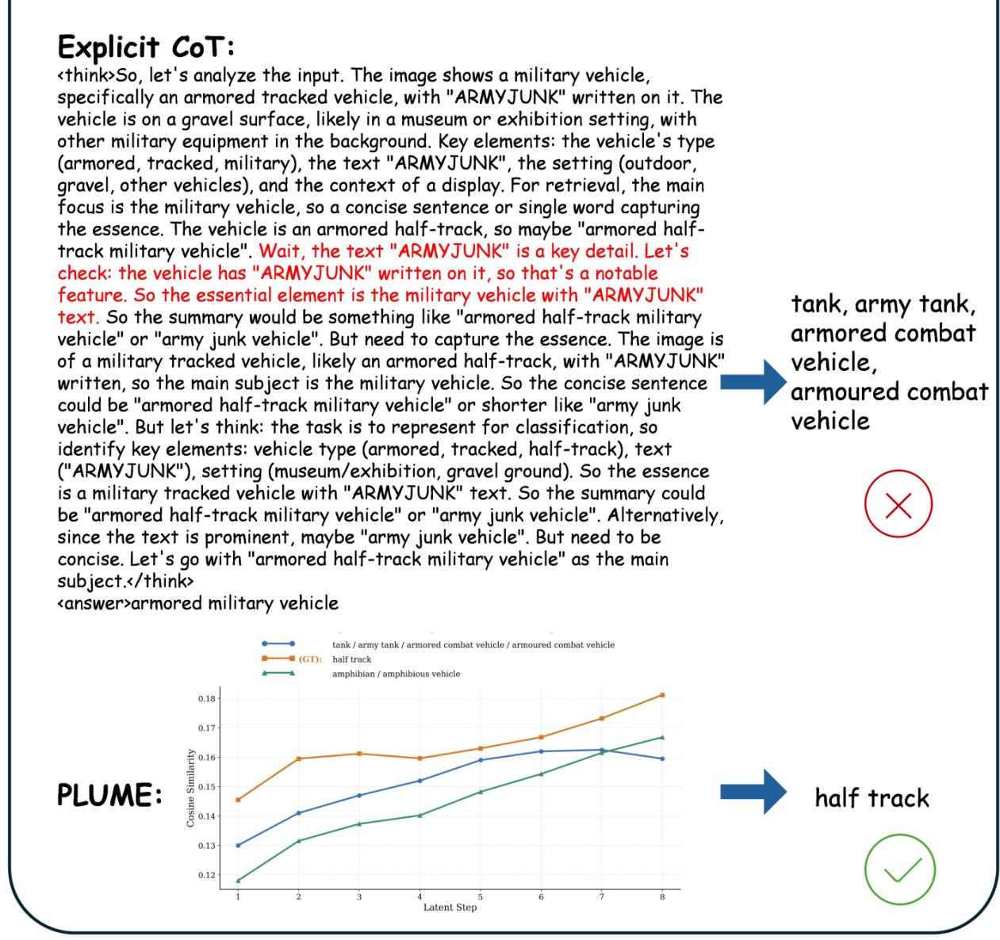  
after latent rollout.

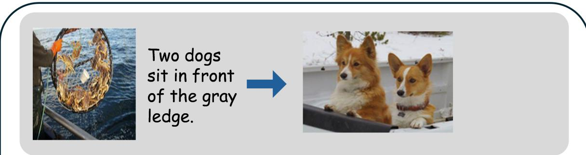

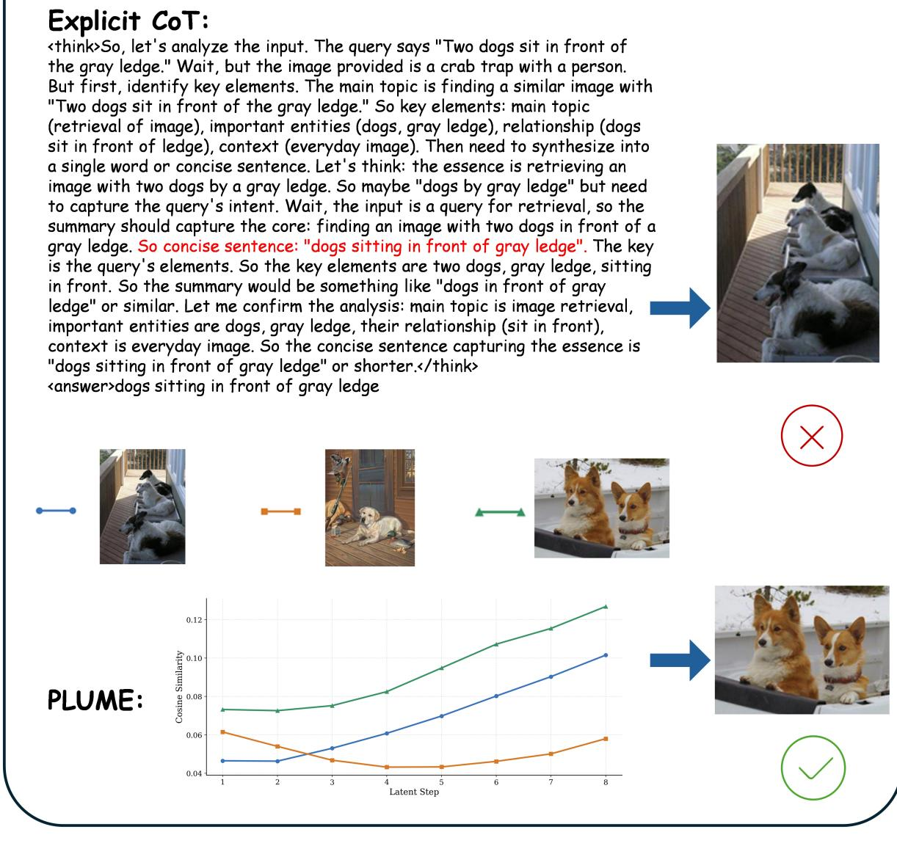  
h pl-e valn  v

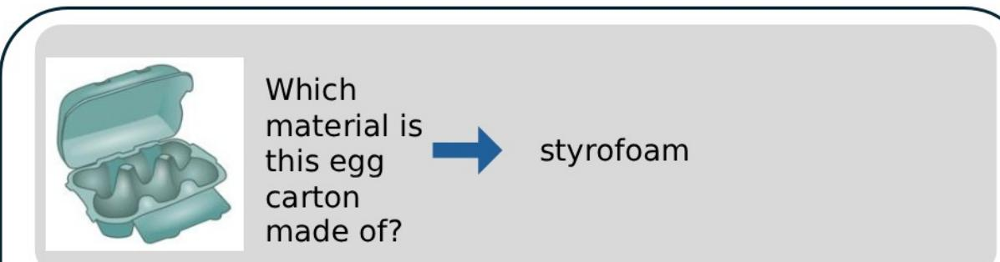

# Explicit CoT:

<think $\mathtt { > } \mathtt { S o }$ , let's analyze the input. The question is asking about the material of   
the egg carton in the image. The image shows a light blue (teal) egg carton,   
which typically has a cardboard or paperboard material. Let's check the key   
elements: the egg carton is the main object, the question is about its material.   
So the type of carton is cardboard, common for egg cartons. The synthesis   
should capture the material, so "cardboard" or "paperboard" would be the   
material. Wait, the input's image is a light blue (teal) egg carton, which is   
usually made of cardboard. So the answer would be the material. Let's   
confirm: egg cartons are often made of cardboard, so the material is cardboard cardboard (or paperboard, but commonly cardboard). So the summary should   
be the material.</think>   
<answer>cardboard

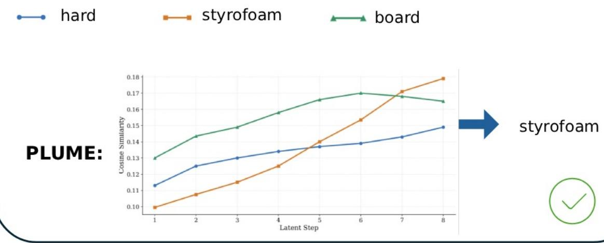  
rollout.

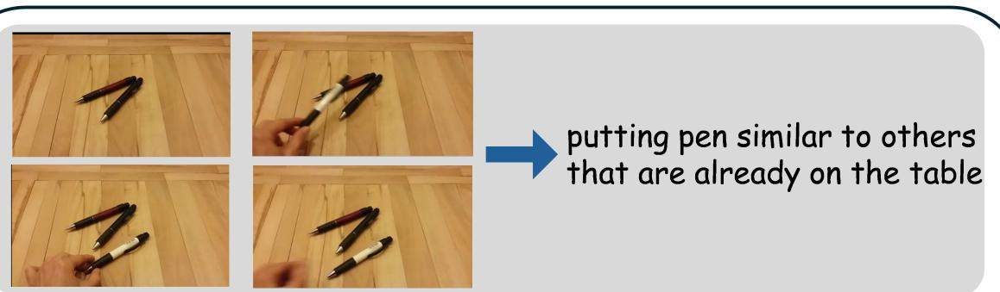

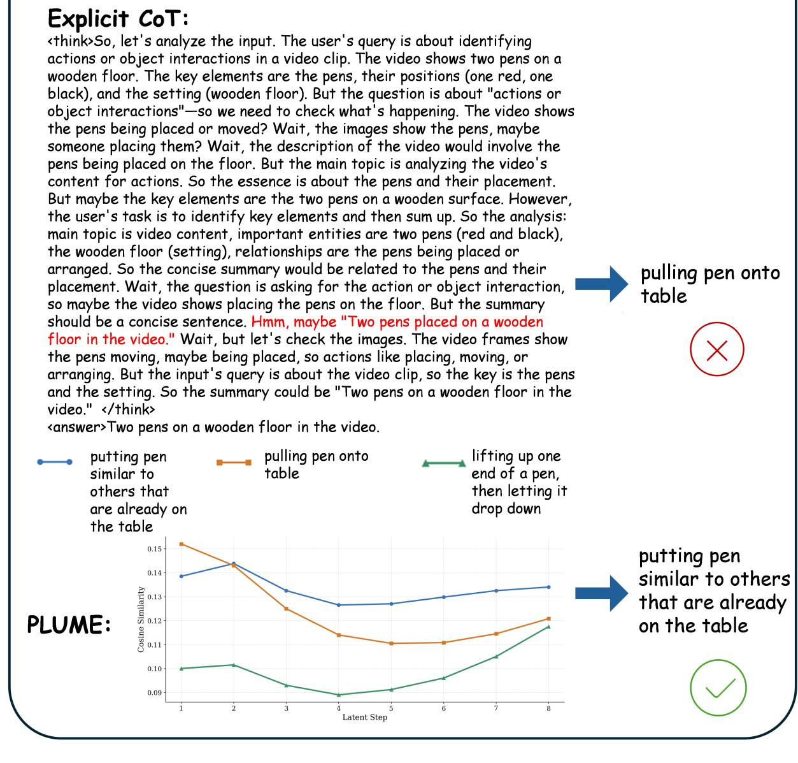  
putting pen similar to others that are already on the table after latent rollout.