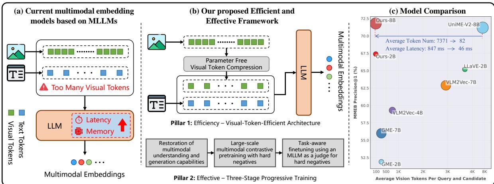
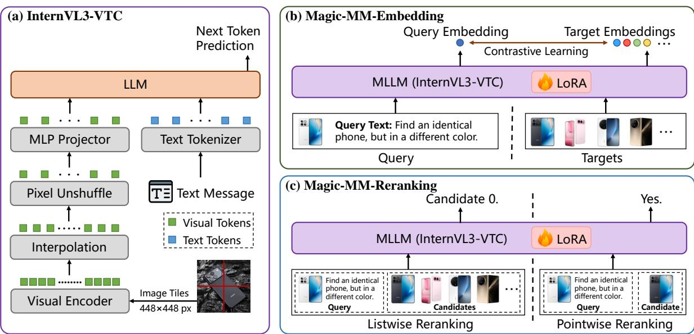

# Magic-MM-Embedding: Towards Visual-Token-Efficient Universal Multimodal Embedding with MLLMs

Qi Li Yanzhe Zhao Yongxin Zhou Yameng Wang Yandong Yang Yuanjia Zhou Jue Wang Zuojian Wang Jinxiang Liu\* Honor Device Co., Ltd

# Abstract

Multimodal Large Language Models (MLLMs) have shown immense promise in universal multimodal retrieval, which aims to find relevant items of various modalities for a given query. But their practical application is often hindered by the substantial computational cost incurred from processing a large number of tokens from visual inputs. In this paper, we propose Magic-MM-Embedding, a series of novel models that achieve both high efficiency and state-of-the-art performance in universal multimodal embedding. Our approach is built on two synergistic pillars: (1) a highly efficient MLLM architecture incorporating visual token compression to drastically reduce inference latency and memory footprint, and (2) a multi-stage progressive training strategy designed to not only recover but significantly boost performance. This coarseto-fine training paradigm begins with extensive continue pretraining to restore multimodal understanding and generation capabilities, progresses to large-scale contrastive pretraining and hard negative mining to enhance discriminative power, and culminates in a task-aware fine-tuning stage guided by an MLLM-as-a-Judge for precise data curation. Comprehensive experiments show that our model outperforms existing methods by a large margin while being more inference-efficient.

  
Figure 1Breaking the eficiency-performance trade-off for MLLM embedders for universal multimodal retrieval. (a) Standard MLLM-based embedders suffer from high computational costs due to processing redundant, dense visual token sequences. b) We propose a visual token compression model paired with a robust three-stage progressive training strategy. (c) Comparisons on MMEB [35] demonstrate that our approach establishes a new k .

# 1 Introduction

Multimodal embedding models are designed to project heterogeneous data modalities, such as text, images, and inteleave image-text data into anif semnicspace.Thesemodels are widely appli across varous domains, such as multimodal search [86, 99, 18, 62], recommendation systems [98, 20], and retrieval-augmented generation [92, 31, 63]. Recently, the feld has recently witnessed a significant paradig shit, moving beyond the dual-tower architectures such as CLIP [74] and UnilR [86], towards Multimodal Large Language Models (MLLMs) [1, 44] with stronger multimodal understanding capabilities. This transition s driven by the intrinsic limitations o dual-towerrameworks: (1) modal-independent encodin ahitecurewithfeature postusin whic lacks deecross-modl iteacin, mits theabiliy  peor fingrainedmultimodal reasoning [35, 34, 2]. (2) limited language understanding ability, where rigid context costraints andimited prir nowleerestric theunderstandin complex semantis [97, 5, 95]. In cras, MLLM-basmethos etvisualau scetokens ps jointy i text niranm. Thi facilitatesdeeptoken-evelcros-modal fsionratherthanhalow lobalmentLeveraginthesg, along with the extensive world knowledge and robust instruction-following capabilities of LLMs, these models can perform complex multimodal retrieval in diverse scenarios. Building upon these advantages, recent research has rapidly advanced MLLM-based universal multimodal embeding approaches through enhancement o data scaleand quality [102, 106, 33, 49], gradient amplifiation arnegaives [41, 9, ], renement of har negativemin strategies [1, 22, 80, 3, 49], expert olege ditillatio [2, ], ultae rressi rai [9, 2, , 9], rati hinkn d eot learning [108, 42, 11], and coordination with reranker during inference [59, 23, 49]. However, thesedvancements overlook critial bottleneckthe prohibitive cost oflongvisual tokensequences. Standard MLLM architectures typically adopt a full-sequence integration strategy, where the dense stream o patke u  Visr 6s  t  oe.Fo e widely-used LLaVA-1.5 [56] partitions a standard $3 3 6 \times 3 3 6$ image into 576 visual tokens, all of which are directly injected into the language model.While this full-sequence injection benefits fine-grained generation tasks like OCR isu an il tkesethe iext te tog  ke.Thiat an: the computational cost processingtheseredundant visual tokensscale qadratica with he equenceenh, while their contribution to the semantic quality of the final embeddings is often marginal. Consequently, this inncycts  priay barrerdeployiMLLM-basber largescaleatey-crial a systems.

To address this challenge of computational inefficiency while delivering high performance, we propose a novel framework that yneristicaly bne rhitecturaleciywuratetrai rateyrchteuraly, we adopt a parameter-free spatial interpolation module which projects the long visual sequence into a compressed form, reducing the token overhead by $7 5 \%$ while avoiding the optimization difficulties of learnable abstractors [46, 6]. To mitigate any potential performance degradation from aggressive compression and learn iaveretatns  prit wreaa pe Multimodal Foundational Capability Restoration. We begin with generative continue training on general mutdal insructdatasets This stag ealigs he cpress sal atue with he LM, ensur the preservation of foundational multimodal understanding and generation abilities. (2) Multimodal Contrastive Pretraining. We construct a general embedder using 16M multimodal samples with contrastive training. This stageaims to cultivate robust general representation capabilities by evolvingfrom acontrastive warm-up to a se-refinement phase with retrieval-based hard negativemining. (3) Task-aware Finetuning. We reine the odel oncurate high-qualiy muli-task datase throuh aretriveand-curatestrateyUsing the previous tage's model, we retrieve candidates for each query of the training set and leverage an MLLM as a Judge to construct halargativThecra se henival agnsval final embedding model to handle diverse and complex scenarios. Through extensive experiments, our approach ealihe e ae-he-arv aumae [35] nd salt 1] valasksy, this superior perormance is achieve with remarkable token efciency, with only a quarter of the visual tokens, validatinghe powe ur o-esecoresion andtrainsraty.Ourma contrbutions ares w: • We propose a novel framework that successfully reconciles efficiency and performance for MLLM-based universal embedding. We demonstrate that a model with aggressive visual token compression can significantly outperform its non-compressed counterparts when supported by a dedicated, advanced training pipeline.

  
Figure:Overview the proposed visual-token-cient architecture orniversalmultimodal retrieval.) The proposed MLLM architecture with Visual Token Compression, InternVL3-VTC. (b, c) The proposed inferenceefficient, universal multimodal embedder and reranker, both of which are built upon InternVL3-VTC.

We introducea coarse-to-fine trainigstrategy specifically designed or compress MLLMs. This pipelie provides  systemati and efective methodologyorrestorin oundational abilis, buildingrobust discriminatve power, and achieving strong multi-task generalization with curated data from MLLM-as-a-Judge. Trog extensiv experments, wedemonstrate hat ur propos model establishes new stat-heart esul, valatiheprriy urhoiscceatmol tha bo cuataly f highly effective.

# 2 Related Work

Multimodal representation learning was first popularized by the CLIP-style models [74, 32, 57, 47, 96, 46,10, 7, 97]. These models adopt an imagetext dual encoder architecture and therefore only support bidirectional textimage retrieval. Building on this, methods such as UniR [86] and MagicLens [99] fuse features from the two towers, extending the model input from a single modality to interleaved imagetext content. However, these mes esetially lo laeus prdigm:they frs ne e mdaliy idependenty nd then u the representations, which limits their ability to capture fine grained cross modal relationships [35, 34, 22]. In adition, these models use BERT-style [14] text encoders, which lack suffcient real-world knowledge and have strict input length limitations, leading to suboptimal results in complex text understanding [97, 5, 95].

Compared to CLIP-style backbones, MLLMs [1, 107, 44] natively support interleaved text and image inputs and exhibit strongermultimodal understanding and instruction followingcapabilities Beneftin from the rapd progress of MLLMs, multimodal embedding paradigms based on MLLMs have quickly emerged. E5-V [34] trains the language component of MLLMs in a text to text fashion, enabling zero shot multimodal retrieval. Howevruheacraini aralulalcnrasivat bliyhan multimodal retrieval tasks remains limited. VLM2Vec [35] introduces MMEB, the first comprehensive multitask multimodal embedding training and evaluation benchmark. VLM2Vec brings MLLMs into a contrastive learnamework, leveraging the instrucion-followingand multimodal reasoning capabilits.By tain o the ME raini it hieve trong multi-ask eealizatin cros  wideanetrival tasks. T further improve discriminative capability, subsequent work systematically conducted extensive optimizations, ind prvi data scaleand qualiy [10, 106, 33, 49], amplifyn radients n hard negatives [41, 89, ], refining hard negative mining strategies [51, 22, 80, 33, 49], distiing expert knowledge [22, 23], adopting mul-stag progressive training [59, 22, 33, 49], introducig thinking and reinorcement learning [108, 42, 11], and coordinating with reranker during inference [59, 23, 49]. With these community efforts, the discriminative power of MLLM based multimodal embedding models has been significantly improved. However, because these models directly adopt the general-purpose MLLMs architecture, the ssues of high inference cost [100, 90, 15] caused by visual token redundancy have not yet received attention or solutions.

# 3 Methodology

Our objective is to develop a highly efficient and effective MLLM-based universal multimodal embedding model for retrieval. The overview of the proposed architecture is shown in Figure . We begin by formally deinin theuniversal multimodal retrieval task before detailing our proposed framework, including our architectural modifications and progressive training pipeline.

# 3.1 Preliminaries

We formulate the learning of universal multimodal embedding as a unified mapping function within a shared semantic space. Let $\mathcal { X }$ rn al $x \in \mathcal { X }$ w v s   qy $q$ or a candidate $c$ , is composed of task instructions, visual context, and textual context. The corresponding input templates for queries and candidates are as follows, and the taskinstructions for different datasets are hown in Tables 11 and 12.

<table><tr><td>Query Template:</td><td>I Candidate Template:</td></tr><tr><td>Instruct: {query instruction}</td><td>I Instruct: {target instruction} I</td></tr><tr><td>&lt;image&gt;</td><td>I &lt;image&gt;</td></tr><tr><td></td><td>I Text: {target text}</td></tr><tr><td>Query: {query text}</td><td>I</td></tr></table>

To obtain multimodal embeddings, we employ an MLLM with visual token compression as the encoder $f : \mathcal { X } $ $\mathbb { R } ^ { L \times D }$ to map an input $x \in \mathcal { X }$ $\mathbf { h } _ { 1 } , \mathbf { h } _ { 2 } , \ldots , \mathbf { h } _ { L }$ where ech hidden stat $\mathbf { h } _ { i } \in \mathbb { R } ^ { D }$ . We apply $\ell _ { 2 }$ normalization to the hidden representation of the last token, $\mathbf { h } _ { L }$ , to obtain the final embedding $\mathbf { z } _ { x }$ :

$$
\mathbf { z } _ { x } = \frac { \mathbf { h } _ { L } } { \| \mathbf { h } _ { L } \| _ { 2 } } .
$$

To learn  disciminative beding space, we mploy the InfoNCE loss [81] for model trainig For  ive qey $q$ , we define a candidate set $\mathcal { C } _ { q } = \overset { \cdot } { \{ c _ { q } ^ { + } \} } \cup \mathcal { C } _ { q } ^ { - }$ for loss calculation, where $c _ { q } ^ { + }$ denotes the ground-truth positive target associated with $q$ ,and $\mathcal { C } _ { q } ^ { - }$ is the set o negatives. Each $c _ { q } ^ { - } \in \mathcal { C } _ { q } ^ { - }$ represents a negative sampleobtained via in-batch sampling or hard negative minng. The model is trained to maximize the semantic alignment between query and the positive target while suppressing the negatives, by minimizing the following objective:

$$
\mathcal { L } _ { \mathrm { I n f o N C E } } = - \log \frac { \exp ( \mathbf { z } _ { q } ^ { \top } \mathbf { z } _ { c _ { q } ^ { + } } / \tau ) } { \exp ( \mathbf { z } _ { q } ^ { \top } \mathbf { z } _ { c _ { q } ^ { + } } / \tau ) + \sum _ { c _ { q } ^ { - } \in \mathcal { C } _ { q } ^ { - } } \exp ( \mathbf { z } _ { q } ^ { \top } \mathbf { z } _ { c _ { q } ^ { - } } / \tau ) } ,
$$

where $\tau$ is the temperature, and $( \cdot ) ^ { \top } ( \cdot )$ denotes the dot product similarity.

# 3.2 Parameter-free Visual Token Compression

Standard MLLM Paradigm. Let $\mathcal { T }$ denote the space of input images. Standard MLLMs typically rely on a visual encoder, $e _ { v } : \mathcal { T }  \mathbb { R } ^ { H \times \widetilde { W } \times C }$ $\mathbf { I } \in \mathcal { Z }$ Th ncode c  l ft eatre map $\mathbf { F } \in \mathbb { R } ^ { H \times W \times C }$ where $H \times W$ $C$ is on. In conventional approaches, $\mathbf { F }$ is flattened into a sequence of $N = H \times W$ tokens and projected into the LLM input spcnector. However, te lonvisual token equenitroduc sniicant cpuatinal bott due to the quadratic complexity of the LLM attention mechanism. Visual TokenCompression vi InterpolationT alleviatethis oken overload"weintroduce  parameerree visual compression module inserted between the visual encoder and the connector. Unlike complex learned compression schemes, we employ a direct bilinear interpolation strategy[44, 103] on the spatial dimensions $\mathbf { F } \in \mathbb { R } ^ { H \times W \times C }$ te ial de,  ppy bilinear downsampling operation $\Phi ( \cdot )$ to reduce the spatial resolution by a factor of $s$ . The compressed feature map $\mathbf { F ^ { \prime } }$ is computed as:

$$
\mathbf { F } ^ { \prime } = \Phi ( \mathbf { F } ; H ^ { \prime } , W ^ { \prime } ) \in \mathbb { R } ^ { H ^ { \prime } \times W ^ { \prime } \times C } ,
$$

where the target spatial dimensions are $H ^ { \prime } = H / s$ and $W ^ { \prime } = W / s$ . The compressed map $\mathbf { F ^ { \prime } }$ is then flattened into a visual token sequence and fed into the connector for projection. This operation reduces the total number of visual tokens from $N$ to $N / s ^ { 2 }$ while preserving the spatial layout a sannteriy the mag By reduci the equ le qadaticy ber  ners he LL, w significantly lower both inference latency and memory consumption without introducing any parameters.

# 3.3 Progressive Coarse-to-Fine Training Pipeline

Whileour model architecture significantly improves efficiency with reduced visual tokens, directly training this copressemode wistandarcntrastivjecivea ead boptimalpeorancduethe ude inaisrn potentl orati Tveehis wedesartoeprev traing pipeline comprisig thre distinc stagesGenerativRestoration, Contrastiv retraining, and Task-Aware Refinement. Stage 1: Multimodal Foundational Capability Restoration. The introduction of the interpolation module alter the spatialructure nd densiy isualeature that he pretrained LLM backboneexpecs.Therre the primary oal of the first stage is not retrieval, but alignment. To this end, we re-align compressed visual representations with the LLM semantic space. Through generative training on general-purpose multimodal instruction-followigdatasets, we restorefundamentalmultimodalunderstanding and generationcapabilits. For the textual response token sequence $y _ { 1 } , y _ { 2 } , \dotsc , y _ { T }$ , the model is optimized using the standard auto-regressive Next Token Prediction (NTP) loss:

$$
\mathcal { L } _ { \mathrm { N T P } } = - \sum _ { t = 1 } ^ { T } \log P ( y _ { t } | y _ { < t } , x ) ,
$$

where $y _ { t }$ is the ground-truth next token, and $x \in \mathcal { X }$ denotes the multimodal input consisting of visual and textual context. This ste i vital to bridge the istribution gap caused by tokencompression, ensuring the LLMai its reasoning capabilities before transitioning to embedding learning.

Stage 2: Multimodal Contrastive Pretraining. With the multimodal foundational ability restored, we pivot the model towards multimodal representation learning This stage operates on a large-scalemultimodal retrieval corpus and proeds in two steps o progressively ncrease diffculty. We frst warm-up the model by ti with standard InfoNCE loss with in-batch negatives as Equation (2). Subsequently, to encourage the model to lear erain sticions, wentroducGlobal Hard NegativMining rategyinject har negative in the training set and conduct a new round of training.Unlike the warm-up phase, which uses random in-batch negatives, for each sub-dataset, we mineinormative negatives or every query from all candidates in thene dataset. Specifically, for each query $q$ , we retrieve a ranked list of candidates. We exclude the ground-truth positive $c _ { g } ^ { + }$   
lis, which helps avoid falsenegatives that ae common in top-anked results (.g Top-10), while keeping the negatives more challenging than random batch negatives.

Stage 3: Task-Aware Finetuning with an MLLM as a Judge. The final stage focuses on enhance the model for handle diverse scenarios and complex tasksStandard trainindatasets often sufer rom alse negatives"and lack sufienty chalengin negatives.To resolve this we further employ an expert MLLM as a juge to peror data curation and generate high-fidelity hard negatives. Concretely, for each query $q$ in the target training set, we perform a "retrieve-and-judge" process. We first utilize our model from stage 2 to retrieve the top- $K$ $K = 2 0$ candidates $\mathcal { C } _ { \mathrm { r e t } }$ .We feed each pair $( q , c _ { i } )$ , where $c _ { i } \in \mathcal { C } _ { \mathrm { r e t } }$ , into Qwen3-VL [1] with following judgment template to assess their relevance. The judgment instructions used for each dataset are presented in Table 13. {Judgment Instruction} Query: {query} Target: {target}   
Please make your judgment. If relevant, output 'yes'. If irrelevant, output 'no'. You are only allowed to output 'yes' or 'no'. Please output strictly according to the requirements.

We then examine the output logits of the ' yes' and ${ \mathfrak { c } } _ { \mathtt { n 0 } } ,$ tokens to determine relevance. If $\log \mathrm { i t } ( \mathbf { y } \mathbf { e } \mathbf { s } ) > \log \mathrm { i t } ( \mathbf { n } \mathbf { o } )$ , the candidate is deeme relevant.This helps u discover previously unlabeled true positives, thereby expani the positive set beyond the original ground-truth positives; If $\mathrm { l o g i t } ( \mathbf { n } \mathbf { 0 } ) > \mathrm { l o g i t } ( \mathbf { y } \mathbf { e } \mathbf { s } )$ , the candidate is deemed h  h. For constrastive loss calculation, we keep the original ground-truth $c _ { q } ^ { + }$ as the only positive to preserve consistency. The negative sample set $\mathcal { C } _ { q } ^ { - }$ is augmented with judge-identified hard negatives, which serve as challenging distractors and force the model to distinguish more confusing samples.

# 3.4 Synergistic Reranker

To construct a comprehensive retrieval system following previous works [59, 23], we train a reranker based on the mdelrom stage toleverage its preserved multimodal understanding and generation capabilities. Thanks to the filiy  MLM modes, we mploy  jot rairay hat cmi pintis and ltwis ai jeive.Cruciallynlikestandar apprces that y soeythergialdatase labels,ur era trained on the judge-ct aquery $q$ dgeene thd $\mathcal { C } _ { \mathrm { a u g } } ^ { + } = \{ c _ { q } ^ { + } \} \cup \mathcal { C } _ { \mathrm { j u d g e } } ^ { + ^ { - } }$ $c _ { q } ^ { + }$ true positives $\mathcal { C } _ { \mathrm { j u d g e } } ^ { + }$ Similarly, the negative et $\mathcal { C } _ { \mathrm { j u d g e } } ^ { - }$ c. For pointwise reranking formulation, the model evaluates query-candidate pairs independently. We construct $c ^ { + } \in \mathcal { C } _ { \mathrm { a u g } } ^ { + }$ $c ^ { - } \in \mathcal { C } _ { \mathrm { j u d g e } } ^ { - }$ WWe iinstruct the model, using the following template, to output the token $\cos \cdot$ for positive pairs and $^ { \mathfrak { c } } \mathrm { N o } ^ { \mathfrak { s } }$ for negative pairs. I will provide you with a query and a candidate. Please evaluate whether the candidate meets the requirements of the query. If it does, respond with 'Yes'; if it doesn't, respnd with 'No'. Query: {query} Candidate: {target} The pointwise loss is minimized using standard Cross Entropy (CE) loss:

$$
\mathcal { L } _ { \mathrm { p o i n t } } = \mathcal { L } _ { \mathrm { C E } } ( \Upsilon \mathbf { e s } , r ( q , c ^ { + } ) ) + \mathcal { L } _ { \mathrm { C E } } ( \mathbb { N } \mathbf { o } , r ( q , c ^ { - } ) ) ,
$$

where $r ( \cdot )$ represents the autoregressive output process of the reranker. $M$ hard negatives $c _ { 1 } ^ { - } , \ldots , c _ { M } ^ { - }$ from $\mathcal { C } _ { \mathrm { j u d g e } } ^ { - }$ (where $M \in [ 2 , 5 ] ,$ $c ^ { + }$ $\mathcal { C } _ { \mathrm { a u g } } ^ { + }$ We randomly insert $c ^ { + }$ into the list at position $k$ and prompt the model to identify the most relevant candidate. The input template for listwise reranking is as follows: I will provide you with a query followed by multiple candidates in the format: (1) cand1 (2) cand2, et.Each candidate is independent of the others. Evaluate each candidate against the query, and respond with the number corresponding to the candidate that best meets the requirements of the query. Query: {query} Candidates: {candidate set} The model is trained to directly generate the position index $k$ of the positive candidate. The listwise loss is formulated as:

$$
\mathcal { L } _ { \mathrm { l i s t } } = \mathcal { L } _ { \mathrm { C E } } ( k , r ( q , c _ { 1 } ^ { - } , \ldots , c ^ { + } , \ldots , c _ { M } ^ { - } ) )
$$

The final objective is a weighted sum of both tasks: ${ \mathcal { L } } _ { \mathrm { t o t a l } } = { \mathcal { L } } _ { \mathrm { p o i n t } } + { \mathcal { L } } _ { \mathrm { l i s t } }$

# 4 Dataset Construction

Stage 1. In this stage, to restore the multimodal understanding and generation abilities of the token compression model, we construct a multimodal instruction-following dataset containing 32M examples. This corpus is composed of both open-source and in-house data, covering a wide range of task types, including multimodal and text-only instruction data, captioning, grounding and classification.A detailed breakdown of thedataset composition is provided in Table 1. We perform rule-based deduplication and standardize all annotations into a unified format. Sta . In thisstage, to adapt he model tomultialereentatio earigan strengthe t discave power, we construct a multimodal retrieval dataset comprising M samples. The dataset consists of the folowin three categories of data: Single-Modal: Includes both Text-to-Text $\mathrm { T } {  } \mathrm { T }$ and Image-to-Image $( \mathrm { I } {  } \mathrm { I } )$ pairs. Cross-Modal: The query or candidate is unimodal, and the querycandidate pair spans different modalities, such as Text-to-Image retrieval $( \mathrm { T } \to \mathrm { I } )$ or Text-to-Visual-Document retrieval $\mathrm { ( T \to V D ) }$ . TabDetheatstoltldestandinai pabili1   

<table><tr><td>Task</td><td>#Samples</td><td>Datasets</td></tr><tr><td>Multimodal Instruction Data</td><td>12.8M</td><td>Infinity-MM [21], Bunny-v1.1 [25], VLFeedback [48], RLHF-V [93], RLAIF-V [94], DT-VQA [101], LLaVA Visual Instruct 150K [56], Monkey [50], LVIS-Instruct4V [83], LRV-Instruction [54]</td></tr><tr><td>Pure Text Instruction Data</td><td>8.8M</td><td>Infinity Instruct [45], ShareGPT-Chinese-English-90k [77], firefly-train-1.1M [91], COIG-CQIA [2]</td></tr><tr><td>Captioning</td><td>1.7M</td><td>ShareGPT4V [9], In-house RefCOCO [36], RefCOCO+ [36], RefCOCOg [66], Objects365 v2 [76],</td></tr><tr><td>Grounding</td><td>5.7M</td><td>Visual Genome [38], gRefCOCO [53], Open Images V6 [39], V3Det [82], In-house</td></tr><tr><td>Classification</td><td>2.8M</td><td>In-house</td></tr></table>

•Fused-Modal: The query and/or candidate contains both image and text. For example, in the MegaPairs datt [106], the ue s s  n ge nd extlsn andhe tar is a el this mixed image-text query (Image-Text-to-Image, $\mathrm { I T \to I } \setminus$ . The training data are sampled from MegaPairs [106], Colpali train set [18], VisRAG [92], Docmatix [43], BAAI-MTP [4], ImageNet-1K [13], BLIP Bootstrapped Image-Text Pairs [47], MMEB-train [35], and mmE5- synthetic [8]. A more detailed composition of the stage 2 training data is presented in Table 2. TaDeil   i al ei a ar d these datasets all come from MMEB-train [35].   

<table><tr><td>Class</td><td>Task</td><td>#Samples</td><td>Datasets</td></tr><tr><td rowspan="2">Single-Modal</td><td>T→T (1)</td><td>1M</td><td>BAAI-MTP [4]</td></tr><tr><td>I→I (2)</td><td>1.3M</td><td>ImageNet-1K [13], NIGHTS* [19]</td></tr><tr><td rowspan="3">Cross-Modal</td><td>T→I (5)</td><td>5.3M</td><td>VisualNews* [55], MSCOCO* [52], mmE5-synthetic [8], VisDial* [12], BLIP Bootstrapped Image-Text Pairs [47]</td></tr><tr><td>T→VD (3)</td><td>1.6M</td><td>Docmatix [43], Colpali train set [18], VisRAG [92]</td></tr><tr><td>I→T (7)</td><td>0.5M</td><td>ImageNet-1K* [13], HatefulMemes* [37], VOC2007* [17], SUN397* [88], VisualNews* [55], MSCOCO* [52], mmE5-synthetic [8]</td></tr><tr><td rowspan="4">Fused-Modal</td><td>IT→I (5)</td><td>5.3M</td><td>MegaPairs [106], mmE5-synthetic [8], CIRR* [60], N24News* [85], MSCOCO* [52]</td></tr><tr><td>IT→T (8)</td><td>1.6M</td><td>Docmatix [43], mmE5-synthetic [8], OK-VQA* [67], A-OKVQA* [75], DocVQA* [70], InfographicVQA* [69], ChartQA* [68], Visual7W* [109]</td></tr><tr><td>T→IT (2)</td><td>3.2K</td><td>WebQA* [7], mmE5-synthetic [8]</td></tr><tr><td>IT→IT (1)</td><td>3.1K</td><td>mmE5-synthetic [8]</td></tr></table>

Seanv a cotaining 1.5M high-quality, multi-task samples.These data are designed for bothimage-based vision tasks and visual document retrieval tasks. For the image-based vision tasks, we use MMEB-train [35] as the training set, whileor thevisul ocuet trival tasks, e dopt he Colpali trai t [18] and VisRAG [92] as ai ata.

# 5 Experiments

# 5.1 Evaluation Setup & Benchmarks.

We first evaluate the performance of Magic-MM-Embedding on natural image retrieval and visual document retrieval tasks. For natural image retrieval, we use MMEB [35], a comprehensive benchmark comprising 36 sub-datasets and 4 meta-tasks, to assess and report Precision $@ 1$ . For visual document retrieval (VisDoc), we follow the VLM2Vec-V2 [71] settings and use ViDoRe v1 (VDRv1) [18], ViDoRe v2 (VDRv2) [65], VisRAG (VR) [92], and ViDoSeek [84]+MMLongBench-Doc (OOD) [64] to evaluate and report NDCG $\textcircled { a } 5$ To assess the performance of Magic-MM-Embedding on cross-modal retrieval, following the UniME-V2 settngs [23], we further conduct evaluations on Flickr30K [73], MSCOCO [52], ShareGPT4V [9], Urban1K [97], and SugarCrepe [28] and report Precision $@ 1$ . Table : Results on the MMEB benchmark [35]. The scores are averaged per meta-task. The best performance in each block is in bold. "E" refers to the single-stage retrieval performance using only embedder; $" E + R "$ refers to tsal at ranking from the reranker.   

<table><tr><td rowspan="2">Model</td><td rowspan="2">Backbone (Model Size)</td><td colspan="4">Per Meta-Task Score</td><td colspan="3">Average Score</td></tr><tr><td>Classification</td><td>VQA</td><td>Retrieval</td><td>Grounding</td><td>IND</td><td>OOD</td><td>Overall</td></tr><tr><td># of datasets →</td><td></td><td>10</td><td>10</td><td>12</td><td>4</td><td>20</td><td>16</td><td>36</td></tr><tr><td colspan="9">Zero-shot Results</td></tr><tr><td>CLIP [74]</td><td>-(0.4B)</td><td>42.8</td><td>9.1</td><td>53.0</td><td>51.8</td><td>37.1</td><td>38.7</td><td>37.8</td></tr><tr><td>SigLIP [96]</td><td>-(0.9B)</td><td>40.3</td><td>8.4</td><td>31.6</td><td>59.5</td><td>32.3</td><td>38.0</td><td>34.8</td></tr><tr><td>EVA-CLIP [79]</td><td>-(8.1B)</td><td>56.0</td><td>10.4</td><td>49.2</td><td>58.9</td><td>38.1</td><td>45.6</td><td>43.7</td></tr><tr><td>MagicLens [99]</td><td>-(0.4B)</td><td>38.8</td><td>8.3</td><td>35.4</td><td>26.0</td><td>31.0</td><td>23.7</td><td>27.8</td></tr><tr><td>E5-V [34] E5-V [34]</td><td>Phi3.5-V (4.2B) LLaVA-1.6 (8.4B)</td><td>39.1 39.7</td><td>9.6 10.8</td><td>38.0 39.4</td><td>57.6 60.2</td><td>33.1 34.2</td><td>31.9 33.4</td><td>36.1 37.5</td></tr><tr><td colspan="9"></td></tr><tr><td></td><td></td><td>Trained with MMEB</td><td></td><td></td><td></td><td></td><td></td><td></td></tr><tr><td colspan="9">VLM2Vec-V1 [35]</td></tr><tr><td>UniME [22]</td><td>Qwen2VL (2.2B) Phi3.5-V (4.2B)</td><td>59.0 54.8</td><td>49.4 55.9</td><td>65.4 64.5</td><td>73.4 81.8</td><td>66.0 68.2</td><td>52.6 52.7</td><td>59.3 64.2</td></tr><tr><td>LLaVE [41]</td><td>Aquila-VL (2.0B)</td><td>62.1</td><td>60.2</td><td>65.2</td><td>84.9</td><td>69.4</td><td>59.8</td><td>65.2</td></tr><tr><td>UniME-V2 (E) [23]</td><td>Qwen2VL (2.2B)</td><td>62.1</td><td>56.3</td><td>68.0</td><td>72.7</td><td>67.4</td><td>58.9</td><td>63.6</td></tr><tr><td>UniME-V2 (E+) [23]</td><td>Qwen2VL (2.2B)</td><td>64.1</td><td>64.3</td><td>71.6</td><td>70.6</td><td>69.8</td><td>64.3</td><td>67.4</td></tr><tr><td>Magic-MM-Embedding (E)</td><td>InternVL3-VTC (1.9B)</td><td>60.9</td><td>63.3</td><td>72.2</td><td>84.6</td><td>74.7</td><td>59.5</td><td>68.0</td></tr><tr><td>Magic-MM-Embedding (E+R)</td><td>InternVL3-VTC (1.9B)</td><td>61.3</td><td>67.2</td><td>73.5</td><td>89.8</td><td>75.2</td><td>63.9</td><td>70.2</td></tr><tr><td>VLM2Vec-V1 [35]</td><td>Qwen2VL (8.3B</td><td>62.6</td><td>57.8</td><td>69.9</td><td>81.7</td><td>65.2</td><td>556.3</td><td>65.8</td></tr><tr><td>UniME [22]</td><td>LLaVA-OV (8.0B)</td><td>66.8</td><td>66.6</td><td>70.5</td><td>90.9</td><td>74.6</td><td>65.8</td><td>70.7</td></tr><tr><td>LLaVE [41]</td><td>LLaVA-OV (8.0B)</td><td>65.7</td><td>65.4</td><td>70.9</td><td>91.9</td><td>75.0</td><td>64.4</td><td>70.3</td></tr><tr><td>QQMM [89]</td><td>LLaVA-OV (8.0B)</td><td>66.8</td><td>66.8</td><td>70.5</td><td>90.4</td><td>74.7</td><td>65.6</td><td>70.7</td></tr><tr><td>UniME-V2 [23]</td><td>LLaVA-OV (8.0B)</td><td>65.3</td><td>67.6</td><td>72.9</td><td>90.2</td><td>74.8</td><td>66.7</td><td>71.2</td></tr><tr><td>UniME-V2 (E) [23]</td><td>Qwen2VL (8.3B)</td><td>64.0</td><td>60.1</td><td>73.1</td><td>82.8</td><td>72.0</td><td>63.0</td><td>68.0</td></tr><tr><td>UniME-V2 (E+R) [23]</td><td>Qwen2VL (8.3B)</td><td>63.8</td><td>66.3</td><td>73.5</td><td>75.0</td><td>71.7</td><td>65.6</td><td>69.0</td></tr><tr><td>Magic-MM-Embedding (E)</td><td>InternVL3-VTC (8.1B)</td><td>64.8</td><td>68.1</td><td>75.0</td><td>88.7</td><td>78.3</td><td>63.6</td><td>71.8</td></tr><tr><td>Magic-MM-Embedding (E+R)</td><td>InternVL3-VTC (8.1B)</td><td>64.3</td><td>70.9</td><td>75.7</td><td>90.4</td><td>78.4</td><td>65.9</td><td>72.8</td></tr></table>

# 5.2 Implementation Details

Model Architecture. We implement our framework using PyTorch and the ms-swift [104] library. We adopt InternVL3 [107] as our backbone MLLM and name the proposed Visual Token Compression variant InternVL3- VTC. For our parameter-free spatial compression design, we utilize bilinear interpolation to downsample the visal eatue map by acto    e spatldimnsin, ther etainig y ourt  thea visual tokens. Image Tiling Strategy. For the image tiling strategy, we follow the approach used in InternVL3 [107]. To ensure computational efficiency, however, we reduce the maximum number of image tiles (MAx_NUM) during both traig nd iereSpecically, i stage tai, MAXU s et  .Durig herai an i of downstream embedder and reranker models, we adopt a data-dependent policy: for data containing visual document images, MAX_NUM is set to 4, while for allother natural image data, MAX_UM is uniformly set to 1.

Embedder Implementation. In stage 1, we train the full model parameters on $4 8 \times$ NVIDIA A800 (80GB) GPUs with a learning rate of $1 \times 1 0 ^ { - 5 }$ and a global batch size of 48. We set the gradient accumulation steps to 8 and aply datat packn train the model or 0,0 steps trestor  generativ apabily. In stage  n , we perform contrastive pretraining and task-aware fine-tuning using Low-Rank Adaptation (LoRA) on the same $4 8 \times$ NVIDIA A800 (80GB) GPUs. Both stages use a unified maximum learning rate of $2 \times 1 0 ^ { - 4 }$ and a LoRA rank of 16; Detailed hyperparameters are provided in Table 14.For hard negative judging in stage 3, we employ Qwen3-VL-7B [49] as the discriminator and insert 12 hard negative samples per training instance. Reranker Implementation. The reranker is initalized from the stage  checkpoint. We train it using the same jucrat datafromstageanganize atant pontis nd istwiraThemodes rai $2 4 \times$ NVIDIA A800 (80GB) GPUs with a learning rate of $4 \times 1 0 ^ { - 5 }$ and batchsize per device is set to 16 and 12 for 8 and 2B models separately. The model is trained for 2 epochs. The loss weights are set to 1 for both pointwie and listwisebjectives. Duringiference, The eranker isutilized tobtain the two-stage rerieval results, by frst usingthe beder toretrievcandidate , followed byafnal rankingfromhereranker with pointwie reranking from the Top-5 results from the embedder. Tabl : Results on the VisDoc [1]. The best perorman in each block is in bol $E ^ { \ast }$ refers to the single-stage retrieval performance using only embedder; $E { + } R ^ { \prime }$ e the embedder to retrieve a candidate set, followed by a final ranking from the reranker.   

<table><tr><td rowspan="2">Model</td><td rowspan="2">Backbone (Model Size)</td><td colspan="5">VisDoc</td></tr><tr><td>VDRv1</td><td>VDRv2</td><td>VR</td><td>OOD</td><td>Overall</td></tr><tr><td># of Datasets →</td><td></td><td>10</td><td>4</td><td>6</td><td>4</td><td>24</td></tr><tr><td>GME [102]</td><td>Qwen2VL (2.2B)</td><td>86.1</td><td>54.0</td><td>82.5</td><td>43.1</td><td>72.7</td></tr><tr><td>ColPali [18]</td><td>Paligemma (2.9B)</td><td>83.6</td><td>52.0</td><td>81.1</td><td>43.1</td><td>71.0</td></tr><tr><td>Ops-MM-embedding-v1 [72]</td><td>Qwen2VL (8.3B)</td><td>80.1</td><td>59.6</td><td>79.3</td><td>43.3</td><td>70.3</td></tr><tr><td>VLM2Vec-V2 [71]</td><td>Qwen2VL (2.2B)</td><td>75.5</td><td>44.9</td><td>79.4</td><td>39.4</td><td>65.4</td></tr><tr><td>Magic-MM-Embedding (E)</td><td>InternVL3-VTC (1.9B)</td><td>83.4</td><td>53.3</td><td>85.6</td><td>42.2</td><td>72.1</td></tr><tr><td>Magic-MM-Embedding (E+R)</td><td>InternVL3-VTC (1.9B)</td><td>84.4</td><td>56.1</td><td>87.4</td><td>41.8</td><td>73.3</td></tr><tr><td>Ops-MM-embedding-v1 [72]</td><td>Qwen2VL (8.3B)</td><td>80.1</td><td>59.6</td><td>79.3</td><td>43.3</td><td>70.3</td></tr><tr><td>GME [102]</td><td>Qwen2VL (8.3B)</td><td>89.4</td><td>55.6</td><td>85.0</td><td>44.4</td><td>75.2</td></tr><tr><td>LamRA-Qwen2 [59]</td><td>Qwen2VL (8.3B)</td><td>22.0</td><td>11.5</td><td>37.4</td><td>21.0</td><td>23.9</td></tr><tr><td>LamRA-Qwen2.5 [59]</td><td>Qwen2.5VL (8.3B)</td><td>56.3</td><td>33.3</td><td>58.2</td><td>40.1</td><td>50.2</td></tr><tr><td>VLM2Vec-V2 [71]</td><td>Qwen2VL (8.3B)</td><td>78.8</td><td>52.6</td><td>82.7</td><td>42.1</td><td>69.3</td></tr><tr><td>Magic-MM-Embedding (E)</td><td>InternVL3-VTC (8.1B)</td><td>86.1</td><td>59.9</td><td>87.6</td><td>43.4</td><td>75.0</td></tr><tr><td>Magic-MM-Embedding (E+R)</td><td>InternVL3-VTC (8.1B)</td><td>86.9</td><td>60.4</td><td>89.2</td><td>43.1</td><td>75.8</td></tr></table>

# 5.3 Experimental Results

Multimodal Retrieval on MMEB. In Table 3, we presents the performance comparison against representative baseline.s theresult showtraditinal dual-towermodels su as CLIPiantly agbehind MLLM-ba approaches, due to the inherent limitation of architecture. Among the MLLM methods, our proposed embedder establishes a new state-of-the-art, surpasses strong baselines like UniME-V2 [23] and QQMM [89], proves that our progressive training strategy successfully overcomes the potential information loss of token compression. Regarding the two-stage retrieval paradigm, both our method and UniME-V2 [23] demonstrate that incorporating arerankerfurther boosts accuracy. However, a direct comparison reveals our consistent superiority: our moel outperforms UniME-V2 in both the standalone embedder setting and the full"Embedder $^ +$ Reranker" setting. This confrms that ourframework provides stronger undational retrieverand a more effectiv overall pipele than the previous best-performing method. Multimodal Retrieval on VisD Beyond general multimodal rtrieval, we evaluate our model on the challenging domain Visual Document Retrieval (VisDoc), a fine-grained task theoretically demanding high-resolutioniputs t preervetextualdetails. In Tabl  wereport e parsion resulSurprisigly uroken-ient achieves state-of-the-art results despite compressing visual features by $7 5 \%$ , challenging the assumption that high redundancy is strictly necessary or fne-graineretrival. Additionally, we observe that GME [102] serves as a formidable baseline, outperforming our standalone embedder; we attribute this to GME's use of massive, proprietary task-aware datasets compared tour smaller, publicly available trainig sources.However, urul "Embedder $^ +$ Reranker" pipeline successfully surpasses GME to establish a new state-of-the-art. This demonstrates using only public data and significantly fewer visual tokens.

Text-Image Cross-Modal Retrieval. Following previous works [23, 59], we further evaluate the text-image cs-oaltrival abiliyu bedimodewihoueranker Base heresultTable datasets, our embedding method consistently delivers new state-of-the-art results. On the 8B scale, our method achieves significant gains even on benchmarks where the strong baseline UniME-V has reached near-saturation levels $9 5 \%$ . Specifically, we improve Precision $@ 1$ on ShareGPT4V (text-to-image) from $9 5 . 1 \%$ to $9 8 . 5 \%$ and on Urban1K (image-to-text) from $9 6 . 7 \%$ to $9 8 . 7 \%$ . The superiority is even more profound at the 2B scale, where our model dominates UniME-V2 on the challenging SugarCrepe benchmark by a massive margin—scoring $9 1 . 6 \%$ , $8 2 . 6 \%$ , and $9 4 . 2 \%$ on its three sub-settings compared to $7 0 . 9 \%$ , $5 1 . 2 \%$ , and $7 0 . 2 \%$ , respectively. Crucially, these results of our method are achieved using only 64 visual tokens, far fewer than other standard methods. Ths epirial ienea  ivoal concusivisal tokecpresi  o rade u advantage.When synergize with our progressive training pipeline, it significantly nhances inference effcncy while simultaneously achieving better crossmodal alignment. Comparison on Inference Cost. We compared the inference efficiency of the proposed Magic-MM-Embeding with the currently popular MLLM-based Embedders, as shown in Table 6. For each MLLM backbone, we selected one embedding model for comparison. We randomly sampled 5,000 queries and candidates from the MMEB and VisDoc training sets. We measured the average inference latency and the average number of visual tokens for queries and candidates on both MMEB and VisDoc. To ensure fairness, we resized the resolution of visual document images to $8 9 6 \times 8 9 6$ and he resolution of natural images to $4 4 8 \times 4 4 8$ All results were obtained using an NVIDIA L20 (48GB) GPU with a batch size of 1 and BF16 precision. No acceleration techniques were used during testing.

Table 5: Cross-modal retrieval results on Flickr30K [73], MSCOCO [52], ShareGPT4V [9], Urban1K [97] and SugarCrepe [28].   

<table><tr><td rowspan="3">Models</td><td rowspan="3">Backbone (Model Size) Flickr30K</td><td colspan="3">Short Caption</td><td colspan="4">Long Caption</td><td colspan="3">Compositional</td></tr><tr><td colspan="2"></td><td colspan="2">MSCOCO</td><td colspan="2">ShareGPT4V</td><td colspan="2">Urban1K</td><td colspan="2">SugarCrepe</td></tr><tr><td>T → II → T T → II → TT</td><td></td><td></td><td></td><td>→ II → T T </td><td></td><td>→ II</td><td></td><td>| → T Replace Swap Add</td><td></td></tr><tr><td>OpenCLIP [74]</td><td>- (0.4B)</td><td>67.3</td><td>87.2</td><td>37.0</td><td>58.1</td><td>81.8</td><td>84.0</td><td>47.0</td><td>47.0</td><td>79.5</td><td>62.7 74.9</td></tr><tr><td>CLIP [10]</td><td>- (2.5B)</td><td>79.5</td><td>92.9</td><td>51.3</td><td>67.3</td><td>90.1</td><td>93.6</td><td>77.8</td><td>80.7</td><td>86.5</td><td>68.9 88.4</td></tr><tr><td>EVA-CLIP [79]</td><td>-(8.1B)</td><td>80.3</td><td>94.5</td><td>52.0</td><td>70.1</td><td>93.1</td><td>91.2</td><td>80.4</td><td>77.8</td><td>85.9</td><td>70.3 86.7</td></tr><tr><td>E5-V [34]</td><td>Phi3.5-V (4.2B)</td><td>72.2</td><td>79.6</td><td>44.7</td><td>53.4</td><td>86.0</td><td>88.5</td><td>83.8</td><td>83.6</td><td>88.2</td><td>66.675.3</td></tr><tr><td>VLM2Vec [35]</td><td>Qwen2-VL (2.2B)</td><td>69.3</td><td>89.6</td><td>40.0</td><td>62.5</td><td>78.1</td><td>88.2</td><td>78.7</td><td>83.9</td><td>67.2</td><td>46.5 66.4</td></tr><tr><td>UniME [22]</td><td>Qwen2-VL (2.2B)</td><td>74.9</td><td>90.6</td><td>44.0</td><td>63.5</td><td>83.6</td><td>88.6</td><td>83.3</td><td>83.2</td><td>65.6</td><td>45.2 65.7</td></tr><tr><td>UniME-V2 [23]</td><td>Qwen2-VL (2.2B)</td><td>79.8</td><td>89.9</td><td>53.7</td><td>65.1</td><td>91.6</td><td>94.2</td><td>95.6</td><td>92.2</td><td>70.9</td><td>51.2 70.2</td></tr><tr><td>Magic-MM-Embedding_InternVL3-VTC (1.9B)</td><td></td><td>84.4</td><td>93.0</td><td>61.4</td><td>75.8</td><td>97.2</td><td>97.3</td><td>98.4</td><td>97.8</td><td>91.6</td><td>82.6 94.2</td></tr><tr><td>E5-V [34]</td><td>LLaVA-1.6 (8.4B)</td><td>77.3</td><td>85.7</td><td>49.1</td><td>57.6</td><td>85.1</td><td>82.1</td><td>88.9</td><td>83.2</td><td>86.3</td><td>68.7 66.9</td></tr><tr><td>VLM2Vec [35]</td><td>Qwen2-VL (8.3B)</td><td>80.0</td><td>94.2</td><td>49.2</td><td>68.5</td><td>78.5</td><td>90.4</td><td>94.0</td><td>94.2</td><td>70.0</td><td>51.7 72.2</td></tr><tr><td>UniME [22]</td><td>Qwen2-VL (8.3B)</td><td>80.8</td><td>92.7</td><td>50.9</td><td>69.8</td><td>86.5</td><td>93.8</td><td>95.3</td><td>94.0</td><td>68.8</td><td>53.0 69.8</td></tr><tr><td>UniME [22]</td><td>LLaVA-OV (8.0B)</td><td>83.3</td><td>94.4</td><td>54.8</td><td>74.0</td><td>93.9</td><td>89.3</td><td>94.3</td><td>95.5</td><td>80.5</td><td>65.5 82.2</td></tr><tr><td>UniME-V2 [23]</td><td>Qwen2-VL (8.3B)</td><td>84.6</td><td>93.5</td><td>57.3</td><td>70.3</td><td>94.3</td><td>95.2</td><td>97.2</td><td>96.3</td><td>77.8</td><td>62.2 79.0</td></tr><tr><td>UniME-V2 [23]</td><td>LLaVA-OV (8.0B)</td><td>85.5</td><td>93.7</td><td>60.9</td><td>74.1</td><td>95.1</td><td>94.1</td><td>96.3</td><td>96.7</td><td>88.6</td><td>73.7 90.5</td></tr><tr><td>Magic-MM-Embedding InternVL3-VTC (8.1B)</td><td></td><td>82.9</td><td>93.1</td><td>63.2</td><td>79.3</td><td>98.5</td><td>98.3</td><td>98.5</td><td>98.7</td><td>92.6</td><td>86.9 95.1</td></tr></table>

Under models with similar parameter scales, Magic-MM-Embedding demonstrated significantly lower inference lateos eisol,hak hestanluciaalcpexiyo y visual token compression. For example, compared to LLaVE-2B based on Aquila-VL, Magic-MM-Embedding-2B reduced the inference latency for MMEB queries from 162.8 ms to $2 9 . 9 ~ \mathrm { m s }$ and for VisDoc candidates from $2 3 3 . 6 \mathrm { m s }$ to $5 7 . 3 ~ \mathrm { m s }$ . We observed that for query inference latency in VisDoc, Magic-MM-Embedding(2B/8B) had slightly higher latency than GME(2B/8B). This is because, for $\mathrm { T } \to \mathrm { V D }$ tasks, the system prompt length of Inte issighly nr than that  Qwe-L, iven the ear ential parameer scal  the ne models. However, this latency differencecan b iigate inacual deplyment usin pre cachetecniques [40]. We also conducted a comparison with the native InternVL3 architecture. The only difference in Magic-MM-Embedding is the introduction of a parameter-ree visual token compression module. We find that, compared with the native architecture, reducing the number of visual tokens by $7 5 \%$ leads to a significant improvement in inference efficiency.

Table 6: Inference efficiency comparison. $\# V T _ { q }$ and $\# V T _ { c }$ refer to the average number of visual tokens in queries and candidates containing images, respectively. $l _ { q }$ and $l _ { c }$ mean the average latency (millisecond) of query inference and candidate inference, respectively. The best performance in each block is in bold.   

<table><tr><td rowspan="2">Model</td><td rowspan="2">Backbone (Model Size)</td><td colspan="4">MMEB</td><td colspan="4">VisDoc</td></tr><tr><td>#V Tq</td><td>lq</td><td>#V Tc</td><td>lc</td><td>#V Tq</td><td>lq</td><td>#V Tc</td><td>lc</td></tr><tr><td>VLM2Vec [35]</td><td>Phi3.5-V (4.2B)</td><td>757.0</td><td>99.4</td><td>757.0</td><td>85.9</td><td>0</td><td>34.0</td><td>757.0</td><td>128.6</td></tr><tr><td>GME [102]</td><td>Qwen2VL (2.2B)</td><td>362.8</td><td>46.8</td><td>256.0</td><td>34.5</td><td>0</td><td>19.3</td><td>1024.0</td><td>153.8</td></tr><tr><td>LLaVE [41]</td><td>Aquila-VL (2.0B)</td><td>3699.0</td><td>162.8</td><td>3699.0</td><td>143.0</td><td>0</td><td>18.5</td><td>3699.0</td><td>233.6</td></tr><tr><td>InternVL3 [107]</td><td>InternVL3 (1.9B)</td><td>398.4</td><td>37.1</td><td>256.0</td><td>29.2</td><td>0</td><td>19.8</td><td>1280.0</td><td>103.6</td></tr><tr><td>Magic-MM-Embedding _ InternVL3-VTC (1.9B)</td><td></td><td>99.6</td><td>29.9</td><td>64.0</td><td>26.1</td><td>0</td><td>19.7</td><td>320.0</td><td>57.3</td></tr><tr><td>VLM2Vec [35]</td><td>LLaVA-1.6 (8.4B)</td><td>2928.0</td><td>332.3</td><td>2928.0</td><td>278.9</td><td>0</td><td>32.4</td><td>2928.0</td><td>458.1</td></tr><tr><td>GME [102]</td><td>Qwen2VL (8.3B)</td><td>362.8</td><td>82.2</td><td>256.0</td><td>56.7</td><td>0</td><td>26.6</td><td>1024.0</td><td>268.2</td></tr><tr><td>LamRA [59]</td><td>Qwen2.5VL (8.3B)</td><td>362.8</td><td>83.4</td><td>256.0</td><td>61.6</td><td>0</td><td>28.9</td><td>1024.0</td><td>251.7</td></tr><tr><td>UniME-V2 [23]</td><td>LLaVA-OV (8.0B)</td><td>7371.0</td><td>906.9</td><td>7371.0</td><td>788.1</td><td>0</td><td>32.1</td><td>7371.0</td><td>1341.1</td></tr><tr><td>InternVL3 [107]</td><td>InternVL3 (8.1B)</td><td>398.4</td><td>76.7</td><td>256.0</td><td>55.9</td><td>0</td><td>33.8</td><td>1280.0</td><td>260.4</td></tr><tr><td>Magic-MM-Embedding</td><td>InternVL3-VTC (8.1B)</td><td>99.6</td><td>50.9</td><td>64.0</td><td>40.6</td><td>0</td><td>33.8</td><td>320.0</td><td>94.8</td></tr></table>

# 5.4 Ablation Study

Ablation Study on Progressive Training Pipeline & Reranker. We analyze the contribution of each component in our progressive coarse-to-fine training pipeline. The results are reported in Table 7.All experiments are conducted with Magi-MM-Embeding-2B. We use the mode ater contrastive war-up in stage as the basine, where learning is perormed using only in-batch negatives. We find that incorporating the global hard negative mining strategy yields absolute gains of 2.5 and 2.3 on MMEB and VisDoc, respectively. This indicates that the introduction of hard negatives substantially enhances the discriminative ability of the model. On top of this, we further finetune the model using high-quality multi-task data fltered by MLLM judgment. This brings additional improvements of 2.6 and 1.4 on MMEB and VisDoc, which shows that task-aware finetuning with MLLM-as-a-Judge helps the model adapt effectively to complex and diversedownstream tasks. We also study the impac f the synergis reranker on model performance. As shownin Table7, adin a reranker yiel frther improvements of 2.2 and 1.2 on MMEB and VisDoc, respectively. This confirms that incorporating reranking into the inference pipeline can further enhance retrieval performance. TableAblation study on progressive training pipeline &reranker.We report the average score on MMEB and ViD. ach row epresent  mulativedition cponent. "Warm-Up" denotes  onrastive war phasin stage using only in-batch negatives; "Global-H refers to pretraining in stage with Global Hard Negative Mining; "MLLM-Judge-FT"indicates finetuning with an MLLM as a judge; and "Reranker" repreents a two-stage retrieval with synergistic reranker.   

<table><tr><td>Stage 2 (Warm-Up)</td><td>Stage 2 (Global-HNM)</td><td>Stage 3 (MLLM-Judge-FT)</td><td>Inference (Reranker)</td><td>MMEB</td><td>VisDoc</td></tr><tr><td></td><td></td><td></td><td>X</td><td>62.9</td><td>68.4</td></tr><tr><td>:</td><td>×</td><td>\x$</td><td>×</td><td>65.4</td><td>70.7</td></tr><tr><td>:</td><td>;</td><td>:</td><td>X</td><td>68.0</td><td>72.1</td></tr><tr><td></td><td></td><td></td><td>;</td><td>70.2</td><td>73.3</td></tr></table>

Ablation Study on the Number and Types of Hard Negatives (HN). We investigate the sensitivity of our model to the number of hard negatives $n$ during stage 3 training, as shown in Table 8. All experiments are conducted on Magic-MM-Embedding-2B, where $n$ is vard from  to 0. The results show that, compared with using ony the standard in-batch negatives sampling strategy, introducing any number of MLLM-based hard negatives consistently yields substantial performance improvements. As $n$ increases, the model performance first improves and then slightly declines. For example, on MMEB, the performance peaks at $n = 1 6$ , and further increasing $n$ le mil .Toveheive us M  xerehar wfurther compare ur approch with a rulebased har negativming sratey, as reported in Table This strategy removes the ground-truth sample from the retrieved Top- $K$ candidates and treats the remaining samples arativ iviabu etiThepeal ul hoha e v $n$ , models trained with MLLM-based hard negatives consistently and significantly outperform those trained with the same number of Rule-based hard negatives. Tabl 8: Impact of the Number and Types of Hard Negatives (HN. "Avg."means the average of the MMEB score and the VisDoc score.   

<table><tr><td rowspan="2">#HN (n)</td><td colspan="3">MLLM-based HN</td><td colspan="3">Rule-based HN</td></tr><tr><td>MMEB</td><td>VisDoc</td><td>Avg.</td><td>MMEB</td><td>VisDoc</td><td>Avg.</td></tr><tr><td>0</td><td>65.5</td><td>70.6</td><td>68.1</td><td>65.5</td><td>70.6</td><td>68.1</td></tr><tr><td>4</td><td>67.4</td><td>71.7</td><td>69.5</td><td>65.7</td><td>69.5</td><td>67.6</td></tr><tr><td>8</td><td>67.8</td><td>71.9</td><td>69.9</td><td>66.5</td><td>70.6</td><td>68.6</td></tr><tr><td>12</td><td>68.0</td><td>72.1</td><td>70.0</td><td>67.0</td><td>70.1</td><td>68.5</td></tr><tr><td>16</td><td>67.9</td><td>72.1</td><td>70.0</td><td>65.9</td><td>70.7</td><td>68.3</td></tr><tr><td>20</td><td>67.6</td><td>71.9</td><td>69.8</td><td>67.1</td><td>70.5</td><td>68.8</td></tr></table>

Ablation Study on Visual Token Compression for Training Efficiency. We use InternVL3-VTC-2B and the vanilla InternL3-2B as backbones to investigate the impact of with and without a token compression module on training efciencyBot models ae traie wi cntrastive learnng on the 16M dataet us durig thesag2 warm-up phase. During training, the batch siz is increased to the maximum allowed by GPU memory to ensure sufcient trainingof the model All other raininghyperparameters are kept idential between the two models ex  batc zThe experment reul  hownTablWebserve hat wi almost dera inmodel perormance, the propos visual token compression method can sinificantl prove trainign. For example, for a 2B-scale model, the training time for 2 epochs is reduced from approximately 53 hours to 23 hours. In addition, visual toke compression substantially redu GU memory consumption, enabling the oel ts b z whi prlaiet h in-batch negatives.

Table 9: Ablation of visual token compression for training efficiency.   

<table><tr><td>Backbone</td><td>Training Duration</td><td>MMEB</td><td>VisDoc</td><td>Global Batch Size</td></tr><tr><td>InternVL3 (vanilla)</td><td>52h 43m 35s</td><td>62.9</td><td>68.4</td><td>6144</td></tr><tr><td>InternVL3-VTC (ours)</td><td>22h 57m 6s</td><td>63.7</td><td>68.5</td><td>3456</td></tr></table>

Ablation Study on LoRA Rank. Table 10 presents the ablation results of LoRA rank. We conducted experiments using Magic-MM-Embedding-2B during the stage 2 contrastive learning warm-up phase. We set the LoRA rank to 8, 16, and 32 for the experiments. We found that when the LoRA rank is set to 16, the average metrics on MMEB and VisDoc areptimal. Furtherncreasing the LoRA rank leads to a decline verall peorance. Theree, in all training of the embedder, the LoRA rank is set to 16.

Table 10: Ablation analysis of LoRA rank. "Avg." means the average of the MMEB score and the VisDoc score   

<table><tr><td>LoRA Rank</td><td>MMEB</td><td>VisDoc</td><td>Avg.</td></tr><tr><td>8</td><td>62.9</td><td>68.0</td><td>65.5</td></tr><tr><td>16</td><td>62.9</td><td>68.4</td><td>65.7</td></tr><tr><td>32</td><td>62.6</td><td>67.6</td><td>65.1</td></tr></table>

# 6 Conclusion

In this work, we identified a critical computational bottleneck in current MLLM-based universal embedding modes: the prohibitively high cost o processinredundant visual tokens. Toaddress this, we proposed a simple yet strong baseline using merely $2 5 \%$ of the baseline visual tokens, significantly reducing inference latency and memory footprint with new state-of-the-art performance. Crucially, we demonstrated that the performance of th u o pay u e qal  aiw nol treeag progessiainig pe—vanciom eneati stration cnrasiveli and finally to task-aware refinement guided by an MLLM-as-a-Judge. This strategy effectively distills essential semantic information into the compressed representation. Furthermore, by equipping this eficient embedder with a synergistically trained reranker, we established a comprehensive retrieval system.Extensive experiments demonstratehat ur systemoutperors competiors raiemuch larger proprietaratases, proi ha high efficiency and superior effectiveness can indeed be achieved simultaneously.

# References

[1] Shuai Bai, Yuxuan Cai, Ruizhe Chen, Keqin Chen, Xionghui Chen, Zesen Cheng, Lianghao Deng, Wei Ding, Chang Gao, Chunjiang Ge, et al. Qwen3-vl technical report. arXiv preprint arXiv:2511.21631, 2025.   
[2] Yuelin Bai, Xinrun Du, Yiming Liang, Yonggang Jin, Ziqiang Liu, Junting Zhou, Tianyu Zheng, Xincheng Zhang, Nuo Ma, Zekun Wang, et al. Coig-cqia: Quality is all you need or chinee instruction fne-tuning, 2024.   
[3] Andrei Barbu, David Mayo, Julian Alverio, William Luo, Christopher Wang, Dan Gutfreund, Josh Tenenbaum, and Boris Katz. Objectnet: A large-scale bias-controlled dataset for pushing the limits of object recognition models. Advances in neural information processing systems, 32, 2019.   
[4] BeijAcademyofArtificial IntellenceBaai-tdataset.https:/ata.bi.acc/atadetail/BAAI-MTP. Accessed: 2026-01-24.   
[5] Anjia Cao, Xing Wei, and Zhiheng Ma. Flame: Frozen large language models enable data-effcient language-image pre-training. arXiv:2411.11927, 2024. [6] Junbum Cha, Wooyoung Kang, Jonghwan Mun, and Byungseok Roh. Honeybee: Locality-enhanced projector for multimodal llm. In Proceedings of the IEEE/CVF Conference on Computer Vision and Pattern Recognition, pages 1381713827, 2024. [7] Yingshan Chang, Mridu Narang, Hisami Suzuki, Guihong Cao, Jianfeng Gao, and Yonatan Bisk. Webqa: Multihop and multimodal qa. In Proceedings of the IEEE/CVF conference on computer vision and pattern recognition, pages 1649516504, 2022. [8] Haonan Chen, Liang Wang, Nan Yang, Yutao Zhu, Ziliang Zhao, Furu Wei, and Zhicheng Dou. mme5: Improving multimodal multilingual embeddings via high-quality synthetic data. arXiv preprint arXiv:2502.08468, 2025. [9] Lin Chen, Jinsong Li, Xiaoyi Dong, Pan Zhang, Conghui He, Jiaqi Wang, Feng Zhao, and Dahua Lin. Sharegpt4v: Improving large multi-modal models with better captions. In European Conference on Computer Vision, pages 370387. Springer, 2024. [10] Mehdi Cherti, Romain Beaumont, Ross Wightman, Mitchell Wortsman, Gabriel Ilharco, Cade Gordon, Christoph Schuhmann, Ludwig Schmidt, and Jenia Jitsev. Reproducible scaling laws for contrastive language-image learning. arXiv:2212.07143, 2022. [1] Xuanming Cui, Jianpeng Cheng, Hong-you Chen, Satya Narayan Shukla, Abhijeet Awasthi, Xichen Pan, Chaitanya Ahuja, Shlok Kumar Mishra, Yonghuan Yang, Jun Xiao, et al. Think then embed: Generative context improves multimodal embedding. arXiv preprint arXiv:2510.05014, 2025. [12] Abhishek Das, Satwik Kottur, Khushi Gupta, Avi Singh, Deshraj Yadav, José MF Moura, Devi Parikh, and Dhruv Batra. Visual dialog. In Proceedings of the IEEE conference on computer vision and pattern recognition, pages 326335, 2017. [13]Jia Deng, Wei Dong, Richard Socher, Li-Jia Li, Kai Li, and Li Fei-Fei. Imagenet:A large-scale hierarchial image database. In 2009 IEEE conference on computer vision and pattern recognition, pages 248255. Ieee, 2009. [14] Jacob Devlin, Ming-Wei Chang, Kenton Lee, and Kristina Toutanova. Bert: Pre-training of deep bidirectional transformers for language understanding. In Proceedings of the 2019 conference of the North American chapter of the association for computational linguistics: human language technologies, volume 1 (long and short papers), pages 41714186, 2019. [15] Mohamed Dhouib, Davide Buscaldi, Sonia Vanier, and Aymen Shabou. Pact: Pruning and clustering-based token reduction for faster visual language models. In Proceedings of the Computer Vision and Pattern Recognition Conference, pages 1458214592, 2025. [16] Alexey Dosovitskiy, Lucas Beyer, Alexander Kolesnikov, Dirk Weissenborn, Xiaohua Zhai, Thomas Unterthiner, Mostafa Dehghani, Matthias Minderer, Georg Heigold, Sylvain Gelly, Jakob Uszkoreit, and Neil Houlsby. An image is worth 16x16 words: Transformers for image recognition at scale. In 9th International Conference on Learning Representations, ICLR 2021, Virtual Event, Austria, May 3-7, 2021. OpenReview.net, 2021. [17] Mark Everingham, SM Ali Eslami, Luc Van Gool, Christopher KI Williams, John Winn, and Andrew Zisserman. The pascal visual object classes challenge: A retrospective. International journal of computer vision, 111(1):98136, 2015. [18] Manuel Faysse, Hugues Sibille, Tony Wu, Bilel Omrani, Gautier Viaud, Céline Hudelot, and Pierre Colombo. Colpali: Effcient document retrieval with vision language models. arXiv preprint arXiv:2407.01449, 2024. [19] Stephanie Fu, Netanel Tamir, Shobhita Sundaram, Lucy Chai, Richard Zhang, Tali Dekel, and Phillip Isola. Dreamsim: Learning new dimensions of human visual similarity using synthetic data. arXiv preprint arXiv:2306.09344, 2023. [20] Ramin Giahi, Kehui Yao, Sriram Kollipara, Kai Zhao, Vahid Mirjalili, Jianpeng Xu, Topojoy Biswas, Evren Korpeoglu, and Kannan Achan. Vl-clip: Enhancing multimodal recommendations via visual grounding and llm-augmented clip embeddings. In Proceedings of the Nineteenth ACM Conference on Recommender Systems, pages 482491, 2025. [21] Shuhao Gu, Jialing Zhang, Siyuan Zhou, Kevin Yu, Zhaohu Xing, Liangdong Wang, Zhou Cao, Jintao Jia, Zhuoyi Zhang, Yixuan Wang, et al. Infinity-mm: Scaling multimodal performance with large-scale and high-quality instruction data. arXiv preprint arXiv:2410.18558, 2024. [22] Tiancheng Gu, Kaicheng Yang, Ziyong Feng, Xingjun Wang, Yanzhao Zhang, Dingkun Long, Yingda Chen, Weidong Cai, and Jiankang Deng. Breaking the modality barrier: Universal embedding learning with multimodal llms. In Proceedings of the 33rd ACM International Conference on Multimedia, MM '25, page 28602869, New York, NY, USA, 2025. Association for Computing Machinery. [23] Tiancheng Gu, Kaicheng Yang, Kaichen Zhang, Xiang An, Ziyong Feng, Yueyi Zhang, Tom Weidong Cai, Jiankang Deng, and Lidong Bing. Unime-v2: Mllm-as-a-judge for universal multimodal embedding learning. AAAI, 2026. [24] Danna Gurari, Qing Li, Abigale J Stangl, Anhong Guo, Chi Lin, Kristen Grauman, Jiebo Luo, and Jeffry P Bigham. Vizwiz grand challenge: Answering visual questions from blind people. In Proceedings of the IEEE conference on computer vision and pattern recognition, pages 36083617, 2018. [25] Muyang He, Yexin Liu, Boya Wu, Jianhao Yuan, Yueze Wang, Tiejun Huang, and Bo Zhao. Efficient multimodal learning from data-centric perspective. arXiv preprint arXiv:2402.11530, 2024. [26] Dan Hendrycks, Steven Basart, Norman Mu, Saurav Kadavath, Frank Wang, Evan Dorundo, Rahul Desai, Tyler Zhu, Samyak Parajuli, Mike Guo, et al. The many faces of robustness: A critical analysis of out-ofdistribution generalization. In Proceedings of the IEEE/CVF international conference on computer vision, pages 83408349, 2021. [27] Dan Hendrycks, Kevin Zhao, Steven Basart, Jacob Steinhardt, and Dawn Song. Natural adversarial examples. In Proceedings of the IEEE/CVF conference on computer vision and pattern recognition, pages 1526215271, 2021. [28] Cheng-Yu Hsieh, Jieyu Zhang, Zixian Ma, Aniruddha Kembhavi, and Ranjay Krishna. Sugarcrepe: Fixing hackable benchmarks for vision-language compositionality. Advances in neural information processing systems, 36:3109631116, 2023. [29] Hexiang Hu, Yi Luan, Yang Chen, Urvashi Khandelwal, Mandar Joshi, Kenton Lee, Kristina Toutanova, and Ming-Wei Chang. Open-domain visual entity recognition: Towards recognizing millions of wikipedia entities. In Proceedings of the IEEE/CVF International Conference on Computer Vision, pages 12065 12075, 2023. [30] Drew A Hudson and Christopher D Manning. Gqa: A new dataset for real-world visual reasoning and compositional question answering. In Proceedings of the IEEE/CVF conference on computer vision and pattern recognition, pages 67006709, 2019. [31] Soyeong Jeong, Kangsan Kim, Jinheon Baek, and Sung Ju Hwang. Videorag: Retrieval-augmented generation over video corpus. arXiv preprint arXiv:2501.05874, 2025. [32] Chao Jia, Yinfei Yang, Ye Xia, Yi-Ting Chen, Zarana Parekh, Hieu Pham, Quoc Le, Yun-Hsuan Sung, Zhen Li, and Tom Duerig. Scaling up visual and vision-language representation learning with noisy text supervision. In International conference on machine learning, pages 49044916. PMLR, 2021. [33] Weijan Jian, Yajun Zhang, Dawei Liang, Chunyu Xie, Yixiao He, Dawei Leng, and Yuhui Yin. Rzenembed: Towards comprehensive multimodal retrieval. CoRR, abs/2510.27350, 2025. [34] Ting Jiang, Minghui Song, Zihan Zhang, Haizhen Huang, Weiwei Deng, Feng Sun, Qi Zhang, Deqing Wang, and Fuzhen Zhuang. E5-v: Universal embeddings with multimodal large language models. arXiv:2407.12580, 2024. [35] Ziyan Jiang, Rui Meng, Xinyi Yang, Semih Yavuz, Yingbo Zhou, and Wenhu Chen. Vlm2vec: Training vision-language models for massive multimodal embedding tasks. ICLR, 2025. [36] Sahar Kazemzadeh, Vicente Ordonez, Mark Matten, and Tamara Berg. Referitgame: Referring to objects in photographs of natural scenes. In Proceedings of the 2014 conference on empirical methods in natural language processing (EMNLP), pages 787798, 2014. [37] Douwe Kiela, Hamed Firooz, Aravind Mohan, Vedanuj Goswami, Amanpreet Singh, Pratik Ringshia, and Davide Testuggine. The hateful memes challenge: Detecting hate speech in multimodal memes. Advances in neural information processing systems, 33:26112624, 2020. [38] Ranjay Krishna, Yuke Zhu, Oliver Groth, Justin Johnson, Kenji Hata, Joshua Kravitz, Stephanie Chen, Yannis Kalantidis, Li-Jia Li, DavidA Shamma, et al.Visual genome: Connecting language and vision using crowdsourced dense image annotations. International journal of computer vision, 123(1):3273, 2017. [39] Alina Kuznetsova, Hassan Rom, Neil Alldrin, Jasper Uijlings, Ivan Krasin, Jordi Pont-Tuset, Shahab Kamali, Stefan Popov, Matteo Malloci, Alexander Kolesnikov, et al. The open images dataset v4: Unified image classification, object detection, and visual relationship detection at scale. International journal of computer vision, 128(7):19561981, 2020. [40] Woosuk Kwon, Zhuohan Li, Siyuan Zhuang, Ying Sheng, Lianmin Zheng, Cody Hao Yu, Joseph E. Gonzalez, Hao Zhang, and Ion Stoica. Efficient memory management for large language model serving with pagedattention. In Proceedings of the ACM SIGOPS 29th Symposium on Operating Systems Principles, 2023. [41] Zhibin Lan, Liqiang Niu, Fandong Meng, Jie Zhou, and Jinsong Su. Llave: Large language and vision embedding models with hardness-weighted contrastive learning. CoRR, abs/2503.04812, 2025. [42] Zhibin Lan, Liqiang Niu, Fandong Meng, Jie Zhou, and Jinsong Su. Ume-r1: Exploring reasoning-driven generative multimodal embeddings. arXiv preprint arXiv:2511.00405, 2025. [43] Hugo Laurençon, Andrés Marafioti, Victor Sanh, and Léo Tronchon. Building and better understanding vision-language models: insights and future directions. arXiv preprint arXiv:2408.12637, 2024. [44] Bo Li, Yuanhan Zhang, Dong Guo, Renrui Zhang, Feng Li, Hao Zhang, Kaichen Zhang, Peiyuan Zhang, Yanwei Li, Ziwei Liu, et al. Llava-onevision: Easy visual task transfer. arXiv preprint arXiv:2408.03326, 2024. [45] Jijie Li, Li Du, Hanyu Zhao, Bo-wen Zhang, Liangdong Wang, Boyan Gao, Guang Liu, and Yonghua Lin. Infinity instruct: Scaling instruction selection and synthesis to enhance language models. arXiv preprint arXiv:2506.11116, 2025. [46] Junnan Li, Dongxu Li, Silvio Savarese, and Steven Hoi. Blip-2: Bootstrapping language-image pre-training with frozen image encoders and large language models. In International conference on machine learning, pages 1973019742. PMLR, 2023. [47] Junnan Li, Dongxu Li, Caiming Xiong, and Steven Hoi. Blip: Bootstrapping language-image pre-training for unified vision-language understanding and generation. In International conference on machine learning, pages 1288812900. PMLR, 2022. [48] Lei Li, Zhihui Xie, Mukai Li, Shunian Chen, Peiyi Wang, Liang Chen, Yazheng Yang, Benyou Wang, and Lingpeng Kong. Silkie: Preference distillation for large visual language models. arXiv preprint arXiv:2312.10665, 2023. [49] Mingxin Li, Yanzhao Zhang, Dingkun Long, Keqin Chen, Sibo Song, Shuai Bai, Zhibo Yang, Pengjun Xie, An Yang, Dayiheng Liu, et al. Qwen3-vl-embedding and qwen3-vl-reranker: A unified framework for state-of-the-art multimodal retrieval and ranking. arXiv preprint arXiv:2601.04720, 2026. [50] Zhang Li, Biao Yang, Qiang Liu, Zhiyin Ma, Shuo Zhang, Jingxu Yang, Yabo Sun, Yuliang Liu, and Xiang Bai. Monkey: Image resolution and text label are important things for large multi-modal models. In proceedings of the IEEE/CVF conference on computer vision and pattern recognition, pages 2676326773, 2024. [51] Sheng-Chieh Lin, Chankyu Lee, Mohammad Shoeybi, Jimmy Lin, Bryan Catanzaro, and Wei Ping. Mmembed: Universal multimodal retrieval with multimodal llms. arXiv preprint arXiv:2411.02571, 2024. [52] Tsung-Yi Lin, Michael Maire, Serge Belongie, James Hays, Pietro Perona, Deva Ramanan, Piotr Dollár, and C Lawrence Zitnick. Microsoft coco: Common objects in context. In European conference on computer vision, pages 740755. Springer, 2014.

[53] Chang Liu, Henghui Ding, and Xudong Jiang. Gres: Generalized referring expression segmentation. In Proceedings of the IEEE/CVF conference on computer vision and pattern recognition, pages 2359223601, 2023.   
[54] FuxioLiu, Kevin Lin, Linje Li, Jianfeg Wang, Yaser Yacob, and Lijuan Wang.Mitigati halluaion in large multi-modal models via robust instruction tuning. arXiv preprint arXiv:2306.14565, 2023.   
[55] Fuxiao Liu, Yinghan Wang, Tianlu Wang, and Vicente Ordonez. Visual news: Benchmark and challenges in news image captioning. In Proceedings of the 2021 conference on empirical methods in natural language processing, pages 67616771, 2021.   
[56] Haotian Liu, Chunyuan Li, Yuheng Li, and Yong Jae Lee. Improved baselines with visual instruction tuning. In Proceedings of the IEEE/CVF conference on computer vision and pattern recognition, pages 2629626306, 2024.   
[57] Jinxiang Liu, Chen Ju, Weidi Xie, and Ya Zhang. Exploiting transformation invariance and equivariance for self-supervised sound localisation. In Proceedings of the 30th ACM International Conference on Multimedia, pages 37423753, 2022.   
[58] Siqi Liu, Weixi Feng, Tsu-Jui Fu, Wenhu Chen, and William Wang. Edis: Entity-driven image search over multimodal web content. In Proceedings of the 2023 Conference on Empirical Methods in Natural Language Processing, pages 48774894, 2023.   
[59] Yikun Liu, Pingan Chen, Jiayin Cai, Xiaolong Jiang, Yao Hu, Jiangchao Yao, Yanfeng Wang, and Weidi Xie. Lamra: Large multimodal model as your advanced retrieval assistant. CVPR, 2024.   
[60] Zheyuan Liu, Cristian Rodriguez-Opazo, Damien Teney, and Stephen Gould. Image retrieval on real-life images with pre-trained vision-and-language models. In Procedings of the IEEE/CVF international conference on computer vision, pages 21252134, 2021.   
[61] Pan Lu, Swaroop Mishra, Tanglin Xia, Liang Qiu, Kai-Wei Chang, Song-Chun Zhu, Oyvind Tafjord, Peter Clark, and Ashwin Kalyan. Learn to explain: Multimodal reasoning via thought chains for science question answering. Advances in Neural Information Processing Systems, 35:25072521, 2022.   
[62] Xueguang Ma, Sheng-Chieh Lin, Minghan Li, Wenhu Chen, and Jimmy Lin. Unifying multimodal retrieval via document screenshot embedding. arXiv preprint arXiv:2406.11251, 2024.   
[63] Xueguang Ma, Shengyao Zhuang, Bevan Koopman, Guido Zuccon, Wenhu Chen, and Jimmy Lin. Visa: Retrieval augmented generation with visual source attribution. In Proceedings of the 63rd Annual Meeting of the Association for Computational Linguistics (Volume 1: Long Papers), pages 3015430169, 2025.   
[64] Yubo Ma, Yuhang Zang, Liangyu Chen, Meiqi Chen, Yizhu Jiao, Xinze Li, Xinyuan Lu, Ziyu Liu, Yan Ma, Xiaoyi Dong, et al. Mmlongbench-doc: Benchmarking long-context document understanding with visualizations. Advances in Neural Information Processing Systems, 37:9596396010, 2024.   
[65] Quentin Macé, António Loison, and Manuel Faysse. Vidore benchmark v2: Raising the bar for visual retrieval. arXiv preprint arXiv:2505.17166, 2025.   
[66] Junhua Mao, Jonathan Huang, Alexander Toshev, Oana Camburu, Alan L Yuille, and Kevin Murphy. Generation and comprehension of unambiguous object descriptions. In Proceedings of the IEEE conference on computer vision and pattern recognition, pages 1120, 2016.   
[67] Kenneth Marino, Mohammad Rastegari, Ali Farhadi, and Roozbeh Mottaghi. Ok-vqa: A visual question answering benchmark requiring external knowledge. In Proceedings of the IEEE/cvf conference on computer vision and pattern recognition, pages 31953204, 2019.   
[68] Ahmed Masry, Xuan Long Do, Jia Qing Tan, Shafiq Joty, and Enamul Hoque. Chartqa: A benchmark for question answering about charts with visual and logical reasoning. In Findings of the association for computational linguistics: ACL 2022, pages 22632279, 2022.   
[69] Minesh Mathew, Viraj Bagal, Rubèn Tito, Dimosthenis Karatzas, Ernest Valveny, and CV Jawahar. Infographicvqa. In Proceedings of the IEEE/CVF Winter Conference on Applications of Computer Vision, pages 16971706, 2022.   
[70] Minesh Mathew, Dimosthenis Karatzas, and CV Jawahar. Docvqa: A dataset for vqa on document images. In Proceedings of the IEEE/CVF winter conference on applications of computer vision, pages 22002209, 2021.   
[71] Rui Meng, Ziyan Jiang, Ye Liu, Mingyi Su, Xinyi Yang, Yuepeng Fu, Can Qin, Zeyuan Chen, Ran Xu, Caiming Xiong, et al. Vlm2vec-v2: Advancing multimodal embedding for videos, images, and visual documents. arXiv preprint arXiv:2507.04590, 2025.   
[72] OpenSearch-AI. Ops-mm-embedding-v1. https://huggingface.co/OpenSearch-AI/ Ops-MM-embedding-v1-2B. Accessed: 2026-01-24.   
[73] Bryan A Plummer, Liwei Wang, Chris M Cervantes, Juan C Caicedo, Julia Hockenmaier, and Svetlana Lazebnik. Flickr30k entities: Collecting region-to-phrase correspondences for richer image-to-sentence models. In Proceedings of the IEEE international conference on computer vision, pages 26412649, 2015.   
[74] Alec Radford, Jong Wook Kim, Chris Hallacy, Aditya Ramesh, Gabriel Goh, Sandhini Agarwal, Girish Sastry, Amanda Askel Pamela Mishkin, Jack Clark, Gretchen Krueger, and ya Sutskever. Learning transferable visual models from natural language supervision. In Marina Meila and Tong Zhang, editors, Proceedings of the 38th International Conference on Machine Learning, ICML 2021, 18-24 July 2021, Virtual Event, volume 139 of Proceedings of Machine Learning Research, pages 87488763. PMLR, 2021.   
[75] Dustin Schwenk, Apoorv Khandelwal, Christopher Clark, Kenneth Marino, and Roozbeh Mottaghi. Aokvqa: A benchmark for visual question answering using world knowledge. In European conference on computer vision, pages 146162. Springer, 2022.   
[76] Shuai Shao, Zeming Li, Tianyuan Zhang, Chao Peng, Gang Yu, Xiangyu Zhang, Jing Li, and Jian Sun. Objects365: A large-scale, high-quality dataset for object detection. In Proceedings of the IEEE/CVF international conference on computer vision, pages 84308439, 2019.   
[77ShareAI Lab. Sharegpt-chinese-english-90k: A bilingual chinese-english human-machine dialogue dataset. https://huggingface.co/datasets/shareAI/ShareGPT-Chinese-English-90k, 2023. Hugging Face dataset repository.   
[78] Amanpreet Singh, Vivek Natarajan, Meet Shah, Yu Jiang, Xinlei Chen, Dhruv Batra, Devi Parikh, and Marcus Rohrbach. Towards vqa models that can read. In Proceedings of the IEEE/CVF conference on computer vision and pattern recognition, pages 83178326, 2019.   
[79] Quan Sun, Jinsheng Wang, Qiying Yu, Yufeng Cui, Fan Zhang, Xiaosong Zhang, and Xinlong Wang. Eva-clip-18b: Scaling clip to 18 billion parameters. arXiv:2402.04252, 2023.   
[80] Raghuveer Thirukovalluru, Rui Meng, Ye Liu, Mingyi Su, Ping Nie, Semih Yavuz, Yingbo Zhou, Wenhu . arXiv preprint arXiv:2505.11293, 2025.   
[81] Aäron van den Oord, Yazhe Li, and Oriol Vinyals. Representation learning with contrastive predictive coding. CoRR, abs/1807.03748, 2018.   
[82] Jiaqi Wang, Pan Zhang, Tao Chu, Yuhang Cao, Yujie Zhou, Tong Wu, Bin Wang, Conghui He, and Dahua Lin. V3det: Vast vocabulary visual detection dataset. In Proceedings of the IEEE/CVF International Conference on Computer Vision, pages 1984419854, 2023.   
[83] Junke Wang, Lingchen Meng, Zejia Weng, Bo He, Zuxuan Wu, and Yu-Gang Jiang. To see is to believe: Prompting gpt-4v for better visual instruction tuning. arXiv preprint arXiv:2311.07574, 2023.   
[84] Qiuchen Wang, Ruixue Ding, Zehui Chen, Weiqi Wu, Shihang Wang, Pengjun Xie, and Feng Zhao. Vidorag: Visual document retrieval-augmented generation via dynamic iterative reasoning agents. arXiv preprint arXiv:2502.18017, 2025.   
[85] Zhen Wang, Xu Shan, Xiangxie Zhang, and Jie Yang. N24news: A new dataset for multimodal news classification. In Proceedings of the thirteenth language resources and evaluation conference, pages 67686775, 2022.   
[86] Cong Wei, Yang Chen, Haonan Chen, Hexiang Hu, Ge Zhang, Jie Fu, Alan Ritter, and Wenhu Chen. Uniir: Training and benchmarking universal multimodal information retrievers. In European Conference on Computer Vision, pages 387404. Springer, 2024. [87] Hui Wu, Yupeng Gao, Xiaoxiao Guo, Ziad Al-Halah, Steven Rennie, Kristen Grauman, and Rogerio Feris. Fashion iq: A new dataset towards retrieving images by natural language feedback. In Proceedings of the IEEE/CVF Conference on computer vision and pattern recognition, pages 1130711317, 2021. [88] Jianxiong Xiao, James Hays, Krista A Ehinger, Aude Oliva, and Antonio Toralba. Sun database: Largescale scene recognition from abbey to zoo. In 2010 IEEE computer society conference on computer vision and pattern recognition, pages 34853492. IEEE, 2010. [89] Youze Xue, Dian Li, and Gang Liu. Improve multi-modal embedding learning via explicit hard negative gradient amplifying. arXiv preprint arXiv:2506.02020, 2025. [90] Cheng Yang, Yang Sui, Jinqi Xiao, Lingyi Huang, Yu Gong, Chendi Li, Jinghua Yan, Yu Bai, Ponnuswamy Sadayappan, Xia Hu, et al. Topv: Compatible token pruning with inference time optimization for fast and low-memory multimodal vision language model. In Proceedings of the Computer Vision and Pattern Recognition Conference, pages 1980319813, 2025. [91] Jianxin Yang. Firefly. https://github.com/yangjianxin1/Firefly, 2023. [92] Shi Yu, Chaoyue Tang, Bokai Xu, Junbo Cui, Junhao Ran, Yukun Yan, Zhenghao Liu, Shuo Wang, Xu Han, Zhiyuan Liu, and Maosong Sun. Visrag: Vision-based retrieval-augmented generation on multimodality documents. In The Thirteenth International Conference on Learning Representations, ICLR 2025, Singapore, April 24-28, 2025. OpenReview.net, 2025. [93] Tianyu Yu, Yuan Yao, Haoye Zhang, Taiwen He, Yifeng Han, Ganqu Cui, Jinyi Hu, Zhiyuan Liu, Hai-Tao Zheng, Maosong Sun, et al. Rlhf-v: Towards trustworthy mllms via behavior alignment from fine-grained correctional human feedback. arXiv preprint arXiv:2312.00849, 2023. [94] Tianyu Yu, Haoye Zhang, Yuan Yao, Yunkai Dang, Da Chen, Xiaoman Lu, Ganqu Cui, Taiwen He, Zhiyuan Liu, Tat-Seng Chua, and Maosong Sun. Rlaif-v: Aligning mllms through open-source ai feedback for super gpt-4v trustworthiness. arXiv preprint arXiv:2405.17220, 2024. [95] Mert Yuksekgonul, Federico Bianchi, Pratyusha Kalluri, Dan Jurafsky, and James Zou. When and why vision-language models behave like bags-of-words, and what to do about it? arXiv preprint arXiv:2210.01936, 2022. [96] Xiaohua Zhai, Basil Mustafa, Alexander Kolesnikov, and Lucas Beyer. Sigmoid loss for language image pretraining. In Proceedings of the IEEE/CVF international conference on computer vision, pages 1197511986, 2023. [97] Beichen Zhang, Pan Zhang, Xiaoyi Dong, Yuhang Zang, and Jiaqi Wang. Long-clip: Unlocking the long-text capability of clip. In ECV, 2024. [98] Chao Zhang, Haoxin Zhang, Shiwei Wu, Di Wu, Tong Xu, Xiangyu Zhao, Yan Gao, Yao Hu, and Enhong Chen. Notellm-2: Multimodal large representation models for recommendation. In Proceedings of the 31st ACM SIGKDD Conference on Knowledge Discovery and Data Mining V. 1, pages 28152826, 2025. [99] Kai Zhang, Yi Luan, Hexiang Hu, Kenton Lee, Siyuan Qiao, Wenhu Chen, Yu Su, and Ming-Wei Chang. Magiclens: Self-supervised image retrieval with open-ended instructions. arXiv:2403.19651, 2024. [100] Shaolei Zhang, Qingkai Fang, Zhe Yang, and Yang Feng. Llava-mini: Effcient image and video large multimodal models with one vision token. arXiv preprint arXiv:2501.03895, 2025. [101] Shuo Zhang, Biao Yang, Zhang Li, Zhiyin Ma, Yuliang Liu, and Xiang Bai. Exploring the capabilities of large multimodal models on dense text. In International Conference on Document Analysis and Recognition, pages 281298. Springer, 2024. [102] Xin Zhang, Yanzhao Zhang, Wen Xie, Mingxin Li, Ziqi Dai, Dingkun Long, Pengjun Xie, Meishan Zhang, Wenjie Li, and Min Zhang. Gme: Improving universal multimodal retrieval by multimodal llms. arXiv preprint arXiv:2412.16855, 2024. [103] Yuanhan Zhang, Bo Li, haotian Liu, Yong jae Lee, Liangke Gui, Di Fu, Jiashi Feng, Ziwei Liu, and Chunyuan Li. Llava-next: A strong zero-shot video understanding model, April 2024.

[104] Yuze Zhao, Jintao Huang, Jinghan Hu, Xingjun Wang, Yunlin Mao, Daoze Zhang, Zeyinzi Jiang, Zhikai Wu, Baole Ai, Ang Wang, Wenmeng Zhou, and Yingda Chen. Swift:a scalable lightweight infrastructure for fine-tuning, 2024.   
[105] Bolei Zhou, Agata Lapedriza, Aditya Khosla, Aude Oliva, and Antonio Torralba. Places: A 10 million image database for scene recognition. IEEE transactions on pattern analysis and machine intelligence, 40(6):14521464, 2017.   
[106] Junjie Zhou, Yongping Xiong, Zheng Liu, Ze Liu, Shitao Xiao, Yueze Wang, Bo Zhao, Chen Jason Zhang, and Defu Lian. Megapairs: Massive data synthesis for universal multimodal retrieval. In Proceedings of the 63rd Annual Meeting of the Association for Computational Linguistics (Volume 1: Long Papers), pages 1907619095, 2025.   
[107] Jinguo Zhu, Weiyun Wang, Zhe Chen, Zhaoyang Liu, Shenglong Ye, Lixin Gu, Hao Tian, Yuchen Duan, Weijie Su, Jie Shao, et al. Internvl3: Exploring advanced training and test-time recipes for open-source multimodal models. arXiv preprint arXiv:2504.10479, 2025.   
[108] Lanyun Zhu, Deyi Ji, Tianrun Chen, Haiyang Wu, and Shiqi Wang. Retrv-r1: A reasoning-driven mllm framework for universal and efficient multimodal retrieval. NeurIPS, 2025.   
[109] Yuke Zhu, Oliver Groth, Michael Bernstein, and Li Fei-Fei. Visual7w: Grounded question answering in images. In Proceedings of the IEEE conference on computer vision and pattern recognition, pages 49955004, 2016.

# A Task Instruction for Embedding

Table11 Quey andtaretnstrutins or different datasets (art o .For the queri i mE5-ynthe [8, we use the original instructions from the dataset.

<table><tr><td>Task</td><td>Dataset</td><td>Query Instruction</td><td>Target Instruction</td></tr><tr><td>T→T</td><td>BAAI-MTP [4]</td><td>Retrieve relevant texts based on a given query.</td><td>Represent the given text.</td></tr><tr><td>I→I</td><td>ImageNet-1K [13]</td><td>Find a image that looks similar to the provided image.</td><td>Represent the given image.</td></tr><tr><td rowspan="7">T→I</td><td>NIGHTS [19] BLIP Bootstrapped</td><td>Find dy-y hat ok miar e roi</td><td>Represent the given image.</td></tr><tr><td>Image-Text Pairs [47]</td><td>Retrieve relevant images based on a given query.</td><td>Represent the given image.</td></tr><tr><td>VisDial [12]</td><td>Repreent  vendialoge bout  age hicis us retrieval.</td><td>Represent the given image.</td></tr><tr><td>VisualNews [55]</td><td>Retrieve nagef te ven query.</td><td>Represent the given image.</td></tr><tr><td>MSCOCO [52]</td><td>Find me an everyday image that matches the given query.</td><td>Represent the given image.</td></tr><tr><td>Flickr30K [73]</td><td>Find me an everyday image that matches the given query.</td><td>Represent the given image.</td></tr><tr><td>ShareGPT4V [9]</td><td>Find me an everyday image that matches the given query.</td><td>Represent the given image.</td></tr><tr><td>Urban1K [97]</td><td></td><td>Find men veryayge hatathe heiv qy.</td><td>Represent the given image.</td></tr><tr><td rowspan="5">T→VD</td><td>mmE5-synthetic [8]</td><td></td><td>Represent the given image.</td></tr><tr><td>Docmatix [43]</td><td>Rerivevantsl ents bas qy.</td><td>Represent the given visual documents. Represent the given visual</td></tr><tr><td>Colpali [18]</td><td>Retrieve relevant visual documents based on a given query.</td><td>documents. Represent the given visual</td></tr><tr><td>VisRAG [92]</td><td>Reriveevantsl ents bas qy.</td><td>documents. Represent the given visual</td></tr><tr><td>ViDoSeek [84]</td><td>Retrieve elevantvisal ocments bas iv quy.</td><td>documents.</td></tr><tr><td></td><td>MMLongBench [64]</td><td>Retrieve relevant visual documents based on a given query.</td><td>Represent the given visual documents.</td></tr><tr><td rowspan="8">I→T</td><td>Wiki-SS-NQ [62]</td><td>Find the dcment image that can answer the given query.</td><td>Represent the given visual documents.</td></tr><tr><td>ImageNet-1K [13] HatefulMemes [37]</td><td>Represent the given image for classification. Represent the given image for binary classification to determine</td><td>Represent the given text.</td></tr><tr><td></td><td>whether it constitutes hateful speech or not.</td><td>Represent the given text.</td></tr><tr><td>VOC2007 [17]</td><td>Identify the object shown in the image.</td><td>Represent the given text.</td></tr><tr><td>SUN397 [88]</td><td>Identify the scene shown  theage.</td><td>Represent the given text.</td></tr><tr><td>Place365 [105]</td><td>Identify the scene shown  theage.</td><td>Represent the given text.</td></tr><tr><td>ImageNet-A [27]</td><td>Represent the given image for classification.</td><td>Represent the given text</td></tr><tr><td>ImageNet-R [26]</td><td>Represent the given image for classification.</td><td>Represent the given text</td></tr><tr><td></td><td>ObjectNet [3]</td><td>Identi ow</td><td>Represent the given text</td></tr><tr><td></td><td>Country-211 [74]</td><td>Identify the cuntry dpicted in thee.</td><td>Represent the given text</td></tr><tr><td></td><td>VisualNews [55]</td><td>Find a caption for the news in the given photo.</td><td>Represent the given text.</td></tr><tr><td></td><td>MSCOCO [52]</td><td>Find an image caption describing the given everyday image.</td><td>Represent the given text.</td></tr><tr><td></td><td>Flickr30K [73]</td><td>Find an image caption describing the given image.</td><td>Represent the given text.</td></tr><tr><td></td><td>ShareGPT4V [9]</td><td>Find an image caption describing the given image.</td><td>Represent the given text.</td></tr><tr><td></td><td>Urban1K [97]</td><td>Find an image caption describing the given image.</td><td>Represent the given text.</td></tr><tr><td></td><td>SugarCrepe [28]</td><td>Find an image caption describing the given image.</td><td>Represent the given text.</td></tr><tr><td></td><td>mmE5-synthetic [8]</td><td></td><td>Represent the given text.</td></tr></table>

Tabl1: Quey and taret instrutions ordifferent datasets art 2. Fo the queri i mmE5-ynthe [8], we use the original instructions from the dataset.

<table><tr><td>Task</td><td>Dataset</td><td>Query Instruction</td><td>Target Instruction</td></tr><tr><td rowspan="6">IT→I</td><td>MegaPairs [106]</td><td>Repreent the iven mage with the iven query and rere the related images.</td><td>Represent the given image.</td></tr><tr><td>CIRR [60]</td><td>Given an image, find a similar everyday image with the de- scribed changes as the given query.</td><td>Represent the given image.</td></tr><tr><td>N24News [85]</td><td>Represent the given news image with the given query for domain classification.</td><td>Represent the given text.</td></tr><tr><td>MSCOCO [52]</td><td>Sl sented by the given query.</td><td>Represent the cropped image.</td></tr><tr><td>FashionIQ [87]</td><td>Find an image to match the fashion image and style note.</td><td>Represent the given image.</td></tr><tr><td>Visual7W-Pointing [109]</td><td>Select the portion of the image that answers the given query.</td><td>Represent the cropped image.</td></tr><tr><td></td><td>RefCOCO [36]</td><td>S sented by the given query.</td><td>Represent the cropped image.</td></tr><tr><td rowspan="10"></td><td>mmE5-synthetic [8]</td><td></td><td>Represent the given image.</td></tr><tr><td>Docmatix [43]</td><td>Repreent the iven mage with the iven query and rive the answer.</td><td>Represent the given text.</td></tr><tr><td>OK-VQA [67]</td><td>Represent the given image with the given query and retrieve the answer.</td><td>Represent the given text.</td></tr><tr><td>A-OKVQA [75]</td><td>Repreent the iven age with the ivn query and rive the answer. Represent the given image with the given query and retrieve</td><td>Represent the given text.</td></tr><tr><td>DocVQA [70] InfographicVQA [69]</td><td>the answer. Represent the given image with the given query and rtrive</td><td>Represent the given text.</td></tr><tr><td>ChartQA [68]</td><td>the answer. Represent the given image with the given query and retrieve</td><td>Represent the given text.</td></tr><tr><td>Visual7W [109]</td><td>the answer. Represent the given image with the given query and retrieve</td><td>Represent the given text.</td></tr><tr><td>ScienceQA [61]</td><td>the answer. Represent the given image with the given query and retrieve</td><td>Represent the given text.</td></tr><tr><td>VizWiz [24]</td><td>the answer. Repreent the iven mage with the iven query and rive</td><td>Represent the given text.</td></tr><tr><td></td><td>the answer. Represent the given image with the given query and rtrive</td><td>Represent the given text.</td></tr><tr><td>GQA [30]</td><td>the answer.</td><td>Represent the given image with the given query and retreve</td><td>Represent the given text.</td></tr><tr><td></td><td>TextVQA [78]</td><td>the answer.</td><td>Represent the given text.</td></tr><tr><td rowspan="3">T→IT</td><td>mmE5-synthetic [8] WebQA [7]</td><td>Find a related image and text content from Wikipedia that</td><td>Represent the given text. Represent the given Wikipedia im</td></tr><tr><td>EDIS [58]</td><td>answers the given query. Find a related image and text content from a news that matches</td><td>age with related text information. Represent the given image with re</td></tr><tr><td>mmE5-synthetic [8]</td><td>the provided query.</td><td>lated text information. Represent the given image with re</td></tr><tr><td rowspan="3">IT→IT</td><td>OVEN [29]</td><td>Retrieve a Wikipedia image-description pair that provides</td><td>lated text information. Represent the given image with re</td></tr><tr><td></td><td>evidence for the given query. Select the identical object in the image that follows the given</td><td>lated text information. Represent the object in the image</td></tr><tr><td>RefCOCO-Matching [36]</td><td>query.</td><td>that follows the given text.</td></tr></table>

# B Judgment Instruction for Hard Negatives Filtering Using MLLM in Stage 3

Table 13: Instructions for MLLM judgment in the stage 3. For the HatefulMemes dataset, because it has only Yes/No labels, removing the ground truth leaves only correct negative samples. Therefore, we did not use MLLMs to judge this dataset.   

<table><tr><td>Domain</td><td>Dataset</td><td>Judgment Instruction</td></tr><tr><td rowspan="10">MMEB</td><td>ImageNet-1K [13]</td><td>Determine whether a given image contains an object specified by a class label. Given news containing both image and text content, determine whether the category of the news matches the</td></tr><tr><td>N24News [85]</td><td>given category.</td></tr><tr><td>VOC2007 [17]</td><td>Determine whether a given image contains an object specified by a class label.</td></tr><tr><td>SUN397 [88]</td><td>Determine whether the given image matches the given scene description.</td></tr><tr><td>OK-VQA [67]</td><td>Given a reference image and a question, determine whether the provided answer is correct.</td></tr><tr><td>A-OKVQA [75]</td><td>Given a reference image and a question, determine whether the provided answer is correct.</td></tr><tr><td>DocVQA [70]</td><td>Given a reference image and a question, determine whether the provided answer is correct.</td></tr><tr><td>InfographicsVQA [69]</td><td>Given a reference image and a question, determine whether the provided answer is correct.</td></tr><tr><td>ChartQA [68]</td><td>Given a reference image and a question, determine whether the provided answer is correct.</td></tr><tr><td>Visual7W [109]</td><td>Given a reference image and a question, determine whether the provided answer is correct.</td></tr><tr><td>VisDial [12]</td><td>Determine whether the given dialogue text is relevant to the given target image.</td></tr><tr><td>CIRR [60]</td><td>Gvxahe by the text instruction is relevant to the target image.</td></tr><tr><td>VisualNews (T→I) [55]</td><td>Determine whether the given query text is relevant to the given image.</td></tr><tr><td>VisualNews (I→T) [55]</td><td>Determine whether the given text can serve as a caption for the given image.</td></tr><tr><td>MSCOCO (T→I) [52]</td><td>Determine whether the given query text is relevant to the given image.</td></tr><tr><td>MSCOCO (I→T) [52]</td><td>Determine whether the given text can serve as a caption for the given image.</td></tr><tr><td>NIGHTS [19]</td><td>Determine whether the two given images are similar.</td></tr><tr><td>WebQA [7]</td><td>Determine whether the query text is relevant to the given image-text mixed content.</td></tr><tr><td>MSCOCO (IT→I) [52]</td><td>Givna efea  jec label pre in tex point   je  theeemage an  extracted from an image, determine whether the text label points to the given crop.</td></tr><tr><td rowspan="2">VisDoc</td><td>Colpali [18]</td><td>Determine whether the given query text is relevant to the given visual document image.</td></tr><tr><td>VisRAG [92]</td><td>Determine whether the given query text is relevant to the given visual document image.</td></tr></table>

# C Hyperparameters for Embedder Training

Table14Hyperparameters or stage and stage  training "Warm-Up" denotes a contrastive warm-up phas st  using only in-batch negatives; "Global-HNM" refers to pretraining in stage 2 with Global Hard Negative Mining; "MLLM-Judge-FT" indicates finetuning with an MLLM as a judge.

<table><tr><td rowspan="2">Hyperparameter</td><td colspan="2">Stage 2 (Warm-Up)</td><td colspan="2">Stage 2 (Global-HNM)</td><td colspan="2">Stage 3 (MLLM-Judge-FT)</td></tr><tr><td>2B</td><td>8B</td><td>2B</td><td>8B</td><td>2B</td><td>8B</td></tr><tr><td>#Samples</td><td>16M</td><td>16M</td><td>16M</td><td>16M</td><td>1.5M</td><td>1.5M</td></tr><tr><td>#Hard Negatives</td><td colspan="2">0 2</td><td colspan="2">2</td><td>12</td><td>12</td></tr><tr><td>#GPUs</td><td colspan="6">48</td></tr><tr><td>Maximum learning rate</td><td colspan="6">2 × 10−4</td></tr><tr><td>Temperature</td><td colspan="6">0.03</td></tr><tr><td>LoRA rank</td><td colspan="6">16</td></tr><tr><td>Training epochs</td><td colspan="6">2</td></tr><tr><td>Batch size per device</td><td>128</td><td>72</td><td>64</td><td>48</td><td>12</td><td>10</td></tr></table>