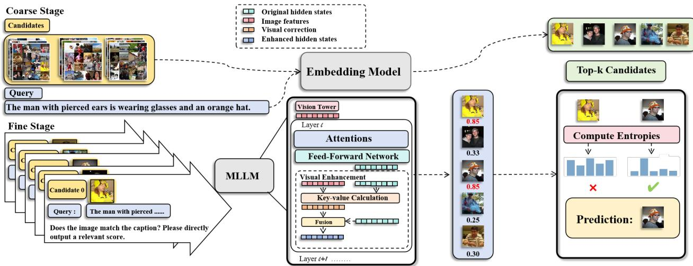
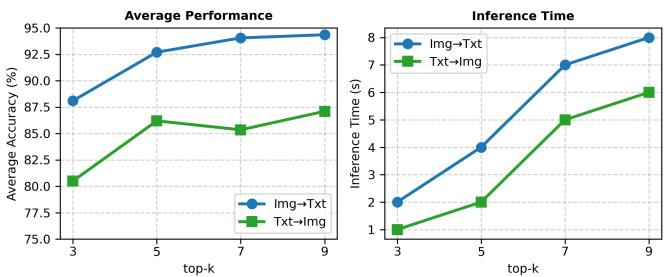

# 1. Bibliographic Information
## 1.1. Title
The title is `RETLLM: Training and Data-Free MLLMs for Multimodal Information Retrieval`. The central topic is developing a fully training- and data-free framework for Multimodal Information Retrieval (MMIR) that leverages the inherent reasoning capability of pre-trained multimodal large language models (MLLMs).

## 1.2. Authors
The authors are Dawei Su and Dongsheng Wang, both affiliated with the College of Computer Science and Software Engineering, Shenzhen University, Shenzhen, China. Their work focuses on multimodal large language models and information retrieval.

## 1.3. Journal/Conference
This work is released as a preprint on arXiv, an open access preprint server widely used by the computer science and artificial intelligence community to share early research. It has not yet been peer-reviewed or published in a formal conference or journal as of the current date.

## 1.4. Publication Year
The preprint was published on 2026-02-25, so the publication year is 2026.

## 1.5. Abstract
This work aims to solve key limitations of existing MLLM-based MMIR methods: pre-training/fine-tuning objective inconsistency, and dependence on large labeled training datasets. The core contribution is RetLLM, a novel training- and data-free framework that reformulates MMIR as a similarity score generation task for prompted pre-trained MLLMs, using a coarse-then-fine pipeline to balance efficiency and accuracy. It also adds a parameter-free visual enhancement module to recover forgotten visual details and an entropy-based tie-breaking strategy to resolve ambiguous rankings. Extensive experiments on standard MMIR benchmarks show that RetLLM outperforms many fine-tuned baseline models even without any training. The work concludes that pre-trained MLLMs have strong inherent multimodal reasoning ability that can be leveraged for high-performance MMIR in a simple, scalable framework.

## 1.6. Original Source Link
Original preprint link: https://arxiv.org/abs/2602.22278; PDF link: https://arxiv.org/pdf/2602.22278. Publication status: Unpublished preprint.

# 2. Executive Summary
## 2.1. Background & Motivation
The core problem addressed in this paper is **Multimodal Information Retrieval (MMIR)**, the task of retrieving relevant candidates (which can be text, image, or mixed content) that match a user query (also any combination of modalities). This problem is increasingly important as multimodal content grows and multimodal large language models become mainstream, with applications in visual search, retrieval-augmented generation, and question answering.

Prior work has two major categories of limitations:
1. Traditional embedding-based methods (like CLIP) use separate modality-specific encoders, and cannot handle complex inputs such as long text or interleaved image-text content.
2. Recent MLLM-based retrieval methods fine-tune MLLMs with contrastive loss, which suffers from two key issues: (a) *Objective misalignment*: MLLMs are pre-trained for autoregressive generation, and contrastive fine-tuning changes the training objective, undermining the model's inherent reasoning ability; (b) *Scalability bottleneck*: Fine-tuning requires large amounts of labeled multimodal training data, which is expensive to collect and computationally heavy, limiting practical deployment.

   The paper's innovative entry point is to avoid fine-tuning entirely, and instead leverage the inherent reasoning ability of pre-trained MLLMs by reformulating MMIR as a prompted similarity score prediction task, resulting in a fully training- and data-free framework.

## 2.2. Main Contributions / Findings
1. **Conceptual contribution**: Demonstrates that pre-trained MLLMs have strong inherent capability for discriminative retrieval tasks, and reformulates MMIR as a similarity score generation task rather than an embedding learning problem.
2. **Methodological contribution**: Proposes RetLLM, a fully training- and data-free framework with a coarse-then-fine pipeline to balance efficiency and accuracy, plus two lightweight, parameter-free auxiliary components: a visual enhancement module to mitigate MLLM visual detail forgetting, and an entropy-based tie-breaking strategy to resolve ambiguous rankings.
3. **Empirical contribution**: Extensive experiments on multiple standard MMIR benchmarks (covering short caption retrieval, long caption retrieval, compositional retrieval, and general multi-task multimodal retrieval) show that RetLLM outperforms most existing zero-shot baselines and even many state-of-the-art fine-tuned MLLM retrieval methods.
4. **Practical contribution**: The framework is fully plug-and-play, and automatically inherits performance gains from improvements to backbone CLIP and MLLM models, making it future-proof and low-cost for deployment.

# 3. Prerequisite Knowledge & Related Work
## 3.1. Foundational Concepts
For beginners, we first explain key foundational concepts:
- **Multimodal Information Retrieval (MMIR)**: A search task where both the user query and the candidate documents can be any combination of modalities (pure text, pure image, or mixed/interleaved image-text content). The goal is to rank candidates by relevance and return the most relevant ones.
- **Multimodal Large Language Model (MLLM)**: A large language model extended to process and understand both text and image inputs, combining the strong reasoning ability of LLMs with visual perception capability. Most MLLMs are pre-trained on large-scale multimodal data for autoregressive text generation conditioned on multimodal inputs.
- **Contrastive Fine-Tuning**: A common training paradigm for retrieval that learns to pull matching query-candidate pairs closer and push non-matching pairs further apart in a shared embedding space. Most existing MLLM-based retrieval methods use this to fine-tune model parameters after pre-training.
- **Training-Free / Zero-Shot**: A setting where pre-trained models are used directly on the target task without any parameter updates (training/fine-tuning) or task-specific training data.
- **Feed-Forward Network (FFN)**: A standard component of Transformer blocks (the core architecture of all modern LLMs/MLLMs) that applies non-linear transformation to hidden states after the self-attention layer.

## 3.2. Previous Works
Key prior studies mentioned in the paper:
1. **CLIP (Contrastive Language-Image Pre-training, 2021)**: The pioneering work for modern image-text retrieval. CLIP trains separate image and text encoders on millions of image-text pairs with contrastive learning, aligning both modalities into a shared embedding space. Similarity between query and candidate is calculated via cosine similarity:
   \$
s = \frac{\mathbf{q}^\top \mathbf{c}}{||\mathbf{q}|| \ ||\mathbf{c}||}
\$
Where $\mathbf{q}$ is the query embedding, $\mathbf{c}$ is the candidate embedding, and $||\cdot||$ is the L2 vector norm. Limitation: CLIP cannot handle complex inputs like long text or interleaved image-text content.
2. **Training-based MLLM embedding methods (E5-V, VLM2Vec, UniME)**: These recent works use MLLMs as universal encoders for all modalities, extract an embedding from the MLLM's output, then fine-tune with contrastive loss on large training datasets. They still suffer from objective misalignment and require large amounts of training data/compute.
3. **MLLM reranking methods**: Some prior work uses MLLMs as rerankers for initial retrieval results, but most still require specialized training (e.g., noise injection training) and are not training-free.
4. **Hallucination mitigation for MLLMs**: Prior work has shown MLLMs often forget fine-grained visual details, leading to hallucinations. The visual enhancement module in RetLLM draws inspiration from existing hallucination mitigation methods, but adapts it to a fully training-free setting.

## 3.3. Technological Evolution
The field of MMIR has evolved through the following stages:
1. Early MMIR: Hand-crafted features for each modality, limited cross-modal matching performance.
2. 2021: CLIP revolutionizes the field with large-scale contrastive pre-training, becoming the standard baseline.
3. 2023-2024: Rise of MLLMs, researchers start adapting MLLMs for MMIR, first as fine-tuned universal encoders, then as trained rerankers. All existing approaches require training.
4. 2026 (this work): Introduces a new paradigm of fully training- and data-free MLLM-based MMIR that uses prompting to leverage pre-trained MLLM reasoning directly, eliminating the need for fine-tuning and training data.

## 3.4. Differentiation Analysis
- Compared to traditional CLIP-based embedding methods: RetLLM leverages the stronger multimodal reasoning and complex input processing capability of MLLMs, outperforming CLIP on all benchmarks, especially for long text and compositional retrieval.
- Compared to training-based MLLM methods: RetLLM requires no training or task-specific data, has no objective misalignment between pre-training and fine-tuning, preserves the full inherent reasoning ability of pre-trained MLLMs, and is fully plug-and-play with new foundation models.
- Compared to existing zero-shot MMIR methods: RetLLM's coarse-then-fine pipeline, visual enhancement, and entropy-based selection deliver significantly better performance than existing zero-shot baselines.

# 4. Methodology
## 4.1. Principles
The core intuition of RetLLM is that pre-trained MLLMs already have strong multimodal understanding after training on massive data, so we do not need to fine-tune them for retrieval. Instead, we can directly prompt the MLLM to act as a judge and output a similarity score between a query and candidate. To avoid the high cost of running MLLM on every candidate in a large corpus, we use a two-stage coarse-then-fine pipeline to balance efficiency and accuracy. We also add two lightweight, parameter-free components to address common MLLM issues (forgetting visual details, ambiguous tied scores).

## 4.2. Core Methodology In-depth (Layer by Layer)
First, we define the problem setup: We have a user query $q$, and a full set of $N$ candidates $\Omega = \{c_1, c_2, ..., c_N\}$. Each $q$ and $c_n$ can be an image, text, or interleaved image-text content. The goal of top-1 retrieval is to find the most relevant candidate $c^*$ for $q$.

### 4.2.1. Stage 1: Coarse Selection via Top-K Semantic Similarity
The first step reduces the full candidate set $\Omega$ (which can have thousands or millions of candidates) to a small high-quality candidate pool $\mathcal{C}$ of size $k$ (default $k=5$ in this work). This avoids the huge cost of running MLLM inference on every candidate.

We use a lightweight embedding model (e.g., CLIP) to extract embeddings for the query and each candidate, then select the top $k$ candidates by cosine similarity:
$$
\mathcal{C} = \mathrm{TopK}(s), \quad s_i = \frac{\mathbf{q}^\top \mathbf{c}_i}{||\mathbf{q}|| \ ||\mathbf{c}_i||}, \quad i = 1, 2, ..., N
$$
Explanation of symbols:
- $\mathbf{q}$: Embedding vector of the query $q$, extracted from the coarse-stage embedding model.
- $\mathbf{c}_i$: Embedding vector of the $i$-th candidate $c_i$, extracted from the same coarse-stage model.
- $s_i$: Cosine similarity between $q$ and $c_i$, ranging from -1 (completely irrelevant) to 1 (perfect match).
- $\mathrm{TopK}(s)$: Function that selects the $k$ candidates with the highest $s_i$ to form the candidate pool $\mathcal{C}$.

  This step is very fast even for large $N$, and filters out all obviously irrelevant candidates, leaving only the most relevant hard candidates for the MLLM to re-score.

### 4.2.2. Stage 2: Fine-Grained Selection with Prompted MLLMs
After getting the small candidate pool $\mathcal{C}$, we prompt the pre-trained MLLM to predict a similarity score for each candidate $c_i \in \mathcal{C}$:
$$
f_i = \mathrm{MLLM}(q, c_i), \quad c_i \in \mathcal{C}
$$
Explanation: The query $q$ and candidate $c_i$ are wrapped in an instruction prompt that asks the MLLM to output a numeric similarity score (e.g., 0 to 10) indicating how well the candidate matches the query. $f_i$ is the final predicted similarity score. Since $k$ is small, this step only requires $k$ MLLM inferences per query, which is efficient.

This step leverages the MLLM's strong fine-grained reasoning ability to distinguish between hard candidates that the coarse embedding model cannot tell apart.

### 4.2.3. Visual Enhancement Module
MLLMs often forget fine-grained visual details from the input image during reasoning, leading to incorrect similarity judgments. To fix this without adding any trainable parameters, RetLLM proposes visual re-injection within the Transformer FFN layers.

First, the standard vanilla FFN is defined as:
$$
\mathrm{FFN}(\mathbf{x}) = \phi(\mathbf{x} \mathbf{W_1}) \mathbf{W_2}^\top
$$
Explanation:
- $\mathbf{x} \in \mathbb{R}^d$: Input hidden state to the FFN, with dimension $d$.
- $\mathbf{W_1}, \mathbf{W_2} \in \mathbb{R}^{d \times D}$: Trainable weight matrices, where $D=4d$ is the standard hidden dimension of FFN in Transformers.
- $\phi$: Non-linear activation function (e.g., ReLU, SiLU).

  We can rewrite the FFN by splitting the weight matrices into individual key and value vectors:
$$
\mathbf{W_1} = (\mathbf{k_1}, \mathbf{k_2}, ..., \mathbf{k_D}), \quad \mathbf{W_2} = (\mathbf{v_1}, \mathbf{v_2}, ..., \mathbf{v_D})
$$
Where each $\mathbf{k_i}, \mathbf{v_i} \in \mathbb{R}^d$ is the $i$-th key and $i$-th value vector, respectively. Substituting back gives:
$$
\mathrm{FFN}(\mathbf{x}) = \sum_{i=1}^D \phi(\langle \mathbf{x}, \mathbf{k_i} \rangle) \cdot \mathbf{v_i}
$$
This shows the FFN acts like a key-value memory network, where the input hidden state $\mathbf{x}$ acts as a query to retrieve relevant values from the FFN's stored weights.

To add supplementary visual information, we introduce the full set of input visual tokens $Z_v = \{z_{v,1}, ..., z_{v,N_v}\}$ (extracted from the input image by the MLLM's vision encoder) as additional key-value entries, and compute a visual correction term:
$$
\Delta(\mathbf{x} \propto Z_v) = \sum_{j=1}^{N_v} \phi(\langle \mathbf{x}, \mathbf{z_{v,j}} \rangle) \cdot \mathbf{z_{v,j}}
$$
Explanation:
- $\langle \mathbf{x}, \mathbf{z_{v,j}} \rangle$: Dot product similarity between the current hidden state $\mathbf{x}$ and the $j$-th visual token $\mathbf{z_{v,j}}$.
- $\Delta(\mathbf{x} \propto Z_v)$: Correction term that adds relevant visual information to the hidden state, based on similarity to the input visual tokens.
- $x \propto Z_v$: Notation indicating visual re-injection is performed, matching the hidden state $x$ to the input visual features $Z_v$.

  Finally, we fuse the vanilla FFN output with the visual correction term for layer $l$:
$$
\mathrm{FFN}^{(l)}(\mathbf{x} \propto Z_v) = \alpha \Delta(\mathbf{x} \propto Z_v) + (1 - \alpha) \mathrm{FFN}(\mathbf{x})
$$
Explanation:
- $\alpha \in [0,1]$: Visual injection ratio hyperparameter, set to 0.3 in all experiments. It controls how much weight is given to the supplementary visual information.
- This operation does not add any trainable parameters, it only reuses the existing input visual tokens during inference, so it works fully training-free. It helps the MLLM recover forgotten fine-grained visual details, reducing hallucination and improving retrieval accuracy.

### 4.2.4. Entropy-Based Decision-Making for Tie-Breaking
The paper empirically finds that multiple candidates often get the same maximum similarity score from the MLLM, leading to ambiguous selection. To resolve this, we use an entropy-based confidence calibration strategy to select the most certain candidate from the tied set.

For each candidate $c_i$ in the tied set $\mathcal{P}$ (all candidates with the same maximum score), we create a new prompt: $<query>, <candidate>. Does the candidate match the query, True or False.$. We feed this to the MLLM and get the output probability distribution $p_v$ over the vocabulary. We then calculate the entropy of the distribution, which measures the model's uncertainty:
$$
H_i = - \sum_{v=1}^V p_v \log p_v
$$
Explanation:
- $V$: Total size of the MLLM's vocabulary.
- $p_v$: Softmax probability of the $v$-th token in the output distribution.
- $H_i$: Entropy of the output distribution. Lower entropy means the model is more certain about the prediction, higher entropy means more uncertainty.

  Finally, we select the candidate with the minimum entropy from the tied set as the final best candidate:
$$
c^* = \arg \min_{c_i \in \mathcal{P}} H_i
$$
Explanation: This strategy selects the candidate the model is most confident about, resolving ambiguous ties with only a small amount of additional inference cost.

The overall RetLLM framework architecture is shown below:

*该图像是示意图，展示了RetLLM框架的工作流程。框架包括粗略阶段的Top $k$ 过滤、视觉增强和基于熵的选择，以实现有效的多模态检索。在细化阶段，输入查询与候选项进行比较，利用MLLM生成相关性评分，最终输出最佳候选。图中包含多个步骤和关键组件，说明了整个检索过程。*

# 5. Experimental Setup
## 5.1. Datasets
The paper evaluates RetLLM on 6 standard MMIR benchmarks covering diverse retrieval tasks:
1. **Flickr30K**: A standard short image-text retrieval benchmark with 31,000 images, each with 5 human-annotated captions. Tests two settings: image query to text candidate retrieval ($qi \to ct$) and text query to image candidate retrieval ($qt \to ci$).
2. **COCO**: A large-scale short image-text retrieval benchmark with 123,000 images, each with 5 captions, same test settings as Flickr30K.
3. **ShareGPT4V**: A long caption retrieval benchmark with high-quality images and long detailed captions, designed to test retrieval with long text inputs.
4. **Urban1K**: Another long caption retrieval benchmark with 1,000 urban scene images and long descriptive captions, tests long text retrieval capability.
5. **SugarCrepe**: A compositional image retrieval benchmark that tests understanding of compositional queries, with three test settings: `Replace` (one attribute replaced), `Swap` (two attributes swapped), `Add` (one attribute added).
6. **MMEB**: A large unified benchmark with 36 diverse multimodal tasks across 4 categories (Classification, VQA, Retrieval, Grounding), with both in-distribution (IND) and out-of-distribution (OOD) test sets, used to evaluate generalizability across tasks.

   All are standard, widely used benchmarks in the MMIR community, so they provide a comprehensive validation of RetLLM's effectiveness across different task types.

## 5.2. Evaluation Metrics
### 5.2.1. Recall@1 (R@1)
1. **Conceptual Definition**: Recall@1 measures the proportion of test queries where the correct relevant candidate is ranked first (i.e., the model correctly selects the correct candidate as its top result). It directly measures the accuracy of top-1 retrieval, which is the core task the paper focuses on.
2. **Mathematical Formula**:
   \$
\text{Recall@1} = \frac{\text{Number of queries where correct candidate is ranked 1st}}{\text{Total number of test queries}}
\$
3. **Explanation**: The value ranges from 0 (all queries wrong) to 1 (all queries correct), and is typically reported as a percentage (0% to 100%).

### 5.2.2. Average Precision@1 (P@1)
1. **Conceptual Definition**: For the MMEB benchmark, Average Precision@1 is the average of Precision@1 across all tasks, where Precision@1 measures the proportion of top-ranked candidates that are correct relevant matches. For top-1 retrieval, it is equivalent to Recall@1 per task.
2. **Mathematical Formula**:
   \$
\text{Average Precision@1} = \frac{1}{M} \sum_{m=1}^M \frac{\text{Number of correct top-1 predictions on task } m}{\text{Total number of queries on task } m}
\$
3. **Explanation**: $M$ is the total number of tasks in the benchmark. The value is reported as a percentage from 0% to 100%.

## 5.3. Baselines
The paper compares RetLLM against the following representative strong baselines, all evaluated under the same zero-shot protocol for fair comparison:
1. Embedding-based baselines: CLIP (ViT-L, ViT-BigG/14), OpenCLIP (ViT-L), EVA-CLIP, SigLIP. These are leading embedding-only zero-shot retrieval methods.
2. MLLM-based baselines: E5-V, VLM2Vec, UniME. These are recent state-of-the-art training-based MLLM embedding methods for retrieval.

   All baselines cover the main categories of existing MMIR methods, so the comparison is fair and comprehensive.

# 6. Results & Analysis
## 6.1. Core Results Analysis
RetLLM achieves strong performance across all benchmarks, outperforming almost all zero-shot baselines and many training-based MLLM methods even without any training. Key observations:
1. On short and long caption retrieval: RetLLM consistently outperforms baselines. For example, on Flickr30K image-to-text retrieval, RetLLM reaches 94.5% Recall@1, surpassing E5-V (88.7%) and VLM2Vec (90.6%). On ShareGPT4V text-to-image retrieval, it gets 94.2% Recall@1, outperforming VLM2Vec (86.9%).
2. On compositional retrieval (SugarCrepe): RetLLM achieves especially large gains, reaching 96.2% on the Add setting, a 2% improvement over VLM2Vec (94.2%), demonstrating its superior reasoning ability for compositional queries.
3. On the large MMEB benchmark: RetLLM obtains 54.2% overall average Precision@1, a 12.6% improvement over the strongest zero-shot baseline UniME (41.6%). It excels across all task categories: 60.3% on classification, 27.8% on VQA, 62.4% on retrieval, showing strong generalizability.

   These results strongly validate that training-free prompting of pre-trained MLLMs can achieve state-of-the-art zero-shot MMIR performance.

## 6.2. Data Presentation (Tables)
The following are the results from Table 1 of the original paper (results on image-text and compositional retrieval):

<table>
<thead>
<tr>
<th rowspan="3">Method</th>
<th colspan="4">Short Caption Retrieval</th>
<th colspan="4">Long Caption Retrieval</th>
<th colspan="3">Compositional Retrieval</th>
</tr>
<tr>
<th colspan="2">Flickr30K</th>
<th colspan="2">COCO</th>
<th colspan="2">ShareGPT4V</th>
<th colspan="2">Urban1K</th>
<th rowspan="2">Replace</th>
<th rowspan="2">Swap</th>
<th rowspan="2">Add</th>
</tr>
<tr>
<th>qi → ct</th>
<th>qt → ci</th>
<th>qi → ct</th>
<th>qt → ci</th>
<th>qi → ct</th>
<th>qt → ci</th>
<th>qi → ct</th>
<th>qt → ci</th>
</tr>
</thead>
<tbody>
<tr>
<td>CLIP(ViT-L)</td>
<td>87.2</td>
<td>67.3</td>
<td>58.1</td>
<td>37.0</td>
<td>81.8</td>
<td>84.0</td>
<td>47.0</td>
<td>47.0</td>
<td>79.5</td>
<td>62.7</td>
<td>74.9</td>
</tr>
<tr>
<td>EEVA-CLIP</td>
<td>93.9</td>
<td>78.8</td>
<td>68.8</td>
<td>51.1</td>
<td>93.1</td>
<td>81.2</td>
<td>80.0</td>
<td>77.0</td>
<td>85.9</td>
<td>70.3</td>
<td>86.7</td>
</tr>
<tr>
<td>E5V</td>
<td>88.7</td>
<td>79.5</td>
<td>62.0</td>
<td>52.0</td>
<td>85.1</td>
<td>82.1</td>
<td>88.9</td>
<td>83.2</td>
<td>86.3</td>
<td>67.6</td>
<td>76.9</td>
</tr>
<tr>
<td>VLM2Vec</td>
<td>90.6</td>
<td>76.0</td>
<td>66.6</td>
<td>46.0</td>
<td>89.8</td>
<td>86.9</td>
<td>91.0</td>
<td>82.4</td>
<td>85.5</td>
<td>64.8</td>
<td>94.2</td>
</tr>
<tr>
<td>UniME</td>
<td>93.4</td>
<td>81.9</td>
<td>70.1</td>
<td>53.7</td>
<td>97.2</td>
<td>93.9</td>
<td>95.9</td>
<td>95.2</td>
<td>89.0</td>
<td>77.6</td>
<td>94.4</td>
</tr>
<tr>
<td>RetLLM</td>
<td>94.5</td>
<td>82.0</td>
<td>70.4</td>
<td>54.1</td>
<td>97.6</td>
<td>94.2</td>
<td>88.9</td>
<td>78.6</td>
<td>94.8</td>
<td>92.7</td>
<td>96.2</td>
</tr>
</tbody>
</table>

The following are the results from Table 2 of the original paper (results on the MMEB benchmark):

<table>
<thead>
<tr>
<th>Models</th>
<th>#Parameters</th>
<th colspan="4">Per Meta-Task Score</th>
<th colspan="3">Average Score</th>
</tr>
<tr>
<th></th>
<th></th>
<th>Classification</th>
<th>VQA</th>
<th>Retrieval</th>
<th>Grounding</th>
<th>IND</th>
<th>OOD</th>
<th>Overall</th>
</tr>
<tr>
<th># of Datasets →</th>
<th></th>
<th>10</th>
<th>10</th>
<th>12</th>
<th>4</th>
<th>20</th>
<th>16</th>
<th>36</th>
</tr>
</thead>
<tbody>
<tr>
<td>CLIP(ViT-L)</td>
<td>0.4B</td>
<td>42.8</td>
<td>9.1</td>
<td>53.0</td>
<td>51.8</td>
<td>37.1</td>
<td>38.7</td>
<td>39.2</td>
</tr>
<tr>
<td>OpenCLIP(ViT-L)</td>
<td>0.4B</td>
<td>41.5</td>
<td>6.9</td>
<td>44.6</td>
<td>53.5</td>
<td>32.8</td>
<td>36.0</td>
<td>36.6</td>
</tr>
<tr>
<td>SigLIP(So/14)</td>
<td>0.9B</td>
<td>40.3</td>
<td>8.4</td>
<td>31.6</td>
<td>59.5</td>
<td>32.3</td>
<td>38.0</td>
<td>35.0</td>
</tr>
<tr>
<td>CLIP(ViT-BigG/14)</td>
<td>2.5B</td>
<td>52.3</td>
<td>14.0</td>
<td>50.5</td>
<td>60.3</td>
<td>38.9</td>
<td>45.8</td>
<td>44.3</td>
</tr>
<tr>
<td>EVA-CLIP</td>
<td>8B</td>
<td>56.0</td>
<td>10.4</td>
<td>49.2</td>
<td>58.9</td>
<td>38.1</td>
<td>45.6</td>
<td>43.7</td>
</tr>
<tr>
<td>E5-V</td>
<td>7B</td>
<td>39.7</td>
<td>10.8</td>
<td>39.4</td>
<td>60.2</td>
<td>34.2</td>
<td>33.4</td>
<td>37.5</td>
</tr>
<tr>
<td>UniME</td>
<td>7B</td>
<td>43.0</td>
<td>17.7</td>
<td>42.5</td>
<td>63.2</td>
<td>37.6</td>
<td>38.6</td>
<td>41.6</td>
</tr>
<tr>
<td>RetLLM</td>
<td>7B</td>
<td>60.3</td>
<td>27.8</td>
<td>62.4</td>
<td>60.2</td>
<td>52.0</td>
<td>50.2</td>
<td>54.2</td>
</tr>
</tbody>
</table>

## 6.3. Ablation Studies / Parameter Analysis
### 6.3.1. Component Effectiveness
The following are the results from Table 3 of the original paper, testing the contribution of each component:

<table>
<thead>
<tr>
<th>Components</th>
<th colspan="2">Flickr30k</th>
<th colspan="2">COCO</th>
</tr>
<tr>
<th></th>
<th>qi → ct</th>
<th>qt → ci</th>
<th>qi → ct</th>
<th>qt → ci</th>
</tr>
</thead>
<tbody>
<tr>
<td>ALL (full RetLLM)</td>
<td>94.5</td>
<td>81.8</td>
<td>69.2</td>
<td>52.1</td>
</tr>
<tr>
<td>entropy only (no visual enhancement)</td>
<td>94.0</td>
<td>81.2</td>
<td>68.7</td>
<td>50.8</td>
</tr>
<tr>
<td>enhancement only (no entropy selection)</td>
<td>94.0</td>
<td>80.7</td>
<td>68.8</td>
<td>51.5</td>
</tr>
<tr>
<td>MLLM only (no components)</td>
<td>93.6</td>
<td>80.2</td>
<td>66.9</td>
<td>50.3</td>
</tr>
</tbody>
</table>

Results show that removing visual enhancement causes a 1.5% performance drop on COCO image-to-text retrieval, confirming its critical role in preserving visual fidelity. Removing entropy-based selection causes a 1.1% drop on Flickr30K text-to-image retrieval, confirming its effectiveness in resolving ambiguous rankings. The full model outperforms all ablated variants, confirming both components contribute to performance.

### 6.3.2. Top-K Sensitivity
The paper tests different values of $k$ (size of the coarse candidate pool): 3, 5, 7, 9. The results are shown below:

*该图像是一个示意图，展示了不同 top-$k$ 值对检索性能和推理效率的影响。左侧为平均性能（Accuracy）随 top-$k$ 的变化，右侧为推理时间（Inference Time）随 top-$k$ 的变化，分别显示了从图像到文本（Img→Txt）和从文本到图像（Txt→Img）的表现。*

Larger $k$ improves retrieval performance but increases inference time, and $k=5$ provides the optimal balance between accuracy and efficiency, which is why it is used as the default.

### 6.3.3. Backbone Scalability
The paper tests different coarse CLIP backbones (Table 4) and different MLLM backbones (Table 5):

<table>
<thead>
<tr>
<th rowspan="2">CLIP-version</th>
<th colspan="2">ShareGPT4V</th>
<th colspan="2">Urban1k</th>
</tr>
<tr>
<th>qi → ct</th>
<th>qt → ci</th>
<th>qi → ct</th>
<th>qt → ci</th>
</tr>
</thead>
<tbody>
<tr>
<td>CLIP-ViT-B</td>
<td>94.8</td>
<td>88.1</td>
<td>84.0</td>
<td>71.8</td>
</tr>
<tr>
<td>CLIP-ViT-L</td>
<td>97.6</td>
<td>94.2</td>
<td>88.9</td>
<td>78.6</td>
</tr>
<tr>
<td>Long-CLIP-L</td>
<td>96.6</td>
<td>95.1</td>
<td>95.2</td>
<td>95.8</td>
</tr>
</tbody>
</table>

<table>
<thead>
<tr>
<th>MLLMs</th>
<th colspan="2">ShareGPT4V</th>
<th colspan="2">Urban1k</th>
</tr>
<tr>
<th></th>
<th>qi → ct</th>
<th>qt → ci</th>
<th>qi → ct</th>
<th>qt → ci</th>
</tr>
</thead>
<tbody>
<tr>
<td>phi3.5v</td>
<td>86.5</td>
<td>72.3</td>
<td>78.9</td>
<td>73.5</td>
</tr>
<tr>
<td>Qwen2-VL</td>
<td>93.8</td>
<td>94.1</td>
<td>87.2</td>
<td>78.2</td>
</tr>
<tr>
<td>Qwen2.5-VL</td>
<td>97.6</td>
<td>94.2</td>
<td>88.9</td>
<td>78.6</td>
</tr>
</tbody>
</table>

Results show that performance consistently improves as the backbone model (CLIP or MLLM) gets stronger and larger. For example, using Long-CLIP (optimized for long text) improves Urban1K text-to-image retrieval from 78.6% to 95.8%. This confirms RetLLM is fully scalable and automatically benefits from advances in foundation models without any retraining.

# 7. Conclusion & Reflections
## 7.1. Conclusion Summary
This paper proposes RetLLM, a novel training- and data-free framework for multimodal information retrieval that leverages the inherent reasoning ability of pre-trained MLLMs. It uses a coarse-then-fine pipeline to balance efficiency and accuracy, with a parameter-free visual enhancement module to mitigate visual detail forgetting and an entropy-based tie-breaking strategy to resolve ambiguous rankings. Extensive experiments show that RetLLM outperforms most existing zero-shot baselines and even many fine-tuned training-based methods, demonstrating that pre-trained MLLMs have strong inherent capability for discriminative retrieval tasks without any fine-tuning. The framework is plug-and-play, low-cost to deploy, and automatically scales with improvements to foundation models.

## 7.2. Limitations & Future Work
The paper does not explicitly state major limitations, but the following natural future directions are implied:
1. **Inference Efficiency**: While the coarse-then-fine pipeline is much more efficient than running MLLM on all candidates, it still requires $k$ MLLM inferences per query, which is slower than pure embedding-based methods for very large corpora. Future work can explore further optimizations like batch scoring of multiple candidates to reduce cost.
2. **Web-Scale Deployment**: The paper evaluates on standard benchmark datasets with relatively small candidate pools; testing and optimizing RetLLM for web-scale corpora with millions of candidates is a promising future direction.
3. **Integration with Multimodal RAG**: RetLLM can be integrated into multimodal retrieval-augmented generation (RAG) systems to improve retrieval quality, which is a high-impact practical application to explore.

## 7.3. Personal Insights & Critique
This work makes an important conceptual contribution to the field of MLLM-based MMIR: it shifts the paradigm from "fine-tune MLLM for retrieval" to "prompt pre-trained MLLM for retrieval", which eliminates the need for training data and fine-tuning, and solves the long-standing problem of objective misalignment between pre-training and fine-tuning. This is a very practical approach, especially for domains where labeled training data is scarce.

One minor potential limitation is that the method relies on the correct candidate being included in the coarse top-k candidate pool: if the correct candidate is filtered out in the coarse stage, the MLLM can never select it. However, this is a common issue for all two-stage retrieval methods, and the paper shows that with $k=5$, the performance is already very good, so this issue is minimal in practice.

The core idea of using prompted pre-trained MLLMs for training-free discriminative tasks can be generalized to many other tasks beyond retrieval, such as multimodal classification, matching, and ranking, so this work opens up a promising new direction for future research, with broad applicability beyond MMIR.